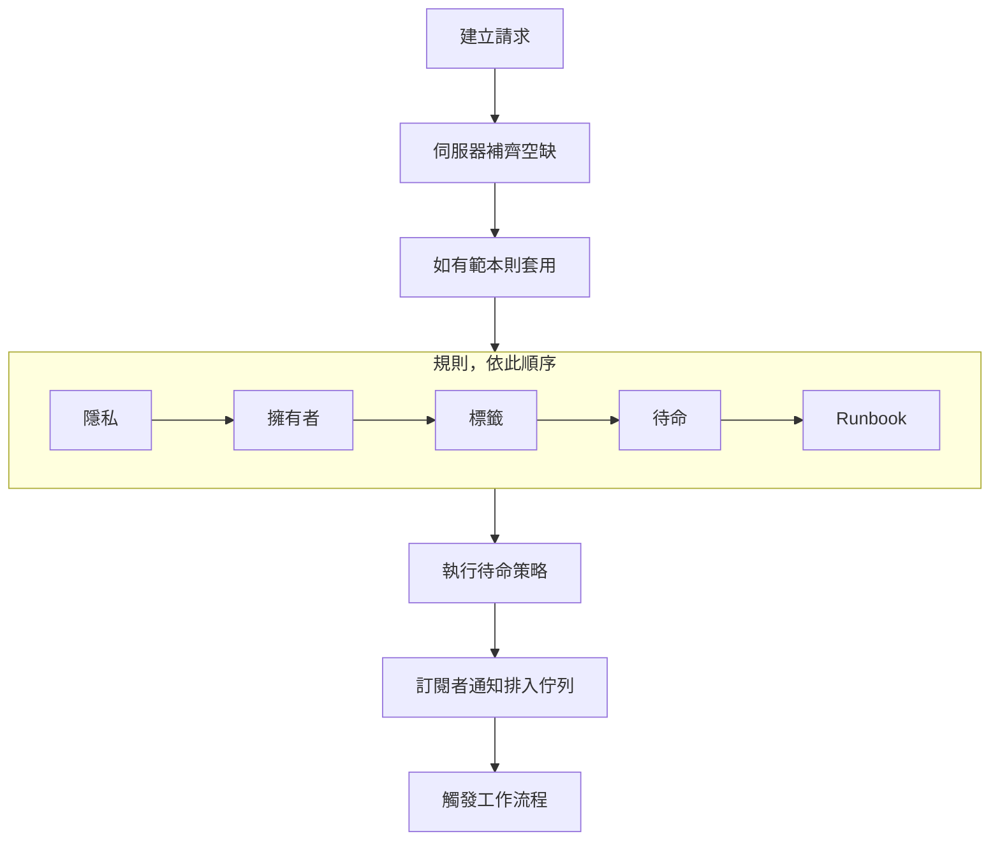
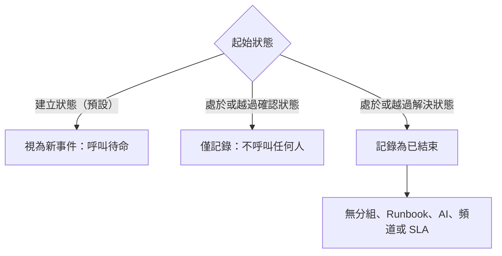

# 宣告事件

宣告事件會建立團隊據以工作的紀錄：它取得一個編號、一個嚴重性和一個起始狀態，它的待命策略會呼叫相關人員，而且——除非你另有指定——狀態頁面訂閱者也會收到通知。本頁逐欄位介紹宣告事件的五種方式，以及事件出現那一刻會發生什麼。

:::cards
- [手動宣告](#手動宣告): 三步驟表單，逐欄位說明。
- [從範本宣告](#從範本宣告): 同一類事件，每次都預先填好。
- [從監測器條件宣告](#從監測器條件自動宣告): 讓失敗的檢查替你建立。
- [透過 API 宣告](#透過-api-宣告): 從你自己的程式碼、指令碼或其他工具。
:::

## 宣告事件的五種方式

事件進入 OneUptime 的方式有五種，最後都落到同一個地方：`Incident` 資料表中的一列，帶有嚴重性、目前狀態和受影響資源清單。差別只在於由誰來填寫欄位——凌晨三點的你、一個已儲存的範本、監測器的條件、呼叫 API 的你自己的程式碼，或填寫表單的團隊外部人員。

| 如果你想……                                                   | 選擇                                                                        |
| ------------------------------------------------------------ | --------------------------------------------------------------------------- |
| 手動建立事件，自己填寫所有內容                               | **宣告事件** 精靈                                                           |
| 建立一類反覆出現的事件，欄位預先填好                         | **從範本建立**                                                              |
| 在監測器檢查失敗時自動建立                                   | 開啟了 **當篩選器相符時，宣告事件。** 的監測器條件篩選器                     |
| 從你自己的程式碼、指令碼或其他工具建立                       | `POST /api/incident`                                                        |
| 讓團隊外部的人透過連結回報問題                               | [表單](/docs/forms/index)                                                   |

五種方式寫入的是同一個模型，因此探針建立的事件和應變人員手動建立的事件看起來完全一樣——只是伺服器會在自動建立的事件上設定幾個記帳用的欄。整合也會寫入它：[Huntress](/docs/integrations/huntress) 會為其 SOC 送來的每份事件報告建立一個事件。

> [!TIP]
> 你也可以從警示宣告事件：在警示清單、警示的頁首或警示的 **已連結的事件** 頁面上使用 **宣告事件**，會開啟同一個精靈，依警示預先填好，並把它們連結到新事件。表單上預設勾選的核取方塊還會確認這些警示，讓它們停止升級。請參閱 [已連結的警示](/docs/incidents/linked-alerts)。

## 手動宣告

**宣告新事件** 表單分三個步驟詢問事件：**事件詳細資訊**、**受影響的資源** 和 **待命與角色**，接著顯示一份供你檢查的摘要。如果你的專案在建立時要求填寫部分事件自訂欄位，那麼在 **受影響的資源** 之後會緊接著出現第四步 **詳細資料**。

:::steps
1. 開啟 **事件 → 所有事件**，點選 **事件** 清單右上角的 **宣告事件**。表單從 **事件詳細資訊** 開始。
2. 輸入 **標題** 並選擇 **事件嚴重性**。表單的其餘部分都是選填的。
3. 點選 **下一步** 走完剩餘步驟，填上你現在知道的內容：監測器和其他資源、待命策略、角色。
4. 閱讀摘要並點選 **宣告事件**。你會進入新事件，它的 **事件 動態消息** 開始記錄。
:::

只有第一步有必填欄位，另外還有管理員標記為 **建立時必填** 的自訂欄位，它們會在 **詳細資料** 步驟中詢問。摘要之前的每一步都只有一般的 **下一步**，**宣告事件** 位於最後一步的摘要上。趕時間時，填好 **事件詳細資訊**，其他步驟什麼都不填直接按 **下一步** 即可：附加資源、新增待命策略和指派角色都可以稍後在事件本身的頁面上完成。在欄位中按 **Enter** 也會前進；在摘要之前它絕不會直接宣告事件。

> [!TIP]
> 大多數事件用不到的選項，都摺疊在各步驟最後的 **更多欄位** 標題下；點選即可展開。摺疊時，標題會列出其中的內容，並顯示每個已設定的選項及其值——例如由範本設定的，或由你正在據以宣告的私人警示設定的——當其中有內容需要修正時，它會自動展開。摘要只在這些選項被設定時才列出它們——**通知狀態頁面訂閱者** 除外，它一律會被列出，並附上誰會收到通知。

**從資源本身的頁面。** 在監測器、主機、服務、叢集或大多數其他資源的 **事件** 分頁上使用 **宣告事件**，會開啟同一個表單，而且該資源已在 **受影響的資源** 中選好，所以只需填寫標題和嚴重性，事件也會顯示在你出發的那個分頁上。

:::details 哪些資源頁面提供它，以及它會選取什麼
在監測器、主機、Kubernetes、Proxmox、Ceph 或 Docker Swarm 叢集、Docker 或 Podman 主機、vCenter、儲存陣列、IoT 裝置群、資料庫或服務的 **事件** 分頁上使用 **宣告事件**，會開啟同一個精靈，而且該資源已在 **受影響的資源** 中選好（監測器放在 **監測器** 下，其他放在 **其他受影響的資源** 下），排在範本新增的任何內容之前。該分頁上的 **從範本建立** 同樣保留該資源。導覽路徑會經由該資源的分頁返回；宣告之後，你會像從事件清單宣告時一樣進入新事件。

清查項目的 **事件** 分頁會選取該項目指向的主機、服務或 Kubernetes 叢集，導覽路徑會經由那個資源的分頁返回。資源 **警示** 分頁上的 **建立警示** 也是同樣的方式：從監測器出發時，它填寫警示的 **監測器**；從其他資源出發時，填寫 **其他受影響的資源**。

資源會以你自己的權限查詢：如果你無法讀取它，或它已被刪除，表單只會在什麼都沒選的情況下開啟。
:::

### 第 1 步——事件詳細資訊

- **標題** —— 必填。一行摘要，所有人都會在清單、Slack，以及（如果事件可見）你的狀態頁面上看到它。預留位置：`Incident Title`。
- **事件嚴重性** —— 必填。專案中設定的嚴重性之一；新專案預設有 **Critical Incident**、**Major Incident** 和 **Minor Incident**。
- **描述** —— 選填，以 Markdown 撰寫。這是會顯示在狀態頁面上的欄位，所以要為客戶而不是為團隊而寫。你放進去的圖片，在事件於狀態頁面上可見時對所有人顯示，在隱藏時只對專案成員顯示。之後可以在事件側邊選單的 **描述** 中編輯。

**更多欄位** 下有：

- **宣告時間** —— 從你開啟頁面的那一刻開始。事件上的所有持續時間都從這個時間戳記開始計算，所以如果你記錄的是更早開始的事情，請把時間往前調。
- **初始狀態** —— 選填，一開始是空的。留空時，事件從帶有 `isCreatedState` 旗標的狀態開始，新專案中預設為 **Identified**——或者，從範本宣告時，從範本的初始狀態開始。只有在記錄一個已經過了那個階段（已確認或已解決）的事件時，才選擇更後面的狀態。這樣的事件不會呼叫任何人——請參閱 [宣告時即已確認或已解決](#宣告時即已確認或已解決)。
- **標籤** —— 選填。標籤把相關事件歸為一組以便篩選，而權限依標籤受限的團隊只能看到帶有其某個標籤的事件。
- **私人事件** —— 核取方塊，預設關閉（`isPrivate`）。私人事件只對其擁有者使用者、擁有者團隊的成員、專案管理員和專案擁有者可見——而且無論其他任何設定如何，它都會在所有狀態頁面上隱藏，包括它被限定到的狀態頁面。事件清單會用紅色的 **Private** 徽章標示這些事件。

> [!NOTE]
> **警示和片段同樣從你選擇的狀態開始。** **建立警示**，以及事件片段和警示片段清單上的 **建立片段**，在 **更多欄位** 下也有同樣的 **初始狀態**。留空時，警示或片段從專案的建立狀態開始。選擇更後面的狀態，可以記錄一個已經確認或解決的警示或片段：它從那個狀態開始，狀態時間軸也從那裡開始，記錄為已解決的片段會立即被視為已解決。它的擁有者不會因為這個初始狀態而另外收到通知，事件片段的狀態頁面訂閱者會在片段建立時收到一次通知。以這種方式記錄的警示或片段不會呼叫任何人，和事件一樣：請參閱 [宣告時即已確認或已解決](#宣告時即已確認或已解決)。透過 API，同樣的選擇對應 `currentAlertStateId` 或 `currentIncidentStateId`——請參閱 [OneUptime API 參考](/docs/api-reference/api-reference)。

:::details 在 Markdown 編輯器中撰寫
描述——與備註、根本原因、補救以及格式化文字自訂欄位一樣——在 Markdown 編輯器中撰寫。它以視覺化模式開啟，顯示格式化後的文字；工具列上的 **Markdown** 切換到 Markdown 模式，顯示 Markdown 原始碼，**Visual** 則切換回來。在清單中，工具列上的 **增加縮排** 和 **減少縮排**，或 Tab 和 Shift+Tab，會把一個項目巢狀到上一個項目之下或再移出來；在沒有可巢狀對象的位置以及清單之外，Tab 照常移到下一個欄位。在視覺化模式下，在一行的中間或結尾使用 **程式碼區塊**、**表格** 和 **工作清單**，會在游標處拆開該行，把新區塊放在單獨的行上——在粗體字、連結或行內程式碼的邊緣也是如此，不會留下空的格式——而在清單項目中使用 **工作清單**，會把工作加到該項目所在的清單，而不是作為子工作。在 Markdown 模式下，**程式碼區塊** 和 **表格** 會插入在游標處，所以先換一行；**工作清單** 會把游標所在的行變成工作，**編號清單** 會讓巢狀清單的每一層都從 1 開始編號。工具列維持在一行：帶有編輯器的表單會在寬的對話方塊中開啟，所以在大多數螢幕上每個按鈕都放得下；放不下時——在手機上或窄視窗中——放不下的按鈕會依同樣的順序收進工具列最後的 **更多格式**（**⋯**）下，你在那裡選擇的每一項都會插入到游標原本所在的位置。在最窄的螢幕上，**Markdown** 開關也會移到它下面。

**復原。** 在視覺化模式下，Ctrl+Z（Mac 上為 Cmd+Z）會從最新的開始逐一復原你的變更——包括你輸入的內容和編輯器自己的編輯：增加或減少縮排、插入行中的區塊、帶格式或區塊式的貼上——Ctrl+Shift+Z（Cmd+Shift+Z）或 Ctrl+Y 會依同樣的順序重做。在 Markdown 模式下，Ctrl+Z 會復原增加或減少縮排、清單按鈕的變更和帶格式的貼上，但不會復原 **程式碼區塊**、**表格** 和 **水平線** 按鈕插入的內容。

**貼上到其中。** 從 Word、Google Docs 或 OneUptime 頁面（例如另一個事件的描述）貼上，會保留清單及其巢狀、連結和格式，貼上的 `•` 項目符號會變成真正的清單。只有圖示的連結，例如 GitHub 上標題旁的錨點，會被去除。在視覺化模式下，貼到一行中的程式碼或引言會拆開該行，成為獨立的區塊；貼到清單項目中的清單會加入該項目所在的清單，而不是巢狀在其中——貼到按 Enter 留下的空項目中時，會取代那個空項目——而貼到清單項目中的程式碼區塊、引言或表格會留在該項目之內。在 Markdown 模式下，貼上內容中會成為區塊的部分——程式碼、引言、清單、標題、多個段落——落在一行中間時，會單獨成行，前後各留一個空行；貼在清單項目行尾或單獨的 `- ` 之後的清單，會以該項目的縮排加入那個清單；以純文字複製的 Markdown 會原樣插入在游標處。貼到程式碼區塊內部的任何內容都會保持複製時的原樣。在跨越多個項目、段落或表格儲存格的選取範圍上貼上，會像輸入一樣取代選取範圍。在視覺化模式下，在表格儲存格上貼上或使用 **代碼** 按鈕會保留每個儲存格和每一欄，貼上不會留下空的項目符號、引言或程式碼區塊；當選取範圍結束於程式碼區塊內部時，只有那行程式碼的剩餘部分會併入文字。

**從備註中複製。** 從備註或描述中複製的程式碼區塊，貼回來時仍是該語言的程式碼區塊；連同換行字元複製的一行程式碼也是如此，就像在 Chrome、Edge 和 Safari 中連按三下複製那樣。從程式碼區塊中複製出的一個字或一行的一部分，會貼上為行內程式碼。在 Chrome、Edge 和 Safari 中，從以表格形式繪製的程式碼檢視（Kubernetes 資源的 YAML 分頁、例外狀況堆疊追蹤的各個框架）中複製的行，會貼上為純文字並保留縮排。
:::

### 第 2 步——受影響的資源

監測器單獨放在最前面，因為狀態頁面是透過監測器看到事件的；監測器要變成的狀態就緊挨在它下面。

- **監測器** —— 一個搜尋方塊，用來附加事件影響的監測器；它的 **標籤** 分頁會一次新增帶有某個標籤的所有監測器。當狀態頁面列出事件的某個監測器時，它會顯示該事件並通知其訂閱者，所以決定哪些狀態頁面得知此事的正是這些監測器（事件上的 `monitors`）。
- **將監測器狀態變更為** —— 選填，只有在至少選了一個監測器後才會顯示。選擇一個監測器狀態，套用到附加到這個事件的每個監測器，這樣宣告事件和把監測器標記為降級就是一次操作而不是兩次。從設定了狀態的範本宣告時，會從範本的狀態開始，一選監測器就會顯示。沒有選取監測器時不會儲存任何狀態，包括範本的狀態；移除最後一個監測器後該欄位會消失，直到你再選一個，你先前的選擇會回來。監測器的狀態由列出它的每個狀態頁面共用，所以如果在 **更多欄位** 下選了狀態頁面，表單會提醒你，這個變更也會顯示在你沒有選的頁面上。
- **其他受影響的資源** —— 第二個搜尋方塊，用於事件影響的其他一切：主機、Kubernetes 叢集、Docker 和 Podman 主機、Proxmox、Ceph 和 Docker Swarm 叢集、vCenter、儲存陣列、IoT 裝置群、資料庫和服務——也就是事件本身的 **受影響的資源** 卡片所提供的、監測器以外的一切。在底層，這些是事件上各自獨立的關聯（`hosts`、`kubernetesClusters`、`dockerHosts`、`podmanHosts`、`services` 等），但表單把它們合併成一個選擇器。

監測器可以說明它監測的是什麼——**監測器 → 概覽 → 已連結的資源**，資源種類與 **其他受影響的資源** 相同。選擇這樣的監測器，它所連結的內容會立即新增到 **其他受影響的資源** 中，欄位下方的一行會說明新增了什麼。在宣告之前移除你不需要的內容：只要你還停留在表單上，就不會再為該監測器重新新增任何內容，而移除監測器會保留它新增的內容。監測器來自範本或來自你據以宣告的頁面時也是如此，**建立警示** 和 **Schedule Maintenance** 中也一樣。

之後編輯事件的 **受影響的資源** 卡片時，詢問方式相同：**監測器**、有監測器時的 **將監測器狀態變更為**，接著是 **其他受影響的資源**。儲存一個不再有任何監測器的事件時，會保留它原有的狀態。

**更多欄位** 下有：

- **僅限這些狀態頁面** —— 選填。留空時，事件會顯示在列出其監測器的每個狀態頁面上，並通知它們的訂閱者。在這裡選擇頁面後，只會使用其中被選取的頁面；**標籤** 分頁會一次新增帶有某個標籤的所有頁面。當選取的頁面沒有列出事件的任何監測器，或者事件是私人的（這會讓它在所有狀態頁面上隱藏）時，表單會發出警告。請參閱 [每個受眾一個狀態頁](/docs/status-pages/one-status-page-per-audience)。
- **通知狀態頁面訂閱者** —— 核取方塊，預設開啟。控制是否就事件的建立通知訂閱者（`shouldStatusPageSubscribersBeNotifiedOnIncidentCreated`）。把它摺疊在 **更多欄位** 下不會改變它的作用：它仍然預設勾選，摘要也一律會列出它。在它下方，以及送出前的摘要上，**Will notify** 會列出將收到通知的狀態頁面，每個管道附上「最多」訂閱者數量，以及不會收到通知的頁面和原因。當沒有人會收到通知時（沒有附加監測器、沒有狀態頁面列出這些監測器，或頁面還沒有訂閱者），它什麼也不顯示，只有當原因是事件的狀態頁面範圍時才會發出警告。在摘要上，**是** 旁邊的 **預覽** 會顯示每個狀態頁面的訂閱者將收到的電子郵件，**傳送測試郵件給我** 會把它傳送到你自己的帳戶電子郵件；請參閱 [訂閱者與公告](/docs/status-pages/subscribers#事件)。對於你仍想記錄下來的內部瑣事，可以關閉它。這樣事件預設就保持安靜：它上面的新公開備註，以及概覽頁面上的狀態變更對話方塊（**確認**、**解決** 或選擇其他狀態），各自的 **通知狀態頁面訂閱者** 核取方塊都會以關閉狀態開始。**狀態時間軸** 頁面上的手動表單和事件清單中的批次 **變更狀態** 操作仍然以開啟狀態開始。

> [!IMPORTANT]
> **即使覺得多餘，也要附加監測器。** 事件與狀態頁面之間的關聯要經過事件的監測器：當狀態頁面的某個資源是事件的監測器之一時，狀態頁面會顯示該事件並通知其訂閱者。**僅限這些狀態頁面** 只能縮小這份清單，不能擴大它，而開啟了 **僅顯示限定到此頁面的事件** 的狀態頁面只會顯示限定到它的事件。沒有附加任何監測器的事件完全不會通知任何狀態頁面訂閱者。請參閱 [狀態頁資源與群組](/docs/status-pages/resources-and-groups)。

**Should be visible on status page?** 旗標（`isVisibleOnStatusPage`）不在精靈中；預設為 true。之後可以在事件側邊選單的 **設定** 中變更它，在那裡它的標籤是 **於狀態頁面可見**。

**先隱藏宣告，稍後發布。** 建立時就在狀態頁面上隱藏的事件不會通知任何訂閱者，其通知狀態顯示為 **已略過：在狀態頁面上隱藏**。之後開啟 **於狀態頁面可見** 時，編輯表單會提供 **通知訂閱者此事件已建立**，因此「先隱藏宣告、釐清影響範圍、再發布」的流程仍然能通知到訂閱者。事件未解決時它預設勾選，事件解決後預設不勾選，所以為了留存紀錄而發布一個舊事件時，不會把它當成新事件來宣布。只有當事件在宣告時開啟了 **通知狀態頁面訂閱者** 且不是私人事件時，才會提供它——因此透過 [表單](/docs/forms/on-submit) 回報的事件不會提供它，因為這類事件是在關閉通知的情況下隱藏宣告的。透過 API，在把 `isVisibleOnStatusPage` 設為 `true` 的更新中一併傳送 `"miscDataProps": {"notifySubscribersOfIncidentCreatedOnPublish": true}`，或自行把 `subscriberNotificationStatusOnIncidentCreated` 設回 `Pending`。事件隱藏期間發布的事後分析不需要核取方塊：開啟 **於狀態頁面可見** 時會傳送一次，如 [訂閱者與公告](/docs/status-pages/subscribers#事件) 所述。

### 詳細資料——你的事件自訂欄位

只有當至少一個事件自訂欄位在 **事件 → 設定 → 自訂欄位** 中開啟了 **建立時顯示**——或者，從範本宣告時，範本的 **建立時的自訂欄位** 要求填寫某個欄位——時，才會出現這一步。它依這些欄位的 **順序**（也就是在那個設定頁面上拖曳排定的順序）詢問它們，使用與類型相符的輸入方式——下拉式選單、數字、日期、是/否開關、長文字，或 Markdown 編輯器中的格式化文字。對於無法讀取專案事件自訂欄位的人，這一步也不會出現：在 OneUptime Cloud 上，這需要 **Growth** 或更高的方案，以及可以檢視事件自訂欄位的角色。

- 標記為 **建立時必填** 的欄位必須填寫後才能宣告。必填的是/否欄位——例如一項確認——必須開啟。
- 0 或保持關閉的開關也是答案，並會作為答案儲存。
- 值從監測器自訂欄位複製而來的欄位，在事件有監測器時不會被詢問，因為事件建立時會從監測器複製該值。
- 從範本宣告時，這一步以範本的值開始，而這一步不詢問的欄位，其範本值維持不變。你在這一步清除的值會保持清除。不再符合其欄位的範本值——例如後來被移除的下拉選項——會被略過，而不是拒絕建立事件。
- 從範本宣告時，還會遵循範本的 **建立時的自訂欄位**。被標記為 **必填** 或 **選填** 的欄位即使專案在建立時不顯示也會被詢問，被標記為 **隱藏** 的欄位不會被詢問——該欄位的範本值仍然適用——而保持 **預設** 的欄位遵循它自己的 **建立時顯示** 和 **建立時必填**。請參閱 [建立時的自訂欄位](/docs/incidents/settings#建立時的自訂欄位)。

只有儀表板會檢查 **建立時必填**，範本的 **建立時的自訂欄位** 也是如此。由監測器、API、Slack、Microsoft Teams 或 AI 建立的事件可以讓欄位留空，而且事件建立後，它的 **自訂欄位** 頁面上每個欄位都保持選填，所以在中斷進行中修正一個值時，絕不會要求你填寫其他所有欄位。欄位類型和設定請參閱 [自訂欄位](/docs/incidents/settings#自訂欄位)。

### 第 3 步——待命與角色

- **待命策略** —— 多選，選擇這個事件建立時要執行的待命策略。對應事件上的 `onCallDutyPolicies`。
- **指派事件角色** —— 專案定義的每個角色由誰擔任，每個角色一張卡片。帶有 **主要** 標記的角色如果留空，就歸你：事件宣告時由你擔任，摘要中也會這樣顯示。只能由一人擔任的角色在選定人選後會顯示出來；可由多人擔任的角色會保留其選擇器。

這是把待命策略直接附加到事件上的唯一位置。嚴重性不帶有待命策略——嚴重性是一個標籤，它只能作為待命規則中的 *比對條件* 影響呼叫。在 **事件 → 規則 → 待命規則** 中設定的規則，會在你這裡選擇的內容之上再加上它們的策略；最終執行的集合是兩者的聯集並去除重複。以更後面的狀態宣告的事件不會執行其中任何一個——請參閱 [宣告時即已確認或已解決](#宣告時即已確認或已解決)。

角色本身在 **事件 → 設定 → 事件角色** 中設定。新專案有一個角色：事件指揮官；在那裡新增 Responder、Communications Lead 或你的流程需要的其他角色。如果你沒有為事件指揮官選擇任何人，事件宣告時就由你擔任。

## 從範本宣告

如果你一再宣告同一形態的事件——同樣的標題格式、同樣的嚴重性、同樣的待命策略——就把它儲存為範本，再從範本宣告：

:::steps
1. 在 **事件** 清單上，點選 **從範本建立**（**宣告事件** 旁的外框按鈕）。會開啟一個 **從範本建立事件** 對話方塊，其中有一個 **選擇事件範本** 下拉式選單。
2. 選擇一個範本。建立表單會以預先填好的狀態開啟。
3. 修改這次不同的內容，然後像平常一樣走完各步驟並宣告。
:::

如果專案還沒有範本，你會看到一個 **No Incident Templates** 對話方塊，其中的 **Create Template** 按鈕會帶你前往 **事件 → 設定 → 事件範本**。

範本透過它自己的四步驟精靈建構——**範本資訊**、**事件詳細資訊**、**受影響的資源**、**待命**——當專案有事件自訂欄位時，在 **受影響的資源** 之後還有 **自訂欄位** 和 **建立時的自訂欄位** 步驟。範本的 **初始事件狀態**、**擁有者** 和 **標籤** 位於 **事件詳細資訊** 最後的 **更多欄位** 下。**受影響的資源** 的詢問方式與宣告表單相同——**監測器**，接著是 **將監測器狀態變更為**，再來是 **其他受影響的資源**，**僅限這些狀態頁面** 位於 **更多欄位** 下——只是範本一律會詢問監測器狀態：它也適用於從範本宣告事件時所選的監測器。欄位如下：

| 欄位                            | 用途                                                   |
| ------------------------------- | ------------------------------------------------------ |
| **範本名稱**                    | 在選擇器中識別範本的名稱。                             |
| **範本描述**                    | 寫給未來的自己，說明何時使用它。                       |
| **標題**                        | 預先填入事件的標題。                                   |
| **描述**                        | 預先填入事件的 Markdown 描述。                         |
| **事件嚴重性**                  | 預先填入事件的嚴重性。                                 |
| **初始事件狀態**                | 來自這個範本的事件開始時所處的狀態。留空則為一般的起始狀態。以已確認或已解決狀態開始的事件不會呼叫任何人。 |
| **監測器**                      | 要附加的監測器。                                       |
| **將監測器狀態變更為**          | 套用到事件監測器（包括宣告時選擇的監測器）的監測器狀態。 |
| **其他受影響的資源**            | 要附加的主機、叢集和服務。                             |
| **僅限這些狀態頁面**            | 事件被限定到的狀態頁面。                               |
| **待命策略**                    | 事件建立時要執行的策略。                               |
| **擁有者**                      | 擁有由這個範本建立的事件的人員和團隊，從同一份清單中選擇。 |
| **標籤**                        | 套用到事件的標籤。                                     |
| **自訂欄位**                    | 事件自訂欄位的值。                                     |
| **建立時的自訂欄位**            | **詳細資料** 步驟詢問哪些自訂欄位，以及哪些必須填寫。  |

幾條簡單規則：

- 範本無法在範本清單中編輯——你先建立一個，然後開啟它進行修改。
- 範本只會填寫你留空的欄位。在建立頁面上，範本作為可以覆寫的預先填寫內容套用；在伺服器上——對於從範本宣告的表單——只有當請求讓某個欄位保持 `undefined` 時，才會從範本填寫該欄位。呼叫端提供的任何內容一律優先。
- **詳細資料** 步驟遵循範本的 **建立時的自訂欄位**，如 [上文所述](#詳細資料你的事件自訂欄位)。
- 自訂欄位值逐欄位合併。範本的值會填寫事件宣告時缺少的自訂欄位；在 **詳細資料** 步驟中設定的值，或在請求的 `customFields` 中傳送的值，一律優先——包括 `0`、`false` 和 `null`。從監測器自訂欄位複製的欄位仍然取用監測器的值。
- 現有範本的自訂欄位值位於它的 **自訂欄位** 卡片上，與它的其他卡片並列。
- 範本的 **擁有者** 會在事件的 Slack 和 Microsoft Teams 頻道存在之後才新增，因此邀請事件擁有者加入新頻道的通知規則也會邀請他們。在儀表板中從範本宣告時，新增他們不會發出「你已被新增」的通知；帶有範本的 [表單](/docs/forms/on-submit) 會通知他們，並把事件的 **事件已建立** 通知延後到他們被新增之後，這樣通知會傳給他們而不是專案擁有者。

## 從監測器條件自動宣告

大多數事件不應該需要人來輸入。監測器的條件可以在篩選器相符的那一刻宣告事件：

:::steps
1. 開啟監測器，在其側邊選單中選擇 **條件**，然後點選 **Edit Monitoring Criteria**。（新建監測器時，會在建立過程中詢問同樣的條件。）
2. 在應該宣告事件的條件篩選器中，開啟 **當篩選器相符時，宣告事件。**。會出現一個帶有 **新增事件** 按鈕的 **建立事件** 區段——一個條件篩選器可以宣告多個事件。
3. 填寫事件的欄位（見下文）並儲存。下次篩選器相符時，事件就會被宣告並呼叫它的待命策略。
:::

每個事件項目包含：

- **事件標題** —— 支援範本；預留位置的範例類似 `{{monitorName}} is down`。
- **嚴重程度** —— 必填。
- **事件描述** —— 同樣支援範本。
- **待命 → 待命策略** —— 這個事件建立時執行的策略。
- **事件角色** —— 事件上的每個角色由誰擔任，在與宣告表單上 **指派事件角色** 相同的卡片中選擇，每個角色一張。當專案有事件角色時顯示。
- **擁有權與標籤 → 擁有者**（人員和團隊，從同一份清單中選擇）、**標籤**。
- **更多欄位 → 自動解決事件**（當條件不再相符時自動解決事件）、**在狀態頁面上顯示事件**、**私人事件** 和 **補救備註**。

標題、描述和補救備註中可用的 `{{variable}}` 預留位置完整清單，請參閱 [事件與警示範本](/docs/monitor/incident-alert-templating)。

以這種方式建立的事件會被伺服器加上標記：設定 `isCreatedAutomatically`，`createdCriteriaId` 記錄是哪個條件篩選器觸發的，`createdByProbe` 記錄是哪個探針發現的。除此之外，它們的一切行為都與手動宣告的事件完全相同。

監測器宣告的事件會連結到監測器所監測的對象：它的設定所指明的（主機監測器的主機、Kubernetes 監測器的叢集、記錄監測器的服務），以及它 **已連結的資源** 下的一切。網站或 API 監測器的設定不指明任何基礎設施，所以請把它連結到網站背後的叢集、主機或資料庫：這樣它的事件就會出現在那些資源的頁面上，OneUptime AI 可以在那裡調查它們，叢集或資源的 AI 修正也可以對它們生效（請參閱 [AI SRE](/docs/ai/ai-sre#which-incidents-a-clusters-fixes-act-on)）。監測器建立的警示也以同樣的方式連結。

## 透過 API 宣告

事件模型提供標準的 CRUD 端點，所以 `POST /api/incident` 就能建立事件。使用在 **專案設定 → 進階 → API 金鑰** 中產生的 API 金鑰進行驗證，放在 `apikey` 標頭中傳送——金鑰本身就識別了專案，所以你不需要另外傳遞專案 ID。

```bash
curl -X POST https://oneuptime.com/api/incident \
  -H "apikey: $ONEUPTIME_API_KEY" \
  -H "Content-Type: application/json" \
  -d '{
    "data": {
      "title": "Checkout latency above SLO",
      "description": "Investigating elevated p99 latency on the checkout service.",
      "incidentSeverityId": "<incident-severity-id>"
    }
  }'
```

請求本文中有用的欄位：

| 欄位                     | 必填   | 說明                                                                                                                                                                                                                                        |
| ------------------------ | ------ | ------------------------------------------------------------------------------------------------------------------------------------------------------------------------------------------------------------------------------------------- |
| `title`                  | 是     | 事件的標題。                                                                                                                                                                                                                                |
| `incidentSeverityId`     | 是     | 專案的嚴重性之一。伺服器會檢查它是否與 API 金鑰屬於同一專案，如果不是則拒絕請求。                                                                                                                                                          |
| `declaredAt`             | 否     | 雖然表單要求填寫，這裡卻是選填的。省略時伺服器使用目前時間。                                                                                                                                                                               |
| `currentIncidentStateId` | 否     | 起始狀態；省略時為建立狀態。與嚴重性一樣，會對照 API 金鑰的專案進行檢查。**將監測器狀態變更為** 背後的監測器狀態也適用同樣的檢查。                                                                                                        |
| `statusPages`            | 否     | 要將事件限定到的狀態頁面 ID，必須都來自同一個專案。省略時會觸及列出該事件監測器的每個狀態頁面。`isScopedToStatusPages` 由它推算得出，為該欄位傳送的值會被忽略。請參閱 [每個受眾一個狀態頁](/docs/status-pages/one-status-page-per-audience)。 |
| `customFields`           | 否     | 事件的自訂欄位值，以各欄位的名稱為鍵。你傳送的每個值都必須符合其欄位——**數字** 欄位要用數字，**下拉式選單（單選）** 要用其中一個選項——否則請求會以指明該欄位的 `400` 錯誤被拒絕。這裡不檢查 **建立時必填**。請參閱 [透過 API 設定自訂欄位值](/docs/incidents/settings#透過-api-設定自訂欄位值)。 |

API 金鑰不能從範本宣告：傳送 `createdIncidentTemplateId` 的請求會被拒絕。這一欄由 OneUptime 自己設定，用於透過 [表單](/docs/forms/on-submit) 回報的事件，以及工作流程的 **Create One Incident** 步驟——它會根據其 **Incident Template** 設定中選擇的範本進行宣告（請參閱 [工作流程元件](/docs/workflows/components)）。要透過 API 從範本宣告，請從 `/api/incident-templates` 讀取範本，並在請求中傳送它的值。

相關端點有 `/api/incident-state`、`/api/incident-severity` 和 `/api/incident-state-timeline`。產生的 [API 參考](/reference) 列出了每個端點確切的請求和回應結構，包括監測器等關聯欄位的表示方式。

## 透過表單回報

第五種方式是給團隊外部的人。表單是你以連結分享的頁面：任何拿到連結的人都可以在沒有 OneUptime 帳戶的情況下回報問題，每次送出都會宣告一個事件。你決定表單詢問什麼——標題、描述、嚴重性、監測器、自訂欄位、你自己的問題——以及答案如何變成事件：預設嚴重性、據以宣告的事件範本，以及一律要新增的監測器、標籤、待命策略和擁有者。

以這種方式回報的事件會在狀態頁面上隱藏、並在關閉 **通知狀態頁面訂閱者** 的情況下宣告，這樣應變人員可以在任何內容公開之前先進行分級，一則私人備註會記錄是誰回報的。表單是一個獨立的產品，位於 **產品** 選單的 **表單** 下，也可以排定維護事件；請參閱 [表單](/docs/forms/index)。

## 事件編號與前綴

每個事件都會從專案層級的計數器取得一個連續編號，由伺服器在建立時指派。編號儲存在兩個欄中：`incidentNumber`（原始整數）和 `incidentNumberWithPrefix`（你實際看到的）。沒有設定前綴時，顯示值為 `#42`。

:::steps
1. 前往 **事件 → 設定 → 編號前綴** 並點選 **更新**。
2. 在 **事件編號前綴** 中輸入前綴。欄位會在你輸入時預覽編號：`INC-` 會讓它變成 `INC-42`。留空則保留預設的 `#`。
3. 點選 **儲存變更**。之後宣告的事件會使用新前綴；現有事件保留它們的編號。
:::

同一個對話方塊中還有用於片段編號的 **事件片段編號前綴**。前綴遵循的規則列在 [編號前綴](/docs/incidents/settings#編號前綴) 中。

編號顯示在事件清單的第一欄，連結到事件，並以 **事件編號** 顯示在事件的 **概覽** 上。

## 事件被宣告的那一刻會發生什麼

建立呼叫所做的不只是寫入一列：



依序：

1. **伺服器補齊空缺。** `declaredAt` 預設為現在，目前狀態預設為專案中帶有 `isCreatedState` 的狀態，事件編號和帶前綴的編號從專案計數器指派。
2. **套用範本**，當表單或工作流程的 **Create One Incident** 步驟從範本宣告事件時（`createdIncidentTemplateId`）——只填寫呼叫端未定義的欄位；呼叫端指定的狀態優先於範本的狀態。儀表板則是在傳送請求之前，在表單中套用範本。
3. **執行隱私規則**，當相符的規則如此指定時，把事件標記為私人。這是第一個執行的規則引擎，所以之後的一切都會看到正確的隱私設定。
4. **執行擁有者規則**，新增相符規則所指定的擁有者使用者和團隊。
5. **執行標籤規則**，新增與事件相符的標籤。
6. **執行待命規則。** **事件 → 規則 → 待命規則** 中每條條件相符的已啟用規則，都會把它的策略新增到事件上。沒有優先順序，也不會中途短路——所有相符的規則都會觸發，策略會去除重複。
7. **執行 Runbook 規則**，附加並啟動相符的 Runbook。請參閱 [Runbook 概觀](/docs/runbooks/index)。
8. **執行待命策略。** 事件上的每個策略——在精靈中選擇的、從範本繼承的或由規則新增的——都會以事件類型 `IncidentCreated` 平行執行。一個策略失敗不會阻止其他策略。已封存的策略不會呼叫任何人：它在事件上的執行記錄會說明，由於策略已封存，所以沒有執行。宣告時即已確認或已解決的事件不會執行其中任何一個；請參閱下文的 [宣告時即已確認或已解決](#宣告時即已確認或已解決)。
9. **訂閱者通知排入佇列**，前提是 **通知狀態頁面訂閱者** 保持開啟，且事件在狀態頁面上可見。傳送由背景工作處理，而不是隨你的請求同步進行，並傳往事件所觸及的狀態頁面：列出其監測器的頁面，經 **僅限這些狀態頁面** 縮小範圍；如果事件未被限定，還會去掉那些只顯示限定到自身之事件的頁面。已封存的狀態頁面不傳送任何內容。進度顯示在事件 **概覽** 上的 **訂閱者通知狀態** 中：每個狀態頁面上傳送了什麼、失敗了什麼，以及完成後的 **重試** 或 **重新傳送**。請參閱 [訂閱者與公告](/docs/status-pages/subscribers)。
10. **觸發工作流程。** **On Create Incident** 觸發器會啟動以它建構的任何工作流程。請參閱 [工作流程概觀](/docs/workflows/index)。

從這時起，事件就處於進行中：它計入事件側邊選單中的 **進行中事件** 徽章（位於已解決狀態之上的任何狀態都算作進行中），它會出現在帶有其某個監測器的狀態頁面上（如果你做了限定，則只出現在所選頁面上），它的 **狀態時間軸** 開始記錄。

### 宣告時即已確認或已解決

選擇一個更後面的 **初始狀態**——在表單上、透過範本的 **初始事件狀態**，或透過 API、Terraform 或工作流程的 `currentIncidentStateId`——記錄的是一個已經有人在處理或已經結束的事件。它不會被當作新的緊急情況：



- **處於或越過確認狀態** —— **已確認**，或在 **事件 → 設定 → 事件狀態** 中放在它下面的任何狀態——不會執行任何待命策略，因此不會呼叫任何人。事件仍會列出它的策略，包括你選擇的和待命規則新增的，它的動態會用一行說明原因：_No one was paged. This incident was created already acknowledged, so its on-call policy **Primary** was not run._ 如果有規則為它設定了 SLA，該 SLA 會以已回應的狀態開始。下文中的其他一切照常執行，和任何新事件一樣。
- **處於或越過解決狀態** —— **已解決**，或放在它下面的任何狀態——事件已經結束，所以在此基礎上，任何因應進行中事件的東西都不會執行：
  - 它不會被歸入片段，因為那可能會再次呼叫；
  - 不會有 Runbook 規則或自動補救規則作用於它；
  - OneUptime AI 不會調查它——它的 **AI Investigation** 卡片會說明它建立時就已解決，而下方的 **Ask OneUptime AI** 仍會回答關於它的問題；
  - 不會為它建立 Slack 或 Microsoft Teams 頻道；
  - 無論 **將監測器狀態變更為** 如何設定，它的監測器都會維持其狀態並繼續被監測；
  - 不會為它啟動 SLA。
- **仍然會發生的事：** 隱私、擁有者、標籤和待命規則會執行，它的擁有者會被新增並得知它已建立，**已建立事件** 項目會寫入它的動態並發布到你的規則所指定的 Slack 和 Microsoft Teams 頻道，而且當 **通知狀態頁面訂閱者** 開啟且事件顯示在其狀態頁面上時，狀態頁面訂閱者會收到通知。一個已經結束的事件，對他們來說仍然是新消息。

警示、警示片段和事件片段遵循同樣的規則：建立時即已確認的不會呼叫任何人，建立時即已解決的也不會被分組、補救或由 AI 調查，也不會取得自己的頻道。處於建立狀態的事件或警示——預設情況，以及監測器建立的每一個——會像以前一樣觸發一切。

## 疑難排解

:::details 宣告失敗，並要求新增建立狀態
如果你的專案沒有帶 `isCreatedState` 旗標的狀態，建立呼叫會失敗，並提示你從設定中新增一個建立狀態。這通常只會發生在狀態被大量編輯過的專案上——請參閱 [事件狀態與嚴重程度](/docs/incidents/states-and-severities)。
:::

:::details 事件已宣告，但沒有狀態頁面訂閱者收到通知
依序檢查：**通知狀態頁面訂閱者** 是否開啟；事件是否至少附加了一個監測器，而且有狀態頁面列出了該監測器；事件是否在狀態頁面上可見且不是私人事件；以及該頁面是否被 **僅限這些狀態頁面** 排除在外。事件 **概覽** 上的 **訂閱者通知狀態** 會說明是哪一項阻擋了它。
:::

:::details 包含我們自訂欄位的詳細資料步驟沒有出現
只有當某個欄位開啟了 **建立時顯示**，或範本的 **建立時的自訂欄位** 要求填寫某個欄位時，這一步才會顯示，而且只對能讀取專案事件自訂欄位的人顯示——在 OneUptime Cloud 上，這需要 **Growth** 或更高的方案。
:::

## 接下來閱讀

:::cards
- [事件狀態與嚴重程度](/docs/incidents/states-and-severities): 狀態旗標的作用，以及如何新增你自己的狀態。
- [事件備註、負責人與動態](/docs/incidents/notes-owners-and-feed): 公開備註、私人備註、擁有者和活動動態。
- [事件設定與自動化](/docs/incidents/settings): 範本、自訂欄位、角色、規則和工作流程觸發器。
- [訂閱者與公告](/docs/status-pages/subscribers): 誰會得知你剛宣告的事件。
:::
