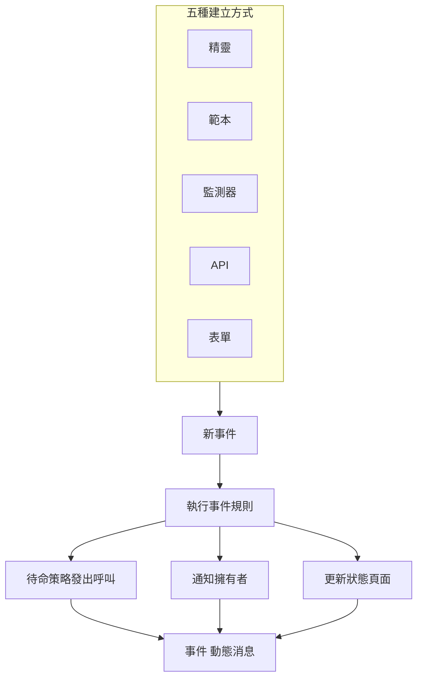
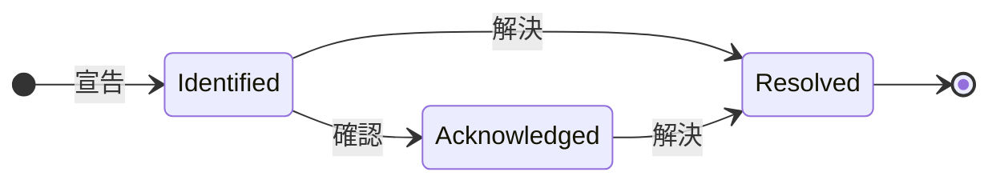

# 事件概觀

事件是出狀況時團隊圍繞著工作的那筆紀錄：哪些東西受到影響、情況有多嚴重、應變進行到哪一步、由誰負責，以及整個過程中寫下的一切。宣告一個事件會呼叫正確的待命輪值、通知它的擁有者，並且——如果你願意——把中斷發布到你的狀態頁面上，讓客戶知道你已經在處理。

:::cards
- [宣告事件](/docs/incidents/declaring-incidents): 手動、從範本、從監測器、透過 API，或透過表單。
- [事件狀態與嚴重程度](/docs/incidents/states-and-severities): 生命週期，以及確認和解決會做什麼。
- [事件備註、負責人與動態](/docs/incidents/notes-owners-and-feed): 給客戶和團隊的更新，以及誰會收到它們。
- [已連結的警示](/docs/incidents/linked-alerts): 把一次中斷引發的警示連結到解釋它們的事件上。
- [事件設定與自動化](/docs/incidents/settings): 範本、自訂欄位、角色、測量和規則。
:::

## 一覽

- **獨立的產品** —— 從頂端列的 **產品** 選單開啟 **事件**；清單位於 `/dashboard/{projectId}/incidents`。
- **三個預設狀態** —— 每個新專案都會建立 **Identified**、**已確認** 和 **已解決**。你可以新增自己的狀態；這三個預設狀態可以改名、換顏色，但永遠不能刪除。
- **三個預設嚴重性** —— **Critical Incident**、**Major Incident** 和 **Minor Incident**。嚴重性是一個帶有顏色和順序的標籤，本身不帶任何行為。
- **五種建立方式** —— **宣告事件** 精靈、**從範本建立**、監測器條件規則、`POST /api/incident`，或任何拿到連結的人都能填寫的 [表單](/docs/forms/index)。
- **依專案編號** —— 每個事件都會從專案層級的計數器取得一個事件編號，並帶上專案的前綴顯示：新專案中是 `INC-42`，沒有前綴時是 `#42`。
- **兩種備註** —— 給團隊的私人備註（內部備註），以及給狀態頁面訂閱者的公開備註。
- **警示會連結到事件** —— 連結屬於某個事件的警示，或直接從警示宣告事件（從警示清單或警示本身的頁面），並在宣告的同時確認這些警示。請參閱 [已連結的警示](/docs/incidents/linked-alerts)。
- **設定位於事件之下，而不在專案設定中** —— 狀態、嚴重性、範本、自訂欄位和各個規則引擎都在 **事件 → 設定** 和 **事件 → 規則** 中。

## 運作方式

你可以在凌晨三點手動宣告一個事件，也可以讓監測器在其條件相符的那一刻自動宣告。無論哪種方式，事件都是同一個物件，走同樣的生命週期，最後留下同樣的紀錄。

### 1. 事件被宣告

五條路徑通往同一個物件：

- **手動** —— 在事件清單中點選 **宣告事件**。這會開啟 **宣告新事件** 精靈，共三個步驟：**事件詳細資訊**、**受影響的資源**、**待命與角色**。第一步要求填寫標題、嚴重性和描述，大多數事件用不到的內容都摺疊在 **更多欄位** 下。只有第一步有必須回答的內容：**下一步** 依序走完其餘步驟，**宣告事件** 位於最後的摘要頁。
  - **從警示** —— 在選取的警示上或單一警示的頁首使用 **宣告事件**，會開啟同一個精靈，並依警示預先填好，把它們連結到新事件；除非你取消勾選，它還會確認這些警示，讓它們停止升級。請參閱 [已連結的警示](/docs/incidents/linked-alerts)。
- **從範本** —— 點選 **從範本建立** 並選擇一個已儲存的 **事件 範本**。範本會預先填寫標題、描述、嚴重性、初始狀態、資源、待命策略、擁有者和標籤。
- **從監測器** —— 啟用了「宣告事件」切換的監測器條件規則，會在篩選器相符的那一刻自動建立事件。那裡的標題和描述支援 `{{variable}}` 範本。
- **透過 API** —— 使用 API 金鑰呼叫 `POST /api/incident`。伺服器會替你填寫 `declaredAt`、建立狀態和事件編號。
- **透過表單** —— 團隊外部的人填寫你以連結分享的表單，不需要 OneUptime 帳戶。事件會在狀態頁面上隱藏的情況下被宣告；如果表單有事件範本，就依該範本建立。請參閱 [表單](/docs/forms/index)。

整合也會建立事件：[Huntress](/docs/integrations/huntress) 會把其 SOC 送來的每份事件報告變成一個事件，並呼叫你選擇的待命策略。逐欄位的詳細說明請參閱 [宣告事件](/docs/incidents/declaring-incidents)。

### 2. 合適的人收到通知

事件建立時，OneUptime 會執行你設定的自動化：隱私規則、擁有者規則、標籤規則、待命規則和 Runbook 規則。附加到事件上的所有待命策略——無論是手動新增的、來自範本的，還是由相符的待命規則合併進來的——都會平行執行。

擁有者會透過各自在 **使用者設定 → 通知設定** 中開啟的管道收到通知：電子郵件、簡訊、語音通話、推播、WhatsApp、Telegram、Slack、Microsoft Teams 或 webhook。如果事件完全沒有擁有者，通知會轉給專案擁有者，而不會被丟棄。

如果事件在狀態頁面上可見並且啟用了訂閱者通知，訂閱者也會收到通知：通知對象是列出該事件某個監測器的每個狀態頁面的訂閱者，或只是你限定的那些頁面的訂閱者。如何為每一類受眾提供各自的狀態頁面，請參閱 [每個受眾一個狀態頁](/docs/status-pages/one-status-page-per-audience)。

> [!NOTE]
> 通知由每分鐘執行一次的 cron 工作傳送，因此會有最多約一分鐘的延遲，而不是即時傳送。

### 3. 團隊處理事件

應變人員確認事件、新增受影響的資源、連結屬於它的警示、執行 Runbook、指派事件角色，並隨時記下了解到的情況——給團隊的私人備註、給客戶的公開備註，等情況更清楚時再寫 **根本原因** 和 **補救** 頁面。他們做的一切都會記錄在 **概覽** 頁面的 **事件 動態消息** 中。

### 4. 事件被解決

點選 **解決** 會把事件移到已解決狀態、在狀態時間軸上記下一筆、停止持續時間計時、交還事件佔用的監測器，並把事件從它所顯示的每個狀態頁面的進行中區段移除。為此不需要變更其他任何東西——狀態頁面只顯示處於已解決狀態之上的狀態中的事件。請參閱 [解決會做什麼](/docs/incidents/states-and-severities#解決會做什麼)。

之後你可以撰寫事後分析，並可選擇將其發布到狀態頁面。

## 關鍵術語

本節的每個頁面都會出現幾個詞。先把它們弄清楚。

| 術語                   | 意義                                                                                                                                                |
| ---------------------- | --------------------------------------------------------------------------------------------------------------------------------------------------- |
| **事件**               | 紀錄本身——標題、描述、嚴重性、目前狀態、受影響的資源，以及應變過程中寫在上面的一切。                                                                |
| **事件狀態**           | 事件處在生命週期的哪個位置。一個屬於專案的列，帶有名稱、顏色和 `order`，以及賦予其意義的旗標。                                                      |
| **事件嚴重性**         | 情況有多嚴重。一個屬於專案的列，帶有名稱、顏色和 `order`。純粹是一種分類——產品中沒有任何地方會特別對待某個嚴重性。                                  |
| **事件編號**           | 專案層級的計數器，顯示為 `#42`，或帶上你設定的前綴顯示為 `INC-42`。                                                                                 |
| **受影響的資源**       | 你附加到事件上的監測器、主機、Kubernetes 叢集、Docker 主機、服務和其他基礎設施。                                                                     |
| **公開備註**           | 為狀態頁面讀者和訂閱者撰寫的更新，顯示在狀態頁面的時間軸上。                                                                                        |
| **私人備註**           | 給應變團隊的內部備註（`IncidentInternalNote` 模型），永遠不會出現在狀態頁面上。                                                                     |
| **擁有者**             | 對事件負責的使用者或團隊。事件建立時、發布備註時以及狀態變更時，擁有者都會收到通知。                                                                |
| **事件 動態消息**      | 事件 **概覽** 上只能追加的活動時間軸，記錄狀態變更、備註、擁有者變更、規則執行和通知。                                                              |
| **狀態時間軸**         | 記錄事件在什麼時間處於哪個狀態、持續了多久——以及每次轉換的訂閱者通知狀態。                                                                          |
| **已連結的警示**       | 作為應變的一部分連結到事件的警示。一個警示可以連結到多個事件，並保有自己的狀態。                                                                    |

## OneUptime 為每個專案預設的三個狀態

建立專案時，OneUptime 會依以下順序預設正好三個事件狀態：

| 狀態             | 順序 | 顏色               | 意義                                                                      |
| ---------------- | ---- | ------------------ | ------------------------------------------------------------------------- |
| **Identified**   | 1    | 紅色（`#fd625e`）  | 全新事件進入的狀態，也就是建立狀態。                                      |
| **已確認**       | 2    | 黃色（`#ffbf53`）  | 有人接手了事件並正在處理。                                                |
| **已解決**       | 3    | 綠色（`#2ab57d`）  | 事件已經結束。正是解決讓它從狀態頁面上撤下。                              |

名稱只是標籤——真正決定行為的是狀態列上的三個布林值：`isCreatedState`、`isAcknowledgedState` 和 `isResolvedState`。每個專案中，每個旗標預期只由一個狀態持有。

這個區別比聽起來更重要：

- `isCreatedState` 決定新事件從哪裡開始。如果建立時沒有明確選擇狀態，OneUptime 會尋找專案的建立狀態並使用它。
- `isAcknowledgedState` 和 `isResolvedState` 標記確認狀態和解決狀態。事件的狀態相對它們所處的位置，決定了事件頁首的 **確認** 和 **解決** 按鈕、事件 **概覽** 上的兩個統計卡片，以及側邊選單中 **進行中事件** 的計數徽章：處於確認狀態或其後任一狀態的事件視為已確認，處於解決狀態或其後任一狀態的事件視為已解決。
- **進行中事件** 的定義純粹是「目前狀態位於解決狀態之上」。因此，你在解決狀態之上新增的自訂狀態是進行中的；放在它之後的狀態則和解決狀態一樣，視為已解決。

> [!NOTE]
> 第一個預設狀態的名稱是 **Identified**，雖然產品中的一些描述仍然稱它為建立狀態。如果你在專案的狀態清單中尋找「Created」，它就是名為 **Identified** 的那一列。

你可以在 **事件 → 設定 → 事件狀態** 中新增自己的狀態。新狀態會加在解決狀態的正上方，拖曳列即可重新排序；**視為** 欄顯示每個狀態中的事件被視為什麼——未確認、已確認或已解決。三個帶旗標的狀態帶有 **內建** 標記：它們維持順序且不能刪除，但可以改名、換顏色和移動，這也是 UI 動態讀取狀態名稱的原因。

順序是強制執行的，不只是外觀：事件不能移到順序中位於目前狀態之前的狀態。完整細節請見 [事件狀態與嚴重程度](/docs/incidents/states-and-severities)。

## OneUptime 為每個專案預設的三個嚴重性

每個新專案還會取得三個嚴重性：

| 嚴重性                | 順序 | 顏色                 | 意義                                                       |
| --------------------- | ---- | -------------------- | ---------------------------------------------------------- |
| **Critical Incident** | 1    | 栗色（`#b70400`）    | 對客戶影響非常大，需要立即應變。                           |
| **Major Incident**    | 2    | 紅色（`#fd625e`）    | 影響顯著，通常需要立即應變。                               |
| **Minor Incident**    | 3    | 黃色（`#ffbf53`）    | 影響較小，通常在上班時間內處理。                           |

嚴重性只有 `name`、`description`、`color` 和 `order`，別無其他。沒有旗標，也沒有任何程式碼路徑會把「Critical Incident」與其他列區別對待。嚴重性是人進行分級的方式，在撰寫待命規則時可以用作比對條件——但選擇一個嚴重性本身不會呼叫任何人。

在 **事件 → 設定 → 事件嚴重性** 中編輯或新增嚴重性。完整的預設描述請見 [事件狀態與嚴重程度](/docs/incidents/states-and-severities)。

## 事件在儀表板中的位置

從頂端列的 **產品** 選單開啟 **事件**。它的側邊選單分為以下幾個區段：

| 區段          | 在這裡做什麼                                                                                                                                                               |
| ------------- | -------------------------------------------------------------------------------------------------------------------------------------------------------------------------- |
| **概覽**      | **所有事件** 和 **進行中事件**——後者帶有一個紅色徽章，顯示處於解決狀態之上的狀態中的事件數量。                                                                            |
| **片段**      | 事件片段，一個擁有自己頁面的獨立分組功能。                                                                                                                                 |
| **人工智慧**  | **洞察**、**日誌**、**設定**：OneUptime AI 從你的事件中學到了什麼、為它們做過的一切，以及它可以自行做什麼——包括決定調查和修正哪些事件的規則。請參閱 [AI SRE](/docs/ai/ai-sre)。 |
| **工作區**    | 這個專案已連線的聊天工作區：**Slack**、**Microsoft Teams** 或兩者，各自帶有針對事件的通知規則。如果兩者都未連線，這裡是 **連線 Slack 或 Teams**，一個展示兩者及其連線方式的頁面。 |
| **整合**      | 會自行建立事件的工具：**Huntress**，它的事件報告會變成呼叫待命人員的事件。請參閱 [Huntress](/docs/integrations/huntress)。                                                 |
| **規則**      | 規則引擎：**分組規則**、**待命規則**、**擁有者規則**、**Runbook 規則**、**隱私規則**、**標籤規則**、**SLA 規則**、**Reminder Rules**。                                     |
| **設定**      | **事件狀態**、**事件嚴重性**、**事件範本**、**備註範本**、**事後分析範本**、**自訂欄位**、**事件角色**、**測量**、**已連結的警示**、**編號前綴**。                         |

**概覽** 和 **片段** 預設展開；**人工智慧**、**工作區**、**整合**、**規則**、**設定** 和 **開發者** 預設摺疊，因此選單一開啟就是你每天使用的清單。點選某個區段的標題即可展開，找到本文件其他地方提到的頁面；當你位於某個區段的頁面上時，該區段也會自動展開。事件設定不在專案設定中，全部都在這裡。

事件清單本身顯示 **事件編號**、**標題**、**狀態**、**嚴重程度**、**受影響的資源**、**已宣告**、**持續時間**、**標籤** 和 **擁有者**，並提供 **變更狀態** 批次操作，一次關閉多個事件。

## 事件的各個頁面顯示什麼

開啟一個事件，它自己的側邊選單會這樣組織各個頁面：

| 側邊選單區段      | 頁面                                                                                      |
| ----------------- | ----------------------------------------------------------------------------------------- |
| **概覽**          | **概覽**、**狀態時間軸**、**SLA**                                                         |
| **調查**          | **描述**、**根本原因**、**補救**、**運行手冊**、**事後分析**、**已連結的警示**            |
| **團隊**          | **角色**、**待命執行**、**擁有者**                                                        |
| **通知**          | **通知日誌**、**AI 日誌**——點選 **通知** 之前保持摺疊                                     |
| **備註**          | **私人備註**、**公開備註**                                                                |
| **開發者**        | **Terraform**、**API**、**AI 助理**——點選 **開發者** 之前保持摺疊                         |
| **進階**          | **自訂欄位**、**設定**、**稽核日誌**、**刪除事件**——點選 **進階** 之前保持摺疊            |

各頁面的內容：

- **概覽** —— 一眼看清應變情況。頁首下方的統計卡片顯示確認用時、解決用時和總 **持續時間**。頁面最上方是 **AI Investigation** 卡片——OneUptime AI 發現了什麼，或它為什麼沒有開始——其下是 **事件 動態消息**。旁邊是 **Video Call** 卡片、**事件詳細資訊** 卡片（標題、嚴重性、標籤、事件編號、宣告時間、宣告者、待命策略，以及底部一行小小的 **ID** 顯示事件的 ID，點一下即可複製到剪貼簿）、**事件角色**、**受影響的資源** 卡片和事件的自訂欄位。如果專案有 [測量](/docs/incidents/settings#測量)，**事件詳細資訊** 下方的 **測量** 卡片會顯示每項測量在這個事件上的讀數：**12 分鐘**、**已進行 5 分鐘**、**未達到**。
- **狀態時間軸** —— 事件經歷過的每個狀態，以及每次轉換的 **開始**、**結束**、**持續時間** 和訂閱者通知狀態。**檢視原因** 和 **檢視日誌** 解釋每次變更發生的原因。
- **SLA** —— 這個事件的 SLA 追蹤。
- **描述**、**根本原因**、**補救** —— 三個 Markdown 頁面。顯示在狀態頁面上的是描述。
- **運行手冊** —— 附加到這個事件的 Runbook 執行。
- **事後分析** —— 檢討文件及其附件，可選擇發布到狀態頁面。**編輯事後檢討備註** 會要求填寫備註和附件，接著是 **在狀態頁面上發布**；只有在它開啟時，才會詢問 **通知訂閱者** 和 **事後檢討發布時間**，開啟發布時後者會被設為目前時間。**Generate with AI** 為你起草備註，**套用範本**（專案有事後分析範本時顯示）則從範本開始。訂閱者只會在事後分析發布時收到一次通知：也就是狀態頁面第一次顯示它的時候，這需要開啟 **在狀態頁面上發布** 並寫好備註。再次儲存，或在發布狀態下編輯，只會更新狀態頁面而不通知任何人；從狀態頁面撤下後再次發布，會再次通知他們。事件隱藏期間發布的事後分析，會在事件變為可見時傳送。請參閱 [事後分析](/docs/status-pages/subscribers#事件)。
- **已連結的警示** —— 連結到這個事件的警示、每個警示的目前狀態，以及是誰在何時連結的。警示有對應的 **已連結的事件** 頁面。請參閱 [已連結的警示](/docs/incidents/linked-alerts)。
- **角色**、**待命執行**、**擁有者** —— 誰在處理、哪些策略被觸發、誰會收到通知。
- **通知日誌**、**AI 日誌**、**稽核日誌** —— 傳送了什麼、變更了什麼。
- **私人備註** 和 **公開備註** —— 告訴了團隊和客戶什麼。請參閱 [事件備註、負責人與動態](/docs/incidents/notes-owners-and-feed)。
- **自訂欄位**、**設定**、**刪除事件** —— **設定** 頁面包含 **於狀態頁面可見** 和 **私人事件**、將事件限定到部分狀態頁面的 **狀態頁面範圍** 卡片，以及 **Reminders** 卡片，其 **傳送提醒** 開關一切換就會儲存，並顯示下一次提醒何時發出。

## 事件與 OneUptime 其他部分的關係

- **監測器發現問題；事件記錄問題。** 監測器條件規則可以自動宣告事件，並預先填寫標題、嚴重性、待命策略、擁有者、標籤和補救備註。那裡可用的變數請參閱 [事件與警示範本](/docs/monitor/incident-alert-templating)。
- **警示是訊號；事件是應變。** 從任一側把事件所解釋的警示連結到事件上；兩個在新專案中預設開啟的專案開關，會隨事件一起確認和解決這些警示。請參閱 [已連結的警示](/docs/incidents/linked-alerts)。
- **呼叫由待命策略完成。** 在宣告精靈的 **待命與角色** 步驟、範本上，或透過 **事件 → 規則 → 待命規則** 附加策略。每條相符的規則都會觸發——執行的集合是所有相符項目與直接附加項目的聯集，並去除重複。
- **Runbook 告訴大家該做什麼。** Runbook 規則會在相符的事件建立時自動附加一套程序，應變人員也可以從事件中手動啟動。請參閱 [Runbook 概觀](/docs/runbooks/index)。
- **狀態頁面告訴客戶。** 當狀態頁面列出事件的某個監測器、頁面啟用了事件、事件被標記為在狀態頁面上可見，而且其目前狀態位於解決狀態之上時，事件就會出現在狀態頁面的進行中清單中。限定到部分狀態頁面的事件只會顯示在那些頁面上。私人事件一律在所有狀態頁面上隱藏。請參閱 [狀態頁概觀](/docs/status-pages/index) 和 [每個受眾一個狀態頁](/docs/status-pages/one-status-page-per-audience)。
- **工作流程圍繞它實現自動化。** **On Create Incident**、**On Update Incident** 和 **On Delete Incident** 觸發器讓你在事件生命週期之上建構無程式碼自動化。請參閱 [工作流程概觀](/docs/workflows/index)。

## 後續步驟

:::cards
- [宣告事件](/docs/incidents/declaring-incidents): 逐一欄位走完精靈，或從範本、監測器或 API 宣告。
- [事件狀態與嚴重程度](/docs/incidents/states-and-severities): 新增自己的狀態，並確切了解每個狀態的作用。
- [狀態頁概觀](/docs/status-pages/index): 事件如何觸及你的客戶。
- [訂閱者與公告](/docs/status-pages/subscribers): 事件變動時誰會收到通知。
:::
