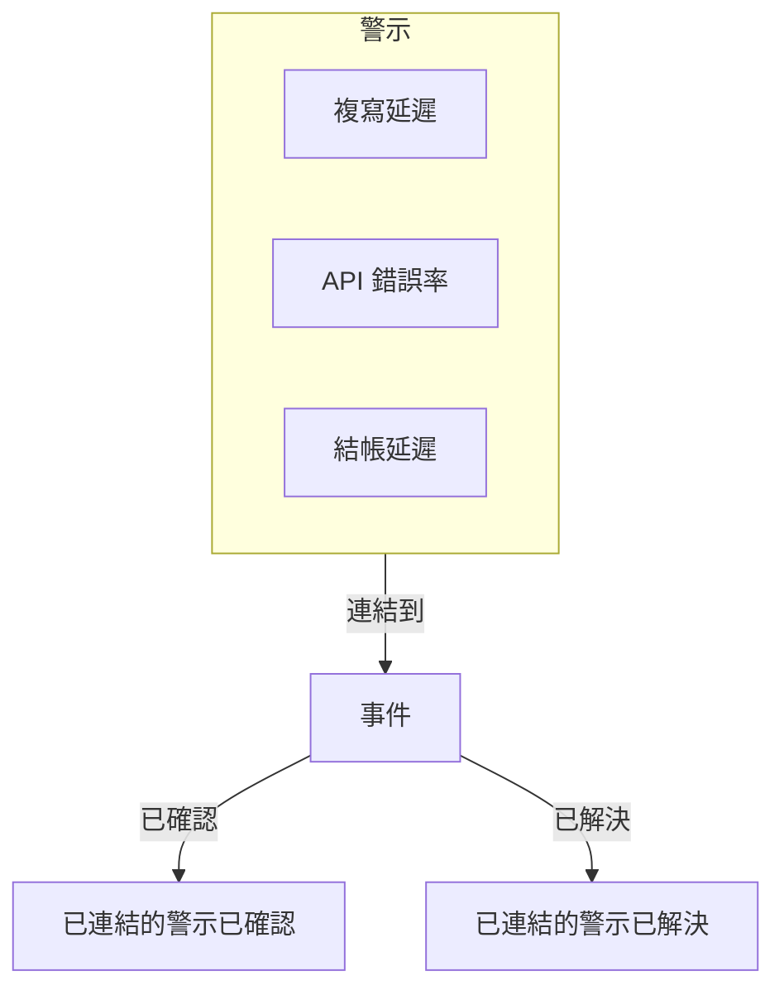
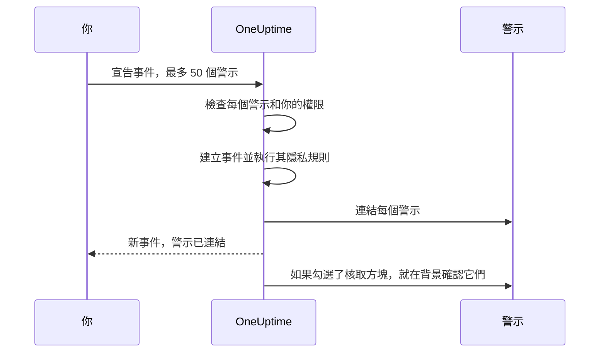

# 已連結的警示

一次中斷很少只引發一個警示。主資料庫當機時，複寫延遲監測器會觸發，API 錯誤率監測器會觸發，結帳延遲 SLO 開始消耗預算——三個警示，一個問題。把這些警示連結到事件上，就說明了這一點：事件是進行應變的地方，而每個警示都會顯示是哪個事件解釋了它。

連結只是連結。警示保有自己的狀態、擁有者、待命策略、備註和動態；事件也保有它自己的。連結不會合併或複製任何東西，單憑它本身也絕不會確認、解決或靜音警示。（從警示宣告新事件則不同：新事件會依這些警示預先填寫，如 [下文所述](#從警示宣告事件)，而且除非你取消勾選表單上的核取方塊，這些警示會在你宣告時被確認，從而停止它們的升級——請參閱 [宣告時確認警示](#宣告時確認警示)。）兩個在新專案中預設開啟的專案開關，會在事件被確認和解決時，讓已連結的警示跟著推進——請參閱 [下文](#讓警示狀態與事件保持同步)。

:::cards
- [把警示連結到事件](#從事件連結警示): 從事件、從警示，或一次連結多個。
- [從警示宣告事件](#從警示宣告事件): 一個新事件，一次預先填好並連結完成。
- [讓警示狀態保持同步](#讓警示狀態與事件保持同步): 隨事件一起確認和解決警示。
- [權限](#權限): 誰可以連結，以及連結讓他們能做什麼。
:::

> [!TIP]
> 如果你來自 Opsgenie，這就是 OneUptime 版本的「把警示關聯到事件」。

## 一覽

- **多對多** —— 一個事件可以有任意數量的已連結警示，一個警示也可以連結到多個事件。
- **三個連結入口** —— 事件的 **已連結的警示** 頁面、警示的 **已連結的事件** 頁面，以及主要警示清單上的 **連結至事件** 批次操作，每次最多 **50** 個警示。
- **從警示宣告事件** —— 在警示清單、警示頁首或其 **已連結的事件** 頁面上使用 **宣告事件**，會依警示預先填寫一個新事件，並在建立時連結它們。表單上一個預設勾選的核取方塊還會確認它們，從而停止它們自己的待命升級。
- **兩側都有紀錄** —— 每次連結和取消連結都會在事件和警示上各寫一則動態項目，只是從警示宣告的事件只會取得一則列出所有警示的項目。只有事件的項目會發布到 Slack 和 Microsoft Teams，而且私人警示或事件的標題永遠不會寫到另一側。
- **警示狀態跟隨事件** —— 兩個在新專案中都預設開啟的專案開關，會在事件被確認和解決時確認和解決已連結的警示。可在 **事件 → 設定 → 已連結的警示** 中關閉其中任一個。
- **可自動化** —— 連結是一種一般的 API 資源：`/api/incident-alert`。

## 運作方式

警示是訊號：監測器的條件相符了、SLO 開始消耗預算了、某條安全規則觸發了。事件是針對一個問題的協同應變（請參閱 [事件概觀](/docs/incidents/index)）。大多數問題會產生多個訊號，而沒有連結時，把它們與應變聯繫起來的只有某個人的記憶。



警示連結之後：

- 事件的應變人員可以在一份清單中看到哪些警示屬於它，以及每個警示處於什麼狀態。
- 開啟其中某個警示的人會看到它已經在某個事件下被處理，而不會為同一次中斷再宣告第二個事件。
- 事件的動態會記錄每個警示是何時、由誰連結的，所以時間軸能呈現全貌是如何拼湊起來的。
- 開關開啟時，確認事件會停止這些警示的待命升級，處理事件的人就不會再因為它的症狀被重複呼叫。

## 連結如何運作

一個連結把一個警示連接到一個事件。連結是雙向的——同一個連結會同時出現在事件的 **已連結的警示** 頁面和警示的 **已連結的事件** 頁面上。

- **一個警示可以連結到多個事件。** 一個共用相依項目的故障可能是兩個獨立事件的症狀。每個事件都會列出這個警示，警示也會列出這兩個事件。
- **每一對只連結一次。** 把警示連結到它已經連結的事件，會以「This alert is already linked to this incident.」被拒絕——即使兩個人在同一時刻連結同一對也是如此。
- **連結只能建立或刪除，不能編輯。** 除了它的事件、它的警示、建立時間和建立者之外，連結沒有任何自己的欄位。要把警示移到另一個事件，先把它連結到新事件，再從舊事件取消連結。
- **連結限於專案之內。** 警示和事件必須屬於同一個專案。

## 從事件連結警示

:::steps
### 開啟事件的已連結的警示頁面

開啟事件，在其側邊選單的 **調查** 區段選擇 **已連結的警示**。表格列出已經連結到它的每個警示。

### 選擇警示

點選 **連結警示**，從 **警示** 下拉式選單中選擇它。下拉式選單最先列出最近的警示，每個都帶編號——例如 `ALT-63: Checkout API is offline`——這樣標題相同的警示（例如同一個監測器重複產生的警示）也能區分開來。要尋找較早的警示，直接輸入：下拉式選單會依標題搜尋所有警示。

### 儲存連結

在對話方塊中點選 **連結警示**。警示會出現在表格中，兩側的動態都會記錄這次連結。如果連結被拒絕，例如因為警示已經連結，對話方塊會保持開啟並說明原因。
:::

| 欄                  | 顯示內容                                         |
| ------------------- | ------------------------------------------------ |
| **警示 #**          | 警示編號，例如 `#17` 或 `ALT-17`。               |
| **標題**            | 警示的標題，連結到該警示。                       |
| **目前狀態**        | 警示自己的狀態，例如 **已確認**。                |
| **連結時間**        | 警示被連結的時間。                               |
| **連結者**          | 是誰連結的。                                     |

每一列都有用來開啟警示的 **檢視警示** 和用來刪除連結的 **取消連結**。

## 從警示連結事件

警示一側與事件一側互相對應。開啟一個警示，在其側邊選單的 **基礎** 區段選擇 **已連結的事件**。表格列出該警示所連結的每個事件，包括事件編號、標題和目前狀態，以及何時、由誰連結。

- **連結事件** 把這個警示連結到一個現有事件。它的下拉式選單與事件一側的一樣：最近的事件排在前面，每個都帶編號——例如 `INC-42: Checkout is down`——輸入時會依標題搜尋所有事件。
- **檢視事件** 開啟一個已連結的事件。
- **取消連結** 刪除一個連結。
- **宣告事件** 從這個警示開始一個新事件。同樣的按鈕也位於警示頁首中 **確認** 和 **解決** 的旁邊。請參閱 [從警示宣告事件](#從警示宣告事件)。

## 一次連結多個警示

主要的警示清單為此提供了兩個批次操作：**所有警示** 和 **進行中警示**、首頁上的進行中警示，以及監測器、服務、主機、Kubernetes 叢集、SLO 或任何其他擁有 **警示** 頁面之資源的該頁面。警示片段的 **成員警示** 清單沒有這些操作——請改為在某個主要清單中選擇警示。選取警示，然後選擇：

- **連結至事件** —— 在 **事件** 下拉式選單中選擇事件，然後點選 **連結選取的警示**。最近的事件排在前面並帶有編號，輸入時會依標題搜尋所有事件。OneUptime 會連結每個選取的警示，並顯示進度。已經連結到該事件的警示會算作完成而不是失敗，所以重複執行這個操作也無妨。
- **宣告事件** —— 開啟一個依選取的警示預先填寫的新事件宣告表單。請參閱下一節。

兩個操作每次最多處理 **50** 個警示。選得更多時它們會被停用，並有提示說明原因。設定這個上限，是因為每個連結都會寫入兩側的動態，而透過 **連結至事件** 建立的每個連結還會發布到事件的 Slack 和 Microsoft Teams 頻道——一次選取一千個警示會把它們淹沒。

## 從警示宣告事件

當一陣警示被證明是一個還沒有人宣告的事件時，就從這些警示宣告它。有三個入口：

- 在某個主要警示清單中選擇警示，然後選擇 **宣告事件**。
- 開啟一個警示，點選其頁首中 **確認** 和 **解決** 旁邊的 **宣告事件**。警示被確認或解決之後，按鈕依然在那裡，所以你仍然可以事後為警示宣告一個事件——例如為了對它進行事後分析。
- 開啟某個警示的 **已連結的事件** 頁面，點選 **宣告事件**。

三者都需要建立事件以及把警示連結到事件的權限。沒有這些權限時，按鈕會被鎖定，其提示會指出缺少的權限。

無論使用哪個入口，你都會進入一般的 **宣告新事件** 表單，警示會作為將要連結的對象列出，而且以下欄位已預先填寫：

| 欄位                       | 預先填寫的內容                                                                                                                                                                                                                                                                         |
| -------------------------- | -------------------------------------------------------------------------------------------------------------------------------------------------------------------------------------------------------------------------------------------------------------------------------------- |
| **標題**                   | 一個警示時：它的標題。多個時：最嚴重警示的標題。                                                                                                                                                                                                                                       |
| **描述**                   | 一個警示時：它的描述。多個時：一份清單，每個警示一行，列出其編號和標題。                                                                                                                                                                                                               |
| **事件嚴重性**             | 最嚴重警示的嚴重性，轉換為事件嚴重性。名稱相同（忽略大小寫）的事件嚴重性優先。否則，OneUptime 會取嚴重性順序中相同位置的事件嚴重性；如果你的事件嚴重性比較少，就取最後一個。                                                                                                         |
| **受影響的資源**           | 選取警示的所有監測器、主機、Kubernetes 叢集、Docker 主機、Podman 主機和服務的合集。監測器放在 **監測器** 下，其餘放在 **其他受影響的資源** 下。其他資源，例如 SLO，或 VMware、Proxmox 和 Ceph 叢集，不會被複製——如果事件影響到它們，請自行新增。 |
| **標籤**                   | 所有選取警示的所有標籤。                                                                                                                                                                                                                                                               |
| **私人事件**               | 只要有任一警示是私人的就開啟。表單會說明這一點，而且警示的擁有者會成為事件的擁有者——見下文。                                                                                                                                                                                         |

「最嚴重」遵循你的警示嚴重性順序：清單中的第一個警示嚴重性就是最嚴重的。使用每個專案一開始擁有的嚴重性時，**High** 警示會成為 **Critical Incident**，**Low** 警示會成為 **Major Incident**。

送出之前一切都可以編輯。**標籤** 和 **私人事件** 位於表單第一步的 **更多欄位** 下，其摺疊的標題會在它們被設定時顯示出來。

**已經有事件的警示會被標記。** 由於每個警示的頁面上都有 **宣告事件**，被同一次中斷呼叫的兩名應變人員可能會各自宣告。因此，列出警示的橫幅會標記每個已經連結到事件的警示——「(already linked to Incident INC-42)」，並連結到那個事件——並依已連結警示的數量加上一則措辭不同的說明：

- 全部警示，而且只有一個：「This alert is already linked to an incident. If it is the same problem, update that incident instead of declaring another one.」
- 全部警示，而且有多個：「These alerts are already linked to incidents. If it is the same problem, update that incident instead of declaring another one.」
- 只有其中一部分：「Some of these alerts are already linked to an incident. If it is the same problem, link the other alerts to that incident from the alerts list instead of declaring another one.」

事件連結會在新分頁中開啟，所以你可以查看現有事件，而不會遺失已經在表單中填寫的內容。這則說明只是提醒，而不是阻擋，而且只會列出你有權查看的事件。

**待命策略不會被複製。** 警示在建立時已經執行了它們自己的待命策略，所以把它們複製到事件上會再次呼叫同一批人。事件的待命策略就是你在 **待命與角色** 步驟中選擇的，加上你的事件待命規則所新增的——與任何其他事件完全一樣。

**警示的監測器會被預先填寫為受影響的監測器。** 與任何手動宣告的事件一樣，事件監測器的主動監測會暫停，直到事件被解決。如果某個監測器應該繼續被檢查，請在送出前從 **受影響的資源** 步驟的 **監測器** 中移除它。

**私人警示會產生私人事件。** 只要有任一警示是私人的，**私人事件** 就會以開啟狀態開始，列出警示的橫幅也會這樣說明。私人事件只對其擁有者、Project Owners 和 Project Admins 可見，所以 OneUptime 會確保能看到這些警示的人也能看到事件：事件一旦宣告，每個所宣告警示的擁有者——使用者和團隊都包括在內——都會被新增為事件的擁有者，而且不會收到通知。他們會在事件的 Slack 和 Microsoft Teams 頻道建立之後立即被新增，因此會像其他擁有者一樣被邀請進這些頻道。和你宣告的任何事件一樣，你也是擁有者。當事件隱私規則把新事件設為私人時，也會發生同樣的事情。如果你在送出前關閉 **私人事件**，而且沒有適用的隱私規則，事件就不是私人的，也不會複製擁有者。



送出後，伺服器會在建立任何東西之前檢查這些警示：最多 50 個，每個都是這個專案中你有權查看的警示，而且你必須有權把警示連結到事件。任何一項檢查失敗，請求都會被拒絕，不會建立事件——因此錯誤的警示 ID 永遠不會耗掉一個事件編號。事件一旦存在——而且它的隱私規則已經執行，讓連結知道它是否為私人——每個警示都會在請求傳回之前完成連結，所以事件的 **已連結的警示** 頁面上已經列出了它們。如果單一連結失敗——例如因為警示恰好在前一刻被刪除——事件仍然會被宣告，其他警示仍然會被連結。

事件的動態會取得一則列出這些警示的 **警示已連結** 項目，寫在 **已建立事件** 之後，而不是每個警示一則——請參閱 [動態、Slack 和 Microsoft Teams](#動態slack-和-microsoft-teams)。

### 宣告時確認警示

宣告事件本身並不會讓它的警示停止呼叫：警示的待命升級只有在警示本身被確認後才會停止。因此，當任何一個警示尚未被確認時，表單上的橫幅會有一個預設勾選的核取方塊——一個警示時為 **Acknowledge this alert to stop its escalation**，多個時為 **Acknowledge these 3 alerts to stop their escalation**。如果其中一些已經被確認，它只會列出其餘的警示，並說明已確認的維持原樣。

保持勾選，那麼在事件宣告、警示連結之後：

- **警示會以你的身分被確認。** 每個警示都會移到你的警示 **已確認** 狀態，就像你自己在它上面點選了 **確認** 一樣：警示的 **狀態時間軸** 和動態會寫上你的名字，警示的擁有者會收到通知，這次變更也會像任何其他警示狀態變更一樣發布到警示的 Slack 和 Microsoft Teams 頻道。原因寫作「Acknowledged because Incident INC-42 was declared from this alert.」——對於私人事件，則寫作「Acknowledged because a private incident was declared from this alert.」，這樣私人事件永遠不會在警示的讀者能看到的地方被提及。
- **它們自己的待命升級會在大約一分鐘內停止。** 下一個升級步驟會看到一個已確認的警示並停止。已經發出的呼叫不會被撤回。
- **只有當提醒規則這樣規定時，提醒才會停止。** 只有當警示的提醒規則把 **Stop Reminders When** 設為 **已確認** 時，警示的提醒才會在確認時停止；否則它們會一直持續到警示被解決。
- **警示片段會繼續升級。** 如果某個警示屬於一個透過自己的待命策略進行呼叫的片段，該片段會繼續升級，直到片段本身被確認。
- **已經確認或解決的警示維持不動。** 與其他所有地方一樣，狀態依順序比較，所以處於 **已確認** 之後某個自訂狀態的警示被視為已確認，任何東西都絕不會被往回移。

取消勾選核取方塊，即可在不確認的情況下宣告。只要警示將維持未確認——核取方塊未勾選或被鎖定——表單就會這樣說明：「Declaring the incident does not acknowledge the alert: it keeps escalating until it is acknowledged.」如果你確認了警示，卻沒有為事件選擇待命策略，**待命與角色** 步驟的摘要會指出：「The alerts it is declared from are acknowledged too, so their own escalation stops. An alert episode they belong to keeps escalating until the episode is acknowledged, and an incident on-call rule, if any, may still page.」

**你需要有確認這些警示的權限。** 在宣告時確認它們需要 **Create Alert State Timeline** 和 **Edit Alert**（在警示本身的頁面上確認只需要前者：請參閱 [變更狀態](/docs/permissions/index#變更狀態)）：Project Owner、Project Admin、Project Member、Alert Admin 和 Alert Member 兩者都有，而能夠從警示宣告事件的 Incident Admin 和 Incident Member 兩者都沒有。你在警示上的標籤和擁有者範圍也必須包含每個將被確認的警示——只檢查尚未確認的警示。已經確認或解決的警示不需要權限，也絕不會阻擋宣告。沒有這些權限時，核取方塊會被鎖定，提示會指出缺少的那個權限，而你仍然可以宣告事件。伺服器在建立任何東西之前，會對它將要確認的每個警示再檢查一次：如果你不能確認其中某個，就不會建立事件，表單會說明原因——取消勾選核取方塊後再送出一次。

**專案需要一個已確認的警示狀態。** 每個專案一開始都有一個。如果你的專案沒有，就不會提供這個核取方塊。

警示會在連結之後立即在背景被確認，每次處理幾個——最多同時 5 個——所以事件頁面可能會在它們被確認之前稍早開啟，而從許多警示宣告時，最後的警示也不必排在其他所有警示之後等待。無法確認的警示——例如它在此期間被刪除了——會被記錄到日誌中，絕不會阻止其他警示或事件；在此期間被別人確認或解決的警示，則維持對方留下的樣子。

**當專案的已連結警示開關開啟時，可能改由開關來推動警示。** 如果事件一開始就以已確認或已解決的狀態宣告，而某個 [已連結警示開關](#讓警示狀態與事件保持同步) 作用於該狀態，那麼開關會在連結時推動這些已連結的警示，核取方塊則把這些警示交給開關處理，這樣每個警示只有一個寫入者。它們會以開關的方式被確認或解決——帶著開關的原因，例如「Acknowledged because linked Incident INC-42 was acknowledged.」，即使事件是私人的，它也會以編號指明事件——不會記在你的名下，它們的擁有者也不會收到通知。像平常一樣以你的第一個事件狀態宣告，或開關處於關閉狀態時，每個警示都交給核取方塊處理。

### 透過 API 宣告

`POST /api/incident` 在 `miscDataProps` 的 `alertIdsToLink` 中接受要連結的警示 ID，並在 `acknowledgeAlertsToLink` 中接受是否確認這些警示：

```bash
curl -X POST https://oneuptime.com/api/incident \
  -H "apikey: $ONEUPTIME_API_KEY" \
  -H "Content-Type: application/json" \
  -d '{
    "data": {
      "title": "Primary database unavailable",
      "incidentSeverityId": "<incident-severity-id>"
    },
    "miscDataProps": {
      "alertIdsToLink": ["<alert-id>", "<another-alert-id>"],
      "acknowledgeAlertsToLink": true
    }
  }'
```

`alertIdsToLink` 是一個包含 1 到 50 個警示 ID 的陣列。重複項目會被忽略，而且在事件建立之前適用與儀表板相同的檢查。透過 API 不會預先填寫任何內容——請傳送你想要的標題、嚴重性和資源。API 金鑰需要建立事件和把警示連結到事件的權限，而且必須能讀取這些警示。API 金鑰不是使用者，所以用它建立的連結沒有 **連結者**。請求本文的其餘部分請參閱 [宣告事件](/docs/incidents/declaring-incidents)。

`acknowledgeAlertsToLink` 是選填的，不傳送時為關閉。把它設為 `true`，即可像表單的核取方塊一樣，在警示連結後確認它們——已經確認或解決的警示維持不動，也不需要權限。省略它或傳送 `false`，即可在不確認它們的情況下宣告。它會與警示 ID 一起在事件建立之前進行檢查，在以下情況下請求會以 400 被拒絕：

- 它是 `true` 或 `false` 以外的任何值；
- 傳送它時沒有 `alertIdsToLink`；
- 專案沒有已確認的警示狀態；
- API 金鑰無法確認每一個尚未確認的警示——這需要 **Create Alert State Timeline** 和 **Edit Alert**，以及包含每一個這些警示的標籤範圍。

API 金鑰不是使用者，所以用它確認的警示不會記在任何人名下，正如它的連結沒有 **連結者** 一樣。

## 透過 API 連結和取消連結

連結是位於 `/api/incident-alert` 的標準 CRUD 資源。要把警示連結到事件，就建立一個連結：

```bash
curl -X POST https://oneuptime.com/api/incident-alert \
  -H "apikey: $ONEUPTIME_API_KEY" \
  -H "Content-Type: application/json" \
  -d '{
    "data": {
      "incidentId": "<incident-id>",
      "alertId": "<alert-id>"
    }
  }'
```

要列出事件的已連結警示，依 `incidentId` 查詢。改為依 `alertId` 查詢，則可以找到某個警示所連結的事件：

```bash
curl -X POST https://oneuptime.com/api/incident-alert/get-list \
  -H "apikey: $ONEUPTIME_API_KEY" \
  -H "Content-Type: application/json" \
  -d '{
    "query": { "incidentId": "<incident-id>" },
    "select": { "_id": true, "alertId": true, "createdAt": true },
    "limit": 50,
    "skip": 0
  }'
```

要取消連結，就依連結自己的 ID 刪除它——是連結的 `_id`，而不是警示或事件的：

```bash
curl -X DELETE https://oneuptime.com/api/incident-alert/<link-id> \
  -H "apikey: $ONEUPTIME_API_KEY"
```

兩個 ID 都是必要的。當警示或事件屬於另一個專案，或是你看不到的對象時，連結請求也會被拒絕。無論警示或事件是不存在還是只是對你隱藏，錯誤訊息都一樣，所以它永遠不會洩露某個私人對象的存在。

同一個資源驅動著產生的工作流程元件——**On Create Incident Alert** 在警示被連結時觸發，**On Delete Incident Alert** 在取消連結時觸發——以及 MCP 伺服器的 Incident Alert 工具。完整的請求和回應結構請見 [API 參考](/reference)。

## 取消連結

可以從任一側取消連結：在事件的 **已連結的警示** 頁面或警示的 **已連結的事件** 頁面的某一列上點選 **取消連結**，然後確認。要一次取消多個連結，選取這些列並選擇批次 **取消連結** 操作。它只會刪除連結——警示和事件本身不會被刪除。

取消連結只刪除連結，別無其他。警示和事件維持各自的狀態，因事件而被確認或解決的警示也維持原樣——警示狀態永遠不會往回走。兩側的動態都會記錄這次取消連結。

## 權限

連結在 [權限參考](/docs/permissions/reference) 的 **Incident** 群組中有四個自己的細部權限：

| 權限                      | 允許的操作                                                                                                             | 包含它的角色                                                                                             |
| ------------------------- | ---------------------------------------------------------------------------------------------------------------------- | -------------------------------------------------------------------------------------------------------- |
| **Create Incident Alert** | 把警示連結到事件，包括從警示宣告事件時。你還必須能夠讀取兩者。                                                         | Project Owner, Project Admin, Project Member, Incident Admin, Incident Member, Alert Admin, Alert Member |
| **Delete Incident Alert** | 取消連結。                                                                                                             | Project Owner, Project Admin, Project Member, Incident Admin, Incident Member, Alert Admin, Alert Member |
| **Read Incident Alert**   | 查看 **已連結的警示** 和 **已連結的事件** 清單。                                                                       | 以上所有角色，外加 Viewer、Incident Viewer 和 Alert Viewer                                               |
| **Edit Incident Alert**   | 實際上什麼也不能做——連結沒有可以變更的欄位。                                                                           | Project Owner, Project Admin, Project Member, Incident Admin, Incident Member, Alert Admin, Alert Member |

包含警示角色，是為了讓處理警示的人能夠連結警示；包含事件角色，是為了讓處理事件的人也能這樣做。兩者單獨都不夠，因為只有在你能讀取兩側時才會建立連結：

- **警示角色還需要事件的讀取權限** —— 新增 Viewer、Incident Viewer 或 Read Incident。
- **事件角色還需要警示的讀取權限** —— 新增 Viewer、Alert Viewer 或 Read Alert。

在此之上還有三條規則：

- **你必須能看到兩側。** 只有在你能讀取警示和事件兩者時，才會建立連結。私人警示和事件以及標籤限制照常適用。
- **連結屬於它的事件。** 你能否看到一個連結，取決於你對其事件的存取權：事件上的標籤限制和擁有者範圍同樣適用於連結。
- **連結只需要警示的讀取權限，而不需要編輯權限。** 當專案的已連結警示開關開啟時（新專案中預設如此），這就足以讓一個連結確認或解決警示——請參閱 [誰會推動已連結的警示](#誰會推動已連結的警示)。

從警示宣告事件還需要建立事件的權限，而在宣告時確認其警示，需要對其中每個尚未確認的警示都有 **Create Alert State Timeline** 和 **Edit Alert**——請參閱 [宣告時確認警示](#宣告時確認警示)。在儀表板中，你缺少權限的操作會被鎖定，其提示會指出缺少的權限。這也包括對另一側的讀取權限：如果你不能讀取警示，**連結警示** 會被鎖定；如果你不能讀取事件，**連結事件** 和 **連結至事件** 會被鎖定。角色、細部權限、標籤和擁有者範圍如何組合，請參閱 [使用者、團隊與權限](/docs/permissions/index)。

## 動態、Slack 和 Microsoft Teams

每次連結和取消連結都會寫入兩側的動態，記在做出變更的人名下：

| 變更        | 事件動態                                     | 警示動態                                            |
| ----------- | -------------------------------------------- | --------------------------------------------------- |
| 連結        | **警示已連結**（`AlertLinked`）              | **已連結至事件**（`LinkedToIncident`）              |
| 取消連結    | **警示已取消連結**（`AlertUnlinked`）        | **已取消與事件的連結**（`UnlinkedFromIncident`）    |

每則項目都以編號指明另一側並連結到它，這樣你就可以從事件的動態跳到警示再跳回來。它也會給出另一側的標題，除非那一側是私人的：

- **私人警示的標題不會寫入事件的項目**，因此也不會出現在 Slack 和 Microsoft Teams 中。項目寫作，例如，「Linked Alert #12 (private alert) to Incident #5」。
- **私人事件的標題不會寫入警示的項目**，項目寫作「Linked to Incident #5 (private incident)」。

即使兩者都是私人的也是如此，因為私人警示和私人事件可能有不同的擁有者。開啟已連結的警示或事件，照常受其本身隱私的約束。

**只有事件的項目會送達 Slack 和 Microsoft Teams。** **警示已連結** 和 **警示已取消連結** 會發布到事件其他動態更新所去的地方。警示一側的項目留在儀表板中，所以一次連結只產生一則訊息，而不是兩則。這些頻道的設定，請參閱 [Slack](/docs/workspace-connections/slack) 和 [Microsoft Teams](/docs/workspace-connections/microsoft-teams)。

**從警示宣告事件只寫一則項目，而不是每個警示一則。** 宣告事件時建立的連結不會各自寫入 **警示已連結** 項目。取而代之的是，一旦事件的 **已建立事件** 項目發出——而且事件自己的 Slack 和 Microsoft Teams 頻道（如果你使用它們）已經建立——事件就會取得一則 **警示已連結** 項目：「Declared from 3 alerts:」，後面每個警示一行，列出其編號和標題（私人警示不含標題）。這就是發布到 Slack 和 Microsoft Teams 的唯一一則訊息。每個警示仍然會取得它自己的 **已連結至事件** 項目。

兩個動態的 **依事件類型篩選** 對話方塊（位於每個動態的 **⋯** 選單中）都會列出這些事件類型，所以你可以像其他任何類型的項目一樣顯示或隱藏連結活動。關於事件動態的更多內容，請參閱 [事件備註、負責人與動態](/docs/incidents/notes-owners-and-feed)。

## 讓警示狀態與事件保持同步

兩個專案開關讓事件帶著它的已連結警示一起前進。兩者在新專案中都預設開啟。在它們預設開啟之前建立的專案會保留原來的設定，除非有人開啟過，否則是關閉的。它們有自己的設定頁面 **事件 → 設定 → 已連結的警示**，在其 **已連結的警示** 卡片上，每一個都是一切換就會儲存的開關。只有 Project Owners 和 Project Admins 可以變更它們；對其他所有人，開關是鎖定的，並會說明需要什麼權限：

- **事件確認時確認已連結的警示** —— 當事件到達你的確認狀態時，每個尚未確認的已連結警示都會移到你的警示 **已確認** 狀態。正是這一點停止了這些警示的待命升級：下一個升級步驟會看到一個已確認的警示，並在大約一分鐘內停止。已經發出的呼叫不會被撤回。當警示的提醒規則把 **Stop Reminders When** 設為 **已確認** 時，警示提醒也會停止；否則它們會一直持續到警示被解決。
- **事件解決時解決已連結的警示** —— 當事件到達你的解決狀態時，每個尚未解決的已連結警示都會移到你的警示 **已解決** 狀態，但仍連結著另一個尚未解決之事件的警示除外。那個警示會為另一個事件維持未解決——如果確認開關也開啟，則處於已確認——並在它的最後一個事件被解決時解決。

兩個開關都關閉時，連結不會改變警示狀態的任何方面。已連結的警示會停留在原處，直到有人推動它，它的待命策略會繼續升級，它的提醒也會繼續到來。唯一的例外是在保持表單核取方塊勾選的情況下從警示宣告事件，這會在你宣告時確認它們——請參閱 [宣告時確認警示](#宣告時確認警示)。

### 開關的行為

- **看順序，不看名稱。** 「到達」代表事件的目前狀態在你的狀態順序中處於或越過了確認狀態或解決狀態。確認狀態和解決狀態之間的自訂狀態，例如 **監控** 狀態，被視為已確認。警示也以同樣的方式比較，所以處於 **已確認** 之後某個自訂狀態的警示已經被視為已確認。
- **絕不倒退。** 只有落後於目標狀態的警示才會被推動。已經確認的警示不受確認開關影響，已解決的警示永遠不會被觸碰。
- **只開啟確認開關時解決事件**，會確認已連結的警示，因為已解決越過了已確認。
- **連結到一個已經確認或解決的事件**，會立即對新警示套用這些開關，就好像事件剛剛變更了狀態一樣。
- **重新開啟事件不會重新開啟它的警示。** 警示不能移到更早的狀態。
- **只有目前狀態才算數。** 在事件的 **狀態時間軸** 中新增一則過去的項目——帶有 **結束** 的那種——不會推動任何警示。
- **單憑連結絕不會改變警示的狀態。** 兩個開關都關閉時，事件永遠不會推動它的警示。

警示會在事件之後立即在背景變更狀態。每次變更都會經過警示自己的狀態時間軸，並帶有例如「Acknowledged because linked Incident INC-42 was acknowledged.」的原因，所以警示的 **狀態時間軸** 和動態會顯示它為什麼被推動。警示的擁有者不會因此收到狀態變更通知，但這次狀態變更會像任何其他警示狀態變更一樣發布到 Slack 和 Microsoft Teams。一個警示推動失敗不會阻止其他警示。

### 誰會推動已連結的警示

開啟一個開關，就是刻意把已連結警示的狀態交給事件：事件是進行應變的地方，所以主持事件的人也主持它的警示。從那時起：

- **能變更事件狀態的人會推動它的已連結警示。** 確認或解決事件會確認或解決它們。
- **能連結警示的人就能推動它。** 把警示連結到一個已經確認或解決的事件，會在連結時推動該警示。

兩者都不需要編輯警示的權限。OneUptime 自己推動它們，而連結只需要警示的讀取權限。因此，在確認開關開啟時，任何能連結警示或變更事件狀態的人，都可以確認他們能看到的任何警示——並停止它的待命升級；在解決開關開啟時，他們還可以解決它。這就是為什麼只有 Project Owners 和 Project Admins 可以變更這些開關。它們在新專案中是開啟的，所以如果警示狀態只應由能編輯警示的人變更，請關閉它們。

### 解決來自監測器的警示

對監測器的警示來說，確認一律是安全的：已確認的警示仍然算作未解決，所以監測器會繼續使用它，而不是再開啟一個新的。

> [!WARNING]
> 解決則不同。如果在警示被解決時監測器仍然失敗，監測器的下一次檢查會開啟一個新的警示——而這個新警示並沒有連結到事件。如果你的事件經常在其監測器恢復之前就被解決，請關閉解決開關、只保留確認開關，或只在監測器恢復正常後再解決事件。

## 刪除警示和事件

- **刪除警示** 會把它從它所連結的每個事件中移除。事件的其他方面維持不變。
- **刪除事件** 會刪除它的連結。警示的其他方面維持不變，並保留它們的狀態。
- **刪除專案** 會連同其他一切刪除它的所有連結。

這些操作都不會寫入 **警示已取消連結** 或 **已取消與事件的連結** 動態項目——只有明確的取消連結才會。

## 後續步驟

:::cards
- [宣告事件](/docs/incidents/declaring-incidents): 宣告表單、範本、監測器條件和 API。
- [事件狀態與嚴重程度](/docs/incidents/states-and-severities): 開關所對照的狀態順序。
- [事件設定與自動化](/docs/incidents/settings): 事件設定頁面，已連結的警示也在其中。
- [使用者、團隊與權限](/docs/permissions/index): 角色、細部權限和範圍。
:::
