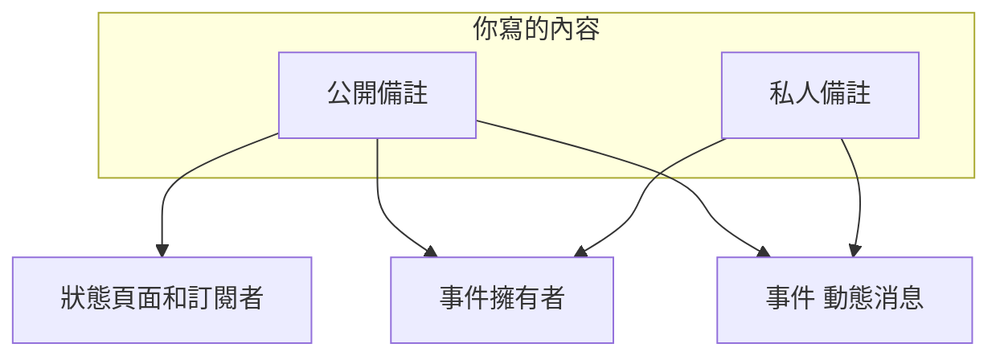
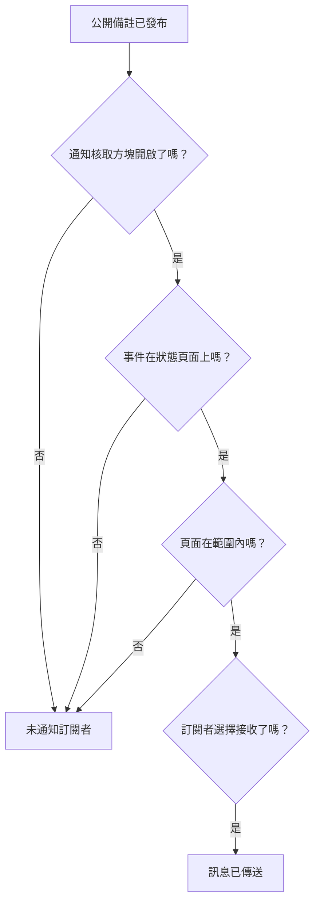

# 事件備註、負責人與動態

在你處理事件的過程中，每個事件都會累積一份書面紀錄：給客戶的更新、給團隊的工作備註，以及記錄所發生一切的活動動態。本頁介紹如何撰寫公開備註和私人備註、每種備註會觸及誰、事件動態，以及會被告知每一次變更的擁有者。

:::cards
- [發布公開備註](#發布公開備註): 透過狀態頁面和通知，把你知道的情況告訴客戶。
- [訂閱者何時收到通知](#公開備註何時真正觸及訂閱者): 公開備註要通過的檢查，以及它的徽章。
- [事件動態](#事件動態): 所發生一切的時間軸。
- [擁有者](#擁有者): 誰負責，以及他們會被告知什麼。
:::

## 運作方式

你寫的內容有一部分是給客戶的——例如凌晨 02:14 發到狀態頁面上、說明你已經找到那次有問題部署的更新。其餘的是給團隊的——某人貼上的堆疊追蹤、終於看懂的那張圖、決定進行容錯移轉。OneUptime 把這兩類讀者分開，同時把兩者都記錄在事件上。

**公開備註** 會發布到你的狀態頁面，並且可以通知訂閱者。**私人備註**（`IncidentInternalNote` 模型）留在儀表板之內。兩者之下是 **事件 動態消息**——一條只能追加的時間軸，記錄事件上發生的一切——以及 **擁有者** 清單，它決定誰會收到通知。

這一切都掛在事件的側邊選單上：**備註 → 公開備註**、**備註 → 私人備註** 和 **團隊 → 擁有者**。動態位於事件的 **概覽** 頁面。

## 公開備註與私人備註

這兩種備註在儀表板中看起來相似，行為卻截然不同。

|                          | 公開備註                                                            | 私人備註                                                        |
| ------------------------ | ------------------------------------------------------------------- | --------------------------------------------------------------- |
| 模型                     | `IncidentPublicNote`                                                | `IncidentInternalNote`                                          |
| 顯示在狀態頁面上         | 是，作為事件時間軸的一部分                                          | 從不——狀態頁面應用程式中沒有任何東西會讀取它們                  |
| 發布時間                 | `postedAt`，可以自行設定                                            | 無：依 `createdAt` 加上時間戳記並排序                           |
| 通知訂閱者               | 當 **Notify status page subscribers** 開啟時                        | 從不：它根本沒有訂閱者相關欄位                                  |
| 附件可由誰取得           | 狀態頁面訪客，透過狀態頁面路由                                      | 僅限經過驗證的儀表板 API                                        |
| 通知擁有者               | 是                                                                  | 是                                                              |

**「私人」的真正意思。** 它的意思是「不發布到狀態頁面」——而不是「只限一小群人」。能讀取事件的內建角色可以讀取兩種備註，所以能讀取事件的人通常也能讀取它的私人備註；在自訂角色中，它們是兩個獨立的權限：**Read Incident Status Page Note** 和 **Read Incident Internal Note**。如果你需要限制誰能看到事件本身，請使用事件上的 **私人事件** 旗標（`isPrivate`），它會讓事件在所有狀態頁面上隱藏，並將其限制為事件的擁有者使用者、擁有者團隊的成員，以及專案管理員和擁有者。

**擁有者兩種都看得到。** 通知擁有者的工作會同時查詢公開備註和私人備註。私人備註是對訂閱者保密，而不是對應變人員保密。

| 如果你想……                                             | 選擇             |
| ------------------------------------------------------ | ---------------- |
| 告訴客戶你知道了什麼，以及何時會有更多消息             | **公開備註**     |
| 補登一則你已經在別處發出的更新                         | **公開備註**     |
| 記錄一個假設、你執行的指令或一條死路                   | **私人備註**     |
| 附上堆積傾印或內部儀表板截圖                           | **私人備註**     |

## 發布公開備註

:::steps
### 開啟公開備註

開啟事件，在它的側邊選單中選擇 **備註 → 公開備註**。備註上方的撰寫器會在你發布之前說明誰會讀到這則備註：**Public · Visible on your status page**。

### 撰寫更新

用 Markdown 撰寫備註，或從你的某個 **範本** 或 **Draft with AI** 開始。如果訂閱者需要看到檔案，就用 **Attach** 新增。

### 決定通知誰

保持 **Notify status page subscribers** 勾選以通知訂閱者，或取消勾選以靜默發布。它下方的 **Will notify** 顯示備註將觸及哪些狀態頁面，**預覽** 顯示他們將收到的電子郵件。

### 發布

點選 **Post update**，或按 Ctrl+Enter（Mac 上為 ⌘+Enter）。備註會出現在清單最上方，並帶有一個追蹤其通知進度的徽章。
:::

同一個撰寫器也可以從事件動態 **操作** 選單中的 **Add Public Note** 以對話方塊開啟（請參閱 [事件動態](#事件動態)），所以無論從哪裡寫，備註的寫法都一樣。

| 控制項                             | 用途                                                                                                                                          |
| ---------------------------------- | --------------------------------------------------------------------------------------------------------------------------------------------- |
| 備註內文                           | Markdown 內文。必填。                                                                                                                         |
| **範本**                           | 把你的某個備註範本放進備註，接在你已經輸入的內容之後。請參閱 [備註範本](#備註範本)。                                                    |
| **Draft with AI**                  | 根據事件起草備註，供你編輯。請參閱 [用 AI 產生備註](#用-ai-產生備註)。                                                             |
| **Attach**                         | 在狀態頁面上與訂閱者分享的檔案。選填。                                                                                                        |
| **Posted now**                     | 備註顯示的發布時間：除非你在這裡選擇更早的時間，否則就是你發布的那一刻，依你目前的時區顯示。                                                  |
| **Notify status page subscribers** | 核取方塊。預設開啟，除非事件在宣告時沒有通知訂閱者——這時它以關閉狀態開始。關閉它即可靜默發布。                                              |

**安靜的事件維持安靜。** 如果事件在宣告時關閉了 **通知狀態頁面訂閱者**（或是以私人事件宣告的），它的訂閱者從未得知此事，所以公開備註不應該成為他們聽到的第一則消息。在這樣的事件上，核取方塊以關閉狀態開始，下方有一行說明原因。你仍然可以勾選它，就這則備註通知訂閱者。沒有明確選擇而發布的備註也遵循同樣的規則：Slack 和 Microsoft Teams 中的備註、工作流程，以及省略了 `shouldStatusPageSubscribersBeNotifiedOnNoteCreated` 的 API 請求。明確的 `true` 或 `false` 一律會被保留。[排定維護事件](/docs/status-pages/subscribers#排定維護事件) 和 [事件片段](/docs/status-pages/subscribers) 上的公開備註遵循類似的規則，依據的是該維護事件或片段在建立時是否通知了訂閱者；把片段設為私人不會影響這一點。

**查看備註將觸及誰。** 當 **Notify status page subscribers** 處於勾選狀態時，它下方的 **Will notify** 列會列出備註將傳往的狀態頁面，每個管道附上「最多」訂閱者數量，以及那些列出了事件監測器但不會收到通知的頁面和原因。沒有人會收到通知時它什麼都不顯示，除非事件在狀態頁面上隱藏，或原因是事件的狀態頁面範圍。它遵循事件的狀態頁面範圍，因此限定到兩個站點頁面的事件上的備註，會顯示它將觸及這兩個頁面。請參閱 [每個受眾一個狀態頁](/docs/status-pages/one-status-page-per-audience)。

**查看他們將收到什麼。** 在同一個核取方塊旁邊，**預覽** 會顯示每個狀態頁面的訂閱者針對你正在撰寫的備註將收到的電子郵件，以及它使用哪個範本、為什麼使用。在備註有文字之前它保持灰色。**傳送測試郵件給我** 只會把這封電子郵件傳送到你自己的帳戶電子郵件，不會傳給其他任何人。請參閱 [訂閱者與公告](/docs/status-pages/subscribers#事件)。

> [!TIP]
> **發布時間才是備註真正的時間戳記。** 狀態頁面依 `postedAt` 而不是你輸入的時間排序和顯示公開備註——所以如果你要把 40 分鐘前發出的一則更新補到狀態頁面上，請選擇 **Posted now** 並設定它實際發生的時間。如果備註透過 API（`/api/incident-public-note`）送達時沒有帶時間，OneUptime 會加上目前時間。

每則備註都會顯示作者、發布時間、轉譯後的 Markdown 及其附件，並在標題中顯示它的訂閱者通知進行到哪一步。**Search notes…** 依內容尋找備註，動態可以依最新的優先或最舊的優先閱讀。

## 發布私人備註

**備註 → 私人備註** 刻意設計得更簡單。它是同一個撰寫器，顯示 **Private · Only your team can see this**，帶有備註內文、**範本**、**Draft with AI**，以及用於給事件應變團隊之檔案的 **Attach**。事件動態 **操作** 選單中的 **新增私人註記** 會以對話方塊開啟它。透過 API，私人備註對應 `/api/incident-internal-note`。

沒有發布時間，沒有訂閱者核取方塊——備註在建立時加上時間戳記。

兩種備註都在 Markdown 編輯器中撰寫，它可以用 **增加縮排** 和 **減少縮排**——或 Tab 和 Shift+Tab——巢狀清單項目，並保留你從 Word、Google Docs 或其他 OneUptime 頁面貼上內容中的清單、連結和格式。Ctrl+Z 會復原增加或減少縮排，在視覺化模式下還會依與你的輸入一致的順序復原編輯器插入的區塊和貼上。從備註中複製的程式碼區塊會貼回為程式碼區塊，從中複製的一個字會貼上為行內程式碼。請參閱 [宣告事件](/docs/incidents/declaring-incidents#第-1-步事件詳細資訊)。

## 備註上的附件

兩種備註都透過撰寫器的 **Attach** 按鈕接受檔案附件，而且都會在備註內文下方顯示附件清單，每個檔案帶有一個 **Download attachment** 連結。

差別在於誰能取得檔案：

- **公開備註的附件** 可以由狀態頁面訪客透過狀態頁面路由下載，與備註本身一起。
- **私人備註的附件** 只能透過經過驗證的儀表板 API 取得。它們沒有狀態頁面路由。

這讓附件和備註文字一樣，要做出公開還是私人的決定。給客戶看的時間軸圖片放在公開備註上；設定傾印放在私人備註上。

圖片也遵循同樣的決定。你貼上或拖放到備註中的圖片，或用 **上傳圖片** 新增的圖片，儲存在事件所屬的專案中並顯示在備註內，誰能看到它取決於備註：

- **在私人備註中**——或在發布之前的公開備註中——圖片只對以專案要求的方式登入的專案成員顯示。其他任何人開啟它的位址都看不到任何東西，就像那裡沒有圖片一樣。
- **在公開備註中**，圖片對所有能看到這則備註的人顯示：在狀態頁面上，以及訂閱者收到的電子郵件中。公開備註一律隨它的事件一起顯示，從不單獨顯示：當事件在狀態頁面上隱藏或為私人時，其備註中的圖片也只對專案成員顯示。

每次上傳一開始都是私人的，無論來自儀表板還是 API。只有當狀態頁面所顯示的某樣東西包含該圖片時，圖片才對所有人可見：事件、片段或排定維護事件在狀態頁面上顯示期間的公開備註；從開始顯示時起的公告；事件處於 **於狀態頁面可見** 且非私人期間的事件描述；同樣已在那裡發布的事後分析；片段或排定維護事件在狀態頁面上顯示期間的描述（片段為私人時除外）；以及狀態頁面本身的概覽、群組和資源描述。一旦條件不再成立——事件被隱藏或設為私人、圖片被編輯移除、備註或事件被刪除——圖片就會重新變為私人，除非狀態頁面顯示的其他內容中仍然包含它。表單的描述和感謝訊息也以同樣的方式在表單接受送出期間向所有人顯示其中的圖片。

透過 API、Terraform 或工作流程讀取備註時，只會列出讀者可以開啟的附件：備註所屬專案的檔案，以及公開檔案。備註引用的來自其他專案的附件會被排除在清單之外，就像備註沒有它一樣。

## 用 AI 產生備註

撰寫器有一個 **Draft with AI** 按鈕，位於兩個備註頁面以及動態的 **Add Public Note** 和 **新增私人註記** 對話方塊中。它把事件傳送給你專案的 AI 提供者，並把產生的 Markdown 放進備註，你可以在發布前編輯——不會自動發布任何內容。

| 對話方塊                           | 撰寫內容                                                             | 範本                                                              |
| ---------------------------------- | -------------------------------------------------------------------- | ----------------------------------------------------------------- |
| **Generate Public Note with AI**   | 給客戶看的備註，依據對事件資料的分析。                               | **Status Update**、**Resolution Notice**、**Maintenance Update**  |
| **Generate Private Note with AI**  | 內部技術備註。                                                       | **Investigation Update**、**Technical Analysis**、**Shift Handoff** |

在按鈕背後，儀表板會帶著所選範本以及 `public` 或 `internal` 的備註類型，向 `/incident/generate-note-from-ai/{incidentId}` 傳送請求。

傳送的是事件的文字。其中嵌入的圖片或檔案——例如貼到描述中的截圖——會被取代為一段簡短說明，例如 `[image omitted: PNG, 340 KB]`，而且每個文字欄位都會被截斷到 16,000 個字元，這樣一次大段貼上永遠不會擠掉其餘內容。事件本身保留它的圖片。

## 備註範本

如果你的團隊每次中斷都要寫同樣的三則更新，就把它們儲存一次。撰寫器的 **範本** 選單會在兩個備註頁面和動態的備註對話方塊中列出它們，選擇一個就會把它放進備註。

範本在公開備註和私人備註之間共用：一份範本清單同時服務兩者，同一個範本可以插入任一種備註。

範本中的預留位置——`{{incident.title}}`、`{{incident.state}}`、`{{incident.customFields.impact}}` 以及 [備註範本](/docs/incidents/settings#備註範本) 中列出的其他預留位置——會在你選擇範本時用事件的目前值填入，無論是在備註頁面上，還是在 **確認** 和 **解決** 對話方塊中。你已經輸入的內容不會被變動，沒有值的預留位置維持原樣。

> [!IMPORTANT]
> 發布公開備註之前，請先閱讀填入後的備註：`{{incident.affectedStatusPages}}` 會列出事件觸及的每一個狀態頁面，而所有這些頁面的訂閱者都會讀到它。

你在 **事件 → 設定 → 備註範本** 中管理範本——卡片標題為 **事件的公開或私人備註範本**，表單只有一頁：**範本名稱** 和 **範本描述**（兩者都必填），接著是內文。在你還沒有任何範本時，**範本** 選單會這樣說明，並連結到那裡。

## 從 Slack 或 Microsoft Teams 發布備註

如果你連線了工作區，應變人員永遠不必離開頻道。Slack 和 Microsoft Teams 都提供新增備註的操作，它會開啟一個帶有 **Note Type** 下拉式選單——**Public Note**（發布到狀態頁面）或 **Private Note**（僅團隊成員可見）——和 **Note** 文字方塊的對話方塊，並把結果直接寫到事件上。

值得了解的三個細節：

- **防止重複** —— 每則備註都會記錄它來自哪則 Slack 訊息（`postedFromSlackMessageId`，格式為 `channel_id:message_ts`），所以多個人對同一則訊息做出回應，只會產生一則備註，而不是五則。
- **備註會回傳** —— 發布任一種備註，也會向已連線的事件頻道推送一則訊息，因為備註的動態項目在建立時啟用了工作區通知。
- **以提出要求的人的身分發布** —— 來自對話方塊或回應的備註會以該人員的 OneUptime 權限發布，所以需要該人員有權在事件上發布這種備註。被拒絕時，會告訴他們原因——在 Slack 中透過私訊，在 Microsoft Teams 中在對話裡（如果是回應，則在該訊息的討論串中）——而且不會發布任何內容。

## 公開備註何時真正觸及訂閱者

在開啟 **通知狀態頁面訂閱者** 的情況下建立公開備註，並不能單憑這一點保證會發出電子郵件。備註必須通過一連串檢查，每一次失敗都會記錄具體原因，而不是報錯：

1. **通知狀態頁面訂閱者** 必須開啟。如果沒有開啟，備註在建立的那一刻就會被標記為已略過。在宣告時沒有通知訂閱者的事件上，它以關閉狀態開始。
2. 備註必須屬於一個仍然存在的事件。
3. 事件必須至少附加一個監測器——沒有監測器，就沒有可以把備註路由過去的狀態頁面資源。
4. 事件的 **於狀態頁面可見** 旗標（`isVisibleOnStatusPage`）必須為 true，而且事件不能是私人的（`isPrivate`）。無論該旗標如何，私人事件都會在所有狀態頁面上隱藏——請參閱 [讓事件不出現在狀態頁面上](/docs/incidents/states-and-severities#讓事件不出現在狀態頁面上)。
5. 事件觸及的每個狀態頁面都必須開啟 **顯示事件**（`showIncidentsOnStatusPage`）。它觸及的頁面是列出其監測器的頁面，如果事件被限定到某些頁面，則縮小到那些頁面。沒有被限定到任何頁面的事件，會略過那些只顯示限定到自身之事件的頁面。請參閱 [每個受眾一個狀態頁](/docs/status-pages/one-status-page-per-audience)。
6. 每個訂閱者都必須通過自己的偏好設定——沒有取消訂閱，而且在頁面允許訂閱者選擇時，訂閱了這個資源和 `Incident` 事件類型。

> [!NOTE]
> **通知不是即時的。** 傳送通知的工作每分鐘執行一次，所以從儲存備註到電子郵件寄出，預計最多會有一分鐘左右。這就是備註上 **Notifying subscribers soon** 以及事件本身通知上 **Sending Soon** 的意思。

公開備註的標題用一個徽章追蹤整個過程。點選它可以看到通知的狀態訊息，說明發生了什麼：

| 徽章                           | 意義                                                                                                                                              |
| ------------------------------ | ------------------------------------------------------------------------------------------------------------------------------------------------- |
| **Subscribers not notified**   | 沒有傳送任何內容：備註是在取消勾選 **通知狀態頁面訂閱者** 的情況下發布的，或者上述某道關卡關閉了。原因已被記錄。                                  |
| **Notifying subscribers soon** | 已排入佇列，等待傳送工作的下一次執行。                                                                                                            |
| **Notifying subscribers**      | 工作正在處理訂閱者清單。                                                                                                                          |
| **Subscribers notified**       | 已向每個訂閱者傳送訊息。狀態訊息會依狀態頁面列出每個管道傳送了多少則。                                                                            |
| **Notification failed**        | 並非每個訂閱者都收到了傳送，或者工作因錯誤而停止。狀態訊息會說明是哪一種。                                                                        |

**已傳送就是已傳送。** 工作會等待每一則訊息：電子郵件或簡訊在郵件伺服器或簡訊供應商接收後算作已傳送，Slack、Microsoft Teams 或 webhook 訊息在對端回應後算作已傳送。被拒絕、出錯或在 4 分鐘內沒有得到回應的訊息算作失敗，一次失敗就會讓徽章變為 **Notification failed**；其他訂閱者仍會收到傳送。這時狀態訊息類似於 `Not every subscriber was sent this notification: 2 of 61 messages failed. Site 03: 41 email sent. Site 07: 16 email, 2 SMS sent; 2 email failed.`「已傳送」是 OneUptime 能看到的範圍：郵件伺服器之後仍可能退回電子郵件。

:::details 大型頁面和長時間的傳送
狀態頁面的訂閱者每次讀取 10,000 個，直到全部觸及，同時有 20 則訊息在傳送中。單一通知在 20 分鐘後不再開始傳送新訊息：屆時尚未觸及的會被列出，並標記為 **Notification failed**。中途被打斷的傳送——它的伺服器重新啟動或停止回應——在處於 **Notifying subscribers** 狀態 40 分鐘後，也會被標記為 **Notification failed**，訊息以 `Interrupted:` 開頭，所以它永遠不會一直停在那裡。請參閱 [訂閱者與公告](/docs/status-pages/subscribers)。
:::

### 再次傳送備註的通知

點選備註的通知徽章，查看發生了什麼。通知失敗的備註會提供 **重試通知**，通知已發出的備註會提供 **重新傳送通知**。兩者都會先詢問：確認方塊會列出備註現在將觸及的狀態頁面，每個管道附上「最多」數量，或說明它不會觸及任何人，並說明接下來會發生什麼。兩者都會把備註放回待處理狀態，讓下一次執行處理，並把它傳送到事件現在觸及的每個狀態頁面，包括已經收到的訂閱者。如果你在備註發布後變更了事件被限定到的頁面，它會傳往現在限定的那些頁面。在取消勾選 **通知狀態頁面訂閱者** 的情況下發布的備註兩者都不提供，因為它本來就不打算傳送；通知仍在佇列中或正在傳送時，兩者也都不提供。排定維護事件和事件片段上的公開備註只在失敗後保留 **重試通知**。

再次傳送備註的通知，會像發布它時一樣把備註內容告訴每個訂閱者，所以既需要發布會通知訂閱者之公開備註的權限，也需要編輯公開備註的權限。透過 API，這就是儀表板所做的同一次更新，把 `subscriberNotificationStatusOnNoteCreated` 設回 `Pending`；對於沒有這些權限的呼叫端、在沒有通知訂閱者的情況下發布的備註，以及備註通知正在傳送期間，該請求會被拒絕。

:::details 事件「已建立」通知如何接續
只有事件的「已建立」通知會從中斷處接續：它會記錄已完整傳送的狀態頁面，事件 **概覽** 上的 **重試** 會略過這些頁面。紀錄是依狀態頁面而不是依訂閱者保存的，所以在中途停下的頁面會被完整地再傳送一次，包括該頁面上已經收到的訂閱者。**重試** 確認方塊提供 **再次傳送到每個狀態頁面，包括已送達的頁面**，選擇後它會變成 **重新傳送到所有頁面**；成功之後的 **重新傳送** 會再次傳送到每個頁面。請參閱 [每個受眾一個狀態頁](/docs/status-pages/one-status-page-per-audience#adding-status-pages)。
:::

### 編輯公開備註

**除非你要求，編輯公開備註是靜默的。** 備註的編輯表單有一個 **將此更新通知訂閱者** 核取方塊，每次都以未勾選狀態開始。對於訂閱者需要知道的修改，勾選它，他們就會收到編輯後的備註，並標記為更新；接著備註會在原有徽章旁顯示第二個用於這次更新的徽章，失敗後有它自己的 **重試通知**：

| 更新徽章                | 意義                                                |
| ----------------------- | --------------------------------------------------- |
| **更新排隊中**          | 等待傳送工作的下一次執行。                          |
| **正在傳送更新**        | 工作正在處理訂閱者清單。                            |
| **更新已傳送**          | 已向每個訂閱者傳送編輯後的備註。                    |
| **更新傳送失敗**        | 並非每個訂閱者都收到了傳送。                        |
| **更新未傳送**          | 被上述某道關卡擋下。                                |

已傳送的更新不會再次提供：勾選核取方塊編輯備註以傳送最新文字，或重新傳送備註本身。如果原始通知還沒有傳送，就不會另外發出更新——原始通知會帶上這次編輯。如果它恰好正在傳送，更新會等它完成後再發出。核取方塊和更新的 **重試通知** 需要與再次傳送備註通知相同的權限；沒有這些權限，你仍然可以編輯備註，只是不會通知任何人。請參閱 [訂閱者與公告](/docs/status-pages/subscribers)。

訂閱者實際收到的訊息依狀態頁面和管道使用範本產生——電子郵件、簡訊、Slack 和 Microsoft Teams 各有針對 **Subscriber Incident Note Created** 事件的範本，變數包括狀態頁面名稱和 URL、詳細資料連結、受影響的資源、事件嚴重性和標題、備註內文、事件的標籤、受影響的狀態頁面和自訂欄位，以及每個訂閱者的取消訂閱連結。預設的電子郵件、Slack 和 Microsoft Teams 訊息還會列出標記為 **包含在訂閱者通知中** 的事件自訂欄位及其目前值。這些範本和管道如何設定，請參閱 [訂閱者與公告](/docs/status-pages/subscribers)。

## 事件動態

**事件 動態消息** 卡片位於事件 **概覽** 頁面左欄的底部。它依序講述事件的經過：每個項目都有一個圖示、引發它的人的大頭貼和名稱、一個相對時間戳記（游標停留時顯示確切的當地時間），以及 Markdown 內文。預設情況下最新的項目在最上面。

有些項目帶有額外細節——例如擁有者通知會列出收到電子郵件的每個人，訂閱者通知會列出它傳往的每個狀態頁面、每個管道傳送和失敗的訊息數量以及電子郵件寄出時的主旨，如果有傳送內容，後面還會在 **Custom fields sent** 下列出它放入訊息的自訂欄位值。這些項目會顯示一個 **More Information** 按鈕，開啟 **More Information** 面板。

卡片標題中還有一個 **操作** 選單，讓你不離開時間軸就能採取行動：

- **Execute Runbook** —— 針對這個事件啟動一個 [Runbook](/docs/runbooks/index)。
- **執行待命策略** —— 依需要呼叫一個策略。已封存的策略不會呼叫任何人：它在事件上的執行紀錄會說明由於策略已封存而沒有執行。
- **Add Public Note** —— 以對話方塊開啟 **公開備註** 頁面的撰寫器：寫好備註，然後點選 **Post update**。範本、**Draft with AI**、附件、附帶觸及對象的 **Notify status page subscribers** 和 **預覽** 一應俱全。備註以現在的時間發布；要補登，請選擇 **Posted now**。
- **新增私人註記** —— 以對話方塊開啟 **私人備註** 頁面的撰寫器：寫好備註，然後點選 **Add note**。

對於不能撰寫備註的人，兩個備註操作都會被鎖定，並指出缺少的權限。備註發布後，對話方塊會關閉，動態會顯示它。

其他一切都在旁邊的 **⋯** 按鈕後面——與表格卡片標題中的 **更多選項** 按鈕相同——讓標題顯示的按鈕盡可能少：

- **最新的優先** / **最舊的優先** —— 閱讀動態的順序。目前使用的那個會打勾，瀏覽器會為每個事件的動態記住你的選擇。
- **依事件類型篩選** —— 一個列出動態事件類型的對話方塊，每種類型都帶有其項目使用的圖示，清單較長時還有搜尋方塊。勾選要顯示的類型，然後選擇 **套用篩選器**；什麼都不勾選時，顯示所有事件類型。動態處於篩選狀態時，其上方的一個方塊會說明它顯示了多少種事件類型，每種一個標籤，並提供 **編輯篩選器** 和 **清除篩選器**。篩選器不會儲存：離開事件後，它的動態會再次顯示全部內容。
- **重新整理** —— 重新取得動態。

> [!NOTE]
> **動態只能追加，而且它不是你的稽核日誌。** API 允許建立和讀取動態項目，但不允許更新或刪除它們，所以沒有人能悄悄改寫事件的歷史。它也不是永久的：在計費的安裝中，超過三年的動態紀錄會被刪除。如需持久記錄誰改了什麼，請使用事件側邊選單中的 **進階 → 稽核日誌**。

## 動態記錄什麼

動態項目由事件服務本身、兩個備註服務、狀態時間軸、擁有者和成員變更、警示的連結和取消連結、規則引擎、待命執行、AI 調查和事後分析執行器，以及通知 cron 工作寫入。事件類型包括：

- **事件本身** —— `IncidentCreated`、`IncidentUpdated`、`IncidentStateChanged`。`IncidentUpdated` 項目記錄一次編輯變更了什麼：標題、描述、根本原因、補救備註、標籤、嚴重性、監測器及為其設定的狀態，以及加入或移出事件範圍的狀態頁面。每個變更了的值都有一行，依原樣儲存的值則沒有，所以儲存一張什麼都沒改的卡片，或者 API 用戶端或工作流程把事件依原樣寫回，完全不會新增項目。讀起來相同的文字就視為相同（行尾和前後空白除外），標籤只要是同一組就視為相同，與順序無關；被清除的值顯示為已移除，移除所有標籤顯示為「All labels removed.」。警示的 **Alert updated** 項目也是同樣的運作方式。
- **備註和文件** —— `PublicNote`、`PrivateNote`、`RootCause`、`RemediationNotes`、`PostmortemNote`。`PostmortemNote` 項目在事後分析的備註變更時寫入，而不是每次儲存事後分析時都寫入。
- **人員** —— `OwnerUserAdded`、`OwnerTeamAdded`、`OwnerUserRemoved`、`OwnerTeamRemoved`、`IncidentMemberAdded`、`IncidentMemberRemoved`。
- **已連結的警示** —— `AlertLinked` 和 `AlertUnlinked`，顯示為 **警示已連結** 和 **警示已取消連結**。
- **通知** —— `OwnerNotificationSent`、`SubscriberNotificationSent`、`OnCallPolicy`、`OnCallNotification`。
- **自動化** —— `LabelRuleExecuted`、`OwnerRuleExecuted`、`PrivacyRuleExecuted`、`OnCallRuleExecuted`、`AutoRemediation`。
- **視訊通話** —— `VideoCallStarted` 和 `VideoCallFailed`：為事件發起的通話及其加入連結，或提供者無法發起通話的原因。請參閱 [視訊通話](/docs/workspace-connections/video-calls)。

每種類型都有自己的圖示，所以你可以快速瀏覽一條很長的動態，從閒聊中挑出狀態變更。AI 產生的根本原因分析會另外標記，並以受限的 Markdown 模式轉譯。**已建立事件** 項目、記錄新標題的項目，以及加入或離開片段的項目，會完全依輸入的樣子顯示標題：它們會跳脫其中的 `\`、`[`、`]`、`*`、`_`、`~`、反引號和 \<，因此標題不會變成圖片、原始 HTML、像 \<!here\> 這樣的 Slack 提及、隱藏了目的地的連結，或粗體、斜體或程式碼。標題中的位址仍會顯示為指向該位址的連結。

連結警示也會記錄在警示上。警示有自己的動態，同樣的變更在那裡顯示為 **已連結至事件**（`LinkedToIncident`）或 **已取消與事件的連結**（`UnlinkedFromIncident`），並寫明事件。只有事件的 **警示已連結** 和 **警示已取消連結** 項目會發布到 Slack 和 Microsoft Teams，所以每次連結只會宣布一次。從警示宣告的事件會取得一則列出所有警示的 **警示已連結** 項目，而不是每個警示一則，而且私人警示或事件的標題不會寫入另一方的項目。請參閱 [已連結的警示](/docs/incidents/linked-alerts)。

動態會尊重事件的隱私：對於私人事件，動態的讀取會和事件本身一樣進行篩選。

## 擁有者

擁有者是對事件負責的人員和團隊。事件發生的一切都會通知他們——正是有了他們，事件才不會在大家都以為別人在處理時被忽略。

開啟事件側邊選單中的 **團隊 → 擁有者**。**擁有者** 卡片顯示一個計數徽章，把擁有者描述為對這個事件負責、會收到變更通知的人員和團隊，並顯示類似「2 people · 1 team」的目前計數。擁有者以重疊的大頭貼顯示；游標停在大頭貼上會顯示此人的電子郵件，或把該項目標記為 **團隊**。

- 點選 **新增擁有者**，開啟一個帶有搜尋方塊的選擇器，用來尋找人員或團隊。
- 點選大頭貼上的移除控制項，開啟 **移除擁有者** 確認方塊，然後點選 **移除**。
- 還沒有擁有者時，卡片會這樣說明，並邀請你新增一位隊友或一個團隊，讓他們收到變更通知。

擁有者使用者和擁有者團隊是分開的紀錄——新增一個團隊，會讓該團隊的每個成員在通知意義上都成為擁有者，而不需要逐一列出。透過 API，它們對應 `/api/incident-owner-user` 和 `/api/incident-owner-team`。

只有你專案自己的團隊和成員才能成為擁有者。選擇器只提供他們，透過 API、Terraform 或工作流程新增的擁有者也遵循同樣的規則：來自其他專案的團隊，或不是專案成員的人，會被拒絕。

## 擁有者如何被指派

進入擁有者清單有四條途徑：

- **來自事件範本** —— 範本帶有 **擁有者** 欄位：擁有該事件、並會在事件建立或更新時收到通知的人員和團隊，從與 **新增擁有者** 相同的清單中選擇。從範本建立事件時會預先填好他們，並在事件的 Slack 和 Microsoft Teams 頻道存在之後新增，因此邀請事件擁有者加入新頻道的通知規則也會邀請他們。儀表板，以及選擇了 **Incident Template** 的工作流程 **Create One Incident** 步驟，新增他們時不會發出「你已被新增」的通知；帶有範本的 [表單](/docs/forms/on-submit) 會通知他們，並把事件的 **事件已建立** 通知延後到他們被新增之後。請參閱 [宣告事件](/docs/incidents/declaring-incidents)。
- **來自事件擁有者規則** —— 相符的規則在建立時自動新增擁有者。
- **透過 API 建立時** —— 隨建立呼叫傳入的擁有者使用者和團隊，會以同樣的方式、在頻道存在之後新增，而且不會發出「你已被新增」的通知。
- **手動** —— 在事件進行中的任何時候，使用 **擁有者** 頁面上的 **新增擁有者** 控制項。

重複新增同一個人是安全的；已經指派的擁有者不會重複。

## 事件擁有者規則

**事件擁有者規則** 會在相符的事件建立時自動指派擁有者使用者和團隊——這是一層路由，讓資料庫事件不需要任何人費心就落到資料庫團隊手上。它們位於 **事件 → 規則 → 擁有者規則**，其餘的事件自動化在 [事件設定與自動化](/docs/incidents/settings) 中介紹。

規則表單有兩個步驟——**比對**，也就是事件必須符合的條件，接著是 **擁有者**，也就是規則新增的內容：

- **擁有者** —— **新增擁有者** 會開啟一份包含人員和團隊的清單；逐一點選即可新增，用其標籤上的 **×** 移除已選項目。規則相符時，每個被選取的人員和團隊都會被新增為擁有者，已經指派的擁有者不會重複。
- **繼承擁有者**，摺疊在 **擁有者** 之下 —— 從相關實體指派擁有者，而不是逐一列名。**從監測器繼承擁有者** 會讓事件監測器的每個擁有者都成為事件的擁有者，**從主機繼承擁有者**、**從 Kubernetes 叢集繼承擁有者**、**從 Docker 主機繼承擁有者**、**Inherit Owners From Podman Hosts** 和 **從服務繼承擁有者** 則對這些資源做同樣的事。

新規則必須新增某個人：至少選擇一個擁有者，或開啟一個 **繼承擁有者** 開關。API 和 Terraform 同樣會拒絕不新增任何人的新規則。它的 **名稱** 會依你選擇的擁有者填寫——或者，對於只做繼承的規則，依它的開關填寫（_Inherit owners from monitors_）——直到你輸入自己的名稱。編輯規則時從不強制要求擁有者，所以不新增任何內容的舊規則仍然可以改名或關閉；清單會把它標記為 **不新增任何內容**。請參閱 [標籤與擁有者規則](/docs/configuration/label-and-owner-rules)。

**更多欄位** 下的 **通知擁有者** 控制大家是否會得知。用於真正的路由時保持開啟；如果要靜默新增擁有者，就關閉它——當規則只是為了記帳方便而不是為了呼叫時很有用。

每次規則執行都會寫入事件動態，所以你一律能分辨一個人是被規則新增的還是被人手動新增的。

## 擁有者會收到哪些通知

有五個工作會通知擁有者，每個每分鐘執行一次：

| 通知                       | 時間                                                         | 電子郵件主旨                                                   |
| -------------------------- | ------------------------------------------------------------ | -------------------------------------------------------------- |
| **事件已建立**             | 事件被宣告時。                                               | `[New Incident {number}] - {title}`                            |
| **有備註發布**             | 發布了公開 *或* 私人備註時。                                 | `[Update Incident {number}] - {title}`                         |
| **狀態已變更**             | 事件移到另一個狀態時。                                       | `[{State} Incident {number}] - {title}`                        |
| **你已被新增**             | 你被新增為擁有者時。                                         | `You have been added as the owner of Incident {number} - {title}` |
| **仍未解決**               | 一則提醒，由事件的下一次提醒時間驅動。                       | `[Reminder] Incident {number} is still {state} - {title}`      |

每則通知都會透過此人在 **使用者設定 → 通知設定** 中開啟的管道發出——電子郵件、簡訊、語音通話、推播、WhatsApp、Telegram、Slack、Microsoft Teams 或 webhook——實際傳送什麼由這些設定決定。每位接收者都可以個別關閉其中每一項——每位使用者的設定分別表述為傳送給你事件已建立、備註已發布、狀態已變更、擁有者已新增、成員已指派以及仍未關閉提醒的通知。只想在狀態變更時接到電話的人，可以剛好只設定這一項。狀態變更代表什麼，請參閱 [事件狀態與嚴重程度](/docs/incidents/states-and-severities)。

**沒有擁有者的事件也不會悄無聲息。** 如果事件完全沒有擁有者，通知工作會改為通知專案的擁有者，所以不會有任何遺漏。透過表單回報、且其範本帶有擁有者的事件，其 **事件已建立** 通知則會等待這些擁有者。每個被通知的人也會被附加到對應的動態項目中，所以事後你可以確切看到告訴了誰、傳到哪個位址。

## 後續步驟

:::cards
- [事件設定與自動化](/docs/incidents/settings): 擁有者規則、備註範本和其餘的自動化。
- [訂閱者與公告](/docs/status-pages/subscribers): 公開備註最後出現在哪裡，以及誰會收到它們。
- [每個受眾一個狀態頁](/docs/status-pages/one-status-page-per-audience): 事件的備註會觸及哪些狀態頁面。
- [事件狀態與嚴重程度](/docs/incidents/states-and-severities): 驅動動態半數內容的狀態機。
:::
