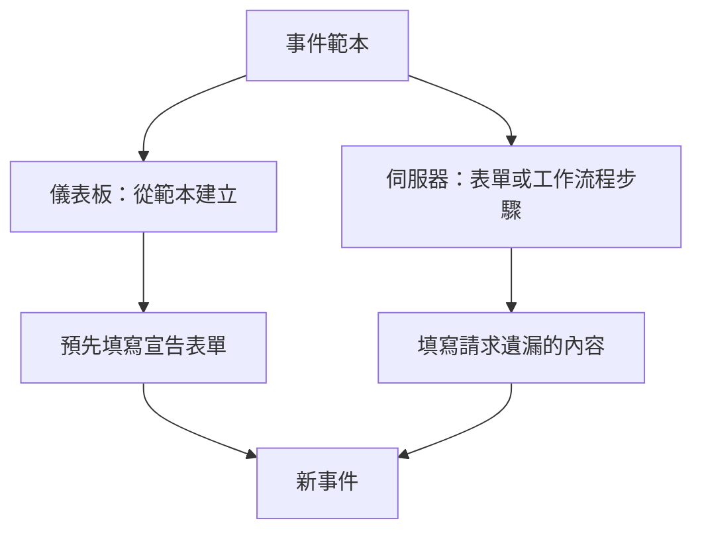
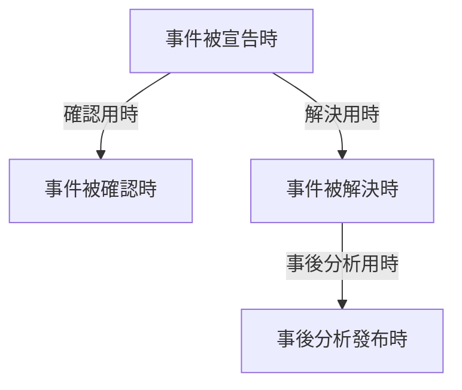
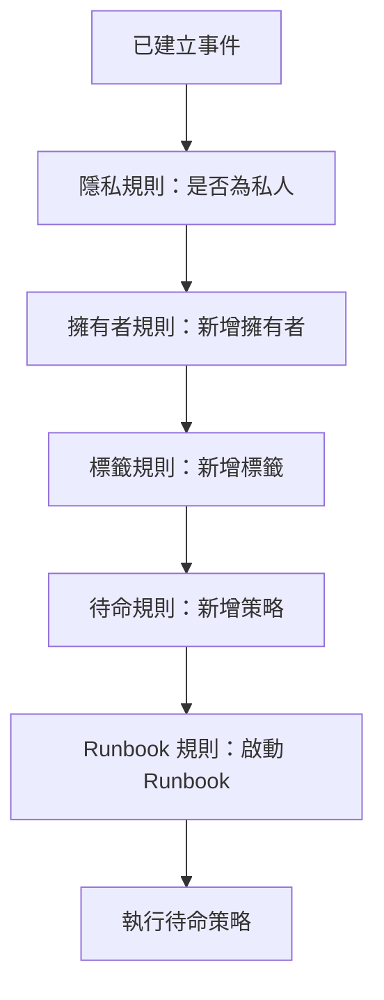

# 事件設定與自動化

事件設定位於 **事件** 之內，而不在 **專案設定** 中：狀態和嚴重性、範本、自訂欄位、角色、測量和編號前綴，以及作用於每個新事件的規則。本頁是這些頁面中每一個的參考，也說明了事件宣告那一刻會自動執行的內容。

:::cards
- [事件範本](#事件範本): 每次都以預先填好的方式宣告同一類事件。
- [自訂欄位](#自訂欄位): 每個事件上都有你自己的欄位，在宣告時詢問。
- [測量](#測量): 為每個事件計算確認、解決或緩解所用的時間。
- [規則](#事件建立時執行的規則): 自動設定擁有者、標籤、呼叫和片段。
:::

## 事件設定所在的位置

從頂端列的 **產品** 選單開啟 **事件**，然後展開其側邊選單底部的 **設定**。**規則** 和 **設定** 都以摺疊狀態開始，所以要先展開它們，下面的頁面才會出現。這裡的一切都屬於專案範圍：範本、角色、自訂欄位和規則屬於一個專案，並適用於在其中宣告的每個事件，路由以 `/dashboard/{projectId}/incidents/settings/` 開頭。

| 頁面                     | 在這裡做什麼                                                                                 |
| ------------------------ | -------------------------------------------------------------------------------------------- |
| **事件狀態**             | 新增、重新命名、換色和重新排序事件所經歷的狀態。                                             |
| **事件嚴重性**           | 新增、重新命名、換色和重新排序嚴重性等級。                                                   |
| **事件範本**             | 預先填寫整個事件——標題、描述、資源、待命策略、擁有者、標籤。                                 |
| **備註範本**             | 公開備註和私人備註可重複使用的文字。                                                         |
| **事後分析範本**         | 可重複使用的事後分析結構。                                                                   |
| **自訂欄位**             | 定義出現在每個事件上的額外欄位。                                                             |
| **事件角色**             | 定義你為應變人員指派的角色，例如事件指揮官。                                                 |
| **測量**                 | 在每個事件上計算各項事情花了多久，例如確認用時或解決用時。                                   |
| **已連結的警示**         | 選擇連結到事件的警示是否隨事件一起確認和解決。新專案中兩者都開啟。                           |
| **編號前綴**             | 事件和片段編號前面的文字，例如 `INC-42` 中的 `INC-`。                                        |

OneUptime AI 自行做的事情不在這裡設定：它有自己的區段 **事件 → 人工智慧**，路由以 `/dashboard/{projectId}/incidents/ai/` 開頭。它的 **設定** 頁面可以開關調查新事件、自動修正新事件（在你開啟之前維持關閉，修正所附帶的修正提取要求和缺少遙測的提取要求也歸在它下面）以及起草事後分析，每個開關一切換就會儲存；縮小調查和修正哪些事件範圍的調查規則和自動補救規則，以及 AI 工作時遵守的選用限制，都摺疊在 **更多設定** 下，在你設定之前都不會生效。旁邊是 **洞察** 和 **日誌**：AI 從你的事件中學到了什麼，以及它做過的一切。請參閱 [AI SRE](/docs/ai/ai-sre)。

**事件狀態** 和 **事件嚴重性** 在 [事件狀態與嚴重程度](/docs/incidents/states-and-severities) 中有深入介紹——本頁其餘部分從 **事件範本** 開始。讓團隊外部的人回報事件的表單是一個獨立的產品：請參閱 [表單](/docs/forms/index)。會自行建立事件的工具，例如 [Huntress](/docs/integrations/huntress)，在 **事件 → 整合** 下設定。

展開 **規則**，你會看到另外八個頁面：**分組規則**、**待命規則**、**擁有者規則**、**Runbook 規則**、**隱私規則**、**標籤規則**、**SLA 規則** 和 **Reminder Rules**。它們在下文中介紹。

## 事件範本

事件範本是一個已儲存的事件骨架。與其每次付款叢集出問題時都重新輸入同樣的標題、同樣的監測器清單和同樣的待命策略，不如儲存一次，然後從範本宣告。

:::steps
1. 前往 **事件 → 設定 → 事件範本**（`/dashboard/{projectId}/incidents/settings/templates`）。卡片標題為 **事件範本**。
2. 點選 **建立事件 範本**。在 **範本資訊** 中為範本命名，然後在 **事件詳細資訊** 中填寫它要宣告的事件：**標題**、**事件嚴重性** 和 **描述**。
3. 用 **下一步** 走過選填步驟——它影響的資源、它的自訂欄位和它的待命策略——填寫這類事件共有的內容。
4. 在最後一步點選 **建立事件 範本**。從此，事件清單上的 **從範本建立** 會提供這個範本。
:::

建立範本會引導你完成一個四步驟精靈，當專案有事件自訂欄位時還會多兩步。只有前兩步要求你必須回答：**下一步** 會走過它們之後的選填步驟，**建立事件 範本** 位於最後一步。

- **範本資訊** —— **範本名稱** 和 **範本描述**。它們命名的是範本本身，從不出現在事件上。
- **事件詳細資訊** —— **標題**、**描述**（Markdown）和 **事件嚴重性**。在 **更多欄位** 下（摺疊時標題會列出這三項並顯示已設定的每一項）：
  - **初始事件狀態** —— 從範本宣告的事件開始時所處的狀態。它一開始是空的，與宣告表單一樣，選項依狀態順序列出。如預留位置所說，留空時它們從一般的起始狀態開始：專案的建立狀態，也就是每個新事件開始時所處的狀態。以某個狀態儲存的範本會保留該狀態。
  - **擁有者** —— 擁有從範本宣告之事件的人員和團隊。**新增擁有者** 會開啟一份同時包含兩者的清單，與事件 **擁有者** 頁面上的清單相同；每個選擇都顯示為一個可以移除的標籤。現有範本會在 **擁有者** 卡片上顯示它們。
  - **標籤** —— 從範本宣告的事件一開始帶有的標籤。
- **受影響的資源** —— 與宣告表單相同：**監測器**，接著是 **將監測器狀態變更為**，再來是用於主機、叢集和服務的 **其他受影響的資源**，**僅限這些狀態頁面** 位於 **更多欄位** 下。無論是否選擇了監測器，範本一律會詢問 **將監測器狀態變更為**：它也適用於從範本宣告事件時所選的監測器，宣告表單一選取第一個監測器就會顯示它。現有範本的 **受影響的資源** 卡片以同樣方式詢問，並顯示範本選擇的狀態，如果沒有選擇則顯示 **監測器維持目前狀態。**。**僅限這些狀態頁面** 會把從範本宣告的事件限定到列出其監測器的部分狀態頁面——一個 `Region East outage` 範本可以帶上東部站點的頁面。現有範本會在 **狀態頁面範圍** 卡片上顯示它，並提供 **編輯狀態頁面範圍**。請參閱 [每個受眾一個狀態頁](/docs/status-pages/one-status-page-per-audience)。
- **自訂欄位** —— 僅當專案有事件自訂欄位時：從這個範本宣告的事件一開始帶有的值。這裡提供每個欄位，而不只是 **詳細資料** 步驟會詢問的那些，而且沒有一個是必填的。現有範本有一張 **自訂欄位** 卡片用來修改它們。
- **建立時的自訂欄位** —— 同樣僅當專案有事件自訂欄位時：從這個範本宣告事件時，**詳細資料** 步驟詢問其中哪些，以及哪些必須填寫。現有範本有一張 **建立時的自訂欄位** 卡片用來修改它們。請參閱 [建立時的自訂欄位](#建立時的自訂欄位)。
- **待命** —— **待命策略**，也就是從這個範本建立的事件被宣告時要執行的策略。

幾條簡單規則：

- 範本清單只顯示 **名稱** 和 **描述**。無法在清單中編輯或刪除列——要修改範本，請開啟它（`/dashboard/{projectId}/incidents/settings/templates/{modelId}`）。
- 每個能編輯範本的人都可以變更它的詳細資訊和受影響的資源，包括 **初始事件狀態** 和 **將監測器狀態變更為**：Project Owners、Project Admins 和 Project Members、Incident Admins 和 Incident Members，以及擁有 **Edit Incident Template** 的角色。
- 範本支援 JSON 匯入和匯出，因此你可以在專案之間移動範本。
- 沒有範本時，清單會顯示 **找不到事件範本**，其正下方是 **建立事件 範本**。
- 同樣在沒有範本時，事件清單上的 **從範本建立** 會開啟一個 **No Incident Templates** 對話方塊，說明範本在哪裡建立，其中的 **Create Template** 按鈕會開啟 **事件 → 設定 → 事件範本**。

### 範本如何被套用

有兩條路徑，它們的合併方式相同。



- **在儀表板中** —— 事件清單上的 **從範本建立** 按鈕會開啟 **選擇事件範本** 選擇器，宣告頁面從查詢字串參數 `incidentTemplateId` 讀取範本，然後用範本及其擁有者團隊和擁有者使用者預先填寫表單。它的 **詳細資料** 步驟遵循範本的 [建立時的自訂欄位](#建立時的自訂欄位)。擁有者會在事件的 Slack 和 Microsoft Teams 頻道存在後成為事件的擁有者，而且不會收到通知，因此邀請事件擁有者加入新頻道的通知規則也會邀請他們。
- **在伺服器上** —— 帶有 **事件 範本** 的 [表單](/docs/forms/on-submit#the-incident-template)，以及選擇了 **Incident Template** 的工作流程 **Create One Incident** 步驟，會在伺服器上從範本宣告事件。該步驟以工作流程所屬專案的 Project Admin 身分讀取範本，因此來自其他專案的範本或已被刪除的範本會被拒絕；在不包含事件範本的方案上，該步驟會被拒絕，並說明需要的方案。與儀表板一樣，範本的擁有者會成為事件的擁有者。請參閱 [工作流程元件](/docs/workflows/components)。

在伺服器上宣告的事件會把範本記錄在 `createdIncidentTemplateId` 中。只有 OneUptime 會設定這一欄，用於指定了範本的表單或工作流程步驟：API 金鑰或已登入的使用者無法設定，傳送 `createdIncidentTemplateId` 的請求會被拒絕。要透過 API 從範本宣告，請從 `/api/incident-templates` 讀取範本，並在請求中傳送它的值。

> [!IMPORTANT]
> 重要的是合併規則：**範本只填寫你未定義的欄位**。標題、描述、事件嚴重性、初始事件狀態、**將監測器狀態變更為** 背後的監測器狀態、監測器、主機、Kubernetes 叢集、Docker 主機、Podman 主機、服務、待命策略、標籤和狀態頁面，只有在呼叫端或表單什麼都沒有提供時才會從範本複製。你明確設定的任何內容一律優先，包括狀態：指定了狀態的事件會從該狀態開始，其餘一切仍然取自範本，與儀表板一樣。自訂欄位值逐欄位合併：範本會填寫事件宣告時缺少的欄位，而你設定的值——包括 `0`、`false` 和 `null`——優先於範本的值。

### 建立時的自訂欄位

宣告事件時 **詳細資料** 步驟詢問什麼，由專案的設定決定：**建立時顯示** 會詢問某個欄位，**建立時必填** 會讓它成為必填。範本可以為從它宣告的事件變更這兩項。它的 **建立時的自訂欄位** 卡片——以及同名的精靈步驟——會依 **順序** 列出每個事件自訂欄位，每個欄位一個設定：

| 設定           | 從這個範本宣告事件時                                                                                                               |
| -------------- | ---------------------------------------------------------------------------------------------------------------------------------- |
| **預設**       | 欄位遵循它自己的 **建立時顯示** 和 **建立時必填**。選項會說明是哪一種，例如 **預設（必填）**。                                     |
| **必填**       | **詳細資料** 步驟會詢問該欄位，而且必須填寫。是/否欄位必須開啟。                                                                   |
| **選填**       | 該步驟會詢問該欄位，可以留空——即使專案要求它也是如此。                                                                             |
| **隱藏**       | 該步驟不詢問該欄位，即使專案顯示或要求它也是如此。範本本身為它設定的值仍然會被套用。                                               |

在卡片上，範本設為 **必填**、**選填** 或 **隱藏** 的欄位，還會在其類型下方顯示專案對它的處理方式：**專案預設：必填**、**專案預設：選填** 或 **專案預設：不顯示**。所有能看到該範本的人都能看到這些。

當某個範本的事件需要其他事件不需要的回答時——例如 `Customer data exposure` 範本上的客戶等級——或要把專案到處都會問的問題從不適合它的範本中拿掉時，就可以使用它。

- **以範本變數為鍵。** 每個設定都儲存在欄位的 **範本變數** 之下，而它永遠不會改變，所以重新命名欄位會保留它的設定。被刪除後又以相同名稱重新建立的欄位會找回它的設定——這與表單的問題不同，表單依 ID 指稱欄位，所以被刪除後重新建立的欄位在重新新增之前不會被詢問。
- **編輯和儲存會重新讀取。** 卡片上的 **編輯** 會重新讀取欄位和範本的設定，期間對話方塊中顯示載入指示，**儲存** 會再讀取一次，而且只寫入你在其中變更過的欄位。因此，另一位管理員在此期間對其他欄位所做的變更會被保留——包括他們為你的對話方塊開啟期間建立的欄位所做的設定——而你對此期間被刪除之欄位所做的變更不會被寫入。之後卡片會依欄位的實際情況列出它們。如果在你按下 **編輯** 時無法讀取，對話方塊會說明原因，並提供 **再試一次** 而不是 **儲存**；如果在你按下 **儲存** 時無法讀取，它會說明原因，不儲存任何內容，並保留你的選擇。
- **只有儀表板會套用它們。** 與 **建立時必填** 一樣，這些設定只影響 **宣告事件** 表單，別無其他。透過 API、工作流程、監測器、Slack、Microsoft Teams 或 AI 宣告的事件不受它們約束，[表單](/docs/forms/building) 會提出它們自己的問題。請參閱 [建立時必填只由儀表板檢查](#建立時必填只由儀表板檢查)。
- **從監測器自訂欄位複製的欄位**，在事件有監測器時仍然不會被詢問，無論範本怎麼設定。
- **任何能編輯事件範本的人都可以變更它們** —— 包括 Project Members 和 Incident Members——即使是 Project Admin 為整個專案設為 **建立時必填** 的欄位也一樣。專案範圍的設定本身需要 Project Owner、Project Admin 或 **Edit Incident Custom Field** 權限。
- **它們隨範本一起移轉。** 範本的 JSON 匯出包含它們，在你匯入的專案中，它們適用於具有相同 **範本變數** 的欄位。

透過 API，它們是範本的 `customFieldSettings`：一個以每個欄位的 **範本變數** 為鍵的物件，每個欄位的值為 `Required`、`Optional`、`Hidden` 或 `Default`。

```json title="customFieldSettings"
{
  "customFieldSettings": {
    "impact": "Required",
    "affected_location": "Optional",
    "additional_information": "Hidden"
  }
}
```

沒有列出的欄位遵循它自己的設定，與 `Default` 一樣。當某個鍵不是有效的 **範本變數**（小寫字母、數字和底線），或某個值不是這四者之一時，請求會以 `400` 錯誤被拒絕。與任何欄位都不相符的鍵會被保留，但會被忽略。

## 備註範本

備註範本為應變人員提供事件更新的現成文字，這樣凌晨三點的狀態頁面更新就不必由一個半睡半醒的人從頭寫起。

:::steps
1. 前往 **事件 → 設定 → 備註範本**（`/dashboard/{projectId}/incidents/settings/note-templates`）。卡片標題為 **事件的公開或私人備註範本**——一個範本庫同時服務兩種備註。
2. 點選 **建立事件 備註 範本**，填寫它唯一的一頁：**範本名稱** 和 **範本描述**（兩者都必填），接著是 **備註** 本身，以 Markdown 撰寫，同樣必填：這是選擇該範本時備註一開始的文字。
3. 儲存。兩個備註頁面上的 **範本**，以及 **確認事件** 和 **解決事件** 對話方塊中的 **選擇備註範本**，都會提供這個範本。
:::

與事件範本一樣，列是建立和檢視的，而不是在清單中直接編輯；要修改範本，請開啟它。

**變數。** 備註範本可以包含變數，在選擇範本時用事件的值填入，因此作者在發布之前就能看到——而且仍然可以修改——完成後的文字：

| 變數                                | 填入內容                                                           |
| ----------------------------------- | ------------------------------------------------------------------ |
| `{{incident.title}}`                | 事件的標題。                                                       |
| `{{incident.number}}`               | 它的編號，例如 `INC-42` 或 `#42`。                                 |
| `{{incident.severity}}`             | 它的嚴重性。                                                       |
| `{{incident.state}}`                | 它的目前狀態。                                                     |
| `{{incident.startedAt}}`            | 它被宣告的時間，依作者的時區顯示，並註明時區。                     |
| `{{incident.labels}}`               | 它的標籤，以逗號分隔。                                             |
| `{{incident.affectedStatusPages}}`  | 它顯示並通知的、作者能看到的狀態頁面。                             |
| `{{incident.customFields.<key>}}`   | 自訂欄位的值，依欄位的 **範本變數** 指定，**備註** 編輯器會在 **範本變數** 下依欄位名稱列出。 |

自訂欄位以前寫作 `{{customFields.<key>}}`；仍然使用這種寫法的範本會以同樣的方式填入。沒有值或不在清單中的變數會原樣保留，留給作者填寫。值以文字形式放入：在發布的備註中，事件標題不會變成圖片、HTML 或隱藏了目的地的連結，不過其中的位址仍會顯示為指向該位址的連結。**格式化文字（Markdown）** 自訂欄位會依其 Markdown 原樣放入。

> [!IMPORTANT]
> 自訂欄位、標籤和狀態頁面變數會填入你團隊自己的紀錄——每個自訂欄位，無論是否標記了 **包含在訂閱者通知中**——而且同一個範本庫也服務公開備註，公開備註會顯示在事件的狀態頁面上，並透過電子郵件傳送給它們的訂閱者。發布公開備註之前，請先閱讀填入後的文字。

**插入變數。** 你永遠不需要手動輸入變數名稱。**備註** 編輯器提供三種插入變數的方式，每種都會把變數放在游標所在的位置：

- **範本變數**，摺疊在編輯器下方：展開即可看到每個變數及其填入內容——專案的事件自訂欄位依名稱列出——點選其中一個即可。
- 編輯器工具列最後的 **插入變數**：同樣的清單，帶有搜尋方塊。
- 在備註中輸入 `{{` 會在游標下方開啟清單。繼續輸入以縮小範圍，用方向鍵選擇，按 Enter 或 Tab 插入變數；Escape 關閉清單。

同樣的清單、按鈕和 `{{` 也出現在其他帶變數的範本中：SLA 規則的備註提醒、事件或警示分組規則的片段標題和描述、監測器規則的事件和警示描述以及補救備註、SLO 消耗率規則的範本，以及狀態頁面的自訂訂閱者通知範本。

備註範本會出現在你真正需要它們的地方：**確認事件** 和 **解決事件** 確認對話方塊都會在摺疊於 **新增公開備註** 之下的 **公開備註** 欄位上方提供 **選擇備註範本**。公開備註和私人備註有何不同，請參閱 [事件備註、負責人與動態](/docs/incidents/notes-owners-and-feed)。

## 事後分析範本

事後分析範本是你在事件之後撰寫的檢討文件的骨架——你的標題、你的提示、你的固定問題——讓專案中的每次檢討都遵循同樣的結構。

:::steps
1. 前往 **事件 → 設定 → 事後分析範本**（`/dashboard/{projectId}/incidents/settings/postmortem-templates`）。卡片標題為 **事後分析範本**。
2. 點選 **建立事件 事後分析 範本**，填寫它唯一的一頁：**範本名稱** 和 **範本描述**（兩者都必填），接著是內文本身 **事後檢討範本**，以 Markdown 撰寫，同樣必填。
3. 儲存。現在每個事件的 **事後分析** 頁面都會提供 **套用範本**。
:::

範本是從事件上套用的，而不是從設定中。開啟一個事件，在其側邊選單中選擇 **事後分析**（`/dashboard/{projectId}/incidents/{incidentId}/postmortem`），然後使用 **套用範本**。這會開啟一個帶有 **選擇範本** 下拉式選單的 **套用事後檢討範本** 對話方塊；選擇一個範本後，它的內文會載入 **事後檢討備註** 編輯器，你在儲存之前可以編輯它。事件片段有同樣的 **事後分析** 頁面，並使用同一個範本庫。只有專案中有事後分析範本時才會顯示 **套用範本**；如果只有一個，它已經被選取。編輯器會以事件目前的事後分析開啟，並把範本作為其備註，因此它是否在狀態頁面上、何時發布以及它的附件都維持原樣。

## 自訂欄位

自訂欄位讓你在每個事件上攜帶自己的中繼資料——內部服務名稱、變更工單參照、客戶等級——並在每次宣告事件時提出同樣的問題，例如影響以及預計何時解決。

:::steps
1. 前往 **事件 → 設定 → 自訂欄位**（`/dashboard/{projectId}/incidents/settings/custom-fields`）。頁面標題為 **事件自訂欄位**，依 **順序** 列出欄位，每個只顯示其 **欄位名稱** 和 **欄位類型**。
2. 點選 **建立事件 自訂 欄位**，填寫它的 **欄位名稱**、**欄位描述** 和 **欄位類型**——如果是下拉式類型，還要在類型下方填寫它的選項。
3. 要在每次宣告事件時詢問該欄位，請開啟 **更多欄位** 並開啟 **建立時顯示**；如果必須回答，再開啟 **建立時必填**。
4. 儲存，然後按住把手把該列拖曳到欄位應該列出的位置。欄位列上的 **編輯** 會開啟它的其餘設定。
:::

建立欄位時會在一頁上詢問它的 **欄位名稱**、**欄位描述** 和 **欄位類型**——如果是下拉式類型，還會在類型下方詢問它的選項。新欄位的值需要手動輸入。其他一切都在 **更多欄位** 下，無論建立還是編輯欄位，它都以摺疊狀態開始；摺疊時，標題會列出其中的內容並顯示已設定的項目。要改為建立一個從監測器自訂欄位複製值的欄位，請開啟 **建立事件 自訂 欄位** 旁邊的 **更多** 選單（**⋯**），選擇 **建立對應的自訂欄位**——請參閱 [從監測器複製的欄位](#從監測器複製的欄位)。

每個定義包含：

- **欄位名稱** —— 必填，至少兩個字元。預留位置建議一個類似 slug 的名稱，例如 `internal-service`。
- **欄位描述** —— 選填。
- **欄位類型** —— 必填。它決定資料如何輸入；類型列在下文中。下拉式類型還需要列出它們的選項。
- **下拉選單選項** —— 出現在下拉式選單中的值，每個都可以帶一個選用的顏色：選項旁邊的小按鈕顯示它的顏色，並開啟與其他顏色欄位相同的具名顏色，最前面是 **無顏色**，還有用於精確色碼的 **自訂顏色**。按住選項列開頭的把手拖曳，可以改變它的列出位置。事件已經有值之後，仍然可以新增、重新命名和移除選項；請參閱 [變更下拉選單選項](#變更下拉選單選項)。
- **順序** —— 欄位在事件自訂欄位中的位置：在事件的 **自訂欄位** 頁面上、在 **詳細資料** 步驟中，以及在訂閱者訊息中。沒有需要輸入的數字：按住欄位列開頭的把手上下拖曳即可移動它，新欄位會新增到最後。當篩選器或搜尋縮小了清單時，無法拖曳。
- **建立時顯示** —— 位於 **更多欄位** 下。從儀表板宣告事件時，在 **詳細資料** 步驟中詢問該欄位（請參閱 [宣告事件](/docs/incidents/declaring-incidents)）。事件範本可以為任何欄位設定初始值，無論它在建立時是否顯示，而且可以為從它宣告的事件詢問或略過某個欄位——請參閱 [建立時的自訂欄位](#建立時的自訂欄位)。[表單](/docs/forms/building#custom-fields) 不遵循它：表單只詢問新增到其中的欄位。
- **建立時必填** —— 位於 **更多欄位** 下，在 **建立時顯示** 開啟後提供。在該欄位填寫之前，**詳細資料** 步驟不允許你宣告事件，**布林值** 欄位必須開啟。只有儀表板會檢查這一點；請參閱 [建立時必填只由儀表板檢查](#建立時必填只由儀表板檢查)。
- **包含在訂閱者通知中** —— 位於 **更多欄位** 下。隨事件的訊息把該欄位及其值傳送給狀態頁面訂閱者：預設的電子郵件、Slack 和 Microsoft Teams 訊息以及 webhook，但不包括簡訊。訂閱者通常在你的團隊之外，所以只對可以安全分享的欄位開啟它。請參閱 [訂閱者與公告](/docs/status-pages/subscribers#事件)。
- **範本變數** —— 範本存取該欄位所用的鍵，`{{incident.customFields.<key>}}`，用於備註範本和自訂訂閱者通知範本。它在欄位建立時由欄位名稱產生——小寫字母、數字和底線，所以 `Expected Resolution` 會變成 `expected_resolution`，當另一個欄位已經使用該鍵時會附加 `_2`、`_3` 等——而且在欄位重新命名時不會改變。沒有人手動設定它：API 會忽略為它傳送的值。用較舊的 `{{customFields.<key>}}` 撰寫的範本仍然有效。你永遠不需要去查它：放置它的編輯器——備註範本的 **備註**，以及狀態頁面針對事件類事件的自訂訂閱者通知範本——會在 **範本變數** 下依欄位名稱列出每個欄位的變數。欄位的 **編輯** 表單也會在 **更多欄位** 底部以唯讀方式顯示它，並帶有一個複製按鈕。

**順序**、**建立時顯示**、**建立時必填**、**包含在訂閱者通知中** 和 **範本變數** 只存在於事件自訂欄位上。監測器、警示、排定維護事件和其他資源的自訂欄位沒有這些。

定義存放在它們自己的模型中；值存放在事件本身的 `customFields` 欄中。在單一事件上，你可以在事件側邊選單的 **自訂欄位**（`/dashboard/{projectId}/incidents/{incidentId}/custom-fields`）中填寫它們，那裡的欄位依 **順序** 列出。事件範本在它們自己的 `customFields` 中保存相同欄位的值。

**一個值得了解的缺口。** 事件自訂欄位定義是事件家族中唯一沒有工作流程觸發器的部分——請參閱下文的工作流程章節。

### 欄位類型

| 欄位類型                                   | 輸入方式                                              | 適用於                                             |
| ------------------------------------------ | ----------------------------------------------------- | -------------------------------------------------- |
| **文字**                                   | 一行文字                                              | 變更工單參照、內部服務名稱                         |
| **數字**                                   | 一個數字                                              | 以分鐘計的預估時長、受影響的使用者數               |
| **布林值**                                 | 是/否開關                                             | 一項確認、「面向客戶」                             |
| **下拉式選單（單選）**                     | 從清單中選一個選項                                    | 影響、區域                                         |
| **下拉式選單（多選）**                     | 從清單中選多個選項                                    | 受影響的系統                                       |
| **日期**                                   | 一個日期                                              | 合約續約日期                                       |
| **日期與時間**                             | 一個日期和一天中的時間                                | 預計解決時間                                       |
| **長文字**                                 | 多行純文字                                            | 受影響的使用者或系統、補充資訊                     |
| **格式化文字（Markdown）**                 | 帶格式的文字，在帶有視覺化模式的 Markdown 編輯器中輸入 | 帶有連結和清單的暫時解決方法                      |

**長文字** 和 **格式化文字（Markdown）** 可用於每種資源的自訂欄位，而不只是事件。格式化文字值依其撰寫時的 Markdown 儲存。沒有選項按鈕或核取方塊群組類型：請使用 **下拉式選單（單選）**、**下拉式選單（多選）** 或 **布林值**。

### 建立時必填只由儀表板檢查

**建立時必填** 只會擋住 **宣告事件** 表單，別無其他。由監測器、API、Slack、Microsoft Teams 或 AI 開啟的事件無法填寫表單，所以它們建立時該欄位是空的。事件一旦存在，它的 **自訂欄位** 頁面上每個欄位都保持選填，所以在中斷進行中修正一個值的應變人員，絕不會被要求填寫其他所有欄位。請把它當作對宣告事件之人的提示，而不是保證每個事件都有值。

範本的 [建立時的自訂欄位](#建立時的自訂欄位) 也是一樣：它們只影響 **宣告事件** 表單，別無其他。[表單](/docs/forms/building#required-questions) 是例外，因為伺服器會在表單送出時檢查表單的 **必填** 問題。

### 從監測器複製的欄位

自訂欄位可以從事件監測器的某個自訂欄位取值，而不必手動輸入——例如你的監測器已經記錄的區域或客戶等級。要建立這樣的欄位，請開啟 **建立事件 自訂 欄位** 旁邊的 **更多** 選單（**⋯**），選擇 **建立對應的自訂欄位**。它會詢問三項：

- **監測器欄位** —— 要複製的監測器自訂欄位。每一個都會被提供，各自在名稱下方顯示其類型。新欄位會取得該類型以及下拉式選單的選項，因此兩者一律一致。
- **欄位名稱** —— 一開始為監測器欄位的名稱，直到你輸入別的名稱。
- **欄位描述** —— 選填。

當事件帶著監測器建立時會填入該值，並在監測器的值變更時保持更新。當事件的多個監測器持有不同的值時，單值欄位維持不變，多選欄位則取得所有值。複製永遠不會清除值：沒有監測器的事件會保留手動輸入的內容，清除監測器的值也不會影響副本。事件有監測器之後，**詳細資料** 步驟不會詢問被複製的欄位。

要讓現有欄位的值從監測器複製、變更它複製哪個監測器欄位，或改回手動輸入，請開啟欄位列上的 **編輯**，使用 **更多欄位** 下的 **值對應自**。警示和排定維護的自訂欄位也可以用同樣的方式從它們的監測器複製。

### 透過 API 設定自訂欄位值

在 `POST /api/incident` 和事件更新中，`customFields` 是一個以每個欄位的 **欄位名稱** 為鍵的物件：

```json title="customFields"
{
  "customFields": {
    "Impact": "Major",
    "Estimated Duration": 90,
    "Acknowledgement": true,
    "Expected Resolution": "2026-10-01T14:30:00.000Z"
  }
}
```

當使用者或 API 金鑰建立或更新事件時，請求設定或變更的每個值都必須符合其欄位，否則請求會以 `400` 錯誤被拒絕，並指明欄位以及傳送的值：

| 欄位類型                                                               | 接受的值                                                       |
| ---------------------------------------------------------------------- | -------------------------------------------------------------- |
| **文字**、**長文字**、**格式化文字（Markdown）**                       | 文字。數字、`true` 或 `false` 依傳送時的樣子儲存。             |
| **數字**                                                               | 一個數字，或是數字的文字，例如 `"42"`。                        |
| **布林值**                                                             | `true` 或 `false`，或文字 `"true"` 或 `"false"`。              |
| **日期**、**日期與時間**                                               | 一個日期，最好是 ISO 8601 文字。                               |
| **下拉式選單（單選）**                                                 | 它的一個選項。                                                 |
| **下拉式選單（多選）**                                                 | 它的選項清單，或單獨的一個選項。                               |

對於 **下拉式選單（多選）**，拒絕訊息會列出前 10 個不在其選項中的項目，以及還有多少個。

為了讓現有整合繼續運作，以下內容不做檢查：

- **請求維持不變的值。** 當你儲存其中一個值時，**自訂欄位** 卡片會把所有值一起傳回，所以在這些檢查出現之前儲存的值，或之後被移除的下拉選項，永遠不會阻止你儲存其他值。多選欄位會保留它已有的項目。
- **不是事件自訂欄位名稱的鍵**，例如 [Jira 整合](/docs/integrations/jira) 寫入的 `jiraIssueKey`。
- **空值。** `null` 或空字串會清除欄位。
- **從監測器自訂欄位複製的值**，以及 OneUptime 自己進行的寫入。
- **建立時必填。** API 從不要求填寫欄位。

表單或工作流程的 **Create One Incident** 步驟從範本宣告的事件（`createdIncidentTemplateId`）會以範本的自訂欄位值開始，逐欄位合併在它所傳送的值之下（請參閱 [範本如何被套用](#範本如何被套用)）。API 金鑰不能從範本宣告：傳送 `createdIncidentTemplateId` 的請求會被拒絕。

### 重新命名欄位

值儲存在欄位名稱之下，所以重新命名欄位必須移動它們。當你儲存新的 **欄位名稱** 時，OneUptime 會在專案的每個事件和每個事件範本上把該欄位的值移到新名稱之下，並更新顯示該欄位或依其篩選的事件清單已儲存檢視。這次移動不會啟動任何 **On Update Incident** 工作流程，也不會改變任何事件的最後更新時間。欄位的 **範本變數** 維持不變，因此使用它的備註範本、自訂訂閱者通知範本和 webhook 整合會繼續運作。

有兩種重新命名會被拒絕：重新命名為另一個事件自訂欄位已有的名稱（比較時不區分大小寫），以及會同時重新命名多個欄位的 API 請求。依欄位舊名稱讀寫值的工作流程和 API 用戶端需要改用新名稱。

重新命名之後，欄位只持有它自己的值。刪除欄位會把它的值留在曾經擁有這些值的事件上，因此事件上可能仍在新名稱下持有來自已刪除欄位的值；重新命名會清除這些值，而不是把它們顯示為這個欄位的回答或傳送給訂閱者。所有事件和範本會一起移動：如果移動失敗，它們都不會改變，欄位保留舊名稱，儲存會回報錯誤，你只需再試一次即可。以已刪除欄位的名稱 **新建** 的欄位則不同：它會顯示那個欄位留下的值，並在開啟 **包含在訂閱者通知中** 後把它們傳送給訂閱者。

刪除欄位會把詢問它的問題留在專案的每個 [表單](/docs/forms/building#custom-fields) 上，但這些問題不再被詢問：表單建構器會把每個這樣的問題標記出來，供你刪除。以相同名稱重新建立的欄位是一個新欄位，在有人把它新增到表單之前，表單不會詢問它。事件範本會保留它們針對該欄位的 **建立時的自訂欄位** 設定。

### 變更下拉選單選項

**下拉式選單（單選）** 或 **下拉式選單（多選）** 欄位的選項可以隨時變更：開啟欄位列上的 **編輯**。事件儲存的是它被賦予之選項的文字，所以一次變更對擁有某個選項的事件有什麼影響，取決於變更的類型：

| 你對選項做的操作                    | 擁有該選項的事件會怎樣                                                                                             |
| ----------------------------------- | ------------------------------------------------------------------------------------------------------------------ |
| **新增** 一個                       | 沒有影響。從現在起它會作為選項提供。                                                                               |
| **重新命名** 它（變更其文字）       | 它們顯示新名稱。在選項下方，表單會說明有多少個事件會這樣變更。                                                     |
| **移除** 它（旁邊的垃圾桶）         | 它們保留該值，顯示為 _不再是選項_，除非你在 **不再是選項的值** 下為它們選擇另一個選項。                            |
| 按住把手 **拖曳** 它                | 沒有影響。只有選項的列出順序會改變。                                                                               |

表單開啟時會統計每個值有多少個事件擁有。**不再是選項的值** 會列出你移除的、仍有事件擁有的每個選項，以及事件擁有的、從來不是選項的每個值（例如透過 API 寫入的值），每個都附上擁有它的事件數量。對每一個，你可以維持原樣，或選擇這些事件應該改用的選項。**復原** 會恢復你誤刪的選項。

儲存時，被重新命名的選項以及你為其選擇了選項的值會被移動：在專案的每個事件和事件範本上，在依其篩選的事件清單已儲存檢視中，以及在 [表單範本](/docs/forms/building) 為該欄位給出的回答中。與重新命名欄位一樣，這次移動不會啟動任何 **On Update Incident** 工作流程，也不會改變任何事件的最後更新時間；如果失敗，不會移動任何內容，欄位保留舊的選項。依舊文字寫入選項的工作流程、API 用戶端和 Terraform 設定需要改用新文字。

如果事件的值不再是其欄位提供的選項，它會在事件的 **自訂欄位** 頁面和事件清單中顯示該值，並標記為 _不再是選項_。編輯它的其他欄位會保留該值；要變更它，請選擇另一個選項。

其他每種資源的自訂欄位也以同樣的方式運作：監測器、警示、排定維護事件、狀態頁面、待命策略、團隊、團隊成員和清查項目。重新命名或新增監測器欄位的選項，會對複製它的事件、警示和排定維護欄位做同樣的處理（請參閱 [從監測器複製的欄位](#從監測器複製的欄位)），因此它們會繼續提供所複製的每個值。

透過 API，把新清單作為 `dropdownOptions` 傳送，把重新命名放在 `miscDataProps` 中：

```json
{
  "data": { "dropdownOptions": "Facility Alpha\nFacility B" },
  "miscDataProps": {
    "renamedDropdownOptions": [{ "from": "Facility A", "to": "Facility Alpha" }]
  }
}
```

每個 `to` 都必須是欄位儲存後的選項之一，每個 `from` 只能重新命名一次。沒有 `renamedDropdownOptions` 時，清單會改變，而每個已儲存的值維持原樣，在 Terraform 中變更 `dropdown_options` 時也是如此。

### Terraform

這些設定位於 `oneuptime_incident_custom_field` 資源上，分別為 `sort_order`、`show_on_create`、`is_required_on_create` 和 `include_in_subscriber_notifications`。`variable_key` 是唯讀的：它是欄位建立時 OneUptime 產生的鍵。

省略 `sort_order` 時，新欄位會排到清單最後。給它一個另一個欄位已經使用的數字，它會佔據那個位置，擋在中間的欄位依序往後移一位。沒有其他欄位使用的數字會依你寫的樣子保留。

## 測量

測量是事件中兩個時刻之間的時間。**確認用時** 是從事件被宣告到有人確認它的時間；**解決用時** 從宣告一直算到解決。測量只需設定一次，OneUptime 就會為每個事件——包括過去的事件——計算它並繪製成圖表，讓你看出團隊是否越來越快。

前往 **事件 → 設定 → 測量**（`/dashboard/{projectId}/incidents/settings/measurements`），選擇 **建立Incident Measurement**。每個定義都有一個 **名稱**、一個 **起點** 和一個 **終點**。它永久的 **鍵** 會在你輸入名稱時由名稱產生——「Time to Detect」得到 `time-to-detect`——所以沒有需要填寫的內容。要自己選擇鍵，請在建立測量之前選擇它旁邊的 **編輯**。



警示和排定維護事件也有同樣的功能，位於 **警示 → 設定 → 測量** 和 **排定維護 → 設定 → 測量**。下文的一切都適用於這三者，各自使用自己的時刻。

### 現成的測量

表單以 **您想測量什麼？** 開啟。選擇其中一項，它的名稱、描述和兩個時刻都會被填好：**下一步** 會顯示這些時刻，測量從最後這一步建立。

| 位置                      | 測量                                   | 開始於                                            | 結束於                                 |
| ------------------------- | -------------------------------------- | ------------------------------------------------- | -------------------------------------- |
| 事件                      | **確認用時**                           | 事件被宣告時                                      | 事件被確認時                           |
| 事件                      | **解決用時**                           | 事件被宣告時                                      | 事件被解決時                           |
| 事件                      | **事後分析用時**                       | 事件被解決時                                      | 事後分析發布時                         |
| 警示                      | **確認用時**                           | 警示建立時                                        | 警示被確認時                           |
| 警示                      | **解決用時**                           | 警示建立時                                        | 警示被解決時                           |
| 排定維護                  | **開始延遲**                           | 維護排定開始時                                    | 維護開始時                             |
| 排定維護                  | **超時**                               | 維護排定結束時                                    | 維護結束時                             |
| 排定維護                  | **維護時長**                           | 維護開始時                                        | 維護結束時                             |

選擇 **其他** 可以自己挑選兩個時刻。選擇其中某一項時，你已經輸入的名稱會被保留。

### 選擇兩個時刻

第二步 **開始與結束** 有 **開始於** 和 **結束於**。每一項都用淺白的文字列出測量可以開始或結束的時刻。新測量從事件被宣告時開始，所以大多數時候你只需要選擇它在哪裡結束。

| 時刻                                              | 何時發生                                                                     | 在 API 中的儲存方式                                   |
| ------------------------------------------------- | ---------------------------------------------------------------------------- | ----------------------------------------------------- |
| **事件被宣告時**                                  | 事件在 OneUptime 中開始的時間：也就是它被建立的時間，除非有人設定了更早的時間。 | `Declared At`（`Timeline Start` 是同一時刻）          |
| **事件被確認時**                                  | 它到達你的確認狀態或其後任一狀態的時間（從一開始直接解決也算）。             | `State Role Entered`，角色 `Acknowledged`             |
| **事件被解決時**                                  | 它到達你的解決狀態的時間。                                                   | `State Role Entered`，角色 `Resolved`                 |
| **事後分析發布時**                                | 事件的事後分析被發布的時間。                                                 | `Postmortem Posted At`                                |
| **事件進入您選擇的狀態時**                        | 你的任一事件狀態。表單隨後會詢問是哪一個。                                   | `State Entered`，附帶該狀態                           |
| **影響開始**                                      | 客戶最初受到影響的時間——見下文。                                             | `Impact Started At`                                   |
| **事件進入其第一個狀態時**                        | 它到達新事件開始時所處狀態的時間，例如 Identified。                          | `State Role Entered`，角色 `Created`                  |
| **事件在 OneUptime 中建立時**                     | 通常與它被宣告是同一時刻。                                                   | `Created At`                                          |

警示從 **警示建立時** 開始，沒有事後分析；排定維護在 **維護開始時**、**維護結束時** 和 **維護完成時** 之外，還增加了計畫時段 **維護排定開始時** 和 **維護排定結束時**。

到達 **已確認** 或 **已解決** 取決於扮演該角色的狀態，所以即使你重新命名或取代了狀態，它也能繼續運作。**你選擇的狀態** 則固定於那一個狀態。

### 更多欄位

大多數測量從不需要變更的幾個選項，摺疊在 **開始與結束** 步驟最後的 **更多欄位** 下，並設為 API 也使用的預設值。摺疊時，標題會列出它們並顯示已變更的項目。

- **如果開始發生不只一次** 和 **如果結束發生不只一次** 會針對到達某個狀態的時刻出現。重新開啟的事件可能會再次到達同一個狀態。**使用第一次** 是預設值，與內建的事件計時一致；**使用最後一次** 則跟隨重新開啟的事件直到它最後一次經過。
- **時長顯示單位** 是測量的圖表所使用的單位。**自動** 是預設值：它以秒記錄，圖表會隨著數字變大顯示為秒、分鐘、小時或天。**分鐘**、**小時** 或 **天** 會讓圖表維持一個單位。每個資料點都以你選擇的單位寫入，變更單位會以新單位改寫測量的資料點。
- **圖表彙總** 是 **檢視圖表** 彙總多個事件的方式：預設是 **平均**，也可以是 **中位數**、第 90、95 或 99 百分位數、**最長** 或 **最短**。
- **在事件頁面上顯示** 會把測量放進每個事件頁面上的 **測量** 卡片中（見下文）。它預設開啟；對於只想用圖表呈現的測量，可以關閉它。警示和排定維護中它分別叫 **在警示頁面上顯示** 和 **在維護事件頁面上顯示**。

編輯測量時會多出一個 **已啟用** 開關：關閉它即可停止測量事件。已經記錄的數字會被保留。

### 測量回報什麼

| 狀態               | 意義                                                                                      |
| ------------------ | ----------------------------------------------------------------------------------------- |
| **Recorded**       | 兩個時刻都已發生。時長記錄在事件上，並繪入圖表。                                          |
| **待處理**         | 某個時刻尚未發生，但仍可能發生——事件仍未解決。                                            |
| **Not Applicable** | 某個時刻永遠不會發生——狀態被跳過了，或時間從未被記錄。                                    |
| **Invalid**        | 兩個時刻都已發生，但結束早於開始。你記錄的時間互相矛盾。                                  |

只有 **Recorded** 的值會成為圖表上的資料點。被跳過的時刻什麼都不寫入，而不是寫入零，所以它不會把平均值拉低。

**Invalid** 是值得留意的狀態。當計算測量所依據的時間軸有誤時——例如結束比開始早 17 分鐘——測量就會顯示這個狀態。這是刻意的，比一個沒人會質疑的看似合理的數字更顯眼。

### 在每個事件的頁面上

每個事件的頁面會在 **事件詳細資訊** 正下方的 **測量** 卡片中顯示它自己的測量，順序與本設定頁面上的清單相同。每一項都會說明它測量的是什麼——**已宣告 → 已確認**——以及它在這個事件上的讀數：

| 讀數                                  | 何時出現                                                                                                                         |
| ------------------------------------- | -------------------------------------------------------------------------------------------------------------------------------- |
| 一個時長，例如 **4 分鐘**             | 兩個時刻都已發生（**Recorded**）。它以測量的單位顯示：**自動** 的讀法與頁面上其他計時一樣，為 **1 小時 5 分鐘**；**小時** 則讀作 **1.5 小時**。 |
| **已進行 12 分鐘**                    | 計時已經開始，而結束尚未發生。頁面開啟時它會持續往上累加。                                                                       |
| **尚未開始**                          | 開始尚未發生，或是一個還在未來的時間，例如維護事件的排定開始時間。                                                               |
| **未達到**                            | 事件已解決，而測量等待的時刻始終沒有到來——例如一個沒有被確認就被解決的事件。                                                     |
| **未測量**                            | 某個時刻永遠不會發生（**Not Applicable**），並附上原因，例如被跳過的狀態。                                                       |
| **結束早於開始**                      | 記錄的時間互相矛盾（**Invalid**），並附上兩者相差多少。                                                                          |
| **尚未計算**                          | OneUptime 還沒有為這個事件計算它，例如剛建立測量之後。                                                                           |

變更了開始或結束的測量，會在每個事件上繼續顯示舊值，直到 OneUptime 重新計算它，圖表也是如此。從事件頁首變更狀態之後，卡片會在 OneUptime 計算出新值後立即顯示它們，通常是馬上。

警示和排定維護事件的頁面上也有同樣的卡片。對於維護事件，**未達到** 會在事件結束後出現。當沒有任何已啟用的測量開啟 **在事件頁面上顯示** 時，或對於無權讀取測量的人，卡片不會顯示。

### 影響開始時間，以及它為何是空的

**影響開始時間** 是事件以及警示上的一個欄位。它預設是空的，OneUptime 從不填寫它。它由詢問影響何時開始的事件表單記錄（請參閱 [表單](/docs/forms/index)），或透過 API 記錄。在它被記錄之前，以 **影響開始** 為開始或結束的測量在該事件上沒有數字。

這正是重點所在。`Declared At` 記錄的是 OneUptime 得知的時間，對於由監測器觸發的事件，這是條件被處理的時間——而不是影響開始的時間。如果「Time to Detect」的開始預設使用與其結束相同的時間戳記，每個事件都會回報零，圖表會顯示「我們能即時發現問題」。一個空欄位和一個 **Not Applicable** 的測量說的才是實話：沒有人記錄這件事是何時開始的。

### 修正錯誤的時間戳記

每當其底層資料變更時——狀態時間軸項目被建立、編輯或刪除，或事件上的 `Impact Started At`、`Declared At` 或 `Postmortem Posted At` 被修正——每項測量都會從頭重新計算。沒有任何增量修補，所以不存在需要修復的過時值。

狀態時間軸項目上的 **開始** 欄位是可以編輯的。如果事件是在 09:12 被確認的，而項目寫的是 09:29，修正這個項目，由它推導出的每項測量都會跟著移動。

### 圖表、API 和 Terraform

在測量上選擇 **檢視圖表**，會在指標瀏覽器中開啟它過去一個月的圖表，依它自己的方式彙總。每個已啟用的測量都會寫入一個名為 `oneuptime.incident.measurement.<key>` 的指標，你也可以把它新增到任何儀表板。警示使用 `oneuptime.alert.measurement.<key>`，排定維護使用 `oneuptime.scheduled-maintenance.measurement.<key>`。清單的 **鍵** 欄預設隱藏，顯示每個測量的鍵。

定義是一般的 API 資源，所以 Terraform 提供者以 `oneuptime_incident_measurement`、`oneuptime_alert_measurement` 和 `oneuptime_scheduled_maintenance_measurement` 管理它們。計算出的值是唯讀的，以資料來源的形式提供。省略時，**更多欄位** 下的選項採用與儀表板相同的預設值：`unit` 為 `seconds`（或 `minutes`、`hours`、`days`），`aggregation_type` 為 `Avg`（或 `P50`、`P90`、`P95`、`P99`、`Max`、`Min`），`start_state_occurrence` 和 `end_state_occurrence` 為 `First`（或 `Last`）。`show_on_incident_view`（`show_on_alert_view`、`show_on_scheduled_maintenance_view`）為 `true`。

**鍵** 是永久的，因為它是指標名稱的一部分——變更它會讓時間序列成為孤兒。你可以隨意重新命名測量；鍵維持不變。

透過 API 和 Terraform 也可以省略鍵：它由名稱產生，當專案中另一個測量已經使用該鍵時會附加 `-2`、`-3` 等。你傳送的鍵會依你寫的樣子保留。它必須由小寫字母、數字和連字號組成，以字母或數字開頭，最多 50 個字元，而且專案中不能有其他測量使用它。

### 從其他事件平台移轉

如果你來自一個使用宣告式測量定義的工具，它們可以直接對應過來：

| 原平台的測量            | 在這裡的設定方式                                                                                    |
| ----------------------- | --------------------------------------------------------------------------------------------------- |
| Time to Detect          | **其他**：**影響開始** → **事件被宣告時**                                                           |
| Time to Acknowledge     | 現成的 **確認用時**                                                                                 |
| Time to Mitigate        | **其他**：**事件被宣告時** → **事件進入您選擇的狀態時**，選擇你新增在已確認和已解決之間的 **Mitigated** 狀態 |
| Time to Resolve         | 現成的 **解決用時**                                                                                 |

Time to Mitigate 需要一個預設不存在的狀態。在 **事件 → 設定 → 事件狀態** 中新增它——新狀態會加在解決狀態的正上方，你可以把它拖到其他狀態之間的任何位置。

> [!NOTE]
> **關於歷史資料需要知道的一點。** 你今天建立的測量也會在背景為過去的事件計算：每個事件上的值以及它在圖表上的資料點。變更測量的開始或結束位置，或它的單位，會為每個事件重新計算。要保留舊的數字，請改為建立一個新的測量。

## 事件角色

事件角色是你在應變期間指派給人員的具名職責。在 **事件 → 設定 → 事件角色**（`/dashboard/{projectId}/incidents/settings/roles`）中定義它們。表格列出每個角色的名稱和描述。

新專案一開始有一個角色 **事件指揮官**，也就是負責應變的人。OneUptime 會替你補上它：當你從儀表板宣告事件而沒有為該角色選擇任何人時，你就成為它的事件指揮官；一個仍然沒有事件指揮官的事件，會由第一個變更其狀態的人擔任，除非此人已經在該事件上擔任其他角色。事件指揮官可以重新命名，但不能刪除，而且一律由一個人擔任。它的 **刪除** 是鎖定的，並說明原因。

用 **建立事件 角色** 新增團隊使用的其他角色，例如 Responder、Communications Lead 或 Scribe。表單只有一頁：名稱和描述，接著是摺疊的 **更多欄位**，其中有 **允許多位使用者**、角色的圖示和顏色。新角色的顏色已經選好，是清單中的角色尚未使用的顏色，圖示是選填的，所以只有在要變更它們時才需要開啟 **更多欄位**。除非你開啟 **允許多位使用者**，否則每個事件中一個角色由一個人擔任。由較早版本的 OneUptime 建立的專案一開始還有 Responder、Communications Lead 和 Observer。在你刪除它們之前，它們會一直保留。

角色只是定義。你在每個事件上為它們指派人員——宣告精靈會在其 **待命與角色** 步驟中透過 **指派事件角色** 欄位詢問，每個事件的側邊選單中都有一個 **角色** 頁面。監測器的條件和事件分組規則可以事先為它們挑選人員。所有這些表單都用同樣的卡片詢問，每個角色一張：帶有 **主要** 標記的角色是事件指揮官或另一個主要角色，只由一人擔任的角色在選定人員後會拿掉它的選擇器。在事件的 **角色** 卡片上，可由多人擔任的角色會提供 **Add More**。

## 編號前綴

每個事件都會從專案層級的計數器取得一個編號。沒有前綴時顯示為 `#42`；有前綴時顯示為 `INC-42`。如果你的團隊會把「INC-42」說出口，就讓產品也這麼說。新專案一開始事件使用 `INC-`，事件片段使用 `IE-`。

前往 **事件 → 設定 → 編號前綴**（`/dashboard/{projectId}/incidents/settings/number-prefix`）。**編號前綴** 卡片有一列 **事件** 和一列 **事件 片段**。每列顯示它的前綴以及它產生的編號範例：`INC-`，接著是 **範例：** `INC-42`。沒有前綴的專案顯示 **無前綴** 和 `#42`。

:::steps
1. 點選 **更新**。**編輯編號前綴** 對話方塊會開啟，其中有兩個欄位：**事件編號前綴**（預留位置 `INC-`）和 **事件片段編號前綴**（預留位置 `IE-`）。
2. 輸入前綴。在每個欄位下方，**預覽：** 會在你輸入時顯示編號，因此你在儲存 `OPS-` 之前就能看到 `OPS-42`。把欄位留空即可恢復為 `#`。
3. 點選 **儲存變更**。之後建立的事件和片段會使用新前綴。
:::

前綴：

- 最多 20 個字元；
- 使用字母（任何文字）、數字以及 `-` `_` `.` `/` `:` `#`——不能有空格，也不能有任何會被 Markdown、Slack 或 HTML 當作格式的內容；
- 不能以數字結尾，否則會與編號連在一起：`SEV1` 會讓事件 42 變成 `SEV142`。

對話方塊會在你儲存之前說明哪裡有問題，API 也會拒絕同樣的前綴。前綴兩側的空格會被去掉。

**新前綴會改變什麼。** 只有在你儲存之後建立的事件和片段才會使用新前綴。每個現有的事件都保留它被賦予的編號：帶前綴的值作為 `incidentNumberWithPrefix` 儲存在事件上，事件清單、事件頁首、通知以及事件的 Slack 和 Microsoft Teams 頻道名稱都使用它。計數器會繼續：如果上一個事件是 `INC-41`，而你改用 `OPS-`，下一個就是 `OPS-42`。

Project Owners、Project Admins 和任何擁有 **Edit Project** 的人都可以變更前綴。其他所有人看到的前綴旁的 **更新** 按鈕是鎖定的。

警示和排定維護事件有同樣的頁面：用於警示和警示片段編號的 **警示 → 設定 → 編號前綴**（新專案中為 `ALT-` 和 `AE-`），以及用於維護事件編號的 **排定維護 → 設定 → 編號前綴**（`SM-`）。在這三者中，舊的 **更多設定** 位址（`…/settings/more`）仍然有效，並會開啟 **編號前綴**。

## 已連結警示開關

把警示連結到事件本身永遠不會改變它們的狀態。**事件 → 設定 → 已連結的警示**（`/dashboard/{projectId}/incidents/settings/linked-alerts`）的 **已連結的警示** 卡片上的兩個專案開關，讓事件帶著它的已連結警示一起推進：

- **事件確認時確認已連結的警示** —— 確認事件會確認每一個尚未確認的已連結警示，從而停止這些警示的待命升級。
- **事件解決時解決已連結的警示** —— 解決事件會解決每一個尚未解決的已連結警示，但仍連結著另一個尚未解決之事件的警示除外。

兩者在新專案中都開啟；在它們預設開啟之前建立的專案會保留原來的設定。每個都是一切換就會儲存的開關。只有 Project Owners 和 Project Admins 可以變更它們；對其他所有人，開關是鎖定的，並會說明需要什麼權限。狀態依順序比較，所以自訂狀態也會被考慮；警示永遠不會倒退，重新開啟事件不會重新開啟它的警示，而連結到一個已經確認或解決之事件的警示，會在連結時被同步。開啟一個開關，就是把已連結警示的狀態交給事件：任何能變更事件狀態的人，或能把警示連結到一個已經確認或解決之事件的人，都會同時推動這些警示，而不需要編輯警示的權限。[已連結的警示](/docs/incidents/linked-alerts) 中有完整的規則，包括為什麼解決一個其監測器仍在失敗的警示，會讓監測器再產生一個新的警示。

## 事件建立時執行的規則

**事件 → 規則** 包含八個規則引擎，**事件 → 人工智慧 → 設定** 的 **更多設定** 下還有兩個：**自動補救規則** 和 **調查規則**。它們都做同一件事——在事件建立的那一刻查看它，如果相符就採取行動——但它們所做的事情不同，多條規則同時相符時的處理方式也不同。



分組、SLA、提醒、調查和自動補救規則也會各自作用於新事件：請參閱下文的各條規則。

- **分組規則** —— 把相關事件歸入片段。規則從清單頂端往下依序評估；拖曳規則可以改變它的位置。下文有詳細介紹。
- **待命規則** —— 為相符的事件執行待命策略。下文有詳細介紹。
- **擁有者規則** —— 自動指派擁有者。
- **Runbook 規則** —— 當事件相符時啟動一個 [Runbook](/docs/runbooks/index)。
- **自動補救規則**，位於 **人工智慧** → **設定** 下 —— 在 **自動修正新事件** 開啟時，修正哪些新事件以及如何修正：由 OneUptime AI 修正還是用規則的 Runbook 修正，修正前是否詢問。沒有規則時，每個新事件都會被修正。如果事件有排隊中的 AI 調查，它們會在調查完成後執行，並帶上調查的分析結果。
- **調查規則**，位於 **人工智慧** → **設定** 下 —— OneUptime AI 調查哪些新事件。沒有規則時，每個都會被調查。請參閱 [AI SRE](/docs/ai/ai-sre)。
- **隱私規則** —— 決定相符的事件是否為私人。
- **標籤規則** —— 自動新增標籤。
- **SLA 規則** —— 追蹤回應時間和解決時間。規則從清單頂端往下依序評估；拖曳規則可以改變它的位置。
- **Reminder Rules** —— 在事件仍未解決時定期提醒事件擁有者。規則從清單頂端往下依序評估，第一條相符的規則勝出；拖曳規則可以改變它的位置。當事件的嚴重性或標籤變更，或其 **傳送提醒** 開關被切換時，事件的規則會重新比對，到下一次提醒的等待也會重新開始。儲存事件已有的嚴重性和標籤——每次儲存 **事件詳細資訊** 卡片都會傳送它們——不會改變它的下一次提醒。警示也以同樣的方式運作。

> [!IMPORTANT]
> **順序語意並不統一。** 分組規則、SLA 規則和 Reminder Rules 依順序評估，它們的清單透過拖曳來排序：新規則會新增到最後。待命規則則不是——每條相符的規則都會觸發。不要假設一種模型適用於全部十種規則。

**待命規則**、**擁有者規則**、**標籤規則** 和 **隱私規則** 頁面帶有分頁——一個 **Incident Rules** 分頁和一個 **Episode Rules** 分頁，各有自己的表格。除非你特別針對片段，否則請設定 **Incident Rules** 分頁。**分組規則**、**Runbook 規則**、**自動補救規則**、**調查規則**、**SLA 規則** 和 **Reminder Rules** 都是單一表格。

擁有者、標籤和隱私規則只作用於規則存在之後建立的事件和片段。要把其中某條規則套用到已經存在的事件上，請在規則所在列、規則本身的頁面或表格的批次操作中使用 **Run Now**——請參閱 [對現有資源執行規則](/docs/configuration/run-rules-now)。待命、Runbook、自動補救、調查、分組、SLA 和提醒規則不能針對現有事件執行。

**新規則以開啟狀態開始。** 建立規則時不會詢問是否啟用：它以啟用狀態開始，與透過 API 或 Terraform 建立的規則完全一樣，表單上的其他每個開關也都依 API 會儲存的方式開始——例如擁有者規則上的 **通知擁有者** 是開啟的。要暫停一條規則而不刪除它，請在其編輯表單上關閉 **已啟用**；清單會為每條規則顯示綠色的 **已啟用** 或紅色的 **已停用** 徽章。分組規則是例外：它們的建立表單會顯示已經開啟的 **已啟用** 開關。

**規則只能指定你專案的紀錄。** 規則所選擇的監測器、標籤、嚴重性、待命策略、角色和團隊都屬於你的專案，人員則是專案的成員——表單的選擇器不會提供其他任何東西。透過 API、Terraform 或工作流程儲存的規則也遵循同樣的要求：指定了其他專案的紀錄、不存在的紀錄或不是專案成員之人的規則會被拒絕，錯誤會指明欄位和 ID。編輯規則時只檢查這次編輯所新增的內容，所以指定了之後已離開專案之人的規則仍然可以儲存。規則執行時，只會把你專案自己的團隊新增為擁有者，也只會呼叫你專案自己的待命策略。

## 事件標籤與擁有者規則

**事件 → 規則 → 標籤規則** 為相符的新事件附加標籤，**擁有者規則** 為它們新增擁有者使用者和團隊。**警示 → 規則** 和 **排定維護 → 規則** 也有同樣的兩個頁面，運作方式相同。建立規則需要兩個步驟：**比對**，也就是事件必須符合的條件，接著是 **標籤**（或 **擁有者**），也就是規則新增的內容。它的 **名稱** 會依你的選擇填寫，直到你輸入自己的名稱，選填的 **描述**（以及擁有者規則的 **通知擁有者**）位於 **更多欄位** 下。

**規則可以繼承。** 在 **要新增的標籤**（或 **擁有者**）下，摺疊的 **繼承標籤**（或 **繼承擁有者**）區段有六個開關，它們還會傳遞事件的監測器、主機、Kubernetes 叢集、Docker 主機、Podman 主機和服務的標籤（或擁有者）。會繼承的規則可以讓 **要新增的標籤** 留空，此時它以所繼承的對象命名（_Inherit labels from monitors, hosts_）；既不指定也不繼承任何東西的新規則無法儲存——無論是透過表單、API 還是 Terraform。**Episode Rules** 分頁上的片段規則沒有繼承開關。

**不新增任何內容的舊規則**——在 OneUptime 詢問它們新增什麼之前儲存的規則——仍然可以重新命名、關閉或刪除，清單會把每一條標記為 **不新增任何內容**。[標籤與擁有者規則](/docs/configuration/label-and-owner-rules) 逐步介紹了該表單。

## 事件分組規則

**事件 → 規則 → 分組規則**（`/dashboard/{projectId}/incidents/settings/grouping-rules`）會把相關事件放進一個片段。當資料庫當機、20 個監測器在五分鐘內各自開啟事件時，一條規則可以把這 20 個事件全部放進一個片段，讓你的團隊一起確認和解決。**警示 → 規則 → 分組規則** 對警示做同樣的事。

**從範本開始。** 沒有分組規則的專案會在空清單的位置看到四條現成的規則；有了規則之後，卡片上的 **從範本建立** 會開啟同樣的四條。**新增規則** 只需一次點選就能儲存一條——已啟用，位於清單最後，適用於每個新事件。之後可以像編輯任何其他規則一樣編輯它。

| 範本                                                 | 分組方式                                                   | 時間窗口    |
| ---------------------------------------------------- | ---------------------------------------------------------- | ----------- |
| **將同一監測器的事件分組**                           | 每個監測器一個片段                                         | 30 分鐘     |
| **將同時發生的事件分組**                             | 一個共用片段，不論是哪個監測器                             | 10 分鐘     |
| **依嚴重程度將事件分組**                             | 每個嚴重性一個片段                                         | 30 分鐘     |
| **將重複出現的同一事件分組**                         | 每個事件標題一個片段，忽略數字和大小寫                     | 1 小時      |

**或回答兩個問題。** **建立自訂規則**，或卡片的建立按鈕，會開啟一個一開始就能正常運作的規則表單：

- **分組** —— **事件分組依據**：**監測器**、**全部歸在一起**、**嚴重程度**、**標題** 或 **自訂**。自訂會增加一個 **分組依據** 步驟，其中有支撐這些答案的五個開關（監測器、嚴重性、事件標題、事件標籤和監測器標籤；標籤依其完整集合分組）。**僅將相近時間內到達的事件分組** 預設開啟：只有當事件在片段上一個事件的時間窗口內到達時，才會加入該片段。關閉後，相符的事件會持續加入未解決的片段，直到它被解決。**名稱** 會跟隨答案，直到你輸入自己的名稱，**已啟用** 處於開啟狀態。
- **哪些事件** —— 縮小規則範圍的條件。留空則對每個新事件進行分組。

規則能做的其他一切，都摺疊在 **分組** 步驟最後的 **更多欄位** 下，分為三組：**待命與擁有權**（規則開啟片段時要執行的待命策略、**片段擁有者** 和片段角色指派）、**片段生命週期**（重新開啟最近解決的片段、在解決片段前等待，以及解決安靜下來的片段——每一項都是一個帶分鐘數的開關）和 **詳細資料**（規則的描述、片段標題和描述範本、在狀態頁面上顯示片段，以及片段標籤）。摺疊時，標題會列出其中包含的內容，規則使用的每個設定都是一個說明其設定值的標籤——「On-Call Duty Policies: 2」、「Reopen recently resolved episodes: 30 minutes」——所以編輯規則時永遠不會隱藏它在做什麼。展開它不會增加步驟：**建立事件分組規則** 位於最後一步 **哪些事件** 上。警示表單沒有狀態頁面或片段角色設定。

清單的 **分組** 欄說明每條規則做什麼——「One episode per monitor」、「New incidents join while they arrive within 30 minutes of the last one」——並為開啟的每個生命週期設定、它執行的待命策略以及在狀態頁面上顯示片段附上說明。**比對條件** 顯示它適用於哪些事件，**狀態** 顯示它是否開啟。

**片段擁有者** 是一個用於人員和團隊的選擇器，透過 **新增擁有者** 開啟。你選擇的每個人員和團隊都會成為規則所開啟之每個片段的擁有者：列在片段的 **擁有者** 頁面上，並像任何其他擁有者一樣收到通知。只能選擇你專案的團隊和成員，API 也會拒絕指定了其他專案的團隊或非成員的規則。之後離開專案的人會被略過，邀請仍在等待中的人會成為其加入之後開啟之片段的擁有者。擁有者適用於你儲存之後規則開啟的片段；它之前開啟的片段保留現有的擁有者。

:::details 儲存了預設受指派者的規則
在表單開始詢問擁有者之前儲存的規則，可能仍然帶有一個預設團隊和使用者，也就是表單以前以 Default Assign To Team 和 Default Assign To User 詢問的內容。OneUptime 中沒有任何地方顯示過這個預設受指派者，所以它並沒有讓任何人承擔責任。編輯這樣的規則時，摺疊的 **更多欄位** 標題上會說明這一點——一個 **預設受指派者** 標籤，以及其下一句請你處理它的話——展開後，**片段擁有者** 下方會出現一行寫明他們的 **預設受指派者**：**新增為擁有者** 會讓他們成為此後規則所開啟之片段的擁有者，**移除** 會刪除舊設定。兩者都在你儲存時生效。在有人這樣做之前，規則會保留它：API 仍然以 `defaultAssignToUser` 和 `defaultAssignToTeam` 傳回它，每個新片段在它指向一個成員和你專案的一個團隊時，仍然以 `assignedToUser` 和 `assignedToTeam` 帶著它，但它不會讓任何人成為擁有者，也不會傳送通知給任何人。
:::

## 事件待命規則

**事件 → 規則 → 待命規則**（`/dashboard/{projectId}/incidents/settings/on-call-rules`）是讓呼叫自動化的地方。卡片 **事件待命規則** 描述的是在相符的事件建立時自動執行待命策略的規則。該頁面有兩個分頁：**Incident Rules** 和 **Episode Rules**。

建立表單有三個步驟：

:::steps
1. **基本資訊** —— **名稱**（預留位置建議類似「任何資料庫事件都呼叫資料庫團隊」這樣的名稱）和 **描述**。規則以啟用狀態開始；它的編輯表單會增加 **已啟用** 開關，清單會為每條規則顯示綠色的 **已啟用** 或紅色的 **已停用** 徽章。
2. **比對條件** —— 規則的 **條件**。每個條件選擇一個判斷依據——**監測器**、**事件 嚴重性**、**事件標籤**、**監測器標籤**、**事件標題**、**事件描述**、**監測器名稱** 或 **監測器描述**——一個運算子和一個值，讀起來就像一句話：「如果 **事件標題** 包含 `database`」、「而且 **監測器標籤** 包含 _Production_ 中的任一項」。
3. **待命策略** —— 這條規則執行的策略。
:::

### 比對如何判定

頁面本身帶有的規則值得牢記：

- 有兩個或更多條件時，你可以選擇 **符合全部**（每個條件都必須為真）或 **符合任一**（一個就夠）。沒有條件的規則符合每個事件。
- 清單類判斷依據——**監測器**、**事件 嚴重性**、**事件標籤**、**監測器標籤**——對你選擇的值使用 **包含任一**、**包含全部** 或 **不包含任何**。
- 文字類判斷依據——事件的標題和描述、其監測器的名稱和描述——不區分大小寫地使用 **包含**、**不包含**、**等於**、**不等於**、**開頭為** 或 **結尾為**，或對不區分大小寫的規則運算式或 `*` 萬用字元使用 **符合模式** / **不符合模式**。新的文字條件以 **包含** 開始。
- **所有相符的規則都會觸發。** 沒有優先順序，也不會中途短路。
- 實際執行的策略集合，是每條相符規則的策略與手動或透過範本附加到事件上的任何策略的聯集，並去除重複，所以每個策略最多執行一次。

> [!NOTE]
> 嚴重性只在這裡是比對條件，其他地方都不是。事件嚴重性上沒有待命欄位——選擇「Critical Incident」本身不會呼叫任何人。如果你想讓嚴重性驅動呼叫，請撰寫一條依嚴重性比對的待命規則。

## 直接附加待命策略

規則並不是唯一的途徑。每個事件都帶有自己的待命策略清單，呈現為宣告精靈 **待命與角色** 步驟以及事件範本 **待命** 步驟上的 **待命策略** 欄位。欄位描述說得很直白：這些是這個事件建立時要執行的待命策略。

事件建立時，OneUptime 會執行標籤規則，接著是待命規則（它們會把相符的策略合併進事件的清單），然後是 Runbook 規則——如果得到的清單不是空的，就執行其中的每個策略。這些執行平行進行、彼此獨立地完成，所以一個策略失敗不會阻止其他策略。每次執行都會標記觸發它的事件以及「事件已建立」通知事件類型。

要查看發生了什麼，請開啟事件，在其側邊選單中選擇 **待命執行**（`/dashboard/{projectId}/incidents/{incidentId}/on-call-policy-execution-logs`）。

## 用工作流程驅動事件

事件的工作流程觸發器不是手寫的——OneUptime 從資料模型產生它們，所以事件家族中的每個模型都會取得以模型單數名稱命名的 **On Create X**、**On Update X** 和 **On Delete X** 元件。最主要的三個是 **On Create Incident**、**On Update Incident** 和 **On Delete Incident**。你可以在 `/dashboard/{projectId}/workflows` 的 **Add Trigger** 面板中，在 **OneUptime resources** → **Incident** 下找到它們；前兩個也位於 **Popular** 下。

同樣的產生機制還為設定本身提供了觸發器：**On Create Incident State**、**On Update Incident Severity**、**On Create Incident Template**、**On Create Incident Note Template**、**On Create Incident State Timeline**、**On Create Incident Public Note**、**On Create Incident Internal Note**、**On Create Incident On-Call Rule**、**On Create Incident Role**、**On Create Incident Member** 等。每個模型還會取得對應的操作元件——**Find One Incident**、**Create One Incident**、**Update One Incident**、**Delete One Incident** 及其多列版本——所以名稱相似的觸發器和操作會並排出現在同一個類別中。**On Create Incident** 啟動工作流程；**Create One Incident** 建立一個事件。

串接這些元件時需要注意的幾個細節：

- **On Update X** 接受一個選用參數 **Listen on**，把觸發器限定為變更了特定欄位的更新，無論改成了什麼：關閉開關或清除欄位也算。以原有值儲存的欄位不算變更，所以每次儲存都會把它傳回的編輯表單不會喚醒工作流程。留空則在任何變更時觸發。如果更新送達時沒有記錄哪些欄位變更了，篩選會被略過，工作流程照樣執行。
- **On Create X** 和 **On Update X** 都接受一個必填參數 **Select Fields**；**On Delete X** 不接受任何參數。
- 三者都只提供一個 **Success** 輸出連接埠，而且每個都接受一個 ID 參數，所以你可以針對一筆紀錄手動執行工作流程。
- 名稱來自模型的單數名稱，而不是它的資料表名稱——這就是為什麼你會看到 **On Create Incident Team Owner** 和 **On Create Incident User Owner**，而不是資料表式的名稱。
- 事件自訂欄位定義沒有觸發器。這個模型是事件家族中唯一停用了工作流程的成員。

建構工作流程的其餘部分，請參閱 [建立工作流程](/docs/workflows/authoring) 和 [工作流程變數](/docs/workflows/variables)。

## 接下來閱讀

:::cards
- [宣告事件](/docs/incidents/declaring-incidents): 宣告時範本、自訂欄位和角色出現在哪裡。
- [事件狀態與嚴重程度](/docs/incidents/states-and-severities): 狀態和嚴重性設定頁面，以及各旗標的作用。
- [已連結的警示](/docs/incidents/linked-alerts): 已連結警示開關對事件的警示做了什麼。
- [工作流程概觀](/docs/workflows/index): 在事件觸發器之上實現自動化。
:::
