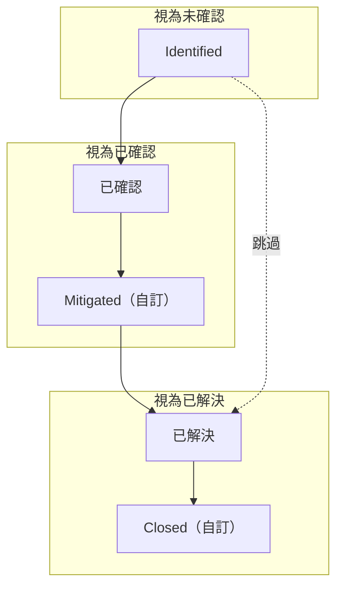
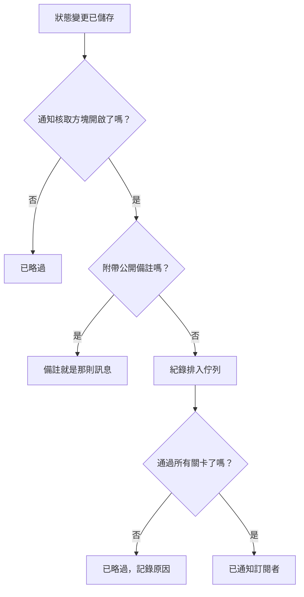

# 事件狀態與嚴重程度

每個事件都帶有兩種分類：**狀態** 表示它在應變中所處的位置，**嚴重性** 表示它有多嚴重。本頁說明每個狀態的作用、如何新增自己的狀態，以及嚴重性如何排序——寫給設定事件的人，或想知道某個事件為什麼呼叫了（或沒有呼叫）、解決了（或沒有解決）、出現在（或沒有出現在）狀態頁面上的人。

:::cards
- [新增自己的狀態](#新增自己的狀態): 為你的應變流程建立模型，並查看每個狀態被視為什麼。
- [確認會做什麼](#確認會做什麼): 呼叫停止，SLA 被標記為已回應。
- [解決會做什麼](#解決會做什麼): 交還監測器，關閉 SLA。
- [通知訂閱者](#把狀態變更告訴狀態頁面訂閱者): 狀態變更在狀態頁面得知之前要通過的關卡。
:::

## 運作方式

在儀表板中，狀態和嚴重性看起來很像——兩者在事件清單上都顯示為彩色徽章，在任何選擇它們的地方都顯示為名稱前的彩色圓點，兩者都是可以改名和換顏色的專案層級清單。但它們的作用截然不同。

狀態驅動行為。狀態列上的三個布林旗標，加上狀態的順序，決定哪些事件算作進行中、事件頁首上出現哪些按鈕、SLA 時鐘何時停止，以及事件何時從狀態頁面上撤下。嚴重性本身什麼都不驅動——它們是描述影響的標籤，其他規則可以依據它們進行比對。

`IncidentState` 模型有 `name`、`description`、`color` 和 `order`，外加三個布林值：`isCreatedState`、`isAcknowledgedState` 和 `isResolvedState`。產品對狀態所做的一切都以這些布林值和 `order` 為依據——從不以狀態的名稱為依據。這就是為什麼你可以把 **已解決** 改名為「Closed」而不會出任何問題：旗標會跟著那一列走。

`IncidentSeverity` 模型只有 `name`、`description`、`color` 和 `order`。沒有旗標。OneUptime 中沒有任何東西會單憑嚴重性就把 **Critical Incident** 與 **Minor Incident** 區別對待——嚴重性只在你讓某樣東西指向它時才起作用，例如待命規則上的 **事件 嚴重性** 比對條件。

幾條簡單規則：

- **用嚴重性傳達影響** —— 它顯示在事件清單和事件 **概覽** 上，並且是宣告事件時的必填欄位。
- **用狀態為流程建立模型** —— 也就是你實際經歷的應變步驟，依你經歷它們的順序排列。
- **不要用狀態表達緊急程度** —— 名為「Critical」的狀態不會呼叫任何人。做這件事的是嚴重性加上一條待命規則。

> [!TIP]
> 這兩份清單都在專案建立時預設，並且都在 **事件 → 設定** 下編輯。事件側邊選單的這個區段預設是摺疊的，所以在尋找它們之前先展開 **設定**。

## 預設狀態

專案建立時會依以下順序建立三個狀態。預設建立是冪等的——只有在同名狀態尚不存在時才會新增。

| 狀態             | `order` | 旗標                  | 顏色      | 意義                                               |
| ---------------- | ------- | --------------------- | --------- | -------------------------------------------------- |
| **Identified**   | `1`     | `isCreatedState`      | `#fd625e` | 新事件進入的狀態。                                 |
| **已確認**       | `2`     | `isAcknowledgedState` | `#ffbf53` | 有人接手了事件。                                   |
| **已解決**       | `3`     | `isResolvedState`     | `#2ab57d` | 事件已經結束，不再算作進行中。                     |

> [!NOTE]
> 第一個狀態的名稱是 **Identified**，雖然產品中的一些描述仍然稱它為「建立」狀態。當文件或提示說「建立狀態」時，指的是帶有 `isCreatedState` 的那個狀態——在新專案中就是 **Identified**。

## 每個狀態旗標實際做什麼

| 旗標                  | 用途                                                                                                                                                                                                 |
| --------------------- | ---------------------------------------------------------------------------------------------------------------------------------------------------------------------------------------------------- |
| `isCreatedState`      | 沒有人選擇狀態時事件取得的狀態。如果專案中沒有狀態帶有這個旗標，建立事件會失敗，並出現錯誤，要求你從設定中新增一個建立狀態。                                                                       |
| `isAcknowledgedState` | 標記專案的確認狀態：**確認** 會把事件移到這裡，確認統計卡片也以它命名。處於該狀態、其後任一狀態或已解決的事件都是已確認的——不再為它提供 **確認**，待命不再為它發出呼叫，它的 SLA 被標記為已回應。 |
| `isResolvedState`     | 標記專案的解決狀態：**解決** 會把事件移到這裡，解決統計卡片顯示的就是它。處於該狀態或其後任一狀態的事件都是已解決的——它會離開 **進行中事件** 和狀態頁面的進行中區段，它的 SLA 被標記為已解決。   |

每個專案中，每個旗標預期只由一個狀態持有——查詢時會取順序中的第一個。三個帶旗標的狀態在設定頁面上帶有 **內建** 標記；把滑鼠游標移到上面（或用 Tab 移到上面），可以讀到 OneUptime 會用這個狀態做什麼。它們可以改名、換顏色和拖曳，但是：

- **它們維持順序。** 建立狀態在確認狀態之前，確認狀態在解決狀態之前。會打破這一點的拖曳——例如把 **已解決** 拖到 **已確認** 之上——會被拒絕，列會回到原位，頁面會說明原因。
- **它們不能被刪除。** 它們的 **刪除** 仍在列的選單中，但處於鎖定狀態，並附上原因。批次刪除會略過它們，並把它們列為未刪除。API 也會拒絕刪除專案最後一個建立、確認或解決狀態。

由於 UI 動態讀取狀態名稱，重新命名一個狀態會改變你在各處看到的內容——統計卡片（使用預設名稱時為 **Acknowledged in** 和 **Resolved in**）、自訂狀態的 **將事件標記為「…」** 確認方塊，以及事件清單上的徽章，都會跟著你給這一列取的名稱。

## 新增自己的狀態

你新增的狀態，是預設的三個狀態沒有命名的應變步驟：「Investigating」、「Mitigated」、「Monitoring」、「Closed」。

:::steps
### 開啟狀態清單

前往 **事件 → 設定 → 事件狀態**。**事件 狀態** 卡片依順序列出你的狀態，每個一列：用來拖曳的把手、顏色和名稱、處於該狀態的事件 **視為** 什麼，以及它的描述。標題下方的一句話說得很清楚：事件只會沿這份清單往下移動。

### 建立狀態

點選卡片標題中的 **建立事件狀態**，填寫表單（欄位見下文）。新狀態會加在 **解決狀態的正上方**——大多數狀態都應該在這個位置，絕不會被放在它下面，因為在那裡它會悄悄地被視為已解決。

### 拖曳到適當位置

用把手拖曳一列來移動它。新的順序會在你放開時儲存；沒有需要輸入的順序編號。用鍵盤時，把焦點移到把手上，按空白鍵，用方向鍵移動，再按一次空白鍵。**視為** 欄會在你放開列時更新。
:::

**編輯** 會開啟與建立相同的表單。狀態的 ID 位於列選單的 **顯示 ID** 下。

| 欄位            | 必填   | 作用                                                                                                                                                                                                                                                               |
| --------------- | ------ | ------------------------------------------------------------------------------------------------------------------------------------------------------------------------------------------------------------------------------------------------------------------ |
| **名稱**        | 是     | 至少兩個字元。預留位置的範例類似「Investigating」。                                                                                                                                                                                                               |
| **描述**        | 否     | 自由文字，說明事件在什麼時候處於這個狀態。                                                                                                                                                                                                                         |
| **顏色**        | 是     | 表單開啟時就已選好：清單中還沒有任何狀態使用的顏色，所以新狀態絕不會和它上面的狀態一樣是紅色。可以從一排具名顏色（紅色、橙色、萊姆綠、綠色、藍綠色、藍色、靛藍色、紫色、洋紅色、粉紅色）中另選一個，或用 **自訂顏色** 設定一個精確的品牌色，例如 `#fd625e`。 |

顏色會為狀態的徽章以及每個狀態選擇器中名稱前的圓點上色：宣告表單和範本表單、**變更狀態** 批次操作、頁首的狀態選單，以及規則和篩選條件。這些選擇器都會依本頁給出的順序列出狀態。

你不能在這個表單中設定三個旗標——它們屬於預設的列。因此你新增的狀態是一個不帶旗標的狀態，這帶來三個值得事先考慮的後果：

- **它所處的位置決定它被視為什麼。** **視為** 欄會顯示這一點，並隨你的拖曳而改變：在確認狀態之上，處於該狀態的事件為 **未確認**；從確認狀態往下，它被視為 **已確認**，因此待命策略會停止對它升級；從解決狀態往下，它被視為 **已解決**，因此狀態頁面不再把它顯示為進行中。
- **位於解決狀態之上時，它讓事件維持進行中。** **進行中事件** 包含目前狀態位於解決狀態之上的事件，所以新增在那裡的狀態會讓事件留在進行中清單和側邊欄計數中。拖到解決狀態之下的狀態在各處都被視為已解決——進行中清單、狀態頁面、提醒和 SLA——而把事件從 **已解決** 移入其中並不算第二次解決。
- **你從頁首的選單把事件移入其中。** 頁首的按鈕只有 **確認** 和 **解決**；自訂狀態位於它們旁邊 **⋯** 選單中的 **Change state to** 下，那裡列出目前狀態之後的每一個狀態。它的確認方塊標題為 **將事件標記為「`<state name>`」**，送出按鈕為 **標記為「`<state name>`」**。

> [!TIP]
> 一種常見的做法是在確認狀態和解決狀態之間放一個緩解步驟——建立「Mitigated」，它會落在 **已確認** 之後、**已解決** 的正上方，被視為已確認。若要在任何人確認事件之前加一個分級步驟，就把它拖到 **已確認** 之上。

## 順序是真正的限制，而不是顯示偏好

順序在寫入狀態變更時就會強制執行，而不只是在繪製清單時：

- **倒退的轉換會被拒絕。** 把事件移到順序中位於目前狀態之前的狀態，會失敗並出現指明兩個狀態的錯誤。
- **重新選擇目前狀態會被拒絕。** 把事件設定為它已經所處的狀態，會以「Incident state cannot be same as previous state.」失敗。
- **補登的列不能與相鄰列重複。** 插入一筆與其後一列狀態相同的時間軸列，同樣會被拒絕。
- **頁首按鈕跟隨帶旗標狀態在順序中的位置。** **確認** 和 **解決** 是否提供，取決於目前狀態在依順序排列的清單中所處的位置。放在解決狀態 *之後* 的自訂狀態永遠不會顯示 **解決** 按鈕，因為處於該狀態的事件已經被視為已解決。

所以，新增狀態時，要把它放在事件真正會經過的位置。順序放錯不只是看起來奇怪——它會讓轉換變得不可能。把一個狀態往後移，會在你放開的那一刻改變已經處於該狀態的事件被視為什麼。

透過 API 和 Terraform，順序就是 `order` 欄：數字小的在前。建立時沒有指定數字的狀態會放在解決狀態的正上方；建立或更新時指定了數字的狀態會佔據那個位置，擋在中間的狀態依序往後移一位。沒有被其他狀態使用的數字會依寫入的樣子保留，因此由 Terraform 管理的狀態讀回時就是它被賦予的那個數字。

## 預設嚴重性

專案建立時會依以下順序建立三個嚴重性，最嚴重的在前：

| 嚴重性                | `order` | 顏色      | 預設描述                                                                                                                                                                                  |
| --------------------- | ------- | --------- | ----------------------------------------------------------------------------------------------------------------------------------------------------------------------------------------- |
| **Critical Incident** | `1`     | `#b70400` | Issues causing very high impact to customers. Immediate response is required. Examples include a full outage, or a data breach.                                                          |
| **Major Incident**    | `2`     | `#fd625e` | Issues causing significant impact. Immediate response is usually required. We might have some workarounds that mitigate the impact on customers. Examples include an important sub-system failing. |
| **Minor Incident**    | `3`     | `#ffbf53` | Issues with low impact, which can usually be handled within working hours. Most customers are unlikely to notice any problems. Examples include a slight drop in application performance. |

宣告事件時嚴重性是必填的，監測器條件中的每個事件規格也都必須填寫它，所以每個事件——無論手動還是自動——都帶著嚴重性而來。宣告流程請參閱 [宣告事件](/docs/incidents/declaring-incidents)，由監測器驅動的路徑請參閱 [事件與警示範本](/docs/monitor/incident-alert-templating)。

## 編輯嚴重性

前往 **事件 → 設定 → 事件嚴重性**。與狀態頁面的形式相同——每個嚴重性一列，最嚴重的在前，拖曳一列來改變它的等級；**建立事件嚴重性** 會在最後（最不嚴重的位置）新增一個，表單中有 **名稱**、**描述** 和 **顏色**，顏色和狀態表單一樣已經選好。

在 OneUptime 比較嚴重性的任何地方，等級都很重要：片段採用其中最嚴重事件的嚴重性，監測器建議中的 Critical 和 Warning 會對應到你的第一個和第二個嚴重性。

與狀態的兩點不同：

- **沒有刪除保護。** 任何嚴重性都可以刪除，包括三個預設的嚴重性。
- **沒有可繼承的旗標，也沒有「視為」。** 新的嚴重性與預設的完全一樣——它是一個帶有顏色和等級的標籤。

嚴重性不只是用來描述的地方：在 **事件 → 規則 → 待命規則** 中，規則的 **事件 嚴重性** 欄位是一個比對條件。在那裡列出 **Critical Incident**，就是表達「任何嚴重事件都呼叫資料庫團隊」的方式——待命策略存在於規則上，而不是嚴重性上。

**變更事件的嚴重性**——在事件 **事件詳細資訊** 卡片的 **編輯** 中、透過 API 或 Terraform（`incidentSeverityId`）、透過工作流程或透過 AI 工具——無論以哪種方式傳送，都會做同樣的四件事：事件動態會新增一則寫明新嚴重性的 **Incident updated** 項目，事件的 SLA 截止時間會重新計算，它的提醒規則會重新比對，事件指標會計入一次嚴重性變更。儲存事件已有的嚴重性則不會做其中任何一件事，所以只編輯事件的標題，其 SLA 截止時間、提醒和嚴重性變更計數都維持不變。警示的嚴重性在其動態項目和提醒方面也是同樣的運作方式。

## 推動事件經過各個狀態

事件變更狀態有四種方式：

| 方式                | 位置                                                                                        | 詢問內容                                                                                                                                                                                                     |
| ------------------- | ------------------------------------------------------------------------------------------- | ------------------------------------------------------------------------------------------------------------------------------------------------------------------------------------------------------------ |
| **頁首按鈕**        | 事件的頁首：**確認** 和 **解決**，以及其 **⋯** 選單中的 **Change state to**                 | 一個簡短的確認方塊——**確認事件** 或 **解決事件**——帶有 **通知狀態頁面訂閱者**，以及摺疊在 **新增公開備註** 下的選填 **公開備註** 和它的 **選擇備註範本** 選擇器（當專案有備註範本時）。 |
| **狀態時間軸**      | 事件側邊選單中的 **狀態時間軸**                                                             | 手動新增的一列，帶有 **事件狀態**、**開始** 和 **通知狀態頁面訂閱者**。                                                                                                                                     |
| **批次變更**        | 在事件清單中對選取項目使用 **變更狀態**                                                     | 一個頁面，包含狀態、**通知狀態頁面訂閱者** 以及同樣摺疊起來的 **新增公開備註**。                                                                                                                            |
| **自動**            | 監測器條件，或你自己的程式碼                                                                | 啟用了 **自動解決事件** 的條件會在條件不再滿足時解決其事件。API 透過在 `/api/incident-state-timeline` 建立一列來變更狀態。                                                                                 |

如果目前狀態在確認狀態之前，頁首會提供 **確認** 和 **解決**；如果在兩者之間，只提供 **解決**。確認還會停止該事件的所有待命升級。

所有這些方式都會寫入一筆時間軸紀錄。狀態變更還會做幾件你不必要求的事：它會在事件動態中發布一則項目，在事件還沒有事件指揮官時指派一位，並更新 SLA 時鐘。重新開啟已解決的事件，會從重新開啟的時間開始一筆新的 SLA 紀錄。

## 確認會做什麼

從事件進入你的確認狀態、其後的任一狀態——你放在 **已確認** 之下的 **Mitigated** 或 **Investigating** 狀態——或解決狀態的那一刻起，事件就是已確認的，無論是透過上述四種方式中的哪一種移動的。狀態設定頁面上的 **視為** 欄會顯示是哪些狀態。一旦被確認：

- **不再提供確認。** 事件頁首中沒有，行動應用程式中沒有（按鈕和滑動操作都沒有），Slack 或 Microsoft Teams 中沒有，OneUptime MCP 伺服器的 `acknowledge_incident` 也沒有。如果仍然嘗試確認——從待命頁面、Slack 或 Teams——會以「Incident is already acknowledged.」（或「Incident is already resolved.」）被拒絕，而不是把它沿清單往回移。
- **待命停止為它發出呼叫。** 在同事已經確認或推進事件之後才確認自己呼叫的應變人員，其呼叫會被確認，事件維持原位。
- **SLA 被標記為已回應**，時間為第一次這樣的移動；繼續經過後續狀態會保留這個時間。
- **確認用時計到那第一次移動為止** —— 事件 **概覽** 上的統計卡片、**Time to Acknowledge** 指標、在 **事件被確認時** 結束的測量，以及 Slack 和 Microsoft Teams 摘要中的 MTTA。從 **Identified** 直接移到 **Investigating** 的事件在那時就被確認了；直接解決的事件在解決時被確認。
- **已確認篩選器**——例如儀表板事件清單小工具上的——會顯示處於你的確認狀態及其後任一狀態、但尚未解決的事件。

警示和片段使用你的警示狀態，遵循同樣的規則。

## 解決會做什麼

當事件從你的解決狀態之上的狀態移入解決狀態，或其後的任一狀態時，事件就被解決了——無論是透過上述四種方式中的哪一種移動的。每次解決都會：

- **交還事件佔用的監測器。** 以未解決狀態宣告的事件會佔用它的監測器：如果它指定了 **將監測器狀態變更為** 的狀態，就會把監測器置於該狀態；如果是手動宣告的，還會暫停它們的監測。在它未解決期間的編輯——新增監測器或變更該狀態——也會讓它佔用這些監測器。解決會恢復它們的監測並讓它們恢復正常運作，除非另一個未解決的事件仍在佔用它們，從此該事件不再佔用任何東西。因此，宣告時即已解決的事件不會交還任何東西，重新開啟之後的第二次解決也不會：其間監測器取得的狀態——來自探針、維護或手動設定——會保留下來。
- **將 SLA 標記為已解決**，並且在開啟 OneUptime AI 事後分析草稿時，起草一份事後分析。

從 **已解決** 繼續移到其後的狀態——例如 **Closed**——不算第二次解決：上述內容都不會再次執行，也不會開始新的 SLA。在 OneUptime 開始記錄這一點之前宣告的事件，會像以前一樣在下一次解決時交還它的監測器。

## 狀態時間軸

事件側邊選單中的 **狀態時間軸** 頁面，是事件經歷過的每個狀態的稽核紀錄。該頁面上的卡片標題為 **狀態時間軸**，依最新的優先排序。

| 欄                                 | 顯示內容                                                                                                                                                                                                                                                       |
| ---------------------------------- | -------------------------------------------------------------------------------------------------------------------------------------------------------------------------------------------------------------------------------------------------------------- |
| **事件狀態**                       | 一個帶有狀態名稱和顏色的彩色徽章。                                                                                                                                                                                                                             |
| **開始**                           | 事件進入這個狀態的時間。                                                                                                                                                                                                                                       |
| **結束**                           | 離開的時間。目前狀態顯示 `Currently Active`。                                                                                                                                                                                                                  |
| **持續時間**                       | 在這個狀態中停留的時間，目前狀態計算到現在。                                                                                                                                                                                                                   |
| **訂閱者通知狀態**                 | 這次變更的狀態頁面通知是已傳送、已略過還是仍待處理，帶有 **更多詳細資料** 連結，並且——傳送失敗時——提供 **重試** 操作。**重試** 會把狀態變更重新傳送到事件目前觸及的每個狀態頁面，包括已經收到的訂閱者。                                                     |

每一列有兩個操作：

- **檢視原因** —— 開啟一個 **根本原因** 對話方塊，呈現隨該狀態變更記錄的 Markdown。
- **檢視日誌** —— 開啟一個說明狀態為何變更的對話方塊，其中有 **事件狀態日誌** 檢視器。

在儀表板中，時間軸列可以新增和刪除，但不能編輯；事件一律至少保留一列。透過 API，可以修正列的 `startsAt`，從時間軸計算出的每項測量都會隨之更新。

> [!WARNING]
> 刪除錯誤的列會改寫事件的歷史，所以要把它當作修正工具，而不是清理習慣。

## 進行中事件清單

**事件 → 進行中事件** 是你值勤期間盯著的清單。它的定義只有一個條件：事件的目前狀態位於你的解決狀態之上——也就是順序中第一個帶有 `isResolvedState` 旗標的狀態。其他一概不考慮——不考慮嚴重性，不考慮存在多久，也不考慮是否有人確認過。

側邊選單項目帶有一個使用同一查詢的紅色計數徽章，所以徽章和清單一律一致。沒有可顯示的內容時，頁面會這樣說明。

實際的後果是：你在解決狀態之上新增的自訂狀態會讓事件留在這份清單中——「Mitigated」不等於「完成」——而放在它之後的狀態會像解決狀態一樣把事件移出清單。警示和片段以各自的狀態遵循同樣的規則，側邊選單計數、提醒、狀態頁面和行動應用程式都會讀取它。

## 把狀態變更告訴狀態頁面訂閱者

狀態變更可以通知你的狀態頁面訂閱者，但要經過幾道關卡。了解它們可以省去大量「為什麼沒有人收到通知」的排查。

通知依每筆時間軸紀錄透過 **通知狀態頁面訂閱者**（`shouldStatusPageSubscribersBeNotified`）請求，也就是狀態變更對話方塊和手動時間軸表單上的核取方塊。在狀態變更對話方塊中，如果事件宣告時沒有通知訂閱者，它會以關閉狀態開始。同一個核取方塊還決定對話方塊中的公開備註是否會通知任何人。它關閉時，紀錄會以「已略過」狀態和一段說明儲存。它開啟時，紀錄排入佇列，由背景工作處理——該工作每分鐘執行一次，所以送達很快但不是即時的。

**排入佇列的紀錄在以下任一情況成立時會被略過：**

- **新狀態是建立狀態。** 宣告事件時已經通知過訂閱者，所以第一筆時間軸紀錄刻意不傳送第二則訊息。
- **事件沒有附加任何監測器。** 沒有資源，就沒有可以把事件對應過去的狀態頁面。
- **事件在狀態頁面上不可見**（`isVisibleOnStatusPage` 已關閉）。
- **狀態頁面關閉了事件顯示**（`showIncidentsOnStatusPage` 已關閉）。這是依狀態頁面判斷的——顯示同一監測器的其他頁面仍會收到通知。
- **狀態頁面不在事件的範圍內。** 透過 **僅限這些狀態頁面** 限定到部分狀態頁面的事件，只會通知列出其監測器的頁面中的那些頁面，而開啟了 **僅顯示限定到此頁面的事件** 的頁面，永遠不會收到未限定到它的事件的通知。這同樣是依狀態頁面判斷的。請參閱 [每個受眾一個狀態頁](/docs/status-pages/one-status-page-per-audience)。

**還有一件會改變結果的事。** 如果你在 **通知狀態頁面訂閱者** 開啟時，在狀態變更對話方塊（**新增公開備註** 下）或 **變更狀態** 批次操作中寫了 **公開備註**，時間軸紀錄會被標記為已通知而不是排入佇列，其狀態訊息會說明是由備註傳達的。真正送到訂閱者手中的是備註本身，所以他們只會收到一則訊息而不是兩則。只含空白的備註不會被發布，紀錄會照常排入佇列。排定維護的狀態變更也是同樣的運作方式。一般狀態變更訊息背後的事件類型是 `Subscriber Incident State Changed`。

**備註會說明事件現在的狀態。** 因為備註是唯一的那則訊息，它會在每個管道上寫明新狀態，就像狀態變更訊息原本會做的那樣：電子郵件主旨為 `[Resolved Incident] <title>`，詳細內容中顯示一個帶有狀態顏色的 **Status** 列；簡訊寫著 `Incident <title> on <status page> is Resolved.`；Slack 和 Microsoft Teams 訊息帶有一行 `**Status:** Resolved`；webhook 的 `IncidentNoteCreated` 酬載在 `data` 中帶有 `incidentState`。單獨發布的備註維持它一般的訊息，編輯產生的更新通知也是如此。

**發布備註需要另外的權限。** 變更狀態和發布公開備註是不同的權限（自訂角色中的 **Create Incident State Timeline** 和 **Create Incident Status Page Note**；內建的事件和專案角色兩者都有）。變更狀態不需要編輯事件的權限：請參閱 [變更狀態](/docs/permissions/index#變更狀態)。可以變更事件狀態但不能發布公開備註的人，在對話方塊和 **變更狀態** 批次操作中都不會看到 **新增公開備註**。他們透過 API 傳送的帶備註狀態變更會整個被拒絕，並附上說明狀態未被變更及其原因的訊息，因此絕不會把一次變更記錄為由一則從未發布的備註所通知。拿掉備註，變更就能通過。警示、警示片段和事件片段則在狀態變更時提供私人備註（**新增私人備註**），其運作方式相同：發布它需要備註本身的權限（自訂角色中的 **Create Alert Internal Note**、**Create Alert Episode Internal Note** 或 **Create Incident Episode Internal Note**；內建的警示、事件和專案角色都有），沒有該權限的人傳送的帶私人備註狀態變更會整個被拒絕，狀態不會改變。

**已傳送代表每個訂閱者都已收到傳送。** 工作會等待每一則訊息，依狀態頁面和管道統計傳送成功或失敗，紀錄的狀態訊息會列出這些計數。只要有一則訊息失敗，或一次傳送逾時或被中斷，紀錄就會變為 **失敗**。請參閱 [訂閱者與公告](/docs/status-pages/subscribers)。

誰會收到這些訊息以及範本如何選擇，請參閱 [訂閱者與公告](/docs/status-pages/subscribers)。

## 讓事件不出現在狀態頁面上

事件是否出現在公開頁面上，由四件獨立的事情決定，四者必須同時為真：

- 狀態頁面本身的 **顯示事件**（`showIncidentsOnStatusPage`）。
- 事件上的 **於狀態頁面可見**（`isVisibleOnStatusPage`）——事件 **設定** 頁面上的一個開關。它預設為 true，不在宣告精靈中；監測器條件可以透過 **在狀態頁面上顯示事件** 設定它。隱藏宣告的事件在建立時不會通知任何訂閱者；之後你開啟這個開關時，編輯表單會提供 **通知訂閱者此事件已建立**。請參閱 [宣告事件](/docs/incidents/declaring-incidents)。
- **頁面在事件的觸及範圍內。** 頁面列出了事件的某個監測器，而且如果事件被限定到部分狀態頁面，該頁面是其中之一。開啟了 **僅顯示限定到此頁面的事件** 的頁面只顯示限定到它的事件。請參閱 [每個受眾一個狀態頁](/docs/status-pages/one-status-page-per-audience)。
- **目前狀態位於解決狀態之上。** 正是這一點把事件從進行中區段移除：狀態頁面查詢會取目前狀態位於你的解決狀態之上的事件，因此解決狀態及其後的任何狀態都會把事件撤下。你不需要封存或關閉任何東西——解決它，它就進入歷史。

**私人事件永遠不會出現。** 開啟 **私人事件** 會讓事件在所有狀態頁面上隱藏，無論上述開關如何，而且只有它的擁有者以及專案管理員和擁有者能存取它。它的任何資訊都不會送到狀態頁面訂閱者手中：無論是它的建立、狀態變更、公開備註還是事後分析。它是私人的期間，其描述、事後分析、自訂欄位和公開備註中的圖片不會對所有人可見。

兩個開關保持同步，因此事件的 **設定** 頁面一律如實呈現狀態頁面的行為：

- 把事件設為私人，會同時關閉 **於狀態頁面可見**。
- 在事件仍為私人時開啟 **於狀態頁面可見**，它會維持關閉。要發布一個私人事件，請關閉 **私人事件** 並開啟 **於狀態頁面可見**——一次儲存完成，或先後進行皆可。

無論事件以何種方式寫入，這都成立：儀表板、API、Terraform、工作流程、監測器、事件範本或隱私規則。以文字形式傳送的值，例如 `"true"`，與 `true` 同樣對待。對多個事件開啟 **於狀態頁面可見** 的一次寫入——例如工作流程的 **Update Many**——會顯示非私人的事件，而讓所有私人事件維持隱藏。每個事件都依寫入到達它時的狀態來判斷，所以同一時刻到達的隱私變更絕不會被覆蓋：事件永遠不會被儲存為既私人又可見。以私人方式建立的事件在建立時即為隱藏，也不會通知任何訂閱者它已建立。

**片段遵循同樣的規則。** 私人的事件片段無論其 **於狀態頁面可見** 開關如何設定，都會在所有狀態頁面上隱藏，它的訂閱者也不會聽到任何關於它的消息。在片段的 **設定** 頁面上，開關會這樣說明，並在片段為私人期間維持關閉。私人事件永遠不會把它的片段帶到狀態頁面上：片段只能透過非私人的事件出現在頁面上。

:::details 從沒有這些規則的版本升級
在這些規則之前就以私人方式儲存、但 **於狀態頁面可見** 仍開啟的事件和片段，會在升級時關閉該開關。不會傳送任何內容給任何人。這類事件或片段曾經讓所有人可見的圖片，除非狀態頁面顯示的其他內容中仍包含它們，否則會重新變為私人。狀態頁面不顯示的事件、片段和排定維護事件的公開備註中的圖片也是如此，它們以前一直對所有人可見。
:::

頁面保留多少已解決的歷史，是狀態頁面的設定，而不是事件的設定。頁面上的監測器如何決定哪些事件會出現，請參閱 [狀態頁資源與群組](/docs/status-pages/resources-and-groups)。

## 後續步驟

:::cards
- [宣告事件](/docs/incidents/declaring-incidents): 宣告時選擇起始狀態和嚴重性。
- [事件備註、負責人與動態](/docs/incidents/notes-owners-and-feed): 發布隨狀態變更一起傳送的公開備註。
- [事件設定與自動化](/docs/incidents/settings): 測量狀態之間的時間，並在規則中比對嚴重性。
- [訂閱者與公告](/docs/status-pages/subscribers): 誰會收到狀態變更傳送的訊息。
:::
