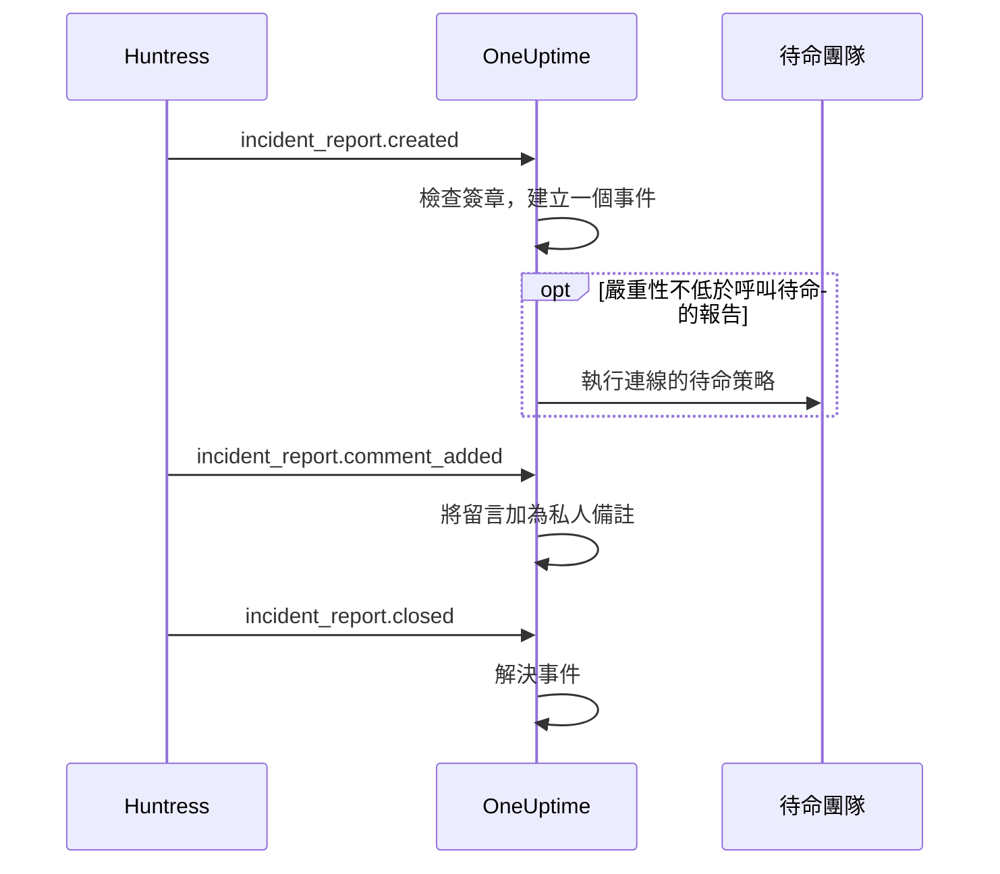

# Huntress 整合

為 Huntress 事件報告呼叫你的待命團隊。當 Huntress SOC 針對某個端點或身分傳送事件報告時，OneUptime 會為它建立一個事件，使用你選擇的嚴重性，呼叫你選擇的待命策略，並在 Huntress 中關閉該報告時解決事件。

此整合是**入站**的：Huntress 會把事件報告的每個事件傳送到 OneUptime 提供的 Webhook URL，並以端點的簽署密鑰簽署。OneUptime 從不呼叫 Huntress，因此不需要 Huntress API 金鑰。

:::cards
- [運作方式](#運作方式)：OneUptime 如何處理報告的每個事件。
- [設定步驟](#設定整合)：在 OneUptime 中連線，在 Huntress 中新增端點，儲存其簽署密鑰，傳送測試。
- [設定](#設定)：呼叫、嚴重性、組織、標籤與解決。
- [疑難排解](#疑難排解)：連線的錯誤代表什麼，以及該改什麼。
:::

## 運作方式

Huntress 會在報告送出時、有人留言時以及報告關閉時傳送事件報告的事件。每個事件都包含完整的報告。

1. **檢查。** 請求必須以端點的簽署密鑰簽署，且簽署時間不早於抵達前五分鐘。其他請求都會被拒絕，連線頁面會說明原因。
2. **建立一個事件。** 報告的第一個事件會建立一個以報告命名的事件，例如 `Huntress: Incident on DESKTOP-01 (Acme Corp)`。事件描述包含報告摘要、在 Huntress 中的嚴重性、組織、受影響的主機或身分、Huntress 發現的指標，以及指向 Huntress 中該報告的連結。同一報告之後的事件，以及 Huntress 重新傳送的投遞，都會找到這個事件：一份報告絕不會建立兩個事件。
3. **呼叫。** 事件以連線為該報告的 Huntress 嚴重性指定的事件嚴重性建立。當該嚴重性不低於**呼叫待命的報告**時，會執行連線的**待命策略**。
4. **追蹤報告。** 在 Huntress 中新增的留言會成為事件上的私人備註。當報告被關閉或駁回時，事件會被解決。

以這種方式建立的事件永遠不會顯示在狀態頁上。你的事件規則（待命、負責人、標籤與隱私規則）會像對待其他事件一樣適用於它們。

## 開始之前

- 在 OneUptime 中具有 **Project Owner** 或 **Project Admin** 角色。成員、檢視者與事件角色可以查看連線及其收到的報告，但不能修改。
- 在 Huntress 中具有 **Account Admin** 角色：只有帳戶管理員可以新增 Webhook。
- 一個要呼叫的待命策略。沒有策略時，報告會建立事件但不呼叫任何人，除非有事件待命規則符合它們。
- 自行託管的安裝需要 Huntress 能從網際網路透過 HTTPS 存取的 OneUptime：Huntress 只會將 Webhook 傳送到 `https://` URL。

## 設定整合

:::steps
### 在 OneUptime 中連線 Huntress

開啟**事件 → 整合 → Huntress**（`/dashboard/{projectId}/incidents/integrations/huntress`）。事件側邊選單中的**整合**區段預設是收合的，請先展開它。點選**連線 Huntress**。

選擇要呼叫的**待命策略**。接著**呼叫待命的報告**會詢問哪些報告呼叫它們，預設為**高與嚴重報告**。其他設定都帶著預設值放在**更多欄位**中（請參閱[設定](#設定)）。點選**連線 Huntress**。連線頁面隨即開啟，上面的**連線 Huntress**卡片會帶你完成接下來的三個步驟。

### 在 Huntress 中新增 Webhook 端點

在連線頁面上點選**複製 Webhook URL**。URL 形如 `https://oneuptime.com/api/huntress/webhook/<connection-id>`；自行託管的安裝會以你自己的主機開頭。

在 Huntress 中開啟右上角的選單，選擇 **Integrations**。點選 **Add an Integration**，選擇 **Webhooks**，然後點選 **Add Endpoint**。貼上 URL，開啟 **Incident Reports**，然後儲存。讓 **Escalations**、**Platform Actions** 與 **Account Notices** 保持關閉：OneUptime 會接收這些事件，但不做任何處理。

### 儲存端點的簽署密鑰

在 Huntress 中開啟端點的選單 (⋯)，選擇 **View Signing Secret**。完整複製它：它以 `whsec_` 開頭。在連線頁面上點選**儲存簽署密鑰**，貼上後點選**儲存簽署密鑰**。密鑰會經過加密，且不會再次顯示。

在儲存密鑰之前，OneUptime 會拒絕傳往該 URL 的所有請求。Huntress 稍後會重新傳送被拒絕的事件，所以現在被拒絕的事件之後仍會送達。

### 傳送測試

在 Huntress 中開啟端點的選單 (⋯)，選擇 **Send Test**。幾秒內，連線頁面上的卡片會變為**連線**，狀態為**正在接收報告**。

> [!NOTE]
> 無論測試包含什麼，連線都會顯示它已送達。包含事件報告的測試會像其他報告一樣建立事件，如果夠嚴重，還會呼叫待命人員。
:::

## 設定

**連線 Huntress**只詢問呼叫誰以及針對哪些報告。其他設定都帶著適合大多數團隊的預設值放在**更多欄位**中。之後要修改設定，請在連線的**設定**卡片上點選**編輯設定**。

| 設定 | 作用 | 預設值 |
| --- | --- | --- |
| **待命策略** | 報告夠嚴重時執行的策略。留空則建立事件但不呼叫任何人。 | 無 |
| **呼叫待命的報告** | 哪些報告呼叫這些策略：**僅嚴重報告**、**高與嚴重報告**或**所有報告**。無論如何，每份報告都會建立事件。 | **高與嚴重報告** |
| **名稱** | 連線在 OneUptime 中的名稱。 | `Huntress` |
| **嚴重報告的嚴重性**、**高報告的嚴重性**、**低報告的嚴重性** | 每種 Huntress 嚴重性建立事件時使用的事件嚴重性。 | 你最高的三個事件嚴重性，依順序 |
| **僅限這些組織** | 其報告會建立事件的 Huntress 組織，每行一個組織名稱或 ID。名稱不區分大小寫。 | 空白：所有組織 |
| **標籤** | 除了以報告所屬組織命名的標籤外，加到每個事件的標籤。 | 無 |
| **Huntress 關閉報告時解決** | 當報告在 Huntress 中被關閉或駁回時解決事件。關閉此項時，改為在事件上加上一則私人備註說明。 | 開啟 |

### 嚴重性

Huntress 會給每份事件報告三種嚴重性之一。除非你為某種嚴重性選擇了事件嚴重性，否則報告會依照**事件 → 設定 → 事件嚴重性**中列出的事件嚴重性順序建立事件：

| Huntress 嚴重性 | Huntress 的意思 | 事件嚴重性 |
| --- | --- | --- |
| Critical | 攻擊者正在直接操作、危險的惡意軟體或進行中的入侵，需要立即遏止。 | 最高的 |
| High | 需要緊急處置的已確認惡意軟體，或需要採取行動的身分遭盜用。 | 第二 |
| Low | 可能不需要的程式、惡意軟體殘留以及較早的身分相關發現。 | 第三 |

嚴重性較少的專案會對其餘的使用最低的嚴重性。沒有嚴重性的報告視為高。如果你選擇的嚴重性被刪除，則重新依順序決定。

### 組織

每個事件都會得到一個以報告所屬 Huntress 組織命名的標籤，例如 _Acme Corp_。一個連線會接收你 Huntress 帳戶中所有組織的報告，**僅限這些組織**可以縮小範圍。

> [!TIP]
> 要呼叫每個客戶自己的團隊，請讓連線的**待命策略**留空，並為每個組織新增一條事件待命規則，例如「如果**事件標籤**包含任一 _Acme Corp_」，執行該客戶的策略。請參閱[事件待命規則](/docs/incidents/settings#事件待命規則)。

## 連線頁面上的報告

連線的**事件報告**清單依新到舊顯示 Huntress 傳送的每份報告：受影響的主機或身分、在 Huntress 中的嚴重性與狀態，以及**結果**。

| 結果 | 發生了什麼 |
| --- | --- |
| **已建立事件** | 該報告建立了一個事件。**檢視事件**可開啟它；**已呼叫待命**表示連線呼叫了它的策略。 |
| **事件已解決** | Huntress 關閉了報告，其事件已解決。 |
| **已略過：未關注的組織** | 報告所屬的組織不在**僅限這些組織**中。 |
| **已略過：已在 Huntress 中關閉** | OneUptime 第一次收到該報告時，它已經關閉。 |

被略過的報告在你之後修改設定時仍然保持略過。當**Huntress 關閉報告時解決**關閉時，已關閉的報告會保留**已建立事件**的結果。

## 安全性

- **只接受簽署的請求。** OneUptime 會將 Huntress 傳送的 `svix-id`、`svix-timestamp` 與 `svix-signature` 標頭與原樣送達的請求本文進行驗證。未以已儲存密鑰簽署，或簽署時間前後相差超過五分鐘的請求都會被拒絕。
- **密鑰始終保密。** 它以加密方式儲存，API 從不回傳它，也不會再次顯示。連線頁面上的**取代簽署密鑰**可以儲存另一個密鑰，例如新端點的密鑰。
- **URL 是位址，不是密碼。** 它指向連線；只有以端點密鑰簽署的請求才會被處理。
- **每個連線一個端點。** 每個連線都有自己的 URL 與密鑰。要接收第二個 Huntress 帳戶的報告，請再連線一次。

## 改用電子郵件

Huntress 也會以電子郵件傳送事件報告，[傳入郵件監控](/docs/monitor/incoming-email-monitor)可以根據這些郵件建立事件，例如當主旨包含 `Critical Incident Report` 時。但它把郵件當作一個監控的狀態：在它的事件處於開啟狀態時，下一份報告不會再建立事件，而且事件是依監控的條件解決，而不是在 Huntress 關閉報告時解決。Huntress 連線為每份報告建立一個事件，並隨報告一起解決每個事件，因此更建議使用它。連線開始接收報告後，請停止把郵件傳送到監控，否則每份報告都會呼叫兩次。

## 疑難排解

當 OneUptime 拒絕請求時，連線頁面會在**上一個請求被拒絕**下顯示原因。在 Huntress 中，端點選單 (⋯) 裡的 **View Delivery Attempts** 會列出每次投遞以及 OneUptime 的回應。

:::details "A request arrived but was refused, because no signing secret is saved for this connection yet"
儲存端點的簽署密鑰：請參閱[設定整合](#設定整合)。Huntress 會重新傳送被拒絕的請求。
:::

:::details "The request's signature does not match the signing secret"
儲存的密鑰不是這個端點的。每個端點都有自己的密鑰：在 Huntress 中開啟端點的選單 (⋯)，選擇 **View Signing Secret**，完整複製後以**取代簽署密鑰**儲存。
:::

:::details "The request was signed more than five minutes from now"
Huntress 與你的 OneUptime 伺服器時鐘相差超過五分鐘，或者該請求是重放的舊請求。如果是自行託管的安裝，請檢查伺服器的時鐘是否準確。
:::

:::details "No Huntress connection has this address."
連線已被刪除，或者 Huntress 中端點的 URL 不是該連線的 URL。在連線頁面上點選**複製 Webhook URL**，然後把 URL 重新貼到 Huntress 的端點中。
:::

:::details "This project has no incident severities, so a Huntress report cannot open an incident"
在**事件 → 設定 → 事件嚴重性**中新增一個嚴重性。Huntress 會重新傳送該報告。
:::

:::details 沒有呼叫任何人
低於**呼叫待命的報告**的報告會建立事件但不呼叫。在**事件報告**清單中，報告結果下方的**已呼叫待命**表示連線進行了呼叫。事件的**待命執行**頁面會顯示每個策略做了什麼。
:::

## 後續步驟

:::cards
- [事件待命規則](/docs/incidents/settings#事件待命規則)：依標籤呼叫每個組織自己的團隊。
- [事件狀態與嚴重程度](/docs/incidents/states-and-severities)：排列 Huntress 報告使用的嚴重性順序。
- [上報規則](/docs/on-call/escalation-rules)：決定呼叫誰，以及何時轉到下一步。
- [整合總覽](/docs/integrations/index)：你可以連線的其他工具。
:::
