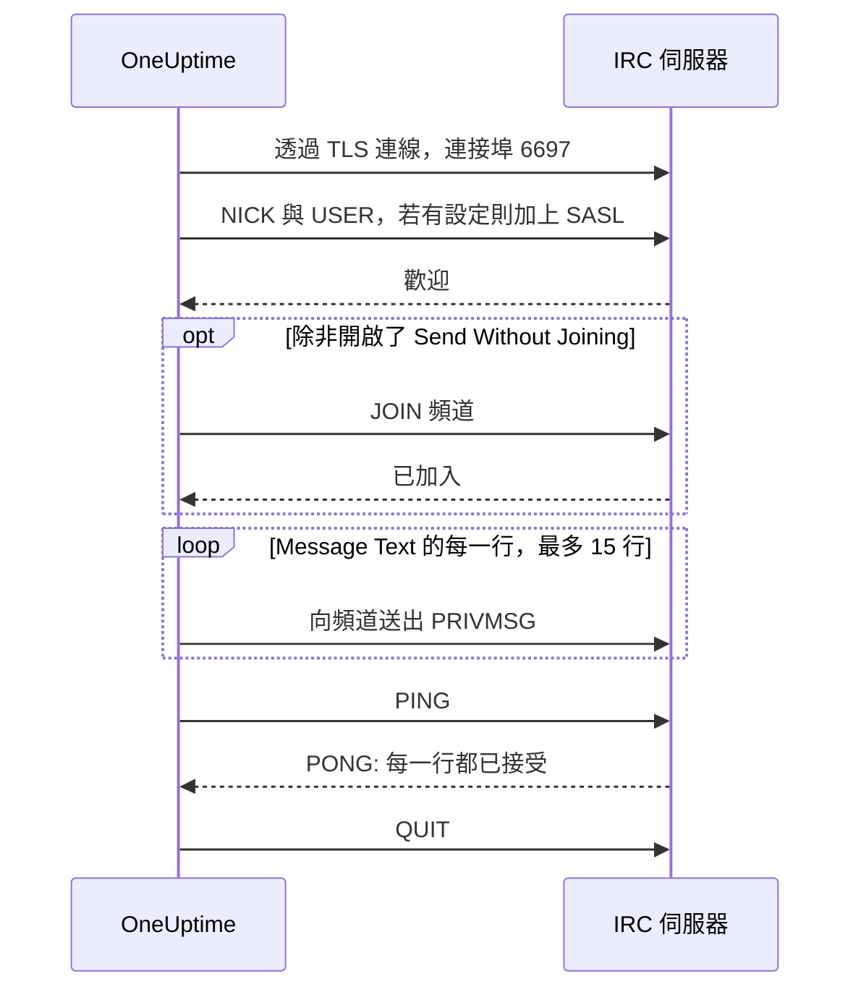

# IRC 整合

把事件更新張貼到任何 IRC 網路的頻道：Libera.Chat、OFTC 或你自己的伺服器。

IRC 沒有 Webhook，所以 OneUptime 的工作流程步驟 **Send Message to IRC** 會像一般的 IRC 用戶端一樣，自己連線到伺服器。不需要安裝任何東西，也不需要註冊應用程式。此整合屬於**出站**：OneUptime 只在頻道裡張貼訊息，不會讀取頻道中的對話。

:::cards
- [運作方式](#運作方式): 步驟的一次執行如何與伺服器對話。
- [設定](#設定整合): 伺服器與頻道、密碼，接著是工作流程：從範本建立或從零開始。
- [提示](#提示): 不加入頻道直接張貼、SASL、長訊息與集中觸發。
- [疑難排解](#疑難排解): 步驟的錯誤代表什麼，以及該修改哪裡。
:::

## 運作方式

步驟每次執行時，都會像 IRC 用戶端那樣與 IRC 伺服器進行一段簡短的對話，然後中斷連線。

1. **連線。** 步驟透過 TLS 連線到連接埠 `6697`，並驗證伺服器的憑證。
2. **註冊。** 除非你設定了別的 **Nickname**，它會以 `OneUptime` 註冊；填了 **SASL Username** 和 **SASL Password** 時，它會用 SASL 登入。
3. **加入。** 除非開啟了 **Send Without Joining**，它會加入頻道；頻道有金鑰時會帶上 **Channel Key**。
4. **送出。** **Message Text** 的每一行都會當作一則獨立的 IRC 訊息送出，也就是一則 `PRIVMSG`。
5. **確認。** IRC 從不告訴你「已送達」，所以步驟會送出一個 `PING`，並等待伺服器的 `PONG`。伺服器會依序回應，所以到那時，任何對訊息的拒絕都已經抵達。
6. **離開。** 它離開伺服器。

伺服器接受每一行之後，步驟會走 **成功** 輸出。當伺服器無法連線，或伺服器拒絕了連線、暱稱、密碼、頻道或訊息時，步驟會走 **錯誤** 輸出，並在伺服器有說明原因時照原話轉述。

## 開始之前

- 在 OneUptime Cloud 上，需要 **Growth** 或更高的方案：工作流程及其變數都包含在內。沒有計費的自架安裝沒有方案限制。
- 能建立工作流程的角色：**Project Owner**、**Project Admin** 或 **Workflow Admin**。
- 如果 IRC 網路要求登入，還需要該網路上的帳號。Libera.Chat 對來自部分雲端與 VPN 位址的連線要求登入。

## 設定整合

:::steps
### 選擇伺服器與頻道

決定訊息要送到哪裡：伺服器的主機名稱，例如 `irc.libera.chat`，以及頻道，例如 `#your-channel`。

- **IRC Server** 只填主機名稱，其他都不要：不要 `ircs://`，也不要連接埠。步驟透過 TLS 連線到連接埠 `6697`。如果你的伺服器在其他連接埠提供 TLS，請在 **更多欄位** 下的 **Port** 設定。
- **Channel** 必須是頻道。在這裡填入暱稱會被拒絕，所以步驟絕不會誤把訊息私訊給某個人。

伺服器必須是 OneUptime 獲准連線的。迴路位址（`localhost`、`127.0.0.1`）、鏈路本機位址與雲端中繼資料位址一律會被拒絕。在 OneUptime Cloud 上，位於私人網路位址的伺服器也會被拒絕。自架安裝可以連到自己網路中的 IRC 伺服器，除非 `DATA_SOURCE_BLOCK_PRIVATE_ADDRESSES` 設為 `true`。

### 把密碼存成機密變數

如果你的伺服器、網路與頻道都不需要密碼，可以跳過這一步。否則，請把每個密碼存成機密的[全域變數](/docs/workflows/variables#全域變數)。這樣工作流程裡存的是變數名稱而不是密碼，改密碼也只要改一個地方。

| 設定                | 何時填寫                                           | 變數範例              |
| ------------------- | -------------------------------------------------- | --------------------- |
| **Server Password** | 連線時伺服器或你的 bouncer 要求密碼。              | `IRC_SERVER_PASSWORD` |
| **SASL Password**   | 網路要求你登入帳號。**SASL Username** 填帳號名稱。 | `IRC_SASL_PASSWORD`   |
| **Channel Key**     | 頻道設有金鑰（模式 `+k`）。                        | `IRC_CHANNEL_KEY`     |

儲存方式：開啟 **工作流程 → 全域變數**，點選 **建立工作流程 變數**。在 **名稱** 填入名稱，點選 **下一步**。把密碼貼到 **內容**，開啟 **密鑰**，再點選 **建立工作流程 變數**。執行記錄中，機密變數的值會顯示為 `[REDACTED]`。

### 建立工作流程

可以從範本開始，它會幫你建好整個工作流程，也可以從零開始。

:::tabs
@tab 從範本建立
1. 開啟 **工作流程**，點選 **建立工作流程**。
2. 在 **搜尋範本…** 輸入 `IRC`，點選 **Tell IRC when an incident opens**，再點選 **使用此範本**。
3. 保留名稱 **Notify IRC on new incident** 或修改它，然後點選 **下一步**。
4. 填入 **IRC Server** 和 **IRC Channel**，點選 **建立工作流程**。

工作流程會在 **建構器** 中開啟，包含三個步驟：**On Create Incident**；**Send Message to IRC**，以兩行張貼事件的編號、標題、嚴重程度與狀態；以及接在其 **錯誤** 輸出上的 **日誌** 步驟，用來記錄訊息為何沒有送達。伺服器與頻道會存成工作流程變數 `ircServer` 和 `ircChannel`。如果你在上一步存了密碼，點選 **Send Message to IRC**，開啟 **更多欄位**，再用各設定的 **{ }** 按鈕選擇對應的變數。
@tab 從零開始
1. 開啟 **工作流程**，點選 **建立工作流程**，選擇 **從零開始**，替工作流程命名，然後點選 **建立工作流程**。
2. 在 **建構器** 中點選 **Choose what starts this workflow**，在 **Popular** 下選擇 **On Create Incident**。點選該觸發器，在 **Select Fields** 中選擇訊息要顯示的事件欄位，例如標題。
3. 點選 **新增元件**，搜尋 `irc`，點選 **Send Message to IRC**。把觸發器的 **成功** 輸出連到這個步驟。
4. 點選新步驟，填寫 **IRC Server**、**Channel** 和 **Message Text**。**Message Text** 中的 **{ }** 按鈕可以插入事件的欄位，例如標題。
5. 如果你在上一步存了密碼，開啟 **更多欄位**。在 **Server Password**、**SASL Password** 或 **Channel Key** 點選 **{ }**，在 **Global variables** 下選擇變數。在 **SASL Username** 填入你的帳號名稱。
:::

### 開啟並測試

開啟 **建構器** 頂端的 **已啟用** 開關。從現在起，每個新事件都會張貼到頻道。

如果想在不建立新事件的情況下測試，點選 **執行工作流程**，在 **事件 ID** 填入一個既有事件的 ID。事件頁面上會顯示它的 ID。點選 **Run Workflow Manually**，再以 **Run** 確認。**工作流程執行** 面板會追蹤這次執行：IRC 步驟的日誌會說明送出了幾行，例如 `Sent 2 lines to #your-channel.`，訊息也會出現在頻道中。如果步驟改走 **錯誤**，它的日誌會說明原因：請參閱[疑難排解](#疑難排解)。
:::

## 提示

- **不加入頻道直接張貼。** 大多數頻道只接受成員的訊息（模式 `+n`），所以步驟會先加入頻道再張貼，張貼完立刻離開。設為 `-n` 的頻道接受外部訊息：在 **更多欄位** 下開啟 **Send Without Joining**，頻道就不會看到步驟進進出出。
- **用 SASL 登入。** 在使用 SASL 的網路上，例如 Libera.Chat，填寫 **SASL Username** 和 **SASL Password** 來登入你的帳號。Libera.Chat 對來自部分雲端與 VPN 位址的連線要求這麼做。請參閱 [Libera.Chat 的 SASL 指南](https://libera.chat/guides/sasl)。
- **注意 15 行的上限。** **Message Text** 的每一行都是一則獨立的 IRC 訊息，過長的行會被拆開以便放得下，空白行會被略過。一則訊息最多以 15 行 IRC 訊息送出：更長的會被截斷，最後一行會說明這一點。前四行會立刻送出，其餘每秒一行，這是 IRC 用戶端的節奏，所以 15 行大約需要 11 秒。
- **把集中觸發合併成一則訊息。** 每次執行都是一條獨立的連線，而 IRC 網路會限制同一個位址連線的頻率。短時間內大量執行可能會被拒絕，原因類似 `Reconnecting too fast`，並像其他拒絕一樣走 **錯誤**。如果工作流程可能每分鐘觸發很多次，就把要說的內容合併成一則訊息，或透過你自己的伺服器送出。
- **用 IRC 自己的代碼設定格式。** IRC 沒有 Markdown，所以文字會照輸入的原樣送出。IRC 的格式代碼，例如粗體和顏色，都可以使用。
- **沒有 TLS 的伺服器。** 只有在伺服器不提供 TLS 時才開啟 **Disable TLS**：此時步驟會連線到連接埠 `6667`，任何密碼都會以明文送出。若要信任由你自己的憑證授權單位簽發的伺服器憑證，自架安裝應改為設定 `NODE_EXTRA_CA_CERTS`。
- **換一個暱稱。** 除非你設定了 **Nickname**，訊息都來自 `OneUptime`。如果暱稱已被占用，步驟會加上底線或數字。

## 疑難排解

步驟走 **錯誤** 時，執行記錄會說明原因，那句話的開頭會是下列其中之一。

:::details "The IRC server refused the connection"
伺服器或你的 bouncer 拒絕了連線，訊息結尾是它給的原因。伺服器需要密碼時，訊息會這麼說：填寫 **Server Password**，或檢查它。
:::

:::details "SASL sign-in failed"
網路拒絕了帳號或密碼。檢查 **SASL Username** 和 **SASL Password**。
:::

:::details "Could not join #your-channel"
頻道拒絕讓步驟加入，原因見訊息內容。設有金鑰的頻道需要在 **Channel Key** 填寫金鑰。
:::

:::details "Could not send to #your-channel"
伺服器拒絕了這則訊息，原因見錯誤訊息。如果開啟了 **Send Without Joining**，頻道可能只接受成員的訊息：請關閉它。
:::

:::details "The TLS certificate of the IRC server … is not trusted"
伺服器的憑證不在 OneUptime 信任的範圍內。自架安裝可以用 `NODE_EXTRA_CA_CERTS` 信任自己的憑證授權單位。只有在伺服器不提供 TLS 時才開啟 **Disable TLS**。
:::

## 後續步驟

:::cards
- [元件 → IRC](/docs/workflows/components#irc): 步驟的每項設定，以及各輸出的意義。
- [變數](/docs/workflows/variables#全域變數): 機密的全域變數，以及步驟如何使用它們。
- [執行記錄](/docs/workflows/runs-and-logs): 查看工作流程每次執行做了什麼。
- [整合概觀](/docs/integrations/index): 出站模式，以及你可以連接的其他工具。
:::
