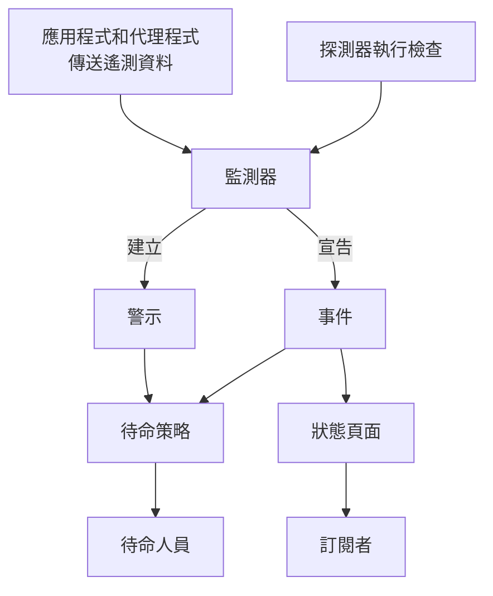

# 核心概念

OneUptime 有很多產品，但它們都建立在幾個概念之上：專案、監測器、事件和警示、待命、狀態頁面以及遙測。本頁用幾句話說明每個概念，展示它們之間的關聯，並連結到詳細介紹它們的頁面。讀過一遍之後，文件中的其他頁面都會更容易理解。

:::cards
- [專案和人員](#專案和人員): 一切存放在哪裡，以及誰能做什麼。
- [監測器和探測器](#監測器和探測器): OneUptime 如何發現問題。
- [事件和警示](#事件和警示): 團隊工作所依據的紀錄。
- [待命](#待命): 呼叫誰、如何呼叫，以及下一個是誰。
:::

## 各部分如何關聯

問題在 OneUptime 中沿著一個方向流動。探測器和你自己的遙測資料提供輸入給監測器。監測器的條件決定何時出了問題，以及要開啟什麼：事件、警示，或兩者皆有。待命策略會就此呼叫相關人員，狀態頁面則把事件告知你的客戶。

## 專案和人員

**專案** 包含一切：監測器、事件、待命策略、狀態頁面、遙測資料和設定。大多數公司只需要一個，也有一些公司為每個環境或事業單位各建一個。你在一個專案中建立的內容，在另一個專案中看不到。

你的 **帳戶** 獨立於專案。一個帳戶使用一個電子郵件和密碼，可以屬於任意數量的專案；使用左上角的專案選擇器在它們之間切換。請參閱 [您的帳戶](/docs/introduction/your-account)。

人員透過 **團隊** 加入專案，團隊的權限決定其成員可以做什麼。每個新專案一開始都有三個團隊：包含你在內的 Owners，以及 Admin 和 Members。在 OneUptime Cloud 上，每個專案都有自己的方案。

:::cards
- [使用者、團隊與權限](/docs/permissions/index): 邀請成員並決定他們可以做什麼。
:::

## 監測器和探測器

**監測器** 檢查你所執行的某一樣東西，並判斷它是否正常運作。大多數監測器由 **探測器** 來檢查：探測器是依排程執行檢查的機器，例如請求頁面、呼叫 API、ping 主機或查詢資料庫。OneUptime Cloud 在多個區域執行探測器，自架安裝執行自己的探測器，你也可以在自己的網路內加入自訂探測器。其他監測器則讀取你傳送的內容：來自應用程式的遙測資料，或者伺服器、Kubernetes 叢集和其他基礎設施上的代理程式所回報的資料。

監測器的 **條件** 決定每個結果代表什麼。條件會依序檢查，第一個相符的條件可以變更監測器的狀態、宣告事件、建立警示，或三者都做。每個新專案都有三種監測器狀態：**運作中**、**效能下降** 和 **離線**。

:::cards
- [建立監測器](/docs/monitor/create-monitor): 選擇類型，說明要檢查什麼以及多久檢查一次。
- [自訂探針](/docs/probe/custom-probe): 檢查只有你自己的網路才能連到的內容。
:::

## 事件和警示

兩者都記錄一個問題，也都可以呼叫待命人員。差別在於問題影響的是誰。

| | 事件 | 警示 |
| --- | --- | --- |
| **是什麼** | 影響使用者的問題，例如服務中斷或變慢 | 需要團隊在使用者受影響之前調查的問題 |
| **在狀態頁面上** | 可以顯示，並通知訂閱者 | 絕不顯示 |
| **初始狀態** | **Identified**、**已確認**、**已解決** | **Identified**、**已確認**、**已解決** |
| **初始嚴重性** | Critical Incident、Major Incident、Minor Incident | **High**、**Low** |

確認表示已經有人在處理，並阻止待命策略呼叫下一個層級。解決則將其關閉。你可以加入自己的狀態和嚴重性，並把警示連結到它們最終證實所屬的事件。

**片段** 將相關的事件或相關的警示歸為一組，讓團隊把它們當作一個整體處理。分組規則決定哪些屬於同一組。

:::cards
- [事件概觀](/docs/incidents/index): 事件如何被宣告、處理和解決。
- [已連結的警示](/docs/incidents/linked-alerts): 把一次故障引發的警示連結到它的事件。
:::

## 待命

**待命策略** 決定針對事件或警示呼叫誰，以及沒人回應時下一個呼叫誰。它的 **上報規則** 就是它的層級：每個層級先呼叫其人員，然後等待有人確認，再呼叫下一個層級。一個層級可以呼叫人員、團隊或 **待命排程**；待命排程是一種輪值，隨時都知道誰在待命。

如何聯絡每個人由他們自己決定。在 **使用者設定** 中，每個人都保存了 OneUptime 可以聯絡他們的方式，例如電子郵件、簡訊、電話、推播通知、Slack 或 Microsoft Teams，以及被呼叫時要使用其中哪些方式。

:::cards
- [上報規則](/docs/on-call/escalation-rules): 逐層呼叫人員，直到有人回應。
- [待命排程](/docs/on-call/schedules): 輪值、圖層和交接。
:::

## 狀態頁面和維護

**狀態頁面** 向客戶展示你的服務是否正常運作。你選擇它顯示哪些監測器，並使用客戶能理解的名稱。當其中某個監測器上有進行中的事件時，頁面會顯示它，其 **訂閱者** 會透過電子郵件、簡訊、Slack、Microsoft Teams 或 Webhook 收到通知。狀態頁面可以是公開的，也可以只對你允許的人開放。

**排定維護** 會事先公告計畫中的工作。一個維護活動會依序經歷 **已排定**、**進行中**、**已結束** 和 **已完成**，顯示它的狀態頁面會告知訪客和訂閱者。

:::cards
- [狀態頁概觀](/docs/status-pages/index): 建立狀態頁面並決定它顯示什麼。
- [訂閱者與公告](/docs/status-pages/subscribers): 通知誰，以及何時通知。
:::

## 遙測

**遙測** 是你的系統傳送給 OneUptime 的內容：日誌、指標、追蹤、例外狀況和效能剖析。應用程式透過 OpenTelemetry 傳送，OneUptime 的代理程式則從主機、Kubernetes 叢集、Docker 主機和其他基礎設施傳送。每個傳送端都使用一把 **擷取金鑰**，它在 **專案設定 → 遙測與 APM → 擷取金鑰** 下建立。你可以搜尋遙測資料、在儀表板上繪製圖表，並用遙測監測器監看它；遙測監測器會像其他監測器一樣產生事件和警示。

:::cards
- [OpenTelemetry](/docs/telemetry/open-telemetry): 從你的應用程式傳送日誌、指標和追蹤。
- [日誌監控](/docs/monitor/logs-monitor): 當日誌中出現某種模式時收到通知。
:::

## 自動化與 AI

- **工作流程** 在發生某些事情時執行動作，例如在宣告事件時發文到 Slack。
- **運行手冊** 把回應流程變成團隊可以手動或自動執行的步驟。
- **OneUptime AI** 調查新的事件和警示，並把發現發布到它們的時間軸上；**Ask AI** 回答關於你專案的問題。新專案預設開啟 AI；**專案設定 → 人工智慧 → AI Features** 下的 **啟用 AI** 開關可以把它全部關閉。

:::cards
- [工作流程概觀](/docs/workflows/index): 透過觸發器和元件自動執行動作。
- [AI SRE](/docs/ai/ai-sre): OneUptime AI 如何調查事件和警示。
:::

## 標籤和擁有者

**標籤** 是你加在監測器、事件、狀態頁面和大多數其他資源上的標記，用於篩選和分組。團隊的權限可以限定在帶有某些標籤的資源上。**擁有者** 是對某個資源負責的人員和團隊：當該資源發生狀況時，他們會收到通知。標籤規則和擁有者規則會自動為新資源加上標籤和擁有者。

:::cards
- [標籤與擁有者規則](/docs/configuration/label-and-owner-rules): 自動為新資源加上標籤並指派擁有者。
:::

## 後續步驟

:::cards
- [快速開始](/docs/introduction/quickstart): 在十五分鐘內把這些概念付諸實踐。
- [首頁與快捷鍵](/docs/introduction/home): 在儀表板中找到每個產品。
- [建立監測器](/docs/monitor/create-monitor): 你的第一個監測器，逐一欄位說明。
- [事件概觀](/docs/incidents/index): 監測器宣告事件之後會發生什麼。
:::
