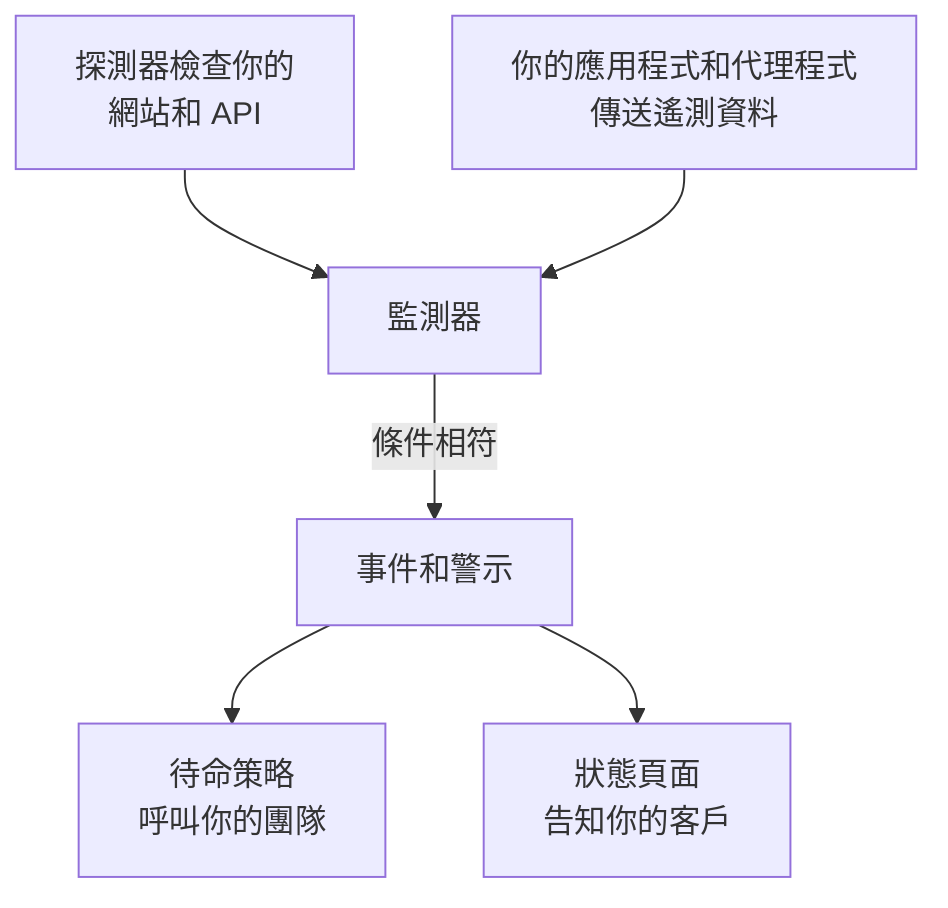

# 入門指南

OneUptime 是一個開源的可觀測性平台。它檢查你的網站、API 和伺服器是否正常運作，收集你的應用程式傳送的日誌、指標和追蹤，在發生故障時呼叫待命人員，並透過狀態頁面告知你的客戶。這一切都在同一個產品中完成，因此發現問題的工具，也正是呼叫你團隊的工具。你可以使用 OneUptime Cloud，也可以在自己的伺服器上執行它。

從這裡開始：

:::cards
- [快速開始](/docs/introduction/quickstart): 監控一個網站，在它故障時收到呼叫，並發布一個狀態頁面。
- [核心概念](/docs/introduction/core-concepts): 其他一切所依據的幾個概念，以及它們之間的關聯。
- [首頁與快捷鍵](/docs/introduction/home): 在儀表板中找到方向，以及幫你少點幾下的按鍵。
- [您的帳戶](/docs/introduction/your-account): 你的個人資料、密碼、通行密鑰和雙重驗證。
:::

## OneUptime 如何協同運作

一切都從你要關注的對象開始。監測器會依排程檢查它，或讀取它傳送的遙測資料。當監測器的條件相符時，OneUptime 會宣告事件或建立警示、呼叫待命人員，並在你需要時把事件顯示在狀態頁面上。

- **事件** 是影響使用者的問題。它可以呼叫待命人員，並顯示在你的狀態頁面上。
- **警示** 是需要團隊在使用者察覺之前調查的問題。它同樣可以呼叫待命人員，但絕不會顯示在狀態頁面上。

[核心概念](/docs/introduction/core-concepts) 會用幾句話說明每個部分。

## 瀏覽文件

文件的組織方式與側邊欄相同，共分九個部分。選擇你需要的部分。

### 監控

:::cards
- [監測器](/docs/monitor/create-monitor): 從全球各地的探測器檢查網站、API、連接埠、DNS、NTP 伺服器、憑證等。
- [基礎設施監測器](/docs/monitor/server-monitor): 監看伺服器、Kubernetes、Docker、VMware、網路設備和儲存設備。
- [遙測監測器](/docs/monitor/logs-monitor): 根據你傳送的日誌、指標、追蹤、例外狀況和效能剖析發出警示。
- [SLO](/docs/slo/introduction): 追蹤可靠性目標、錯誤預算和消耗速率。
- [探測器](/docs/probe/custom-probe): 從你自己的網路內部執行檢查。
- [當 OneUptime 未收到資料時](/docs/monitor/when-oneuptime-is-not-receiving): 為什麼 OneUptime 這一端的資料缺口，絕不會算成你的停機時間。
:::

### 事件回應

:::cards
- [事件](/docs/incidents/index): 宣告、協調和解決事件，並保留完整的時間軸。
- [待命](/docs/on-call/schedules): 輪值、上報規則，以及何時呼叫誰。
- [狀態頁面](/docs/status-pages/index): 透過公開或私人的狀態頁面讓客戶掌握狀況。
- [工作區連線](/docs/workspace-connections/slack): 在 Slack 和 Microsoft Teams 中處理事件。
:::

### 可觀測性

:::cards
- [遙測](/docs/telemetry/open-telemetry): 使用 OpenTelemetry 傳送日誌、指標和追蹤，並加以搜尋。
- [基礎設施代理程式](/docs/telemetry/kubernetes-agent): 為 Kubernetes、主機、Docker、Proxmox、VMware 等安裝代理程式。
- [雲端](/docs/telemetry/cloud-environments): 觀測 ECS、Cloud Run、Azure Container Apps 和其他代管平台。
- [AI 可觀測性](/docs/telemetry/ai-llm-observability): 追蹤你的 AI 的對話，並在它回答得不好時收到通知。
- [安全性](/docs/telemetry/security-events): 收集安全性事件和威脅情報。
- [真實使用者監控](/docs/rum/index): 透過 Core Web Vitals 和工作階段重播，衡量真實使用者的體驗。
- [儀表板](/docs/dashboards/index): 用你的指標、日誌和監測器建立儀表板。
- [資產清單](/docs/inventory/overview): 查看 OneUptime 所知道的每個服務、主機和裝置。
:::

### 自動化與 AI

:::cards
- [運行手冊](/docs/runbooks/index): 把回應流程變成團隊可以執行的步驟。
- [表單](/docs/forms/index): 讓任何人透過表單回報問題，表單會開啟一個事件。
- [工作流程](/docs/workflows/index): 在 OneUptime 中發生某些事情時自動執行動作。
- [AI](/docs/ai/ai-sre): 讓 OneUptime AI 調查事件和警示，並向它詢問你的系統。
:::

### 整合

:::cards
- [整合](/docs/integrations/index): 連接 Jira、ServiceNow、Grafana、Datadog、Huntress、SIEM 工具、Discord、Telegram、IRC 等。
:::

### 開發者

:::cards
- [API 參考](/docs/api-reference/api-reference): 透過 REST API 自動化 OneUptime。
- [CLI](/docs/cli/index): 從終端機和 CI 管理 OneUptime。
- [Terraform 提供者](/docs/terraform/index): 以程式碼管理監測器、狀態頁面和待命。
:::

### 管理

:::cards
- [使用者與權限](/docs/permissions/index): 邀請成員、組織團隊，並控制他們可以做什麼。
- [身分識別](/docs/identity/sso): 透過 SAML 或 OIDC 單一登入進行登入，並透過 SCIM 佈建使用者。
- [設定](/docs/configuration/label-and-owner-rules): 自動為資源加上標籤並指派擁有者。
- [電子郵件](/docs/emails/smtp): 透過你自己的 SMTP 伺服器傳送 OneUptime 的電子郵件。
- [行動與桌面應用程式](/docs/mobile-desktop-apps/index): 在 iOS、Android、macOS、Windows 和 Linux 上接收呼叫並回應。
:::

### 自架部署

:::cards
- [安裝](/docs/installation/docker-compose): 安裝、規劃規模並升級你自己的 OneUptime。
- [自架環境](/docs/self-hosted/architecture): 你自己的安裝的架構、整合和企業版功能。
:::

## 從其他工具移轉

### 帶上你現有的設定

**專案設定 → 從其他工具匯入** 會讀取你在其他工具中的設定，使用 API 金鑰，若是 Uptime Kuma 則使用檔案。它會顯示找到的內容，並建立你勾選的項目。其他工具中的任何內容都不會改變，再次執行匯入也絕不會重複建立任何東西。

| 移轉來源 | OneUptime 讀取的內容 |
| --- | --- |
| [Opsgenie](/docs/moving-to-oneuptime/opsgenie) | 使用者、團隊、排程、上報和服務 |
| [PagerDuty](/docs/moving-to-oneuptime/pagerduty) | 使用者、團隊、排程、上報原則和服務 |
| [incident.io](/docs/moving-to-oneuptime/incident-io) | 使用者、團隊、排程、上報路徑、服務和事件設定 |
| [Splunk On-Call](/docs/moving-to-oneuptime/splunk-on-call) | 使用者、團隊、輪值和上報原則 |
| [Grafana OnCall](/docs/moving-to-oneuptime/grafana-oncall) | 使用者、團隊、排程和上報鏈 |
| [UptimeRobot](/docs/moving-to-oneuptime/uptimerobot) | 監測器和公開狀態頁面 |
| [Atlassian Statuspage](/docs/moving-to-oneuptime/atlassian-statuspage) | 頁面、其元件和群組，以及電子郵件訂閱者 |
| [Better Stack](/docs/moving-to-oneuptime/better-stack) | 監測器、心跳、狀態頁面和電子郵件訂閱者 |
| [Pingdom](/docs/moving-to-oneuptime/pingdom) | 正常運作時間檢查 |
| [StatusCake](/docs/moving-to-oneuptime/statuscake) | 正常運作時間、SSL 和心跳檢查 |
| [Uptime Kuma](/docs/moving-to-oneuptime/uptime-kuma) | 監測器，來自備份或指標頁面 |

### OneUptime 可以取代什麼

| 功能 | 作用 | 可取代的工具 |
| --- | --- | --- |
| 正常運作時間監控 | 從全球各地檢查可用性和回應時間。 | Pingdom、UptimeRobot |
| 狀態頁面 | 向客戶展示你的服務目前的狀態和歷史。 | Atlassian Statuspage |
| 事件管理 | 從頭到尾處理事件，包括備註、擁有者和時間軸。 | incident.io |
| 待命與警示 | 排定待命班次，並持續上報直到有人回應。 | PagerDuty、Opsgenie |
| 日誌管理 | 收集、搜尋和視覺化日誌。 | Loggly |
| 工作流程 | 自動執行動作，並把 OneUptime 連接到你已在使用的工具。 | Zapier |
| 應用程式效能監控 | 追蹤分散式追蹤、回應時間、輸送量和錯誤率。 | New Relic、Datadog |
| 錯誤追蹤 | 將例外狀況連同堆疊追蹤和脈絡資訊一起分組。 | Sentry |

## 後續步驟

:::cards
- [快速開始](/docs/introduction/quickstart): 設定你的第一個監測器、待命策略和狀態頁面。
- [核心概念](/docs/introduction/core-concepts): 學習其他所有頁面都會用到的術語。
- [首頁與快捷鍵](/docs/introduction/home): 在儀表板中找到任何頁面、設定或動作。
- [Docker Compose](/docs/installation/docker-compose): 在你自己的伺服器上執行 OneUptime。
:::
