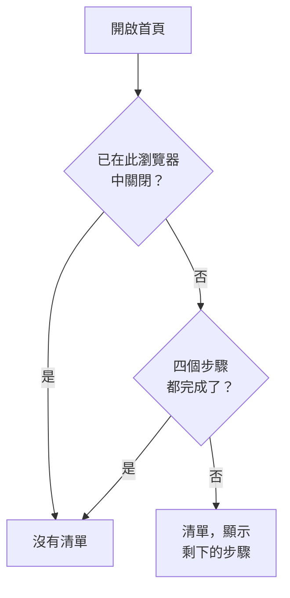

# 首頁與快捷鍵

首頁是你在專案中看到的第一個頁面。它讓你一眼就知道現在是否有需要你處理的事情，並引導新專案完成初始設定。本頁說明首頁顯示的內容、如何在儀表板中找到任何產品、頁面或動作，以及能讓你少在選單中來回的鍵盤快捷鍵。

:::cards
- [首頁顯示的內容](#首頁顯示的內容): 歡迎清單、五張統計卡和進行中的事件。
- [四處瀏覽](#四處瀏覽): 產品選單，以及每個頁面頂端的列。
- [搜尋](#搜尋頁面設定或動作): 輸入名稱即可找到任何頁面、設定或動作。
- [鍵盤快捷鍵](#鍵盤快捷鍵): 按兩個鍵即可前往首頁、監測器或事件。
:::

## 首頁顯示的內容

在頂端列中開啟 **首頁**，或在任何地方按 `g` 再按 `h`。首頁由上到下顯示：

1. **歡迎使用 OneUptime 👋**：新專案的清單，完成之前一直顯示。
2. 五張統計卡，計算需要注意的事項。
3. **進行中事件**：所有尚未解決的事件。

### 歡迎清單

清單引導你完成專案發揮作用之前需要的四件事。每個步驟都會開啟完成它的頁面，並在專案具備它所要求的內容時自動打勾。

| 步驟 | 完成條件 | 開啟 |
| --- | --- | --- |
| **建立您的第一個監測器** | 專案中有一個監測器。 | **建立監測器** 表單；對於不能建立監測器的人，則是 **監測器** 清單。 |
| **發布狀態頁面** | 專案中有一個狀態頁面。 | **狀態頁面** |
| **邀請您的團隊** | 除了你之外，專案中還有其他人，或已邀請了其他人。 | **使用者** |
| **設定待命政策** | 專案中有一個待命策略。 | **待命** |

在步驟下方，**OneUptime 如何運作** 依問題流經的順序展示四個核心產品：**監測器**、**事件與警示**、**待命** 和 **狀態頁面**。點選其中一個即可開啟。

四個步驟全部完成後，清單就會消失。若要提早隱藏它，請點選 **關閉**。關閉會在此瀏覽器中針對此專案記住；步驟開啟的所有內容仍然在 **產品** 選單中。

### 統計卡

每張統計卡計算某樣東西，告訴你它是否需要你處理，並開啟數字背後的清單。

| 統計卡 | 計算內容 | 計數為零時 |
| --- | --- | --- |
| **進行中的事件** | 尚未解決的事件 | **一切正常** |
| **進行中的警示** | 尚未解決的警示 | **一切正常** |
| **無法運作的監測器** | 狀態不屬於運作中類狀態的監測器。已封存的監測器不計入。 | **全部運作中** |
| **進行中的維護** | 正在進行的排定維護活動 | **目前沒有進行中** |
| **有風險的 SLO** | 已開啟且有風險或已用完錯誤預算的 SLO | **預算健康** |

計數大於零時顯示 **需要注意**，維護和 SLO 統計卡上則分別顯示 **進行中** 和 **預算正在消耗**。還沒有監測器的專案會在監測器統計卡上看到 **尚無監測器**，沒有 SLO 的專案會看到 **尚無 SLO**：空的專案並不等於健康的專案。此時這兩張統計卡會開啟 **監測器** 和 **SLOs** 清單，你可以在那裡建立第一個。

### 首頁的側邊選單

首頁旁邊的側邊選單包含相同的清單，每個都帶有計數：

| 區段 | 頁面 |
| --- | --- |
| **事件** | **進行中事件** 和 **進行中片段** |
| **警示** | **進行中警示** 和 **進行中片段** |
| **監測器** | **無法運作** |
| **排定事件** | **進行中** |

片段將相關的事件或警示歸為一組，讓你把它們當作一個整體處理。請參閱 [核心概念](/docs/introduction/core-concepts#事件和警示)。

## 四處瀏覽

OneUptime 中的一切都在頂端列的 **產品** 下。選單把各個群組列為同一個清單中的列，並且開啟時一律展開第一個群組，也就是基礎：監測、事件、警示、待命、狀態頁面、排定維護和 SLOs。其他每個群組（可觀測性、AI、程式碼、資源、基礎設施、儀表板與自動化和設定）都收合為同一清單中的一列。每一列會列出該群組包含的產品，並說明有幾個。點選一列即可展開或收合它，也可以用方向鍵移到該列並按 **Enter**。

- **搜尋能找到一切。** 在選單的搜尋框中輸入，即可依名稱、依功能，或依 `k8s`、`RUM` 這類常用詞找到任何產品。搜尋也會查找收合的群組。
- **從你所在的位置開始。** 你目前所在頁面的群組會自動展開，最近開啟的產品會列在頂端。
- **你的選擇會保留。** 選單會在你的瀏覽器中記住你展開或收合了其他哪些群組。即使你收合過基礎群組，每次開啟選單時它都會重新展開。
- **在手機上**，選單按鈕以同樣的方式列出產品：基礎群組在頂端展開，其他每個群組都是一列，輕觸即可展開。

### 頂端的列

每個頁面的頂端有兩列。

| 位置 | 內容 |
| --- | --- |
| 左上 | 專案選擇器：切換到你的另一個專案，或建立新專案。 |
| 右上 | **搜尋** 和 **Ask AI**、顯示目前需要你處理的事項（進行中的事件和警示、你正在待命的待命策略、待處理的邀請）的通知鈴鐺、**說明**，以及你的頭像，它會開啟你的 [帳戶](/docs/introduction/your-account) 選單。 |
| 其下方 | 左側是 **首頁** 和 **產品**，右側是 **使用者設定**：OneUptime 在此專案中聯絡你的方式。 |

**說明** 會開啟本文件（**文件**）和 **Keyboard shortcuts** 清單，並提供電子郵件和 Slack 支援。在手機等窄螢幕上，為了節省空間，**搜尋**、**Ask AI** 和 **說明** 會被隱藏；鈴鐺和你的頭像會保留。

## 搜尋頁面、設定或動作

按 **Cmd+K**（Mac）或 **Ctrl+K**（Windows 和 Linux），或點選頂端列中的搜尋圖示，然後開始輸入。搜尋可以找到：

- **選單中的每個頁面**，依選單給它的名稱：API 金鑰、危險區域、待命排程、事件嚴重性、你自己的通知方式。每個結果都會顯示它所在的位置，例如 *專案設定 › 進階*，因此同名頁面（事件、警示和監測器中的自訂欄位）很容易區分。
- **操作**，依你想做的事：宣告事件、建立監測器，或者開啟危險區域的 Delete Project。會變更內容的操作只提供給有權執行它的人。
- **你的監測器、事件、警示、狀態頁面和待命策略**，依名稱。

搜尋會依你的本意理解你輸入的內容：

- 大小寫、重音符號、空格和連字號都不影響結果：*on-call*、*on call* 和 *oncall* 會找到相同的頁面，單字順序也不限。
- 它知道許多頁面的其他叫法（英文）：*pager* 或 *escalation* 對應待命策略，*rota* 對應待命排程，*2fa* 對應雙重驗證，*delete project* 對應危險區域。
- 加上產品名稱可以縮小搜尋範圍：*incident custom fields* 會找到事件的自訂欄位頁面。
- 即使有小的拼字錯誤，例如 *incidnet*，在沒有完全相符的結果時，仍然能找到你想要的內容。

搜尋框為空時，搜尋會列出你最近開啟的頁面、操作和產品。

## 鍵盤快捷鍵

在儀表板的任何地方按 `?` 可查看所有快捷鍵，也可以開啟 **說明** 並選擇 **Keyboard shortcuts**。在 Mac 上，`Mod` 是 Command 鍵；在 Windows 和 Linux 上，它是 Ctrl 鍵。

| 按鍵 | 作用 |
| --- | --- |
| `Mod` + `K` | 開啟命令面板：搜尋任何頁面、設定或動作。 |
| `Mod` + `I` | 就你正在查看的內容詢問 AI。 |
| `/` | 搜尋此頁面上的清單。 |
| `?` | 顯示鍵盤快捷鍵。 |
| `Esc` | 關閉對話方塊或面板。 |

### 前往某個產品

按 `g`，然後按一個字母，即可直接前往某個產品。請在按下 `g` 後 1.5 秒內按下字母。

| 按鍵 | 前往 |
| --- | --- |
| `g` 然後 `h` | 首頁 |
| `g` 然後 `m` | 監測 |
| `g` 然後 `i` | 事件 |
| `g` 然後 `a` | 警示 |
| `g` 然後 `o` | 待命 |
| `g` 然後 `s` | 狀態頁面 |
| `g` 然後 `e` | 排定維護 |
| `g` 然後 `d` | 儀表板 |
| `g` 然後 `l` | 日誌 |
| `g` 然後 `t` | 追蹤 |

快捷鍵不會妨礙你。在欄位中輸入時，`?`、`/` 和 `g` 不會有作用；對話方塊開啟時，任何按鍵都不會離開目前頁面，因此誤按一個鍵不會讓你遺失填到一半的表單。其他任何產品，只要用 `Mod` + `K` 搜尋即可到達。

## 後續步驟

:::cards
- [快速開始](/docs/introduction/quickstart): 一步步完成歡迎清單。
- [您的帳戶](/docs/introduction/your-account): 你的個人資料、登入安全性、語言和主題。
- [詢問 AI](/docs/ai/ask-ai): Ask AI 能為你回答什麼、做什麼。
- [核心概念](/docs/introduction/core-concepts): 監測器、事件、警示和待命分別是什麼。
:::
