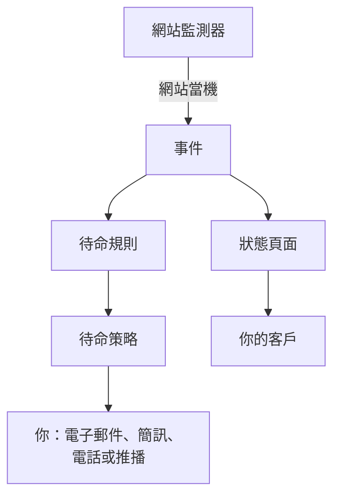

# 快速開始

本指南帶你在大約十五分鐘內，從一個新帳戶走到一套可運作的設定：一個每五分鐘檢查一次網站的監測器，一個在網站當機時呼叫你的待命策略，以及一個告知客戶的狀態頁面。它依照專案首頁上的 **歡迎使用 OneUptime 👋** 清單進行。

## 開始之前

- **一個帳戶。** 在 OneUptime Cloud 上，前往 [oneuptime.com](https://oneuptime.com/accounts/register) 註冊，並開啟寄給你的電子郵件中的連結。在你自己的安裝上，在瀏覽器中開啟它並註冊：第一個帳戶會成為主管理員。若要安裝 OneUptime，請參閱 [Docker Compose](/docs/installation/docker-compose)。
- **一個要監控的網站。** 任何透過 HTTP 或 HTTPS 回應的位址都可以，例如你公司的首頁。

## 建立專案

OneUptime 中的一切都位於專案中：你的監測器、事件、待命策略、狀態頁面，以及處理它們的人員。

:::steps
### 開始一個新專案

第一次登入時，OneUptime 會顯示 **沒有專案**。點選 **建立新專案**。如果已有人邀請你加入某個專案，請改為在同一頁面上接受邀請。

### 為它命名

輸入 **專案名稱**，例如你公司的名稱。在 OneUptime Cloud 上，下一步會要求你選擇一個方案。

### 建立它

點選 **建立專案**。專案首頁隨即開啟，頂端是 **歡迎使用 OneUptime 👋** 清單。
:::

## 監控你的網站

:::steps
### 開啟建立監測器

在清單中點選 **建立您的第一個監測器**。你也可以從 **產品** 選單開啟 **監測器**，然後點選 **建立監測器**。

### 選擇網站

在 **監測器類型** 下選擇 **網站**。輸入 **名稱**，例如 `Website`，然後點選 **下一步**。

### 輸入位址

在 **網站 URL** 中輸入網站的完整位址，例如 `https://example.com`。OneUptime 會為你加入條件：當網站沒有回應或回傳錯誤時，監測器會變為 **離線** 並宣告事件。點選 **下一步**。

### 建立監測器

保留已選的 **探測器**，以及 **監測間隔** 為 **每 5 分鐘**，然後點選 **建立監測器**。監測器頁面隨即開啟，探測器開始檢查你的網站。
:::

若要在儲存前試跑檢查，請在第二步點選 **測試監測器**。其他所有監測器類型都在 [建立監測器](/docs/monitor/create-monitor) 中說明。

## 在網站當機時收到呼叫

目前，沒有擁有者的事件會以電子郵件寄給專案的擁有者，其中也包括你。若要在有人回應之前持續被呼叫，請建立一個待命策略，並讓每個事件都呼叫它。

:::steps
### 建立待命策略

在清單中點選 **設定待命政策**，或從 **產品** 選單開啟 **待命**。點選 **建立待命策略** 並輸入 **名稱**。在 **首先通知誰？** 下點選 **新增回應者**，選擇你自己。點選 **建立待命策略**。

### 為每個事件呼叫它

從 **產品** 選單開啟 **事件**，在側邊選單中展開 **規則** 並選擇 **待命規則**。點選 **建立Incident On-Call Rule**，輸入 **名稱** 並點選 **下一步**。將 **比對條件** 留空，讓規則符合所有事件，然後點選 **下一步**。在 **待命策略** 下選擇你的策略，然後點選 **建立Incident On-Call Rule**。

### 選擇聯絡你的方式

你的登入電子郵件已經是聯絡你的一種方式。若也想透過簡訊或電話聯絡你，請在頂端列下方的那一列中開啟 **使用者設定**，前往 **通知方式**，在 **Direct Contact** 分頁上，把你的號碼加到 **電話號碼 用於簡訊通知** 或 **用於來電通知的電話號碼** 下。點選 **驗證** 並輸入 OneUptime 傳給你的驗證碼。經過驗證的號碼會立即用於待命呼叫。
:::

> [!NOTE]
> 新專案中的簡訊和電話預設關閉。專案擁有者、Billing Admin 或具有 Manage Billing 權限的人，可以在 **專案設定 → 通知 → 通知設定** 下的 **通知管道** 卡片中開啟它們。

關於更多層級、輪值以及每個層級等待多久，請參閱 [上報規則](/docs/on-call/escalation-rules) 和 [待命排程](/docs/on-call/schedules)。

## 發布狀態頁面

:::steps
### 建立狀態頁面

在清單中點選 **發布狀態頁面**，或從 **產品** 選單開啟 **狀態頁面**。點選 **建立狀態頁面**，輸入 **名稱**，例如 `Acme Status`，然後點選 **建立狀態頁面**。

### 加入你的監測器

開啟新的狀態頁面。在其側邊選單的 **資源** 下選擇 **監測器**；在啟用了監測器群組的專案中，它會顯示為 **資源**。點選 **新增監測器**，選擇你的網站監測器，然後點選 **新增監測器**。這一列會向訪客顯示監測器的名稱；如有需要，可以在 **顯示名稱** 中修改。

### 開啟頁面

在側邊選單中選擇 **概覽**。**Status Page Preview URL** 卡片連結到你的狀態頁面：開啟它，你的網站會顯示為運作中。
:::

新的狀態頁面是公開的：任何知道其位址的人都可以開啟它。若要使用你自己的網域、標誌和色彩，請參閱 [狀態頁品牌與網域](/docs/status-pages/branding-and-domains)。

## 邀請你的團隊

在清單中點選 **邀請您的團隊**，或從 **產品** 選單的 **設定** 下開啟 **使用者**。點選 **邀請使用者**，輸入對方的 **電子郵件**，並選擇一個 **團隊**：預設選取的是成員團隊。點選 **邀請**。OneUptime 會以電子郵件寄出邀請，而團隊決定對方可以做什麼。請參閱 [使用者、團隊與權限](/docs/permissions/index)。

## 試試看

宣告一個測試事件，看看整條流程如何運作。

:::steps
### 宣告測試事件

開啟 **事件** 並點選 **宣告事件**。輸入 **標題**，例如 `Test incident`，選擇 **事件嚴重性**，然後點選 **下一步**。在 **監測器** 下選擇你的網站監測器，這樣事件就會顯示在你的狀態頁面上。持續點選 **下一步** 直到摘要，然後點選 **宣告事件**。

### 觀察結果

一兩分鐘內，你的待命策略會呼叫你，事件也會顯示在你的狀態頁面上。

### 解決它

在事件頁面上點選 **解決**。呼叫停止，事件從你的狀態頁面上消失。
:::

> [!WARNING]
> 在你解決測試事件之前，任何開啟你狀態頁面的人都會看到它。請在分享頁面位址之前進行測試。

## 疑難排解

:::details 我沒有收到呼叫
開啟事件，在其側邊選單中選擇 **待命執行**：它會顯示你的策略是否執行，以及呼叫了誰。如果沒有執行，請檢查你的待命規則是否已啟用並指定了該策略。如果執行了，請檢查 **使用者設定 → 通知方式** 下的方式是否已驗證。
:::

:::details 事件沒有顯示在我的狀態頁面上
當事件的某個監測器在狀態頁面上時，狀態頁面才會顯示該事件。請檢查事件受影響的資源中是否列出了你的監測器，以及該監測器是否在狀態頁面上。
:::

:::details 監測器顯示離線，但我的網站正常
開啟監測器，查看探測器收到了什麼。請參閱 [網站監控](/docs/monitor/website-monitor) 的疑難排解章節。
:::

## 後續步驟

:::cards
- [核心概念](/docs/introduction/core-concepts): 你剛剛設定的內容背後的概念。
- [待命排程](/docs/on-call/schedules): 與團隊分擔待命。
- [狀態頁品牌與網域](/docs/status-pages/branding-and-domains): 讓狀態頁面展現你的品牌。
- [OpenTelemetry](/docs/telemetry/open-telemetry): 從你的應用程式傳送日誌、指標和追蹤。
:::
