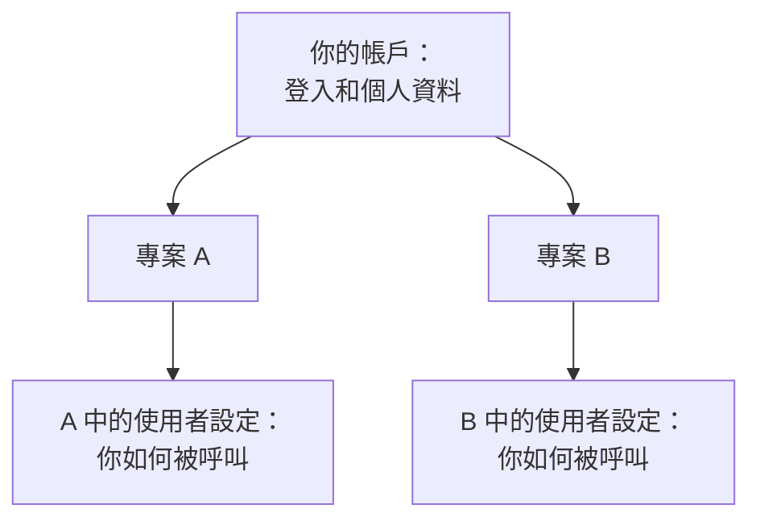

# 您的帳戶

你的帳戶是 OneUptime 認識你的方式：你用來登入的電子郵件和密碼、你的姓名和時區，以及保護你登入的措施。一個帳戶可以屬於多個專案，這些設定會跟著你進入每一個專案。OneUptime 如何聯絡你、何時呼叫你，則在每個專案的 **使用者設定** 中設定。

:::cards
- [你的個人資料](#你的個人資料): 你的姓名、電子郵件、時區和頭像。
- [安全登入](#安全登入): 你的密碼、通行密鑰和雙重驗證。
- [你的專案](#你的專案): 切換專案、建立專案和接受邀請。
- [使用者設定](#每個專案為你保存的內容): OneUptime 在每個專案中如何聯絡你。
:::

## 使用者選單

點選儀表板右上角你的頭像。

| 選單項目 | 作用 |
| --- | --- |
| **個人資料** | 開啟 **使用者設定檔**：你的姓名、電子郵件、時區、頭像和登入安全性。 |
| **管理員設定** | 開啟 Admin Dashboard。只有自架安裝的主管理員才看得到它。 |
| **深色主題** | 將儀表板切換為深色主題。在深色主題下，該項目顯示為 **淺色主題**。 |
| **登出** | 讓你登出。 |

**使用者設定檔** 有自己的側邊選單。**基礎** 包含 **概覽** 和 **個人頭像**。**安全性** 和 **危險區域** 是收合的：點選區段的標題即可展開。

## 你的個人資料

:::steps
### 開啟你的個人資料

點選右上角你的頭像，然後選擇 **個人資料**。**概覽** 頁面會開啟並顯示 **基本資訊** 卡片：你的姓名、電子郵件和時區。

### 編輯你的資訊

點選 **編輯使用者**，修改你需要的內容：

- **電子郵件**：你用來登入的位址。如果你修改了它，需要重新驗證新位址。
- **全名**：你的團隊在 OneUptime 各處看到的名字。
- **時區**：儀表板顯示和讀取時間所用的時區，也用於寄給你的通知中的時間。

點選 **儲存變更**。

### 加入頭像

選擇 **個人頭像**，點選 **Update Profile Picture** 並上傳圖片。它會顯示在你的使用者選單中，以及人員清單中你的名字旁邊。
:::

> [!NOTE]
> 你第一次在某個瀏覽器上登入時，OneUptime 會把該瀏覽器的時區儲存到你的個人資料中。如果你之後在瀏覽器時區不同的地方登入，儀表板會詢問是否要 **更新時區**。關閉詢問後，對於該時區它不會再問。

## 安全登入

在 **使用者設定檔** 的側邊選單中展開 **安全性**。它有三個頁面。

| 頁面 | 用途 |
| --- | --- |
| **密碼管理** | 設定新密碼。 |
| **Passkeys** | 不需要密碼即可登入，使用指紋、臉部、螢幕鎖定或安全金鑰。 |
| **Two-factor authentication** | 在密碼之後要求第二個步驟：來自應用程式的驗證碼，或安全金鑰。 |

### 變更密碼

:::steps
1. 開啟 **安全性 → 密碼管理**。
2. 在 **密碼** 中輸入新密碼，並在 **確認密碼** 中再輸入一次。密碼長度至少為 6 個字元。
3. 點選 **更新密碼**。
:::

### 加入通行密鑰

:::steps
1. 開啟 **安全性 → Passkeys** 並點選 **Add Passkey**。
2. 為它取一個你認得出的名字，例如你的裝置或密碼管理工具的名稱，然後點選 **Create Passkey**。
3. 依照瀏覽器的提示儲存通行密鑰。
:::

下次在登入頁面上選擇 **使用通行密鑰登入**。

### 開啟雙重驗證

雙重驗證在你使用密碼登入時生效。先加入第二個步驟，再開啟它。

:::steps
### 加入驗證器應用程式

開啟 **安全性 → Two-factor authentication**。在 **Authenticator apps** 下加入一個應用程式並為它命名。用 1Password、Google Authenticator 或 Microsoft Authenticator 等應用程式掃描 QR 碼，輸入它顯示的 6 位數驗證碼，然後點選 **Verify and finish**。如果想改用 USB 或 NFC 金鑰，請在 **Security keys** 下加入。

### 儲存備用碼

你第一次加入應用程式、金鑰或通行密鑰時，OneUptime 會顯示 **Your backup codes**。如果你遺失了應用程式或金鑰，每個備用碼可以讓你登入一次。複製或下載它們，勾選表示你已儲存的核取方塊，然後點選 **完成**。

### 開啟它

在頁面頂端點選 **Enable two-factor authentication** 並確認。卡片現在顯示 **已啟用**。從你下一次使用密碼登入開始，OneUptime 會要求第二個步驟。
:::

> [!TIP]
> 備用碼快用完了？同一頁面上的 **Regenerate codes** 會給你一組新的備用碼，舊的備用碼會立即失效。

## 你的專案

你可以屬於任意數量的專案。儀表板左上角的專案選擇器會列出它們：選擇一個即可切換。

- **建立專案**：開啟專案選擇器並點選 **建立新專案**。在自架安裝上，管理員可以把建立專案的權限僅保留給管理員。
- **接受邀請**：有人邀請你時，右上角的鈴鐺會顯示待處理的邀請，並開啟 **專案邀請**。你可以在那裡 **接受** 或 **Reject**。
- **離開專案**：請管理該專案使用者的人，在專案的 **使用者** 頁面上使用 **從專案中移除** 將你移除。

## 每個專案為你保存的內容

**使用者設定** 位於頂端列下方那一列的右側，只屬於你，而且每個專案各有一份。在你待命的每個專案中都開啟它。

| 頁面 | 用途 | 了解更多 |
| --- | --- | --- |
| **設定檢查清單** | 引導你完成下面的所有內容，並顯示還剩哪些要做。 | |
| **通知方式** | OneUptime 可以聯絡你的電子郵件、電話號碼、應用程式和 Webhook。你的登入電子郵件會自動加入。 | |
| **待命規則** | 待命策略呼叫你時，使用哪種方式，以及多久之後使用。 | [上報規則](/docs/on-call/escalation-rules) |
| **通知設定** | 你透過哪個管道接收關於事件、警示、監測器等的哪些更新。 | |
| **郵件偏好設定** | 你收到多少電子郵件：逐封寄送，還是彙總寄送。 | [通知彙總](/docs/emails/notification-rollup) |
| **待命日誌** | 寄給你的每一次呼叫，以及它的結果。 | |
| **來電號碼** | 來電原則撥打給你的號碼。 | [來電原則](/docs/on-call/incoming-call-policy) |
| **行事曆訂閱** | 你在 Google 日曆、Apple 行事曆或 Outlook 中的待命班次。 | [行事曆訂閱源](/docs/on-call/calendar-feeds) |

## 語言和主題

兩者都儲存在你的瀏覽器中，而不是帳戶中，因此在其他瀏覽器或裝置上需要重新設定。

- **語言**：儀表板會以你瀏覽器的語言啟動。若要變更語言，請使用任何頁面底部的語言選單。本文件在頂端有自己的語言選單。
- **主題**：在使用者選單中選擇 **深色主題**。儀表板預設以淺色主題啟動。

## 刪除你的帳戶

開啟 **危險區域 → 刪除帳號**。只有當你不屬於任何專案時才能刪除帳戶：該頁面會列出你仍然所在的專案。先離開這些專案，然後點選 **刪除帳號** 並確認。刪除帳戶是永久性的，無法復原。

## 疑難排解

:::details 我沒有收到驗證位址的電子郵件
再次登入會寄送一個新連結：也請檢查你的垃圾郵件資料夾。如果無法登入，請使用登入頁面上的 **忘記密碼？** 連結。重設連結同樣會驗證你的位址。
:::

:::details 我遺失了驗證器應用程式
在登入的第二個步驟，選擇 **無法使用驗證器應用程式？** 並輸入你的一個備用碼。然後開啟 **安全性 → Two-factor authentication** 並加入你的新應用程式。如果沒有備用碼，請聯絡你的 OneUptime 安裝的管理員，為你的帳戶重設雙重驗證。
:::

:::details 儀表板中的時間差了一個小時
儀表板使用你個人資料中的 **時區** 顯示時間，而不是你電腦的時區。請在 **使用者設定檔 → 概覽** 中檢查。
:::

## 後續步驟

:::cards
- [首頁與快捷鍵](/docs/introduction/home): 在儀表板中找到方向。
- [上報規則](/docs/on-call/escalation-rules): 待命策略如何呼叫你。
- [使用者、團隊與權限](/docs/permissions/index): 是什麼決定了你在專案中可以做什麼。
- [SSO](/docs/identity/sso): 透過你公司的身分識別提供者登入。
:::
