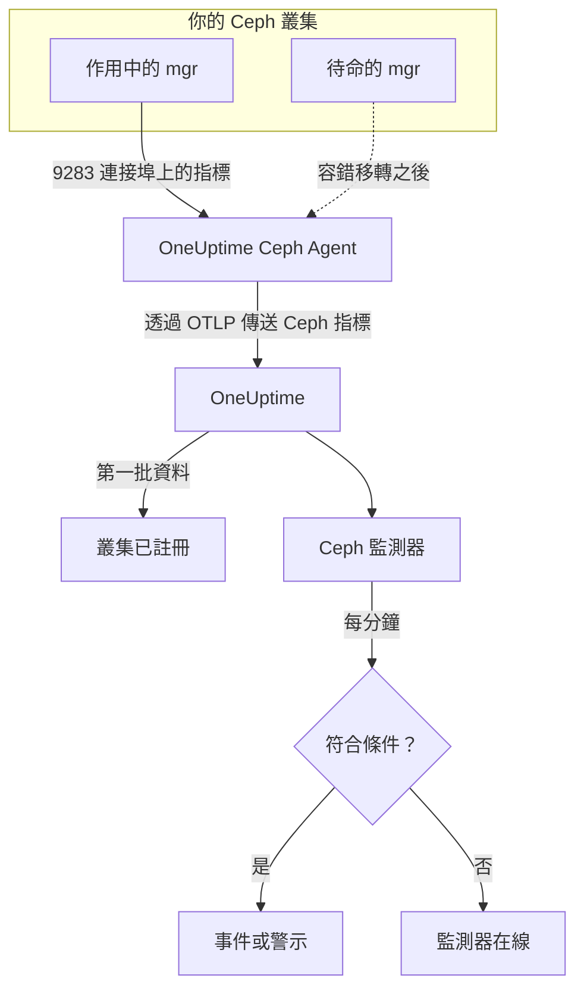

# Ceph 監控

Ceph 監測器負責監看一個 Ceph 叢集（健康狀態、健康檢查、mon 仲裁、OSD、儲存池和歸置群組），並在健康狀態下降、OSD 停止運作或容量不足的那一刻通知你。它讀取由 Ceph mgr 的 `prometheus` 模組匯出、由 OneUptime Ceph Agent 收集的 `ceph_*` 指標，因此不會從外部探測任何東西。

:::cards
- [建立監測器](#建立-ceph-監測器): 在儀表板中完成的六個步驟。
- [範本](#預建警示範本): 23 個現成的警示，涵蓋健康狀態、OSD、歸置群組和容量。
- [健康檢查](#健康檢查序列): 依名稱對任何 Ceph 健康檢查發出警示。
- [指標](#收集的指標): 監測器可以據以發出警示的每個 `ceph_*` 序列。
:::

## 運作方式

Ceph mgr 的 `prometheus` 模組在 9283 連接埠上提供叢集的指標。OneUptime Ceph Agent 每 30 秒擷取一次每個 mgr 常駐程式（作用中的 mgr 會回應，待命的 mgr 在接手之前不會傳回任何內容），保留 Ceph 本身的標籤（`ceph_daemon`、`pool_id`），並透過 OTLP 將指標傳送到 OneUptime，附上叢集名稱 `ceph.cluster.name`。第一批資料送達時，叢集即完成註冊。

Ceph 監測器繫結到一個叢集。它每分鐘對該叢集的指標執行一次查詢，並將結果與其條件比較。



## 開始之前

- 在叢集上**啟用 mgr 的 `prometheus` 模組**：

  ```bash
  ceph mgr module enable prometheus
  ```

- 在一台能透過 9283 連接埠連到每個 mgr 常駐程式的機器上**安裝 Ceph Agent**，並在 `CEPH_MGR_ENDPOINTS` 中列出所有常駐程式。安裝方式請參閱 [Ceph 代理程式指南](/docs/telemetry/ceph)。
- **確認叢集已註冊。** 第一次擷取大約一分鐘後，它會以代理程式的 `CEPH_CLUSTER_NAME` 為名稱，出現在**產品 → 基礎設施 → Ceph → 所有叢集**下。
- **若要使用健康檢查警示**，請執行 Ceph Quincy 或更新版本。較舊的版本不會匯出 `ceph_health_detail`。

## 建立 Ceph 監測器

:::steps
### 開始新的監測器

前往**監測器**，按一下**建立監測器**。

### 選擇 Ceph

在**監測器類型**下按一下**更多監測器類型**，然後在**基礎設施**下選擇 **Ceph**，或在搜尋方塊中輸入 `ceph`。輸入**名稱**（它會用於事件和警示的標題），然後按一下**下一步**。

### 選擇叢集

在 **Ceph Monitor Configuration** 下，從 **Ceph Cluster** 中選擇叢集。所有傳送過資料的叢集都在清單中。

### 選擇要監看的內容

從三個分頁中選擇一個：

- **Quick Setup**：按一下一個[範本](#預建警示範本)。範本會設定指標、篩選器、彙總、時間範圍和臨界值，並以自己的條件取代下方的條件。之後仍可以修改**時間範圍**。
- **Custom Metric**：從 **Ceph Metric** 中選擇一個指標，然後設定**彙總**和**時間範圍**。**OSD** 和 **Pool ID** 可以把範圍縮小到一個常駐程式或一個儲存池。
- **進階**：在**選擇指標**下自行建立查詢和公式，例如用 `ceph_cluster_total_used_bytes / ceph_cluster_total_bytes` 計算已用容量比率。用 **Group by** 指定 `ceph_daemon` 或 `pool_id`，即可分別判斷每個常駐程式或儲存池。

### 檢查條件

開啟**監測器條件**下的每個條件，檢查其**指標**、**彙總**、**條件**和 **Threshold**。範本會自動填入這些內容。使用 **Custom Metric** 或**進階**時，監測器會從[預設條件](#預設條件)開始，而預設條件只會注意到指標降到零，所以請設定自己的臨界值。

### 建立監測器

按一下**建立監測器**。OneUptime 會開啟監測器的頁面，並每分鐘評估一次。它產生的事件和警示也會列在叢集的**事件**和**警示**頁面上。
:::

> [!TIP]
> 若要一次設定多個範本，請從**產品 → 基礎設施 → Ceph** 開啟叢集，然後前往 **Recommendations**。選擇需要的範本和要呼叫的人，OneUptime 會為每個範本建立一個監測器。

## 監測器設定

| 欄位 | 分頁 | 作用 |
| --- | --- | --- |
| **Ceph Cluster** | 全部 | 必填。將每個查詢限定在 `resource.ceph.cluster.name`。 |
| **OSD** | Custom Metric、進階 | 選填。與 `ceph_daemon` 標籤完全相符，例如 `osd.3`。 |
| **Pool ID** | Custom Metric、進階 | 選填。與 `pool_id` 標籤完全相符，例如 `2`。 |
| **Ceph Metric** | Custom Metric | [目錄](#收集的指標)中的一個指標。 |
| **彙總** | Custom Metric | 樣本的合併方式：**平均**、**最大值**、**最小值**、**總和**或**計數**。初始值為該指標慣用的彙總方式。 |
| **時間範圍** | 全部 | 查詢讀取的滾動視窗，從 **Past 1 Minute** 到 **Past 365 Days**。新的監測器從 **Past 1 Minute** 開始；範本會設定自己的值。 |
| **選擇指標** | 進階 | 查詢建構器：**指標**、**Aggregate by**、**Filter by attributes**、**Group by**，以及用來組合查詢的**新增指標**和**新增公式**。 |

儲存池的資料序列只帶有 `pool_id` 標籤：儲存池的名稱只存在於 `ceph_pool_metadata` 中。請依 `pool_id` 篩選和分組儲存池序列，需要名稱時再到 `ceph_pool_metadata` 查詢。

### 健康檢查序列

`ceph_health_detail` 匯出的是**每個作用中健康檢查一個序列**，帶有 `name`（例如 `OSD_NEARFULL` 或 `RECENT_CRASH`）和 `severity` 標籤。序列只在其檢查觸發期間存在，所以沒有序列就代表健康。若要對任何 Ceph 健康檢查發出警示，請依其 `name` 篩選，在**最大值**高於 `0` 時觸發，並將**如果沒有資料**設為 **Treat As Zero**，在 `0` 時復原——健康檢查範本正是這樣建立的。`ceph_daemon_health_metrics` 以同樣的方式依常駐程式運作，以 `type` 標籤（例如 `SLOW_OPS`）和 `ceph_daemon` 為鍵。

## 預建警示範本

**Quick Setup** 提供 23 個範本，涵蓋叢集健康狀態、OSD、歸置群組和容量。每個範本都會建立一個完整的監測器——查詢、標籤篩選器、分組、一個觸發條件和一個復原條件。臨界值只是起點，可以編輯。

除非表格另有說明，範本會讀取過去 5 分鐘的資料。只有當條件在視窗內的每一分鐘都成立時才會觸發；帶臨界值的條件要回到臨界值另一側 10% 處才會復原，這樣在邊界附近徘徊的值就不會來回跳動。**嚴重程度**是選擇器中顯示的標籤；範本建立的事件和警示，會以你專案中最嚴重的事件嚴重程度和警示嚴重程度開始。

### 叢集健康狀態範本

| 範本 | 嚴重程度 | 監看內容 | 觸發時機 | 復原時機 |
| --- | --- | --- | --- | --- |
| Cluster Health Error | 嚴重 | `ceph_health_status`，Max，過去 1 分鐘 | 2 或以上：`HEALTH_ERR` | 低於 1.8：`HEALTH_WARN` 或更好 |
| Cluster Health Warning | Warning | `ceph_health_status`，Max | 1 或以上：`HEALTH_WARN` 或更差 | 低於 0.9：`HEALTH_OK` |
| Monitor Quorum Degraded | 嚴重 | `ceph_mon_quorum_status`，依 `ceph_daemon` 取 Min，過去 1 分鐘 | 某個 mon 降到 1 以下，退出仲裁。每個 mon 一個事件 | 回到 1 |
| Slow Operations | Warning | `ceph_healthcheck_slow_ops`，Max | 高於 0：叢集的 `SLOW_OPS` 檢查處於作用中 | 為 0 |
| Daemon Slow Operations | Warning | `type = SLOW_OPS` 的 `ceph_daemon_health_metrics`，依 `ceph_daemon` 取 Max | 高於 0。每個 OSD 或 mon 一個事件 | 序列消失 |
| Daemon Crash | 嚴重 | `name = RECENT_CRASH` 的 `ceph_health_detail`，Max | 檢查處於作用中：有尚未封存的常駐程式當機。mgr 沒有 `ceph_crash_*` 指標，所以這是唯一的當機訊號 | 當機已封存 |
| Monitor Clock Skew | Warning | `name = MON_CLOCK_SKEW` 的 `ceph_health_detail`，Max | 檢查處於作用中：mon 的時鐘偏差超過允許值（預設 0.05 秒） | 檢查消失 |
| Monitor Disk Critically Low | 嚴重 | `name = MON_DISK_CRIT` 的 `ceph_health_detail`，Max | 檢查處於作用中：mon 資料庫磁碟的可用空間低於 5%（預設值） | 檢查消失 |
| Monitor Disk Space Low | Warning | `name = MON_DISK_LOW` 的 `ceph_health_detail`，Max | 檢查處於作用中：可用空間低於 30%（預設值） | 檢查消失 |

### OSD 範本

| 範本 | 嚴重程度 | 監看內容 | 觸發時機 | 復原時機 |
| --- | --- | --- | --- | --- |
| OSD Down | 嚴重 | `ceph_osd_up`，依 `ceph_daemon` 取 Min | 某個 OSD 降到 1 以下。每個 OSD 一個事件 | 回到 1 |
| OSD Out | Warning | `ceph_osd_in`，依 `ceph_daemon` 取 Min | 某個 OSD 降到 1 以下：被標記為退出資料分布 | 回到 1 |
| OSD High Latency | Warning | `ceph_osd_apply_latency_ms`，依 `ceph_daemon` 取 Avg | 高於 100 ms。每個 OSD 一個事件 | 不高於 90 ms |
| OSD Slow Heartbeats | Warning | `name = OSD_SLOW_PING_TIME_FRONT` 和 `name = OSD_SLOW_PING_TIME_BACK` 的 `ceph_health_detail`，Max | 任一檢查處於作用中：公用網路或叢集網路上的心跳變慢。mgr 不會匯出 ping 時間指標 | 兩個檢查都消失 |

### 歸置群組範本

| 範本 | 嚴重程度 | 監看內容 | 觸發時機 | 復原時機 |
| --- | --- | --- | --- | --- |
| Inactive Placement Groups | 嚴重 | `ceph_pg_total` − `ceph_pg_active`，依 `pool_id` 取 Max | 高於 0：PG 無法處理 I/O，送往它們的用戶端請求會停住。每個儲存池一個事件 | 為 0 |
| Degraded Placement Groups | Warning | `ceph_pg_degraded`，依 `pool_id` 取 Max | 高於 0：物件的副本數少於設定值 | 為 0 |
| Undersized Placement Groups | Warning | `ceph_pg_undersized`，依 `pool_id` 取 Max | 高於 0：PG 對應到的 OSD 少於其副本數 | 為 0 |
| Damaged Placement Groups | 嚴重 | `name = PG_DAMAGED` 和 `name = OSD_SCRUB_ERRORS` 的 `ceph_health_detail`，Max | 任一檢查處於作用中：清理（scrub）發現了損壞或讀取錯誤 | 兩個檢查都消失 |

### 容量範本

| 範本 | 嚴重程度 | 監看內容 | 觸發時機 | 復原時機 |
| --- | --- | --- | --- | --- |
| Cluster Near Full | Warning | `ceph_cluster_total_used_bytes` ÷ `ceph_cluster_total_bytes` × 100 | 高於 85%，即 Ceph 預設的 nearfull 比率 | 不高於 76.5% |
| Cluster Full | 嚴重 | 同一比率 | 高於 95%，即 Ceph 預設的 full 比率，此時整個叢集停止寫入 | 不高於 85.5% |
| Pool Near Full | Warning | `ceph_pool_stored` ÷ (`ceph_pool_stored` + `ceph_pool_max_avail`) × 100，依 `pool_id` | 高於儲存池可容納量的 85%。每個儲存池一個事件 | 不高於 76.5% |
| OSD Nearfull | Warning | `name = OSD_NEARFULL` 的 `ceph_health_detail`，Max | 檢查處於作用中：某個 OSD 超過 nearfull 臨界值（預設 85%）。單一 OSD 會遠早於叢集平均值被寫滿 | 檢查消失 |
| OSD Backfillfull | Warning | `name = OSD_BACKFILLFULL` 的 `ceph_health_detail`，Max | 檢查處於作用中：往該 OSD 的回填被拒絕（預設 90%），復原因而停滯 | 檢查消失 |
| OSD Full | 嚴重 | `name = OSD_FULL` 的 `ceph_health_detail`，Max，過去 1 分鐘 | 檢查處於作用中：某個 OSD 達到 full 臨界值（預設 95%），寫入被拒絕 | 檢查消失 |

- **停止運作和仲裁範本使用最小值**，因此一個停止運作的 OSD 或一個退出仲裁的 mon 就會觸發它們，而不會被健康的多數掩蓋。
- **計數和健康檢查範本使用最大值**，因此一次異常的擷取就足夠了。
- **PG 和儲存池序列依儲存池劃分**：沒有叢集層級的指標，所以這些範本依 `pool_id` 分組，並為每個儲存池開啟一個事件。
- **容量比率**對兩邊都取**總和**。兩邊來自同一次 mgr 擷取，所以結果是真正的百分比。**Inactive Placement Groups** 則依儲存池取**最大值**，因為在減法中加總會把多次擷取累加起來。
- **健康檢查範本**會在檢查消失時復原：它們的復原條件將缺少的序列計為 0。

有些警示沒有範本。PG 不平衡需要跨序列的統計，而條件無法計算這種統計。容量預測需要成長趨勢擬合，這由叢集的儀表板來繪製。磁碟故障預測和清理延滯沒有 mgr 指標，而 NVMe-oF、RBD 鏡像和 cephadm 需要其他匯出器。

## 收集的指標

代理程式每 30 秒擷取一次每個 mgr 常駐程式，並保留 Ceph 本身的標籤，因此依常駐程式的序列帶有 `ceph_daemon`（`osd.3`、`mon.a`），依儲存池的序列帶有 `pool_id`。

### 叢集健康狀態指標

| 指標 | 單位 | 說明 |
| --- | --- | --- |
| `ceph_health_status` | — | 整體健康狀態：0 = `HEALTH_OK`，1 = `HEALTH_WARN`，2 = `HEALTH_ERR`。 |
| `ceph_health_detail` | 計數 | 每個**作用中**健康檢查一個序列，帶有 `name` 和 `severity` 標籤。僅限 Quincy 及更新版本。 |
| `ceph_healthcheck_slow_ops` | 計數 | `SLOW_OPS` 檢查回報的 OSD 和 mon 慢速操作。 |
| `ceph_daemon_health_metrics` | 計數 | 依常駐程式的健康指標，以 `type`（例如 `SLOW_OPS`）和 `ceph_daemon` 為鍵。 |
| `ceph_mon_quorum_status` | 計數 | mon 在仲裁中時為 1，依 `ceph_daemon`（例如 `mon.a`）。 |
| `ceph_mon_metadata` | 計數 | mon 中繼資料，一律為 1。加總即可計算 mon 數量。 |
| `ceph_cluster_total_bytes` | 位元組 | 總原始容量。 |
| `ceph_cluster_total_used_bytes` | 位元組 | 已使用的原始容量。 |

### OSD 指標

| 指標 | 單位 | 說明 |
| --- | --- | --- |
| `ceph_osd_up` | 計數 | OSD 處於 up 狀態時為 1，依 `ceph_daemon`（例如 `osd.3`）。 |
| `ceph_osd_in` | 計數 | OSD 在資料分布中時為 1。 |
| `ceph_osd_apply_latency_ms` | ms | 將操作套用到後端儲存所需的時間。 |
| `ceph_osd_commit_latency_ms` | ms | 將操作提交到日誌或 WAL 所需的時間。 |
| `ceph_osd_stat_bytes` | 位元組 | OSD 裝置的原始容量。 |
| `ceph_osd_stat_bytes_used` | 位元組 | OSD 上已使用的原始位元組數。與總量比較，可以找出不平均或接近寫滿的 OSD。 |
| `ceph_osd_numpg` | 計數 | OSD 上的歸置群組。 |
| `ceph_osd_metadata` | 計數 | OSD 中繼資料（主機名稱、裝置類別、版本），一律為 1。加總即可計算 OSD 數量。 |

### 儲存池指標

| 指標 | 單位 | 說明 |
| --- | --- | --- |
| `ceph_pool_stored` | 位元組 | 儲存池中儲存的使用者資料。 |
| `ceph_pool_max_avail` | 位元組 | 考量儲存池的複寫或抹除編碼設定檔後，仍可寫入該儲存池的位元組數。 |
| `ceph_pool_objects` | 計數 | 儲存池中的物件。 |
| `ceph_pool_rd` | 操作數 | 儲存池上的讀取操作。累計計數器。 |
| `ceph_pool_wr` | 操作數 | 儲存池上的寫入操作。累計計數器。 |
| `ceph_pool_rd_bytes` | 位元組 | 從儲存池讀取的位元組數。累計計數器。 |
| `ceph_pool_wr_bytes` | 位元組 | 寫入儲存池的位元組數。累計計數器。 |
| `ceph_pool_metadata` | 計數 | 儲存池中繼資料，一律為 1——唯一將 `pool_id` 對應到名稱的序列。 |

### 歸置群組指標

每個 `ceph_pg_*` 序列都依儲存池劃分，帶有 `pool_id` 標籤；將所有儲存池加總即可得到叢集層級的數量。

| 指標 | 單位 | 說明 |
| --- | --- | --- |
| `ceph_pg_total` | 計數 | 儲存池中的歸置群組。 |
| `ceph_pg_active` | 計數 | 處於 `active` 狀態、能夠處理 I/O 的 PG。 |
| `ceph_pg_clean` | 計數 | 處於 `clean` 狀態、已完整複寫的 PG。 |
| `ceph_pg_degraded` | 計數 | 處於 `degraded` 狀態的 PG。 |
| `ceph_pg_undersized` | 計數 | 處於 `undersized` 狀態的 PG。 |
| `ceph_num_objects_degraded` | 計數 | 副本數少於設定值的物件。 |
| `ceph_num_objects_misplaced` | 計數 | 不在 CRUSH 期望位置上的物件。資料是安全的，只是位置不對。 |

## 監控條件

條件將監測器的某個查詢或公式與臨界值比較。Ceph 監測器的條件沒有**篩選器類型**：每條規則都檢查指標值，並包含下列欄位。

| 欄位 | 作用 |
| --- | --- |
| **指標** | 要檢查的查詢或公式，依其變數名稱指定。 |
| **彙總** | 視窗中的值如何變成一個結果：**平均**、**總和**、**Maximum Value**、**Minimum Value**、**All Values**（每個值都必須符合）或 **Any Value**（一個就夠）。 |
| **條件** | **Greater Than**、**Less Than**、**Greater Than Or Equal To**、**Less Than Or Equal To** 或 **Equal To**，或者異常條件：**Anomalously High**、**Anomalously Low** 或 **Anomalous**。 |
| **Threshold** | 要比較的值。如果指標有單位，旁邊會有一個單位清單。異常條件下不會顯示。 |
| **敏感度** | 僅限異常條件。**Low**（4σ）、**Medium**（3σ，預設）或 **High**（2σ）。 |
| **基準視窗** | 僅限異常條件。14 天（預設）、28 天、60 天或 90 天的歷史記錄。 |
| **如果沒有資料** | 位於**更多欄位**下。視窗中沒有樣本時的處理方式：**Ignore**（預設）、**Treat As Zero** 或**觸發器**。 |

異常條件將每個值與基準中一週內同一時段的值比較。在基準視窗累積足夠的歷史記錄之前，它們會維持 "Learning" 狀態，不會產生任何東西。

每個條件也規定符合時要做什麼：變更監測器狀態、建立警示或宣告事件。條件由上而下依序檢查，第一個符合的條件決定結果。

### 預設條件

不是從範本建立的監測器會以兩個條件開始：

| 順序 | 條件 | 符合時機 | 然後 |
| --- | --- | --- | --- |
| 1 | Check if _監測器名稱_ is offline | 第一個查詢的任一值為 `0` | 將監測器標記為**離線**，並宣告事件 "_監測器名稱_ is offline"，該事件會在監測器復原時自動解決。 |
| 2 | Check if _監測器名稱_ is online | 任一值大於 `0` | 將監測器標記為**運作中**。 |

這些預設條件適用的 Ceph 指標很少：叢集健康時 `ceph_health_status` 為 0。請選擇一個範本，或設定自己的條件。

> [!IMPORTANT]
> 沒有資料不會符合任何條件：停止傳送資料的叢集會讓監測器維持原狀。若要在資料停止時收到通知，請在某個條件上將**如果沒有資料**設為**觸發器**。

## 疑難排解

:::details 叢集不在 Ceph Cluster 清單中
叢集會根據代理程式的資料自動註冊。請檢查代理程式是否正在執行並傳送資料（請參閱 [Ceph 代理程式指南](/docs/telemetry/ceph)），以及是否已設定 `CEPH_CLUSTER_NAME`。
:::

:::details mgr 容錯移轉後指標停止
代理程式必須擷取**每個** mgr 常駐程式，而不只是作用中的那個：待命的 mgr 在接手之前不會傳回任何內容。請在 `CEPH_MGR_ENDPOINTS` 中列出每個 mgr。
:::

:::details ceph_health_status 為 1，但沒有任何觸發
請檢查條件使用的是 **Greater Than Or Equal To** `1`，而不是 **Greater Than**，並且監測器的**時間範圍**至少涵蓋一次 30 秒的擷取。
:::

:::details 健康檢查範本從不觸發
監看 `ceph_health_detail` 的範本——Daemon Crash、Monitor Clock Skew、OSD Nearfull、OSD Backfillfull、OSD Full、兩個 mon 磁碟範本、Damaged Placement Groups 和 OSD Slow Heartbeats——需要 Quincy 或更新版本的 mgr `prometheus` 模組。在檢查處於作用中時，確認該序列存在：

```bash
curl http://ACTIVE_MGR:9283/metrics | grep ceph_health_detail
```

健康檢查序列（包括 `ceph_daemon_health_metrics`）只在檢查觸發期間存在，因此叢集健康時找不到它們是正常的。
:::

:::details ceph_pool_wr_bytes 之類的計數器只增不減
儲存池 I/O 序列是累計計數器，而條件比較的是原始值：沒有速率運算子，查詢建構器中的 **Convert to per-second rate** 只會改變圖表。可以把它們畫成速率，或用公式對其成長發出警示，例如同一計數器的**最大值**查詢減去**最小值**查詢。
:::

## 後續步驟

:::cards
- [Ceph 代理程式](/docs/telemetry/ceph): 安裝和升級此監測器讀取的代理程式。
- [Proxmox 監控](/docs/monitor/proxmox-monitor): 監看使用該儲存空間的 Proxmox VE 叢集。
- [儲存陣列監控](/docs/monitor/storage-array-monitor): 適用於 Pure Storage 陣列的同類監測器。
- [事件](/docs/incidents/index): 條件宣告事件之後會發生什麼。
:::
