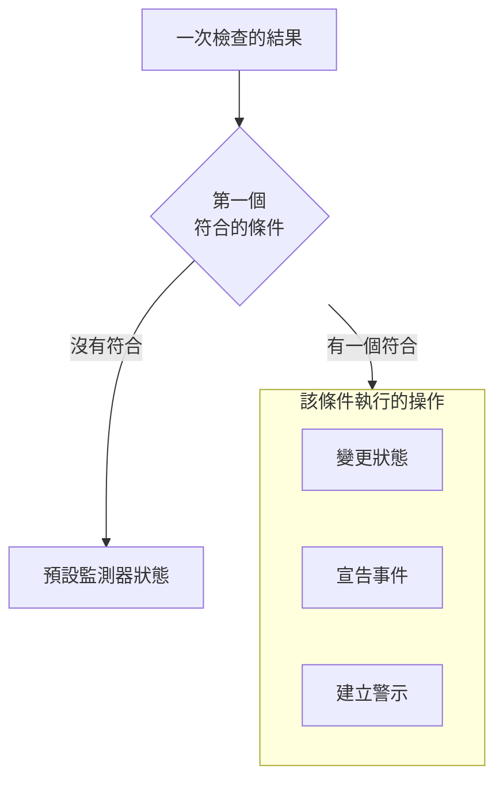

# 建立監測器

監測器會檢查您維運的對象，例如網站、API、主機或 Kubernetes 叢集，並在它停止運作時通知您。**建立監測器** 會先問要監測什麼，再問要檢查什麼，最後問多久檢查一次。除了類型、名稱和要檢查的對象之外，其餘內容都以適合大多數監測器的預設值開始。

> [!NOTE]
> 若要建立監測器，您需要 Project Owner、Project Admin、Project Member、Monitor Admin 或 Monitor Member 角色，或者擁有 Create Monitor 權限的自訂角色。

## 監測器資訊

第一個步驟會詢問要監測什麼，以及監測器要叫什麼名字。

:::steps
### 開啟建立監測器

前往 **監測器**，點選 **建立監測器**。表單會在第一個步驟 **監測器資訊** 上開啟。

### 選擇監測器類型

第一個問題是 **監測器類型**：您想監測什麼？

- 最常建立的六種類型排在最前面：**網站**、**API**、**Ping**、**連接埠**、**SSL Certificate**，以及用於 cron 工作和 webhook 心跳訊號的 **Incoming Request**。
- **更多監測器類型** 會依類別列出所有其他類型，例如 **基礎設施**（Kubernetes、Docker、主機）和 **遙測**（日誌、指標、追蹤）。由您自行設定狀態的監測器 **Manual** 位於 **其他** 之下。
- 也可以在搜尋方塊中輸入。它認得您平常使用的詞，例如 `k8s`、`postgres`、`heartbeat` 或 `tls`，按下 **Enter** 即會選取第一個結果。

選取的類型會收合為一行。點選 **變更** 可以選擇其他類型；在選擇過程中按下 **Escape** 會保留原本的類型。

### 為監測器命名

填寫 **名稱**。它會用在警示和事件標題中。**描述** 和 **標籤** 是選填的，位於 **更多欄位** 中。

**Manual** 監測器不需要其他內容，因此 **建立監測器** 就在這個步驟。對於其他任何類型，請點選 **下一步**。
:::

## 條件

第二個步驟會詢問要檢查什麼，並決定什麼算是問題。

:::steps
### 輸入要檢查的對象

這個步驟從要檢查的對象開始。對於網站，就是它的 URL，輸入方塊中會顯示範例；其他類型會要求填寫主機、查詢、叢集或日誌篩選條件。大多數監測器從不變更的設定（例如逾時和重試）收合在 **更多欄位** 中。

對於由探測器檢查的監測器，**測試監測器** 會在儲存之前執行一次檢查：在 **選擇探測器** 中選擇一個探測器，然後點選 **執行測試**。結果會在 **監測器測試結果** 中開啟。

### 檢視條件

下方的 **監測器條件** 決定監測器何時變更狀態、宣告事件或建立警示。新的監測器以適合大多數監測器的條件開始，每個條件都收合為一行，說明它檢查什麼、做什麼。例如，當網站沒有回應或回傳錯誤狀態碼時，新的網站監測器會被標記為離線並宣告事件。

點選某個條件即可展開並修改。**新增條件準則** 會新增一個已展開、可以直接填寫的條件。若要變更順序，請拖曳條件左側的控點。

### 前往下一步

點選 **下一步**。在您點選 **下一步** 之前，這個步驟不會把任何內容標記為缺漏。
:::

### 如何評估條件

每次檢查的結果會由上而下經過各個條件，第一個符合的條件決定接下來會發生什麼。該條件可以變更監測器的狀態、宣告事件、建立警示，或三者的任意組合。沒有任何條件符合時，監測器會顯示它的 **預設監測器狀態**，此狀態在條件下方的 **更多欄位** 中設定（除非您選擇其他狀態，否則為 **運作中**）。

設定為自動解決的事件和警示（預設條件就是如此）會在其條件不再符合時自行解決。由多個探測器檢查的監測器，只有在探測器意見一致時才會改變：預設情況下，每個已啟用且已連線的探測器都必須得到相同的結果。若要減少所需的數量，請在監測器的 **設定 → 探測器與間隔** 頁面上設定 **探測器一致性**。

## 探測器與間隔

由探測器檢查的監測器以這個步驟結束：網站、API、Ping、IP、連接埠、SSL Certificate、DNS、DNSSEC、NTP、網域、SQL Query、Database Health、Synthetic Monitor、Custom JavaScript Code 和 External Status Page。**探測器** 是執行檢查的機器，您專案的預設探測器已預先選取。**監測間隔** 從 **每 5 分鐘** 開始。

:::steps
### 選擇探測器

保留已選取的 **探測器**，或選擇其他探測器。沒有探測器的監測器永遠不會被檢查。若要檢查私有網路中的對象，請在該網路內執行 [自訂探測器](/docs/probe/custom-probe) 並在這裡選擇它。

### 選擇檢查頻率

選擇 **監測間隔**，從 **每分鐘** 到 **每週**。Synthetic Monitor、Custom JavaScript Code 和 SSL Certificate 監測器只提供 5 分鐘或更長的間隔。

### 完成建立

點選 **建立監測器**。新監測器的頁面隨即開啟。日後若要變更它的探測器或間隔，請在該頁面上開啟 **設定 → 探測器與間隔**。
:::

除了 Manual 以外，其他所有類型都在 **條件** 這個步驟建立。

## 從範本或連結開始

監測器範本，以及 OneUptime 其他地方（指標圖表、網路裝置或偵測規則上）用來建立監測器的連結，會開啟已選好類型、其餘內容也已填好的 **建立監測器**。點選 **變更** 可以選擇其他類型。範本本身的表單使用相同的類型選擇器：請參閱 [監測器範本](/docs/monitor/monitor-templates)。

每種監測器類型都有自己的頁面，介紹其設定、預設條件和範例。接下來可以看看：

:::cards
- [網站監控](/docs/monitor/website-monitor): 檢查頁面是否載入，以及它回傳什麼。
- [API 監控](/docs/monitor/api-monitor): 使用方法、標頭和內文呼叫端點。
- [監測器範本](/docs/monitor/monitor-templates): 從一個設定建立許多監測器，並讓它們保持一致。
- [事件](/docs/incidents/index): 監測器宣告事件之後會發生什麼。
:::
