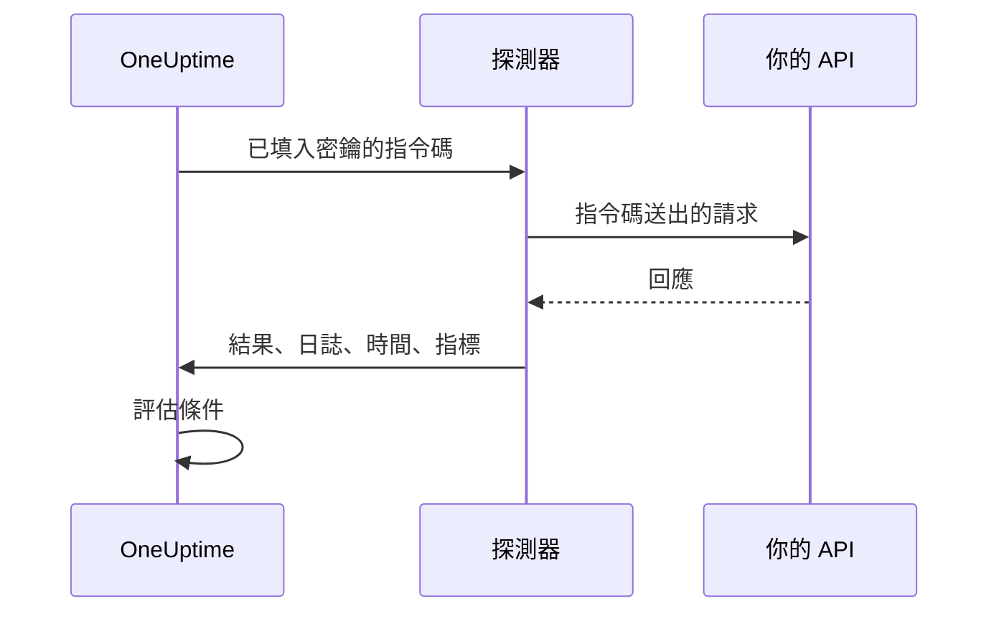

# 自訂程式碼監控

自訂程式碼監測器會依排程從探測器執行你撰寫的 JavaScript 指令碼。用它來完成其他監測器類型無法表達的檢查：先登入再呼叫需要驗證的 API、多步驟的交易，或是根據多個回應計算出來的值。如果指令碼擲回例外，檢查就會失敗；指令碼傳回的內容可供你的條件和事件範本使用。

:::cards
- [建立監測器](#建立自訂程式碼監測器): 撰寫指令碼，並選擇執行它的探測器。
- [撰寫指令碼](#撰寫指令碼): 從一個可以直接執行的多步驟 API 檢查開始。
- [使用密鑰](#使用監控密鑰): 不把密碼和權杖寫進指令碼。
- [記錄自訂指標](#自訂指標): 把指令碼計算出的任何數字繪製成圖表。
:::

## 運作方式

每次檢查時，探測器都會在一個隔離的 JavaScript 沙箱中執行你的指令碼，監控密鑰已經事先填入。指令碼呼叫它需要的一切，然後傳回結果或擲回錯誤。探測器回報結果、指令碼的日誌訊息、執行時間以及記錄的指標，OneUptime 再據此評估你的條件。



沙箱不是 Node.js：沒有 `require`、`process`、`fetch`，也沒有檔案系統，只有[下方列出的模組](#指令碼中可用的模組)。

## 開始之前

- 一個能連到指令碼所呼叫之每個端點的 **探測器**。對於你網路內部的端點，請使用[自訂探測器](/docs/probe/custom-probe)。
- 要呼叫私有位址（例如 `10.0.0.5`），探測器必須允許這麼做：在該探測器上設定 `PROBE_ALLOW_PRIVATE_NETWORK_MONITORS=true`。迴路位址、鏈路本機位址和雲端中繼資料位址一律會被拒絕。請參閱 [私有網路存取](/docs/self-hosted/private-network-access)。
- 指令碼需要的所有密碼、API 金鑰和權杖，都應儲存為 [監控密鑰](/docs/monitor/monitor-secrets)。

## 建立自訂程式碼監測器

:::steps
### 開始一個新的監測器

前往 **監測器**，點選 **建立監測器**。在 **監測器類型** 下點選 **更多監測器類型**，然後在 **Synthetic Monitoring** 下選擇 **Custom JavaScript Code**，或在搜尋方塊中輸入 `script`。輸入 **名稱**，然後點選 **下一步**。

### 加入指令碼

在 **JavaScript 程式碼** 編輯器中撰寫指令碼。可以從[下方的範例](#撰寫指令碼)開始。

### 測試

點選 **測試監測器**，從探測器執行一次指令碼並查看結果。

### 檢查條件

監測器一開始有兩個條件：指令碼失敗時變為離線並宣告一個事件，沒有失敗時變為上線。你可以修改它們或加入自己的條件（請參閱[條件](#條件)），然後點選 **下一步**。

### 選擇探測器並建立

選擇能連到你的端點的 **探測器** 和 **監測間隔**（自訂程式碼監測器提供 5 分鐘或更長的間隔），然後點選 **建立監測器**。
:::

## 撰寫指令碼

指令碼是一個 `async` 函式的主體：你可以在最上層使用 `await`，用 `return` 傳回結果，用 `throw` 讓檢查失敗。下面的範例會先登入，再用取得的權杖呼叫一個端點，如果回應不符合預期就失敗：

```javascript title="Custom code monitor script"
// 1. Log in. axios rejects a 4xx or 5xx response, which fails the check.
const login = await axios.post("https://api.example.com/v1/login", {
  username: "monitoring@example.com",
  password: "{{monitorSecrets.ApiPassword}}",
});

// 2. Call an endpoint that needs the token.
const orders = await axios.get("https://api.example.com/v1/orders?limit=10", {
  headers: { Authorization: `Bearer ${login.data.token}` },
  timeout: 10000,
});

// 3. Fail the check when the data is wrong, not only when the request fails.
if (!Array.isArray(orders.data.items)) {
  throw new Error("The orders endpoint returned no items");
}

console.log(`Fetched ${orders.data.items.length} orders`);

// 4. Return what the criteria and incident templates should see.
return {
  data: orders.data.items.length,
};
```

| 目的 | 做法 | OneUptime 記錄的內容 |
| --- | --- | --- |
| 回報結果 | 以任意 JSON 值 `return { data: ... }` | **結果**。只保留 `data` 屬性：`return 5` 不會記錄任何結果。 |
| 讓檢查失敗 | `throw new Error("...")` | **指令碼錯誤**，預設條件會把它變成事件。 |
| 留下紀錄 | `console.log(...)` | **日誌訊息**，每次執行最多 1,000 則。 |

要查看一次執行，請開啟監測器的 **概覽**：**監測器摘要** 卡片會顯示探測器、執行時間和錯誤，**顯示更多詳細資料** 則會顯示結果、指令碼錯誤和日誌訊息。**監測日誌** 中有過去檢查的相同摘要。

> [!NOTE]
> 這個沙箱中的 `axios` 不會跟隨重新導向，其請求也不會經過探測器上設定的 Proxy。請直接請求最終的 URL。

## 使用監控密鑰

在指令碼中的任何位置以 `{{monitorSecrets.NAME}}` 參照密鑰。OneUptime 會在指令碼到達探測器之前，把參照取代為密鑰的值，而且是純文字。因此，要把密鑰當作字串使用時請用引號括起來，要當作數字或布林值使用時則不加引號：

```javascript
// Used as a string: wrap it in quotes.
const apiKey = "{{monitorSecrets.ApiKey}}";

// Used as a number or a boolean: leave it bare.
const retryLimit = {{monitorSecrets.RetryLimit}};
const verbose = {{monitorSecrets.Verbose}};

// Check the secret was filled in without logging the secret itself.
console.log(apiKey.length > 0);
```

包含引號的密鑰值會破壞它周圍的字串。監測器無權使用的參照會照原樣留在指令碼中。如何建立密鑰並選擇哪些監測器可以使用它，請參閱 [監控密鑰](/docs/monitor/monitor-secrets)。

## 自訂指標

你可以在指令碼中用 `oneuptime.captureMetric()` 函式記錄自訂指標。這些指標儲存在 OneUptime 中，可以透過 Metric Explorer 在儀表板上繪製成圖表。

```javascript
oneuptime.captureMetric(name, value, attributes);
```

| 參數 | 類型 | 說明 |
| --- | --- | --- |
| `name` | string，必填 | 指標名稱（例如 `"api.response.time"`）。儲存時會自動加上 `custom.monitor.` 前置詞。 |
| `value` | number，必填 | 指標的數值。不是數字的值會被忽略。 |
| `attributes` | object，選填 | 用來補充內容的鍵值組。會記錄字串、數字和布林值（數字和布林值以文字形式儲存，因為指標屬性是維度而不是測量值）。其他類型的值會被忽略。 |

### 範例

```javascript
const response = await axios.get("https://api.example.com/health");

// Capture a simple metric
oneuptime.captureMetric("api.response.time", response.data.latency);

// Capture a metric with attributes
oneuptime.captureMetric("api.queue.depth", response.data.queueDepth, {
  region: "us-east-1",
  environment: "production",
});

return {
  data: response.data,
};
```

記錄之後，這些指標會以 `custom.monitor.api.response.time` 這類名稱出現在 Metric Explorer 中，也會出現在監測器 **指標** 頁面的 **自訂指標** 下。OneUptime 會為每個資料點加上監測器和探測器，因此你可以繪製圖表、設定警示，並依監測器、探測器或你提供的任何自訂屬性篩選。

### 限制

| 限制 | 值 | 超過限制時 |
| --- | --- | --- |
| 每次指令碼執行的指標數 | 100 | 之後的呼叫會被忽略。 |
| 指標名稱長度 | 200 個字元 | 名稱會被截斷。 |
| 每個指標的屬性數 | 50 | 多出的屬性會被捨棄。 |
| 屬性鍵長度 | 200 個字元 | 鍵會被截斷。 |
| 屬性值長度 | 1000 個字元 | 值會被截斷。 |

### 保留的屬性鍵

有些屬性名稱屬於 OneUptime 本身，指令碼無法寫入。如果你的指令碼設定了其中之一，該屬性會被捨棄（指標本身仍會記錄），並且會在 OneUptime 伺服器日誌中寫入一則指出該鍵名稱的警告。它們是：

- 監測器的識別資訊：`monitorId`、`projectId`、`monitorName`、`probeName`、`probeId`、`isCustomMetric`。
- `oneuptime.` 或 `resource.` 命名空間中的所有內容，它們承載 OneUptime 在擷取資料時加上的識別碼。
- 資源識別屬性：`service.name`、`host.name`、`k8s.cluster.name`、`iot.fleet.name`、`proxmox.cluster.name`、`vmware.vcenter.name`、`ceph.cluster.name`、`storage.array.name` 和 `docker.swarm.cluster.name`。

這些名稱不只是標籤：OneUptime 會把它們讀回來，當作資料點屬於哪個資源的宣告。帶有 `service.name: payments-api` 的指標會出現在該服務的指標分頁上；如果你之後建立依 `service.name` 分組的指標監測器，它的警示會關聯到該服務、呼叫該服務的負責人，並在該服務的維護時段內保持靜默。要把監測器與服務或主機關聯起來，請改用監測器本身的標籤。

## 條件

自訂程式碼監測器的條件可以檢查：

| 篩選器類型 | 檢查內容 | 篩選條件 |
| --- | --- | --- |
| **錯誤** | 指令碼擲回的錯誤（如果有）。 | 包含、Not Contains、Equal To、Not Equal To、Is Empty、Is Not Empty |
| **Result Value** | 指令碼傳回的 `data`。如果它是數字，就以數字比較。 | 同上，另加 Greater Than、Less Than、Greater Than Or Equal To、Less Than Or Equal To、是、否 |
| **執行時間（毫秒）** | 指令碼執行了多久。 | 數值比較 |

預設條件會在 **錯誤** 為空時將監測器標示為上線，不為空時標示為離線，並附帶一個事件，指令碼再次成功時該事件會自動解決。在事件和警示範本中，這次執行可以用 `{{result}}`、`{{scriptError}}`、`{{logMessages}}` 和 `{{executionTimeInMs}}` 參照：請參閱 [事件與警示範本](/docs/monitor/incident-alert-templating)。

### 依傳回的資料發出警示

指令碼以 `data` 傳回的內容就是監測器的 **Result Value**，條件可以對它進行比較，例如 _Result Value is Equal To `UP`_。

當 `data` 是物件或陣列時，在 Result Value 篩選器上填寫 **欄位路徑（選填）**，就能只比較其中一個欄位，而不是整個值。巢狀欄位使用點號，陣列項目使用 `[n]`：

```javascript
const response = await axios.get("https://api.example.com/health");

return {
  data: {
    status: response.data.status, // "UP"
    cpu_busy_percent: response.data.cpu, // 42
    healthy: response.data.healthy, // true
    checks: response.data.checks, // [{ name: "db", latency: 12 }]
  },
};
```

| 欄位路徑 | 比較的值 | 條件範例 |
| --- | --- | --- |
| `status` | `"UP"` | Not Equal To `UP` |
| `cpu_busy_percent` | `42` | Greater Than `90` |
| `healthy` | `true` | 否 |
| `checks[0].latency` | `12` | Greater Than `500` |

每個要檢查的欄位各加入一個篩選器；每個篩選器都可以有自己的條件和值。

- 要比較整個值（例如指令碼只傳回一個數字或字串），請把欄位路徑留空。
- Greater Than、Less Than 和其他數值條件只會符合數字，因此請把欄位傳回為 `42`，而不是 `"42"`。是和否只會符合布林值。
- 傳回資料中不存在的欄位（缺少的鍵，或超出陣列結尾的索引）會以空值比較：**Is Empty** 會符合它，其他條件都不會。
- 名稱中含有點號的欄位無法透過路徑存取。
- 在 Terraform 中，篩選器的 `custom_code_monitor_options` 用來設定欄位路徑：請參閱 [監控步驟](/docs/terraform/monitor-steps#comparing-one-field-of-a-scripts-result)。

## 指令碼中可用的模組

| 名稱 | 說明 |
| --- | --- |
| `axios` | 以 Promise 為基礎的 HTTP 用戶端：可以呼叫 `axios(...)`，或 `axios.get`、`post`、`put`、`patch`、`delete`、`head`、`options`、`request` 和 `create`。請求和回應的大小有上限（各 10 MB），不跟隨重新導向，也不使用探測器的 Proxy。 |
| `crypto` | `createHash` 和 `createHmac`（先呼叫一次 `update()`，再呼叫 `digest()`）、`randomBytes`、`randomInt` 和 `randomUUID`。它不是 Node.js 的 `crypto` 模組：沒有加密演算法和簽章。 |
| `http`、`https` | 只有它們的 `Agent` 類別，用來傳給 `axios`，例如 `httpsAgent: new https.Agent({ rejectUnauthorized: false })`。沒有 `request` 或 `get`。 |
| `console.log` | 記錄用於除錯的資料。只有 `console.log`，沒有 `console.error` 等其他方法。 |
| `oneuptime.captureMetric` | 記錄自訂指標。請參閱[自訂指標](#自訂指標)。 |
| `setTimeout`、`clearTimeout`、`sleep(ms)` | 在指令碼中等待。延遲永遠不會超過指令碼的逾時時間。 |

## 注意事項

- **逾時。** 執行超過 60 秒的指令碼會被停止，檢查失敗並回報 "Script execution timed out"。在自行託管的探測器上，可以用 `PROBE_CUSTOM_CODE_MONITOR_SCRIPT_TIMEOUT_IN_MS` 修改這個上限。
- **記憶體。** 每次執行都有自己的沙箱，記憶體上限為 128 MB。
- **重新導向。** `axios` 不跟隨重新導向，因此會重新導向的 URL 會讓請求失敗。請使用最終的 URL。

## 疑難排解

:::details 檢查失敗並回報 "Script execution timed out"
指令碼執行時間超過了時間上限。為每個請求設定自己的 `timeout`（毫秒），讓緩慢的端點能快速失敗，並給出指名它的錯誤。
:::

:::details 請求以 301 或 302 狀態失敗
這裡的 `axios` 不跟隨重新導向。請把 URL 改成重新導向後的目標位址。
:::

:::details 對內部位址的請求遭到拒絕
探測器不允許私有網路位址。在你網路內部的探測器上設定 `PROBE_ALLOW_PRIVATE_NETWORK_MONITORS=true`，並從該探測器執行監測器，請參閱 [私有網路存取](/docs/self-hosted/private-network-access)。
:::

:::details 密鑰沒有被填入
監測器無權使用該密鑰，或者參照中的名稱與密鑰名稱不完全相同。請參閱 [監控密鑰](/docs/monitor/monitor-secrets)。
:::

## 後續步驟

:::cards
- [合成監控](/docs/monitor/synthetic-monitor): 驅動真實的瀏覽器，而不是呼叫 API。
- [監控密鑰](/docs/monitor/monitor-secrets): 儲存指令碼使用的認證資訊。
- [事件與警示範本](/docs/monitor/incident-alert-templating): 把指令碼的結果和日誌放進事件。
:::
