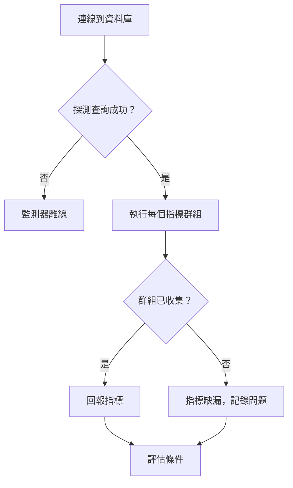

# 資料庫健康狀態監控

Database Health 監測器會依排程連線到 PostgreSQL、MySQL 或 Microsoft SQL Server，並回報伺服器本身的健康訊號——連線餘裕、被封鎖的工作階段、複寫延遲、快取命中率、資料庫大小、交易 ID 迴繞，以及另外三十多項——讓你能像網站停擺時收到警示那樣，針對這些訊號設定警示。

你不需要撰寫 SQL。探測器會依資料庫引擎執行一組固定的唯讀目錄查詢，並回報少量具名的數值。

:::cards
- [建立監控使用者](#建立監控使用者): 每種引擎需要的權限。這是最重要的一步。
- [建立監測器](#建立-database-health-監測器): 讓探測器指向資料庫，並選擇要收集的內容。
- [收集的指標](#收集的指標): 每個序列，以及回報它的引擎。
- [設定條件](#設定條件): 針對連線、封鎖、延遲和迴繞發出警示。
:::

## Database Health 還是 SQL Query？

這兩種資料庫監測器類型回答不同的問題，設計上就是要搭配使用。

| | Database Health | [SQL Query](/docs/monitor/sql-monitor) |
|---|---|---|
| 回答的問題 | 「資料庫本身健康嗎？」 | 「我的資料符合預期嗎？」 |
| 查詢 | 內建、依引擎區分、唯讀 | 你自己的 |
| 回報內容 | 具名的數值指標（請參閱[收集的指標](#收集的指標)） | 列數、純量值、第一列、執行時間 |
| 典型警示 | 已使用的連線超過 90% | 最近五分鐘內取消的訂單超過 50 筆 |
| 所需權限 | 讀取統計資料/DMV——請參閱[建立監控使用者](#建立監控使用者) | 對查詢所涉及資料表的 `SELECT` |

如果要針對業務條件發出警示，請使用 SQL Query 監測器。如果想在業務條件還沒有機會出錯之前，就知道伺服器的連線快要用完，請使用這個監測器。

## 支援的資料庫

| 資料庫 | 預設連接埠 |
|---|---|
| **PostgreSQL** | `5432` |
| **MySQL** | `3306` |
| **Microsoft SQL Server** | `1433` |

Azure SQL Database 和 Azure SQL Managed Instance 會以 **Microsoft SQL Server** 的身分連線。它們需要的權限不同——請參閱[建立監控使用者](#建立監控使用者)。

使用相同線路協定的 PostgreSQL 相容與 MySQL 相容引擎通常也能運作，但提供的統計檢視可能較少；此時受影響的指標會回報為無法使用，而不會被收集。只有上面三種引擎經過官方測試。

你的應用程式、叢集和主機所使用的每個資料庫（這三種引擎以及其他許多引擎）也都有自己的頁面，顯示其引擎指標、日誌以及呼叫它的服務：請參閱[資料庫](/docs/telemetry/databases)。如果 Database Health 監測器連線的主機和連接埠是某個資料庫的端點之一，該監測器的警示和事件也會出現在那個資料庫的頁面上（請參閱[資料庫上的警示](/docs/telemetry/databases#alerts-on-a-database)）。

## 運作方式

每次檢查時，探測器會：

1. 使用你設定的認證資訊連線到資料庫。
2. 執行一個輕量的探測查詢。**這是唯一一個失敗時會讓監測器離線的陳述式。**
3. 逐一執行每個已啟用[指標群組](#指標群組)的目錄查詢，每個查詢都有陳述式逾時。
4. 回報收集到的數值，並為每個無法收集的群組附上一則說明與原因。



傳送到 OneUptime 的只有具名的數值彙總。查詢文字、資料表中的資料列和結構描述名稱都不會離開你的網路——這些查詢讀取的是引擎自己的統計檢視（`pg_stat_activity`、`performance_schema.global_status`、`sys.dm_exec_sessions` 等），從不讀取你的資料。

由於檢查是從探測器發出，資料庫只需要能被探測器存取。把[自訂探測器](/docs/probe/custom-probe)放在你的網路內部，OneUptime 就完全不需要通往資料庫的路由。

## 開始之前

- 一個能透過網路連到資料庫主機和連接埠的**探測器**。如果資料庫可以從網際網路存取，就使用 OneUptime 代管的探測器；否則請在你的網路內部使用[自訂探測器](/docs/probe/custom-probe)。
- 一個依照下一節建立的**監控使用者**，以及它的連線資訊。

## 建立監控使用者

**這是最重要的一步。** 監測器讀取的統計檢視是一般登入無權查看的，而權限不足的登入並不一定會以錯誤失敗——在 PostgreSQL 上，它會給出錯誤的答案。請建立一個專用登入，只授予下列權限，不多也不少。

### PostgreSQL

```sql
CREATE USER oneuptime_health WITH PASSWORD 'a-strong-password';
GRANT CONNECT ON DATABASE mydb TO oneuptime_health;
-- The one grant that matters. Without it, see the note below.
GRANT pg_monitor TO oneuptime_health;
```

`pg_monitor` 是內建角色（PostgreSQL 10 及更新版本），授予對統計檢視和監控檢視的讀取權限。它不會授予任何對你資料表的存取權。

> [!IMPORTANT]
> **為什麼 `pg_monitor` 在 PostgreSQL 上不可省略。** 沒有它，`pg_stat_activity` 不會失敗——查詢會成功，但只傳回監控工作階段自己的那一列。於是，即使伺服器其實已經著火，連線數也會一直顯示 `1`，被封鎖的工作階段顯示 `0`，複寫延遲顯示 `0`。因此，探測器會在執行這些查詢**之前**檢查登入是否為 `pg_monitor`（或 `pg_read_all_stats`）的成員，或是超級使用者。如果都不是，探測器會把 Connections、Activity 和 Locks 群組回報為無法使用，並附上你需要的 `GRANT`。什麼都不回報才是誠實的答案；回報 `1` 則不是。

在無法使用 `pg_monitor` 的代管服務上，`pg_read_all_stats` 涵蓋相同的檢視。在 Amazon RDS 上，不需要 `GRANT rds_superuser`——`GRANT pg_monitor TO oneuptime_health;` 以 `rds_superuser` 成員的身分即可執行。

### MySQL

```sql
CREATE USER 'oneuptime_health'@'%' IDENTIFIED BY 'a-strong-password';
-- INNODB_TRX (open transactions, longest query) and replication status.
GRANT PROCESS, REPLICATION CLIENT ON *.* TO 'oneuptime_health'@'%';
-- Status counters, server variables, and lock waits.
GRANT SELECT ON performance_schema.* TO 'oneuptime_health'@'%';
-- Database size: information_schema.TABLES only shows tables the login can see.
GRANT SELECT ON mydb.* TO 'oneuptime_health'@'%';
FLUSH PRIVILEGES;
```

MySQL 的 `performance_schema` 必須啟用（`performance_schema = ON`，自 5.6 起為預設值）。如果它被關閉，Connections、Throughput 和 Locks 群組會回報為無法使用，解決方法是重新啟動伺服器，而不是授予權限。

### Microsoft SQL Server 與 Azure SQL Managed Instance

```sql
-- A server-level grant only runs while the current database is master.
USE master;
CREATE LOGIN oneuptime_health WITH PASSWORD = 'a-strong-password';
-- Every DMV the monitor reads. On SQL Server 2022 and later,
-- VIEW SERVER PERFORMANCE STATE alone is also enough.
GRANT VIEW SERVER STATE TO oneuptime_health;

USE mydb;
CREATE USER oneuptime_health FOR LOGIN oneuptime_health;
```

如果從其他任何資料庫執行，`GRANT VIEW SERVER STATE` 會失敗並傳回 Msg 4621：「Permissions at the server scope can only be granted when the current database is master」。

> [!WARNING]
> **只有資料表的讀取權限是不夠的。** 只能讀取資料的登入（`db_datareader` 或任何其他「讀取權限」角色）可以連線，也能取得資料庫大小，但僅止於此。SQL Server 會以 `The user does not have permission to perform this action.`（Msg 297）拒絕監測器讀取的檢視。它前面的那則訊息會說明被拒絕的是什麼：伺服器檢視（包括交易記錄空間和 tempdb 可用空間）對應 Msg 300 `VIEW SERVER STATE`（在 2022 上為 `VIEW SERVER PERFORMANCE STATE`），複寫檢視對應 Msg 262 `VIEW DATABASE STATE`（在 2022 上為 `VIEW DATABASE PERFORMANCE STATE`）。監測器會保持上線，回報 Connections、Activity、Throughput、Locks、Storage 和 Replication 群組缺少權限，並在旁邊顯示上面的 `GRANT`。`VIEW SERVER STATE` 可以涵蓋所有這些群組。
>
> 有兩個檢視不會拒絕：缺少該權限時，`sys.dm_exec_sessions` 和 `sys.dm_exec_requests` 會悄悄地只顯示監測器自己的工作階段。監測器從不單獨讀取它們，總是和一個會拒絕的檢視一起讀取，因此缺少權限永遠不會被記錄成「1 個連線」。

### Azure SQL Database

Azure SQL Database 沒有伺服器層級的權限——`GRANT VIEW SERVER STATE` 在那裡會失敗——因此同樣的檢視改由資料庫層級的權限開啟。在 `master` 中建立登入，在你要監控的資料庫中為它建立使用者，並在那個資料庫中授予權限，而不是在 `master` 中：

```sql
-- Connected to master, as the server admin:
CREATE LOGIN oneuptime_health WITH PASSWORD = 'a-strong-password';

-- Connected to the monitored database:
CREATE USER oneuptime_health FOR LOGIN oneuptime_health;
GRANT VIEW DATABASE STATE TO oneuptime_health;
```

對 vCore 資料庫和 S2 以上的 DTU 資料庫來說，這樣就足夠了。在 **Basic、S0 和 S1** 上，以及**彈性集區**中的任何資料庫上，無論資料庫權限如何，Azure 只允許伺服器管理員、Microsoft Entra 管理員或 `##MS_ServerStateReader##` 伺服器角色的成員讀取這些檢視。這時，伺服器管理員還要把登入加入該角色：

```sql
-- Connected to master, as the server admin:
ALTER SERVER ROLE ##MS_ServerStateReader## ADD MEMBER oneuptime_health;
```

`##MS_ServerStateReader##` 在所有服務層級上都有效，因此如果 `VIEW DATABASE STATE` 不夠用，它也是後備方案。新的角色成員資格可能需要幾分鐘才會生效，而且只對新連線有效；探測器每次檢查都會開啟新的連線。

自主資料庫使用者（在受監控的資料庫中以 `CREATE USER oneuptime_health WITH PASSWORD = '...'` 建立、沒有登入的使用者）在 S2 以上可以搭配 `VIEW DATABASE STATE` 使用，但無法加入 `##MS_ServerStateReader##`：伺服器角色只接受登入。若要把自主使用者移到該角色，請刪除它（`DROP USER oneuptime_health;`），然後依照上面的陳述式操作。

探測器是透過 `SERVERPROPERTY('EngineEdition')` 而不是版本來識別 Azure SQL Database——無論實際執行的是什麼，Azure SQL Database 都會回報 `12.0.2000.8`，看起來就像 SQL Server 2014。因此，監測器的 **Engine** 會顯示 `Azure SQL Database 12.0.2000.8`，缺少的權限會顯示為上面的 Azure 陳述式，而絕不會顯示為 `VIEW SERVER STATE`。

- **在 Azure SQL Database 上不收集複寫資訊。** Azure SQL Database 沒有 `sys.dm_hadr_database_replica_states`，因此 Replication 群組在那裡會被略過，而不是每次檢查都回報失敗。Azure 自己的複本檢視（`sys.dm_database_replica_states`、`sys.dm_geo_replication_link_status`）目前尚未讀取。
- **連線以資料庫為單位計算。** 使用 `VIEW DATABASE STATE` 時，Azure SQL Database 只會顯示受監控資料庫的工作階段，所以 Connections 計算的是該資料庫，而不是邏輯伺服器。請分別監控你在意的每個資料庫。
- **在彈性集區中，TempDB Free Space 是整個集區的值。** 集區中的資料庫共用同一個 tempdb。

## 建立 Database Health 監測器

:::steps
### 開始新的監測器

前往**監測器**，按一下**建立監測器**。在**監測器類型**下按一下**更多監測器類型**，然後在 **Database Monitoring** 下選擇 **Database Health**，或在搜尋方塊中輸入 `health`。輸入**名稱**，然後按一下**下一步**。

### 輸入連線資訊

選擇 **Database Type**，然後填寫主機、連接埠、資料庫名稱以及監控使用者的認證資訊。請以[監測器密鑰](#用監測器密鑰保存密碼)參照密碼，而不是直接輸入。每個欄位都在[設定](#設定)中有說明。

### 選擇要收集的內容

除非有理由關閉某個群組，否則請讓 **Metric Groups** 下的所有群組保持開啟——請參閱[指標群組](#指標群組)。

### 測試連線

按一下**測試監測器**，在儲存前執行一次檢查，並查看它收集到了什麼。

### 決定條件

檢視監測器一開始帶有的條件，並加入你自己的條件——請參閱[設定條件](#設定條件)。然後按一下**下一步**。

### 選擇探測器並建立

選擇能連到資料庫的**探測器**和一個**監測間隔**，然後按一下**建立監測器**。
:::

## 設定

| 欄位 | 填寫內容 |
|---|---|
| **Database Type** | PostgreSQL、MySQL 或 Microsoft SQL Server。選擇類型會設定預設連接埠，並決定執行哪些查詢。 |
| **主機** | 探測器可以連到的資料庫主機（例如 `db.internal`）。 |
| **連接埠** | 資料庫連接埠。 |
| **資料庫名稱** | 要連線的資料庫。資料庫範圍的指標（大小、快取命中率、溢出到暫存檔）會針對這個資料庫回報；伺服器範圍的指標（連線、運作時間、複寫）會針對整個伺服器回報——Azure SQL Database 除外，在那裡只計算受監控資料庫的連線。 |
| **Use Windows Integrated Authentication** | 僅限 Microsoft SQL Server。使用探測器處理程序的身分進行驗證，而不是使用者名稱和密碼。請參閱 SQL Query 監測器頁面上的 [Windows 整合式驗證](/docs/monitor/sql-monitor)——設定方式完全相同。 |
| **使用者名稱** | 監控使用者。除非使用 Windows 整合式驗證，否則為必填。 |
| **密碼** | 密碼。請用 `{{monitorSecrets.name}}` 參照[監測器密鑰](/docs/monitor/monitor-secrets)，而不是以純文字輸入（請參閱[使用監測器密鑰](#用監測器密鑰保存密碼)）。 |
| **Use SSL/TLS** | 透過 TLS 連線。啟用後，對於自我簽署憑證，可以關閉 **Verify server certificate**。 |
| **Metric Groups** | 要執行的群組：Connections、活動、Throughput、Locks and Blocking、儲存空間、Replication 和維護。預設全部開啟；請參閱[指標群組](#指標群組)。監測器的詳細資料會將它們列為 **Collected Metric Groups**。 |

### 更多欄位

| 欄位 | 預設值 | 最大值 | 限制的內容 |
|---|---|---|---|
| **Connection Timeout (ms)** | `10000` | `30000` | 建立連線時等待的時間。 |
| **Statement Timeout (ms)** | `10000` | `60000` | 每個目錄查詢的時間上限。 |

陳述式逾時的預設值刻意比 SQL Query 監測器更嚴格：在健康的伺服器上，這些查詢幾毫秒內就會回應，所以如果 `pg_stat_activity` 花了十秒，有用的訊號是「這台伺服器有麻煩了」，而不是再多等一會兒。超過最大值的數值會被降到最大值。

## 用監測器密鑰保存密碼

若要讓密碼永遠不以純文字儲存在監測器上：

:::steps
1. 前往**監測器 → 設定 → 密鑰**，建立一個[監測器密鑰](/docs/monitor/monitor-secrets)。
2. 為它命名（例如 `dbPassword`），並授予這個監測器存取權。
3. 在監測器的**密碼**欄位中輸入 `{{monitorSecrets.dbPassword}}`。
:::

密鑰會在設定交給探測器之前於伺服器端解析。主機、使用者名稱和資料庫名稱欄位也接受同樣的參照。認證資訊絕不會寫入日誌、監測器動態或警示範本。

## 指標群組

群組是你開啟或關閉的單位，也是回報缺少權限的單位。設計群組，是為了讓缺少一個權限只損失一個群組，而不是整個監測器。一個群組的陳述式會逐一執行，因此一個群組可能只被部分收集：這時它會同時出現在 `collectedGroups` 和 `unavailableGroups` 中。常見的情況是沒有 `VIEW SERVER STATE` 的登入在 SQL Server 上的 Storage 群組——資料庫大小會被收集，記錄空間和 tempdb 可用空間則不會。

| 群組 | 收集的內容 | 需要 |
|---|---|---|
| Connections | 連線數、設定的上限、中止的連線、伺服器運作時間 | PostgreSQL：`pg_monitor`。MySQL：`performance_schema`。SQL Server：`VIEW SERVER STATE` |
| Activity | 執行最久的查詢、開啟最久的交易、開啟中的交易 | PostgreSQL：`pg_monitor`。MySQL：`PROCESS`。SQL Server：`VIEW SERVER STATE` |
| Throughput | 交易、查詢、快取命中率、磁碟讀寫、I/O 時間 | PostgreSQL：除 `CONNECT` 外不需其他權限。MySQL：`performance_schema`。SQL Server：`VIEW SERVER STATE` |
| Locks | 被封鎖的工作階段、鎖定等待、死結、資料表鎖定等待 | PostgreSQL：`pg_monitor`。MySQL：`performance_schema`。SQL Server：`VIEW SERVER STATE` |
| Storage | 資料庫大小、溢出到暫存檔、記錄空間、tempdb 可用空間 | PostgreSQL：除 `CONNECT` 外不需其他權限。MySQL：對該資料庫的 `SELECT`。SQL Server：資料庫大小不需權限；記錄空間和 tempdb 可用空間需要 `VIEW SERVER STATE` |
| Replication | 已連線的複本、以秒和位元組計的複寫延遲、非作用中的槽位、復原狀態 | PostgreSQL：`pg_monitor`。MySQL：`REPLICATION CLIENT`。SQL Server：`VIEW SERVER STATE`；在 Azure SQL Database 上不收集 |
| Maintenance | 距交易 ID 迴繞的餘裕、死元組、從未被 autovacuum 處理過的資料表、檢查點 | PostgreSQL：`pg_monitor` |

在 Azure SQL Database 上，凡是此表寫著 `VIEW SERVER STATE` 的地方，都請改看成 `VIEW DATABASE STATE`——在 Basic、S0、S1 和彈性集區上則是 `##MS_ServerStateReader##`。請參閱 [Azure SQL Database](#azure-sql-database)。

關閉群組是靜默的：沒有指標、沒有收集問題，也沒有警示。在兩種情況下這樣做是對的：

- **你取得不了權限。** 關閉該群組後，收集問題就不會在每次檢查時重複出現。
- **查詢成本太高。** 在 MySQL 上，**儲存空間**是常見的候選：資料庫大小來自對 `information_schema.TABLES` 的加總，在有數萬個資料表的結構描述上並不便宜，而且每次檢查都會執行。請關閉它，或把這個監測器改為五分鐘的間隔。

取消選取所有群組並不能讓監測器什麼都不收集——空清單會被正規化回所有群組，因此監測器永遠不會以悄悄什麼都不收集的狀態被儲存。

## 無法收集指標時會發生什麼事

**缺少權限永遠不會讓監測器離線。** 這是這種監測器類型最重要的行為，值得準確說明。

| 失敗的環節 | 監測器狀態 | 你會看到 |
|---|---|---|
| **連線**或探測查詢——認證資訊錯誤、連線被拒、TLS 失敗、連線逾時 | **離線** | `Database Is Online` 為 false，你為它附加的事件和值班政策會被觸發。 |
| **某個群組**——缺少權限、`performance_schema` 被停用、陳述式逾時 | **保持上線** | 該群組無法讀取的指標是**缺漏的**，而不是零。圖表上不會畫線，針對這些序列的臨界值都不會符合，也不會因它們產生事件。這次檢查會記錄一個收集問題，寫明群組、原因以及（如果有的話）要執行的確切 `GRANT`；它會顯示在監測器摘要中，並計入 **Metric Groups Failed**。 |
| **引擎根本無法提供某個指標**——標準 MySQL 沒有死結計數器；SQL Server 預設不限制連線上限，因此「已用百分比」沒有意義 | **保持上線** | 該指標只是不存在。這**不是**收集問題，不會計入 Metric Groups Failed，也不需要修正。請參閱[收集的指標](#收集的指標)中的 Engines 欄。 |

缺漏就是缺漏。未測量的值永遠不會回報為 `0`，因為滿是捏造的零的圖表比空缺更糟——空缺至少你看得見。

> [!TIP]
> 若要在失去可見度時收到警示，請使用 `Database Collection Error`，或針對 **Metric Groups Failed** 設定臨界值。請把兩者都設為警示而不是事件：被撤銷的權限應該開工單處理，而不是呼叫值班人員。

### "The user does not have permission to perform this action"

這是 SQL Server 針對能連線但無法讀取伺服器狀態檢視的登入所給出的訊息（Msg 297）。它一定表示缺少權限，絕不表示資料庫故障。SQL Server 會把它當作第二則訊息送出，前一則訊息會寫明被拒絕的權限，監測器會同時顯示這兩則：例如 `VIEW SERVER STATE permission was denied on object 'server', database 'master'. The user does not have permission to perform this action.` 旁邊會顯示針對探測器所連線平台的修正陳述式：

- **SQL Server 或 Azure SQL Managed Instance**——`GRANT VIEW SERVER STATE TO oneuptime_health;`，在 `master` 中執行（監測器會將它顯示為 `GRANT VIEW SERVER STATE TO [<monitoring_login>]; -- run in master`）。
- **Azure SQL Database**——`GRANT VIEW DATABASE STATE TO oneuptime_health;`，在受監控的資料庫中執行；在 Basic、S0、S1 和彈性集區上，則改為加入 `##MS_ServerStateReader##`。請參閱 [Azure SQL Database](#azure-sql-database)。

在這段期間，資料庫大小仍會持續被收集，因為它是 Storage 群組中唯一任何登入都能讀取的指標。

## 收集的指標

八個類別，共四十一個序列。Engines 列出的是真正能提供該序列的引擎；在其他任何引擎上，該序列都不存在。Group 是該序列所屬的收集群組，也就是你開關的單位，以及會一起降級的單位。

### 可用性

| 指標 | 序列 | Group | Engines |
|---|---|---|---|
| **Uptime** (s) | `oneuptime.monitor.database.uptime.seconds` | Connections | PostgreSQL, MySQL, SQL Server |
| **Metric Groups Failed** | `oneuptime.monitor.database.metric.groups.failed` | Connections | PostgreSQL, MySQL, SQL Server |

### 連線

| 指標 | 序列 | Group | Engines |
|---|---|---|---|
| **Connections** | `oneuptime.monitor.database.connections.total` | Connections | PostgreSQL, MySQL, SQL Server |
| **Active Connections** | `oneuptime.monitor.database.connections.active` | Connections | PostgreSQL, MySQL, SQL Server |
| **Maximum Connections** | `oneuptime.monitor.database.connections.max` | Connections | PostgreSQL, MySQL |
| **Connections Used** (%) | `oneuptime.monitor.database.connections.used.percent` | Connections | PostgreSQL, MySQL |
| **Idle In Transaction** | `oneuptime.monitor.database.connections.idle.in.transaction` | Connections | PostgreSQL |
| **Aborted Connects** | `oneuptime.monitor.database.connections.aborted.total` | Connections | MySQL |

### 輸送量

| 指標 | 序列 | Group | Engines |
|---|---|---|---|
| **Transactions** | `oneuptime.monitor.database.transactions.total` | Throughput | PostgreSQL, SQL Server |
| **Queries** | `oneuptime.monitor.database.queries.total` | Throughput | MySQL, SQL Server |
| **Slow Queries** | `oneuptime.monitor.database.queries.slow.total` | Throughput | MySQL |
| **Rollback Ratio** (%) | `oneuptime.monitor.database.rollback.percent` | Throughput | PostgreSQL |
| **Longest Running Query** (s) | `oneuptime.monitor.database.query.longest.seconds` | Activity | PostgreSQL, MySQL, SQL Server |
| **Longest Open Transaction** (s) | `oneuptime.monitor.database.transaction.longest.seconds` | Activity | PostgreSQL, MySQL, SQL Server |
| **Open Transactions** | `oneuptime.monitor.database.transaction.open.count` | Activity | MySQL |

### 鎖定與封鎖

| 指標 | 序列 | Group | Engines |
|---|---|---|---|
| **Blocked Sessions** | `oneuptime.monitor.database.sessions.blocked` | Locks | PostgreSQL, MySQL, SQL Server |
| **Lock Waits** | `oneuptime.monitor.database.locks.waiting` | Locks | PostgreSQL, MySQL, SQL Server |
| **Deadlocks** | `oneuptime.monitor.database.deadlocks.total` | Locks | PostgreSQL, SQL Server |
| **Table Lock Waits** | `oneuptime.monitor.database.table.locks.waited.total` | Locks | MySQL |

標準 MySQL 不提供任何形式的死結計數器，所以 Deadlocks 只存在於 PostgreSQL 和 SQL Server 上。

### 快取與 I/O

| 指標 | 序列 | Group | Engines |
|---|---|---|---|
| **Cache Hit Ratio** (%) | `oneuptime.monitor.database.cache.hit.percent` | Throughput | PostgreSQL, MySQL, SQL Server |
| **Disk Reads** | `oneuptime.monitor.database.disk.reads.total` | Throughput | PostgreSQL, MySQL, SQL Server |
| **Disk Writes** | `oneuptime.monitor.database.disk.writes.total` | Throughput | MySQL, SQL Server |
| **I/O Read Time** (ms) | `oneuptime.monitor.database.io.read.time.ms` | Throughput | PostgreSQL, SQL Server |
| **I/O Write Time** (ms) | `oneuptime.monitor.database.io.write.time.ms` | Throughput | PostgreSQL, SQL Server |
| **Page Life Expectancy** (s) | `oneuptime.monitor.database.page.life.expectancy.seconds` | Throughput | SQL Server |
| **Memory Grants Pending** | `oneuptime.monitor.database.memory.grants.pending` | Throughput | SQL Server |

只有在 `track_io_timing` 開啟時，PostgreSQL 才會測量 I/O 讀寫時間。它預設是關閉的，這時 PostgreSQL 會把兩者都回報為 `0`——所以在 PostgreSQL 上，這兩個序列一直是零通常表示「沒有測量」，而不是「很快」。這是伺服器設定，不是權限問題。

### 儲存容量

| 指標 | 序列 | Group | Engines |
|---|---|---|---|
| **Database Size** (位元組) | `oneuptime.monitor.database.size.bytes` | Storage | PostgreSQL, MySQL, SQL Server |
| **Temp Bytes Written** (位元組) | `oneuptime.monitor.database.temp.bytes.total` | Storage | PostgreSQL |
| **Temp Disk Tables** | `oneuptime.monitor.database.temp.disk.tables.total` | Storage | MySQL |
| **Log Space Used** (%) | `oneuptime.monitor.database.log.space.used.percent` | Storage | SQL Server |
| **TempDB Free Space** (位元組) | `oneuptime.monitor.database.tempdb.free.bytes` | Storage | SQL Server |

### 複寫

| 指標 | 序列 | Group | Engines |
|---|---|---|---|
| **Connected Replicas** | `oneuptime.monitor.database.replica.count` | Replication | PostgreSQL, SQL Server |
| **Replication Lag** (s) | `oneuptime.monitor.database.replication.lag.seconds` | Replication | PostgreSQL, MySQL |
| **Replication Lag (Bytes)** (位元組) | `oneuptime.monitor.database.replication.lag.bytes` | Replication | PostgreSQL, SQL Server |
| **Is In Recovery** | `oneuptime.monitor.database.is.in.recovery` | Replication | PostgreSQL |
| **Inactive Replication Slots** | `oneuptime.monitor.database.replication.slots.inactive` | Replication | PostgreSQL |

複寫指標會從監測器所連線的那一端回報。把一個監測器指向主要伺服器，可以看到已連線的複本和傳送佇列；為每個待命伺服器各指向一個監測器，可以看到該待命伺服器實際落後了多少。

即使複本已經遠遠落後，閒置主要伺服器上以秒計的延遲仍會顯示為零，因為沒有寫入任何新內容。**Replication Lag (Bytes)** 沒有這個盲點，所以請對兩者都設定警示。

### 維護

| 指標 | 序列 | Group | Engines |
|---|---|---|---|
| **Transaction ID Used** (%) | `oneuptime.monitor.database.transaction.id.used.percent` | Maintenance | PostgreSQL |
| **Dead Tuples** | `oneuptime.monitor.database.dead.tuples` | Maintenance | PostgreSQL |
| **Tables Never Autovacuumed** | `oneuptime.monitor.database.tables.never.autovacuumed` | Maintenance | PostgreSQL |
| **Requested Checkpoints** | `oneuptime.monitor.database.checkpoints.requested.total` | Maintenance | PostgreSQL |
| **Timed Checkpoints** | `oneuptime.monitor.database.checkpoints.timed.total` | Maintenance | PostgreSQL |

> [!IMPORTANT]
> **Transaction ID Used** 值得在你建立的每個 PostgreSQL 監測器上設定一個條件。它達到 100% 時，PostgreSQL 會拒絕所有寫入，復原需要在資料庫停機的情況下以單一使用者模式執行 vacuum，而幾乎沒有人關注它。請在離懸崖還很遠時就發出警示——對大多數工作負載而言，80% 還留有好幾天的餘裕。

以 `total` 結尾的計數器是自伺服器啟動以來的累計值。比較兩個時間點才能得到速率；單一數值只有和它自己的歷史相比才有意義，而且伺服器重新啟動時會歸零（**Uptime** 會告訴你何時重新啟動過）。

## 設定條件

| 篩選器類型 | 檢查的內容 |
|---|---|
| **Database Is Online** | 資料庫是否可連線，以及探測查詢是否成功。這是監測器建立時附帶的離線條件，也是唯一反映可連線性的檢查。 |
| **Database Metric** | 選擇一個指標並進行比較：Greater Than、Less Than、Greater Than Or Equal To、Less Than Or Equal To、Equal To 或 Not Equal To。指標選擇器只會提供所選引擎能產生的指標，所以你無法建立一個永遠不會滿足的條件（有一個例外：為 Microsoft SQL Server 提供的 Replication 指標在 Azure SQL Database 上從不收集）。如果某次檢查沒有收集到該指標——群組失敗了，或引擎不回報它——篩選器不會符合，也不會以「false」符合：它會被略過。權限問題不會呼叫任何人。 |
| **Database Collection Error** | 這次檢查的收集問題摘要，每個無法使用的群組一則「群組: 訊息」。在它不為空時發出警示，可以察覺可見度的喪失；也可以用 Contains 盯住某個特定群組。 |
| **JavaScript Expression** | 完全掌控。請參閱 [JavaScript 運算式](/docs/monitor/javascript-expression)。 |

臨界值是整數。請寫 `90`，而不是 `90.5`——百分比和秒數都以整數比較。

**Database Is Online** 和 **Database Metric** 可以在一段時間內檢查：勾選**在一段時間內評估此條件**，然後在**評估**中選擇如何評估這些值（例如 **All Values**），並填寫**過去(以分鐘計)**。在一段時間內評估時，篩選器的**如果沒有資料**設定會決定缺漏值的意義；請保持為 **Ignore**，這樣缺少權限仍然不會呼叫任何人。

### JavaScript 運算式變數

對 Database Health 監測器而言，運算式可以存取：

| 變數 | 類型 | 說明 |
|---|---|---|
| `isOnline` | boolean | 連線和探測查詢是否都成功 |
| `engineVersion` | string | 伺服器回報的版本字串（在 SQL Server 上是原始的 `ProductVersion`；監測器摘要會在旁邊寫明平台） |
| `connectionError` | string | 經過清理的連線錯誤，沒有錯誤時為空 |
| `collectedGroups` | array | 這次檢查中產生了數值的群組 |
| `unavailableGroups` | array | 有陳述式無法收集的群組，每個都附有原因和修正方式。部分收集的群組會同時出現在兩份清單中 |
| `metrics` | object | 以序列名稱為鍵的已收集數值；未收集的序列不存在 |

```javascript
{{isOnline}} === true && {{collectedGroups}}.length >= 5
```

若要在運算式中讀取某個指標，請對整個 `metrics` 物件使用索引——序列名稱中含有點，因此不能放在大括號內：

```javascript
{{metrics}}['oneuptime.monitor.database.connections.used.percent'] > 90
```

若要對單一指標設定臨界值，請使用 **Database Metric** 而不是運算式：它會替你解析序列，只提供你的引擎能產生的指標，並在數值未被收集時略過檢查，而不是拿空值去比較。

### 範例：PostgreSQL 主要伺服器

| 順序 | 條件 | 篩選器 |
|---|---|---|
| 1 | **離線** | `Database Is Online` 為 `false`。 |
| 2 | **效能下降** | `Database Metric` → Connections Used 大於 `90`，以 All Values 在 5 分鐘內評估，這樣單次尖峰不會呼叫任何人。 |
| 3 | **效能下降** | `Database Metric` → Transaction ID Used 大於 `80`。 |
| 4 | **效能下降** | `Database Metric` → Blocked Sessions 在 5 分鐘內大於 `0`。 |
| 5 | **Online** | `Database Is Online` 為 `true`。 |

條件會依由上而下的順序評估，第一個符合的條件生效，所以請把警示條件放在前面，把健康條件放在最後。

為離線條件附加一個值班政策，而由 **Metric Groups Failed** 或 `Database Collection Error` 衍生的條件都保持為警示，不附加值班政策。

## 注意事項

- **查詢在每次檢查時執行。** 它們在設計上成本很低，但「成本低」是相對於間隔而言。對擁有數千個工作階段的伺服器使用一分鐘的間隔，會帶來比你想要的更多的 `pg_stat_activity` 掃描；對容量類指標來說，五分鐘就足夠了。
- **讓監測器指向你在意的資料庫。** 大小、快取命中率和溢出到暫存檔是以資料庫為單位。連線、運作時間和複寫是以伺服器為單位，從該執行個體上的任何資料庫讀取都相同。
- **每個執行個體一個監測器，而不是每個資料庫一個**，除非你確實需要依資料庫查看大小和快取指標——否則只會成倍增加伺服器範圍的查詢，卻得不到新資訊。Azure SQL Database 是例外：它以資料庫為單位回報連線，所以在那裡請監控每個資料庫。
- **針對速率而不是計數器發出警示。** 以 `total` 結尾的值只增不減，所以在它上面設定「大於」臨界值只會觸發一次，然後永遠不會恢復。請把它畫成圖表，或在一個時間範圍內比較。
- **優先使用監測器密鑰，而不是純文字密碼。** 這樣認證資訊在靜態儲存時會保持加密，也永遠不會顯示在監測器上。
- **監測器從不寫入。** 每個查詢都是對統計檢視的讀取——在 PostgreSQL 上位於唯讀交易中，在 MySQL 上位於唯讀工作階段中。它無法讀取的內容會回報為缺漏的指標，絕不會回報為停機。

## 疑難排解

:::details 監測器離線，但資料庫正常運作
離線表示探測器無法連線，或探測查詢失敗：探測器連不到主機或連接埠、登入被拒、TLS 失敗，或連線逾時。監測器摘要會顯示錯誤。請確認探測器能連到資料庫（OneUptime 代管的探測器需要公開位址；否則請使用[自訂探測器](/docs/probe/custom-probe)），檢查使用者名稱和密碼或其監測器密鑰，並在使用自我簽署憑證時關閉 **Verify server certificate**。然後按一下**測試監測器**再檢查一次。
:::

:::details PostgreSQL 上缺少 Connections、Activity 和 Locks
登入既不是 `pg_monitor` 也不是 `pg_read_all_stats` 的成員，也不是超級使用者，因此探測器會略過這些群組，而不是記錄錯誤的數值。請依 [PostgreSQL](#postgresql) 中的說明執行 `GRANT pg_monitor TO oneuptime_health;`。
:::

:::details MySQL 上缺少 Connections、Throughput 和 Locks
要不是登入缺少對 `performance_schema` 的 `SELECT`，就是伺服器上的 `performance_schema` 被關閉了；監測器摘要會顯示 MySQL 的訊息。如果是缺少權限，請執行 [MySQL](#mysql) 中的陳述式。被關閉的 `performance_schema` 需要在伺服器設定中設為 `performance_schema = ON` 並重新啟動。
:::

:::details PostgreSQL 上的 I/O Read Time 和 I/O Write Time 一直是 0
只有在 `track_io_timing` 開啟時 PostgreSQL 才會測量它們，而它預設是關閉的。請在伺服器設定或代管服務的參數群組中開啟它，才能看到真實的數值。這不是缺少權限。
:::

:::details 每次檢查 Metric Groups Failed 都大於 0
有一個群組在任何檢查中都無法收集，所以同一個收集問題不斷重複。監測器摘要會寫明群組、原因以及修正它的 `GRANT`。請執行這個授權；如果取得不了權限，就在 **Metric Groups** 中關閉該群組，讓問題不再重複出現。
:::

## 後續步驟

:::cards
- [SQL 查詢監控](/docs/monitor/sql-monitor): 在伺服器健康狀態之外，針對你自己的查詢結果發出警示。
- [資料庫](/docs/telemetry/databases): 在一個頁面上查看每個資料庫的指標、日誌和呼叫端。
- [監控密鑰](/docs/monitor/monitor-secrets): 加密保存監控使用者的密碼。
- [自訂探針](/docs/probe/custom-probe): 連到你網路內部的資料庫。
:::
