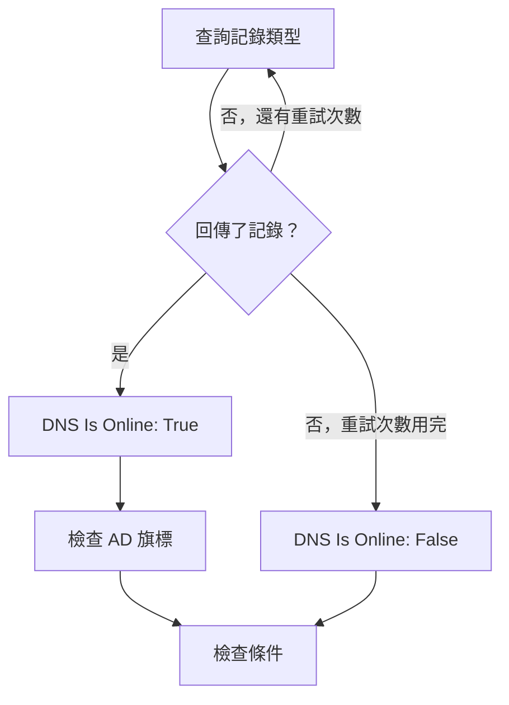

# DNS 監控

DNS 監測器會依排程查詢一筆 DNS 記錄並檢查回應：名稱能否解析、解析速度如何，以及記錄的內容是什麼。用它在使用者察覺之前發現 DNS 中斷、遭變更或消失的記錄，或是緩慢的解析器。

:::cards
- [建立監測器](#建立-dns-監測器): 在主控台中完成六個步驟。
- [設定選項](#設定選項): 名稱、記錄類型和 DNS 伺服器。
- [監測條件](#監測條件): 解析、記錄、回應時間和 DNSSEC。
- [疑難排解](#疑難排解): 監測器和 `dig` 的結果不一致時。
:::

## 運作方式

每次檢查時，探測器會向 DNS 伺服器查詢一個名稱的一種記錄類型，例如 `example.com` 的 `A` 記錄。當伺服器回傳至少一筆該類型的記錄時，名稱即為上線。失敗、逾時或沒有回傳記錄的查詢會在一秒後重試，最多重試您設定的次數。接著探測器會詢問一個驗證解析器，回應是否帶有 DNSSEC 的 authenticated data（AD）旗標，OneUptime 再以監測器的條件評估結果。



失去自身網路連線的探測器不會回報任何結果，因此它無法將您的 DNS 標記為離線。

## 開始之前

- **可以建立監測器的角色**：Project Owner、Project Admin、Project Member、Monitor Admin 或 Monitor Member，或者擁有 Create Monitor 權限的自訂角色。
- **能夠連到該 DNS 伺服器的探測器。** 每個新的監測器都會選取您專案的預設探測器。若要查詢私有網路中的 DNS 伺服器（例如內部解析器），請使用該網路內的 [自訂探測器](/docs/probe/custom-probe)。

## 建立 DNS 監測器

:::steps
### 開始建立新監測器

前往 **監測器**，點選 **建立監測器**。在 **監測器類型** 下點選 **更多監測器類型**，然後在 **DNS Monitoring** 下選擇 **DNS**。

### 命名

輸入 **名稱**，例如 `example.com A records`，然後點選 **下一步**。

### 輸入查詢

輸入要查詢的 **網域名稱**，例如 `example.com`，並選擇它的 **記錄類型**。若要查詢特定伺服器，請在 **DNS 伺服器（選用）** 中輸入它；留空則使用探測器自己的解析器。

### 測試

點選 **測試監測器**，在 **選擇探測器** 中選擇一個探測器，然後點選 **執行測試**。**監測器測試結果** 會顯示探測器收到的記錄。

### 檢視條件

**監測器條件** 從 [預設條件](#預設條件) 開始：名稱無法解析時為離線，可以解析時為上線。若要檢查記錄的內容，請新增 **DNS Record Value** 篩選器，然後點選 **下一步**。

### 選擇探測器並建立

保留或修改 **探測器** 和 **監測間隔**（初始為 **每 5 分鐘**），然後點選 **建立監測器**。監測器頁面隨即開啟。
:::

## 設定選項

| 欄位 | 預設值 | 要填寫的內容 |
| --- | --- | --- |
| **網域名稱** | 無 | 要查詢的名稱，例如 `example.com` 或 `_sip._tcp.example.com`。對於 `PTR` 記錄，請填寫反向名稱，例如 `34.216.184.93.in-addr.arpa`。 |
| **記錄類型** | `A` | 要查詢的記錄類型。請參閱 [記錄類型](#記錄類型)。 |
| **DNS 伺服器（選用）** | 探測器的解析器 | 改為查詢的 DNS 伺服器，例如 `8.8.8.8` 或 `ns1.example.com`。所有記錄類型（包括 `CAA`）都會向它查詢。 |
| **連接埠**（在 **更多欄位** 下） | `53` | **DNS 伺服器（選用）** 中伺服器的連接埠。DNSSEC 檢查也會查詢同一個連接埠。 |
| **逾時（ms）**（在 **更多欄位** 下） | `5000` | 等待回應的時間，單位為毫秒。 |
| **重試**（在 **更多欄位** 下） | `3` | 第一次嘗試失敗後的重試次數。`0` 表示只嘗試一次。 |

### 記錄類型

**DNS Record Value** 條件會把您輸入的文字與探測器寫出的每筆記錄進行比較，因此請使用以下格式：

| 記錄類型 | 包含的內容 | 值的格式（用於條件） |
| --- | --- | --- |
| `A` | IPv4 位址 | `93.184.216.34` |
| `AAAA` | IPv6 位址 | `2606:2800:220:1:248:1893:25c8:1946` |
| `CNAME` | 此名稱作為別名所指向的名稱 | `example.net` |
| `MX` | 郵件伺服器 | `10 mail.example.com`（優先順序，接著是伺服器） |
| `NS` | 名稱伺服器 | `ns1.example.com` |
| `TXT` | 文字，例如 SPF 和驗證記錄 | `v=spf1 include:_spf.example.com ~all` |
| `SOA` | 區域的授權起始（start of authority） | `ns1.example.com hostmaster.example.com 2024010101 7200 3600 1209600 3600`（伺服器、聯絡人、序號、refresh、retry、expire、最小 TTL） |
| `PTR` | 位址反向指向的名稱（反向 DNS） | `server1.example.com` |
| `SRV` | 服務 | `10 5 5060 sip.example.com`（優先順序、權重、連接埠、目標） |
| `CAA` | 獲准為該名稱簽發憑證的憑證授權單位 | `0 letsencrypt.org`（旗標，接著是授權單位） |

拆成多個字串的 `TXT` 記錄會被串接成一個值。

## 監測條件

條件決定名稱何時算是上線、效能下降或離線，以及是否因此宣告事件或建立警示。每個條件會檢查一個或多個篩選器：

| 篩選器 | 條件 | 檢查內容 |
| --- | --- | --- |
| **DNS Is Online** | **是**、**否** | 查詢是否回傳了至少一筆該類型的記錄。 |
| **DNS Response Time (in ms)** | **Greater Than**、**Less Than**、**Greater Than Or Equal To**、**Less Than Or Equal To** | 查詢所花的時間。 |
| **DNS Record Exists** | **是**、**否** | 是否回傳了任何該類型的記錄。 |
| **DNS Record Value** | **包含**、**Not Contains**、**Starts With**、**Ends With**、**Equal To**、**Not Equal To** | 記錄的值。只要有一筆記錄符合，篩選器即符合。 |
| **DNSSEC Is Valid** | **是**、**否** | 驗證解析器是否在回應上設定了 AD 旗標。 |

只要 _任何一筆_ 記錄符合，**DNS Record Value** 就會符合。有多筆 `A` 記錄時，只要其中一筆是該位址，**Equal To** `93.184.216.34` 就會符合；只要其中一筆不是該位址，**Not Equal To** 就會符合。

**DNSSEC Is Valid** 會在 **DNS 伺服器（選用）** 中伺服器的 **連接埠** 上查詢它；該欄位為空時，則查詢 Google Public DNS（`8.8.8.8`）。因此您設定的伺服器應能驗證 DNSSEC。當探測器無法執行此檢查時，該篩選器沒有值，兩種情況都不符合。若要完整檢查已簽署的區域，請使用 [DNSSEC 監控](/docs/monitor/dnssec-monitor)。

有兩個以上的篩選器時，**符合條件** 決定是 **全部** 篩選器都必須符合，還是 **任何** 一個符合即可。條件的 **操作** 決定它做什麼：變更監測器狀態、建立警示、宣告事件，或其中任意幾項。

### 預設條件

新的 DNS 監測器以兩個條件開始：

- **離線** — 經過所有重試後，名稱仍無法解析，或沒有該類型的記錄。監測器會被標記為 **離線**，並建立名為「_monitor name_ is offline」的事件。名稱再次能夠解析時，事件會自行解決。
- **上線** — 名稱可以解析。監測器會被標記為 **運作中**。

條件由上而下檢查，第一個符合的條件決定接下來會發生什麼。沒有任何條件符合時，監測器會顯示其預設狀態：**運作中**，除非您在條件下方的 **更多欄位** 中選擇了其他狀態。

### 在一段時間內評估

**在一段時間內評估此條件** 是篩選器下方的核取方塊，適用於 **DNS Is Online** 和 **DNS Response Time (in ms)**。開啟它即可判斷過去一段時間內的檢查，而不是最近一次：在 **評估** 中選擇彙總方式，在 **過去(以分鐘計)** 中選擇 2 到 60 分鐘的時間範圍。

| 彙總 | 符合的時機 |
| --- | --- |
| **平均**、**總和**、**Maximum Value**、**Minimum Value** | 該數值在整個時間範圍內符合條件。僅限 **DNS Response Time (in ms)**。 |
| **All Values** | 時間範圍內的每次檢查都符合條件。 |
| **Any Value** | 時間範圍內至少有一次檢查符合條件。 |

**All Values** 只有在時間範圍真正被資料涵蓋後才會符合。剛建立的監測器，或檢查已不再被記錄的監測器，沒有足夠的歷史來說明過去 N 分鐘的情況，因此條件會等待，而不是根據手上僅有的一個讀數就符合。**Any Value** 適用於「只要有一次檢查超出門檻就立即告訴我」，並且仍會立即觸發。

**如果沒有資料** 決定在時間範圍無法支撐條件時會發生什麼：

| 選項 | 會發生什麼 | 適用於 |
| --- | --- | --- |
| **Ignore**（預設） | 條件不符合。 | 一般的門檻警示。 |
| **觸發器** | 缺少的資料本身就被視為問題。 | 沉默本身就是故障的檢查。 |
| **Treat As Zero** | 將時間範圍以單一零值比較。 | 沒有事件確實代表零的計數器。 |

### 條件範例

| 目標 | 篩選器 | 條件 | 值 |
| --- | --- | --- | --- |
| 名稱不再能解析時為離線 | **DNS Is Online** | **否** | — |
| 名稱唯一的 `A` 記錄變更時發出警示 | **DNS Record Value** | **Not Equal To** | `93.184.216.34` |
| `MX` 記錄指向您的網域之外時發出警示 | **DNS Record Value** | **Not Contains** | `example.com` |
| DNS 變慢時標記為效能下降 | **DNS Response Time (in ms)** | **Greater Than** | `500` |
| DNSSEC 驗證失敗時發出警示 | **DNSSEC Is Valid** | **否** | — |

## 疑難排解

:::details 監測器顯示離線，但我這邊名稱可以解析
探測器查詢了另一台伺服器，或查詢了另一種記錄類型。請檢查 **記錄類型**：只有 `CNAME`、或只有 `AAAA` 記錄的名稱沒有 `A` 記錄。用 `dig` 向同一台伺服器查詢並比較：

```bash
dig @8.8.8.8 example.com A
```
:::

:::details 正確的位址明明存在，Not Equal To 條件卻觸發了
只要有一筆記錄符合，**DNS Record Value** 就會符合。有多筆記錄時，只要其中一筆不同，**Not Equal To** 就會觸發。若要檢查某個特定值是否在記錄之中，請利用條件的順序，因為第一個符合的條件會生效：

1. 將預設的離線條件保留在最上方：**DNS Is Online** / **否**。
2. 在其下方新增一個 **DNS Record Value** / **Equal To** / 預期值 的條件，將監測器標記為 **運作中**。
3. 再在其下方新增一個 **DNS Is Online** / **是** 的條件，將監測器標記為 **離線** 並宣告事件。它只會符合不含該值的回應。
:::

:::details DNSSEC Is Valid 從不符合
**DNS 伺服器（選用）** 中的伺服器不驗證 DNSSEC，因此從不設定 AD 旗標；或者探測器無法執行該檢查。將該欄位留空即可用 `8.8.8.8` 驗證，或者使用 [DNSSEC 監控](/docs/monitor/dnssec-monitor)。
:::

## 後續步驟

:::cards
- [DNSSEC 監控](/docs/monitor/dnssec-monitor): 驗證已簽署區域的信任鏈。
- [網域監控](/docs/monitor/domain-monitor): 留意網域的註冊和到期。
- [自訂探針](/docs/probe/custom-probe): 從您自己的網路查詢內部 DNS 伺服器。
- [事件概觀](/docs/incidents/index): 監測器宣告事件之後會發生什麼。
:::
