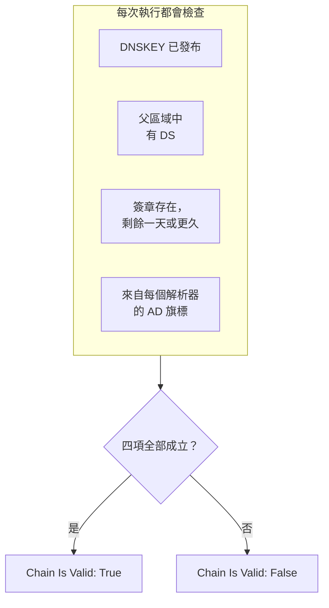

# DNSSEC 監控

DNSSEC 監測器會檢查已簽署的 DNS 區域是否仍能通過驗證：它是否發布了自己的金鑰、父區域是否為它背書、它的簽章是否尚未到期，以及驗證解析器是否接受它。用它在解析器開始為您的網域回傳 `SERVFAIL` 之前，發現斷裂的信任鏈。

:::cards
- [建立監測器](#建立-dnssec-監測器): 在主控台中完成六個步驟。
- [檢查哪些項目](#運作方式): 一條有效信任鏈背後的各項檢查。
- [監測條件](#監測條件): 信任鏈有效性、金鑰、DS 記錄、簽章、解析器和名稱伺服器。
- [最佳實務](#最佳實務): 行之有效的門檻和解析器。
:::

## 運作方式

每次檢查時，探測器會針對該區域執行一組 DNS 查詢：

| 查詢 | 查詢對象 | 能告訴您什麼 |
| --- | --- | --- |
| `DNSKEY` | **解析器** 中的第一個解析器 | 區域是否發布了它的簽署金鑰。 |
| `DS` | **解析器** 中的第一個解析器 | 父區域是否為該區域發布了 delegation signer 記錄。 |
| `SOA`（附帶 DNSSEC 記錄） | **解析器** 中的第一個解析器 | 區域的記錄是否已簽署（為其 `SOA` 記錄簽署的 `RRSIG`），以及最早到期的簽章何時到期。 |
| `A`（附帶 DNSSEC 驗證） | **解析器** 中的每個解析器 | 每個驗證解析器是否接受該區域；解析器以 authenticated data（AD）旗標表明這一點。 |
| `NS`，接著 `SOA` | 第一個解析器，接著是它列出的每個權威名稱伺服器 | 每個名稱伺服器是否提供相同的 SOA 序號。僅在 **檢查名稱伺服器一致性** 開啟時進行。 |

驗證解析器會從根開始由上而下檢查信任鏈，因此 AD 旗標表示整條鏈都成立。以下各項全部成立時，信任鏈才算有效：

剩餘時間不到一天的簽章已被視為失效，因此您最多可以在解析器開始拒絕該區域的一天前得知。如果某次檢查發現信任鏈斷裂或名稱伺服器不同步，它會在一秒後重新執行，最多重試您設定的次數，接著 OneUptime 才以監測器的條件評估結果。一次嘗試中的所有查詢共用一個期限，為 **逾時（ms）** 的三倍；用完時間的嘗試回報的是逾時，而不是對區域的判定。

## 開始之前

- **可以建立監測器的角色**：Project Owner、Project Admin、Project Member、Monitor Admin 或 Monitor Member，或者擁有 Create Monitor 權限的自訂角色。
- **一個已簽署的區域。** 區域必須已簽署，並且已透過您的註冊商在父區域中發布其 DS 記錄。
- **來自探測器的對外 DNS**，送往您列出的解析器；為了檢查名稱伺服器一致性，也要送往該區域的權威名稱伺服器。每個新的監測器都會選取您專案的預設探測器。

## 建立 DNSSEC 監測器

:::steps
### 開始建立新監測器

前往 **監測器**，點選 **建立監測器**。在 **監測器類型** 下點選 **更多監測器類型**，然後在 **DNS Monitoring** 下選擇 **DNSSEC**。

### 命名

輸入 **名稱**，例如 `example.com DNSSEC`，然後點選 **下一步**。

### 輸入區域

在 **區域（網域名稱）** 中輸入要驗證的區域，例如 `example.com`。保留 **解析器** 的預設值，或以逗號分隔列出您自己的解析器。除非您的網路封鎖了送往任意伺服器的 DNS，否則請讓 **檢查名稱伺服器一致性** 保持開啟。

### 測試

點選 **測試監測器**，在 **選擇探測器** 中選擇一個探測器，然後點選 **執行測試**。**監測器測試結果** 會顯示每項檢查的發現。

### 檢視條件

**監測器條件** 從 [預設條件](#預設條件) 開始：信任鏈斷裂時為離線，有效時為上線。若要在簽章到期之前收到警告，請新增一個條件（請參閱 [最佳實務](#最佳實務)），然後點選 **下一步**。

### 選擇探測器並建立

保留或修改 **探測器** 和 **監測間隔**（初始為 **每 5 分鐘**），然後點選 **建立監測器**。監測器頁面隨即開啟。
:::

## 設定選項

| 欄位 | 預設值 | 要填寫的內容 |
| --- | --- | --- |
| **區域（網域名稱）** | 無 | 要驗證的區域，例如 `example.com`。 |
| **解析器** | `1.1.1.1, 8.8.8.8, 9.9.9.9` | 要查詢的驗證解析器，以逗號分隔。每一個都必須回傳 AD 旗標，信任鏈才算有效。 |
| **檢查名稱伺服器一致性** | 開啟 | 直接查詢每個權威名稱伺服器，並比較它們的 SOA 序號。如果您的網路封鎖了送往任意伺服器的對外 DNS，請將其關閉。 |
| **簽章到期警告（天數）**（在 **更多欄位** 下） | `7` | 隨監測器一起儲存。**DNSSEC Signature Expires In Days** 篩選器使用您在條件中給的值，因此請在條件中設定門檻。 |
| **逾時（ms）**（在 **更多欄位** 下） | `10000` | 等待每個 DNS 查詢的時間，單位為毫秒。一次嘗試總共最多可能花上這個值的三倍。 |
| **重試**（在 **更多欄位** 下） | `3` | 第一次嘗試失敗後的重試次數。`0` 表示只嘗試一次。 |

## 監測條件

條件決定區域何時算是上線、效能下降或離線，以及是否因此宣告事件或建立警示。每個條件會檢查一個或多個篩選器：

| 篩選器 | 條件 | 檢查內容 |
| --- | --- | --- |
| **DNSSEC Chain Is Valid** | **是**、**否** | 上述四項檢查全部成立：金鑰已發布、父區域中有 DS、簽章存在且剩餘一天或更久，以及每個解析器都回傳 AD 旗標。 |
| **DNSSEC DNSKEY Record Exists** | **是**、**否** | 區域至少發布了一筆 DNSKEY 記錄。 |
| **DNSSEC DS Record Exists At Parent** | **是**、**否** | 父區域為該區域發布了 DS 記錄。 |
| **DNSSEC Signature Expires In Days** | **Greater Than**、**Less Than**、**Greater Than Or Equal To**、**Less Than Or Equal To** | 距最早到期的簽章（RRSIG）到期還剩的整天數。 |
| **DNSSEC Resolver Consensus (AD Flag)** | **是**、**否** | **解析器** 中的每個解析器都回傳 AD 旗標。 |
| **DNSSEC Nameservers Are Consistent** | **是**、**否** | 每個權威名稱伺服器都以相同的 SOA 序號回應。在 **檢查名稱伺服器一致性** 關閉期間一律為 **是**。 |

有兩個以上的篩選器時，**符合條件** 決定是 **全部** 篩選器都必須符合，還是 **任何** 一個符合即可。條件的 **操作** 決定它做什麼：變更監測器狀態、建立警示、宣告事件，或其中任意幾項。

### 預設條件

新的 DNSSEC 監測器以兩個條件開始：

- **信任鏈斷裂** — **DNSSEC Chain Is Valid** 為 **否**。監測器會被標記為 **離線**，並建立名為「_monitor name_ DNSSEC chain is broken」的事件。信任鏈再次有效時，事件會自行解決。
- **信任鏈有效** — 監測器會被標記為 **運作中**。

條件由上而下檢查，第一個符合的條件決定接下來會發生什麼。沒有任何條件符合時，監測器會顯示其預設狀態：**運作中**，除非您在條件下方的 **更多欄位** 中選擇了其他狀態。

預設條件本身不會留意簽章到期或名稱伺服器一致性。請像下面這樣為它們新增條件。

### 條件範例

| 目標 | 篩選器 | 條件 | 值 |
| --- | --- | --- | --- |
| 信任鏈斷裂時為離線（預設條件之一） | **DNSSEC Chain Is Valid** | **否** | — |
| 在簽章到期之前發出警告 | **DNSSEC Signature Expires In Days** | **Less Than** | `7` |
| 發現遺失了 DS 記錄的委派 | **DNSSEC DS Record Exists At Parent** | **否** | — |
| 發現意見不一致的解析器 | **DNSSEC Resolver Consensus (AD Flag)** | **否** | — |
| 發現不同步的名稱伺服器 | **DNSSEC Nameservers Are Consistent** | **否** | — |

## 最佳實務

1. **選擇隨時都能連到的解析器。** 每個解析器都必須回傳 AD 旗標，信任鏈才算有效，因此探測器連不到的解析器會在重試用完後讓檢查失敗。預設值 `1.1.1.1`、`8.8.8.8` 和 `9.9.9.9` 由三家不同的業者營運，這也能發現在一個解析器上通過驗證、在另一個解析器上卻通不過的區域。
2. **在簽章到期之前收到警告。** 簽署工具會在簽章到期之前重新簽署區域，因此即將到期的簽章代表重新簽署已經停止。新增一個 **DNSSEC Signature Expires In Days** / **Less Than** / `7` 的條件來建立警示，再新增一個值為 `2` 的條件來宣告事件。由於第一個符合的條件會生效，請把兩者都拖到將信任鏈標記為有效的條件上方，並把 `2` 天的條件放在前面。選擇低於簽署工具重新簽署前通常為簽章保留的時間的門檻，這樣在重新簽署正常時它們會保持安靜。
3. **監測每個已簽署的區域。** 包括頂點網域、已簽署的子網域，以及委派給其他業者的任何區域。
4. **讓名稱伺服器一致性檢查保持開啟，** 並為它新增一個條件。它能發現已停止從主要伺服器同步區域傳送的次要伺服器，而單靠 DNSSEC 驗證可能會漏掉這一點。

## 疑難排解

:::details 信任鏈被回報為斷裂，但區域用 `dig` 能通過驗證
**解析器** 中的某個解析器沒有回傳 AD 旗標：探測器連不到它，或者它不驗證 DNSSEC。**監測器測試結果** 和每次檢查摘要中的 **Resolver Checks** 表格會顯示每個解析器的回應和錯誤。移除探測器連不到的解析器，只列出驗證解析器。
:::

:::details 剛做完變更，名稱伺服器就被回報為不一致
區域變更後，次要伺服器可能會在一段時間內落後於主要伺服器。檢查摘要中的 **Nameserver Consistency** 表格會顯示每個名稱伺服器的 SOA 序號。如果某一台一直落後，表示該次要伺服器已停止同步區域傳送。如果每個名稱伺服器都顯示錯誤，探測器可能遭到封鎖、無法直接查詢它們：請關閉 **檢查名稱伺服器一致性**。
:::

:::details 檢查回報逾時
一次嘗試中的所有查詢共用 **逾時（ms）** 的三倍時間。緩慢或連不到的解析器會耗盡這段時間；請將它從 **解析器** 中移除，或調高逾時。
:::

## 後續步驟

:::cards
- [DNS 監控](/docs/monitor/dns-monitor): 檢查名稱能否解析，以及其記錄的內容。
- [網域監控](/docs/monitor/domain-monitor): 留意網域的註冊和到期。
- [SSL 憑證監控](/docs/monitor/ssl-certificate-monitor): 留意該網域上提供的憑證。
- [事件概觀](/docs/incidents/index): 監測器宣告事件之後會發生什麼。
:::
