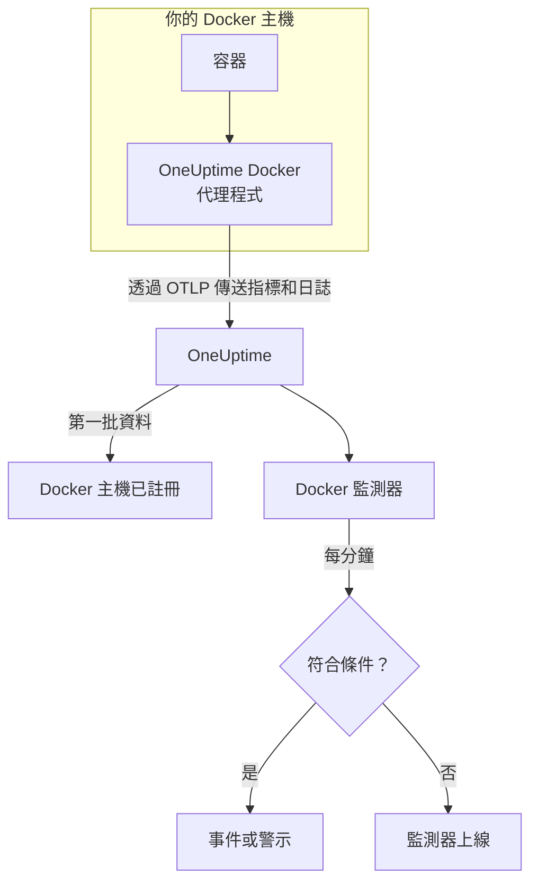

# Docker 監控

Docker 監測器監控一台 Docker 主機上的容器，在容器負載過高、記憶體用盡或陷入當機迴圈時通知你。它讀取 OneUptime Docker 代理程式從主機傳送的指標，因此不會從外部探測任何東西：安裝代理程式，然後依範本或你自己的查詢建立監測器。

:::cards
- [建立監測器](#建立-docker-監測器): 在儀表板中完成六個步驟。
- [範本](#現成的警示範本): 六個現成的警示，每個容器一個事件。
- [指標](#收集的指標): 代理程式收集的內容，以及每個指標的意義。
- [日誌](#收集的日誌): 容器日誌，以及它們需要的日誌驅動程式。
:::

## 運作方式

OneUptime Docker 代理程式以容器形式在主機上執行。它每 30 秒從 Docker Engine API 讀取容器統計資料，追蹤容器的日誌檔，並透過 OTLP 把兩者都傳送到 OneUptime。來自某台主機的第一批資料會把它註冊到 OneUptime。

Docker 監測器綁定到一台主機。它每分鐘對這台主機的容器指標執行查詢，並把結果與條件比較。



## 開始之前

- **安裝 Docker 代理程式**，裝在主機上。[Docker 代理程式指南](/docs/telemetry/docker-host) 說明了安裝、升級和檢查方式。
- **確認主機已註冊。** 第一批資料到達後，它會以代理程式的 `DOCKER_HOST_NAME` 命名，出現在 **產品 → 基礎設施 → Docker → 所有主機** 下。
- **如需容器日誌**，請使用 Docker 的 `json-file` 日誌驅動程式執行容器。請參閱 [日誌驅動程式需求](#日誌驅動程式需求)。

## 建立 Docker 監測器

:::steps
### 開始新的監測器

前往 **監測器** 並按一下 **建立監測器**。

### 選擇 Docker Container

在 **監測器類型** 下按一下 **更多監測器類型**，然後在 **基礎設施** 下選擇 **Docker Container**，或在搜尋方塊中輸入 `docker`。輸入 **名稱**（會用在事件和警示標題中），然後按一下 **下一步**。

### 選擇主機

在 **Docker 監測器設定** 下，從 **Docker主機** 中選擇主機。傳送過資料的每台主機都在清單中。

### 選擇要監控的內容

選擇三個分頁之一：

- **Quick Setup** – 按一下一個 [範本](#現成的警示範本)。它會設定指標、彙總、時間範圍和閾值，並用自己的條件取代下方的條件。你仍然可以變更 **時間範圍**。
- **Custom Metric** – 從 **Docker 指標** 中選擇一個指標，然後設定 **彙總** 和 **時間範圍**。**容器名稱** 和 **容器映像** 可以把範圍縮小到部分容器。
- **進階** – 在 **選擇指標** 下自行建立查詢和公式。使用 **Group by** `resource.container.name` 可以個別評判每個容器。

### 檢查條件

開啟 **監測器條件** 下的每個條件，檢查其 **指標**、**彙總**、**條件** 和 **Threshold**。範本會填好這些內容。使用 **Custom Metric** 或 **進階** 時，監測器會從 [預設條件](#預設條件) 開始，這些條件只會注意到指標降到零，所以請設定你自己的閾值。

### 建立監測器

按一下 **建立監測器**。OneUptime 會開啟監測器的頁面，並每分鐘評估一次。它開啟的事件和警示也會列在主機的 **事件** 和 **警示** 頁面上。
:::

> [!TIP]
> 若要一次設定多個範本，請從 **產品 → 基礎設施 → Docker** 開啟主機，然後前往 **Recommendations**。選擇你需要的範本和要呼叫的人，OneUptime 就會為每個範本建立一個監測器。

## 監測器設定

| 欄位 | 分頁 | 作用 |
| --- | --- | --- |
| **Docker主機** | 全部 | 必填。把每個查詢限定在該主機的 `resource.host.name`。OneUptime 也會在每個查詢加上 `resource.container.runtime = docker`。 |
| **Docker 指標** | Custom Metric | 代理程式目錄中的一個指標，依 CPU、記憶體、網路、區塊 I/O 和容器分組。 |
| **容器名稱** | Custom Metric、進階 | 選用。與 `resource.container.name` 完全相符，例如 `my-container`。 |
| **容器映像** | Custom Metric、進階 | 選用。與 `resource.container.image.name` 完全相符，例如 `nginx:latest`。 |
| **彙總** | Custom Metric | 樣本的合併方式：**平均**、**最大值**、**最小值**、**總和** 或 **計數**。初始值為該指標通常的彙總方式。 |
| **時間範圍** | 全部 | 查詢讀取的滾動視窗，從 **Past 1 Minute** 到 **Past 365 Days**。新監測器從 **Past 1 Minute** 開始；範本會設定自己的值。 |
| **選擇指標** | 進階 | 查詢建立器：**指標**、**Aggregate by**、**Filter by attributes**、**Group by**，以及用來組合查詢的 **新增指標** 和 **新增公式**。 |

## 現成的警示範本

**Quick Setup** 提供六個範本。每個範本都會建立一個完整的監測器：一個依 `resource.container.name` 分組的查詢、一個觸發的條件和一個恢復的條件。每個容器都個別評判，因此一個忙碌的容器不會掩蓋另一個，每個超過閾值的容器都有自己的事件和警示。閾值只是起點，你可以編輯。

除非表格另有說明，條件只有在其視窗的每一分鐘都成立時才會觸發，並在越過閾值 10% 處恢復，這樣在邊界附近徘徊的值就不會來回跳動。

| 範本 | 嚴重程度 | 監控內容 | 觸發時機 | 恢復時機 |
| --- | --- | --- | --- | --- |
| High Container CPU Usage | Warning | `container.cpu.utilization`，依容器取 Max，最近 5 分鐘 | 高於 80（單一核心的 %） | 不高於 72 |
| High Container Memory Usage | Warning | `container.memory.percent`，依容器取 Max，最近 5 分鐘 | 高於 85% | 不高於 76.5% |
| Container Restart Loop | 嚴重 | 每個容器 `container.restarts` 的成長，最近 15 分鐘 | 視窗內重新啟動超過 3 次（總和） | 2.7 或更少 |
| Container CPU Throttling | Warning | 每個容器 `container.cpu.throttling_data.throttled_time` 的成長（ms），最近 5 分鐘 | 視窗內超過 1000 ms（總和） | 900 ms 或更少 |
| High Container Process Count | Warning | `container.pids.count`，依容器取 Max，最近 5 分鐘 | 高於 2000 | 不高於 1800 |
| Container Down (Low Uptime) | 嚴重 | `container.uptime`，依容器取 Min，最近 1 分鐘 | 等於 0 | 高於 0 |

**嚴重程度** 是選擇清單中顯示的標籤。範本建立的事件和警示會從專案中最嚴重的事件和警示嚴重程度開始；請在條件中變更它們。

> [!NOTE]
> `container.cpu.utilization` 就是 `docker stats` 輸出的數字：100% 是一個完整的 CPU 核心，而不是整台主機，所以使用兩個核心的容器讀數為 200。在多核心主機上，80 這個閾值是 CPU 預算，而不是機器的占比。

> [!NOTE]
> `container.memory.percent` 在容器設有記憶體限制時除以該限制，否則除以**主機**的總記憶體。在把超限視為即將發生的記憶體不足終止之前，請先檢查容器是否以 `--memory` 啟動。

> [!WARNING]
> `container.restarts` 和 `container.cpu.throttling_data.throttled_time` 只會成長，所以這兩個範本會依它們在視窗內成長了多少發出警示：每分鐘一個 Maximum 查詢和一個 Minimum 查詢，由公式相減後加總。依代理程式每 30 秒一次的擷取，這只能看到大約一半的實際活動，閾值已經考量到這一點。如果把代理程式的 `collection_interval` 調到 60 秒以上，每分鐘只會有一個樣本，兩個範本都會停止發出警示。

> [!CAUTION]
> **Container Down (Low Uptime)** 範本無法捕捉停止後一直保持停止的容器。代理程式只回報正在執行的容器，所以停止的容器完全不會傳送資料，其運行時間也永遠不會讀數為 0。對於必須持續運作的服務，也要監控它提供的功能，例如使用 [API 監控](/docs/monitor/api-monitor)。

## 收集的指標

代理程式每 30 秒對 Docker 通訊端使用 OpenTelemetry `docker_stats` 接收器。每個容器的指標都會把它的身分當作資源屬性攜帶：`resource.container.name`、`resource.container.image.name`、`resource.container.id`、`resource.container.runtime`（`docker`）和 `resource.host.name`。

### CPU

| 指標 | 說明 |
| --- | --- |
| `container.cpu.utilization` | CPU 使用率，100% 表示一個完整的 CPU 核心（即 `docker stats` 的 CPU% 欄）。 |
| `container.cpu.usage.total` | 容器啟動以來使用的 CPU 時間，單位為奈秒。生命週期計數器。 |
| `container.cpu.throttling_data.throttled_time` | 容器啟動以來被其 CPU 限制節流的奈秒數。生命週期計數器。 |
| `container.cpu.throttling_data.throttled_periods` | 容器啟動以來的節流週期數。生命週期計數器。 |

### 記憶體

| 指標 | 說明 |
| --- | --- |
| `container.memory.usage.total` | 使用中的記憶體，單位為位元組。 |
| `container.memory.usage.limit` | 記憶體限制，單位為位元組。 |
| `container.memory.percent` | 記憶體使用量占容器限制的百分比；容器沒有限制時，占主機總記憶體的百分比。 |

### 網路

| 指標 | 說明 |
| --- | --- |
| `container.network.io.usage.rx_bytes` | 接收的位元組數。生命週期計數器。 |
| `container.network.io.usage.tx_bytes` | 傳送的位元組數。生命週期計數器。 |

### 區塊 I/O

| 指標 | 說明 |
| --- | --- |
| `container.blockio.io_service_bytes_recursive.read` | 從區塊裝置讀取的位元組數。 |
| `container.blockio.io_service_bytes_recursive.write` | 寫入區塊裝置的位元組數。 |

### 容器

| 指標 | 說明 |
| --- | --- |
| `container.uptime` | 容器啟動以來的秒數。只有正在執行的容器會回報它。 |
| `container.restarts` | 容器自建立以來重新啟動的次數。生命週期計數器。 |
| `container.pids.count` | 容器中的工作數。cgroup 的 pids 控制器同時計算處理程序和執行緒。 |

**Docker 指標** 清單也提供 `container.cpu.usage.percpu`、`container.memory.rss`、`container.memory.cache` 和網路封包計數器。隨附的代理程式設定不會開啟它們，所以在使用之前請先查看主機的 **指標** 頁面。`container.cpu.throttling_data.throttled_periods` 不在清單中；請從 **進階** 查詢它。

## 監控條件

條件會把監測器的某個查詢或公式與閾值比較。Docker 監測器的條件沒有 **篩選器類型**：每條規則都以下列欄位檢查指標值。

| 欄位 | 作用 |
| --- | --- |
| **指標** | 要檢查的查詢或公式，以其變數名稱指定。 |
| **彙總** | 視窗中的值如何變成一個結果：**平均**、**總和**、**Maximum Value**、**Minimum Value**、**All Values**（每個值都必須符合）或 **Any Value**（一個就夠）。 |
| **條件** | **Greater Than**、**Less Than**、**Greater Than Or Equal To**、**Less Than Or Equal To** 或 **Equal To**，或是異常條件：**Anomalously High**、**Anomalously Low** 或 **Anomalous**。 |
| **Threshold** | 用來比較的值。如果指標有單位，旁邊會有單位清單。異常條件下不會顯示。 |
| **敏感度** | 僅限異常條件。**低**（4σ）、**中**（3σ，預設）或 **高**（2σ）。 |
| **基準視窗** | 僅限異常條件。14 天（預設）、28、60 或 90 天的歷史。 |
| **如果沒有資料** | 位於 **更多欄位** 下。視窗中沒有樣本時的處理方式：**Ignore**（預設）、**Treat As Zero** 或 **觸發器**。 |

異常條件會把每個值與基準中一週的同一小時比較。在基準視窗累積足夠的歷史之前，它們會停留在「Learning」狀態，不產生任何結果。

每個條件也會說明符合時要做什麼：變更監測器狀態、建立警示或宣告事件。條件會由上而下檢查，第一個符合的條件決定結果。

### 預設條件

不是從範本建立的監測器會以兩個條件開始：

| 順序 | 條件 | 符合時機 | 結果 |
| --- | --- | --- | --- |
| 1 | Check if _monitor name_ is offline | 第一個查詢的任一值為 `0` | 將監測器標記為 **離線**，並宣告事件「_monitor name_ is offline」，監測器恢復後該事件會自動解決。 |
| 2 | Check if _monitor name_ is online | 任一值大於 `0` | 將監測器標記為 **運作中**。 |

> [!IMPORTANT]
> 靜默不會符合任何一個條件：停止傳送資料的主機會讓監測器維持原狀。若要在資料停止時收到通知，請在某個條件上把 **如果沒有資料** 設為 **觸發器**。OneUptime 本身未接收資料的時間永遠不算是沒有資料：視窗中包含這類時間的檢查會改為等待，詳見 [OneUptime 未接收資料時](/docs/monitor/when-oneuptime-is-not-receiving)。

## 收集的日誌

代理程式也會追蹤每個容器的 `*-json.log` 檔，並把每一行當作 OpenTelemetry 日誌記錄傳送，包含：

| 欄位 | 值 |
| --- | --- |
| `resource.host.name` | 主機，來自 `DOCKER_HOST_NAME`。 |
| `resource.container.id` | 完整的容器 ID。 |
| `resource.container.runtime` | 一律為 `docker`。 |
| `attributes["log.iostream"]` | `stdout` 或 `stderr`。 |
| `severityText` / `severityNumber` | 如果行中有層級，就從層級關鍵字讀取（`[ERROR]`、`app.INFO:`、`{"level":"warn"}`、`level=error`）。沒有層級的行會依其串流決定：`stderr` 為 `ERROR`，`stdout` 為 `INFO`。 |
| `body` | 容器寫入的那一行。以空白或右括號開頭的行（例如堆疊追蹤的框架）會接到上一行。 |
| `time` | Docker 常駐程式為該行記錄的時間戳記。 |

日誌會顯示在主機的 **日誌** 頁面和每個容器的頁面上。

### 日誌驅動程式需求

代理程式只能讀取使用 Docker `json-file` 日誌驅動程式的容器日誌。這是 Docker 的預設值，但某個容器或整個常駐程式可能使用其他驅動程式：

| 驅動程式 | 代理程式看到的內容 |
| --- | --- |
| `json-file` | 每一行。 |
| `local` | 什麼都看不到：檔案是二進位的，代理程式無法解析。 |
| `journald`、`syslog`、`fluentd`、`gelf`、`awslogs`、`splunk`、… | 什麼都看不到：日誌送到別處，沒有可追蹤的檔案。 |
| `none` | 什麼都看不到：日誌被捨棄。 |

檢查容器的驅動程式，以及常駐程式的預設值：

```bash
docker inspect <container> --format '{{.HostConfig.LogConfig.Type}}'
docker info --format '{{.LoggingDriver}}'
```

切換到 `json-file`。Docker 會在建立容器時決定其日誌驅動程式，所以變更後要重新建立每個容器，重新啟動會保留舊的驅動程式。

:::tabs
@tab Docker Compose
為每個服務設定驅動程式，並開啟輪替：

```yaml title="docker-compose.yml"
services:
  my-app:
    image: my-app:latest
    logging:
      driver: "json-file"
      options:
        max-size: "100m"
        max-file: "5"
```

然後重新建立服務：

```bash
docker compose up -d --force-recreate <service>
```
@tab Docker 常駐程式
讓 `json-file` 成為之後建立的每個容器的預設值：

```json title="/etc/docker/daemon.json"
{
  "log-driver": "json-file",
  "log-opts": {
    "max-size": "100m",
    "max-file": "5"
  }
}
```

重新啟動 Docker 常駐程式，然後刪除並重新建立每個容器：

```bash
docker rm -f <container>
docker run ... <image>
```
:::

## 疑難排解

:::details 主機不在 Docker主機 清單中
主機會依據代理程式的資料自動註冊。請檢查代理程式容器是否正在執行，以及主機是否列在 **產品 → 基礎設施 → Docker → 所有主機** 下。[Docker 代理程式指南](/docs/telemetry/docker-host) 中有需要在主機上執行的檢查。
:::

:::details 指標有到達，但日誌頁面是空的
這些容器幾乎可以確定沒有使用 `json-file` 日誌驅動程式。請用 [日誌驅動程式需求](#日誌驅動程式需求) 中的指令檢查它們，切換你需要其日誌的容器，然後重新建立它們。
:::

:::details 代理程式記錄「no files match the configured criteria」
代理程式尋找 `/var/lib/docker/containers/*/*-json.log`，但什麼都沒找到。可能的原因是：主機上沒有容器使用 `json-file`；代理程式的 `/var/lib/docker/containers` 掛接（`-v /var/lib/docker/containers:/var/lib/docker/containers:ro`）遺漏或是空的；或者代理程式在 macOS 版 Docker Desktop 上執行，其容器檔案位於它的 Linux 虛擬機器內。
:::

:::details 資料以錯誤的主機名稱到達
OneUptime 以 `resource.host.name` 識別主機，代理程式從 `DOCKER_HOST_NAME` 取得它。在第一批資料之後變更 `DOCKER_HOST_NAME`，會建立第二台主機而不是重新命名第一台，而且監測器仍綁定在建立時使用的名稱。
:::

:::details CPU 警示從不觸發
像 **High Container CPU Usage** 範本一樣，依 `resource.container.name` 將查詢分組，並以 **最大值** 彙總。在忙碌的主機上對所有容器取平均值，會被閒置的容器拉低。請記得 100% 表示一個完整的核心，所以允許使用多個核心的容器需要更高的閾值。
:::

:::details 重新啟動迴圈或節流範本不再發出警示
兩者都量測計數器在同一分鐘內兩個樣本之間成長了多少。如果代理程式的 `collection_interval` 為 60 秒以上，每分鐘只會有一個樣本，成長永遠是 0，兩個範本都不會觸發。請保留代理程式的預設值 30 秒。
:::

## 後續步驟

:::cards
- [Docker 代理程式](/docs/telemetry/docker-host): 安裝、升級本監測器讀取的代理程式並排解其問題。
- [Podman 監控](/docs/monitor/podman-monitor): 適用於 Podman 主機的同類監測器。
- [Docker Swarm 監控](/docs/monitor/docker-swarm-monitor): 監控 Swarm 叢集的任務。
- [事件概觀](/docs/incidents/index): 條件宣告事件之後會發生什麼事。
:::
