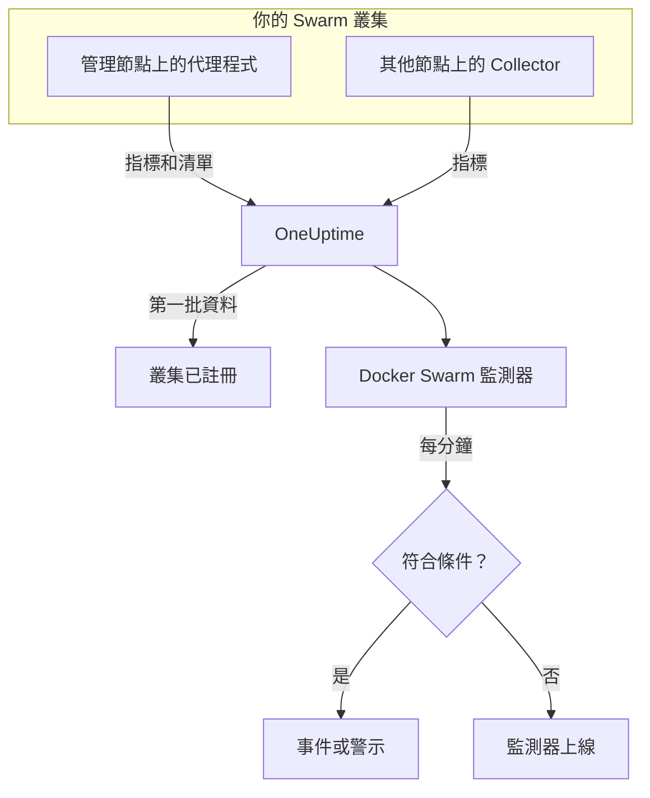

# Docker Swarm 監控

Docker Swarm 監測器監控 Swarm 叢集中服務任務背後的容器，在任務重新啟動、負載過高或記憶體用盡時通知你。它讀取 OneUptime Docker Swarm 代理程式傳送的容器指標，因此不會從外部探測任何東西：安裝代理程式，然後依範本或你自己的查詢建立監測器。

:::cards
- [建立監測器](#建立-docker-swarm-監測器): 在儀表板中完成六個步驟。
- [範本](#現成的警示範本): 四個現成的警示，每個任務一個事件。
- [指標](#收集的指標): 可用於警示的容器指標。
- [篩選器](#監測器設定): 把監測器限定到某個服務、任務或映像。
:::

## 運作方式

OneUptime Docker Swarm 代理程式在一個管理節點上執行。它的 Collector 每 30 秒從該節點的 Docker 常駐程式讀取容器統計資料，並替每批資料加上叢集名稱 `docker.swarm.cluster.name`。旁邊一個小型清單輪詢器每 5 分鐘從 Swarm API 讀取叢集的節點、服務和任務。第一批資料會把叢集註冊到 OneUptime。

Collector 只看得到它所在節點上的容器。若要取得每個節點的指標，請在每個節點上以相同的 `DOCKER_SWARM_CLUSTER_NAME` 執行 Collector。

Docker Swarm 監測器綁定到一個叢集。它每分鐘對這個叢集的容器指標執行查詢，並把結果與條件比較。

## 開始之前

- **安裝 Docker Swarm 代理程式**，裝在管理節點上。[Docker Swarm 代理程式指南](/docs/telemetry/docker-swarm) 說明了安裝和升級，以及如何在其他節點上執行 Collector。
- **確認叢集已註冊。** 第一批資料到達後，它會以代理程式的 `DOCKER_SWARM_CLUSTER_NAME` 命名，出現在 **產品 → 基礎設施 → Docker Swarm → 所有叢集** 下。

## 建立 Docker Swarm 監測器

:::steps
### 開始新的監測器

前往 **監測器** 並按一下 **建立監測器**。

### 選擇 Docker Swarm

在 **監測器類型** 下按一下 **更多監測器類型**，然後在 **基礎設施** 下選擇 **Docker Swarm**，或在搜尋方塊中輸入 `swarm`。輸入 **名稱**（會用在事件和警示標題中），然後按一下 **下一步**。

### 選擇叢集

在 **Docker Swarm Monitor Configuration** 下，從 **Docker Swarm Cluster** 中選擇叢集。傳送過資料的每個叢集都在清單中。

### 選擇要監控的內容

選擇三個分頁之一：

- **Quick Setup** – 按一下一個 [範本](#現成的警示範本)。它會設定指標、彙總、時間範圍和閾值，並用自己的條件取代下方的條件。你仍然可以變更 **時間範圍**。
- **Custom Metric** – 從 **Docker Swarm Metric** 中選擇一個指標，然後設定 **彙總** 和 **時間範圍**。[篩選器](#監測器設定) 可以把範圍縮小到部分任務。
- **進階** – 在 **選擇指標** 下自行建立查詢和公式。使用 **Group by** `resource.container.name` 可以個別評判每個任務。

### 檢查條件

開啟 **監測器條件** 下的每個條件，檢查其 **指標**、**彙總**、**條件** 和 **Threshold**。範本會填好這些內容。使用 **Custom Metric** 或 **進階** 時，監測器會從 [預設條件](#預設條件) 開始，這些條件只會注意到指標降到零，所以請設定你自己的閾值。

### 建立監測器

按一下 **建立監測器**。OneUptime 會開啟監測器的頁面，並每分鐘評估一次。它開啟的事件和警示也會列在叢集的 **事件** 和 **警示** 頁面上。
:::

> [!TIP]
> 若要一次設定多個範本，請從 **產品 → 基礎設施 → Docker Swarm** 開啟叢集，然後前往 **Recommendations**。選擇你需要的範本和要呼叫的人，OneUptime 就會為每個範本建立一個監測器。

## 監測器設定

| 欄位 | 分頁 | 作用 |
| --- | --- | --- |
| **Docker Swarm Cluster** | 全部 | 必填。把每個查詢限定在 `resource.docker.swarm.cluster.name`。這是代理程式加上的唯一資源屬性，所以監測器不會加上 `container.runtime` 或 `host.name` 篩選器。 |
| **服務名稱** | Custom Metric、進階 | 選用。與 `docker.swarm.service.name` 完全相符，例如 `web`。 |
| **節點名稱** | Custom Metric、進階 | 選用。與 `docker.swarm.node.name` 完全相符，例如 `swarm-node-1`。 |
| **容器名稱** | Custom Metric、進階 | 選用。與 `resource.container.name` 完全相符。任務的容器命名為 `<service>.<slot>.<taskid>`，例如 `web.1.abc123`。 |
| **容器映像** | Custom Metric、進階 | 選用。與 `resource.container.image.name` 完全相符，例如 `nginx:latest`。 |
| **Docker Swarm Metric** | Custom Metric | [目錄](#收集的指標) 中的一個指標。 |
| **彙總** | Custom Metric | 樣本的合併方式：**平均**、**最大值**、**最小值**、**總和** 或 **計數**。初始值為該指標通常的彙總方式。 |
| **時間範圍** | 全部 | 查詢讀取的滾動視窗，從 **Past 1 Minute** 到 **Past 365 Days**。新監測器從 **Past 1 Minute** 開始；範本會設定自己的值。 |
| **選擇指標** | 進階 | 查詢建立器：**指標**、**Aggregate by**、**Filter by attributes**、**Group by**，以及用來組合查詢的 **新增指標** 和 **新增公式**。 |

> [!WARNING]
> 隨附的代理程式目前還不會設定 `docker.swarm.service.name` 或 `docker.swarm.node.name`，所以填寫了 **服務名稱** 或 **節點名稱** 的監測器找不到資料。請改為依 **容器映像** 縮小範圍，或依 `resource.container.name` 分組。

## 現成的警示範本

**Quick Setup** 提供四個範本。每個範本都會建立一個完整的監測器：一個依 `resource.container.name` 分組的查詢、一個觸發的條件和一個恢復的條件。每個任務都個別評判，並有自己的事件和警示，其根本原因會列出受影響的任務及其值。閾值只是起點，你可以編輯。

除非表格另有說明，條件只有在其視窗的每一分鐘都成立時才會觸發，並在越過閾值 10% 處恢復，這樣在邊界附近徘徊的值就不會來回跳動。

| 範本 | 嚴重程度 | 監控內容 | 觸發時機 | 恢復時機 |
| --- | --- | --- | --- | --- |
| Task Down (Low Uptime) | 嚴重 | `container.uptime`，依任務取 Min，最近 1 分鐘 | 任一值低於 60 秒 | 每個值都不低於 66 秒 |
| High Task CPU Usage | Warning | `container.cpu.utilization`，依任務取 Avg，最近 5 分鐘 | 高於 80（單一核心的 %） | 不高於 72 |
| High Task Memory Usage | Warning | `container.memory.percent`，依任務取 Avg，最近 5 分鐘 | 高於 85% | 不高於 76.5% |
| High Task Process Count | Warning | `container.pids.count`，依任務取 Max，最近 5 分鐘 | 高於 500 | 不高於 450 |

**嚴重程度** 是選擇清單中顯示的標籤。範本建立的事件和警示會從專案中最嚴重的事件和警示嚴重程度開始；請在條件中變更它們。

> [!NOTE]
> **Task Down (Low Uptime)** 範本只要有一個「年輕」的樣本就會觸發，因為重新啟動是一個事件，而不是一個水準。Swarm 會給替代任務一個新容器，也就是一個新序列，所以範本尋找的是運行時間不到一分鐘，而不是 0。部署或擴充也會觸發它，當新任務的運行時間超過一分鐘後就會清除。終止後沒有被取代的任務不會傳送任何資料，因此無法被捕捉。

## 收集的指標

代理程式的 Collector 使用 OpenTelemetry `docker_stats` 接收器，所以這些指標就是標準的容器指標，每個任務容器一個序列。沒有 `docker_swarm_*` 指標：節點、服務和任務以清單的形式追蹤，顯示在叢集的 **服務**、**任務**、**節點** 及相關頁面上。

### CPU

| 指標 | 單位 | 說明 |
| --- | --- | --- |
| `container.cpu.utilization` | % | 任務容器的 CPU 使用率，100% 表示一個完整的 CPU 核心。 |

### 記憶體

| 指標 | 單位 | 說明 |
| --- | --- | --- |
| `container.memory.usage.total` | 位元組 | 任務容器使用的記憶體。 |
| `container.memory.percent` | % | 已用記憶體占容器限制的百分比；服務沒有設定限制時，占節點總記憶體的百分比。 |

### 網路

| 指標 | 單位 | 說明 |
| --- | --- | --- |
| `container.network.io.usage.rx_bytes` | 位元組 | 任務容器接收的位元組數。生命週期計數器。 |
| `container.network.io.usage.tx_bytes` | 位元組 | 任務容器傳送的位元組數。生命週期計數器。 |

### 容器

| 指標 | 單位 | 說明 |
| --- | --- | --- |
| `container.pids.count` | 計數 | 任務容器內的處理程序。突然上升可能代表 fork 炸彈或洩漏。 |
| `container.uptime` | 秒 | 任務容器已執行的時間。被重新排程或重新啟動的任務會從 0 開始一個新容器。 |

每個序列都會把容器的身分當作資源屬性攜帶：`resource.container.name`（`<service>.<slot>.<taskid>`）、`resource.container.image.name` 和 `resource.docker.swarm.cluster.name`。

## 監控條件

條件會把監測器的某個查詢或公式與閾值比較。Docker Swarm 監測器的條件沒有 **篩選器類型**：每條規則都以下列欄位檢查指標值。

| 欄位 | 作用 |
| --- | --- |
| **指標** | 要檢查的查詢或公式，以其變數名稱指定。 |
| **彙總** | 視窗中的值如何變成一個結果：**平均**、**總和**、**Maximum Value**、**Minimum Value**、**All Values**（每個值都必須符合）或 **Any Value**（一個就夠）。 |
| **條件** | **Greater Than**、**Less Than**、**Greater Than Or Equal To**、**Less Than Or Equal To** 或 **Equal To**，或是異常條件：**Anomalously High**、**Anomalously Low** 或 **Anomalous**。 |
| **Threshold** | 用來比較的值。如果指標有單位，旁邊會有單位清單。異常條件下不會顯示。 |
| **敏感度** | 僅限異常條件。**低**（4σ）、**中**（3σ，預設）或 **高**（2σ）。 |
| **基準視窗** | 僅限異常條件。14 天（預設）、28、60 或 90 天的歷史。 |
| **如果沒有資料** | 位於 **更多欄位** 下。視窗中沒有樣本時的處理方式：**Ignore**（預設）、**Treat As Zero** 或 **觸發器**。 |

異常條件會把每個值與基準中一週的同一小時比較。在基準視窗累積足夠的歷史之前，它們會停留在「Learning」狀態，不產生任何結果。

每個條件也會說明符合時要做什麼：變更監測器狀態、建立警示或宣告事件。條件會由上而下檢查，第一個符合的條件決定結果。

### 預設條件

不是從範本建立的監測器會以兩個條件開始：

| 順序 | 條件 | 符合時機 | 結果 |
| --- | --- | --- | --- |
| 1 | Check if _monitor name_ is offline | 第一個查詢的任一值為 `0` | 將監測器標記為 **離線**，並宣告事件「_monitor name_ is offline」，監測器恢復後該事件會自動解決。 |
| 2 | Check if _monitor name_ is online | 任一值大於 `0` | 將監測器標記為 **運作中**。 |

> [!IMPORTANT]
> 靜默不會符合任何一個條件：停止傳送資料的叢集會讓監測器維持原狀。若要在資料停止時收到通知，請在某個條件上把 **如果沒有資料** 設為 **觸發器**。OneUptime 本身未接收資料的時間永遠不算是沒有資料：視窗中包含這類時間的檢查會改為等待，詳見 [OneUptime 未接收資料時](/docs/monitor/when-oneuptime-is-not-receiving)。

## 疑難排解

:::details 叢集不在 Docker Swarm Cluster 清單中
叢集會依據代理程式的資料自動註冊。請檢查代理程式是否在管理節點上執行、是否設定了 `DOCKER_SWARM_CLUSTER_NAME`，以及叢集是否列在 **產品 → 基礎設施 → Docker Swarm → 所有叢集** 下。[Docker Swarm 代理程式指南](/docs/telemetry/docker-swarm) 中有需要在節點上執行的檢查。
:::

:::details 只有部分任務有指標
Collector 讀取的是它所在節點的 Docker 常駐程式，所以只看得到該節點上的任務。請在每個節點上以相同的 `DOCKER_SWARM_CLUSTER_NAME` 執行 Collector。
:::

:::details 依服務或節點篩選的監測器找不到資料
**服務名稱** 和 **節點名稱** 比對的是 `docker.swarm.service.name` 和 `docker.swarm.node.name`，而隨附的代理程式不會設定它們。請清除這兩項並依 **容器映像** 縮小範圍，或依 `resource.container.name` 分組。
:::

:::details 所有任務都顯示為一個序列
像範本一樣，依資源屬性 `resource.container.name` 分組。不帶前綴的 `container.name` 什麼都比對不到，所以所有任務會合併成一個名稱空白的序列。
:::

## 後續步驟

:::cards
- [Docker Swarm 代理程式](/docs/telemetry/docker-swarm): 安裝和升級本監測器讀取的代理程式。
- [Docker 監控](/docs/monitor/docker-monitor): 監控單一 Docker 主機的容器。
- [事件概觀](/docs/incidents/index): 條件宣告事件之後會發生什麼事。
- [待命排程](/docs/on-call/schedules): 決定任務出問題時要呼叫誰。
:::
