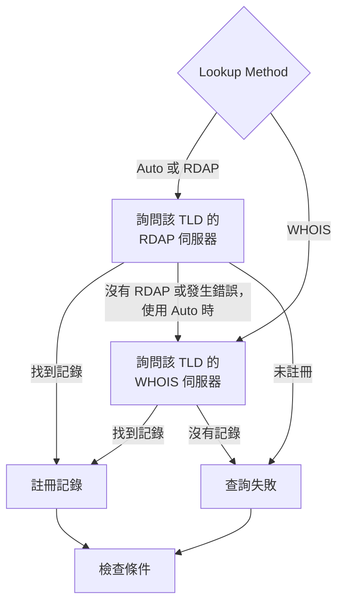

# 網域監控

網域監測器會依排程讀取您網域的註冊記錄，追蹤其到期日、註冊商、名稱伺服器和狀態碼，並在網域到期之前提醒您。請為您的網站、API 和電子郵件所依賴的每個網域使用它：註冊一旦到期，它們會同時全部中斷。

:::cards
- [建立監測器](#建立網域監測器): 在主控台中完成六個步驟。
- [查詢方式](#查詢方式): RDAP、WHOIS，以及為什麼預設使用 **Auto**。
- [預設條件](#預設條件): 不需設定，提前 30 天發出到期警告。
- [疑難排解](#疑難排解): 已停用的 WHOIS 伺服器、Proxy 和缺少的日期。
:::

## 運作方式

每次檢查時，探測器會依 **Lookup Method** 透過 RDAP 或 WHOIS 查詢網域的註冊記錄，並將查到的內容正規化：到期日、註冊商、名稱伺服器和狀態碼。查詢失敗時會重試，最多重試您設定的次數。接著 OneUptime 會以監測器的條件評估該記錄。

如果查詢無法取得註冊資料（因為該 TLD 的服務已停用，或網域未註冊），監測器會被回報為 **離線**，並在監測器的探測器回應中顯示原因，而不是帶著空白的到期日被回報為正常。回答「此網域可供註冊」的註冊管理機構（例如 DENIC 的 `Status: free`）會被視為 **未註冊**，而不是正常的記錄。

國際化網域名稱兩種形式都接受：`münchen.de` 在查詢前會被轉換為其 A 標籤（`xn--mnchen-3ya.de`）。

## 開始之前

- **可以建立監測器的角色**：Project Owner、Project Admin、Project Member、Monitor Admin 或 Monitor Member，或者擁有 Create Monitor 權限的自訂角色。
- **探測器到註冊管理機構的對外存取。** 每個新的監測器都會選取您專案的預設探測器；[自訂探測器](/docs/probe/custom-probe) 需要能夠連到：

| 目的地 | 通訊協定 | 用途 |
| --- | --- | --- |
| `https://data.iana.org/rdap/dns.json` | HTTPS，連接埠 443 | IANA 的 RDAP 引導登錄表，說明每個 TLD 的 RDAP 伺服器在哪裡。取得一次並快取 24 小時。 |
| 各註冊管理機構的 RDAP 伺服器 | HTTPS，連接埠 443 | RDAP 查詢。 |
| WHOIS 伺服器 | TCP 連接埠 43 | WHOIS 查詢。 |

RDAP 請求會遵循探測器的 `HTTP_PROXY_URL` / `HTTPS_PROXY_URL` / `NO_PROXY` 設定。WHOIS 透過原始通訊端執行，不會遵循這些設定。如果探測器連不到 `data.iana.org`，**Auto** 會改用 WHOIS，並在五分鐘後再次嘗試 IANA。

## 建立網域監測器

:::steps
### 開始建立新監測器

前往 **監測器**，點選 **建立監測器**。在 **監測器類型** 下點選 **更多監測器類型**，然後在 **Basic Monitoring** 下選擇 **網域**。

### 命名

輸入 **名稱**，例如 `example.com registration`，然後點選 **下一步**。

### 輸入網域

輸入 **網域名稱**，例如 `example.com`。除非有理由，否則請讓 **Lookup Method** 保持為 **Auto**（請參閱 [查詢方式](#查詢方式)）。

### 測試

點選 **測試監測器**，在 **選擇探測器** 中選擇一個探測器，然後點選 **執行測試**。**監測器測試結果** 會顯示探測器讀取的註冊記錄，以及是 RDAP 還是 WHOIS 做出了回應。

### 檢視條件

**監測器條件** 從 [預設條件](#預設條件) 開始：註冊已到期或無法讀取時為離線，30 天內到期時發出警示。如有需要可修改，然後點選 **下一步**。

### 選擇探測器並建立

保留或修改 **探測器** 和 **監測間隔**（初始為 **每 5 分鐘**），然後點選 **建立監測器**。監測器頁面隨即開啟。
:::

## 設定選項

| 欄位 | 預設值 | 要填寫的內容 |
| --- | --- | --- |
| **網域名稱** | 無 | 已註冊的網域，例如 `example.com`。貼上的位址也可以：`https://example.com/pricing` 會被讀作 `example.com`。 |
| **Lookup Method** | **Auto** | **Auto**、**RDAP** 或 **WHOIS**。請參閱 [查詢方式](#查詢方式)。 |
| **逾時（ms）**（在 **更多欄位** 下） | `10000` | 等待每次註冊查詢的時間，單位為毫秒。 |
| **重試**（在 **更多欄位** 下） | `3` | 第一次嘗試失敗後的重試次數。`0` 表示只嘗試一次。 |

每次失敗的查詢都會重試，兩次嘗試之間暫停一秒。即使註冊管理機構回答網域未註冊，或它沒有註冊服務，也會重試，以防這個回答只是一次暫時性故障。只有格式錯誤的網域名稱會立即回報，不進行查詢。

逾時適用於每個請求，而不是整個檢查：一次先嘗試 RDAP、再改用 WHOIS 的 **Auto** 檢查，花費的時間可能是兩倍甚至更久。

### 查詢方式

註冊資料可以透過兩種通訊協定讀取，哪一種可用取決於 TLD。

| 方式 | 行為 |
| --- | --- |
| **Auto** | 預設。TLD 發布了 RDAP 服務時使用 RDAP；沒有發布，或 RDAP 查詢失敗時，改用 WHOIS。 |
| **RDAP** | 只使用 RDAP。如果 TLD 沒有發布 RDAP 服務，會以明確的錯誤失敗。 |
| **WHOIS** | 只使用 WHOIS。 |

**RDAP**（[RFC 9083](https://www.rfc-editor.org/rfc/rfc9083)）是 ICANN 規定的 WHOIS 替代方案。每個 TLD 的權威伺服器透過 [IANA 的引導登錄表](https://www.rfc-editor.org/rfc/rfc9224) 尋找，因此在註冊管理機構遷移時也能保持正確。每個 gTLD 都會發布一個。當 TLD 的 RDAP 伺服器表示網域未註冊時，**Auto** 會把它當成答案，不會再詢問 WHOIS。

**WHOIS** 沒有對應的探索機制——用戶端隨附一張從 TLD 到 WHOIS 主機的固定對照表，而這些表會過時。Identity Digital 的每個 TLD（`.digital`、`.email`、`.life`、`.today`、`.zone` 以及另外約 290 個）仍對應到一台已停用的主機，該主機現在對每個查詢都只回傳字面文字 `TLD is not supported.`，而不是記錄。對於許多完全不發布 RDAP 服務的 ccTLD（例如 `.io`、`.co`、`.de`、`.ch` 和 `.jp`），WHOIS 仍是唯一的選擇。

## 監測條件

條件決定網域何時算是正常或有問題，以及是否因此宣告事件或建立警示。每個條件會檢查一個或多個篩選器：

| 篩選器 | 條件 | 檢查內容 |
| --- | --- | --- |
| **Is Online** | **是**、**否** | 註冊查詢本身是否成功。 |
| **Is Request Timeout** | **是**、**否** | 查詢是否在每次嘗試中都逾時。 |
| **Domain Expires In Days** | **Greater Than**、**Less Than**、**Greater Than Or Equal To**、**Less Than Or Equal To** | 距註冊到期的天數，無條件進位到整天。 |
| **Domain Is Expired** | **是**、**否** | 到期日是否已過。 |
| **Domain Registrar** | **包含**、**Not Contains**、**Starts With**、**Ends With**、**Equal To**、**Not Equal To** | 註冊商的名稱。 |
| **Domain Name Server** | **包含**、**Not Contains**、**Starts With**、**Ends With**、**Equal To**、**Not Equal To** | 網域的名稱伺服器。只要其中任何一個符合即符合。 |
| **Domain Status Code** | **包含**、**Not Contains**、**Starts With**、**Ends With**、**Equal To**、**Not Equal To** | 網域的 EPP 狀態碼。只要其中任何一個符合即符合。 |

無論是哪種通訊協定回應，狀態碼都會正規化為它們的 EPP 名稱（`clientTransferProhibited`），因此當 **Auto** 在 RDAP 和 WHOIS 之間切換時，條件仍能持續符合。註冊商的 _名稱_ 取決於回應服務發布的內容，在兩種通訊協定之間可能略有不同，因此對於 **Domain Registrar** 條件，請優先使用 **包含** 而不是 **Equal To**。

日期會正規化為 ISO 8601。註冊管理機構以無法解析的格式發布的日期會被省略而不是儲存，這樣到期條件就無法判斷、也不會符合，而不是一直默默地回答「未到期」。

有兩個以上的篩選器時，**符合條件** 決定是 **全部** 篩選器都必須符合，還是 **任何** 一個符合即可。條件的 **操作** 決定它做什麼：變更監測器狀態、建立警示、宣告事件，或其中任意幾項。

### 預設條件

新的網域監測器以三個條件開始，因此不需任何設定就能在註冊到期之前提醒您：

1. **網域檢查失敗** — 註冊已到期，或無法讀取其註冊資料。監測器會被標記為 **離線**，並建立名為「_monitor name_ domain check failed」的事件。註冊再次可以讀取且有效時，事件會自行解決。
2. **網域即將到期** — 註冊尚未到期，但將在 30 天內到期。會建立名為「_monitor name_ domain expires soon」的 **警示**。
3. **網域未到期** — 監測器會被標記為 **運作中**。

「即將到期」的提醒是警示，而不是事件：它不會顯示在您的狀態頁上，除非您為它新增待命策略，否則不會呼叫任何人，也不會改變監測器的狀態。它使用您專案的第二個警示嚴重性，在新專案中為 **Low**。續約出現在註冊記錄中之後，警示會自行解決。不發布到期日的註冊管理機構不會給提醒任何依據，因此提醒會保持安靜。

條件由上而下檢查，第一個符合的條件決定接下來會發生什麼。因此「即將到期」位於「未到期」之上：即將到期的網域尚未到期，所以會同時符合兩者。

若要更早收到提醒，請修改「即將到期」條件中 **Domain Expires In Days** 篩選器的值，例如改為 `60`。若要改為呼叫某人，請開啟該條件的 **操作**：開啟 **當篩選器相符時，宣告事件。** 或者保留警示，並在 **待命策略** 下為它新增待命策略。

:::details 為在此提醒出現之前建立的監測器新增提醒
在 OneUptime 新增此提醒之前建立的監測器沒有「即將到期」條件。若要新增它：

1. 在監測器上開啟 **設定 → 條件**，然後點選 **編輯監測條件**。
2. 點選 **新增條件準則**。將其篩選器設為 **Domain Is Expired** / **否**，點選 **新增篩選器**，並將第二個設為 **Domain Expires In Days** / **Less Than Or Equal To** / `30`。讓 **符合條件** 保持為 **全部**（有兩個篩選器後，它會出現在篩選器下方）。
3. 在 **操作** 下開啟 **當篩選器相符時，建立警示。** 並讓 **當篩選器相符時，變更監測器狀態。** 保持關閉，使它建立警示而不變更監測器狀態。
4. 將新條件拖到把監測器標記為上線的條件上方，然後儲存。
:::

### 條件範例

| 目標 | 篩選器 | 條件 | 值 |
| --- | --- | --- | --- |
| 網域在 30 天內到期時發出警示（預設條件之一） | **Domain Expires In Days** | **Less Than Or Equal To** | `30` |
| 網域到期時為離線 | **Domain Is Expired** | **是** | — |
| 無法讀取註冊時為離線 | **Is Online** | **否** | — |
| 名稱伺服器變更時發出警示 | **Domain Name Server** | **Not Contains** | `ns1.example.com` |
| 網域的轉移鎖定被解除時發出警示 | **Domain Status Code** | **Not Contains** | `clientTransferProhibited` |

只要 _任何一個_ 值符合，**Domain Name Server** 和 **Domain Status Code** 就會符合，因此只要有一個名稱伺服器或一個狀態碼不包含該文字，**Not Contains** 就會符合。

## 最佳實務

1. **給自己留出續約的時間** — 預設提醒會在到期前 30 天發出。如果續約需要核准或耗時較長的付款，請提高到 60 天。
2. **涵蓋查詢失敗的情況** — 在離線條件中加入 **Is Online** / **否** 篩選器，避免把無法讀取的註冊誤認為正常。新監測器的預設條件中已包含它；在它加入之前建立的監測器需要手動新增。若要撐過偶爾對探測器限速的 WHOIS 伺服器，請在該篩選器下勾選 **在一段時間內評估此條件**，並選擇 **All Values**：這樣只有當時間範圍內的每次查詢都失敗時，網域才會離線。
3. **監測所有重要網域** — 包括主要網域、另外註冊的子網域，以及用於電子郵件或 API 的任何網域。
4. **追蹤註冊商變更** — 新增一個 **Domain Registrar** / **Not Contains** / 您的註冊商名稱 的條件，以發現未經授權的轉移。

## 疑難排解

:::details WHOIS 伺服器「answered without any registration data」
該 TLD 的 WHOIS 主機已停用、正在對探測器限速，或暫時故障。已停用的主機（例如 Identity Digital 的 TLD 仍對應到的那台）每次都回答 `TLD is not supported.`。如果在 **Lookup Method** 為 **WHOIS** 時故障持續發生，請切換到 **Auto**，讓探測器在有 RDAP 服務的地方讀取該 TLD 的 RDAP 服務。
:::

:::details 檢查失敗，並顯示「No RDAP service is published」
監測器使用的是 **RDAP**，而該 TLD 沒有發布 RDAP 服務，許多 ccTLD 都是如此。請將 **Lookup Method** 切換為會改用 WHOIS 的 **Auto**。
:::

:::details 網域被回報為未註冊
註冊管理機構回答該網域可供註冊。請檢查拼寫，並確認您輸入的是已註冊的網域（例如 `example.com`），而不是子網域。
:::

:::details Proxy 後方的探測器上查詢失敗
RDAP 會經過探測器的 Proxy 設定，WHOIS 不會。請為 WHOIS 允許對外的 TCP 連接埠 43，或者對發布了 RDAP 服務的 TLD 使用 **Auto** 或 **RDAP**。
:::

:::details 到期日是空白的，到期條件從不觸發
註冊管理機構沒有發布到期日，或者以無法解析的格式發布。沒有日期，到期條件就無法判斷，因此保持安靜。**Is Online** 仍會告訴您記錄能否被讀取。
:::

## 後續步驟

:::cards
- [SSL 憑證監控](/docs/monitor/ssl-certificate-monitor): 在該網域上的憑證到期之前收到提醒。
- [DNS 監控](/docs/monitor/dns-monitor): 檢查網域的記錄能否解析，以及其內容。
- [DNSSEC 監控](/docs/monitor/dnssec-monitor): 驗證已簽署區域的信任鏈。
- [上報規則](/docs/on-call/escalation-rules): 決定警示和事件要呼叫誰。
:::
