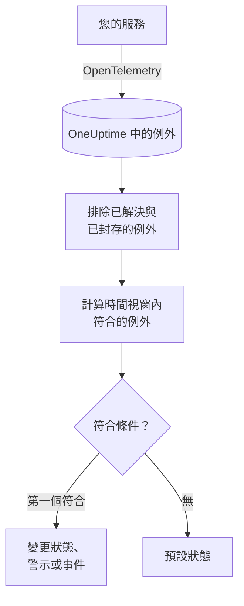

# 例外狀況監控

例外狀況監測器會在一個時間視窗內，計算您的服務回報給 OneUptime、且符合您篩選器（訊息、例外類型、環境、服務）的例外。當計數符合您的條件時，它會變更監測器的狀態、建立警示或宣告事件。可以用它針對正式環境中任何新的當機、某一種例外類型，或錯誤的突然增加發出警示。

:::cards
- [建立監測器](#建立例外狀況監測器): 選擇要計算的例外以及何時發出警示。
- [環境](#環境): 把監測器限定在 `production`。
- [如何評估](#如何評估): 計算什麼，以及解決一個例外會帶來什麼。
- [條件](#條件): 條件與預設值。
:::

## 運作方式



OneUptime 每分鐘計算一次符合監測器篩選器、且在其時間視窗內發生的例外，並排除您已標記為已解決或已封存的例外。它會把這個計數由上而下與監測器的條件比較，第一個符合的條件決定接下來發生什麼。如果沒有任何條件符合，監測器會回到預設狀態。

## 開始之前

- 您的服務透過 OpenTelemetry 將例外傳送到 OneUptime。請參閱 [OpenTelemetry](/docs/telemetry/open-telemetry)。
- 若要把監測器限定在某個環境，您的服務必須設定資源屬性 `deployment.environment`。

## 建立例外狀況監測器

:::steps
### 開始建立新監測器

前往 **監測器**，點選 **建立監測器**。

### 選擇 Exceptions

在 **監測器類型** 下點選 **更多監測器類型**，然後在 **遙測** 下選擇 **例外**，或在搜尋方塊中輸入 `exceptions`。輸入 **名稱**，然後點選 **下一步**。

### 選擇要計算的例外

在 **例外監測器設定** 中設定 **篩選例外訊息**、**例外類型**、**Environments** 和 **監測 (time) 內的例外**。留空的篩選器會符合所有例外。篩選器下方的 **例外預覽** 會顯示它們目前符合的例外。

### 縮小範圍（選用）

開啟 **更多欄位**，依遙測服務或基礎架構實體篩選，或是一併計算已解決與已封存的例外。

### 設定條件

**監測器條件** 卡片一開始有兩個條件：有任何例外符合時離線並建立事件；沒有任何符合時上線。請把它們改成您想發出警示的情況（請參閱 [條件](#條件)）。

### 建立監測器

點選 **建立監測器**。監測器會在其 **概覽** 頁面開啟，第一次評估會在一分鐘內執行。
:::

## 查詢內容

| 欄位 | 符合什麼 | 預設值 |
| --- | --- | --- |
| **篩選例外訊息** | 訊息包含此文字的例外，不區分大小寫。 | 空：所有例外 |
| **例外類型** | 屬於這些類型之一的例外，以逗號分隔，例如 `TypeError, NullReferenceException`。類型名稱必須完全符合。 | 空：所有類型 |
| **Environments** | 來自這些環境之一的例外，以逗號分隔（請參閱 [環境](#環境)）。 | 空：所有環境 |
| **監測 (time) 內的例外** | 最近 5 秒到最近 24 小時內的例外。 | **過去 1 分鐘** |
| **依遙測服務篩選**（在 **更多欄位** 中） | 來自所選任一服務的例外。 | 空：所有服務 |
| **Filter by Infrastructure Entity**（在 **更多欄位** 中） | 來自所選任一主機、Pod、容器及其他實體的例外。 | 空：所有實體 |
| **包含已解決的例外**（在 **更多欄位** 中） | 一併計算已標記為已解決的例外。 | 關閉 |
| **包含已封存的例外**（在 **更多欄位** 中） | 一併計算已封存的例外。 | 關閉 |

例外必須符合您設定的所有篩選器才會被計數。

### 環境

環境來自每個例外上的 OpenTelemetry 資源屬性 `deployment.environment`，與例外瀏覽器用 `env:production` 篩選的值相同。輸入一個環境，或以逗號分隔輸入多個；當例外的環境與其中任何一個符合時，就會被計數。

比對是精確的，並且區分大小寫：`production` 不會符合 `Production` 或 `prod`。設定此篩選器後，沒有環境的例外不會被計數。留空則會計算所有環境的例外，包括沒有環境的例外。

環境篩選器會與其他所有篩選器組合，因此限定在某個遙測服務與 `production` 的監測器，只會計算該服務的正式環境例外。

透過 API 建立監測器時，請把步驟的 `exceptionMonitor` 中的 `environments` 設為環境名稱清單：

```json
{
  "exceptionMonitor": {
    "telemetryServiceIds": [],
    "environments": ["production"],
    "exceptionTypes": [],
    "message": "",
    "includeResolved": false,
    "includeArchived": false,
    "lastXSecondsOfExceptions": 300
  }
}
```

## 如何評估

- **每分鐘。** 例外狀況監測器不是由探測器檢查，因此沒有可設定的間隔，也沒有 **探測器與間隔** 頁面。
- **計算發生次數，而不是例外類型。** 每當符合的例外在 **監測 (time) 內的例外** 內發生一次，監測器就計數一次。一個例外擲出 40 次就計為 40。
- **已解決與已封存的例外會被排除。** 除非您開啟 **包含已解決的例外** 或 **包含已封存的例外**，否則您已標記為已解決或已封存的例外的發生不會被計數。因此，把例外標記為已解決可能會關閉它開啟的事件。已解決的例外再次發生時，會自動變回未解決並重新被計數。
- **沒有例外就是計數 0。**
- **OneUptime 本身的停機不算沉默。** 只要時間視窗中包含 OneUptime 本身沒有接收資料的時間（正在重新啟動、升級或追趕積壓），檢查就會等待：狀態不會改變，也不會開啟或解決任何事件或警示。請參閱 [OneUptime 未接收資料時](/docs/monitor/when-oneuptime-is-not-receiving)。
- **條件由上而下。** 第一個符合的條件決定結果，因此請把最嚴重的放在最前面。

每次狀態變更及其原因，都會記錄在監測器的 **狀態時間軸** 上。

## 條件

例外狀況監測器的條件只有一個 **篩選器類型**：**Exception Count**，也就是視窗內符合的例外數量。選擇一個 **篩選條件** 和一個 **值**。

| 篩選條件 | 當例外數量…時符合 |
| --- | --- |
| **Greater Than** | 高於該值 |
| **Greater Than Or Equal To** | 等於或高於該值 |
| **Less Than** | 低於該值 |
| **Less Than Or Equal To** | 等於或低於該值 |
| **Equal To** | 正好等於該值 |
| **Not Equal To** | 不等於該值 |

例外數量沒有異常條件：沒有可以與之比較的基準。

新的例外狀況監測器從以下條件開始：

| 條件 | 篩選器 | 效果 |
| --- | --- | --- |
| Check if … has exceptions | **Exception Count** **Greater Than** `0` | 將監測器標記為離線並宣告事件，事件會自動解決 |
| Check if … has no exceptions | **Exception Count** **Equal To** `0` | 將監測器標記為上線 |

## 實例：只看正式環境的例外

您希望 API 在正式環境中擲出例外時都建立事件，而對 staging 不做任何處理。您把 **Environments** 設為 `production`，把 **監測 (time) 內的例外** 設為 **過去 5 分鐘**，並保留預設條件。在最近五分鐘內：

| 例外 | 環境 | 狀態 | 是否計數？ |
| --- | --- | --- | --- |
| `TypeError` × 3 | `production` | 作用中 | 是：3 |
| `TypeError` × 40 | `staging` | 作用中 | 否：其他環境 |
| `TimeoutError` × 2 | 無 | 作用中 | 否：沒有環境 |
| `NullReferenceException` × 4 | `production` | 發生後已解決 | 否：已解決 |

**Exception Count** 為 3，因此 **Greater Than** `0` 符合：監測器變為離線並宣告事件。當五分鐘內沒有任何作用中的正式環境例外時，上線條件符合，事件會自行解決。

## 疑難排解

:::details 瀏覽器中看得到例外，但監測器計數為 0
把 **Environments** 的值與瀏覽器的 `env:` 篩選器比較：比對是精確的且區分大小寫，設定篩選器後沒有環境的例外會被排除。接著檢查這些例外是否已解決或已封存。開啟監測器的 **條件** 頁面（在 **設定** 下），點選 **Edit Monitoring Criteria**：**例外預覽** 會顯示篩選器符合的內容。
:::

:::details 我解決例外後，事件也解決了
這是預期行為。已解決的例外不會被計數，因此計數下降，條件不再符合。如果該例外再次發生，它會變回未解決並重新被計數。若要無論如何都計算它們，請開啟 **包含已解決的例外**。
:::

:::details 例外類型篩選器什麼都不符合
**例外類型** 會與回報例外時使用的類型名稱（例如 `TypeError`）精確比較。請從例外瀏覽器中複製類型。
:::

## 後續步驟

:::cards
- [追蹤監控](/docs/monitor/traces-monitor): 針對失敗的 Span 與端點發出警示。
- [日誌監控](/docs/monitor/logs-monitor): 針對日誌量與日誌內容發出警示。
- [事件與警示範本](/docs/monitor/incident-alert-templating): 撰寫實用的警示標題與描述。
- [OpenTelemetry](/docs/telemetry/open-telemetry): 將例外傳送到 OneUptime。
:::
