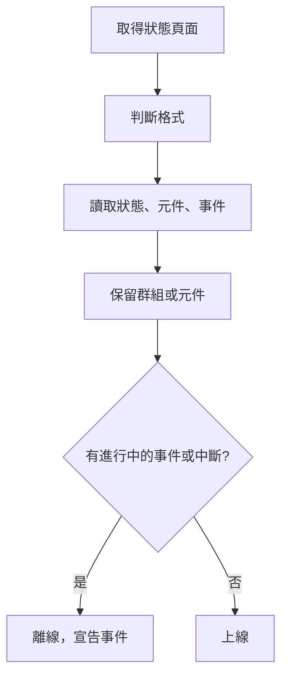

# 外部狀態頁監控

外部狀態頁監測器會留意你所依賴之服務（AWS、GCP、Azure、GitHub、OpenAI、Anthropic 等眾多服務）的公開狀態頁面，並在該供應商回報服務中斷或效能下降時對你發出警示。用它在供應商回報上游問題的第一時間得知，並把這些問題與你自己的問題區分開來。

:::cards
- [建立監測器](#建立外部狀態頁監測器): 貼上狀態頁面的 URL，並選擇要留意的內容。
- [限定範圍](#設定選項): 只留意一個元件群組或一個元件。
- [條件](#監控條件): 預設情況下什麼算是停止運作。
- [常用狀態頁面](#常用狀態頁面-url): 大多數團隊所依賴之服務的 URL。
:::

## 運作方式

每次檢查時，探測器會取得狀態頁面，判斷它使用的格式，並讀取整體狀態、元件和進行中的事件。如果你把監測器限定到某個元件群組或元件，就只計算這些內容。接著由條件決定監測器是上線還是離線。

你可以用它來：

- 監控你的應用程式所依賴之第三方服務的可用性
- 在上游供應商發生服務中斷時收到警示
- 追蹤各個元件的狀態
- 把監控限定到單一元件群組（例如只留意 OpenAI 的 "APIs"），讓頁面上其他無關的事件不會觸發你的監測器
- 在效能下降影響使用者之前發現它
- 把你自己的事件與上游供應商的問題關聯起來

## 支援的供應商

| 供應商 | 說明 |
| ------------------------ | ---------------------------------------------------------------------- |
| **Auto**（預設） | 自動判斷狀態頁面的格式 |
| **Atlassian Statuspage** | 由 Atlassian Statuspage 提供的狀態頁面（JSON API） |
| **incident.io** | 由 incident.io 提供的狀態頁面（例如 `https://status.openai.com`） |
| **RSS** | 提供 RSS 摘要的狀態頁面 |
| **Atom** | 提供 Atom 摘要的狀態頁面 |

### 自動判斷

設定為 **Auto** 時，OneUptime 會依下列順序自動判斷狀態頁面的格式：

1. 首先嘗試 incident.io 狀態頁面 API（`/proxy/<host>`）。
2. 接著嘗試 Atlassian Statuspage JSON API（`/api/v2/status.json`、`/api/v2/components.json` 和 `/api/v2/incidents/unresolved.json`）。
3. 如果都失敗，就嘗試把頁面剖析為 RSS 或 Atom 摘要。
4. 最後的退路是一次基本的 HTTP 連線能力檢查。

> [!NOTE]
> 之所以先檢查 incident.io，是因為某些 incident.io 狀態頁面（例如 `https://status.openai.com`）也公開了一個功能有限、與 Atlassian 相容的端點，其中省略了元件群組和進行中的事件。先檢查 incident.io 可以確保使用更豐富、包含群組資訊的資料。

當你明確選擇的供應商失敗時，也會退回連線能力檢查。它只會告訴你頁面是否有回應（回傳 `2xx` 或 `3xx` 即為上線），不會回報任何元件或事件。

## 建立外部狀態頁監測器

:::steps
### 開始一個新的監測器

前往 **監測器**，點選 **建立監測器**。在 **監測器類型** 下點選 **更多監測器類型**，然後在 **Basic Monitoring** 下選擇 **External Status Page**，或在搜尋方塊中輸入 `statuspage`。輸入 **名稱**，然後點選 **下一步**。

### 輸入狀態頁面的 URL

輸入 **狀態頁面 URL**。除非你知道格式，否則請把 **提供者** 保留為 **Auto**。

### 視需要限定範圍

開啟 **更多欄位**，輸入 **Component Group Filter (Optional)**（例如 `APIs`），以及 **元件名稱篩選器（選填）** 來留意單一元件（如果設定了群組，則在該群組內）。

### 測試

點選 **測試監測器** 取得一次頁面，查看它找到的供應商、元件和事件。

### 檢查條件

條件步驟會從[預設條件](#預設條件)開始，當供應商回報範圍內有進行中的事件或服務中斷時，它們會把監測器標示為離線。視需要修改，然後點選 **下一步**。

### 選擇探測器並建立

選擇 **探測器** 和 **監測間隔**（一開始為 **每 5 分鐘**），然後點選 **建立監測器**。
:::

## 設定選項

| 選項 | 要輸入的內容 | 預設值 |
| --- | --- | --- |
| **狀態頁面 URL** | 狀態頁面的 URL。對於由 Atlassian Statuspage 和 incident.io 提供的網站，通常是根 URL（例如 `https://status.example.com`）。對於 RSS/Atom 摘要，請直接輸入摘要的 URL。 | — |
| **提供者** | **Auto** 表示自動判斷格式；如果你知道格式，可選擇 **Atlassian Statuspage**、**incident.io**、**RSS** 或 **Atom**。 | **Auto** |
| **Component Group Filter (Optional)** | 監測器限定到的群組。位於 **更多欄位** 下。 | 所有群組 |
| **元件名稱篩選器（選填）** | 要留意的元件。位於 **更多欄位** 下。 | 範圍內的所有元件 |
| **逾時（ms）** | 等待狀態頁面的最長時間。位於 **更多欄位** 下。 | `10000`（10 秒） |
| **重試** | 第一次嘗試失敗後重試的次數，每次間隔一秒；`0` 表示只嘗試一次。位於 **更多欄位** 下。 | `3`（最多 4 次嘗試） |

### Component Group Filter

如果狀態頁面把元件分成群組，你可以把監測器限定到單一群組。例如在 `https://status.openai.com` 上輸入 `APIs`，就會把監測器限定到 OpenAI 的 API 服務。

設定了元件群組後，**進行中的事件數** 和 **整體狀態** 只會根據該群組中的元件計算：影響無關群組（例如 ChatGPT）的事件不會觸發限定到 "APIs" 群組的監測器。

**Atlassian Statuspage** 和 **incident.io** 供應商支援依元件群組篩選。RSS 和 Atom 摘要不提供元件群組。

### 元件名稱篩選器

如果狀態頁面回報了多個元件，你可以指定一個元件名稱，只監控該元件。篩選器會符合名稱中包含你輸入內容的任何元件，不區分大小寫：`actions` 會符合名為 "Actions" 的元件。

如果同時設定了元件群組，元件名稱篩選器會在該群組 **之內** 套用，讓你能鎖定大型群組中的單一元件。兩個篩選器都沒有指定時，會監控範圍內的所有元件。對於 RSS 或 Atom 摘要，名稱篩選器會與摘要中各項目的標題比對。

> [!WARNING]
> 什麼都比對不到的篩選器看起來是正常的：範圍內沒有元件，就沒有任何東西能回報服務中斷。請對照狀態頁面檢查拼字，並以 **測試監測器** 查看篩選器保留了什麼。

## 監控條件

你可以設定條件，依據下列內容決定外部服務何時被視為上線或離線：

| 篩選器類型 | 檢查內容 | 篩選條件 |
| --- | --- | --- |
| **External Status Page Is Online** | 狀態頁面是否可以連線並傳回狀態資料 | 是 或 否 |
| **External Status Page Overall Status** | 頁面回報的整體狀態 | Equal To、Not Equal To、包含、Not Contains、Starts With、Ends With |
| **External Status Page Component Status** | 範圍內元件的狀態（遵循元件群組 / 元件名稱篩選器）：運作中、Under Maintenance、Degraded Performance、Partial Outage、Major Outage 或 Full Outage | Equal To、Not Equal To、包含、Not Contains、Starts With、Ends With |
| **External Status Page Active Incidents** | 狀態頁面上目前進行中的事件數（設定篩選器時限定到該元件群組 / 元件） | Equal To、Not Equal To 以及數值比較 |
| **External Status Page Response Time (in ms)** | 取得狀態頁面資料所花的時間 | Greater Than、Less Than、Greater Than Or Equal To、Less Than Or Equal To |

整體狀態就是頁面上寫的內容，因此其值會因供應商而異：Atlassian Statuspage 回報它自己的描述，例如 `All Systems Operational`；摘要回報 `operational` 或 `degraded_performance`；連線能力檢查回報 `reachable` 或 `unreachable`。這些比較會區分大小寫。若要針對服務中斷發出警示，**External Status Page Active Incidents** 和 **External Status Page Component Status** 通常比較可靠。

對於 RSS 或 Atom 摘要，最近 24 小時內的項目算作進行中的事件：RSS 項目依發布日期，Atom 項目依更新日期。

### 預設條件

根據預設，OneUptime 會依狀態頁面真正重要的內容建立條件，也就是進行中的事件和元件的健康狀況，而不只是連線能力：

| 條件 | 篩選器 | 效果 |
| --- | --- | --- |
| Offline | 下列 **任何** 一項：頁面不在線上；範圍內至少有一個進行中的事件；範圍內有元件回報 Degraded Performance、Partial Outage、Major Outage 或 Full Outage | 將監測器標示為離線並宣告一個事件，該事件會在條件不再符合時自動解決 |
| Online | 下列 **全部** 成立：頁面在線上；範圍內沒有進行中的事件 | 將監測器標示為上線 |

由於進行中的事件數和元件狀態都遵循元件群組 / 元件名稱篩選器，這些預設條件會自動只針對你在意的元件。

## 範本變數

從外部狀態頁監測器建立事件或警示時，你可以在標題、描述和修復說明中使用這些變數（請參閱 [事件與警示範本](/docs/monitor/incident-alert-templating)）：

| 變數 | 說明 |
| ------------------------- | ------------------------------------------------------------------------------- |
| `{{isOnline}}`            | 狀態頁面是否在線上（true/false） |
| `{{responseTimeInMs}}`    | 回應時間，單位為毫秒 |
| `{{failureCause}}`        | 失敗原因（如果有） |
| `{{overallStatus}}`       | 整體狀態指標值 |
| `{{activeIncidentCount}}` | 進行中的事件數（如果有篩選器，則限定在篩選器範圍內） |
| `{{componentStatuses}}`   | 元件狀態的 JSON 陣列（`name`、`status`、`description`、`groupName`） |
| `{{provider}}`            | 判斷出的供應商（Atlassian Statuspage、incident.io、RSS、Atom）；連線能力檢查之後為空 |
| `{{componentGroup}}`      | 監測器限定到的元件群組（如果有） |
| `{{componentName}}`       | 監測器限定到的元件（如果有） |

## 常用狀態頁面 URL

下列是一些常用服務的狀態頁面。其中許多使用 Atlassian Statuspage 或 incident.io，因此 **Auto** 供應商會自動判斷它們。既不是以這兩者為基礎、也不是摘要的頁面只會進行連線能力檢查；對於這類頁面，如果供應商有發布 RSS 或 Atom 摘要，請改為監控該摘要。

| 服務 | 狀態頁面 URL |
| ---------------------------- | --------------------------------------------- |
| AWS                          | `https://health.aws.amazon.com/health/status` |
| Google Cloud Platform        | `https://status.cloud.google.com`             |
| Microsoft Azure              | `https://status.azure.com`                    |
| GitHub                       | `https://www.githubstatus.com`                |
| OpenAI                       | `https://status.openai.com`                   |
| Anthropic                    | `https://status.anthropic.com`                |
| Cloudflare                   | `https://www.cloudflarestatus.com`            |
| Datadog                      | `https://status.datadoghq.com`                |
| PagerDuty                    | `https://status.pagerduty.com`                |
| Twilio                       | `https://status.twilio.com`                   |
| Stripe                       | `https://status.stripe.com`                   |
| Slack                        | `https://status.slack.com`                    |
| Atlassian (Jira, Confluence) | `https://status.atlassian.com`                |
| Vercel                       | `https://www.vercel-status.com`               |
| Netlify                      | `https://www.netlifystatus.com`               |
| DigitalOcean                 | `https://status.digitalocean.com`             |
| Heroku                       | `https://status.heroku.com`                   |
| MongoDB Atlas                | `https://status.cloud.mongodb.com`            |
| Fastly                       | `https://status.fastly.com`                   |
| New Relic                    | `https://status.newrelic.com`                 |
| Sentry                       | `https://status.sentry.io`                    |
| CircleCI                     | `https://status.circleci.com`                 |

## 最佳做法

- **使用 Auto 供應商** —— 除非你知道確切的格式，自動判斷適用於大多數狀態頁面。
- **限定到元件群組** —— 如果你只依賴供應商的一部分（例如只依賴 OpenAI 的 "APIs"），這樣無關的事件就不會產生雜訊。
- **監控特定元件** —— 適用於你只依賴某些服務的情況。
- **與你自己的監測器搭配使用** —— 把外部狀態頁監測器與你自己的 API 和網站監測器搭配使用。兩者同時停止運作時，上游狀態頁面能更快指出根本原因。

## 疑難排解

:::details 監測器離線了，但事件涉及的是我沒有使用的那部分服務
以 **Component Group Filter**、**元件名稱篩選器** 或兩者來限定監測器的範圍。這樣進行中的事件數和元件狀態就只會計算範圍內的內容。
:::

:::details 即使在服務中斷期間，監測器也從不離線
可能是篩選器什麼都沒比對到（這看起來是正常的），也可能是頁面只進行了連線能力檢查。執行 **測試監測器**，檢查它找到的供應商和元件。
:::

:::details Auto 選錯了格式，或找不到任何元件
把 **提供者** 設定為你知道該頁面所使用的那一個。對於 RSS 或 Atom 摘要，請輸入摘要本身的 URL，而不是狀態頁面的 URL。
:::

:::details 無法連線到內部狀態頁面
除非獲得允許，否則探測器會拒絕私有網路位址。在你網路內部的探測器上設定 `PROBE_ALLOW_PRIVATE_NETWORK_MONITORS=true`，請參閱 [私有網路存取](/docs/self-hosted/private-network-access)。
:::

## 後續步驟

:::cards
- [事件與警示範本](/docs/monitor/incident-alert-templating): 把供應商的狀態放進事件標題。
- [API 監控](/docs/monitor/api-monitor): 在供應商的狀態之外檢查你自己的端點。
- [建立監測器](/docs/monitor/create-monitor): 所有監測器類型共通的步驟。
:::
