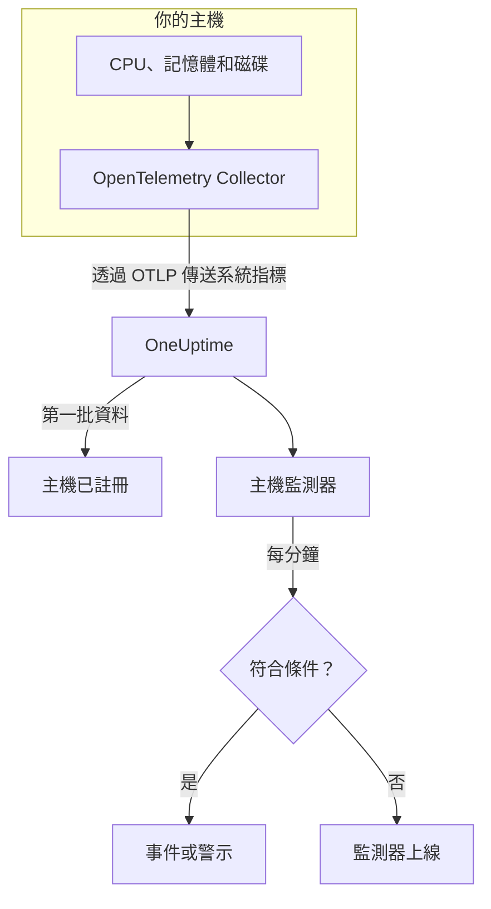

# 主機監控

主機監測器監控一台機器的 CPU、記憶體、磁碟、負載和處理程序，並在它飽和或快要滿時通知你。它讀取 OpenTelemetry Collector 從主機傳送的 `system.*` OpenTelemetry 指標，也就是 **主機** 產品顯示的同一份資料，因此不會從外部探測任何東西。

:::cards
- [建立監測器](#建立主機監測器): 在儀表板中完成六個步驟。
- [範本](#現成的警示範本): 五個現成的警示，涵蓋 CPU、記憶體、磁碟、負載和處理程序。
- [指標](#收集的指標): 可用於警示的主機指標及其單位。
- [主機還是 Server / VM？](#主機監測器還是-server-vm-監測器): 兩種機器監測器該用哪一個。
:::

## 運作方式

主機上執行著帶有 `hostmetrics` 接收器的 OpenTelemetry Collector。它每 30 秒讀取主機的 CPU、記憶體、磁碟、網路、負載和處理程序數據，並透過 OTLP 傳送到 OneUptime。來自某台主機的第一批資料會把它註冊到 **主機** 下。

主機監測器綁定到一台主機。它每分鐘對這台主機的指標執行查詢，並把結果與條件比較。

### 主機監測器還是 Server / VM 監測器？

OneUptime 有兩種用於機器的監測器。它們可以在同一台主機上同時執行。

| | 主機監測器 | Server / VM 監測器 |
| --- | --- | --- |
| **代理程式** | 帶有 `hostmetrics` 接收器的 OpenTelemetry Collector | OneUptime 基礎設施代理程式 |
| **資料** | `system.*` 和 `process.*` OpenTelemetry 指標，與 **主機** 頁面繪製的圖表相同 | 代理程式推送給監測器的狀態報告 |
| **條件** | 對任何指標查詢或公式設定閾值或異常偵測 | 內建檢查，例如 CPU、記憶體和磁碟使用率 |
| **設定** | 安裝 Collector；主機會自動註冊 | 建立監測器，然後把它的密鑰交給代理程式 |

如果主機已經在傳送 OpenTelemetry 資料，或你想從同一個 Collector 取得日誌和更豐富的指標，請使用主機監測器。另一種監測器請參閱 [伺服器 / 虛擬機器監控](/docs/monitor/server-monitor)。

## 開始之前

- **在主機上執行 OpenTelemetry Collector**，並啟用 `hostmetrics` 接收器。[主機 OpenTelemetry Collector](/docs/telemetry/host-otel-collector) 涵蓋 Linux、macOS 和 Windows，**產品 → 基礎設施 → 主機 → 文件** 提供現成的設定。
- **開啟使用率指標。** `system.cpu.utilization`、`system.memory.utilization` 和 `system.filesystem.utilization` 在接收器中是選用的，而 CPU、記憶體和檔案系統範本都需要它們。儀表板提供的設定會開啟它們。
- **確認主機已註冊。** 第一批資料到達後，它會以其 `host.name` 命名，出現在 **產品 → 基礎設施 → 主機 → 所有主機** 下。

## 建立主機監測器

:::steps
### 開始新的監測器

前往 **監測器** 並按一下 **建立監測器**。

### 選擇主機類型

在 **監測器類型** 下按一下 **更多監測器類型**，然後在 **基礎設施** 下選擇 **主機**。輸入 **名稱**（會用在事件和警示標題中），然後按一下 **下一步**。

### 選擇要監控的主機

在 **Host Monitor Configuration** 下，從 **主機** 中選擇機器。傳送過資料的每台主機都在清單中。

### 選擇要監控的內容

選擇三個分頁之一：

- **Quick Setup** – 按一下一個 [範本](#現成的警示範本)。它會設定指標、彙總、時間範圍和閾值，並用自己的條件取代下方的條件。你仍然可以變更 **時間範圍**。
- **Custom Metric** – 從 **Host Metric** 中選擇一個指標，然後設定 **彙總** 和 **時間範圍**。
- **進階** – 在 **選擇指標** 下自行建立查詢和公式，例如依 `state` 篩選或依 `mountpoint` 分組。

### 檢查條件

開啟 **監測器條件** 下的每個條件，檢查其 **指標**、**彙總**、**條件** 和 **Threshold**。範本會填好這些內容。使用 **Custom Metric** 或 **進階** 時，監測器會從 [預設條件](#預設條件) 開始，這些條件只會注意到指標降到零，所以請設定你自己的閾值。

### 建立監測器

按一下 **建立監測器**。OneUptime 會開啟監測器的頁面，並每分鐘評估一次。它開啟的事件和警示也會列在主機的 **事件** 和 **警示** 頁面上。
:::

> [!TIP]
> 若要一次設定多個範本，請從 **產品 → 基礎設施 → 主機** 開啟主機，然後前往 **Recommendations**。選擇你需要的範本和要呼叫的人，OneUptime 就會為每個範本建立一個監測器。

## 監測器設定

| 欄位 | 分頁 | 作用 |
| --- | --- | --- |
| **主機** | 全部 | 必填。把每個查詢限定在該主機的 `resource.host.name`。 |
| **Host Metric** | Custom Metric | [目錄](#收集的指標) 中的一個指標，依 CPU、記憶體、磁碟、網路、負載和處理程序分組。 |
| **彙總** | Custom Metric | 樣本的合併方式：**平均**、**最大值**、**最小值**、**總和** 或 **計數**。初始值為該指標通常的彙總方式。 |
| **時間範圍** | 全部 | 查詢讀取的滾動視窗，從 **Past 1 Minute** 到 **Past 365 Days**。新監測器從 **Past 1 Minute** 開始；範本會設定自己的值。 |
| **選擇指標** | 進階 | 查詢建立器：**指標**、**Aggregate by**、**Filter by attributes**、**Group by**，以及用來組合查詢的 **新增指標** 和 **新增公式**。 |

## 現成的警示範本

**Quick Setup** 提供五個範本。每個範本都會建立一個完整的監測器：一個查詢、一個觸發的條件和一個恢復的條件。閾值只是起點，你可以編輯。

條件只有在其視窗的每一分鐘都成立時才會觸發，並在越過閾值 10% 處恢復，這樣在邊界附近徘徊的值就不會來回跳動。

| 範本 | 嚴重程度 | 監控內容 | 觸發時機 | 恢復時機 |
| --- | --- | --- | --- | --- |
| High CPU Utilization | Warning | `user` 和 `system` 狀態的 `system.cpu.utilization`，相加後以百分比顯示，最近 5 分鐘 | 高於 80% | 不高於 72% |
| High Memory Utilization | Warning | `used` 狀態的 `system.memory.utilization`，以百分比顯示，最近 5 分鐘 | 高於 85% | 不高於 76.5% |
| High Filesystem Usage | 嚴重 | `system.filesystem.utilization`，依 `mountpoint` 和 `device` 取 Max，以百分比顯示，最近 5 分鐘 | 高於 90% | 不高於 81% |
| High Load Average (1m) | Warning | `system.cpu.load_average.1m`，Avg，最近 5 分鐘 | 高於 4 | 不高於 3.6 |
| High Process Count | Warning | `system.processes.count`，Max，最近 5 分鐘 | 高於 2000 | 不高於 1800 |

**嚴重程度** 是選擇清單中顯示的標籤。範本建立的事件和警示會從專案中最嚴重的事件和警示嚴重程度開始；請在條件中變更它們。

- **CPU** 是忙碌時間（`user` 加 `system`），與主機 **概覽** 圖表中的數字相同。不包括 iowait 和 steal。
- **記憶體** 不計緩衝區和頁面快取，所以大部分被快取占用的主機不會觸發它。
- **檔案系統** 會為每個掛接點開啟一個事件。唯讀的虛擬檔案系統（例如 snap 的 `squashfs` 掛接或 macOS 的 `devfs`）永遠是 100% 已滿；請在 Collector 的 `filesystem` 擷取器中排除它們。
- **平均負載** 是原始的執行佇列長度，沒有除以核心數：4 在 2 核心主機上代表飽和，在 32 核心主機上則很平常，所以在大型主機上請調高它。
- **處理程序數** 比較的是最大的單一處理程序狀態（`running`、`sleeping`、…），而不是主機的總數，因此它與處理程序清單對不起來。處理程序擷取器只在 Linux 上回報。

## 收集的指標

**Host Metric** 清單提供以下指標。每個指標都帶有 `resource.host.name`，監測器就是用它把查詢限定到一台主機。

> [!IMPORTANT]
> 使用率指標是 0 到 1 之間的比率，而不是百分比：在原始指標上設定閾值時，80% 要寫成 `0.8`。範本會用公式換算成百分比，所以它們的閾值是 80、85 和 90。

### CPU

| 指標 | 單位 | 說明 |
| --- | --- | --- |
| `system.cpu.utilization` | 比率 | 每個 `state`（`user`、`system`、`idle`、…）所占的 CPU 時間比例。請依 `state` 篩選：所有狀態的平均值永遠到不了有用的閾值。 |
| `process.cpu.utilization` | 比率 | 主機上每個處理程序的 CPU 使用率。 |

### 記憶體

| 指標 | 單位 | 說明 |
| --- | --- | --- |
| `system.memory.utilization` | 比率 | 每個 `state`（`used`、`free`、`cached`、…）所占的實體記憶體比例。若要看使用中的記憶體，請依 `state = used` 篩選。 |
| `system.memory.usage` | 位元組 | 記憶體使用量，單位為位元組。 |

### 磁碟

| 指標 | 單位 | 說明 |
| --- | --- | --- |
| `system.filesystem.utilization` | 比率 | 每個檔案系統已用容量的比例，依 `mountpoint` 和 `device` 區分。 |
| `system.filesystem.usage` | 位元組 | 檔案系統使用量，單位為位元組。 |

### 網路

| 指標 | 單位 | 說明 |
| --- | --- | --- |
| `system.network.io` | 位元組 | 接收和傳送的位元組數。生命週期計數器。 |

### 負載

| 指標 | 單位 | 說明 |
| --- | --- | --- |
| `system.cpu.load_average.1m` | 計數 | 最近 1 分鐘的平均負載。 |
| `system.cpu.load_average.5m` | 計數 | 最近 5 分鐘的平均負載。 |
| `system.cpu.load_average.15m` | 計數 | 最近 15 分鐘的平均負載。 |

### 處理程序

| 指標 | 單位 | 說明 |
| --- | --- | --- |
| `system.processes.count` | 計數 | 主機上的處理程序，每個處理程序 `status` 一個序列。 |

**進階** 中的查詢建立器會列出主機傳送的所有指標，而不只是這些。

## 監控條件

條件會把監測器的某個查詢或公式與閾值比較。主機監測器的條件沒有 **篩選器類型**：每條規則都以下列欄位檢查指標值。

| 欄位 | 作用 |
| --- | --- |
| **指標** | 要檢查的查詢或公式，以其變數名稱指定。 |
| **彙總** | 視窗中的值如何變成一個結果：**平均**、**總和**、**Maximum Value**、**Minimum Value**、**All Values**（每個值都必須符合）或 **Any Value**（一個就夠）。 |
| **條件** | **Greater Than**、**Less Than**、**Greater Than Or Equal To**、**Less Than Or Equal To** 或 **Equal To**，或是異常條件：**Anomalously High**、**Anomalously Low** 或 **Anomalous**。 |
| **Threshold** | 用來比較的值。如果指標有單位，旁邊會有單位清單。異常條件下不會顯示。 |
| **敏感度** | 僅限異常條件。**低**（4σ）、**中**（3σ，預設）或 **高**（2σ）。 |
| **基準視窗** | 僅限異常條件。14 天（預設）、28、60 或 90 天的歷史。 |
| **如果沒有資料** | 位於 **更多欄位** 下。視窗中沒有樣本時的處理方式：**Ignore**（預設）、**Treat As Zero** 或 **觸發器**。 |

異常條件會把每個值與基準中一週的同一小時比較。在基準視窗累積足夠的歷史之前，它們會停留在「Learning」狀態，不產生任何結果。

每個條件也會說明符合時要做什麼：變更監測器狀態、建立警示或宣告事件。條件會由上而下檢查，第一個符合的條件決定結果。

### 預設條件

不是從範本建立的監測器會以兩個條件開始：

| 順序 | 條件 | 符合時機 | 結果 |
| --- | --- | --- | --- |
| 1 | Check if _monitor name_ is offline | 第一個查詢的任一值為 `0` | 將監測器標記為 **離線**，並宣告事件「_monitor name_ is offline」，監測器恢復後該事件會自動解決。 |
| 2 | Check if _monitor name_ is online | 任一值大於 `0` | 將監測器標記為 **運作中**。 |

> [!IMPORTANT]
> 靜默不會符合任何一個條件：停止傳送資料的主機會讓監測器維持原狀。若要在主機變得靜默時收到通知，請在某個條件上把 **如果沒有資料** 設為 **觸發器**。OneUptime 本身未接收資料的時間永遠不算是沒有資料：視窗中包含這類時間的檢查會改為等待，詳見 [OneUptime 未接收資料時](/docs/monitor/when-oneuptime-is-not-receiving)。

## 疑難排解

:::details 主機不在 主機 清單中
主機會依據 Collector 的資料自動註冊，這需要 `host.name` 和主機的作業系統類型，兩者都來自 Collector 的 `resourcedetection` 處理器。請檢查 Collector 是否正在執行，以及主機是否列在 **產品 → 基礎設施 → 主機 → 所有主機** 下。[主機 OpenTelemetry Collector](/docs/telemetry/host-otel-collector) 說明了相關設定。
:::

:::details CPU 或記憶體閾值從不觸發
使用率指標是最大值為 `1.0` 的比率，所以手動輸入的閾值 `80` 永遠不會被越過：請使用 `0.8`，或從會換算成百分比的範本開始。也請依 `state` 篩選：CPU 用 `user` 和 `system`，記憶體用 `used`。所有狀態的平均值會停在 1 除以狀態數附近。
:::

:::details 事件在錯誤的主機上觸發
監測器會以等於所選主機的 `resource.host.name` 限定每個查詢。回報相同 `host.name` 的多台主機會合併成一個序列，所以請為每台主機設定唯一的名稱。
:::

:::details High Filesystem Usage 在一個永遠是滿的掛接點上觸發
唯讀的虛擬檔案系統（例如 `/snap` 下 snap 的 `squashfs` 迴圈掛接，或 macOS 的 `devfs`）在設計上就是 100% 已滿，永遠不會恢復。請把它們從 Collector 的 `filesystem` 擷取器中排除。
:::

## 後續步驟

:::cards
- [主機 OpenTelemetry Collector](/docs/telemetry/host-otel-collector): 安裝並設定本監測器讀取的 Collector。
- [伺服器 / 虛擬機器監控](/docs/monitor/server-monitor): 由代理程式推送資料的機器監測器。
- [指標監控](/docs/monitor/metrics-monitor): 跨主機和服務，針對任何指標發出警示。
- [事件概觀](/docs/incidents/index): 條件宣告事件之後會發生什麼事。
:::
