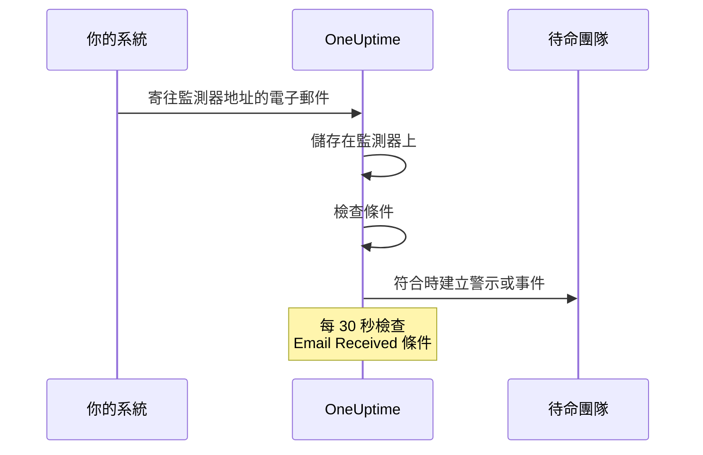

# 傳入郵件監控

傳入郵件監測器會提供一個只屬於該監測器的電子郵件地址。任何能寄送電子郵件的東西（備份工作、舊有系統、雲端供應商的警示）都可以把結果寄到這裡，OneUptime 會依你的條件檢查每一封電子郵件，將監測器標示為停止運作、開啟事件或建立警示，並在「一切正常」的通知送達時解決它們。

:::cards
- [建立監測器](#建立傳入郵件監測器): 取得一個地址，並讓寄件端指向它。
- [驗證地址](#在寄件端驗證地址): 在監測器上閱讀寄件端的確認信。
- [撰寫條件](#可用的篩選器類型): 依主旨、寄件者或內文比對，或在郵件不再送達時發出警示。
- [在警示中使用電子郵件](#範本變數): 把主旨和內文放進標題和描述。
:::

## 運作方式

電子郵件是推送模式：你的系統寄出，OneUptime 接收。每封電子郵件送達時都會依監測器的條件檢查。尋找 *應該* 送達之電子郵件的條件，也會依排程每 30 秒檢查一次。



1. 建立傳入郵件監測器時，OneUptime 會為它指派一個唯一的電子郵件地址。
2. 寄往該地址的每封電子郵件都會儲存在監測器上，並由上往下依條件評估；第一個符合的條件說了算。
3. 符合的條件可以變更監測器的狀態、建立警示並宣告事件。開啟了 **自動解決事件** 的事件，或開啟了 **自動解決警示** 的警示，會在之後另一個條件符合時被解決，例如將監測器標示為上線的那個條件。

## 建立傳入郵件監測器

:::steps
### 開始一個新的監測器

前往 **監測器**，點選 **建立監測器**。

### 選擇 Incoming Email

在 **監測器類型** 下點選 **更多監測器類型**，然後在 **Inbound Monitoring** 下選擇 **Incoming Email**，或在搜尋方塊中輸入 `email`。輸入 **名稱**，然後點選 **下一步**。

### 檢查條件

**條件** 步驟會從[預設條件](#預設提供的內容)開始，電子郵件提到 `error` 時，它們會把監測器標示為離線。點選某個條件即可修改，或點選 **新增條件準則** 加入一個。常見的設定請參閱[設定範例](#設定範例)。

### 建立監測器

點選 **建立監測器**。監測器會在 **概覽** 頁面開啟，在第一封電子郵件送達之前，**Incoming Email Address** 卡片會顯示這個地址和一個複製按鈕。

### 寄送電子郵件到該地址

設定你的系統把通知寄到這個地址。如果寄件端要求先確認地址，請參閱[在寄件端驗證地址](#在寄件端驗證地址)。
:::

> [!NOTE]
> 這個地址包含監測器的密鑰，因此只有能編輯監測器的人才看得到。其他人看到的是設定詳細資料已被隱藏。

## 電子郵件地址格式

每個傳入郵件監測器都有一個如下格式的唯一地址：

```text
monitor-{secret-key}@{inbound-domain}
```

密鑰是一個 UUID，例如 `monitor-3f2b8c1e-5d4a-4f6b-9a7c-2e1d0b9f8a6c@inbound.yourdomain.com`。第一封電子郵件送達後，這個地址會繼續顯示在監測器 **概覽** 頁面的 **Inbound email address** 卡片中，旁邊是最後一封電子郵件送達的時間。監測器的 **文件** 頁面也會顯示它。

## 重設或自訂電子郵件地址

前往監測器的 **設定** 分頁。**Incoming Email Address** 卡片會顯示目前的地址，並提供兩種取代它的方式：

| 動作 | 作用 | 使用時機 |
| --- | --- | --- |
| **Reset Address** | 為監測器指派一個新的、隨機產生的 `monitor-{secret-key}@{inbound-domain}` 地址。如果監測器有自訂地址，重設會將它移除。執行前會要求你確認。 | 地址已外洩，或你想切斷所有寄往它的來源。 |
| **Customize Address** | 讓你選擇 @ 前面的部分，例如 `nightly-backups@{inbound-domain}`。在 **Address name** 中輸入它（可以輸入名稱，也可以貼上完整地址），然後點選 **Save Address**。 | 你想要一個大家一看就認得的地址。 |

兩種動作最後都會顯示新地址和一個複製按鈕。

> [!WARNING]
> **舊地址會立即失效**：寄往它的電子郵件會被忽略，因此請更新每一個寄送電子郵件到此監測器的系統。

自訂地址規則：

- 3 到 64 個字元：小寫字母、數字、點（`.`）、連字號（`-`）和底線（`_`），不能連續出現兩個點。必須以字母或數字開頭和結尾。大寫輸入會自動轉為小寫。
- 網域一律是伺服器的傳入電子郵件網域。
- 名稱不能已經被另一個監測器使用。伺服器上的所有專案共用傳入網域，因此名稱必須在所有專案中都是唯一的。
- `monitor-{id}` 和 `workflow-{id}` 形式的名稱保留給產生的地址使用。屬於網域本身的信箱名稱也被保留：`abuse`、`admin`、`administrator`、`hostmaster`、`mailer-daemon`、`noc`、`postmaster`、`root`、`security` 和 `webmaster`。

自訂地址和產生的地址一樣都是認證資訊：任何知道它的人都能寄送由此監測器評估的電子郵件。產生的地址實際上無法猜到，但簡短、明顯的名稱則可以。如果這對你很重要，請選擇一個難以猜測的名稱。

API 使用者也可以透過 Monitor API 在現有的監測器上做同樣的事：把 `incomingEmailCustomLocalPart` 設為名稱即可使用自訂地址，設為 `null` 則回到產生的地址。重設就是在同一次更新中寫入新的 `incomingEmailSecretKey`，並把 `incomingEmailCustomLocalPart` 設為 `null`。

## 在寄件端驗證地址

有些服務在有人證明能讀取某個新地址的郵件之前，不會對它寄送警示。它們會先寄出一封驗證信，這封信會像其他電子郵件一樣送達監測器。閱讀方式如下：

:::steps
### 把地址加入服務

把監測器的地址加入服務並儲存。該服務會寄出驗證信。

### 開啟最新的電子郵件

在 OneUptime 中開啟監測器。在其 **概覽** 頁面上，**監測器摘要** 卡片會顯示最新的電子郵件。確認 **來自** 和 **主旨** 屬於這封驗證信，然後點選 **顯示更多詳細資料**。

### 複製驗證碼或連結

驗證碼或連結位於 **電子郵件內文 (文字)** 中。**電子郵件內文 (HTML)** 顯示的是 HTML 原始碼，因此如果你從那裡複製連結，請把其中的每個 `&amp;` 改成 `&`。

### 完成驗證

依照電子郵件的說明完成驗證。
:::

如果之後又收到另一封電子郵件，卡片就不會再顯示驗證信。請開啟 **監測日誌**，在 **電子郵件** 欄中依主旨找到驗證信，並點選該列的 **檢視摘要**。

> [!IMPORTANT]
> **你的條件也會看到它。** 驗證信會像其他電子郵件一樣被評估。像 "if you received this in error" 這樣的措辭會符合預設的 `error` 條件，把監測器標示為離線。為了避免這種情況，請在驗證期間關閉監測器 **設定** 頁面上 **監控** 卡片中的 **檢查此監測器**（會要求你確認）。關閉監控的監測器仍會記錄電子郵件，**監測器摘要** 卡片也仍會顯示它。但它不會評估任何內容，因此這封電子郵件不會在 **監測日誌** 中留下一列：請在另一封電子郵件送達之前閱讀它。完成後，請點選監測器頁面頂端橫幅中的 **開啟監測**，或把開關重新打開。

**驗證屬於地址本身。** 如果你[重設或自訂地址](#重設或自訂電子郵件地址)，服務會看到一個新的收件者，你就必須重新驗證。

### Azure 監視器動作群組

從 2026 年 7 月起，Azure 正逐步推行一項要求：動作群組中每個新的 **Email** 收件者都必須以一次性密碼驗證。在驗證之前，動作群組不會對該地址寄送任何警示或測試通知。

:::steps
1. 在動作群組中加入一個使用監測器地址的 **Email** 通知，並儲存動作群組。Azure 會從 `azure-noreply@microsoft.com` 這類 Microsoft 地址寄出驗證信。
2. 依上述方式在監測器上閱讀它，並在儲存動作群組後的 30 分鐘內依其說明操作。如果密碼過期，請開啟動作群組並選取 **Resend**。
3. 開啟動作群組並選取 **Test** 寄送一則測試通知。它會像真正的警示一樣送達監測器，因此也能顯示你的條件是否符合 Azure 的電子郵件。
:::

驗證對同一個 Azure 租用戶中的所有動作群組都有效，因此每個地址只需要驗證一次。

### Amazon SNS

對 SNS 主題的電子郵件訂閱在確認之前收不到任何內容。建立訂閱時，Amazon SNS 會寄一封確認信到該地址。依上述方式在監測器上閱讀它，並在瀏覽器中開啟其中的 **Confirm subscription** 連結。SNS 會刪除 48 小時內未確認的訂閱；如果發生這種情況，請重新建立訂閱。

## 預設提供的內容

新的傳入郵件監測器建立時會帶有兩個讀取電子郵件內文的條件：

| 條件 | 篩選器類型 | 篩選條件 | 值 | 效果 |
| -------- | ----------- | ---------------- | ------- | -------------------------------------------- |
| Offline  | Email Body  | 包含 | `error` | 將監測器標示為離線，開啟一個事件 |
| Online   | Email Body  | Not Contains | `error` | 將監測器標示為上線 |

這適合工作或第三方工具以電子郵件回報自身結果的常見情況：內文提到 `error` 的郵件會讓監測器下線，下一封不含該字的郵件會讓監測器恢復上線並解決事件。內文比對不區分大小寫，因此 `Error` 和 `ERROR` 也會符合。

請把值改成你的寄件端實際寫的內容（`FAILED`、`exit code 1` 等）。

> [!NOTE]
> 這些預設條件 **不是** 失效開關：電子郵件不再送達時，這裡的任何條件都不會觸發。只讀取主旨、寄件者、內文或收件者的條件只在電子郵件送達時評估，其他時候都不會。如果你希望在沉默時收到警示，請加入一個 **Email Received** / **Not Recieved In Minutes** 條件，請參閱[範例 3](#範例-3心跳監測器沒有電子郵件-警示)。

## 可用的篩選器類型

你可以根據下列電子郵件欄位建立條件：

| 篩選器類型 | 說明 |
| ------------------------- | ----------------------------------------------------------------------------------- |
| **電子郵件主旨** | 傳入電子郵件的主旨行 |
| **Email From Address** | 寄件者的電子郵件地址：只有地址本身，小寫，不含顯示名稱 |
| **Email Body** | 電子郵件內文的純文字部分 |
| **Email To Address** | 收件者的電子郵件地址 |
| **Email Received** | 以電子郵件接收時間為基礎的條件 |
| **JavaScript Expression** | 必須求值為 true 的自訂 JavaScript 運算式 |

在任何條件讀取電子郵件之前，監測器自己的地址都會被遮蔽，因此在 **Email To Address**、**電子郵件主旨** 和 **Email Body** 中它會顯示為 `[REDACTED]`。

## 篩選條件

### 字串篩選器（主旨、寄件者、內文、收件者）

| 篩選條件 | 說明 | 範例 |
| ---------------- | ----------------------------------------- | ---------------------------------- |
| **包含** | 欄位包含指定的文字 | 主旨包含 "CRITICAL" |
| **Not Contains** | 欄位不包含指定的文字 | 主旨不包含 "TEST" |
| **Equal To** | 欄位與指定的文字完全相同 | 寄件者等於 "alerts@service.com" |
| **Not Equal To** | 欄位與指定的文字不同 | 主旨不等於 "OK" |
| **Starts With** | 欄位以指定的文字開頭 | 主旨以 "[ALERT]" 開頭 |
| **Ends With** | 欄位以指定的文字結尾 | 主旨以 "- Production" 結尾 |
| **Is Empty** | 欄位是空的 | 內文是空的 |
| **Is Not Empty** | 欄位有內容 | 主旨不是空的 |

這些比較全都不區分大小寫。值為空的篩選器永遠不會符合。

### 以時間為基礎的篩選器（Email Received）

儀表板把這些條件拼寫為 "Recieved"。

| 篩選條件 | 說明 | 範例 |
| --------------------------- | ----------------------------------- | -------------------------------- |
| **Recieved In Minutes** | 在 X 分鐘內收到了電子郵件 | 30 分鐘內收到電子郵件 |
| **Not Recieved In Minutes** | X 分鐘內沒有收到電子郵件 | 60 分鐘內沒有收到電子郵件 |

從未收到電子郵件的監測器會把建立時間當作最後一封電子郵件。

### JavaScript Expression

| 篩選條件 | 說明 |
| --------------------- | ------------------------------------- |
| **Evaluates To True** | 運算式傳回一個真值 |

運算式在一個沒有繫結任何電子郵件欄位的沙箱中執行，因此它無法讀取觸發這次檢查之郵件的主旨、寄件者、內文或收件者。若要依電子郵件內容比對，請使用 **電子郵件主旨**、**Email From Address**、**Email Body** 和 **Email To Address** 篩選器類型。

## 設定範例

每個範例都是一對條件。一個條件包含篩選器、一個 **符合條件**（其篩選器的 **全部** 或 **任何**），以及動作：變更監測器狀態、建立警示、宣告事件。在警示或事件的 **更多欄位** 下開啟 **自動解決警示**（或 **自動解決事件**），這樣第二個條件就會解決第一個條件開啟的內容。

### 範例 1：對嚴重的電子郵件建立警示

| 條件 | 篩選器 | 符合條件 | 動作 |
| --- | --- | --- | --- |
| 嚴重郵件 | **電子郵件主旨** 包含 `CRITICAL`；**電子郵件主旨** 包含 `ALERT`；**電子郵件主旨** 包含 `ERROR` | **任何** | 把狀態改為離線；建立警示 |
| 復原郵件 | **電子郵件主旨** 包含 `RESOLVED`；**電子郵件主旨** 包含 `RECOVERED` | **任何** | 把狀態改為上線 |

把嚴重條件放在第一位：條件是由上往下檢查，第一個符合的條件說了算。

### 範例 2：監控特定寄件者

| 條件 | 篩選器 | 符合條件 | 動作 |
| --- | --- | --- | --- |
| 工作失敗 | **Email From Address** Equal To `monitoring@legacy-system.com`；**電子郵件主旨** 包含 `Failed` | **全部** | 把狀態改為離線；宣告事件 |
| 工作成功 | **Email From Address** Equal To `monitoring@legacy-system.com`；**電子郵件主旨** 包含 `Success` | **全部** | 把狀態改為上線 |

### 範例 3：心跳監測器（沒有電子郵件 = 警示）

| 條件 | 篩選器 | 動作 |
| --- | --- | --- |
| 郵件遲到 | **Email Received** Not Recieved In Minutes `60` | 把狀態改為離線；建立警示 |
| 郵件已送達 | **Email Received** Recieved In Minutes `60` | 把狀態改為上線 |

第一個條件會在 60 分鐘內沒有電子郵件送達時觸發，適合會寄出完成通知的排程工作或批次處理。第二個條件會在郵件一送達時就解決警示。OneUptime 本身未在接收電子郵件的分鐘不計入這 60 分鐘，詳見 [OneUptime 未接收資料時](/docs/monitor/when-oneuptime-is-not-receiving)。

## 使用情境

| 使用情境 | 監測器的作用 |
| --- | --- |
| 舊有系統整合 | 把舊系統只以電子郵件發出的警示轉成 OneUptime 事件，並在復原郵件送達時解決它們。 |
| 第三方服務 | 接收來自雲端供應商（AWS、GCP、Azure）、安全性掃描工具、備份工具的通知，以及憑證到期警告。 |
| 排程工作 | 在完成郵件遲到，或工作以電子郵件回報失敗時發出警示。 |
| 警示彙整 | 收集來自 Nagios、Zabbix 或其他工具的電子郵件警示，讓 OneUptime 成為管理它們的唯一地方。 |

## 範本變數

此監測器建立的警示和事件的標題、描述和修復說明中可以使用這些變數。條件的警示和事件表單會在 **範本變數** 下列出它們，[事件與警示範本](/docs/monitor/incident-alert-templating) 則說明語法。

| 變數 | 說明 |
| --------------------- | ----------------------------------------------------------------- |
| `{{emailSubject}}`    | 收到的電子郵件的主旨 |
| `{{emailFrom}}`       | 寄件者的電子郵件地址 |
| `{{emailTo}}`         | 電子郵件寄給了誰，此監測器自己的地址會被遮蔽 |
| `{{emailBody}}`       | 電子郵件的純文字內文 |
| `{{emailReceivedAt}}` | 電子郵件的接收時間，為 UTC 的 ISO 8601 時間戳記 |

- **標題中每個變數只取一行。** 在標題中，每個變數會被截斷為最多 150 個字元的一行，原本較長時會以 `...` 結尾。標題不能超過 500 個字元，標題過長的警示或事件根本不會被建立，因此引用整封電子郵件會讓監測器無法對長郵件發出警示。描述和修復說明會得到完整的值。
- **此監測器的地址會被遮蔽。** 這個地址的作用相當於密碼，因此會在儲存電子郵件之前被遮蔽，`{{emailTo}}` 會顯示為 `monitor-[REDACTED]@{inbound-domain}`（自訂地址則為 `[REDACTED]@{inbound-domain}`）。
- **缺少郵件的檢查使用最後一封電子郵件。** 當 **Email Received** 條件因為郵件沒有按時送達而開啟警示時，這些變數描述的是監測器收到的最後一封電子郵件。如果還沒收到任何郵件，它們會是空的。

## 監測器摘要檢視

監測器收到電子郵件後，其 **概覽** 頁面上的 **監測器摘要** 卡片會顯示最新的一封：

- **最近收到電子郵件時間**：最近一封電子郵件的接收時間
- **來自**：最後一封電子郵件的寄件者
- **主旨**：最後一封電子郵件的主旨行

點選 **顯示更多詳細資料** 查看其餘內容：

- **電子郵件標頭**：最後一封電子郵件的完整標頭
- **電子郵件內文 (文字)**：純文字內文
- **電子郵件內文 (HTML)**：HTML 內文，以 HTML 原始碼顯示，而不是轉譯後的樣子

### 較早的電子郵件

卡片只顯示最新的電子郵件。監測器評估的每封電子郵件也會寫入 **監測日誌**：**電子郵件** 欄會顯示其主旨和寄件者，該列的 **檢視摘要** 會像卡片一樣顯示整封電子郵件。關閉監控的監測器不會評估任何內容，因此它收到的電子郵件不會留下任何列。如果你的某個條件檢查 **Email Received**，監測器每次檢查缺少的郵件時也會寫入一列。在這些列中，**電子郵件** 欄會顯示 "Scheduled check"，其 **檢視摘要** 會顯示檢查當時最新的電子郵件，如果還沒有郵件送達則顯示 "No email yet"。監測日誌預設保留一天。在自行託管的伺服器上，管理員可以透過 Admin Dashboard 設定中的 **監測器日誌保留期（天）** 修改它。

## 自行託管設定

如果你自行託管 OneUptime，就需要設定一個傳入電子郵件供應商。目前支援：

- **SendGrid Inbound Parse** - 設定說明請參閱 [SendGrid 傳入郵件](/docs/self-hosted/sendgrid-inbound-email)

在完成設定之前，監測器的地址卡片會提示傳入電子郵件尚未設定。

## 注意事項

- **電子郵件地址安全性**：監測器的電子郵件地址相當於密碼：任何知道它的人都能寄電子郵件到監測器。不要公開分享它，一旦外洩，請在監測器的 **設定** 分頁中重設它。
- **電子郵件大小**：OneUptime 接受最大 50 MB 的傳入電子郵件（含附件）。附件不會被儲存，只會儲存它們的名稱、類型和大小。
- **處理時間**：電子郵件是以非同步方式處理的。從寄出電子郵件到建立警示之間可能會有幾秒的延遲。
- **不區分大小寫**：所有字串比較（包含、Equal To 等）都不區分大小寫。
- **純文字**：電子郵件內文條件讀取的是電子郵件的純文字部分。只以 HTML 寄出的電子郵件對條件來說內文是空的，因此它不包含 `error`，預設條件會把監測器標示為上線。

## 疑難排解

### 收不到電子郵件

1. 確認電子郵件地址正確（檢查是否有拼字錯誤）。
2. 檢查寄件端是否在等你驗證地址。Azure 監視器動作群組和 Amazon SNS 在新地址驗證之前不會對它寄送任何內容。請參閱[在寄件端驗證地址](#在寄件端驗證地址)。
3. 檢查電子郵件是否被垃圾郵件篩選器擋下。
4. 確認你的傳入電子郵件供應商設定正確。
5. 檢查 OneUptime 日誌中是否有錯誤訊息。

### 沒有建立警示

1. 確認你的條件與電子郵件內容相符。請記得，監測器自己的地址會顯示為 `[REDACTED]`，而只有 HTML 的電子郵件內文是空的。
2. 檢查監控是否已開啟：監測器的 **設定** 頁面，**監控** 卡片。
3. 開啟 **監測日誌**，點選該電子郵件所在列的 **檢視摘要**，看看條件讀到了什麼。
4. 檢查條件的順序：第一個符合的條件說了算。

### 警示沒有被解決

1. 確認你的解決條件與復原郵件相符。
2. 檢查開啟警示的那個條件中是否開啟了 **自動解決警示**（或 **自動解決事件**）。
3. 確認復原郵件是寄到同一個監測器地址。

## 後續步驟

:::cards
- [事件與警示範本](/docs/monitor/incident-alert-templating): 把電子郵件的主旨和內文放進警示。
- [傳入請求監控](/docs/monitor/incoming-request-monitor): 改以 HTTP 接收心跳和 Webhook。
- [SendGrid 傳入郵件](/docs/self-hosted/sendgrid-inbound-email): 在自行託管的伺服器上設定傳入電子郵件。
:::
