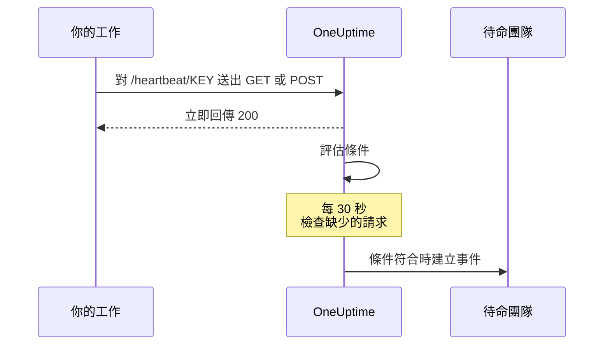
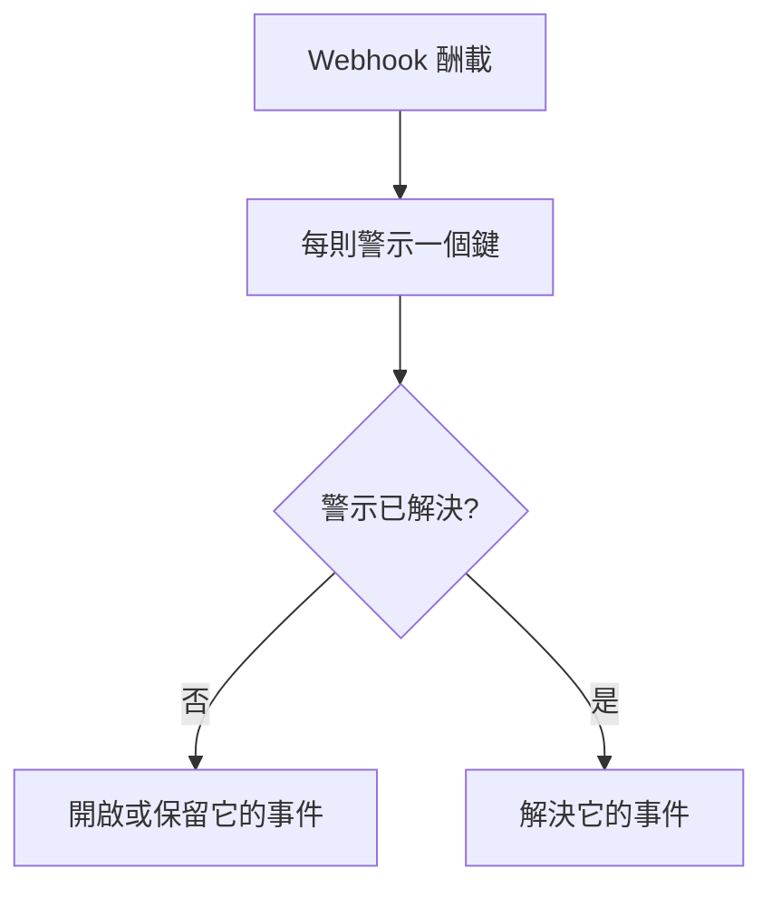

# 傳入請求監控

傳入請求監測器會提供一個 URL，讓其他系統對它送出 HTTP 請求。OneUptime 會依你的條件評估每一個請求，並可以變更監測器狀態、宣告事件，以及呼叫待命人員。

它涵蓋兩種不同的工作：

- **心跳監控** —— cron 工作、worker 或裝置依排程呼叫該 URL，當呼叫不再送達時，OneUptime 就建立事件。
- **接收其他系統的警示** —— Prometheus Alertmanager、Grafana，或任何能夠 POST JSON 的系統把警示推送進來，OneUptime 將每一則轉成事件，帶有待命升級，並在復原時自動解決。

兩者使用同一種監測器類型。差別在於你所設定的條件。

:::cards
- [建立監測器](#建立傳入請求監測器): 幾個步驟就能取得一個心跳 URL。
- [傳送心跳](#傳送心跳): 從 curl、cron、Node.js、Python 或 Go 傳送。
- [呼叫停止時發出警示](#10-分鐘內沒有心跳就標示為離線失效開關): 把監測器變成一個失效開關。
- [接收警示](#接收其他系統的警示): Alertmanager 或 Grafana 的每則警示對應一個事件。
:::

## 運作方式

沒有任何東西從外部檢查你的系統：你的系統呼叫監測器的 URL，OneUptime 立即回應，接著依監測器的條件評估這個請求。檢查請求是否 *不再* 送達的條件，還會每 30 秒在背景重新檢查一次，因此沉默也能觸發事件。



你可以用它來：

- 監控 cron 工作與排程任務
- 確認背景 worker 正在執行
- 監控防火牆後方、外部無法連線的服務
- 接收來自 Prometheus Alertmanager、Grafana 及其他警示系統的警示
- 追蹤任何支援 HTTP 的系統送出的心跳訊號

## 建立傳入請求監測器

:::steps
### 開始一個新的監測器

前往 **監測器**，點選 **建立監測器**。

### 選擇 Incoming Request

在 **監測器類型** 下選擇 **Incoming Request**，它是最上方的常用類型之一。輸入 **名稱**，然後點選 **下一步**。

### 檢查條件

**條件** 步驟會從[預設條件](#預設提供的內容)開始。若是心跳，請點選 **新增條件準則**，為新條件設定一個 **Incoming Request** / **Not Recieved In Minutes** 篩選器，讓它把狀態改為離線並宣告一個事件，同時開啟 **自動解決事件**。然後把它拖到清單最上方，原因請參閱[條件範例](#條件範例)。

### 建立監測器

點選 **建立監測器**。監測器會在 **概覽** 頁面開啟，**Send the first heartbeat** 卡片會顯示附有複製按鈕的 **Heartbeat URL**，以及一條 `curl` 指令範例。

### 傳送第一個請求

設定你的服務對該 URL 傳送請求（請參閱[傳送心跳](#傳送心跳)）。第一個請求送達後，這張卡片會讓位給監測器的歷程記錄，一張 **Heartbeat URL** 卡片會顯示 URL 以及最後一個請求送達的時間。
:::

> [!NOTE]
> URL 中包含監測器的密鑰，因此只有能編輯監測器的人才看得到。你隨時可以在監測器的 **文件** 頁面上再次找到它，該頁面位於側邊選單的 **設定** 區段中。

## 請求 URL

你的監測器有一個如下格式的唯一 URL：

```text
https://oneuptime.com/heartbeat/YOUR_SECRET_KEY
```

如果是自行託管，請把 `https://oneuptime.com` 換成你的 OneUptime 執行個體的 URL。

對這個 URL 送出 **GET** 或 **POST** 請求。HEAD 也會被接受並當作 GET 處理；PUT、PATCH 和 DELETE 會傳回 404。路徑中的密鑰是唯一的認證資訊，不需要任何標頭或權杖。查詢字串會被忽略：請把條件要讀取的內容放在請求內文或標頭中傳送。

> [!WARNING]
> 任何知道這個 URL 的人都能把監測器標示為正常，因此請把它當作機密看待。如果它外洩了，請開啟監測器的 **設定** 頁面，點選 **重設傳入請求密鑰**，然後更新每一個傳送端。你傳送的每個標頭都會儲存在監測器上，任何能檢視監測器的人都看得到：請不要在傳往這個端點的標頭中夾帶 API 金鑰或權杖。

> [!IMPORTANT]
> OneUptime 會立即以一個空的 JSON 物件（`{}`）傳回 `200`，並透過佇列處理請求。這個回應是在任何驗證之前就寫出的，因此 `200` **並不** 代表請求已被接受：錯誤的密鑰、已刪除的監測器和已停用的監測器同樣會傳回 `200`。請查看監測器本身的時間軸，確認請求確實送達。

### 傳送請求內文

如果你想參照請求內文中的欄位（事件標題中的 `{{requestBody.status}}`、事件分組中的 JSON 路徑，或 JavaScript 運算式條件），請傳送 `Content-Type: application/json`。本文件通篇都假設使用這種格式。請求內文必須是 JSON 物件或陣列：格式錯誤的 JSON，或像 `"error"` 這樣的單一值，會以 `500` 拒絕。

| 內容類型 | 條件和範本看到的內容 |
| --- | --- |
| `application/json` | 剖析後的 JSON。 |
| `application/x-www-form-urlencoded` | 剖析後的表單。帶方括號的鍵會形成巢狀（`alerts[0][status]=firing`），每個值都是字串。 |
| 其他任何類型，或沒有 | 空的請求內文（`{}`），因此對 `requestBody` 的任何參照都得不到值。 |

最多接受 50 MB 的請求內文；更大的會以 `413` 拒絕。不要以 `Content-Encoding: gzip` 壓縮請求內文：那樣它就不會以 JSON 形式儲存，其中的路徑也無法解析。

### 傳送心跳

每個範例都會傳送一個請求。請把 `YOUR_SECRET_KEY` 換成你監測器 URL 中的密鑰。

:::tabs
@tab curl
```bash
# Simple GET request
curl https://oneuptime.com/heartbeat/YOUR_SECRET_KEY

# POST request with a JSON body
curl -X POST https://oneuptime.com/heartbeat/YOUR_SECRET_KEY \
  -H "Content-Type: application/json" \
  -d '{"status": "healthy", "version": "1.2.3"}'
```
@tab Cron
```bash
# Send a heartbeat every 5 minutes
*/5 * * * * curl -fsS https://oneuptime.com/heartbeat/YOUR_SECRET_KEY > /dev/null

# Or ping only when the job succeeds, so a failed run counts as a missed heartbeat
0 2 * * * /usr/local/bin/backup.sh && curl -fsS https://oneuptime.com/heartbeat/YOUR_SECRET_KEY > /dev/null
```
@tab Node.js
```javascript title="heartbeat.mjs"
// Node.js 18 or later: fetch is built in. Run with `node heartbeat.mjs`.
const response = await fetch(
  "https://oneuptime.com/heartbeat/YOUR_SECRET_KEY",
  {
    method: "POST",
    headers: { "Content-Type": "application/json" },
    body: JSON.stringify({ status: "healthy", version: "1.2.3" }),
  },
);

console.log(response.status); // 200
```
@tab Python
```python title="heartbeat.py"
# Python 3, standard library only. Run with `python3 heartbeat.py`.
import json
import urllib.request

request = urllib.request.Request(
    "https://oneuptime.com/heartbeat/YOUR_SECRET_KEY",
    data=json.dumps({"status": "healthy", "version": "1.2.3"}).encode(),
    headers={"Content-Type": "application/json"},
    method="POST",
)

with urllib.request.urlopen(request, timeout=10) as response:
    print(response.status)  # 200
```
@tab Go
```go title="heartbeat.go"
// Run with `go run heartbeat.go`.
package main

import (
	"bytes"
	"fmt"
	"net/http"
)

func main() {
	body := []byte(`{"status": "healthy", "version": "1.2.3"}`)

	resp, err := http.Post(
		"https://oneuptime.com/heartbeat/YOUR_SECRET_KEY",
		"application/json",
		bytes.NewReader(body),
	)
	if err != nil {
		panic(err)
	}
	defer resp.Body.Close()

	fmt.Println(resp.StatusCode) // 200
}
```
@tab PowerShell
```powershell
# Windows PowerShell 5.1 or PowerShell 7
Invoke-RestMethod -Method Post `
  -Uri "https://oneuptime.com/heartbeat/YOUR_SECRET_KEY" `
  -ContentType "application/json" `
  -Body '{"status": "healthy", "version": "1.2.3"}'
```
:::

## 監控條件

你可以設定條件，決定服務何時被視為上線、效能下降或離線。每個條件篩選器都有一個 **篩選器類型**（看什麼）、一個 **篩選條件**（如何比較）和一個 **值**。

### 預設提供的內容

新的傳入請求監測器建立時會帶有兩個讀取請求內文的條件：

| 條件 | 篩選器類型 | 篩選條件 | 值 | 效果 |
| -------- | ------------ | ---------------- | ------- | -------------------------------------------- |
| Offline  | 請求內文 | 包含 | `error` | 將監測器標示為離線，開啟一個事件 |
| Online   | 請求內文 | Not Contains | `error` | 將監測器標示為上線 |

這適合傳送端在酬載中回報自身健康狀況的常見情況：請求內文提到 `error` 的請求會讓監測器下線，下一個不含該字的請求會讓監測器恢復上線並解決事件。完全沒有請求內文的請求算作「不包含 `error`」，因此單純的心跳呼叫會讓監測器保持上線。

請把值改成你的傳送端實際送出的內容（`"status":"firing"`、`FAILED` 等）：比對方式是在整個請求內文（包含鍵）中進行區分大小寫的子字串搜尋，因此 `{"error":null}` 也會符合 `error`。

> [!NOTE]
> 這些預設條件 **不是** 失效開關：請求不再送達時，這裡的任何條件都不會觸發。如果你希望在沉默時收到警示，請依下文說明加入一個 **Incoming Request** / **Not Recieved In Minutes** 條件。

### 可用的篩選器類型

| 篩選器類型 | 檢查內容 | 備註 |
| --------------------- | ------------------------------------------------------ | -------------------------------------------------------------------------------------------- |
| Incoming Request | 是否在某個時間範圍內收到了請求 | 唯一一個在什麼都沒送達時也能觸發的檢查 |
| 請求內文 | 請求的內文 | 子字串比對。物件請求內文以精簡的 JSON 比較 |
| Request Header | 請求標頭的名稱 | 與完整的標頭名稱完全比對，不區分大小寫 |
| Request Header Value | 請求標頭的值 | 與完整的標頭值完全比對，不區分大小寫 |
| JavaScript Expression | 任何以 `requestBody` 和 `requestHeaders` 為基礎的運算式 | 最有彈性的選項，請參閱 [JavaScript 運算式](/docs/monitor/javascript-expression) |

### 篩選條件

每種篩選器類型都有自己的一組條件：

| 篩選器類型 | 條件 |
| --- | --- |
| **Incoming Request** | **Recieved In Minutes** —— 在指定的分鐘數內收到了請求。**Not Recieved In Minutes** —— 在指定的分鐘數內沒有收到請求。（儀表板就是這樣拼寫的。） |
| **請求內文**、**Request Header**、**Request Header Value** | **包含** 和 **Not Contains** |
| **JavaScript Expression** | **Evaluates To True** |

> [!NOTE]
> 標頭的名稱和值會轉為小寫後，與完整的名稱或值比較，而不是子字串比對：`application/json` 不會符合 `application/json; charset=utf-8`。只有 **請求內文** 會做子字串比對。你的 Proxy 或 OneUptime 本身的負載平衡器加上的標頭（`x-forwarded-for`、`x-real-ip`）也會被儲存。

物件請求內文會以不含空格的精簡 JSON 比較，因此 **請求內文** / **包含** 篩選器必須寫成 `"status":"firing"`：從排版過的酬載中複製 `"status": "firing"` 永遠不會符合。

### 條件範例

#### 10 分鐘內沒有心跳就標示為離線（失效開關）

| 欄位 | 值 |
| --- | --- |
| **篩選器類型** | Incoming Request |
| **篩選條件** | Not Recieved In Minutes |
| **值** | `10` |

#### 依請求內文的內容標示為效能下降

| 欄位 | 值 |
| --- | --- |
| **篩選器類型** | 請求內文 |
| **篩選條件** | 包含 |
| **值** | `"status":"degraded"` |

> [!IMPORTANT]
> 把失效開關放在預設條件 **之上**。條件是由上往下檢查，第一個符合的條件說了算。背景檢查會重新讀取最後一個請求，因此預設的上線條件（"Request Body Not Contains `error`"）會一直符合它，排在它下面的條件永遠輪不到。**新增條件準則** 會把條件加到最底部：請把它拖上去。

> [!WARNING]
> 只有當監測器至少有一個條件檢查 **Incoming Request** 時，它才會在背景重新評估。條件只檢查請求內文、Request Header 或 JavaScript 運算式的監測器，只會在請求送達時評估，其他時候都不會，因此它永遠不會自行下線。如果你需要心跳缺失的警報，就需要一個 **Incoming Request** 條件。

背景檢查以整分鐘計算，在經過的時間 *超過* 該值時觸發："Not Recieved In Minutes: 10" 大約在最後一個請求之後 11 分鐘觸發（檢查每 30 秒執行一次）。從未收到請求的監測器會把建立時間當作最後一個請求，因此同樣的條件放在一個全新的監測器上，即使傳送端從未接上，也會在建立後大約 11 分鐘觸發。只有 OneUptime 正在接收資料的分鐘才會計入該值：OneUptime 本身重新啟動、升級或追趕積壓期間的分鐘不算，詳見 [OneUptime 未接收資料時](/docs/monitor/when-oneuptime-is-not-receiving)。

## 接收其他系統的警示

Alertmanager、Grafana 和類似的工具會 POST 一份描述一則或多則警示的 JSON 文件。根據預設，一個條件只會開啟 **一個** 事件，因此一個帶有五則警示的酬載只會產生一個事件。事件分組改變了這一點：它從酬載中擷取一個值，並 **為每個不同的值開啟一個獨立的事件**，這些事件可以同時處於開啟狀態。



### 開啟事件分組

:::steps
1. 開啟條件並展開 **設定**。
2. 開啟 **Group incidents and alerts by a payload field**。
3. 填寫 **Open a separate incident for each…**。如果希望每個事件自動解決，也要填寫 **Auto-resolve each incident when…** 下的欄位和值（請見下文）。然後儲存監測器。
:::

| 欄位 | 範例 | 作用 |
| ---------------------------------- | ---------------------------------------- | ---------------------------------------------------------------------- |
| Open a separate incident for each… | `requestBody.alerts[*].labels.alertname` | 以其不同的值把事件分開的路徑 |
| Field that signals recovery | `requestBody.alerts[*].status` | 用來判斷某則警示已復原所檢查的路徑 |
| Value that means recovered | `resolved` | 表示已復原的確切值 |
| Max incidents per request | `100`（預設） | 安全上限，避免取值很多的欄位開啟無限多個事件 |

### 路徑語法

路徑必須以字面前置詞 `requestBody.` 開頭。沒有這個前置詞的路徑（例如 `alerts[*].labels.alertname`）什麼都比對不到，而且不會有任何提示。`{{ }}` 包裝是選用的：`requestBody.status` 和 `{{requestBody.status}}` 的行為相同。

- `[*]` 會展開一個陣列：每個 **不同** 的值一個事件。產生相同值的兩個元素會合併成一個事件，該事件的狀態（觸發中/已解決）取自 **第一個** 符合的元素。**一個路徑中只有第一個 `[*]` 是萬用字元**；`requestBody.groups[*].alerts[*].name` 什麼都比對不到。
- `[0]` 和 `[last]` 會選取單一元素，而且可以接在 `[*]` 之後。
- 物件和陣列值、空字串以及 null 會被略過。`0` 和 `false` 是有效的鍵。
- 請求內文必須是 JSON 物件；最上層是陣列的酬載不會被分組。

### 解決由事件驅動

一個 Webhook 只描述該酬載中的內容，因此 OneUptime 絕不會因為某個鍵不再出現就解決它的事件。只有當酬載明確表示該鍵已復原時，事件才會被解決。下列兩點必須同時成立：

1. **Field that signals recovery** 和 **Value that means recovered** 已設定並與酬載相符。比對是完全且區分大小寫的：`Resolved` 不會符合 `resolved`。
2. 條件的事件開啟了 **自動解決事件**，該選項位於事件表單的 **更多欄位** 下。沒有它，符合的復原事件會被忽略，事件會保持開啟。（警示和 **自動解決警示** 亦同。）預設的離線條件一開始就開啟了它；你自己加入條件的事件一開始則是關閉的。

**Max incidents per request** 限制的是擷取，而不只是建立。超出上限的鍵對復原判斷同樣不可見，因此在一個不同鍵數量超過上限的酬載中，超出上限的部分即使回報 `resolved`，也不會關閉它的事件。

> [!NOTE]
> 當一個監測器收到請求的速度快於 OneUptime 評估它們的速度時，OneUptime 會評估最新的請求並略過中間的請求，因此一波突發的 Webhook 可能讓某則觸發中或已解決的警示沒有被評估。在自行託管的伺服器上，於 OneUptime 應用程式的環境中設定 `INCOMING_REQUEST_INGEST_COALESCE_ENABLED=false`，就會個別評估每一個請求。

> [!WARNING]
> 如果 **Field that signals recovery** 包含 `[*]`，而 **Open a separate incident for each…** 不包含，那麼什麼都不會被解決。要嘛兩者都用 `[*]`，要嘛都不用。不含 `[*]` 的復原路徑會針對整個酬載求值，因此酬載層級的 `status: resolved` 會解決該酬載中的每一個鍵，包括自身狀態仍在觸發中的警示。

### 為事件命名

分組鍵會以 **路徑最後一段** 命名的變數形式提供給事件和警示範本：

| 路徑 | 變數 |
| ---------------------------------------- | ----------------- |
| `requestBody.alerts[*].labels.alertname` | `{{alertname}}`   |
| `requestBody.alerts[*].fingerprint`      | `{{fingerprint}}` |
| `requestBody.commonLabels.severity`      | `{{severity}}`    |

完整的酬載也同時可用，因此事件標題用 `{{alertname}}`、描述參照 `{{requestBody.commonAnnotations.summary}}`，兩者都可行。請參閱 [事件與警示範本](/docs/monitor/incident-alert-templating)。

> [!WARNING]
> 變數名稱是 OneUptime 用來把復原事件對應到開啟中事件的身分的一部分。把分組路徑改成最後一段不同的路徑後，所有在舊路徑下仍然開啟的事件都會成為孤兒：它們無法再自動解決，必須手動關閉。

`[*]` **只** 在這兩個分組路徑欄位中有效。在其他地方它不會被解析，而未解析的預留位置會 **原封不動** 地輸出，而不是被清空：標題 `{{requestBody.alerts[*].labels.alertname}}` 顯示時仍帶著大括號。標題 `{{requestBody.alerts[0].annotations.summary}}` 可以解析，但一律讀取酬載中的第一則警示，而不是為其開啟這個事件的那一則。請優先使用分組變數加上酬載中共用的 `commonAnnotations` 欄位。

### 完整範例

完整的 Alertmanager 設定請參閱 [Prometheus Alertmanager](/docs/integrations/prometheus-alertmanager)。Grafana 請參閱 [Grafana](/docs/integrations/grafana)。

## 最佳做法

1. **適當設定時間範圍** —— 如果你的 cron 工作每 5 分鐘執行一次，就把 "Not Recieved In Minutes" 門檻設為 10–15 分鐘，以容許偶爾的延遲，並把這個條件放在第一位。
2. **附上有意義的資料** —— 在請求內文中傳送狀態資訊，以便設定更細的條件。
3. **使用帶 `Content-Type: application/json` 的 POST** —— 所有讀取請求內文內容的功能都依賴它。
4. **不要在一個監測器上混用兩種工作** —— 接收事件驅動警示的監測器沒有固定的節奏，因此在它上面設定 "Not Recieved In Minutes" 條件會反覆切換。請為失效開關使用另一個監測器。
5. **監控監控本身** —— 確保傳送請求的服務妥善處理錯誤，不讓失敗的請求無聲無息。

## 疑難排解

:::details 我的傳送端收到了 200，但監測器上什麼都沒有
`200` 是在驗證請求之前送出的，因此它無法證明請求已被接受。確認 URL 中的密鑰與監測器的 **Heartbeat URL** 一致，而且監測器沒有被停用。然後查看監測器的時間軸，看請求是否送達。
:::

:::details 心跳停止後監測器從不下線
只有 **Incoming Request**（**Not Recieved In Minutes**）條件能察覺沉默。如果沒有就加入一個，並把它拖到預設條件之上：預設的上線條件在每次背景檢查時都會符合最後一個請求，而第一個符合的條件說了算。
:::

:::details 請求內文篩選器從不符合
傳送 `Content-Type: application/json`，並把值寫成精簡的 JSON：`"status":"firing"`，冒號後面沒有空格。沒有 JSON 或表單內容類型時，請求內文不會被剖析。
:::

:::details Request Header 篩選器從不符合
標頭的名稱和值是整體比較的。請提供完整的值，例如 `application/json; charset=utf-8`，而不是其中一部分。
:::

:::details 傳送端收到 500
請求宣告了 `Content-Type: application/json`，但請求內文不是 JSON 物件或陣列。請傳送有效的 JSON，或改用其他內容類型。
:::

## 後續步驟

:::cards
- [Prometheus Alertmanager](/docs/integrations/prometheus-alertmanager): 完整的傳入警示設定。
- [Grafana](/docs/integrations/grafana): 同樣的設定，用於 Grafana 警示。
- [事件與警示範本](/docs/monitor/incident-alert-templating): 標題和描述中可用的所有變數。
- [JavaScript 運算式](/docs/monitor/javascript-expression): 運算式語法和引號規則。
:::
