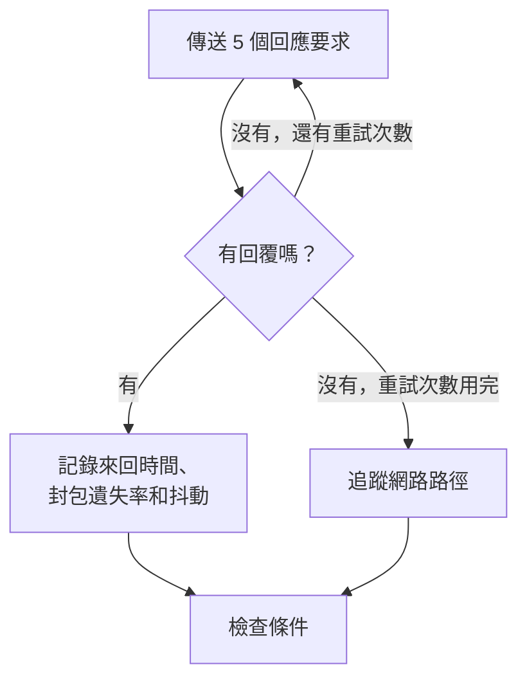

# IP 監控

IP 監測器會檢查 IPv4 或 IPv6 位址是否回覆 ping（ICMP 回應要求），並測量來回時間、封包遺失率和抖動。可用於您以位址掌握的基礎設施，例如閘道、負載平衡器的虛擬 IP，或具有固定位址的伺服器。

:::cards
- [建立監測器](#建立-ip-監測器): 在主控台中完成六個步驟。
- [設定選項](#設定選項): 位址、逾時和重試。
- [監測條件](#監測條件): 可連線性、延遲、封包遺失率和抖動。
- [疑難排解](#疑難排解): 位址可以回覆，但監測器顯示離線時。
:::

## 運作方式

IP 監測器執行與 [Ping 監控](/docs/monitor/ping-monitor) 相同的檢查。每次檢查時，探測器會向該位址傳送五個回應要求。只要至少有一個回覆傳回，該位址就是上線的，探測器會把平均來回時間記錄為回應時間，同時記錄封包遺失率、抖動，以及最快和最慢的回覆。如果沒有任何回覆傳回，探測器會重試，最多重試您允許的次數。接著 OneUptime 會以監測器的條件評估結果。

檢查失敗時，探測器還會追蹤到該位址的路由，並把找到的內容以 **Network Path at Time of Failure** 附加到結果中，讓您看到路由在哪裡中斷。

該用哪一個：

| 監測器 | 接受的值 | 適用情境 |
| --- | --- | --- |
| **IP** | 僅 IP 位址 | 您要監測的就是位址本身，而且它不會改變。 |
| [Ping](/docs/monitor/ping-monitor) | 主機名稱或 IP 位址 | 您以名稱掌握主機；名稱在每次檢查時都會解析，因此監測器會跟上 DNS 的變更。 |

> [!NOTE]
> 有些託管服務供應商會在探測器所執行的機器上封鎖 ICMP。完全無法傳送 ping 的探測器會改為檢查該位址的 TCP 連接埠 `80`，因此監測器仍能說明它是否可以連線。這時不會測量封包遺失率和抖動。

失去自身網路連線的探測器不會回報任何結果，因此它無法將您的位址標記為離線。

## 開始之前

- **可以建立監測器的角色**：Project Owner、Project Admin、Project Member、Monitor Admin 或 Monitor Member，或者擁有 Create Monitor 權限的自訂角色。
- **能夠連到該位址的探測器**，而且沿途允許 ICMP。每個新的監測器都會選取您專案的預設探測器。如果位址前面有防火牆，請允許來自 [OneUptime Cloud 探測器 IP 位址](/docs/configuration/ip-addresses) 的 ICMP 回應要求。私有位址需要該網路中的 [自訂探測器](/docs/probe/custom-probe)，IPv6 位址需要具備 IPv6 連線能力的探測器。

## 建立 IP 監測器

:::steps
### 開始建立新監測器

前往 **監測器**，點選 **建立監測器**。在 **監測器類型** 下點選 **更多監測器類型**，然後在 **Basic Monitoring** 下選擇 **IP**。

### 命名

輸入 **名稱**，例如 `Office gateway`，然後點選 **下一步**。

### 輸入位址

在 **IP 位址** 中輸入要檢查的 IPv4 或 IPv6 位址，例如 `192.168.1.1` 或 `2001:db8::1`。不接受主機名稱：欄位會顯示錯誤。若要以名稱 ping 主機，請使用 [Ping 監控](/docs/monitor/ping-monitor)。

### 測試

點選 **測試監測器**，在 **選擇探測器** 中選擇一個探測器，然後點選 **執行測試**。**監測器測試結果** 會顯示探測器看到的來回時間和封包遺失率。

### 檢視條件

**監測器條件** 從 [預設條件](#預設條件) 開始：位址沒有回覆時為離線，有回覆時為上線。如有需要可修改，然後點選 **下一步**。

### 選擇探測器並建立

保留或修改 **探測器** 和 **監測間隔**（初始為 **每 5 分鐘**），然後點選 **建立監測器**。監測器頁面隨即開啟。
:::

## 設定選項

| 欄位 | 預設值 | 填寫內容 |
| --- | --- | --- |
| **IP 位址** | 無 | IPv4 位址（例如 `192.168.1.1`）或 IPv6 位址（例如 `2001:db8::1`）。IPv6 位址兩側的方括號會被移除。 |
| **請求逾時（秒）**（在 **更多欄位** 中） | `60` | 每次嘗試等待回覆的時間。最長為 60 秒。 |
| **失敗時重試**（在 **更多欄位** 中） | 探測器預設值，通常為 `3` | 失敗的嘗試要重試幾次。最多為 3。 |

**失敗時重試** 計算的是第一次嘗試 _之後_ 的重試次數，因此 `0` 只執行一次檢查，`2` 最多執行三次。留空時使用探測器的預設值：3，除非探測器的 `PROBE_MONITOR_RETRY_LIMIT` 另有設定。包括逾時在內的每次失敗都會重試，兩次嘗試之間暫停一秒。回覆耗時超過 10 秒的成功檢查也會再檢查一次。

## 監測條件

條件決定位址何時算是上線、效能下降或離線，以及是否因此宣告事件或建立警示。每個條件會檢查一個或多個篩選器：

| 篩選器 | 條件 | 檢查內容 |
| --- | --- | --- |
| **Is Online** | **是**、**否** | 是否至少有一個回應要求得到回覆。 |
| **回應時間（毫秒）** | **Greater Than**、**Less Than**、**Greater Than Or Equal To**、**Less Than Or Equal To** | 回覆的平均來回時間。 |
| **Packet Loss (in %)** | **Greater Than**、**Less Than**、**Greater Than Or Equal To**、**Less Than Or Equal To** | 五個回應要求中沒有得到回覆的比例。 |
| **Jitter (in ms)** | **Greater Than**、**Less Than**、**Greater Than Or Equal To**、**Less Than Or Equal To** | 一次檢查中所傳送封包來回時間的標準差。 |
| **Is Request Timeout** | **是**、**否** | ping 是否在每次嘗試中都逾時。 |

有兩個以上的篩選器時，**符合條件** 決定是 **全部** 篩選器都必須符合，還是 **任何** 一個符合即可。條件的 **操作** 決定它做什麼：變更監測器狀態、建立警示、宣告事件，或其中任意幾項。

### 預設條件

新的 IP 監測器以兩個條件開始：

- **離線** — 在所有重試之後，該位址仍沒有回覆任何回應要求，或者完全無法連線。監測器會被標記為 **離線**，並建立名為「_monitor name_ is offline」的事件。位址再次回覆後，事件會自行解決。
- **上線** — 位址有回覆。監測器會被標記為 **運作中**。

條件由上而下檢查，第一個符合的條件決定接下來會發生什麼。沒有任何條件符合時，監測器會顯示它的預設狀態：**運作中**，除非您在條件下方的 **更多欄位** 中選擇了其他狀態。

### 在一段時間內評估

**在一段時間內評估此條件** 是篩選器下方的核取方塊，適用於 **Is Online**、**回應時間（毫秒）**、**Packet Loss (in %)** 和 **Jitter (in ms)**。開啟它即可判斷過去一段時間內的檢查，而不只是最近一次：在 **評估** 中選擇彙總方式，在 **過去(以分鐘計)** 中選擇 2 到 60 分鐘的時間範圍。

| 彙總 | 符合的時機 |
| --- | --- |
| **平均**、**總和**、**Maximum Value**、**Minimum Value** | 該數值在整個時間範圍內滿足條件。僅限數值篩選器。 |
| **All Values** | 時間範圍內的每次檢查都滿足條件。 |
| **Any Value** | 時間範圍內至少有一次檢查滿足條件。 |

**All Values** 只有在時間範圍真正被資料涵蓋後才會符合。剛建立的監測器，或檢查已不再被記錄的監測器，沒有足夠的歷史資料來說明過去 N 分鐘的情況，因此條件會等待，而不是根據手上僅有的一個讀數符合。**Any Value** 用於「只要有一次檢查超過臨界值就立刻告訴我」，而且仍會立即觸發。

**如果沒有資料** 決定在時間範圍無法支撐條件時會發生什麼：

| 選項 | 會發生什麼 | 適用於 |
| --- | --- | --- |
| **Ignore**（預設） | 條件不符合。 | 一般的臨界值警示。 |
| **觸發器** | 缺少的資料本身被視為問題。 | 沉默本身就是故障的檢查。 |
| **Treat As Zero** | 將時間範圍視為單一個零來比較。 | 沒有事件確實代表零的計數器。 |

### 條件範例

| 目標 | 篩選器 | 條件 | 值 |
| --- | --- | --- | --- |
| 位址無法連線時為離線 | **Is Online** | **否** | — |
| 延遲偏高時發出警示 | **回應時間（毫秒）** | **Greater Than** | `100` |
| 線路掉封包時將位址標記為效能下降 | **Packet Loss (in %)** | **Greater Than** | `20` |
| 連線不穩定時發出警示 | **Jitter (in ms)** | **Greater Than** | `30` |

## 疑難排解

:::details 位址可以回覆，但監測器顯示離線
該位址或它前面的防火牆沒有回覆來自探測器的 ICMP 回應要求。請允許來自探測器的 ICMP 回應要求，或者改用 [連接埠監控](/docs/monitor/port-monitor) 監測該位址上的服務。失敗檢查上的 **Network Path at Time of Failure** 會顯示路由到達了哪裡。
:::

:::details IPv6 位址總是失敗
執行檢查的探測器沒有 IPv6 連線能力；失敗訊息會說明這一點。請在具備 IPv6 的探測器上執行監測器：請參閱 [自訂探針](/docs/probe/custom-probe)。
:::

:::details 封包遺失率和抖動為空白
執行檢查的探測器無法傳送 ping，因此改為檢查 TCP 連接埠 `80`，這種方式兩者都不測量。請在允許傳送 ICMP 的探測器上執行監測器。
:::

## 後續步驟

:::cards
- [Ping 監控](/docs/monitor/ping-monitor): 以名稱 ping 主機，並跟上 DNS 的變更。
- [連接埠監控](/docs/monitor/port-monitor): 檢查該位址上的服務，而不只是位址本身。
- [自訂探針](/docs/probe/custom-probe): 從您自己的網路檢查私有位址和 IPv6 位址。
- [事件](/docs/incidents/index): 監測器宣告事件之後會發生什麼。
:::
