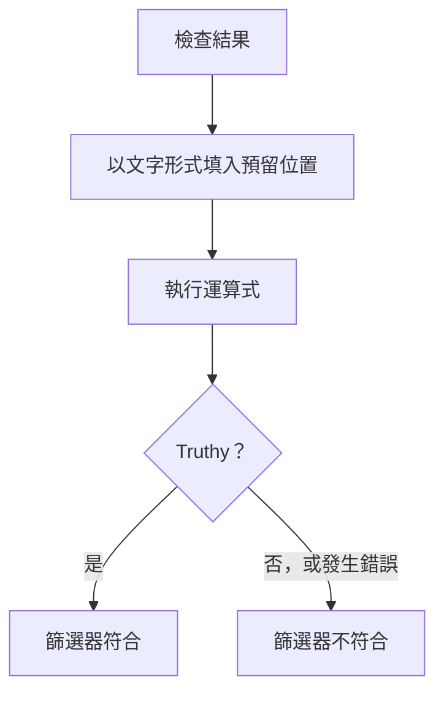

# JavaScript 運算式

**JavaScript Expression** 條件篩選器會以一行 JavaScript 而不是固定的比較，來判斷監測器的條件是否成立。當內建篩選器無法表達條件時使用它——例如 JSON 回應深處的某個欄位、兩個值之間的比較，或以 `&&` 和 `||` 組合的多項檢查。

:::cards
- [運作方式](#運作方式): 先填入預留位置，再執行運算式。
- [變數](#各監測器類型的變數): 每種監測器類型提供的內容。
- [範例](#範例): 適用於 API、傳入請求和資料庫的運算式。
- [引號規則](#引號規則): 幾乎每個人都會犯的錯誤。
:::

## 運作方式

運算式執行之前，其中的每個 `{{variable}}` 預留位置都會被替換為監測器最近一次檢查中的值——以純文字形式。接著結果會以 JavaScript 執行。如果它得出一個真值（truthy），篩選器就符合；其他任何結果（包括錯誤）都表示不符合。



由於預留位置是以文字形式替換，`{{responseBody.item}}` 會變成原始值。字串必須以引號括住才會是 JavaScript 字串；數字或布林值則不需要——請參閱 [引號規則](#引號規則)。運算式會在 OneUptime 伺服器上的隔離沙箱中執行。

## 新增 JavaScript Expression 篩選器

:::steps
### 開啟條件

在監測器上開啟 **設定 → 條件** 並點選 **編輯監測條件**，或者使用 **建立監測器** 的 **條件** 步驟。在您要修改的條件中操作，或者點選 **新增條件準則** 建立新的條件。

### 新增篩選器

在 **篩選器** 下點選 **新增篩選器**，將其 **篩選器類型** 設為 **JavaScript Expression**。**篩選條件** 為 **Evaluates To True**。

### 撰寫運算式

在 **值** 中輸入運算式，使用 [該監測器類型的變數](#各監測器類型的變數)。篩選器下方的連結 **Read documentation for using JavaScript expressions here.** 會開啟本頁面。

### 儲存

儲存監測器。篩選器會在監測器的下一次檢查時評估。
:::

## 各監測器類型的變數

JavaScript 運算式適用於 Website、API、Incoming Request、Incoming Email、SQL Query 和 Database Health 監測器。

### 網站和 API 監測器

| 變數 | 說明 | 類型 |
| --- | --- | --- |
| `responseBody` | 回應內文。如果回應內文是 JSON，會被剖析；否則（例如 HTML 或 XML）是字串。 | `string` 或 `JSON` |
| `responseHeaders` | 回應標頭，名稱為小寫。 | `Dictionary<string>` |
| `responseStatusCode` | 回應狀態碼。 | `number` |
| `responseTimeInMs` | 回應時間，單位為毫秒。 | `number` |
| `isOnline` | 監測器是否將該回應視為上線。 | `boolean` |

### 傳入請求監測器

| 變數 | 說明 | 類型 |
| --- | --- | --- |
| `requestBody` | 請求內文。 | `string` 或 `JSON` |
| `requestHeaders` | 請求標頭，名稱為小寫。 | `Dictionary<string>` |

### SQL 查詢監測器

| 變數 | 說明 | 類型 |
| --- | --- | --- |
| `rowCount` | 查詢回傳的列數。 | `number` |
| `scalarValue` | 第一列的第一欄。 | 任意 |
| `firstRow` | 第一列，以欄/值配對的形式。 | `JSON` |
| `executionTimeInMs` | 查詢所花的時間，單位為毫秒。 | `number` |
| `queryError` | 查詢錯誤（如果有）。 | `string` |
| `isOnline` | 資料庫是否可以連線且查詢成功。 | `boolean` |

### 資料庫健康狀態監測器

`isOnline`、`engineVersion`、`connectionError`、`collectedGroups`、`unavailableGroups` 和 `metrics`。請參閱資料庫健康狀態監控頁面上的 [JavaScript 運算式變數](/docs/monitor/database-health-monitor#javascript-運算式變數)。

### 傳入郵件監測器

該篩選器可用，但沒有繫結任何郵件欄位：運算式無法讀取主旨、寄件者、內文或收件者。請改用郵件篩選器類型——請參閱 [傳入郵件監控](/docs/monitor/incoming-email-monitor#可用的篩選器類型)。

## 範例

下面每一行都是一個完整的運算式。對於如下的 JSON 回應內文：

```json
{
  "item": "hello",
  "count": 3,
  "items": [{ "name": "hello" }]
}
```

| 運算式 | 何時符合 |
| --- | --- |
| `"{{responseBody.item}}" === "hello"` | `item` 欄位為 `hello`。 |
| `{{responseBody.count}} > 2` | `count` 欄位大於 2。 |
| `"{{responseBody.items[0].name}}" === "hello"` | `items` 的第一個元素名稱為 `hello`。 |
| `{{responseStatusCode}} === 200 && {{responseTimeInMs}} < 500` | 狀態為 200，且回應花不到半秒。 |
| `/hel+o/.test("{{responseBody.item}}")` | `item` 欄位符合一個規則運算式。 |
| `"{{responseHeaders.content-type}}".startsWith("application/json")` | 回應是 JSON。標頭名稱為小寫。 |

以 `&&` 和 `||` 組合條件，並以括號分組：

```javascript
({{responseStatusCode}} === 200 || {{responseStatusCode}} === 204) && {{responseTimeInMs}} < 1000
```

對於以 `Content-Type: application/json` 接收 `{"status": "degraded", "region": "eu"}` 的傳入請求監測器：

```javascript
"{{requestBody.status}}" === "degraded" && "{{requestBody.region}}" === "eu"
```

對於查詢回傳計數的 SQL 查詢監測器，在計數過高或查詢過慢時發出警示：

```javascript
{{scalarValue}} > 50 || {{executionTimeInMs}} > 2000
```

對於資料庫健康狀態監測器，請對整個 `metrics` 物件做索引來讀取某個指標——序列名稱中包含點，因此不能放在大括號內：

```javascript
{{metrics}}['oneuptime.monitor.database.connections.used.percent'] > 90
```

## 引號規則

`{{var}}` 會被替換為值，以文字形式。若要比較字串，請以引號括住，例如 `"{{responseBody.item}}" === "hello"`；若要比較數字，則不加引號，例如 `{{responseStatusCode}} === 200`。

| 值類型 | 寫法 | 範例 |
| --- | --- | --- |
| 字串 | 加引號 | `"{{responseBody.status}}" === "ok"` |
| 數字 | 不加引號 | `{{responseTimeInMs}} < 500` |
| 布林值 | 不加引號 | `{{isOnline}} === true` |
| 物件或陣列 | 不加引號，然後做索引 | `{{responseHeaders}}['content-type']` |

需要注意三點：

- **單獨一個加了引號的預留位置永遠為真。** 當欄位為 `false` 時，`"{{responseBody.healthy}}"` 是非空字串 `"false"`。請進行比較：`"{{responseBody.healthy}}" === "true"`，或者不加引號：`{{responseBody.healthy}} === true`。
- **值不會被跳脫。** 包含雙引號或換行的值會讓字串提前結束，運算式隨之失敗。若要在 HTML 頁面中尋找文字，請改用 **回應內文** 篩選器。
- **不存在的路徑會保持原樣。** 如果檢查結果中沒有這樣的欄位，`{{responseBody.item}}` 會原樣留在運算式中，這通常是語法錯誤——因此篩選器不符合。

## 限制

運算式有 5 秒的執行時間。花費更久或擲回錯誤的運算式不符合，錯誤會寫入 OneUptime 伺服器記錄。

## 疑難排解

:::details 運算式從不符合
先檢查引號：沒有加引號的字串預留位置會變成一個裸字，這是語法錯誤，而錯誤永遠不會符合。接著檢查該路徑是否存在於檢查結果中——不存在之路徑的預留位置不會被填入。
:::

:::details 運算式總是符合
單獨一個加了引號的預留位置是非空字串，永遠為 truthy。請將它與某個值進行比較。
:::

## 後續步驟

:::cards
- [事件與警示範本](/docs/monitor/incident-alert-templating): 在事件標題和描述中使用相同的預留位置。
- [API 監控](/docs/monitor/api-monitor): 檢查 HTTP 端點及其回應。
- [傳入請求監控](/docs/monitor/incoming-request-monitor): 評估其他系統傳送給您的請求。
:::
