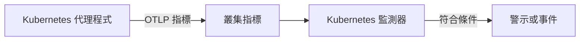

# Kubernetes 監控

Kubernetes 監測器依據 OneUptime Kubernetes 代理程式從叢集傳送的指標發出警示，涵蓋節點、Pod、容器、工作負載、自動調整器和控制平面。你可以從現成的警示範本開始，選擇單一指標，或撰寫自己的查詢，然後設定開啟警示或事件的閾值。

:::cards
- [安裝代理程式](/docs/monitor/kubernetes-agent): 一個 Helm 指令就能把叢集接入 OneUptime。
- [建立監測器](#建立-kubernetes-監測器): 選擇叢集，然後選擇範本、指標或查詢。
- [警示範本](#現成的警示範本): 十七個現成的警示，從 CrashLoopBackOff 到 etcd。
- [條件](#監控條件): 靜態閾值和異常偵測。
:::

## 運作方式

代理程式透過 OTLP 把叢集的指標傳送到 OneUptime，每一筆都帶有叢集名稱（`k8s.cluster.name`，也就是 chart 的 `clusterName`）。來自新名稱的第一批資料會把叢集註冊到 **Kubernetes** 下，此後就能在 Kubernetes 監測器中選擇該叢集。監測器每分鐘在其 **時間範圍** 內查詢這些指標、加以彙總，並把結果與條件比較。

## 開始之前

- 叢集中正在執行 OneUptime Kubernetes 代理程式。請參閱 [Kubernetes 代理程式(Helm 安裝)](/docs/monitor/kubernetes-agent)；安裝後幾分鐘，叢集就會出現在 **Kubernetes** 下。
- 控制平面範本（**etcd No Leader**、**API Server Request Saturation**、**Scheduler Backlog**）需要代理程式的控制平面擷取，也就是 `controlPlane.enabled`。代管叢集（EKS、GKE、AKS）不公開這些端點，因此在那裡這些監測器永遠收不到資料。

## 建立 Kubernetes 監測器

:::steps
### 開始新的監測器

前往 **監測器** 並按一下 **建立監測器**。在 **更多監測器類型** 下選擇 **Kubernetes**，或在搜尋方塊中輸入 `k8s`。

### 選擇叢集

在 **Kubernetes叢集** 中選擇它。清單中包含代理程式回報過的所有叢集。

### 選擇要監控的內容

使用以下三個分頁之一：

| 分頁 | 你要選擇的內容 |
| --- | --- |
| **Quick Setup** | 一個 [現成的警示範本](#現成的警示範本)。它會填入指標、範圍、時間範圍和條件；你仍然可以變更 **時間範圍**。 |
| **Custom Metric** | [指標目錄](#指標目錄) 中的一個指標，接著是它的 **資源範圍**、篩選器、**彙總**（平均、最大值、最小值、總和或計數）和 **時間範圍**。 |
| **進階** | **資源範圍**、篩選器和 **時間範圍**，以及在 **選擇指標** 下撰寫的自訂指標查詢和公式，並附上結果的即時圖表。 |

### 設定條件

設定監測器何時變更狀態，以及何時開啟警示或事件，請參閱 [監控條件](#監控條件)。範本已經填好這些內容：請檢查閾值、嚴重程度和待命原則。

### 儲存監測器

完成表單並儲存。監測器會出現在 **監測器** 下，從第一次評估起，它的狀態就依照你的條件變化。
:::

## 設定選項

### 資源範圍與篩選器

**資源範圍** 設定評估指標的層級，並決定表單顯示哪些篩選器。所有篩選器都是選用的。

| 範圍 | 監控對象 | 篩選器 |
| --- | --- | --- |
| 叢集 | 整個叢集 | — |
| 命名空間 | 某個命名空間中的資源 | **命名空間** |
| 工作負載 | Deployment、StatefulSet、DaemonSet、Job 或 CronJob | **命名空間**、**工作負載名稱** |
| 節點 | 叢集中的一個節點 | **節點名稱** |
| Pod | 一個 Pod | **命名空間**、**Pod 名稱** |

### 時間範圍

**時間範圍** 是每次評估監測器時指標查詢涵蓋的視窗，從 **Past 1 Minute** 到 **Past 365 Days**。較短的視窗（1 到 15 分鐘）適合發出警示；較長的視窗可以平滑雜訊較多的指標。

### 指標查詢與公式

在 **進階** 分頁上，每個查詢都會指定一個指標、其值的彙總方式，以及選用的屬性篩選器。**公式** 以算術組合多個查詢，例如節點使用率範本會把使用量除以可配置容量。

## 指標目錄

**Custom Metric** 分頁依資源類型分組提供以下指標：

| 類別 | 指標 |
| --- | --- |
| Pod | Pod CPU Usage, Pod Memory Usage, Pod Phase (Code), Pod Filesystem Usage, Pod Memory Limit Utilization, Pod CPU Limit Utilization, Pod Network I/O (Cumulative, Both Directions) |
| 節點 | Node CPU Usage, Node Allocatable CPU, Node Memory Usage, Node Filesystem Usage, Node Allocatable Memory, Node Ready Condition, Node Filesystem Available |
| 容器 | Container Restarts, Container CPU Limit, Container CPU Request, Container Memory Limit, Container Memory Request, Container Ready |
| 工作負載 | Deployment Available Replicas, Deployment Desired Replicas, DaemonSet Misscheduled Nodes, DaemonSet Ready Nodes, StatefulSet Ready Replicas, Job Failed Pods, Job Successful Pods |
| HPA | HPA Current Replicas, HPA Desired Replicas, HPA Max Replicas, HPA Min Replicas |
| 控制平面 | etcd Has Leader, API Server In-Flight Requests, Scheduler Pending Pods |

> [!NOTE]
> **Pod CPU Usage** 和 **Node CPU Usage** 的單位是核心而不是百分比：`0.18` 表示 0.18 個核心。**Pod Phase (Code)** 指標是一個代碼（1 Pending、2 Running、3 Succeeded、4 Failed、5 Unknown），請以最大值或最小值彙總，切勿使用總和。只有在代理程式的控制平面擷取開啟時，才會收到控制平面指標。

## 監控條件

### 評估的內容

這些監測器一律評估 **Metric Value**，也就是所設定指標查詢或公式的值。條件表單中沒有篩選器類型選擇器；它會顯示 **指標**、**彙總**、**條件** 和 **Threshold**。

### 彙總類型

| 彙總 | 說明 |
| --- | --- |
| 平均 | 時間視窗內的平均值 |
| 總和 | 所有值的總和 |
| Maximum Value | 時間視窗內的最高值 |
| Minimum Value | 時間視窗內的最低值 |
| All Values | 所有值都必須符合條件 |
| Any Value | 至少有一個值符合即可 |

### 條件類型

靜態閾值會與你輸入的 **Threshold** 比較：**Greater Than**、**Less Than**、**Greater Than Or Equal To**、**Less Than Or Equal To** 和 **Equal To**。

以基準為依據的異常偵測不需要閾值。選擇以下其中一個條件後，表單會改為顯示 **敏感度** 和 **基準視窗**：

| 條件 | 值出現以下情況時符合 |
| --- | --- |
| **Anomalously High** | 高於預期範圍 |
| **Anomalously Low** | 低於預期範圍 |
| **Anomalous** | 往任一方向偏離預期範圍 |

每個樣本都會與依 **基準視窗**（預設 14 天；也可選 28、60 或 90 天）建立的、一週中同一小時的基準比較。**敏感度** 決定預期範圍的寬度：**低 (4σ — 僅限明顯偏差)**、預設的 **中 (3σ — 建議)**，或 **高 (2σ — 雜訊較多，適用於非常穩定的服務)**。在累積到至少所選基準視窗長度的指標歷史之前，異常條件會停留在「Learning」狀態，不會產生警示。

**更多欄位** 下的 **如果沒有資料** 決定查詢在視窗內沒有傳回任何內容時的處理方式：**Ignore**（預設）不符合，**觸發器** 把靜默視為問題，**Treat As Zero** 以零比較。OneUptime 本身未接收資料的時間永遠不算是沒有資料：視窗中包含這類時間的檢查會改為等待，詳見 [OneUptime 未接收資料時](/docs/monitor/when-oneuptime-is-not-receiving)。

## 現成的警示範本

**Quick Setup** 分頁依類別列出這些範本。每個範本會填入兩個條件：一個在條件成立時把監測器標記為離線並開啟事件與警示，另一個在條件消失後讓監測器恢復上線。

| 範本 | 類別 | 觸發時機 | 嚴重程度 |
| --- | --- | --- | --- |
| CrashLoopBackOff Detection | 工作負載 | 自 Pod 建立以來，某個容器重新啟動超過 5 次 | 嚴重 |
| Pod Stuck in Pending | 排程中 | 在 15 分鐘視窗的每個樣本中，都有某個 Pod 處於 Pending 階段 | Warning |
| Node Not Ready | 節點 | 某個節點回報 NotReady | 嚴重 |
| High Node CPU Utilization | 節點 | 節點的平均 CPU 使用量超過其可配置 CPU 的 90% | Warning |
| High Node Memory Utilization | 節點 | 節點的平均記憶體使用量超過其可配置記憶體的 85% | Warning |
| Deployment Replica Mismatch | 工作負載 | Deployment 的可用複本數在 15 分鐘內一直少於期望值 | Warning |
| Job Failures | 工作負載 | 某個 Job 有失敗的 Pod | Warning |
| etcd No Leader | 控制平面 | etcd 沒有選出領導者 | 嚴重 |
| API Server Request Saturation | 控制平面 | API 伺服器在整個視窗內持有 200 個以上正在處理的請求 | 嚴重 |
| Scheduler Backlog | 排程中 | 排程器的待處理 Pod 佇列在 5 分鐘內一直不是空的 | Warning |
| High Node Disk Usage | 儲存空間 | 節點的檔案系統使用率超過 90% | Warning |
| DaemonSet Misscheduled Nodes | 工作負載 | DaemonSet 在不再符合其節點選取器、親和性或容忍度的節點上執行 Pod | Warning |
| High Node CPU Request Commitment | 節點 | 節點上容器的 CPU 請求總和超過其可配置 CPU 的 90% | Warning |
| High Node Memory Request Commitment | 節點 | 節點上容器的記憶體請求總和超過其可配置記憶體的 90% | Warning |
| HPA Saturated at Max Replicas | 工作負載 | HPA 執行在其 `maxReplicas` 的 90% 以上 | 嚴重 |
| Pod Memory Saturating Container Limit | 工作負載 | Pod 使用了超過其容器記憶體限制的 90% | 嚴重 |
| Pod CPU Saturating Container Limit | 工作負載 | Pod 使用了超過其容器 CPU 限制的 90% | Warning |

以個別物件指標為基礎的範本會分別評估每個節點、Pod、Deployment、Job、DaemonSet 或 HPA，因此有多個不健康 Pod 的叢集會為每個 Pod 建立一個事件，而不是整個叢集只建立一個。

> [!NOTE]
> **CrashLoopBackOff Detection** 範本讀取的是容器在目前 Pod 中的累計重新啟動次數，而不是速率。一個陷入當機迴圈後又恢復的容器，會讓警示一直保持開啟，直到它的 Pod 被取代為止。

### 捕捉原因，而不只是症狀

節點層級範本（High Node CPU Utilization、High Node Memory Utilization、Node Not Ready、Pod Stuck in Pending）會在資源耗盡鏈的*末端*觸發，此時叢集已經處於降級狀態。有三個範本會在鏈的*起點*觸發，而解決辦法通常就在那裡：

- **Pod Memory Saturating Container Limit** 和 **Pod CPU Saturating Container Limit** 會捕捉緊貼自身限制執行的工作負載。超過記憶體限制會立即遭到 OOMKill；超過 CPU 限制會讓核心對 Pod 進行節流，使它在不回報任何錯誤的情況下變慢。兩者都是 CrashLoopBackOff 和無法解釋的延遲的常見原因。
- **HPA Saturated at Max Replicas** 會捕捉已經沒有餘裕的自動調整器。每個 Pod 限制過低的工作負載會被節流或終止，這又會推高 HPA 據以調整的那個指標，於是自動調整器持續加入同樣資源不足的複本，直到碰到上限。解決辦法是提高限制；提高 `maxReplicas` 只會讓情況更糟。

在每個執行自動調整工作負載的命名空間中同時啟用它們：這個組合能區分「確實需要更多容量」和「每個 Pod 的資源不足」。

> [!NOTE]
> 兩個 Pod 限制範本會把 Pod 的使用量除以其各容器限制的**總和**，因此帶有 sidecar 的 Pod 也能正確量測。kubelet 回報的 Pod 記憶體包含可回收的頁面快取，所以大量讀寫檔案的工作負載可能在記憶體範本上一直偏高，卻從未遭到 OOMKill：請把它理解為「接近限制」，而不是「即將被終止」。

## 疑難排解

:::details 叢集不在 Kubernetes叢集 清單中
叢集會依據代理程式的資料自動註冊，使用安裝代理程式時設定的 `clusterName`。請檢查代理程式的 Pod 是否正在執行，以及叢集是否列在 **產品 → 基礎設施 → Kubernetes → 所有叢集** 下。[Kubernetes 代理程式(Helm 安裝)](/docs/monitor/kubernetes-agent) 說明了安裝方式，以及沒有資料到達時要檢查的內容。
:::

:::details 控制平面範本從不觸發
**etcd No Leader**、**API Server Request Saturation** 和 **Scheduler Backlog** 讀取的指標只有代理程式的控制平面擷取才會收集。請在代理程式的 Helm 值中開啟 `controlPlane.enabled`；它預設是關閉的。代管叢集（EKS、GKE、AKS）不公開這些端點，因此在這些叢集上，這些監測器永遠收不到資料。
:::

:::details CPU 閾值從不觸發
**Pod CPU Usage** 和 **Node CPU Usage** 的單位是核心而不是百分比，所以閾值 `80` 表示 80 個核心。請以核心為單位設定閾值，或從比較百分比的 **High Node CPU Utilization** 或 **Pod CPU Saturating Container Limit** 開始。
:::

:::details Pod 恢復後 CrashLoopBackOff Detection 仍保持開啟
範本讀取的是容器在目前 Pod 中的累計重新啟動次數，因此一旦超過 5，這個數字就不會再回落。Pod 被取代時（例如重新部署、驅逐或清空節點），警示才會解決。
:::

## 後續步驟

:::cards
- [Kubernetes 代理程式(Helm 安裝)](/docs/monitor/kubernetes-agent): 使用 Helm 安裝、升級和調整代理程式。
- [Kubernetes 代理程式](/docs/telemetry/kubernetes-agent): 命名空間篩選器、控制平面指標、日誌嚴重程度篩選器和 AI 代理程式。
- [指標監控](/docs/monitor/metrics-monitor): 針對任何指標發出警示，包括代理程式的自訂指標和 eBPF 指標。
- [事件與警示範本](/docs/monitor/incident-alert-templating): 把超出閾值的 Pod 或節點寫進事件標題。
:::
