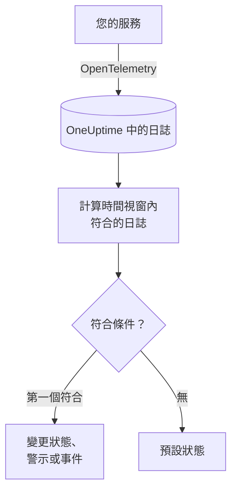
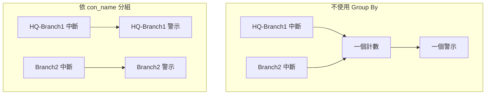

# 日誌監控

日誌監測器會在一個時間視窗內，計算您的服務傳送到 OneUptime、且符合您篩選器（文字、嚴重性、服務、屬性）的日誌。當計數符合您的條件時，它會變更監測器的狀態、建立警示或宣告事件。可以用它發現錯誤激增、某則特定的錯誤訊息，或已經停止寫日誌的服務。

:::cards
- [建立監測器](#建立日誌監測器): 選擇要計算的日誌以及何時發出警示。
- [如何評估](#如何評估): 時間視窗、計數與一分鐘的週期。
- [條件](#條件): 閾值、異常偵測與預設值。
- [依群組警示](#依群組警示group-by): 每個通道、使用者或介面各一個警示。
:::

## 運作方式



OneUptime 每分鐘計算一次符合監測器篩選器、且在其時間視窗內抵達的日誌。它會把這個計數由上而下與監測器的條件比較，第一個符合的條件決定接下來發生什麼。如果沒有任何條件符合，監測器會回到預設狀態。

## 開始之前

- 您的服務透過 OpenTelemetry（或 OneUptime 可接收的其他日誌來源）將日誌傳送到 OneUptime。請參閱 [OpenTelemetry](/docs/telemetry/open-telemetry)。
- 若要依日誌行中的某個值（例如通道名稱或使用者名稱）篩選或分組，請先用 [日誌管道](/docs/telemetry/log-pipelines) 把它轉成屬性。

## 建立日誌監測器

:::steps
### 開始建立新監測器

前往 **監測器**，點選 **建立監測器**。

### 選擇 Logs

在 **監測器類型** 下點選 **更多監測器類型**，然後在 **遙測** 下選擇 **日誌**，或在搜尋方塊中輸入 `logs`。輸入 **名稱**，然後點選 **下一步**。

### 選擇要計算的日誌

在 **日誌監測器設定** 中設定 **監測包含此文字的日誌**、**監測 (time) 內的日誌** 和 **日誌嚴重性**。留空的篩選器會符合所有日誌。篩選器下方的 **日誌預覽** 會顯示它們目前符合的日誌。

### 縮小範圍（選用）

開啟 **更多欄位**，依遙測服務、基礎架構實體或屬性篩選。若要每個通道、使用者或介面各收到一個警示，而不是整個監測器只有一個，請在 **Group by Attributes** 中加入該屬性（請參閱 [依群組警示](#依群組警示group-by)）。

### 設定條件

**監測器條件** 卡片一開始有兩個條件：沒有任何日誌符合時離線並建立事件；至少有一筆符合時上線。請把它們改成您想發出警示的情況（請參閱 [條件](#條件)）。

### 建立監測器

點選 **建立監測器**。監測器會在其 **概覽** 頁面開啟，第一次評估會在一分鐘內執行。
:::

## 查詢內容

| 欄位 | 符合什麼 | 預設值 |
| --- | --- | --- |
| **監測包含此文字的日誌** | 內文包含此文字的日誌，不區分大小寫。 | 空：所有日誌 |
| **監測 (time) 內的日誌** | 最近 5 秒到最近 24 小時內的日誌。 | **過去 1 分鐘** |
| **日誌嚴重性** | 具有所選任一嚴重性的日誌。 | 空：所有嚴重性 |
| **Group by Attributes** | 不是篩選器：對這些屬性值的每種組合分別計數。 | 空：一個計數 |
| **依遙測服務篩選**（在 **更多欄位** 中） | 來自所選任一服務的日誌。 | 空：所有服務 |
| **Filter by Infrastructure Entity**（在 **更多欄位** 中） | 來自所選任一主機、Pod、容器及其他實體的日誌。 | 空：所有實體 |
| **依屬性篩選**（在 **更多欄位** 中） | 屬性符合所有條件的日誌。每個條件都有自己的運算子，例如「等於」或「包含」。 | 空：無條件 |

日誌必須符合您設定的所有篩選器才會被計數。

### 日誌嚴重性

每筆日誌都會以七種嚴重性之一儲存。對於 OpenTelemetry 日誌，嚴重性來自日誌的嚴重性編號，因此請依嚴重性選擇，而不是依記錄器印出的文字選擇：

| 嚴重性 | OpenTelemetry 嚴重性編號 |
| --- | --- |
| **追蹤** | 1–4 |
| **Debug** | 5–8 |
| **Information** | 9–12 |
| **Warning** | 13–16 |
| **錯誤** | 17–20 |
| **Fatal** | 21–24 |
| **未指定** | 其他所有值 |

## 如何評估

- **每分鐘。** 日誌監測器不是由探測器檢查，因此沒有可設定的間隔，也沒有 **探測器與間隔** 頁面。
- **每次評估一個數字。** 監測器會計算符合所有篩選器、且在評估前的 **監測 (time) 內的日誌** 內抵達的日誌。設為 **過去 5 分鐘** 時，每次評估會回看五分鐘，因此相鄰評估的視窗會重疊。
- **沒有日誌就是計數 0。** 停止寫日誌的服務計數為 0，而預設的離線條件正是在找這種情況。
- **OneUptime 本身的停機不算沉默。** 只要時間視窗中包含 OneUptime 本身沒有接收資料的時間（正在重新啟動、升級或追趕積壓），檢查就會等待：狀態不會改變，也不會開啟或解決任何事件或警示。請參閱 [OneUptime 未接收資料時](/docs/monitor/when-oneuptime-is-not-receiving)。
- **條件由上而下。** 第一個符合的條件決定結果，因此請把最嚴重的放在最前面。分組的監測器運作方式不同：它會對每個群組檢查所有條件（請參閱 [條件的評估方式不同](#條件的評估方式不同)）。

每次狀態變更及其原因，都會記錄在監測器的 **狀態時間軸** 上。

## 條件

日誌監測器的條件只有一個 **篩選器類型**：**Log Count**，也就是視窗內符合的日誌數量。選擇一個 **篩選條件**，如果是閾值條件，再填寫 **值**。

| 篩選條件 | 當日誌數量…時符合 |
| --- | --- |
| **Greater Than** | 高於該值 |
| **Greater Than Or Equal To** | 等於或高於該值 |
| **Less Than** | 低於該值 |
| **Less Than Or Equal To** | 等於或低於該值 |
| **Equal To** | 正好等於該值 |
| **Anomalously High** | 高於每週這個時段的預期範圍 |
| **Anomalously Low** | 低於該範圍 |
| **Anomalous** | 往任一方向超出該範圍 |

異常條件沒有 **值**。請選擇 **敏感度**（Low、預設的 Medium 或 High）以及 14 天（預設）、28 天、60 天或 90 天的 **基準視窗**。OneUptime 會把計數換算成每分鐘的速率，並與該視窗內每週的同一時段比較。基準只涵蓋監測器的服務與嚴重性，不包含其文字與屬性篩選器。在每週這個時段累積足夠的歷史之前，條件仍在學習，不會觸發。

新的日誌監測器從以下條件開始：

| 條件 | 篩選器 | 效果 |
| --- | --- | --- |
| Check if … is offline | **Log Count** **Equal To** `0` | 將監測器標記為離線並宣告事件，事件會自動解決 |
| Check if … is online | **Log Count** **Greater Than** `0` | 將監測器標記為上線 |

> [!TIP]
> 若要針對錯誤而不是沉默發出警示，請把 **日誌嚴重性** 設為 **錯誤**，並把離線條件改為 **Log Count** **Greater Than** 視窗內您可以容忍的錯誤數量。

## 實例：錯誤激增

您希望在結帳服務五分鐘內記錄超過 50 筆錯誤時建立事件：

- **日誌嚴重性**：**錯誤**
- **監測 (time) 內的日誌**：**過去 5 分鐘**
- **依遙測服務篩選**：`checkout`
- 條件 1：**Log Count** **Greater Than** `50`：將監測器標記為離線並宣告事件
- 條件 2：**Log Count** **Less Than Or Equal To** `50`：將監測器標記為上線

連續四次評估：

| 時間 | 最近 5 分鐘的錯誤日誌 | 符合的條件 | 發生了什麼 |
| --- | --- | --- | --- |
| 10:00 | 12 | 2 | 監測器上線。 |
| 10:01 | 64 | 1 | 監測器變為離線，並宣告事件。 |
| 10:02 | 81 | 1 | 維持離線。事件已經開啟，因此不會宣告第二個。 |
| 10:06 | 9 | 2 | 監測器恢復上線，並且由於 **自動解決事件** 已開啟，事件會自行解決。 |

由於視窗重疊，一次錯誤爆發結束後，計數在最多五分鐘內仍會偏高。對於需要更快恢復的監測器，請使用較短的視窗。

## 依群組警示（Group By）

**Group by Attributes** 會把日誌監測器的計數拆分為每種不同屬性值組合各一個計數（每個 IPsec 通道、每個 VPN 使用者、每個防火牆介面各一個），並對每個群組分別評估條件。它相當於指標監測器的 [Group By](/docs/monitor/metrics-monitor#依序列警示group-by) 在日誌上的對應功能。

### 每個群組一個警示

沒有 Group By 時，監看已終止 IPsec 通道的監測器只是整個監測器的一個計數，並發出 **整個監測器一個警示**。在該警示開啟期間，第二條通道中斷不會帶來任何新內容：監測器已經在警示了。

依通道名稱設定 Group By 後，通道 `HQ-Branch1` 的終止會開啟它自己的警示，十分鐘後通道 `Branch2` 的終止會在旁邊開啟 **第二個獨立的警示**。



### 獨立解決

每個群組的警示或事件會各自獨立解決。一旦某個群組不再符合條件（`HQ-Branch1` 在時間視窗內不再記錄終止），它的警示就會解決，而 `Branch2` 的警示會一直開啟，直到 `Branch2` 也停止為止。一個群組的恢復絕不會關閉另一個群組的警示。

日誌監測器看到的是事件，而不是狀態：只要某個群組在整個時間視窗內沒有記錄任何符合條件的內容，它的警示就會解決，無論通道是否已經恢復。

### 範例：每條 Sophos IPsec 通道一個警示

這裡假設防火牆的 syslog 行由不帶目標前綴的 [Key=Value 剖析器](/docs/telemetry/log-pipelines#keyvalue-parser) 拆分為屬性，因此通道名稱就是屬性 `con_name`：

```text
log_component="IPSec" con_name="HQ-Branch1" status="Terminated" message="IPSec Connection HQ-Branch1 between 10.171.4.117 and 10.171.4.118 for Child HQ-Branch1 terminated."
```

:::steps
1. 建立一個 **日誌** 監測器。
2. 將 **監測包含此文字的日誌** 設為 `terminated`，將 **監測 (time) 內的日誌** 設為 **過去 5 分鐘**。
3. 在 **更多欄位** 下加入屬性篩選器 `log_component` = `IPSec`。
4. 在 **Group by Attributes** 下加入 `con_name`。
5. 加入一個使用篩選器 **Log Count** **Greater Than** `0` 的條件，用來建立標題為 `IPsec tunnel {{con_name}} terminated` 的警示或事件。
:::

現在，每條記錄了終止的通道都會收到自己的警示（`IPsec tunnel HQ-Branch1 terminated`、`IPsec tunnel Branch2 terminated`），每個警示各自獨立解決。

### 標題與描述中的群組值

每個 Group By 屬性的值，都是警示或事件的標題、描述與修復說明中的 [範本變數](/docs/monitor/incident-alert-templating)，與指標序列的標籤一樣：依 `con_name` 分組就能使用 `{{con_name}}`。帶有點號的鍵會被當作路徑讀取，因此 `sophos.con_name` 對應 `{{sophos.con_name}}`。如果標題中還沒有出現群組，群組會被附加到標題後（`IPsec tunnel terminated - Con Name: HQ-Branch1`），而 `{{seriesResourceSuffix}}` 與 `{{seriesResourceSummary}}` 的用法與指標監測器相同。

### 群組如何計數

- 最多 10 個屬性。它們的值的每種不同組合就是一個群組。
- 缺少某個 Group By 屬性的日誌，會以該屬性的 **空值** 計數，因此沒有該屬性的日誌會自成一個群組，其警示不會為該屬性顯示任何值。如果所有警示抵達時都沒有群組值，請檢查屬性的鍵：帶目標前綴的日誌管道會把 `con_name` 存為 `sophos.con_name`。
- 超過 256 個字元的群組值會被截斷為 256 個字元。
- 每次檢查最多評估 **100 個群組**：日誌最多的 100 個。如果符合的群組更多，其餘群組會在該次檢查中被略過，並記錄一則警告；請縮小監測器的篩選器以涵蓋它們。

### 條件的評估方式不同

- **所有條件都會被評估**，與分組的指標監測器一樣，因此不同群組可以同時符合不同的條件。符合兩個條件的群組仍然只會收到一個警示，來自第一個條件；所以請依照從最嚴重到最不嚴重的順序排列條件。
- **只有在時間視窗內記錄過內容的群組才存在。** 因此 **Equal To 0** 與 **Less Than** 條件只會對至少記錄過一次的群組觸發；若要在日誌完全不再抵達時發出警示，請使用不帶 Group By 的監測器。
- **異常偵測**（**Anomalously High**、**Anomalously Low**、**Anomalous**）不會依群組評估（其基準涵蓋整個監測器），因此這些篩選器在分組的監測器上永遠不會符合。
- 監測器的狀態會跟隨任一群組符合的第一個條件。當沒有任何群組符合任何條件時，監測器會回到預設狀態。

## 疑難排解

:::details 監測器離線，但我的服務正在寫日誌
計數為 0，表示篩選器與服務傳送的任何日誌都不符合。開啟監測器的 **條件** 頁面（在 **設定** 下），點選 **Edit Monitoring Criteria**：**日誌預覽** 會顯示篩選器目前選取的內容。最常見的原因是依記錄器印出的文字而不是嚴重性編號選擇了嚴重性（請參閱 [日誌嚴重性](#日誌嚴重性)）、服務或屬性篩選器不符合，以及時間視窗短於服務兩筆日誌之間的間隔。
:::

:::details 出現了激增，但沒有任何警示
條件由上而下檢查，第一個符合的條件決定結果。如果在您預期的條件之上有一個寬鬆的條件，例如 **Log Count** **Greater Than** `0`，它會先符合並擋住其餘條件。請把最嚴重的條件放在最上面。
:::

:::details 異常條件從不觸發
它仍在學習：它所比較的每週時段還沒有足夠的歷史。在設定了 **Group by Attributes** 的監測器上，異常條件永遠不會符合；請在那裡使用閾值。
:::

:::details 群組警示抵達時沒有群組值
缺少 Group By 屬性的日誌會以空值計數。請在日誌瀏覽器中檢查鍵的確切名稱：帶目標前綴的日誌管道會把 `con_name` 存為 `sophos.con_name`。
:::

## 後續步驟

:::cards
- [日誌管道](/docs/telemetry/log-pipelines): 把日誌行拆分為可用於篩選與分組的屬性。
- [事件與警示範本](/docs/monitor/incident-alert-templating): 把群組值與計數放進標題與描述。
- [指標監控](/docs/monitor/metrics-monitor): 依主機或依容器針對指標發出警示。
- [追蹤監控](/docs/monitor/traces-monitor): 以同樣的方式針對失敗的 Span 發出警示。
:::
