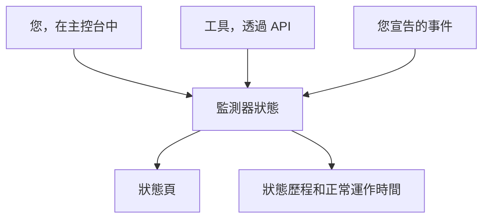

# 手動監控

手動監測器沒有自動檢查：它的狀態就是您在主控台中或透過 API 設定的狀態。用它在狀態頁和事件中呈現 OneUptime 無法自行檢查的東西——第三方相依項目、實體系統、業務流程。

:::cards
- [建立一個](#建立手動監測器): 在主控台中只需一個步驟。
- [變更其狀態](#更新狀態): 在主控台中，或透過 API 從您自己的工具變更。
- [事件和警示](#事件和警示): 在同一個步驟中宣告事件並設定狀態。
:::

## 何時使用手動監測器

| 使用情境 | 說明 |
| --- | --- |
| 第三方服務 | 追蹤您依賴但無法直接監測的外部服務的狀態。 |
| 實體基礎架構 | 呈現沒有網路監測的硬體或實體系統。 |
| 業務流程 | 追蹤會影響服務狀態的非技術性流程。 |
| 由 API 驅動的狀態 | 讓您自己的工具透過 OneUptime API 設定狀態。 |
| 狀態頁預留位置 | 在狀態頁上顯示在 OneUptime 之外管理的元件。 |

發布了狀態頁的供應商不需要它：[外部狀態頁監控](/docs/monitor/external-status-page-monitor) 會替您追蹤那個頁面。

## 運作方式

手動監測器沒有監測間隔、探測器或條件。它的狀態會維持您設定的樣子，直到您、透過 API 的工具，或您宣告的事件變更它——新的狀態會顯示在監測器出現的每個地方。



每次變更都是監測器 **狀態時間軸** 上的一個項目，因此它的正常運作時間和狀態歷程會像其他監測器一樣保留下來。手動監測器不是主動式監測器，因此在 OneUptime Cloud 上它不會讓您的帳單增加任何費用。

## 建立手動監測器

:::steps
### 開始建立新監測器

前往 **監測器**，點選 **建立監測器**。

### 選擇 Manual

在 **監測器類型** 下點選 **更多監測器類型**，然後在 **其他** 下選擇 **Manual**。

### 命名並建立

輸入 **名稱**（如果需要，也可以在 **更多欄位** 下輸入 **描述**），然後點選 **建立監測器**。手動監測器不需要其他任何內容，因此會從這第一個步驟直接建立。
:::

## 更新狀態

### 在主控台中

:::steps
1. 開啟監測器，在其側邊選單中點選 **狀態時間軸**。
2. 點選 **建立監測器 狀態 事件**。
3. 選擇 **監測器狀態**。**開始** 為現在；如果變更發生得更早，請設定一個更早的時間。
4. 點選 **建立監測器 狀態 事件**。新狀態會立即顯示在監測器上，以及列出它的每個狀態頁上。
:::

### 透過 API

將新狀態作為監測器狀態事件傳送，並在 `ApiKey` 標頭中放入您專案的 [API 金鑰](/docs/api-reference/api-reference)：

```bash
curl -X POST https://oneuptime.com/api/monitor-status-timeline \
  -H "ApiKey: $ONEUPTIME_API_KEY" \
  -H "Content-Type: application/json" \
  -d '{"data": {"monitorId": "<monitor id>", "monitorStatusId": "<monitor status id>"}}'
```

- `monitorId` 是監測器的 ID：點選其頁面上的 **ID** 那一行即可複製。
- `monitorStatusId` 是要設定的狀態：在 **監測器 → 設定 → 監測器狀態** 中，在該狀態所在的列選擇 **顯示 ID**。
- `startsAt` 是選用的。省略時，變更會從現在開始。
- 在自行託管的安裝中，請將請求傳送到您自己的主機，而不是 `oneuptime.com`。

傳送監測器已有的狀態會遭到拒絕，並回傳 `Monitor Status cannot be same as previous status.`，而且不會記錄任何內容，因此每次執行都會回報的工具可以忽略這個回應。

## 事件和警示

在任何選擇監測器的地方，手動監測器都可以像其他監測器一樣被選擇：

- 宣告事件，並在 **監測器** 下選擇該監測器。使用 **將監測器狀態變更為**，宣告事件時也會設定監測器的狀態；解決事件時，監測器會回到運作中，除非它上面還有另一個未結束的事件。請參閱 [宣告事件](/docs/incidents/declaring-incidents#第-2-步受影響的資源)。
- 為它建立警示，用於您的團隊需要處理、但不必告知客戶的問題。
- 將它加入狀態頁，向客戶展示您以人工方式留意的相依項目。

## 後續步驟

:::cards
- [建立監測器](/docs/monitor/create-monitor): 會替您執行檢查的監測器類型。
- [外部狀態頁監控](/docs/monitor/external-status-page-monitor): 改為自動追蹤供應商的狀態頁。
- [狀態頁概觀](/docs/status-pages/index): 向客戶顯示監測器的狀態。
:::
