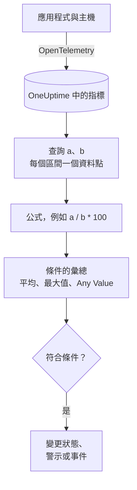

# 指標監控

指標監測器會查詢您的應用程式與基礎架構傳送到 OneUptime 的指標，在需要比率或總量時用公式組合它們，並在一個滾動的時間範圍內把結果與您的條件比較。可以用它監控請求速率、錯誤率、佇列深度、CPU、記憶體與磁碟（任何數值序列）；分組後，每台主機或每個容器各有一個警示。

:::cards
- [建立監測器](#建立指標監測器): 查詢、公式、時間範圍與條件。
- [如何評估](#如何評估): 資料點、公式與條件的彙總。
- [實例](#實例不斷增長的佇列): 同一組資料在每種彙總下的結果。
- [依序列警示](#依序列警示group-by): 每台主機、每個容器或每個掛載點一個警示。
:::

## 運作方式

OneUptime 每分鐘會在監測器的時間範圍內執行它的每個指標查詢。查詢在每個時間區間傳回一個資料點，公式會逐個區間組合查詢。接著，每個條件會把它所檢查的查詢或公式的資料點歸納為一個結果（平均值、最大值，或對每個點的檢驗），並與其閾值比較。

## 開始之前

- 您的應用程式或基礎架構透過 OpenTelemetry 將指標傳送到 OneUptime。請參閱 [OpenTelemetry](/docs/telemetry/open-telemetry)。
- 了解指標的名稱，以及您想篩選或分組的屬性。**指標** 與 **Group by** 清單只會提供 OneUptime 已收到的名稱與屬性。

## 建立指標監測器

:::steps
### 開始建立新監測器

前往 **監測器**，點選 **建立監測器**。

### 選擇 Metrics

在 **監測器類型** 下點選 **更多監測器類型**，然後在 **遙測** 下選擇 **指標**，或在搜尋方塊中輸入 `metrics`。輸入 **名稱**，然後點選 **下一步**。

### 選擇時間範圍

在 **指標監測器設定** 中選擇 **時間範圍**：每次評估回看多遠。它預設為 **Past 1 Minute**。

### 新增指標查詢

在 **選擇指標** 下選擇一個 **指標**，以及用 **Aggregate by** 彙總它的方式。開啟 **Filters & grouping** 可以依屬性篩選，或用 **Group by** 分組。點選 **新增指標** 新增另一個查詢，或點選 **新增公式** 組合它們。查詢下方的圖表會預覽該時間範圍，讓您看到條件將要檢查的值。

### 設定條件

在 **監測器條件** 中，每個條件選擇要檢查的 **指標**（查詢或公式）、它的 **彙總**、一個 **條件** 和一個 **Threshold**。新監測器一開始擁有的條件，請參閱 [條件](#條件)。

### 建立監測器

點選 **建立監測器**。監測器會在其 **概覽** 頁面開啟，第一次評估會在一分鐘內執行。
:::

## 查詢內容

### 指標查詢

| 欄位 | 作用 | 預設值 |
| --- | --- | --- |
| **指標** | 要查詢的指標。 | 必填 |
| **Aggregate by** | 每個時間區間中的值如何合併為一個資料點：平均、總和、Min、Max、計數，或某個百分位數（P50、P75、P90、P95 或 P99）。 | 平均 |
| **Filter by attributes**（在 **Filters & grouping** 中） | 只保留屬性符合這些條件的序列。 | 無篩選 |
| **Group by**（在 **Filters & grouping** 中） | 這些屬性的每個唯一值一個序列（請參閱 [依序列警示](#依序列警示group-by)）。 | 一個序列 |

每個查詢與公式都會依新增的順序獲得一個變數（`a`、`b`、`c` 等）。

### 公式

公式會用 `+`、`-`、`*`、`/`、`%`、`^` 和括號，逐個區間組合查詢變數。變數前面可以加 `$`，也可以不加：

- `a / b * 100`：`a` 占 `b` 的比例，以百分比表示
- `a + b`：兩個指標相加
- `a - b`：兩者之差

### 滾動時間視窗

**時間範圍** 決定每次評估回看多遠：**Past 1 Minute**、**Past 5 Minutes**、**Past 10 Minutes**、**Past 15 Minutes**、**Past 30 Minutes**、**Past 1 Hour**、**Past 2 Hours**、**Past 3 Hours**、**Past 6 Hours**、**Past 12 Hours**、**Past 1 Day**、**Past 2 Days**、**Past 3 Days**、**Past 7 Days**、**Past 14 Days**、**Past 30 Days**、**Past 60 Days**、**Past 90 Days**、**Past 180 Days** 或 **Past 365 Days**。

範圍越長，每個時間區間越寬，一個資料點代表的時間就越長：

| 時間範圍 | 每個資料點代表 |
| --- | --- |
| Past 1 Minute 到 Past 3 Hours | 1 分鐘 |
| Past 6 Hours、Past 12 Hours | 5 分鐘 |
| Past 1 Day | 15 分鐘 |
| Past 2 Days、Past 3 Days | 30 分鐘 |
| Past 7 Days | 1 小時 |
| Past 14 Days、Past 30 Days | 1 天 |
| Past 60 Days 到 Past 180 Days | 1 週 |
| Past 365 Days | 1 個月 |

## 如何評估

- **每分鐘。** 指標監測器不是由探測器檢查，因此沒有可設定的間隔，也沒有 **探測器與間隔** 頁面。
- **先查詢，後公式。** 每個查詢會依其 **Aggregate by**，在時間範圍的每個時間區間傳回一個資料點。公式會根據查詢的資料點逐個區間計算。
- **接著是條件的彙總。** 每個條件會把其 **指標** 的資料點歸納為與閾值比較的值：

| 彙總 | 條件檢查的對象… |
| --- | --- |
| 平均 | 資料點的平均值 |
| 總和 | 資料點的總和 |
| Maximum Value | 最高的資料點 |
| Minimum Value | 最低的資料點 |
| All Values | 每個資料點：所有點都必須符合條件 |
| Any Value | 每個資料點：只要有一個點符合條件即可 |

- **條件由上而下。** 在沒有 Group By 的監測器上，第一個符合的條件決定結果，因此請把最嚴重的放在最前面。分組的監測器會對每個序列檢查所有條件（請參閱 [條件的評估方式不同](#條件的評估方式不同)）。
- **沒有資料不等於零。** 當查詢在時間範圍內沒有傳回資料點時，條件會依其 **更多欄位** 下 **如果沒有資料** 的設定處理：**Ignore**（預設：條件不符合）、**Treat As Zero** 或 **觸發器**。
- **OneUptime 本身的停機不算沉默。** 只要時間範圍中包含 OneUptime 本身沒有接收資料的時間（正在重新啟動、升級或追趕積壓），檢查就會等待：無論 **如果沒有資料** 如何設定，狀態都不會改變，也不會開啟或解決任何事件或警示。請參閱 [OneUptime 未接收資料時](/docs/monitor/when-oneuptime-is-not-receiving)。

## 條件

這些監測器一律評估 **Metric Value**：所設定的指標查詢或公式的彙總值。條件表單沒有篩選器類型選擇器，它會顯示 **指標**、**彙總**、**條件** 和 **Threshold**。如果指標有單位，請在閾值旁邊選擇單位。

| 條件 | 當值…時符合 |
| --- | --- |
| **Greater Than** | 高於閾值 |
| **Greater Than Or Equal To** | 等於或高於閾值 |
| **Less Than** | 低於閾值 |
| **Less Than Or Equal To** | 等於或低於閾值 |
| **Equal To** | 正好等於閾值 |
| **Anomalously High** | 高於每週這個時段的預期範圍 |
| **Anomalously Low** | 低於該範圍 |
| **Anomalous** | 往任一方向超出該範圍 |

異常條件沒有閾值。表單會改為顯示 **敏感度**（Low、預設的 Medium 或 High）和 **基準視窗**（預設 14 天，或 28、60、90 天），並把每個資料點與根據該視窗建立的每週同一時段基準比較。在每週這個時段累積足夠的歷史之前，條件仍在學習，不會產生警示。

新的指標監測器在第一個查詢上有兩個條件，彙總都是 **Any Value**：

| 條件 | 條件 | 效果 |
| --- | --- | --- |
| Check if … is offline | **Equal To** `0` | 將監測器標記為離線並宣告事件，事件會自動解決 |
| Check if … is online | **Greater Than** `0` | 將監測器標記為上線 |

> [!NOTE]
> 離線條件會在回報的值為 0 時觸發，而不是在沉默時觸發。若要在指標不再抵達時發出警示，請把它的 **如果沒有資料** 設為 **觸發器**。

## 實例：不斷增長的佇列

您希望結帳佇列持續很深時建立事件。查詢 `a` 是量測器 `checkout.queue.depth`，**Aggregate by** 為 Max，**時間範圍** 為 **Past 5 Minutes**。一次評估看到以下五個一分鐘的資料點：

| 分鐘 | 10:01 | 10:02 | 10:03 | 10:04 | 10:05 |
| --- | --- | --- | --- | --- | --- |
| `a` | 640 | 980 | 1,500 | 1,620 | 1,100 |

**指標** 為 `a`、**條件** 為 **Greater Than**、**Threshold** 為 `1000` 的條件，在每種 **彙總** 下會給出不同的答案：

| 彙總 | 與 1,000 比較的值 | 符合？ |
| --- | --- | --- |
| 平均 | 1,168 | 是 |
| 總和 | 5,840 | 是 |
| Maximum Value | 1,620 | 是 |
| Minimum Value | 640 | 否 |
| All Values | 640、980、1,500、1,620、1,100 | 否：有兩個點不高於 1,000 |
| Any Value | 640、980、1,500、1,620、1,100 | 是：1,500 高於 1,000 |

**平均** 會針對持續的積壓發出警示，並忽略單獨一分鐘的深佇列；**All Values** 會等到範圍內每一分鐘都很深；**Any Value** 會在第一個深佇列的分鐘就發出警示。

## 依序列警示（Group By）

在指標查詢上設定 **Group by**，會把該查詢拆分為每個唯一屬性值一個序列（每台主機、每個容器、每個掛載點各一個），設定了 Group By 的監測器會獨立評估每個序列。這一個設定就是「整個叢集不健康」與「`prod-db-01` 不健康」之間的差別。

### 每個群組一個警示

把 Group By 設為 `host.name` 後，監看五十台主機的磁碟使用率監測器會 **為每台超過閾值的主機各發出一個警示（或事件）**。主機 A 磁碟寫滿會開啟它自己的警示；十分鐘後主機 B 寫滿，會在旁邊開啟第二個獨立的警示。

沒有 Group By 時，同一個監測器只是一個純量：查詢會把所有主機合併為一個數字，監測器發出 **整個監測器一個警示**。在該警示開啟期間，第二台主機超過閾值不會產生任何結果（監測器已經在警示，沒有新的警示可發），值班工程師永遠不會知道主機 B 的情況。**設定 Group By 才能取得依主機的警示。** 如果您希望依主機、依容器或依掛載點收到呼叫，就設定它。

### 獨立解決

每個群組的警示都會追蹤自己的群組。當主機 A 回落到閾值以下時，它的警示會自行解決，而主機 B 的警示會一直開啟，直到主機 B 恢復。一個群組的恢復絕不會關閉另一個群組的警示。

### 條件的評估方式不同

- **分組的監測器會評估所有條件。** 因此不同嚴重等級可以同時在不同群組上觸發：把「Critical：大於 95」放在「Warning：大於 80」之上時，在同一次檢查中，96% 的主機會開啟嚴重警示，而 85% 的主機會開啟警告警示。同時超過兩個等級的主機仍然只會收到一個警示，來自第一個符合的條件，所以 **請依照從最嚴重開始的順序排列條件**。
- **未分組的監測器會在第一個符合的條件處停止。** 只有那一個條件會觸發，這也是要把警示條件放在健康條件之上的另一個原因：放在最前面的寬鬆健康條件幾乎在每次檢查時都會符合，使它下面的警示條件永遠得不到評估。

| 主機 | 磁碟使用率 | Critical (> 95) | Warning (> 80) | 發出的警示 |
| --- | --- | --- | --- | --- |
| `prod-db-01` | 96% | 是 | 是 | Critical |
| `prod-db-02` | 85% | 否 | 是 | Warning |
| `prod-db-03` | 40% | 否 | 否 | 無 |

### 選擇用於分組的屬性

請依一個真正能區分出您會為之呼叫某人的獨立對象的屬性來分組：整個叢集的主機指標用主機屬性，容器指標用容器或 Pod 屬性，檔案系統或磁碟 I/O 指標用掛載點或裝置屬性，網路指標用介面屬性。**Group by** 下拉式清單中填入的是您的收集器實際傳送的屬性，所以請從清單中選擇，而不是手動輸入鍵。

不要對已經是整個系統單一純量的指標分組（整個叢集的主節點旗標、排程器積壓，或單主機監測器上那台主機的 CPU）。對這類指標分組只會得到一個序列，除了警示標題之外什麼都不會改變。

分組屬性的值也可以在警示或事件的標題、描述與修復說明中作為 [範本變數](/docs/monitor/incident-alert-templating) 使用：依 `host.name` 分組後，標題可以寫成 `Disk almost full on {{host.name}}`。

## 疑難排解

:::details 圖表顯示超出閾值，但監測器沒有發出警示
先檢查條件的 **彙總**：**All Values** 只有在時間範圍內每個資料點都超過閾值時才會符合，而 **平均** 會把短暫的尖峰撫平。接著檢查條件的 **指標** 是否是您想要的查詢或公式（`a` 不是公式 `c`），以及閾值是否是您以為的單位。
:::

:::details 指標不再抵達，但什麼都沒發生
沒有資料點的時間範圍並不等於值 0。當 **如果沒有資料** 維持預設的 **Ignore** 時，條件不會符合。在條件的 **更多欄位** 下把它設為 **觸發器**，即可針對沉默發出警示。
:::

:::details 整個叢集只收到一個警示
查詢沒有 **Group by**，所以所有主機被合併為一個數字。請依主機、容器或掛載點屬性對查詢分組（請參閱 [依序列警示](#依序列警示group-by)）。
:::

:::details 異常條件從不觸發
它仍在學習：它所比較的每週時段在 **基準視窗** 內還沒有足夠的歷史。
:::

## 後續步驟

:::cards
- [事件與警示範本](/docs/monitor/incident-alert-templating): 把主機與值放進警示標題。
- [日誌監控](/docs/monitor/logs-monitor): 依群組針對日誌量與日誌內容發出警示。
- [主機監控](/docs/monitor/host-monitor): 為您的主機提供現成的 CPU、記憶體與磁碟檢查。
- [OpenTelemetry](/docs/telemetry/open-telemetry): 將指標傳送到 OneUptime。
:::
