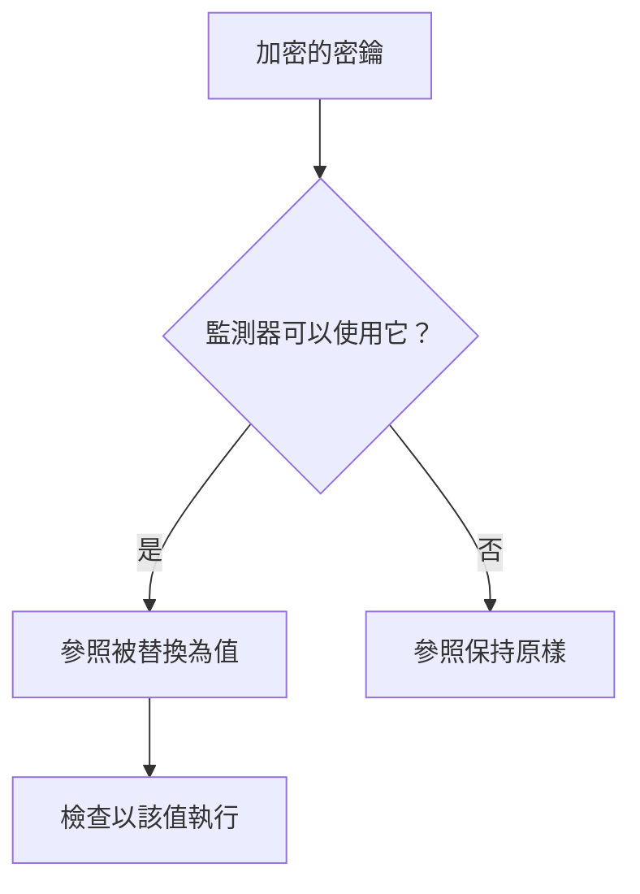

# 監控密鑰

監測器密鑰讓監測器所需的密碼、API 金鑰和權杖不必寫在監測器本身中。您只需將值加密儲存一次，選擇哪些監測器可以使用它，然後在監測器需要的地方以 `{{monitorSecrets.NAME}}` 參照它。

:::cards
- [新增密鑰](#新增密鑰): 儲存一個值，並選擇誰可以使用它。
- [選擇存取權](#選擇哪些監測器可以使用密鑰): 所有監測器、特定監測器或帶標籤的監測器。
- [使用密鑰](#使用密鑰): `{{monitorSecrets.NAME}}` 在哪裡有效。
:::

## 密鑰如何送達監測器

密鑰以加密形式儲存，儲存後就不會再顯示。在 OneUptime 把監測器交給探測器之前，它會把監測器可以使用的每個參照替換為解密後的值；監測器不能使用的參照則保持原樣。

執行檢查的探測器會收到該值，因此使用密鑰的監測器應在您信任的探測器上執行：OneUptime 自己的探測器，或者您自行執行的 [自訂探測器](/docs/probe/custom-probe)。

## 開始之前

- **Growth 方案或更高方案**，適用於 OneUptime Cloud。自行託管的安裝沒有方案。
- **可以管理密鑰的角色**：Project Owner、Project Admin，或者擁有 Create Monitor Secret 權限的自訂角色。

## 管理密鑰

### 新增密鑰

:::steps
1. 前往 **監測器 → 設定 → 密鑰**，點選 **建立監測器 密鑰**。
2. 輸入 **名稱** 和 **密鑰值**。名稱是您參照時使用的，例如 `ApiKey`。它只能包含字母、數字、連字號（`-`）和底線（`_`），而且同一個專案中的兩個密鑰不能同名。
3. 在 **存取** 步驟中選擇哪些監測器可以使用它（請參閱下一節），然後點選 **建立監測器 密鑰**。
:::

> [!IMPORTANT]
> 密鑰會經過加密並安全儲存。密鑰值儲存後就不會再顯示——不會出現在表格中、編輯表單中，也不會透過 API 回傳。如果您遺失了該值，需要從它的來源重新取得並再次設定。若要輪替密鑰，請使用其所在列的 **更新密鑰值** 按鈕；不必刪除後重新建立。

### 選擇哪些監測器可以使用密鑰

每個密鑰都有三種存取選項之一：

| 選項 | 哪些監測器可以使用該密鑰 | 適用於 |
| --- | --- | --- |
| **所有監測器** | 專案中的每個監測器，包括您之後建立的監測器。 | 許多監測器共用的認證資訊。 |
| **特定監測器** | 只有您選擇的監測器。這是預設選項，在這些選項出現之前建立的密鑰也是這樣運作的。 | 用於一個或少數幾個監測器的認證資訊。 |
| **帶標籤的監測器** | 至少擁有您所選標籤之一的監測器。為監測器加上其中一個標籤即可讓它取得存取權，移除該標籤後，監測器會在下次執行時失去存取權。 | 用於隨時間變化之一組監測器的認證資訊。 |

您可以隨時透過密鑰所在列的 **編輯** 變更選項。只會保留所選選項對應的清單：切換到 **所有監測器** 會清空密鑰的監測器清單和標籤清單，在 **特定監測器** 和 **帶標籤的監測器** 之間切換則會清空您切換前的那份清單。

密鑰永遠不會提供給其他專案中的監測器。

> [!WARNING]
> 任何可以編輯「能使用某個密鑰的監測器」的人，都可以把該密鑰傳送到監測器連線的任何地方。使用 **所有監測器** 時，這包括專案中所有可以建立或編輯監測器的人。使用 **帶標籤的監測器** 時，還包括所有可以為監測器加上其中某個標籤的人。

透過 API 時，存取選項是 `monitorAccess` 欄位：`All Monitors`、`Specific Monitors` 或 `Monitors With Labels`。`monitors` 和 `labels` 欄位保存相應的清單。建立時未指定 `monitorAccess` 的密鑰會得到 `Specific Monitors`。

### 使用密鑰

若要使用密鑰，請在接受密鑰的欄位中寫入 `{{monitorSecrets.SECRET_NAME}}`。例如，請求標頭 `Authorization: Bearer {{monitorSecrets.ApiKey}}` 會傳送 `ApiKey` 密鑰的值。

以下監測器類型和欄位接受密鑰：

| 監測器類型 | 欄位 |
| --- | --- |
| API | URL、請求標頭和內文，以及用戶端憑證、私密金鑰和複雜密碼（mTLS） |
| 網站 | URL，以及用戶端憑證、私密金鑰和複雜密碼（mTLS） |
| Ping, IP, 連接埠, NTP, SSL Certificate | 要檢查的主機或 URL |
| DNS | 網域名稱和 DNS 伺服器 |
| DNSSEC, 網域 | 網域名稱 |
| SQL Query | 主機、資料庫名稱、使用者名稱、密碼和查詢 |
| Database Health | 主機、資料庫名稱、使用者名稱和密碼 |
| External Status Page | 狀態頁 URL |
| Synthetic Monitor, Custom JavaScript Code | 指令碼 |
| Network Device | SNMP 社群字串，以及 SNMPv3 的驗證金鑰和隱私金鑰 |

密鑰會在 Synthetic Monitor 或 Custom JavaScript Code 監測器的指令碼執行之前填入，因此指令碼中諸如 `{{monitorSecrets.ApiKey}}` 的參照在執行時就是解密後的值。

如果監測器參照了它不能使用的密鑰，該參照會保持原樣，不會被替換為值。

在儲存監測器之前測試它時，只會填入對 **所有監測器** 可用的密鑰，因為新的監測器還不在任何清單中，也還沒有標籤。儲存監測器後，測試會使用該監測器可以使用的每個密鑰。

## 疑難排解

:::details 監測器按字面傳送了 `{{monitorSecrets.NAME}}`
監測器不能使用該密鑰，或者名稱不相符。請透過密鑰所在列的 **編輯** 檢查其存取選項，並確認參照中的名稱與密鑰名稱完全相同。
:::

:::details 測試新的監測器時沒有填入密鑰
監測器儲存之前，只會填入對 **所有監測器** 可用的密鑰。儲存監測器後再測試一次。
:::

:::details 某個欄位忽略了密鑰
只有上表中的欄位接受密鑰。在其他任何欄位中，`{{monitorSecrets.NAME}}` 會按原樣傳送。
:::

## 後續步驟

:::cards
- [API 監控](/docs/monitor/api-monitor): 在請求標頭中傳送密鑰。
- [合成監控](/docs/monitor/synthetic-monitor): 在瀏覽器指令碼中使用密鑰。
- [SQL 查詢監控](/docs/monitor/sql-monitor): 讓資料庫密碼保持加密。
:::
