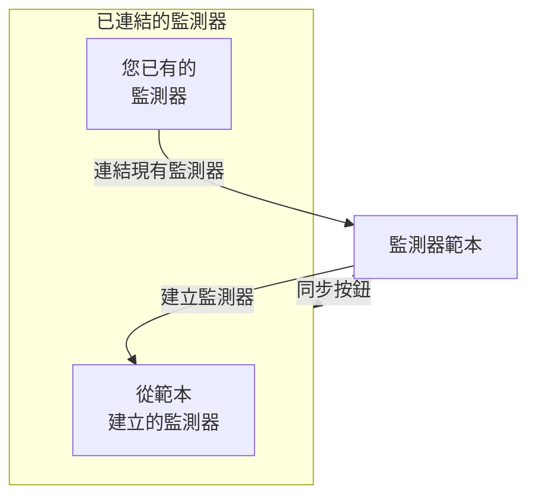

# 監測器範本

監測器範本是一份儲存好的監測器設定（類型、條件、間隔、標籤和自訂欄位預設值），您可以一鍵從中建立監測器。從範本建立或連結到範本的監測器會保持連結：修改範本，然後把變更同步到所有這些監測器。當許多監測器應以相同方式運作時使用範本，例如每個服務上相同的健康檢查，或者正式環境和預備環境中相同的 API 檢查。

:::cards
- [建立範本](#建立範本): 四個步驟，與建立監測器相同。
- [從範本建立監測器](#從範本建立監測器): 一鍵建立，或連結您已有的監測器。
- [同步變更](#將變更同步到已連結的監測器): 每個同步按鈕複製的內容。
- [保留每個監測器自己的值](#保留每個監測器自己的值): 避免目標位址或標頭被同步覆寫。
:::

## 範本的運作方式

範本本身不監測任何內容。監測器從範本建立或連結到範本，範本頁面會將它們列為 **已連結的監測器**。修改範本後，在您同步之前，這些監測器不會有任何變化：每個同步按鈕會把範本的一部分複製到每個已連結的監測器上，而您保護的欄位會保留每個監測器自己的值。



## 開始之前

- **可以建立範本的角色**：Project Owner、Project Admin、Project Member、Monitor Admin 或 Monitor Member，或者擁有 Create Monitor Template 權限的自訂角色。修改範本需要相同的角色，或 Edit Monitor Template 權限。
- **更新已連結監測器的權限。** 同步會以您的身分寫入每個已連結的監測器，並略過您的權限未涵蓋的監測器。

## 建立範本

:::steps
### 開啟範本清單

前往 **監測器 → 設定 → 範本**，點選 **建立監測器 範本**。

### 為範本命名

在 **範本資訊** 中輸入 **範本名稱**（例如 `Production API Health`）和 **範本描述**，然後點選 **下一步**。

### 設定監測器預設值

在 **監測器預設值** 中，以與建立監測器相同的選擇器選擇 **監測器類型**。可以選擇填寫 **預設監測器名稱**；留空時，每個監測器會以它監測的資源命名。**預設監測器描述** 和 **標籤** 位於 **更多欄位** 中。點選 **下一步**。

### 設定條件和間隔

在 **條件** 中填寫要檢查的對象和條件，與 [建立監測器](/docs/monitor/create-monitor#條件) 中相同。頂端的 **Template sync settings** 卡片可以讓欄位不被同步覆寫（請參閱 [保留每個監測器自己的值](#保留每個監測器自己的值)）。對於由探測器檢查的監測器類型，最後一個步驟 **間隔** 會詢問 **監測間隔**。在最後一個步驟點選 **建立監測器 範本**。
:::

範本會新增到清單中。開啟它即可看到它的頁面，每個部分都有一張卡片：**範本資訊**、**監測器預設值**、**監測條件**、**監測間隔**（含 **最低探測器一致數**）、**標籤**、**Custom Field Defaults**（當專案有監測器自訂欄位時）和 **已連結的監測器**。每個部分都在自己的卡片上修改，例如使用 **編輯條件** 或 **編輯間隔**。

## 從範本建立監測器

- **新的監測器。** 在清單中範本所在的列點選 **建立監測器**，或在範本頁面上點選 **從範本建立監測器**。**建立監測器** 開啟時已填好範本的類型和設定；修改需要的內容，然後建立。新的監測器會連結到該範本。
- **您已有的監測器。** 在 **已連結的監測器** 中點選 **連結現有監測器** 並選擇它們。在您同步之前，它們會保留自己的設定。

在 **Custom Field Defaults** 中設定的自訂欄位值會寫入從該範本建立的每個監測器，包括自動匯入規則和警示原則從中建立的監測器。

## 將變更同步到已連結的監測器

編輯範本只會變更範本本身。若要把變更複製到已連結的監測器上，請使用您所修改卡片上的同步按鈕。每個按鈕都會寫明它影響的監測器數量，例如 **Sync Criteria to 3 Linked Monitors**；沒有任何連結時按鈕會呈現灰色。同步無法復原。

| 按鈕 | 複製到每個已連結監測器的內容 | 保持不變的內容 |
| --- | --- | --- |
| **將條件同步至連結的監測器** | 條件以及步驟設定（例如目標位址和請求選項），受保護的欄位除外 | 監測間隔、最低探測器一致數、名稱、描述、標籤和自訂欄位值 |
| **將間隔同步至連結的監測器** | 監測間隔和最低探測器一致數 | 條件、名稱、描述、標籤和自訂欄位值 |
| **將標籤同步至連結的監測器** | 僅標籤 | 其他所有內容 |
| **Sync Custom Fields to Linked Monitors** | 範本設有預設值的自訂欄位，取代每個監測器原有的值 | 範本留空的自訂欄位，以及其他所有內容 |

若要同步單一監測器，請在 **已連結的監測器** 中該監測器所在的列點選 **從範本同步**。這會複製條件和步驟設定（受保護的欄位除外）、監測間隔、最低探測器一致數和標籤，而監測器的名稱、描述和自訂欄位值保持不變。**從範本取消連結** 會中斷監測器與範本的連結；監測器保留自己的設定。

同步之後，摘要會顯示更新了多少個監測器。**部分同步** 表示有些已連結的監測器仍是先前的設定，通常是因為您的權限未涵蓋它們。

## 保留每個監測器自己的值

除非您保護這些欄位，否則條件同步也會複製步驟設定，例如目標位址、請求標頭和逾時。保護某個欄位，即可讓每個已連結的監測器保留該欄位自己的值。

:::steps
### 開啟該範本

前往 **監測器 → 設定 → 範本** 並開啟該範本。

### 編輯它的條件

在 **監測條件** 卡片上點選 **編輯條件**。

### 保護欄位

在 **Template sync settings** 中，勾選要在已連結監測器上保留的每個欄位旁邊的 **Do not sync this field**。

### 儲存

儲存變更。**監測條件** 卡片以及每次同步的確認對話方塊都會列出受保護的欄位。

### 同步

使用 **將條件同步至連結的監測器**，或在個別已連結的監測器上使用 **從範本同步**。
:::

例如，在 API 範本上保護 **Monitor destination** 和 **Request headers**。正式環境和預備環境的監測器會保留各自的 URL 和標頭，同時都會收到範本更新後的條件和其他未受保護的設定。

可用的選項取決於監測器類型，包括目標位址和連接埠、HTTP 請求選項、資料庫連線、DNS 設定、基礎設施選擇器和遙測查詢。相關的認證資訊（例如用戶端憑證及其私密金鑰）會一起保留。

### 排除項目的行為

- 勾選的欄位會保留每個現有監測器目前的值，包括空白或未設定的值。請求標頭和其他集合會完整保留。
- 未勾選的欄位會繼續從範本同步。取消勾選受保護的欄位並儲存，下次同步時就會複製範本中的值。
- 排除項目同時適用於批次同步和個別同步。它們儲存在範本上，而不是在每次同步時分別選擇。
- 新的監測器仍以範本中的欄位值開始。排除項目只影響對現有監測器的同步。
- 條件一律會同步。只同步條件時，監測間隔、標籤和其他監測器層級的設定保持不變。
- 現有範本在您設定之前沒有欄位排除項目。Network Device 監測器會繼續自動保留它們自己的裝置繫結。

對於有多個步驟的範本，受保護的值會依步驟 ID 比對。個別建立的單一步驟監測器也可以接收單一步驟範本。如果某個受保護的步驟無法比對，同步會在任何監測器更新之前遭到拒絕，因此新增或重新排序的步驟不會意外複製另一個步驟的目標位址或認證資訊。

> [!IMPORTANT]
> 在變更已儲存範本的監測器類型（使用 **編輯監測器預設值**）之前，請先在 **編輯條件** 中清除不適用於新類型的排除項目。範本的所有排除項目都必須存在於它的監測器類型中。

## 透過 API 設定

每個範本步驟都在其 `MonitorStep.value` 物件中接受一個 `doNotSyncFields` 陣列。對於 API 監測器，可以這樣保護它的目標位址和整個標頭集合：

```json title="monitorSteps (excerpt)"
{
  "_type": "MonitorSteps",
  "value": {
    "monitorStepsInstanceArray": [
      {
        "_type": "MonitorStep",
        "value": {
          "id": "<step id>",
          "doNotSyncFields": ["monitorDestination", "requestHeaders"]
        }
      }
    ]
  }
}
```

省略該陣列或將其設為 `[]`，即可同步所有支援的步驟設定。不支援的欄位名稱，以及不適用於範本監測器類型的欄位，都會遭到拒絕。同步由範本的陣列控制；已連結監測器上的任何此類中繼資料都不會覆寫它。

:::details 依監測器類型列出的 doNotSyncFields 欄位名稱
| 監測器類型 | 欄位名稱 |
| --- | --- |
| 網站、API、Ping、IP、連接埠、SSL Certificate、NTP | `monitorDestination`, `requestTimeoutInMs`, `retryCount` |
| 僅 API | `requestHeaders`, `requestType`, `requestBody` |
| 網站和 API | `doNotFollowRedirects`, `allowSelfSignedCertificates`, `tlsClientAuthentication`（用戶端憑證、金鑰和密碼短語一起） |
| 連接埠、NTP | `monitorDestinationPort` |
| Synthetic Monitor、Custom JavaScript Code | `customCode` |
| Synthetic Monitor | `browserTypes`, `screenSizeTypes`, `retryCountOnError` |
| DNS | `dnsMonitor.queryName`, `dnsMonitor.recordType`, `dnsMonitor.resolver`（DNS 伺服器和連接埠一起）, `dnsMonitor.timeout`, `dnsMonitor.retries` |
| 網域 | `domainMonitor.domainName`, `domainMonitor.lookupMethod`, `domainMonitor.timeout`, `domainMonitor.retries` |
| DNSSEC | `dnssecMonitor.domainName`, `dnssecMonitor.resolvers`, `dnssecMonitor.checkNameserverConsistency`, `dnssecMonitor.signatureExpiryWarningDays`, `dnssecMonitor.timeout`, `dnssecMonitor.retries` |
| SQL Query | `sqlMonitor.connection`, `sqlMonitor.connectionTimeoutInMs`, `sqlMonitor.statementTimeoutInMs`, `sqlMonitor.query`, `sqlMonitor.maxRows` |
| Database Health | `databaseMonitor.connection`, `databaseMonitor.connectionTimeoutInMs`, `databaseMonitor.statementTimeoutInMs`, `databaseMonitor.enabledMetricGroups` |
| External Status Page | `externalStatusPageMonitor.statusPageUrl`, `externalStatusPageMonitor.provider`, `externalStatusPageMonitor.components`, `externalStatusPageMonitor.timeout`, `externalStatusPageMonitor.retries` |
| 日誌、Security Events、追蹤、AI / LLM、指標、例外 | `logMonitor`, `securityEventsMonitor`, `traceMonitor`, `llmMonitor`, `metricMonitor`, `exceptionMonitor`（監測器的整個設定） |

基礎設施監測器（Kubernetes、Docker、主機、Podman、Proxmox、Docker Swarm、Ceph、儲存陣列、IoT Device）可以保護它們的資源選擇器、篩選條件、指標查詢和查詢時間範圍。這些名稱列在該類型範本的 **Template sync settings** 中。
:::

## 疑難排解

:::details 同步顯示「部分同步」
有些已連結的監測器沒有更新，通常是因為您的權限未涵蓋它們。請可以更新所有已連結監測器的人重新執行同步。
:::

:::details 同步失敗並顯示 "a template step cannot be matched to an existing monitor step"
某個受保護的欄位無法比對到其中一個監測器上的步驟，因此同步在變更任何監測器之前就停止了。為範本的步驟設定與監測器步驟相同的 ID，或者對單一步驟監測器使用單一步驟範本。
:::

:::details 同步按鈕呈現灰色
還沒有任何監測器連結到該範本。從範本建立一個監測器，或在 **已連結的監測器** 中點選 **連結現有監測器**。
:::

:::details 儲存失敗並顯示 "Unsupported do not sync field"
`doNotSyncFields` 中的某個名稱不是該範本監測器類型的欄位。請對照上方的欄位名稱檢查它。
:::

## 後續步驟

:::cards
- [建立監測器](/docs/monitor/create-monitor): 範本所填寫的表單。
- [API 監控](/docs/monitor/api-monitor): API 範本所攜帶的設定。
- [監控密鑰](/docs/monitor/monitor-secrets): 在多個監測器之間共用認證資訊而不必複製。
- [Terraform 監控步驟](/docs/terraform/monitor-steps): 以程式碼管理監測器及其步驟。
:::
