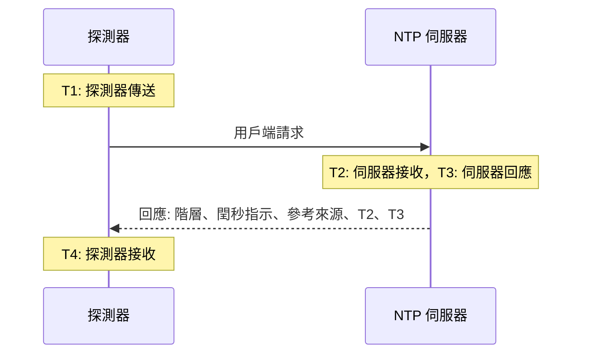

# NTP 監控

NTP 監測器會檢查時間伺服器是否在 UDP 連接埠 123 上回應並提供準確的時間：它是否已同步、階層是否合理，以及它的時鐘是否與探測器的時鐘一致。可用於您自己維運的時間伺服器，例如資料中心裡的 GPS 時鐘或您的機器所同步的內部伺服器，也可用於您所依賴的公用伺服器。

:::cards
- [建立監測器](#建立-ntp-監測器): 在主控台中完成六個步驟。
- [檢查讀取的內容](#檢查讀取的內容): 階層、時鐘偏差、閏秒指示以及回應中的其他內容。
- [監測條件](#監測條件): 可連線性、同步狀態、階層和偏差。
- [疑難排解](#疑難排解): 伺服器正常運作，但監測器顯示的結果不同時。
:::

## 運作方式

每次檢查時，探測器會從一個隨機的本機連接埠向伺服器的 UDP 連接埠傳送一個 SNTP 用戶端請求（NTP 版本 4，用戶端模式），並等待回應。只有對該請求的真實回應才算數：探測器會在請求的傳送時間戳記中放入 64 個隨機位元，並忽略任何沒有原樣傳回這些位元、比 NTP 封包短或不是伺服器模式的封包。對先前某次檢查的過期回應或偽造的回應，永遠不會讓一台已停擺的伺服器看起來仍在運作。

根據這四個時間戳記，探測器會算出 **時鐘偏差**，即 ((T2 − T1) + (T3 − T4)) / 2：伺服器的時鐘與探測器的時鐘相差多少。偏差為正表示伺服器的時鐘偏快。此公式假設請求和回應所需的時間相同，因此如果路徑在某個方向上慢得多，偏差最多可能偏離來回時間的一半。

> [!NOTE]
> 偏差是相對於探測器本身的時鐘測量的。OneUptime Cloud 的探測器會保持時鐘同步。在 [自訂探測器](/docs/probe/custom-probe) 上，也請使用 chrony 或 systemd-timesyncd 保持主機時鐘同步，否則偏差警示反映的可能是探測器而不是伺服器的問題。

已回應的伺服器不會被再次詢問，即使它的回應中沒有準確的時間。沒有回應、連接埠被拒絕和 DNS 查詢失敗都會以新的請求重試。當伺服器完全沒有回應時，探測器還會追蹤到它的路由，並將結果附加為 **Network Path at Time of Failure**。失去自身網路連線的探測器不會回報任何結果，因此它無法將您的伺服器標記為離線。

## 開始之前

- **可以建立監測器的角色**：Project Owner、Project Admin、Project Member、Monitor Admin 或 Monitor Member，或者擁有 Create Monitor 權限的自訂角色。
- **能夠連到伺服器 UDP 連接埠 123 的探測器。** 任何探測器都可以檢查公用時間伺服器。對於私有網路中的伺服器，請在該網路內使用 [自訂探測器](/docs/probe/custom-probe)。伺服器前面的防火牆必須放行來自 [OneUptime Cloud 探測器 IP 位址](/docs/configuration/ip-addresses) 或您的自訂探測器的 UDP 流量，而不只是 TCP。

## 建立 NTP 監測器

:::steps
### 開始建立新監測器

前往 **監測器** 並點選 **建立監測器**。在 **監測器類型** 下，於搜尋方塊中輸入 `ntp` 並選擇 **NTP**。它也列在 **更多監測器類型** 的網路群組中。

### 命名

輸入 **名稱**，例如 `GPS 時間伺服器`，然後點選 **下一步**。

### 輸入伺服器

在 **NTP 伺服器** 中輸入伺服器的主機名稱或 IP 位址，例如 `time.example.com` 或 `192.168.1.10`。請求會傳送到連接埠 123。若要使用其他連接埠，請展開 **更多欄位** 並設定 **連接埠**。

### 測試

點選 **測試監測器**，在 **選擇探測器** 中選擇一個探測器，然後點選 **執行測試**。**監測器測試結果** 會顯示伺服器是否回應、是否已同步、它的階層以及它的時鐘偏差有多大。

### 檢視條件

**監測器條件** 從 [預設條件](#預設條件) 開始：伺服器不提供準確時間時為離線，提供時為上線。如有需要可修改，然後點選 **下一步**。

### 選擇探測器並建立

保留或修改 **探測器** 和 **監測間隔**（初始為 **每 5 分鐘**），然後點選 **建立監測器**。監測器頁面隨即開啟。
:::

## 設定選項

| 欄位 | 預設值 | 填寫內容 |
| --- | --- | --- |
| **NTP 伺服器** | 無 | 伺服器，例如 `time.example.com`、`192.168.1.10` 或 `2001:db8::123`。只填寫主機，不要加上 `udp://`。寫在主機後面的連接埠（例如 `time.example.com:1123`）會取代 **連接埠** 使用。 |
| **連接埠**（在 **更多欄位** 中） | `123` | 伺服器回應 NTP 的 UDP 連接埠，範圍為 `1` 到 `65535`。留空則為 `123`。 |
| **請求逾時（秒）**（在 **更多欄位** 中） | `5` | 一次嘗試等待回應的時間，包含 DNS 查詢。最長為 60 秒。 |
| **失敗時重試**（在 **更多欄位** 中） | 探測器預設值，通常為 `3` | 對沒有得到回應的嘗試重試的次數。最多為 3。 |

**失敗時重試** 計算的是第一次嘗試 _之後_ 的重試次數，因此 `0` 只執行一次檢查，`2` 最多執行三次，每次嘗試之間暫停一秒。留空時使用探測器的預設值：3，除非探測器的 `PROBE_MONITOR_RETRY_LIMIT` 另有設定。

## 檢查讀取的內容

監測器頁面會顯示每個探測器最新一次的檢查：

| 欄位 | 意義 |
| --- | --- |
| **已同步** | 伺服器是否以階層 1 到 15 回應，閏秒指示中沒有警報，而且回應中帶有真實的時間戳記。 |
| **時鐘偏差** | 伺服器的時鐘與探測器的時鐘相差多少，以及偏向哪個方向。健康的伺服器在幾毫秒以內。 |
| **階層** | 伺服器距離參考時鐘有多少個躍點：擁有自己的 GPS 或原子鐘來源的伺服器為 1，與階層 1 伺服器同步的伺服器為 2，依此類推。16 表示未同步。 |
| **參考來源** | 伺服器同步的對象：階層 1 時是 `GPS`、`PPS` 或 `NIST` 這類來源名稱，從階層 2 開始是上游伺服器的位址。 |
| **閏秒指示** | 沒有待處理的閏秒時為 0，當天結束時將增加或減少一個閏秒時為 1 或 2，伺服器表示其時鐘未同步時為 3。 |
| **根離散度** | 伺服器自己估計的其時間可能偏離真實時間的程度。伺服器無法連到它的來源時，這個值會持續增加。當根延遲的一半加上這個值超過 1.5 秒時，ntpd 就不再信任該伺服器。 |
| **根延遲** | 從伺服器到其參考時鐘的來回時間。 |
| **回應時間** | 從探測器傳送請求到收到回應的時間，不含 DNS 查詢。 |
| **伺服器時間** | 伺服器傳送回應時的時鐘。 |

拒絕提供時間的伺服器會改為傳送 **kiss-o'-death**：一個階層為 0、帶有四個字母代碼的回應。最常見的代碼有 `RATE`（伺服器限制探測器的頻率）、`DENY` 和 `RSTR`（伺服器的存取規則拒絕探測器）以及 `INIT`（伺服器尚未同步）。檢查會顯示該代碼，並將伺服器視為有回應但未同步。

## 監測條件

條件決定伺服器何時算作上線、降級或離線，以及是否因此宣告事件或建立警示。每個條件會檢查一個或多個篩選器：

| 篩選器 | 條件 | 檢查內容 |
| --- | --- | --- |
| **NTP Is Online** | **是**、**否** | 伺服器是否以 NTP 回應答覆了探測器的請求。kiss-o'-death 也算回應。 |
| **NTP Is Synchronized** | **是**、**否** | 已回應的伺服器是否提供已同步的時間。伺服器沒有回應時不會檢查此篩選器；這種情況請使用 **NTP Is Online**。 |
| **NTP Stratum** | **Greater Than**、**Greater Than Or Equal To**、**Less Than**、**Less Than Or Equal To**、**Equal To**、**Not Equal To** | 伺服器的階層。kiss-o'-death 的 0 會以 16（未同步）計算。 |
| **NTP Clock Offset (in ms)** | **Greater Than**、**Less Than**、**Greater Than Or Equal To**、**Less Than Or Equal To** | 伺服器的時鐘與探測器的時鐘相差多少，不分方向。 |
| **NTP Response Time (in ms)** | **Greater Than**、**Less Than**、**Greater Than Or Equal To**、**Less Than Or Equal To** | 從請求到回應的時間。 |
| **NTP Root Dispersion (in ms)** | **Greater Than**、**Less Than**、**Greater Than Or Equal To**、**Less Than Or Equal To** | 伺服器自己估計的最大誤差。 |

有兩個或更多篩選器時，**符合條件** 決定必須 **全部** 符合，還是 **任何** 一個符合即可。條件的 **操作** 決定它要做什麼：變更監測器狀態、建立警示、宣告事件，或這些的任意組合。

### 預設條件

新的 NTP 監測器從兩個條件開始：

- **離線** — 伺服器沒有回應、未同步，或者它的時鐘與探測器的時鐘相差 `1000` ms 以上。監測器會被標記為 **離線**，並建立一個名為"_監測器名稱_ is not serving good time"的事件。當伺服器重新提供準確時間時，事件會自動解決。
- **上線** — 伺服器有回應、已同步，而且它的時鐘與探測器的時鐘相差不到 `1000` ms。監測器會被標記為 **運作中**。

條件會由上到下檢查，第一個符合的條件決定結果。以錯誤時間回應的伺服器會被刻意視為停擺：每個跟隨它的用戶端也會採用這個時間。

### 在一段時間內評估

**在一段時間內評估此條件** 是每個 NTP 篩選器下方的核取方塊。開啟後，會根據過去一段時間內的檢查而不是最新一次檢查來判斷：在 **評估** 中選擇彙總方式，在 **過去(以分鐘計)** 中選擇 2 到 60 分鐘的時間範圍。只有伺服器有回應的檢查才有階層、偏差和根離散度，因此一段完全沒有回應的時間範圍對這些篩選器沒有資料，此時由 **如果沒有資料** 決定結果。

### 條件範例

| 目標 | 篩選器 | 條件 | 值 |
| --- | --- | --- | --- |
| GPS 伺服器退回網路來源時發出警示 | **NTP Stratum** | **Greater Than** | `1` |
| 時鐘漂移時發出警示 | **NTP Clock Offset (in ms)** | **Greater Than** | `100` |
| 伺服器的誤差上限變大時發出警示 | **NTP Root Dispersion (in ms)** | **Greater Than** | `500` |
| 回應變慢時發出警示 | **NTP Response Time (in ms)** | **Greater Than** | `1000` |

## 疑難排解

:::details 伺服器正常運作，但監測器顯示它沒有回應
請求或回應在途中被丟棄了。允許 TCP 但不允許 UDP 的防火牆、沒有包含探測器位址的 ntpd `restrict` 或 chrony `allow` 規則，或者只在內部介面上監聽的伺服器，都會出現這種情況。**Network Path at Time of Failure** 會顯示路由到達了哪裡。請放行探測器，或者從網路內的 [自訂探測器](/docs/probe/custom-probe) 檢查該伺服器。
:::

:::details 監測器顯示伺服器拒絕了請求
主機回覆說該 UDP 連接埠上沒有任何服務在監聽（ICMP port unreachable）：NTP 服務已停止，或者在另一個連接埠上監聽。請啟動該服務，或者把 **連接埠** 設為它實際使用的連接埠。
:::

:::details 伺服器以 kiss-o'-death 回應
`RATE` 表示伺服器在限制探測器的頻率。探測器每次檢查只詢問一次，因此延長 **監測間隔**，或在伺服器的限制中豁免探測器的位址，即可解決。`DENY` 和 `RSTR` 表示伺服器的存取規則拒絕了探測器。`INIT` 和 `STEP` 表示伺服器尚未同步，這在伺服器啟動後的幾分鐘內是正常的。
:::

:::details 同一個探測器上的所有 NTP 監測器都顯示相近的偏差
偏差來自探測器的時鐘，而不是伺服器的時鐘。請檢查探測器的主機是否保持時鐘同步，或者在其他探測器上執行這些監測器。
:::

:::details 偏差在每次檢查之間跳動
探測器離伺服器較遠，或者路徑在一個方向上比另一個方向慢。請使用離伺服器更近的探測器，或者使用 **在一段時間內評估此條件** 和 **平均** 根據幾分鐘內的偏差來判斷。
:::

## 後續步驟

:::cards
- [Ping 監控](/docs/monitor/ping-monitor): 檢查主機本身是否可以連線。
- [連接埠監控](/docs/monitor/port-monitor): 檢查同一主機上的 TCP 服務。
- [自訂探針](/docs/probe/custom-probe): 檢查您自己網路中的時間伺服器。
- [事件與警示範本](/docs/monitor/incident-alert-templating): 將階層和偏差放進事件標題。
:::
