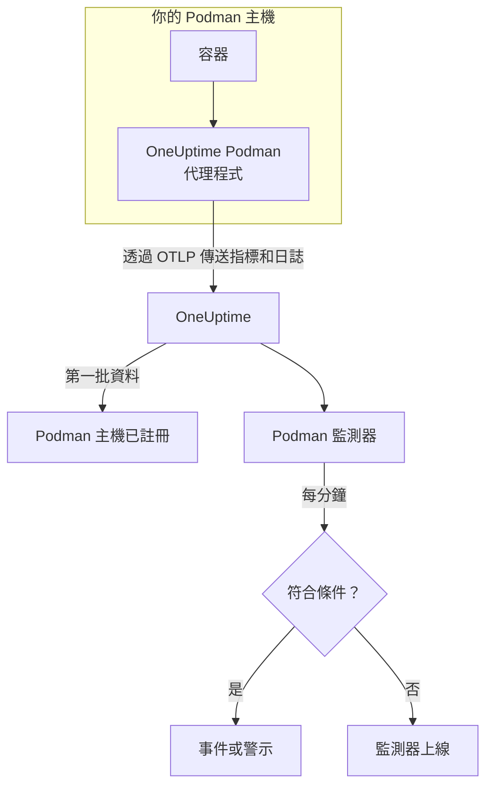

# Podman 監控

Podman 監測器監控一台 Podman 主機上的容器，在容器負載過高、記憶體用盡或反覆重新啟動時通知你。它讀取 OneUptime Podman 代理程式從主機傳送的指標，因此不會從外部探測任何東西：安裝代理程式，然後依範本或你自己的查詢建立監測器。

:::cards
- [建立監測器](#建立-podman-監測器): 在儀表板中完成六個步驟。
- [範本](#現成的警示範本): 五個現成的警示，每個容器一個事件。
- [指標](#收集的指標): 代理程式收集的內容，以及每個指標的意義。
- [日誌](#收集的日誌): 容器日誌，以及它們需要的日誌驅動程式。
:::

## 運作方式

OneUptime Podman 代理程式以容器形式在主機上執行。它每 30 秒透過 Podman 相容 Docker 的 API 通訊端讀取容器統計資料，追蹤容器的日誌檔，並透過 OTLP 把兩者都傳送到 OneUptime。來自某台主機的第一批資料會把它註冊到 OneUptime。

Podman 監測器綁定到一台主機。它每分鐘對這台主機的容器指標執行查詢，並把結果與條件比較。



## 開始之前

- **安裝 Podman 代理程式**，裝在主機上。[Podman 代理程式指南](/docs/telemetry/podman-host) 說明了安裝、升級和檢查方式。代理程式需要位於 `/run/podman/podman.sock` 的 Podman API 通訊端。
- **確認主機已註冊。** 第一批資料到達後，它會以代理程式的 `PODMAN_HOST_NAME` 命名，出現在 **產品 → 基礎設施 → Podman → 所有主機** 下。
- **如需容器日誌**，請使用 `k8s-file` 日誌驅動程式執行容器。請參閱 [日誌驅動程式需求](#日誌驅動程式需求)。

## 建立 Podman 監測器

:::steps
### 開始新的監測器

前往 **監測器** 並按一下 **建立監測器**。

### 選擇 Podman Container

在 **監測器類型** 下按一下 **更多監測器類型**，然後在 **基礎設施** 下選擇 **Podman Container**，或在搜尋方塊中輸入 `podman`。輸入 **名稱**（會用在事件和警示標題中），然後按一下 **下一步**。

### 選擇主機

在 **Podman Monitor Configuration** 下，從 **Podman Host** 中選擇主機。傳送過資料的每台主機都在清單中。

### 選擇要監控的內容

選擇三個分頁之一：

- **Quick Setup** – 按一下一個 [範本](#現成的警示範本)。它會設定指標、彙總、時間範圍和閾值，並用自己的條件取代下方的條件。你仍然可以變更 **時間範圍**。
- **Custom Metric** – 從 **Podman Metric** 中選擇一個指標，然後設定 **彙總** 和 **時間範圍**。**容器名稱** 和 **容器映像** 可以把範圍縮小到部分容器。
- **進階** – 在 **選擇指標** 下自行建立查詢和公式。使用 **Group by** `resource.container.name` 可以個別評判每個容器。

### 檢查條件

開啟 **監測器條件** 下的每個條件，檢查其 **指標**、**彙總**、**條件** 和 **Threshold**。範本會填好這些內容。使用 **Custom Metric** 或 **進階** 時，監測器會從 [預設條件](#預設條件) 開始，這些條件只會注意到指標降到零，所以請設定你自己的閾值。

### 建立監測器

按一下 **建立監測器**。OneUptime 會開啟監測器的頁面，並每分鐘評估一次。它開啟的事件和警示也會列在主機的 **事件** 和 **警示** 頁面上。
:::

> [!TIP]
> 若要一次設定多個範本，請從 **產品 → 基礎設施 → Podman** 開啟主機，然後前往 **Recommendations**。選擇你需要的範本和要呼叫的人，OneUptime 就會為每個範本建立一個監測器。

## 監測器設定

| 欄位 | 分頁 | 作用 |
| --- | --- | --- |
| **Podman Host** | 全部 | 必填。把每個查詢限定在該主機的 `resource.host.name`。OneUptime 也會在每個查詢加上 `resource.container.runtime = podman`。 |
| **Podman Metric** | Custom Metric | 代理程式目錄中的一個指標，依 CPU、記憶體、網路、區塊 I/O 和容器分組。 |
| **容器名稱** | Custom Metric、進階 | 選用。與 `resource.container.name` 完全相符，例如 `my-container`。 |
| **容器映像** | Custom Metric、進階 | 選用。與 `resource.container.image.name` 完全相符，例如 `nginx:latest`。 |
| **彙總** | Custom Metric | 樣本的合併方式：**平均**、**最大值**、**最小值**、**總和** 或 **計數**。初始值為該指標通常的彙總方式。 |
| **時間範圍** | 全部 | 查詢讀取的滾動視窗，從 **Past 1 Minute** 到 **Past 365 Days**。新監測器從 **Past 1 Minute** 開始；範本會設定自己的值。 |
| **選擇指標** | 進階 | 查詢建立器：**指標**、**Aggregate by**、**Filter by attributes**、**Group by**，以及用來組合查詢的 **新增指標** 和 **新增公式**。 |

## 現成的警示範本

**Quick Setup** 提供五個範本。每個範本都會建立一個完整的監測器：一個依 `resource.container.name` 分組的查詢、一個觸發的條件和一個恢復的條件。每個容器都個別評判，並有自己的事件和警示。閾值只是起點，你可以編輯。

條件只有在其視窗的每一分鐘都成立時才會觸發，並在越過閾值 10% 處恢復，這樣在邊界附近徘徊的值就不會來回跳動。

| 範本 | 嚴重程度 | 監控內容 | 觸發時機 | 恢復時機 |
| --- | --- | --- | --- | --- |
| High Container CPU Usage | Warning | `container.cpu.utilization`，依容器取 Avg，最近 5 分鐘 | 高於 80（單一核心的 %） | 不高於 72 |
| High Container Memory Usage | Warning | `container.memory.percent`，依容器取 Avg，最近 5 分鐘 | 高於 85% | 不高於 76.5% |
| High Container Restart Count | 嚴重 | `container.restarts`，依容器取 Max，最近 5 分鐘 | 累計重新啟動超過 5 次 | 4.5 或更少 |
| High Container Process Count | Warning | `container.pids.count`，依容器取 Max，最近 5 分鐘 | 高於 500 | 不高於 450 |
| Container Restarted (Low Uptime) | 嚴重 | `container.uptime`，依容器取 Min，最近 1 分鐘 | 低於 120 秒 | 不低於 132 秒 |

**嚴重程度** 是選擇清單中顯示的標籤。範本建立的事件和警示會從專案中最嚴重的事件和警示嚴重程度開始；請在條件中變更它們。

兩個百分比範本使用 **平均**：它們的指標本來就是每個容器的百分比，所以一分鐘的平均值就是持續的讀數。重新啟動次數和處理程序數使用 **最大值**，只要有一個樣本越界就是訊號。

> [!NOTE]
> `container.cpu.utilization` 就是 `podman stats` 輸出的數字：100% 是一個完整的 CPU 核心，而不是容器的全部 CPU 配額。被分配多個核心的容器在健康時也會遠高於 100，所以請為這類容器調高閾值。

> [!NOTE]
> `container.restarts` 是 Podman 維護的累計總數，而不是視窗內的重新啟動次數。因此 **High Container Restart Count** 範本會一直保持開啟，直到重新建立容器、計數被重設為止。

> [!CAUTION]
> `container.uptime` 只存在於正在執行的容器。停止後一直保持停止的容器不會傳送任何資料，所以 **Container Restarted (Low Uptime)** 範本捕捉的是重新啟動和重新部署，而不是永久關閉。設計為執行不到兩分鐘的容器，在整個生命週期內都會處於警示狀態。

沒有 CPU 節流範本。代理程式收集的節流指標只會成長，「曾經被節流」這種警示觸發一次後就永遠不會清除。這兩個指標仍會被收集，所以你可以為它們繪製圖表。

## 收集的指標

代理程式每 30 秒使用 OpenTelemetry `docker_stats` 接收器，指向 Podman 相容 Docker 的通訊端 `/run/podman/podman.sock`。每個容器的指標都會把它的身分當作資源屬性攜帶：`resource.container.name`、`resource.container.image.name`、`resource.container.id`、`resource.container.runtime`（`podman`）和 `resource.host.name`。

### CPU

| 指標 | 說明 |
| --- | --- |
| `container.cpu.utilization` | 容器的 CPU 使用率，100% 表示一個完整的 CPU 核心。 |
| `container.cpu.usage.total` | 容器啟動以來使用的 CPU 時間，單位為奈秒。生命週期計數器。 |
| `container.cpu.throttling_data.throttled_time` | 容器被其 CPU 限制節流的奈秒數。生命週期計數器。 |
| `container.cpu.throttling_data.throttled_periods` | 容器啟動以來的節流週期數。生命週期計數器。 |

### 記憶體

| 指標 | 說明 |
| --- | --- |
| `container.memory.usage.total` | 使用中的記憶體，單位為位元組。 |
| `container.memory.usage.limit` | 記憶體限制，單位為位元組。 |
| `container.memory.percent` | 記憶體使用量占容器限制的百分比；容器沒有限制時，占主機記憶體的百分比。 |

### 網路

| 指標 | 說明 |
| --- | --- |
| `container.network.io.usage.rx_bytes` | 接收的位元組數。生命週期計數器。 |
| `container.network.io.usage.tx_bytes` | 傳送的位元組數。生命週期計數器。 |

### 區塊 I/O

| 指標 | 說明 |
| --- | --- |
| `container.blockio.io_service_bytes_recursive.read` | 從區塊裝置讀取的位元組數。 |
| `container.blockio.io_service_bytes_recursive.write` | 寫入區塊裝置的位元組數。 |

### 容器

| 指標 | 說明 |
| --- | --- |
| `container.uptime` | 容器啟動以來的秒數。只有正在執行的容器會回報它。 |
| `container.restarts` | 容器重新啟動的次數。累計總數。 |
| `container.pids.count` | 容器中的工作數。cgroup 的 pids 控制器同時計算處理程序和執行緒。 |

**Podman Metric** 清單也提供 `container.cpu.usage.percpu`、`container.memory.rss`、`container.memory.cache` 和網路封包計數器。隨附的代理程式設定不會開啟它們，所以在使用之前請先查看主機的 **指標** 頁面。`container.cpu.throttling_data.throttled_periods` 不在清單中；請從 **進階** 查詢它。

## 監控條件

條件會把監測器的某個查詢或公式與閾值比較。Podman 監測器的條件沒有 **篩選器類型**：每條規則都以下列欄位檢查指標值。

| 欄位 | 作用 |
| --- | --- |
| **指標** | 要檢查的查詢或公式，以其變數名稱指定。 |
| **彙總** | 視窗中的值如何變成一個結果：**平均**、**總和**、**Maximum Value**、**Minimum Value**、**All Values**（每個值都必須符合）或 **Any Value**（一個就夠）。 |
| **條件** | **Greater Than**、**Less Than**、**Greater Than Or Equal To**、**Less Than Or Equal To** 或 **Equal To**，或是異常條件：**Anomalously High**、**Anomalously Low** 或 **Anomalous**。 |
| **Threshold** | 用來比較的值。如果指標有單位，旁邊會有單位清單。異常條件下不會顯示。 |
| **敏感度** | 僅限異常條件。**低**（4σ）、**中**（3σ，預設）或 **高**（2σ）。 |
| **基準視窗** | 僅限異常條件。14 天（預設）、28、60 或 90 天的歷史。 |
| **如果沒有資料** | 位於 **更多欄位** 下。視窗中沒有樣本時的處理方式：**Ignore**（預設）、**Treat As Zero** 或 **觸發器**。 |

異常條件會把每個值與基準中一週的同一小時比較。在基準視窗累積足夠的歷史之前，它們會停留在「Learning」狀態，不產生任何結果。

每個條件也會說明符合時要做什麼：變更監測器狀態、建立警示或宣告事件。條件會由上而下檢查，第一個符合的條件決定結果。

### 預設條件

不是從範本建立的監測器會以兩個條件開始：

| 順序 | 條件 | 符合時機 | 結果 |
| --- | --- | --- | --- |
| 1 | Check if _monitor name_ is offline | 第一個查詢的任一值為 `0` | 將監測器標記為 **離線**，並宣告事件「_monitor name_ is offline」，監測器恢復後該事件會自動解決。 |
| 2 | Check if _monitor name_ is online | 任一值大於 `0` | 將監測器標記為 **運作中**。 |

> [!IMPORTANT]
> 靜默不會符合任何一個條件：停止傳送資料的主機會讓監測器維持原狀。若要在資料停止時收到通知，請在某個條件上把 **如果沒有資料** 設為 **觸發器**。OneUptime 本身未接收資料的時間永遠不算是沒有資料：視窗中包含這類時間的檢查會改為等待，詳見 [OneUptime 未接收資料時](/docs/monitor/when-oneuptime-is-not-receiving)。

## 收集的日誌

代理程式也會追蹤每個容器的 `ctr.log` 檔，並把每一行當作 OpenTelemetry 日誌記錄傳送，包含：

| 欄位 | 值 |
| --- | --- |
| `resource.host.name` | 主機，來自 `PODMAN_HOST_NAME`。 |
| `resource.container.id` | 完整的容器 ID。 |
| `resource.container.runtime` | 一律為 `podman`。 |
| `attributes["log.iostream"]` | `stdout` 或 `stderr`。 |
| `severityText` / `severityNumber` | 如果行中有層級，就從層級關鍵字讀取（`[ERROR]`、`app.INFO:`、`{"level":"warn"}`、`level=error`）。沒有層級的行會依其串流決定：`stderr` 為 `ERROR`，`stdout` 為 `INFO`。 |
| `body` | 容器寫入的那一行。以空白或右括號開頭的行（例如堆疊追蹤的框架）會接到上一行。 |
| `time` | Podman 為該行記錄的時間戳記。 |

日誌會顯示在主機的 **日誌** 頁面和每個容器的頁面上。

### 日誌驅動程式需求

代理程式讀取 Podman 的 `k8s-file` 日誌驅動程式寫入 `/var/lib/containers/storage/overlay-containers/*/userdata/ctr.log` 的檔案。rootful Podman 預設使用 `journald`，它會改為寫入 systemd 日誌，所以沒有可讀取的檔案：

| 驅動程式 | 代理程式看到的內容 |
| --- | --- |
| `k8s-file`（或 Podman 以相同方式處理的 `json-file`） | 每一行。 |
| `journald` | 什麼都看不到：日誌在 systemd 日誌中。 |
| `none` | 什麼都看不到：日誌被捨棄。 |

指標不依賴日誌驅動程式：容器使用 `journald` 的主機仍然會回報指標，只是它的 **日誌** 頁面會保持空白。

檢查容器的驅動程式，以及 Podman 的預設值：

```bash
podman inspect <container> --format '{{.HostConfig.LogConfig.Type}}'
podman info --format '{{.Host.LogDriver}}'
```

切換到 `k8s-file`。Podman 會在建立容器時決定其日誌驅動程式，所以變更後要重新建立每個容器，重新啟動會保留舊的驅動程式。

:::tabs
@tab podman run
使用該驅動程式啟動容器：

```bash
podman run --log-driver k8s-file ... <image>
```

若要切換現有的容器，請刪除它再重新執行：

```bash
podman rm -f <container>
podman run --log-driver k8s-file ... <image>
```
@tab Podman Compose
為每個服務設定驅動程式：

```yaml title="docker-compose.yml"
services:
  my-app:
    image: my-app:latest
    logging:
      driver: "k8s-file"
      options:
        max-size: "100m"
```

然後重新建立服務：

```bash
podman compose up -d --force-recreate <service>
```
@tab containers.conf
讓 `k8s-file` 成為之後建立的每個容器的預設值，在 `/etc/containers/containers.conf`（rootful）或 `~/.config/containers/containers.conf`（rootless）中設定：

```toml title="containers.conf"
[containers]
log_driver = "k8s-file"
```

然後刪除並重新建立每個容器。
:::

## 疑難排解

:::details 主機不在 Podman Host 清單中
主機會依據代理程式的資料自動註冊。請檢查代理程式容器是否正在執行、Podman 的 API 通訊端是否已啟用，以及主機是否列在 **產品 → 基礎設施 → Podman → 所有主機** 下。[Podman 代理程式指南](/docs/telemetry/podman-host) 中有需要在主機上執行的檢查。
:::

:::details 指標有到達，但日誌頁面是空的
這些容器幾乎可以確定在使用 `journald`。請把你需要其日誌的容器切換到 `k8s-file`（請參閱 [日誌驅動程式需求](#日誌驅動程式需求)），然後重新建立它們。
:::

:::details 代理程式記錄「no files match the configured criteria」
代理程式尋找 `/var/lib/containers/storage/overlay-containers/*/userdata/ctr.log`，但什麼都沒找到。可能的原因是：主機上沒有容器使用 `k8s-file`；代理程式對 `/var/lib/containers/storage` 的掛接遺漏或是空的；或者代理程式和容器以不同模式執行，rootless 容器把儲存空間放在 rootful 路徑涵蓋不到的地方，反之亦然。
:::

:::details 資料以錯誤的主機名稱到達
OneUptime 以 `resource.host.name` 識別主機，代理程式從 `PODMAN_HOST_NAME` 取得它。在第一批資料之後變更 `PODMAN_HOST_NAME`，會建立第二台主機而不是重新命名第一台，而且監測器仍綁定在建立時使用的名稱。
:::

:::details CPU 警示從不觸發
像 **High Container CPU Usage** 範本一樣，依 `resource.container.name` 將查詢分組，以便個別評判每個容器。在忙碌的主機上對所有容器取平均值，會被閒置的容器拉低。請記得 100% 表示一個完整的核心，所以允許使用多個核心的容器需要更高的閾值。
:::

:::details 重新啟動次數警示一直不會清除
`container.restarts` 是累計總數，所以它不會自己回落到閾值以下。請先修正根本原因，然後重新建立容器以重設計數，或調高閾值。
:::

## 後續步驟

:::cards
- [Podman 代理程式](/docs/telemetry/podman-host): 安裝、升級本監測器讀取的代理程式並排解其問題。
- [Docker 監控](/docs/monitor/docker-monitor): 適用於 Docker 主機的同類監測器。
- [事件概觀](/docs/incidents/index): 條件宣告事件之後會發生什麼事。
- [待命排程](/docs/on-call/schedules): 決定容器出問題時要呼叫誰。
:::
