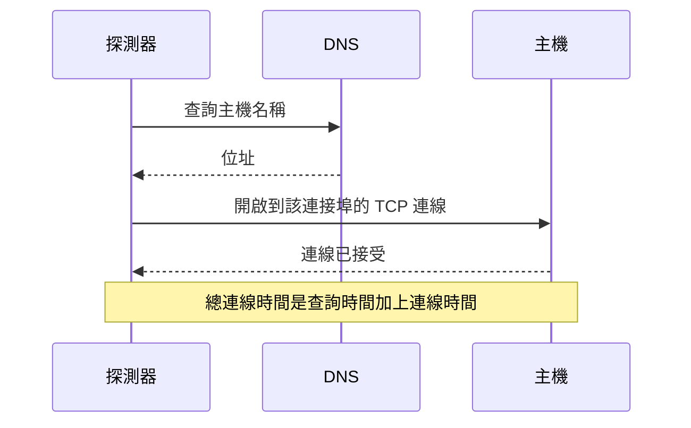

# 連接埠監控

連接埠監測器會檢查主機是否在某個連接埠上接受 TCP 連線，並測量建立連線所需的時間。可用於不使用 HTTP 的服務，或者您不想檢查其 HTTP 的服務：資料庫、郵件伺服器、SSH、訊息代理程式等。

:::cards
- [建立監測器](#建立連接埠監測器): 在主控台中完成六個步驟。
- [連線計時](#連線計時): DNS、TCP 和總時間分別測量什麼。
- [監測條件](#監測條件): 可連線性和連線時間。
- [疑難排解](#疑難排解): 服務正常運作，但監測器顯示離線時。
:::

## 運作方式

每次檢查時，如果您提供的是主機名稱，探測器會先查詢它，然後開啟到該連接埠的 TCP 連線。連線一被接受，連接埠就是上線的；接著探測器不傳送任何內容就關閉連線。被拒絕或逾時的連線會重試，最多重試您允許的次數。接著 OneUptime 會以監測器的條件評估結果。

探測器只會開啟 TCP 連線：只在 UDP 上接聽的服務（例如 SNMP 代理程式）無法以連接埠監測器檢查。

檢查失敗時，探測器還會追蹤到主機的路由並查詢它的名稱，然後把找到的內容以 **Network Path at Time of Failure** 附加到結果中，讓您看到路由在哪裡中斷。失去自身網路連線的探測器不會回報任何結果，因此它無法將您的服務標記為離線。

## 開始之前

- **可以建立監測器的角色**：Project Owner、Project Admin、Project Member、Monitor Admin 或 Monitor Member，或者擁有 Create Monitor 權限的自訂角色。
- **能夠連到該連接埠的探測器。** 每個新的監測器都會選取您專案的預設探測器。如果服務前面有防火牆，請允許 [OneUptime Cloud 探測器 IP 位址](/docs/configuration/ip-addresses) 連線到該連接埠。私有網路中的服務（例如資料庫）需要在該網路內執行的 [自訂探測器](/docs/probe/custom-probe)。

## 建立連接埠監測器

:::steps
### 開始建立新監測器

前往 **監測器**，點選 **建立監測器**。在 **監測器類型** 下選擇 **連接埠**。

### 命名

輸入 **名稱**，例如 `Orders database`，然後點選 **下一步**。

### 輸入主機和連接埠

在 **主機名稱或 IP 位址** 中輸入連接埠所在的主機，例如 `db.example.com` 或 `10.0.0.12`。在 **連接埠** 中輸入連接埠號碼，例如 `5432`。

### 測試

點選 **測試監測器**，在 **選擇探測器** 中選擇一個探測器，然後點選 **執行測試**。**監測器測試結果** 會顯示連線是否開啟，以及每個部分花了多少時間。

### 檢視條件

**監測器條件** 從 [預設條件](#預設條件) 開始：連接埠不接受連線時為離線，接受時為上線。如有需要可修改，然後點選 **下一步**。

### 選擇探測器並建立

保留或修改 **探測器** 和 **監測間隔**（初始為 **每 5 分鐘**），然後點選 **建立監測器**。監測器頁面隨即開啟。
:::

## 設定選項

| 欄位 | 預設值 | 填寫內容 |
| --- | --- | --- |
| **主機名稱或 IP 位址** | 無 | 主機，例如 `example.com`、`192.168.1.1` 或 `2001:db8::1`。只輸入主機，不要加上 `http://`。 |
| **連接埠** | 無 | 要連線的 TCP 連接埠，範圍為 `1` 到 `65535`。 |
| **請求逾時（秒）**（在 **更多欄位** 中） | `60` | 一次嘗試可以花費的時間，包括 DNS 查詢和 TCP 連線。最長為 60 秒。 |
| **失敗時重試**（在 **更多欄位** 中） | 探測器預設值，通常為 `3` | 失敗的嘗試要重試幾次。最多為 3。 |

**失敗時重試** 計算的是第一次嘗試 _之後_ 的重試次數，因此 `0` 只執行一次檢查，`2` 最多執行三次。留空時使用探測器的預設值：3，除非探測器的 `PROBE_MONITOR_RETRY_LIMIT` 另有設定。包括逾時在內的每次失敗都會重試，兩次嘗試之間暫停一秒。耗時超過 10 秒的成功連線也會再檢查一次。

常用連接埠：

| 連接埠 | 服務 |
| --- | --- |
| `22` | SSH |
| `25` | SMTP |
| `80` | HTTP |
| `443` | HTTPS |
| `3306` | MySQL |
| `5432` | PostgreSQL |
| `6379` | Redis |
| `27017` | MongoDB |

> [!NOTE]
> 許多託管服務供應商會封鎖輸出的 SMTP。在無法傳送 ping 的探測器上（探測器正是藉此發現自己執行在這類供應商那裡），逾時的連接埠 `25` 檢查會被視為上線。若要可靠地檢查郵件伺服器的連接埠 `25`，請在允許連線到該連接埠的 [自訂探測器](/docs/probe/custom-probe) 上執行監測器。

## 連線計時

對於主機名稱，探測器會分兩個階段測量檢查：

| 階段 | 從 | 到 |
| --- | --- | --- |
| **DNS 查詢** | 檢查開始 | 第一次 TCP 連線嘗試 |
| **TCP 連線** | 第一次 TCP 連線嘗試 | 連線被接受，包括在 IPv6 和 IPv4 位址之間切換所花的時間 |

**Total Connection Time (DNS + TCP)** 從檢查開始一直計算到連線被接受。它也是連接埠監測器的回應時間，因此使用回應時間的現有條件、警示和圖表都能繼續運作。

當目標是 IP 位址時，不需要 DNS 查詢，因此會省略該階段。在有分階段計時之前的檢查結果只會顯示總連線時間。

## 監測條件

條件決定連接埠何時算是上線、效能下降或離線，以及是否因此宣告事件或建立警示。每個條件會檢查一個或多個篩選器：

| 篩選器 | 條件 | 檢查內容 |
| --- | --- | --- |
| **Is Online** | **是**、**否** | 連接埠是否接受了連線。 |
| **Total Connection Time (DNS + TCP) (in ms)** | **Greater Than**、**Less Than**、**Greater Than Or Equal To**、**Less Than Or Equal To** | 整個連線時間，對於主機名稱還包括 DNS 查詢。 |
| **Port DNS Lookup Time (in ms)** | **Greater Than**、**Less Than**、**Greater Than Or Equal To**、**Less Than Or Equal To** | 第一次 TCP 嘗試之前的 DNS 查詢。當目標是 IP 位址時沒有值。 |
| **Port TCP Connect Time (in ms)** | **Greater Than**、**Less Than**、**Greater Than Or Equal To**、**Less Than Or Equal To** | 從第一次 TCP 嘗試到連線被接受，包括 IPv6 和 IPv4 之間的切換。 |
| **Is Request Timeout** | **是**、**否** | DNS 查詢或 TCP 連線是否在每次嘗試中都超過了逾時時間。 |

當目標是 IP 位址時，DNS 查詢條件沒有可評估的內容。對於必須同時適用於主機名稱和 IP 位址的條件，請使用總時間或 TCP 連線時間。

有兩個以上的篩選器時，**符合條件** 決定是 **全部** 篩選器都必須符合，還是 **任何** 一個符合即可。條件的 **操作** 決定它做什麼：變更監測器狀態、建立警示、宣告事件，或其中任意幾項。

### 預設條件

新的連接埠監測器以兩個條件開始：

- **離線** — 在所有重試之後，連接埠仍不接受連線。監測器會被標記為 **離線**，並建立名為「_monitor name_ is offline」的事件。連接埠再次接受連線後，事件會自行解決。
- **上線** — 連接埠接受連線。監測器會被標記為 **運作中**。

條件由上而下檢查，第一個符合的條件決定接下來會發生什麼。沒有任何條件符合時，監測器會顯示它的預設狀態：**運作中**，除非您在條件下方的 **更多欄位** 中選擇了其他狀態。

### 在一段時間內評估

**在一段時間內評估此條件** 是篩選器下方的核取方塊，適用於 **Is Online**、**Total Connection Time (DNS + TCP) (in ms)**、**Port DNS Lookup Time (in ms)** 和 **Port TCP Connect Time (in ms)**。開啟它即可判斷過去一段時間內的檢查，而不只是最近一次：在 **評估** 中選擇彙總方式，在 **過去(以分鐘計)** 中選擇 2 到 60 分鐘的時間範圍。

| 彙總 | 符合的時機 |
| --- | --- |
| **平均**、**總和**、**Maximum Value**、**Minimum Value** | 該數值在整個時間範圍內滿足條件。僅限數值篩選器。 |
| **All Values** | 時間範圍內的每次檢查都滿足條件。 |
| **Any Value** | 時間範圍內至少有一次檢查滿足條件。 |

**All Values** 只有在時間範圍真正被資料涵蓋後才會符合。剛建立的監測器，或檢查已不再被記錄的監測器，沒有足夠的歷史資料來說明過去 N 分鐘的情況，因此條件會等待，而不是根據手上僅有的一個讀數符合。**Any Value** 用於「只要有一次檢查超過臨界值就立刻告訴我」，而且仍會立即觸發。

**如果沒有資料** 決定在時間範圍無法支撐條件時會發生什麼：

| 選項 | 會發生什麼 | 適用於 |
| --- | --- | --- |
| **Ignore**（預設） | 條件不符合。 | 一般的臨界值警示。 |
| **觸發器** | 缺少的資料本身被視為問題。 | 沉默本身就是故障的檢查。 |
| **Treat As Zero** | 將時間範圍視為單一個零來比較。 | 沒有事件確實代表零的計數器。 |

### 條件範例

| 目標 | 篩選器 | 條件 | 值 |
| --- | --- | --- | --- |
| 連接埠關閉時為離線 | **Is Online** | **否** | — |
| 連線緩慢時發出警示 | **Total Connection Time (DNS + TCP) (in ms)** | **Greater Than** | `500` |
| 連線緩慢時將服務標記為效能下降 | **Total Connection Time (DNS + TCP) (in ms)** | **Greater Than** | `200` |
| DNS 緩慢時發出警示 | **Port DNS Lookup Time (in ms)** | **Greater Than** | `100` |
| TCP 交握緩慢時發出警示 | **Port TCP Connect Time (in ms)** | **Greater Than** | `250` |

## 疑難排解

:::details 服務正常運作，但監測器顯示離線
探測器無法開啟連線：防火牆丟棄了它，服務只在私有介面上接聽，或者連接埠不對。事件的根本原因，以及監測器上的 **監測日誌**，會顯示錯誤，**Network Path at Time of Failure** 會顯示路由到達了哪裡。請在防火牆上允許探測器，或者在該網路內使用 [自訂探測器](/docs/probe/custom-probe)。
:::

:::details DNS 查詢時間總是空白
目標是 IP 位址，因此沒有需要查詢的內容。請改用 **Total Connection Time (DNS + TCP) (in ms)** 或 **Port TCP Connect Time (in ms)**。
:::

:::details 我需要檢查 UDP 服務
連接埠監測器只會開啟 TCP 連線。對於 DNS 伺服器，請使用 [DNS 監控](/docs/monitor/dns-monitor)；對於 UDP 連接埠 123 上的時間伺服器，請使用 [NTP 監控](/docs/monitor/ntp-monitor)。兩者都會傳送真實的查詢。
:::

## 後續步驟

:::cards
- [Ping 監控](/docs/monitor/ping-monitor): 檢查主機本身是否可以連線。
- [SSL 憑證監控](/docs/monitor/ssl-certificate-monitor): 檢查 TLS 連接埠上的憑證。
- [資料庫健康狀態監控](/docs/monitor/database-health-monitor): 不止於開放的連接埠，監測資料庫的健康狀態。
- [自訂探針](/docs/probe/custom-probe): 檢查您自己網路中的連接埠。
:::
