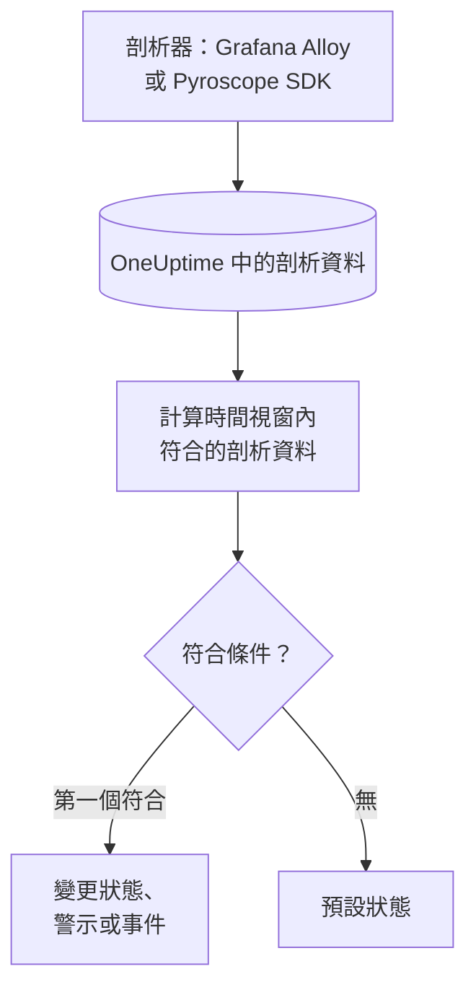

# 效能剖析監控

效能剖析監測器會在一個時間視窗內，計算您的服務傳送到 OneUptime、且符合您篩選器（剖析類型、服務、屬性）的持續剖析資料。當計數符合您的條件時，它會變更監測器的狀態、建立警示或宣告事件。它的主要用途是發現某個服務不再傳送剖析資料。

> [!IMPORTANT]
> 儀表板中的 **建立監測器** 不提供 Profiles：它的篩選器還沒有表單。請依下文所述，透過 [API](/docs/api-reference/api-reference) 或 [Terraform](/docs/terraform/monitor-steps) 建立效能剖析監測器。建立後，您可以在儀表板中監測器的 **條件** 頁面檢視與編輯它的條件；它的篩選器只能透過 API 或 Terraform 變更。

:::cards
- [建立監測器](#建立效能剖析監測器): 透過 API 或 Terraform 傳送的設定。
- [查詢內容](#查詢內容): 剖析類型、服務、屬性與時間視窗。
- [條件](#條件): 可以使用的條件。
- [實例](#實例剖析資料不再抵達): 知道某個服務何時停止傳送剖析資料。
:::

## 運作方式



OneUptime 每分鐘計算一次符合監測器篩選器、且在其時間視窗內開始的剖析資料。它會把這個計數由上而下與監測器的條件比較，第一個符合的條件決定接下來發生什麼。如果沒有任何條件符合，監測器會回到預設狀態。

## 開始之前

- 您的服務透過 Grafana Alloy（eBPF）或 Pyroscope SDK 將持續剖析資料傳送到 OneUptime。請參閱 [持續效能剖析](/docs/telemetry/profiles)。
- 您有可以建立監測器的 API 金鑰，或者已設定好 OneUptime 的 Terraform provider。
- 您知道要監看的每個遙測服務的 ID，以及它傳送的剖析類型，例如 `cpu`、`wall`、`alloc_objects`、`alloc_space` 或 `goroutine`。

## 建立效能剖析監測器

:::steps
### 選擇要計算的內容

撰寫步驟的 `profileMonitor` 設定。下面的設定會計算一個服務在最近五分鐘內的 CPU 剖析資料：

```json
{
  "profileMonitor": {
    "telemetryServiceIds": [],
    "profileTypes": ["cpu"],
    "profileType": "",
    "attributes": {},
    "lastXSecondsOfProfiles": 300
  }
}
```

把服務的 ID 放入 `telemetryServiceIds`，或者把清單留空以計算所有服務的剖析資料。[查詢內容](#查詢內容) 說明了每個欄位。

### 建立監測器

透過 [API](/docs/api-reference/api-reference) 或 [Terraform](/docs/terraform/monitor-steps) 建立一個監測器類型為 `Profiles` 的監測器，其步驟包含此設定與至少一個條件。在 Terraform 中，把設定作為步驟的 `profile_monitor` 屬性傳入，以 `jsonencode()` 撰寫。

### 在儀表板中檢查

從 **監測器** 開啟監測器。第一次評估會在一分鐘內執行，一旦有條件符合，狀態就會改變。
:::

## 查詢內容

| 欄位 | 符合什麼 | 預設值 |
| --- | --- | --- |
| `profileTypes` | 屬於這些類型之一的剖析資料，精確比對，例如 `cpu`。 | 空：所有類型 |
| `profileType` | 類型包含此文字的剖析資料，不區分大小寫。設定後會忽略 `profileTypes`。 | 空 |
| `telemetryServiceIds` | 來自這些遙測服務之一的剖析資料。 | 空：所有服務 |
| `entityKeys` | 來自這些主機、Pod、容器及其他基礎架構實體之一的剖析資料。 | 空：所有實體 |
| `attributes` | 屬性具有這些值的剖析資料。 | 空：無條件 |
| `lastXSecondsOfProfiles` | 在評估前這麼多秒內開始的剖析資料。 | 無：請一律設定它，否則會計算所有已儲存的剖析資料，計數永遠不會降到 0 |

剖析資料必須符合您設定的所有篩選器才會被計數。

## 如何評估

- **每分鐘。** 效能剖析監測器不是由探測器檢查，因此沒有可設定的間隔，也沒有 **探測器與間隔** 頁面。
- **每次評估一個數字。** 監測器會計算符合所有篩選器、且在 `lastXSecondsOfProfiles` 內開始的剖析資料。剖析器會依固定間隔上傳，所以請讓時間視窗留出容納多次上傳的空間。
- **沒有剖析資料就是計數 0。** 剖析器停止上傳的服務計數為 0。
- **OneUptime 本身的停機不算沉默。** 只要時間視窗中包含 OneUptime 本身沒有接收資料的時間（正在重新啟動、升級或追趕積壓），檢查就會等待：狀態不會改變，也不會開啟或解決任何事件或警示。請參閱 [OneUptime 未接收資料時](/docs/monitor/when-oneuptime-is-not-receiving)。
- **條件由上而下。** 第一個符合的條件決定結果，因此請把最嚴重的放在最前面。

每次狀態變更及其原因，都會記錄在監測器的 **狀態時間軸** 上。

## 條件

效能剖析監測器的條件只有一個篩選器 **Profile Count**：視窗內符合的剖析資料數量。將它與一個值比較：

| 篩選條件 | 當剖析資料數量…時符合 |
| --- | --- |
| **Greater Than** | 高於該值 |
| **Greater Than Or Equal To** | 等於或高於該值 |
| **Less Than** | 低於該值 |
| **Less Than Or Equal To** | 等於或低於該值 |
| **Equal To** | 正好等於該值 |
| **Not Equal To** | 不等於該值 |

剖析資料數量沒有異常條件：沒有可以與之比較的基準。

## 實例：剖析資料不再抵達

結帳服務執行著一個上傳 CPU 剖析資料的 Pyroscope SDK。您希望它們停止五分鐘時建立事件：

- `profileTypes`：`["cpu"]`，`telemetryServiceIds`：結帳服務，`lastXSecondsOfProfiles`：`300`
- 條件 1：**Profile Count** **Equal To** `0`：將監測器標記為離線並宣告事件
- 條件 2：**Profile Count** **Greater Than** `0`：將監測器標記為上線

只要 SDK 在上傳，每次評估都會計算到一些剖析資料，條件 2 讓監測器維持上線。當服務在沒有 SDK 的情況下部署後，計數會在最後一次上傳五分鐘後降到 0，條件 1 符合並宣告事件。修正後的第一次上傳讓計數重新高於 0，如果該事件開啟了 **自動解決事件**，事件會自行解決。

## 疑難排解

:::details 監測器計數為 0，但 OneUptime 中看得到剖析資料
把篩選器與您看到的剖析資料比較：`profileTypes` 必須與類型完全符合，`telemetryServiceIds` 必須包含正確的服務 ID。`lastXSecondsOfProfiles` 太短也可能剛好落在兩次上傳之間。
:::

:::details 建立監測器 中沒有 Profiles
這是預期行為：儀表板還沒有效能剖析監測器篩選器的表單。請依 [建立效能剖析監測器](#建立效能剖析監測器) 中所述，透過 API 或 Terraform 建立。
:::

## 後續步驟

:::cards
- [持續效能剖析](/docs/telemetry/profiles): 從 Grafana Alloy 或 Pyroscope SDK 傳送剖析資料。
- [監控步驟](/docs/terraform/monitor-steps): 從 Terraform 傳入步驟設定。
- [追蹤監控](/docs/monitor/traces-monitor): 針對失敗的 Span 發出警示。
- [指標監控](/docs/monitor/metrics-monitor): 針對 CPU、記憶體與其他指標發出警示。
:::
