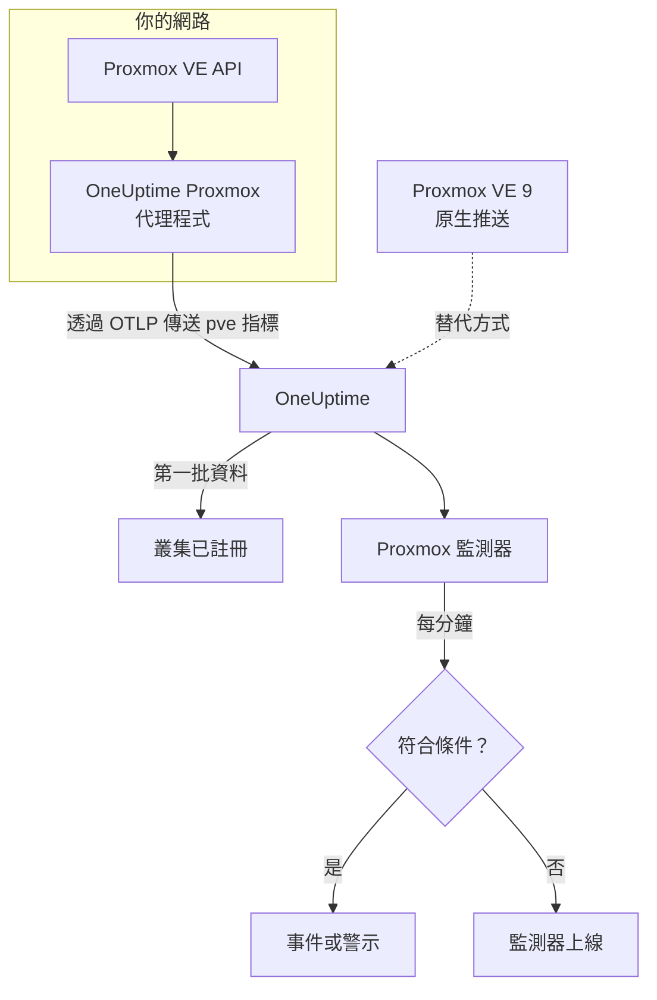

# Proxmox 監控

Proxmox 監測器監控一個 Proxmox VE 叢集（它的節點、虛擬機器與 LXC 容器、儲存空間、HA 狀態、備份工作的涵蓋範圍和儲存複寫），並在節點離線、客體停止或儲存空間快滿時通知你。它讀取 OneUptime Proxmox 代理程式收集的 `pve_*` 指標，因此不會從外部探測任何東西。

:::cards
- [建立監測器](#建立-proxmox-監測器): 在儀表板中完成六個步驟。
- [範本](#現成的警示範本): 十一個現成的警示，每個節點、客體或磁碟區一個事件。
- [資源識別](#資源識別): 如何指定單一節點、客體或儲存磁碟區。
- [指標](#收集的指標): 監測器可以據以發出警示的每個 `pve_*` 序列。
:::

## 運作方式

OneUptime Proxmox 代理程式在一台能連到 Proxmox VE API 的機器上執行。它每 30 秒使用叢集和節點收集器擷取 prometheus-pve-exporter，替每個序列標上它所描述的資源，並透過 OTLP 把指標傳送到 OneUptime，同時加上叢集名稱 `proxmox.cluster.name`。第一批資料會註冊該叢集。Proxmox VE 9 以上版本也可以改為原生推送指標，不需安裝任何東西；請參閱 [原生推送](#proxmox-ve-原生推送)。

Proxmox 監測器綁定到一個叢集。它每分鐘對這個叢集的指標執行查詢，並把結果與條件比較。

## 開始之前

- **安裝 Proxmox 代理程式**，裝在能連到 Proxmox VE API 的地方，並使用唯讀 API 權杖。[Proxmox 代理程式指南](/docs/telemetry/proxmox) 說明了權杖、安裝和原生推送。
- **確認叢集已註冊。** 第一次擷取後大約一分鐘，它會以代理程式的 `PROXMOX_CLUSTER_NAME` 命名，出現在 **產品 → 基礎設施 → Proxmox → 所有叢集** 下。

## 建立 Proxmox 監測器

:::steps
### 開始新的監測器

前往 **監測器** 並按一下 **建立監測器**。

### 選擇 Proxmox

在 **監測器類型** 下按一下 **更多監測器類型**，然後在 **基礎設施** 下選擇 **Proxmox**，或在搜尋方塊中輸入 `proxmox`。輸入 **名稱**（會用在事件和警示標題中），然後按一下 **下一步**。

### 選擇叢集

在 **Proxmox Monitor Configuration** 下，從 **Proxmox Cluster** 中選擇叢集。傳送過資料的每個叢集都在清單中。

### 選擇要監控的內容

選擇三個分頁之一：

- **Quick Setup** – 按一下一個 [範本](#現成的警示範本)。它會設定指標、篩選器、彙總、時間範圍和閾值，並用自己的條件取代下方的條件。你仍然可以變更 **時間範圍**。
- **Custom Metric** – 從 **Proxmox Metric** 中選擇一個指標，然後設定 **彙總** 和 **時間範圍**。[篩選器](#監測器設定) 可以把範圍縮小到某類資源或單一資源。
- **進階** – 在 **選擇指標** 下自行建立查詢和公式，例如由 `pve_memory_usage_bytes / pve_memory_size_bytes` 算出記憶體百分比。使用 **Group by** `id` 可以個別評判每個資源。

### 檢查條件

開啟 **監測器條件** 下的每個條件，檢查其 **指標**、**彙總**、**條件** 和 **Threshold**。範本會填好這些內容。使用 **Custom Metric** 或 **進階** 時，監測器會從 [預設條件](#預設條件) 開始，這些條件只會注意到指標降到零，所以請設定你自己的閾值。

### 建立監測器

按一下 **建立監測器**。OneUptime 會開啟監測器的頁面，並每分鐘評估一次。它開啟的事件和警示也會列在叢集的 **事件** 和 **警示** 頁面上。
:::

> [!TIP]
> 若要一次設定多個範本，請從 **產品 → 基礎設施 → Proxmox** 開啟叢集，然後前往 **Recommendations**。選擇你需要的範本和要呼叫的人，OneUptime 就會為每個範本建立一個監測器。

## 監測器設定

| 欄位 | 分頁 | 作用 |
| --- | --- | --- |
| **Proxmox Cluster** | 全部 | 必填。把每個查詢限定在 `resource.proxmox.cluster.name`。 |
| **資源範圍** | Custom Metric、進階 | 選用。**節點**、**Guest (VM / container)**、**儲存空間** 或 **叢集**，與 `pve.scope` 完全相符。 |
| **PVE ID** | Custom Metric、進階 | 選用。與 `pve.id` 完全相符：節點名稱（`pve1`）、VMID（`100`）或 `<node>/<storage>`（`pve1/local`）。與範圍搭配可以指定單一資源。 |
| **節點名稱** | Custom Metric、進階 | 選用。只符合節點本身的序列（`pve.scope = node` 和 `pve.id`）。它無法選取該節點上的客體或儲存空間。 |
| **Guest ID** | Custom Metric、進階 | 選用。與原始 `id` 標籤完全相符，例如 `qemu/100` 或 `lxc/101`。設定後會忽略其他篩選器。 |
| **Proxmox Metric** | Custom Metric | [目錄](#收集的指標) 中的一個指標。 |
| **彙總** | Custom Metric | 樣本的合併方式：**平均**、**最大值**、**最小值**、**總和** 或 **計數**。初始值為該指標通常的彙總方式。 |
| **時間範圍** | 全部 | 查詢讀取的滾動視窗，從 **Past 1 Minute** 到 **Past 365 Days**。新監測器從 **Past 1 Minute** 開始；範本會設定自己的值。 |
| **選擇指標** | 進階 | 查詢建立器：**指標**、**Aggregate by**、**Filter by attributes**、**Group by**，以及用來組合查詢的 **新增指標** 和 **新增公式**。 |

## 資源識別

每個序列都帶有一個資料點標籤 `id`，指出它所屬的 Proxmox 資源：

| `id` 值 | 資源 |
| --- | --- |
| `node/<name>` | 叢集節點，例如 `node/pve1`。 |
| `qemu/<vmid>` | QEMU 虛擬機器，例如 `qemu/100`。 |
| `lxc/<vmid>` | LXC 容器，例如 `lxc/101`。 |
| `storage/<node>/<storage>` | 節點上的儲存磁碟區，例如 `storage/pve1/local`。 |

有兩個例外：複寫序列（`pve_replication_*`）在 `id` 中攜帶複寫**工作**的 ID（例如 `100-0`），而叢集層級的 `pve_not_backed_up_total` 完全沒有 `id`。

篩選器依相等比對，而不是依前綴比對，所以代理程式也會把 `id` 拆成三個可供篩選的屬性。範本依賴這些屬性：

| 屬性 | 值 | 對於 `qemu/100` |
| --- | --- | --- |
| `pve.scope` | `node`、`guest`、`storage`、`cluster`（`qemu` 和 `lxc` 都是 `guest`） | `guest` |
| `pve.type` | `node`、`qemu`、`lxc`、`storage` | `qemu` |
| `pve.id` | `id` 中第一個 `/` 之後的全部內容（`pve1`、`100`、`pve1/local`） | `100` |

依 `pve.scope` 或 `pve.type` 篩選可選出一類資源，依 `pve.id` 或 `id` 篩選可選出單一資源，依 `id` 分組則可以個別評判每個資源。

## 現成的警示範本

**Quick Setup** 提供 11 個範本。每個範本都會建立一個完整的監測器：查詢、屬性篩選器、分組、一個觸發的條件和一個恢復的條件。大多數依 `id` 分組，所以每個節點、客體、磁碟區或工作都有自己的事件和警示。閾值只是起點，你可以編輯。

除非表格另有說明，範本會讀取最近 5 分鐘的資料。條件只有在其視窗的每一分鐘都成立時才會觸發，閾值條件會在越過閾值 10% 處恢復，這樣在邊界附近徘徊的值就不會來回跳動。

| 範本 | 嚴重程度 | 監控內容 | 觸發時機 | 恢復時機 |
| --- | --- | --- | --- | --- |
| Node Offline | 嚴重 | `pve.scope = node` 的 `pve_up`，依 `id` 取 Min | 低於 1 | 等於 1 |
| Guest Down | Warning | `pve.scope = guest` 的 `pve_up` 和 `pve_onboot_status`，依 `id` 取 Min | `pve_onboot_status` 為 1 時 `pve_up` 低於 1 | `pve_up` 回到 1，或關閉開機時啟動 |
| Cluster Quorum at Risk | 嚴重 | `pve.scope = node` 的 `pve_up` ÷ `pve_node_info` × 100（兩者都取總和）：上線節點的比例 | 50% 以下 | 高於 55% |
| High Node CPU Usage | Warning | `pve.scope = node` 的 `pve_cpu_usage_ratio`，依 `id` 取 Avg | 高於 0.9（節點核心的 90%） | 不高於 0.81 |
| High Node Memory Usage | Warning | `pve.scope = node` 的 `pve_memory_usage_bytes` ÷ `pve_memory_size_bytes` × 100，依 `id` | 高於 85% | 不高於 76.5% |
| High Guest CPU Usage | Warning | `pve.scope = guest` 的 `pve_cpu_usage_ratio`，依 `id` 取 Avg，最近 15 分鐘 | 整整 15 分鐘都高於 0.95（其 vCPU 的 95%） | 不高於 0.855 |
| Storage Near Full | Warning | `pve.scope = storage` 的 `pve_disk_usage_bytes` ÷ `pve_disk_size_bytes` × 100，依 `id` | 高於 85% | 不高於 76.5% |
| Container Root Disk Near Full | Warning | 針對 `pve.type = lxc` 的同一磁碟比率，依 `id` | 高於 90% | 不高於 81% |
| HA Resource in Error State | 嚴重 | `state = error` 的 `pve_ha_state`，依 `id` 取 Max | 高於 0 | 等於 0 |
| Guest Not Backed Up | Warning | `pve_not_backed_up_total`，Max（整個叢集一個序列） | 高於 0 | 等於 0 |
| Replication Failing | 嚴重 | `pve_replication_failed_syncs`，依 `id`（工作 ID）取 Max | 高於 0 | 等於 0 |

**嚴重程度** 是選擇清單中顯示的標籤。範本建立的事件和警示會從專案中最嚴重的事件和警示嚴重程度開始；請在條件中變更它們。

- **停機類範本使用最小值**，所以只要有一次擷取時資源處於停機狀態就會觸發，而不會被資源正常執行的擷取掩蓋。
- **Guest Down** 範本只關注設為開機時啟動的客體，所以你刻意停止的客體永遠不會呼叫任何人。
- **Cluster Quorum at Risk** 範本是一種近似：pve-exporter 沒有 corosync 指標，所以它計算上線的節點。
- **High Guest CPU Usage** 範本的閾值比節點範本更高、反應更慢：客體本來就應該用滿它的 vCPU，所以只有一直降不下來的客體才會呼叫人。
- **比率公式** 對兩邊都取 **總和**。兩邊來自同一次擷取，所以結果是真正的百分比。
- **Container Root Disk Near Full** 範本不包括 QEMU 虛擬機器：沒有 QEMU 客體代理程式時，它們的磁碟使用量讀數為 0。
- **Guest Not Backed Up** 範本只涵蓋備份工作的成員資格。pve-exporter 不會回報備份是否執行或成功；若要列出這些客體，請依 `id` 將 `pve_not_backed_up_info` 分組。
- **複寫陳舊度**（目前時間減去最後一次同步）無法用於警示，因為條件不支援時間運算。叢集的 **概覽** 頁面會顯示它；請改用 **Replication Failing** 發出警示。

### Proxmox VE 原生推送

Proxmox VE 9 以上版本可以透過內建的 OpenTelemetry 指標伺服器推送指標，不需安裝任何東西，請參閱 [Proxmox 代理程式指南](/docs/telemetry/proxmox)。OneUptime 會把推送轉換成相同的 `pve_*` 序列，所以目錄以及 CPU、記憶體和儲存空間範本都能搭配它使用。

**Node Offline** 和 **Cluster Quorum at Risk** 同樣可用：每個節點只推送自己的狀態，所以停止回報的節點會被仍然存活的節點回報為停機（`pve_up` = 0），請參閱 [節點停止回報時](/docs/telemetry/proxmox#when-a-node-stops-reporting)。**Guest Down**、**HA Resource in Error State**、**Guest Not Backed Up** 和 **Replication Failing** 需要只有代理程式才會收集的資料。

## 收集的指標

代理程式每 30 秒使用叢集和節點兩類收集器擷取 prometheus-pve-exporter，這也涵蓋了匯出器的 `backup-info` 和 `replication` 收集器（兩者預設都開啟）。

### 可用性

| 指標 | 單位 | 說明 |
| --- | --- | --- |
| `pve_up` | — | 節點或客體已啟動或正在執行時為 1，否則為 0。 |
| `pve_uptime_seconds` | 秒 | 節點或客體的運行時間。 |
| `pve_version_info` | 計數 | 標籤中的 Proxmox VE 版本。一律為 1。 |

### 節點

| 指標 | 單位 | 說明 |
| --- | --- | --- |
| `pve_node_info` | 計數 | 節點中繼資料，一律為 1。加總可計算正在回報的節點數。 |
| `pve_cpu_usage_ratio` | 比率 | 已用 CPU 占可用 CPU 的比率（0–1）。 |
| `pve_cpu_usage_limit` | 核心 | 可用 CPU，單位為核心。對於客體，是它的 vCPU。 |
| `pve_memory_usage_bytes` | 位元組 | 使用中的記憶體。 |
| `pve_memory_size_bytes` | 位元組 | 總記憶體。 |

CPU 和記憶體序列也會針對每個客體回報，使用 `qemu/*` 和 `lxc/*` ID。

### 客體

| 指標 | 單位 | 說明 |
| --- | --- | --- |
| `pve_guest_info` | 計數 | 標籤中的客體中繼資料（名稱、節點、類型 `qemu` 或 `lxc`）。一律為 1。 |
| `pve_network_receive_bytes` | 位元組 | 客體接收的位元組數。生命週期計數器。 |
| `pve_network_transmit_bytes` | 位元組 | 客體傳送的位元組數。生命週期計數器。 |
| `pve_disk_read_bytes` | 位元組 | 客體從磁碟讀取的位元組數。生命週期計數器。 |
| `pve_disk_write_bytes` | 位元組 | 客體寫入磁碟的位元組數。生命週期計數器。 |
| `pve_onboot_status` | 計數 | 客體在節點開機時啟動則為 1。設定了此項卻處於停止狀態的客體，通常代表非計畫性停機。 |

### 儲存空間

| 指標 | 單位 | 說明 |
| --- | --- | --- |
| `pve_disk_usage_bytes` | 位元組 | 磁碟或儲存空間上已用的位元組數。對於 QEMU 客體，除非安裝了 QEMU 客體代理程式，否則讀數為 0。 |
| `pve_disk_size_bytes` | 位元組 | 磁碟或儲存空間的總大小。 |
| `pve_storage_info` | 計數 | 儲存空間中繼資料，一律為 1。加總可計算儲存磁碟區的數量。 |

### HA

| 指標 | 單位 | 說明 |
| --- | --- | --- |
| `pve_ha_state` | — | 每個 HA 資源的每種 HA 狀態（`started`、`stopped`、`error`、…）各一個序列，在其目前狀態上為 1。若要針對某個狀態發出警示，請依 `state` 標籤篩選。 |

### 備份

來自匯出器的叢集層級 `backup-info` 收集器。它們只回報備份**工作**的涵蓋範圍：

| 指標 | 單位 | 說明 |
| --- | --- | --- |
| `pve_not_backed_up_total` | 計數 | 不在任何備份工作中的客體。整個叢集一個序列，沒有 `id`。 |
| `pve_not_backed_up_info` | 計數 | 每個未被涵蓋的客體一個序列，一律為 1，帶有客體的 `id` 標籤。客體加入備份工作後它就會消失。 |

### 複寫

來自匯出器的節點層級 `replication` 收集器。只有當叢集有複寫工作時這些序列才存在，並在 `id` 中攜帶工作 ID：

| 指標 | 單位 | 說明 |
| --- | --- | --- |
| `pve_replication_failed_syncs` | 計數 | 連續失敗的同步嘗試次數。大於 0 表示複本正在變得陳舊。 |
| `pve_replication_duration_seconds` | 秒 | 最近一次同步所花的時間。 |
| `pve_replication_last_sync_timestamp_seconds` | 秒 | 最近一次**成功**同步的 Unix 時間。 |
| `pve_replication_last_try_timestamp_seconds` | 秒 | 最近一次**嘗試**的 Unix 時間。比最近一次同步還新，表示最新的嘗試失敗了。 |
| `pve_replication_next_sync_timestamp_seconds` | 秒 | 下一次排定同步的 Unix 時間。 |
| `pve_replication_info` | 計數 | 標籤中的工作中繼資料（類型、來源、目標、客體）。一律為 1。 |

## 監控條件

條件會把監測器的某個查詢或公式與閾值比較。Proxmox 監測器的條件沒有 **篩選器類型**：每條規則都以下列欄位檢查指標值。

| 欄位 | 作用 |
| --- | --- |
| **指標** | 要檢查的查詢或公式，以其變數名稱指定。 |
| **彙總** | 視窗中的值如何變成一個結果：**平均**、**總和**、**Maximum Value**、**Minimum Value**、**All Values**（每個值都必須符合）或 **Any Value**（一個就夠）。 |
| **條件** | **Greater Than**、**Less Than**、**Greater Than Or Equal To**、**Less Than Or Equal To** 或 **Equal To**，或是異常條件：**Anomalously High**、**Anomalously Low** 或 **Anomalous**。 |
| **Threshold** | 用來比較的值。如果指標有單位，旁邊會有單位清單。異常條件下不會顯示。 |
| **敏感度** | 僅限異常條件。**低**（4σ）、**中**（3σ，預設）或 **高**（2σ）。 |
| **基準視窗** | 僅限異常條件。14 天（預設）、28、60 或 90 天的歷史。 |
| **如果沒有資料** | 位於 **更多欄位** 下。視窗中沒有樣本時的處理方式：**Ignore**（預設）、**Treat As Zero** 或 **觸發器**。 |

異常條件會把每個值與基準中一週的同一小時比較。在基準視窗累積足夠的歷史之前，它們會停留在「Learning」狀態，不產生任何結果。

每個條件也會說明符合時要做什麼：變更監測器狀態、建立警示或宣告事件。條件會由上而下檢查，第一個符合的條件決定結果。

### 預設條件

不是從範本建立的監測器會以兩個條件開始：

| 順序 | 條件 | 符合時機 | 結果 |
| --- | --- | --- | --- |
| 1 | Check if _monitor name_ is offline | 第一個查詢的任一值為 `0` | 將監測器標記為 **離線**，並宣告事件「_monitor name_ is offline」，監測器恢復後該事件會自動解決。 |
| 2 | Check if _monitor name_ is online | 任一值大於 `0` | 將監測器標記為 **運作中**。 |

> [!IMPORTANT]
> 靜默不會符合任何一個條件：停止傳送資料的叢集會讓監測器維持原狀。若要在資料停止時收到通知，請在某個條件上把 **如果沒有資料** 設為 **觸發器**。OneUptime 本身未接收資料的時間永遠不算是沒有資料：視窗中包含這類時間的檢查會改為等待，詳見 [OneUptime 未接收資料時](/docs/monitor/when-oneuptime-is-not-receiving)。

## 疑難排解

:::details 叢集不在 Proxmox Cluster 清單中
叢集會依據代理程式的資料自動註冊。請檢查代理程式是否正在執行並傳送資料（請參閱 [Proxmox 代理程式指南](/docs/telemetry/proxmox)），以及是否設定了 `PROXMOX_CLUSTER_NAME`。
:::

:::details 缺少客體指標
客體序列來自匯出器的叢集收集器，隨附的設定以擷取參數 `cluster=1` 開啟它。如果你變更過收集器設定，請將它還原。
:::

:::details High Node CPU Usage 從不觸發
範本依 `id` 對 `pve_cpu_usage_ratio` 取平均值，所以每個節點都會個別檢查。如果你建立了自己的查詢，請依 `id` 分組：對所有節點取平均值會被閒置的節點拉低。
:::

:::details 已從叢集移除的節點持續觸發 Node Offline
在 Proxmox VE 原生推送下，被移出叢集的節點看起來和停機的節點一樣：它停止了回報，所以仍然存活的節點會一直把它回報為停機。開啟該節點的頁面並按一下 **Remove Node**，節點就會消失，其警示也會解決。否則它會保持離線最多 7 天。代理程式沒有這個問題：它會詢問叢集，而叢集已不再列出該節點。
:::

:::details 缺少備份或複寫指標
`pve_not_backed_up_*` 來自匯出器的 `backup-info` 收集器，`pve_replication_*` 來自它的 `replication` 收集器。兩者預設都開啟，並由隨附設定的擷取參數 `cluster=1` 和 `node=1` 涵蓋。如果你執行自己的匯出器，請確認沒有關閉它們。只有當叢集有儲存複寫工作時，`pve_replication_*` 才存在。
:::

:::details 像 pve_network_receive_bytes 這樣的計數器只增不減
網路和磁碟 I/O 序列是生命週期計數器，而條件比較的是原始值：沒有速率運算子，查詢建立器中的 **Convert to per-second rate** 只會改變圖表。請以速率形式繪製它們的圖表，或以公式針對它們的成長發出警示，例如以同一計數器的 **最大值** 查詢減去 **最小值** 查詢。
:::

## 後續步驟

:::cards
- [Proxmox 代理程式](/docs/telemetry/proxmox): 安裝代理程式，或設定原生推送。
- [Ceph 監控](/docs/monitor/ceph-monitor): 監控 Proxmox 叢集背後的 Ceph 儲存空間。
- [VMware 監控](/docs/monitor/vmware-monitor): 適用於 vSphere 的同類監測器。
- [事件概觀](/docs/incidents/index): 條件宣告事件之後會發生什麼事。
:::
