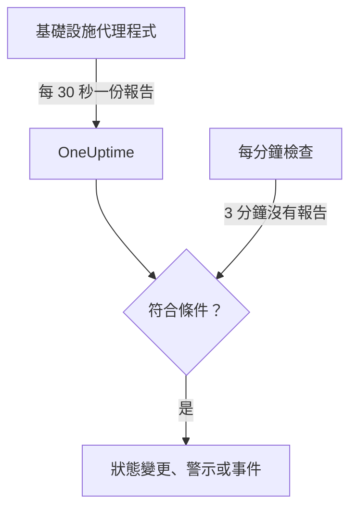

# 伺服器 / 虛擬機器監控

Server / VM 監測器透過 OneUptime 基礎設施代理程式（`oneuptime-infrastructure-agent`）監控一台機器。這個代理程式是一個小型服務，每 30 秒向 OneUptime 回報一次 CPU、記憶體、磁碟、負載、網路和正在執行的處理程序。本頁說明如何將代理程式連接到 Server / VM 監測器、代理程式回報哪些內容，以及如何撰寫判斷伺服器上線或離線的條件。

> [!IMPORTANT]
> **建立監測器** 已不再提供 **Server / VM**。你已有的 Server / VM 監測器會繼續運作，本頁的所有內容都適用於它們。若要監控新的伺服器，請改為建立 [主機監測器](/docs/monitor/host-monitor)：它會依據 [主機 OpenTelemetry Collector](/docs/telemetry/host-otel-collector) 傳送的主機指標發出警示。

:::cards
- [連接代理程式](#連接代理程式): 安裝代理程式、提供監測器的密鑰，然後啟動它。
- [代理程式回報的內容](#代理程式回報的內容): CPU、記憶體、磁碟、負載、網路和處理程序。
- [監控條件](#監控條件): 決定伺服器何時算是上線或離線。
- [疑難排解](#疑難排解): 代理程式沒有回報，或監測器始終不會進入離線狀態。
:::

## 運作方式

代理程式以系統服務的形式執行。它每 30 秒收集一份報告，以監測器的密鑰簽署後傳送到你的 OneUptime URL。OneUptime 會把這些數值存為監測器的指標，並用監測器的條件檢查報告。

靜默會另外檢查。OneUptime 每分鐘會重新評估所有 3 分鐘以上沒有回報的 Server / VM 監測器的 **Is Online** 條件；靜默時間超過條件允許範圍（預設 3 分鐘）的伺服器會被視為離線。沒有 **Is Online** 條件的監測器，不會只因為代理程式靜默就被標記為離線。只有 OneUptime 正在接收資料的時間才會計入這段靜默：OneUptime 本身重新啟動、升級或追趕積壓的時間不會計入，詳見 [OneUptime 未接收資料時](/docs/monitor/when-oneuptime-is-not-receiving)。



## 開始之前

- 專案中有一個 Server / VM 監測器。
- 編輯監測器的權限。密鑰以及包含密鑰的設定指令，只會顯示給可以編輯監測器的人。
- 伺服器上的 root 權限（Linux、macOS）或系統管理員權限（Windows）。代理程式會把自己安裝成系統服務。
- 伺服器能透過 HTTPS 對外連線到你的 OneUptime URL，可以直接連線，也可以透過 HTTP Proxy。

## 連接代理程式

以下指令使用 `https://oneuptime.com` 和 `YOUR_SECRET_KEY`。監測器本身的設定指令已經填好你的 OneUptime URL 和監測器的密鑰，所以請盡量從監測器複製。

:::steps
### 開啟監測器的設定指令

前往 **監測器**，開啟 Server / VM 監測器並選擇 **文件**。**Set up your Server Monitor (Linux/Mac)** 和 **Set up your Server Monitor (Windows)** 卡片中有這個監測器的指令。在代理程式第一次回報之前，監測器的 **概覽** 也會顯示這些指令。

### 安裝代理程式

:::tabs
@tab Linux
```bash
curl -sSL https://oneuptime.com/docs/static/scripts/infrastructure-agent/install.sh | sudo bash
```
@tab macOS
```bash
curl -sSL https://oneuptime.com/docs/static/scripts/infrastructure-agent/install.sh | sudo bash
```
@tab Windows
1. 從 [最新的 GitHub 版本](https://github.com/OneUptime/oneuptime/releases/latest) 下載代理程式：x64 使用 `oneuptime-infrastructure-agent_windows_amd64.zip`，ARM64 使用 `oneuptime-infrastructure-agent_windows_arm64.zip`。
2. 解壓縮 zip 檔。其中包含 `oneuptime-infrastructure-agent.exe`。
3. 在解壓縮的資料夾中以系統管理員身分開啟 **命令提示字元**。
:::

安裝指令碼會下載適用於你的作業系統和處理器（x86-64 或 ARM64）的最新版本，並把 `oneuptime-infrastructure-agent` 二進位檔放到 `$HOME/bin`。在自行託管的部署中，指令碼由你自己的 OneUptime URL 提供。

### 將它連接到監測器

:::tabs
@tab Linux
```bash
sudo oneuptime-infrastructure-agent configure --secret-key=YOUR_SECRET_KEY --oneuptime-url=https://oneuptime.com
```
@tab macOS
```bash
sudo oneuptime-infrastructure-agent configure --secret-key=YOUR_SECRET_KEY --oneuptime-url=https://oneuptime.com
```
@tab Windows
```shell
oneuptime-infrastructure-agent configure --secret-key=YOUR_SECRET_KEY --oneuptime-url=https://oneuptime.com
```
:::

`configure` 會把密鑰和 URL 儲存到代理程式的設定檔，並把代理程式安裝成系統服務。兩個參數都是必要的。在自行託管的部署中，請把 `https://oneuptime.com` 換成你自己的 URL。

如果伺服器透過 Proxy 連上網際網路，請加上 `--proxy-url`：

```bash
sudo oneuptime-infrastructure-agent configure --proxy-url=http://proxy.example.com:8080 --secret-key=YOUR_SECRET_KEY --oneuptime-url=https://oneuptime.com
```

### 啟動代理程式

:::tabs
@tab Linux
```bash
sudo oneuptime-infrastructure-agent start
```
@tab macOS
```bash
sudo oneuptime-infrastructure-agent start
```
@tab Windows
```shell
oneuptime-infrastructure-agent start
```
:::

啟動時，代理程式會向 OneUptime 驗證密鑰，並立即傳送第一份報告。

### 確認它有在回報

執行 `sudo oneuptime-infrastructure-agent status`（Windows 上不需要 `sudo`），它會輸出 `Service is running`。在 OneUptime 中，第一份報告到達後，監測器的 **概覽** 就不再顯示設定指令，**指標** 分頁會開始繪製伺服器的圖表。
:::

## 代理程式參考

### 指令

| 指令 | 作用 |
| --- | --- |
| `configure --secret-key=<key> --oneuptime-url=<url>` | 儲存設定，並把代理程式安裝成系統服務。加上 `--proxy-url=<url>` 可透過 Proxy 傳送報告。 |
| `start` | 啟動服務。在執行 `configure` 之前它會拒絕啟動。 |
| `stop` | 停止服務。 |
| `restart` | 重新啟動服務。 |
| `status` | 輸出服務是正在執行還是已停止。 |
| `logs` | 輸出代理程式日誌的最後 100 行。`-n <lines>` 輸出其他行數，`-f` 會持續追蹤新行。 |
| `uninstall` | 移除服務並刪除代理程式的設定檔。 |
| `help` | 列出指令。 |

在 Linux 和 macOS 上以 `sudo` 執行，在 Windows 上從系統管理員身分的 **命令提示字元** 執行。若要變更已設定代理程式的密鑰、URL 或 Proxy，請先執行 `stop` 和 `uninstall`，再重新執行 `configure` 和 `start`。

### 檔案

| 檔案 | Linux 和 macOS | Windows |
| --- | --- | --- |
| 設定 | `/etc/oneuptime-infrastructure-agent/config.json` | `%PROGRAMDATA%\oneuptime-infrastructure-agent\config.json` |
| 日誌 | `/var/log/oneuptime-infrastructure-agent/oneuptime-infrastructure-agent.log` | `%PROGRAMDATA%\oneuptime-infrastructure-agent\oneuptime-infrastructure-agent.log` |

當代理程式無法寫入這些目錄時，會改用 `~/.oneuptime-infrastructure-agent/`。環境變數 `ONEUPTIME_AGENT_CONFIG_PATH` 和 `ONEUPTIME_AGENT_LOG_PATH` 可以明確設定其中任一路徑。

## 代理程式回報的內容

每份報告都包含伺服器的主機名稱，以及：

| 方面 | 回報內容 |
| --- | --- |
| CPU | 使用率（%）、核心數、每個核心的使用率，以及在 user、system、idle、I/O 等待、steal、nice、IRQ 和軟體 IRQ 中花費的時間 |
| 記憶體 | 總記憶體、已用、可用與空閒記憶體，緩衝區和快取，使用率（%），以及置換空間的總量、已用、空閒和使用率（%） |
| 磁碟 | 每個已掛接磁碟的掛接路徑、裝置、檔案系統、總空間、已用空間和可用空間、使用率（%）、讀寫的位元組數和操作數，以及 I/O 時間 |
| 負載 | 1 分鐘、5 分鐘和 15 分鐘的平均負載 |
| 網路 | 每個介面傳送和接收的位元組數與封包數、進出方向的錯誤和丟棄；以及已建立和正在監聽的連線 |
| 主機 | 作業系統、平台和版本、核心版本和架構、運行時間、開機時間、虛擬化和處理程序數 |
| 處理程序 | 每個正在執行的處理程序：名稱、PID、指令、CPU（%）、記憶體、狀態、執行緒、使用者和開始時間 |

作業系統不提供的值會被省略。監測器的 **指標** 分頁會繪製可用性、CPU、記憶體、磁碟使用量和磁碟 I/O、平均負載、置換空間、網路流量和錯誤、連線、運行時間以及處理程序數的圖表。

## 監控條件

條件決定監測器何時上線、降級或離線，以及何時建立警示或事件。條件中的每個篩選器都有 **篩選器類型**、**篩選條件**，大多數類型還有一個值。

| 篩選器類型 | 檢查內容 | 篩選條件 |
| --- | --- | --- |
| Is Online | 代理程式最近是否回報過（預設為最近 3 分鐘內） | 是, 否 |
| CPU Usage (in %) | 整體 CPU 使用率 | Greater Than, Less Than, Greater Than Or Equal To, Less Than Or Equal To |
| Memory Usage (in %) | 已用記憶體 | 與 CPU 相同 |
| Disk Usage (in %) | **磁碟路徑** 中指定磁碟的使用率 | 與 CPU 相同 |
| Swap Usage (in %) | 已用置換空間 | 與 CPU 相同 |
| CPU IO Wait (in %) | CPU 時間中等待 I/O 的比例 | 與 CPU 相同 |
| Load Average (1 minute) | 最近 1 分鐘的平均負載 | 與 CPU 相同 |
| Load Average (5 minute) | 最近 5 分鐘的平均負載 | 與 CPU 相同 |
| Load Average (15 minute) | 最近 15 分鐘的平均負載 | 與 CPU 相同 |
| Server Process Name | 是否有使用此名稱的處理程序正在執行（不區分大小寫） | Is Executing, Is Not Executing |
| Server Process Command | 是否有指令列與此完全相同的處理程序正在執行（不區分大小寫） | Is Executing, Is Not Executing |
| Server Process PID | 是否有此 PID 的處理程序正在執行 | Is Executing, Is Not Executing |

**磁碟路徑** 接受掛接點或裝置，例如 `/`、`/mnt/data`、`C:\` 或 `/dev/sda1`；留白時為 `/`。輸入 `*` 可檢查代理程式回報的所有磁碟：每個超過閾值的磁碟都會有自己的警示，因此第二個磁碟快滿時，不會被第一個磁碟尚未解決的警示掩蓋。

### 依時間區段評估

**在一段時間內評估此條件** 是條件表單上的獨立核取方塊，而不是篩選條件。它適用於 **Is Online** 和所有數值型篩選器類型。開啟後，比較的不再是最近一次檢查的值，而是一個彙總值：在 **評估** 中選擇（平均、總和、Maximum Value、Minimum Value、All Values、Any Value），時間視窗由 **過去(以分鐘計)** 設定。對於 **Is Online** 篩選器，這個視窗就是伺服器被視為離線之前，代理程式可以保持靜默的時間。

**All Values** 只有在視窗確實被資料涵蓋時才會符合。剛建立的監測器，或檢查不再被記錄的監測器，沒有足夠的歷史可以判斷最近 N 分鐘的情況，所以條件會等待，而不是根據手上唯一的一筆讀數符合。**Any Value** 用於「只要有一次檢查越過閾值就立刻通知我」，它仍然會立即觸發。

**如果沒有資料** 控制視窗無法支撐條件時會發生什麼事：

| 如果沒有資料 | 行為 | 適用情境 |
| --- | --- | --- |
| **Ignore**（預設） | 條件不符合。 | 一般的閾值警示。 |
| **觸發器** | 把缺少資料本身視為問題。 | 心跳式檢查，靜默本身就是故障。 |
| **Treat As Zero** | 把視窗當成單一的零來比較。 | 計數器，「沒有事件」確實代表零。 |

> [!TIP]
> CPU 和負載經常出現短暫的尖峰。請使用 **平均** 或 **All Values** 在幾分鐘內評估它們，而不是根據單一報告發出警示。

### 條件範例

| 目標 | 篩選器類型 | 篩選條件 | 值 |
| --- | --- | --- | --- |
| 代理程式停止回報時將伺服器標記為離線 | Is Online | 否 | — |
| CPU 使用率超過 90% 時發出警示 | CPU Usage (in %) | Greater Than | `90` |
| 根磁碟使用率超過 85% 時發出警示 | Disk Usage (in %)，**磁碟路徑** `/` | Greater Than | `85` |
| 任何磁碟使用率超過 85% 時發出警示，每個磁碟一個警示 | Disk Usage (in %)，**磁碟路徑** `*` | Greater Than | `85` |
| 記憶體使用率超過 80% 時發出警示 | Memory Usage (in %) | Greater Than | `80` |
| nginx 停止執行時發出警示 | Server Process Name | Is Not Executing | `nginx` |

## 疑難排解

:::details 代理程式沒有回報
- 檢查服務是否正在執行：`sudo oneuptime-infrastructure-agent status`。
- 查看它的日誌：`sudo oneuptime-infrastructure-agent logs -n 50`。出現 `Metrics successfully pushed to OneUptime server` 這一行，表示報告有送達。
- 代理程式在啟動時會驗證密鑰，如果 OneUptime 拒絕，就會記錄 `Secret key is invalid` 並結束。請把密鑰與監測器 **設定** 頁面中 **重設伺服器監測器密鑰** 下的密鑰比對。
- 確認伺服器能透過 HTTPS 連到你的 OneUptime URL，而且沒有防火牆阻擋對外連線。
:::

:::details `sudo` 顯示找不到指令
安裝指令碼會把二進位檔放到執行指令碼的使用者的 `$HOME/bin`，並輸出所用的目錄。請以完整路徑執行代理程式，例如 `sudo /root/bin/oneuptime-infrastructure-agent configure ...`。若要改為安裝到系統路徑中的目錄，請傳入 `-b` 給指令碼：

```bash
curl -sSL https://oneuptime.com/docs/static/scripts/infrastructure-agent/install.sh | sudo bash -s -- -b /usr/local/bin
```
:::

:::details `start` 顯示找不到服務設定
尚未執行 `configure`，或者 `uninstall` 已移除它的設定。請使用密鑰和 URL 執行 `configure`，然後執行 `start`。
:::

:::details 伺服器停機時監測器始終不會進入離線狀態
只有 **Is Online** 條件會把靜默的伺服器標記為離線。請新增一個 **篩選條件** 為 **否** 的條件，並設定它要切換到的監測器狀態。
:::

:::details 報告無法通過 Proxy
- 檢查傳給 `--proxy-url` 的 Proxy URL 和連接埠。
- 確認 Proxy 允許連線到你的 OneUptime URL。
- 若要變更 Proxy，請執行 `stop` 和 `uninstall`，然後使用新的 `--proxy-url` 執行 `configure`，再執行 `start`。
:::

## 後續步驟

:::cards
- [主機監控](/docs/monitor/host-monitor): 用於新伺服器的監測器，以 OpenTelemetry 主機指標為基礎。
- [主機 OpenTelemetry Collector](/docs/telemetry/host-otel-collector): 從 Linux、macOS 和 Windows 傳送主機指標與日誌。
- [事件與警示範本](/docs/monitor/incident-alert-templating): 在事件標題中加入 CPU、記憶體、磁碟和處理程序的詳細資料。
:::
