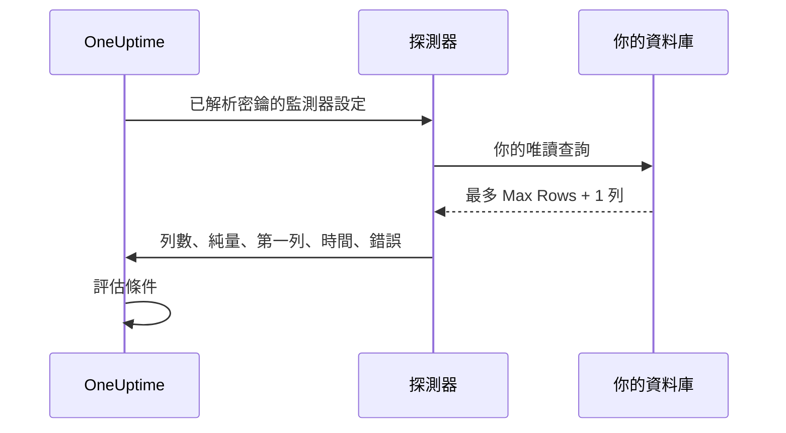

# SQL 查詢監控

SQL 查詢監測器會依排程從探測器執行一條唯讀 SQL 查詢，並根據結果發出警示：傳回的列數、一個純量值、查詢耗時，或查詢錯誤。它專為「執行一條查詢並開啟一個事件」的情境而設計，例如在最近五分鐘內取消的訂單數暴增、佇列資料表變得過大，或某一筆關鍵資料列消失時發出警示。

:::cards
- [建立唯讀使用者](#建立唯讀使用者): 監測器應使用的資料庫登入帳號。
- [建立監測器](#建立-sql-查詢監測器): 連接一個探測器並輸入查詢。
- [撰寫查詢](#撰寫查詢): 把要發出警示的值放在第一欄。
- [設定條件](#設定條件): 依計數、數值、緩慢的查詢或錯誤發出警示。
:::

## 運作方式

每次檢查時，探測器會連線到你的資料庫，在唯讀環境中執行你的查詢，最多讀回有限數量的資料列，然後向 OneUptime 回報一份精簡的投影。接著監測器的條件會根據這份投影進行評估。

由於查詢是從你網路內部的探測器執行，OneUptime 永遠不需要直接連線到你的資料庫，完整的結果集也永遠不會離開探測器：回報的只是結果的一小份有限投影。



探測器只回報：

| 值 | 說明 |
|---|---|
| **Row Count** | 查詢傳回的列數（受 Max Rows 限制）。 |
| **純量值** | 第一列的第一欄。對 `SELECT COUNT(*)` 這類查詢來說，這就是最自然的值。 |
| **First Row** | 以欄與值的配對表示的第一列，在檢查摘要中作為參考顯示。 |
| **Execution Time** | 檢查花費的時間（毫秒），包含建立連線，而不只是查詢本身。 |
| **查詢錯誤** | 查詢失敗時經過清理的錯誤訊息。 |

完整的結果集永遠不會傳送到 OneUptime，因此客戶資料不會被複製到 OneUptime 的儲存空間。

## 支援的資料庫

| 資料庫 | 預設連接埠 |
|---|---|
| **PostgreSQL** | `5432` |
| **MySQL** | `3306` |
| **Microsoft SQL Server** | `1433` |

使用相同傳輸協定和 SQL 方言的 MySQL 相容與 PostgreSQL 相容引擎通常也能運作，但官方只測試上面這三種引擎。

如果監測器連線的主機和連接埠是 [資料庫](/docs/telemetry/databases) 頁面上某個資料庫的端點之一，它的警示和事件也會出現在該資料庫的頁面上（請參閱 [資料庫上的警示](/docs/telemetry/databases#alerts-on-a-database)）。以監控密鑰參照形式提供的主機不會被比對。

## 安全模型

在正式環境的資料庫上執行客戶提供的查詢是敏感的操作，因此 SQL 查詢監測器在設計上就是唯讀的，並疊加了多層控制：

| 控制 | 作用 |
|---|---|
| **最小權限資料庫使用者**（主要控制） | 一律使用專用的唯讀資料庫使用者連線，該使用者只能存取查詢需要的資料表。這是最重要的控制，請參閱 [建立唯讀使用者](#建立唯讀使用者)。 |
| **唯讀執行** | 在 PostgreSQL 和 MySQL 上，探測器會開啟一個 `READ ONLY` 交易，無論查詢文字為何，都會拒絕任何寫入（包括可寫入的 CTE）。Microsoft SQL Server 沒有唯讀交易，因此探測器會在一個一律復原的交易中執行。 |
| **單一陳述式、允許清單查詢** | 查詢必須是以 `SELECT`、`WITH`、`VALUES` 或 `TABLE` 開頭的單一陳述式。堆疊的陳述式（`SELECT 1; DROP TABLE …`）以及 `INSERT`、`UPDATE`、`DELETE`、`DROP`、`EXEC` 和 `INTO` 等寫入或 DDL 關鍵字，會在探測器連線之前就被拒絕。這項檢查只是安全網，不是界線：界線是唯讀使用者。 |
| **陳述式逾時** | 每條查詢都有硬性的時間上限。執行太久的查詢會被取消。 |
| **資料列有上限** | 最多只讀回 Max Rows 列（再加一列，用來偵測截斷），藉此限制探測器的記憶體和資料量。 |
| **認證資訊遮蔽** | 資料庫錯誤在儲存前會經過清理：密碼、主機、使用者名稱、資料庫名稱以及任何連線字串都會被遮蔽，因此認證資訊絕不會洩漏到錯誤訊息中。 |

## 開始之前

- 一個能透過網路連到你的資料庫主機和連接埠的 **探測器**。可以是 OneUptime 託管的探測器（如果你的資料庫可以從網際網路連線），也可以是在你網路內部執行的[自訂探測器](/docs/probe/custom-probe)。
- 一個 **唯讀資料庫使用者** 和連線資訊（主機、連接埠、資料庫名稱、使用者名稱、密碼），或在使用 SQL Server 整合式驗證時，一個唯讀的 Windows 或網域身分。

## 建立唯讀使用者

一律使用專用的唯讀使用者連線。以系統管理員身分執行適合你所用引擎的陳述式，並把 `orders` 換成你的資料庫：

:::tabs
@tab PostgreSQL
```sql
-- PostgreSQL
CREATE USER oneuptime_ro WITH PASSWORD 'a-strong-password';
GRANT CONNECT ON DATABASE orders TO oneuptime_ro;
GRANT USAGE ON SCHEMA public TO oneuptime_ro;
GRANT SELECT ON ALL TABLES IN SCHEMA public TO oneuptime_ro;
-- Include tables created in the future:
ALTER DEFAULT PRIVILEGES IN SCHEMA public GRANT SELECT ON TABLES TO oneuptime_ro;
```
@tab MySQL
```sql
-- MySQL
CREATE USER 'oneuptime_ro'@'%' IDENTIFIED BY 'a-strong-password';
GRANT SELECT ON orders.* TO 'oneuptime_ro'@'%';
FLUSH PRIVILEGES;
```
@tab Microsoft SQL Server
```sql
-- Microsoft SQL Server
CREATE LOGIN oneuptime_ro WITH PASSWORD = 'a-strong-password';
USE orders;
CREATE USER oneuptime_ro FOR LOGIN oneuptime_ro;
ALTER ROLE db_datareader ADD MEMBER oneuptime_ro;
```
:::

若要更嚴格地授權，只授予該使用者對查詢所讀取之資料表的 `SELECT` 權限。

## 建立 SQL 查詢監測器

:::steps
### 開始一個新的監測器

前往 **監測器**，點選 **建立監測器**。在 **監測器類型** 下點選 **更多監測器類型**，然後在 **Database Monitoring** 下選擇 **SQL Query**，或在搜尋方塊中輸入 `query`。輸入 **名稱**，然後點選 **下一步**。

### 輸入連線資訊

選擇 **Database Type**（連接埠會切換為該引擎的預設值），然後填寫主機、資料庫名稱和唯讀使用者的認證資訊。不要直接輸入密碼，而是以[監控密鑰](#為密碼使用監控密鑰)的形式參照它。每個欄位都在[設定](#設定)中說明。

### 輸入查詢

在 **SQL Query** 中輸入一條唯讀陳述式（請參閱[撰寫查詢](#撰寫查詢)）。

### 測試

點選 **測試監測器**，在儲存之前從探測器執行一次查詢。

### 訂定條件

檢查監測器一開始帶有的條件，並加入你自己的條件（請參閱[設定條件](#設定條件)）。然後點選 **下一步**。

### 選擇探測器並建立

選擇能連到資料庫的 **探測器** 和 **監測間隔**，然後點選 **建立監測器**。
:::

## 設定

| 欄位 | 要輸入的內容 |
|---|---|
| **Database Type** | PostgreSQL、MySQL 或 Microsoft SQL Server。選擇類型會設定預設連接埠。 |
| **主機** | 探測器可以連到的資料庫主機（例如 `db.internal`）。 |
| **連接埠** | 資料庫連接埠。 |
| **資料庫名稱** | 要在其上執行查詢的資料庫。 |
| **Use Windows Integrated Authentication** | 僅限 Microsoft SQL Server。以執行探測器的帳戶驗證，而不是使用 SQL 使用者名稱和密碼。請參閱 [Windows 整合式驗證](#windows-整合式驗證)。 |
| **使用者名稱** | 唯讀的最小權限資料庫使用者。 |
| **密碼** | 資料庫密碼。我們強烈建議以 `{{monitorSecrets.name}}` 參照一個 [監控密鑰](/docs/monitor/monitor-secrets)，而不是以純文字輸入密碼（請參閱[為密碼使用監控密鑰](#為密碼使用監控密鑰)）。 |
| **SQL Query** | 要執行的唯讀查詢（請參閱[撰寫查詢](#撰寫查詢)）。 |
| **Use SSL/TLS** | 啟用後透過 TLS 連線。啟用後，如果資料庫使用自我簽署的憑證，你可以關閉 **Verify server certificate**。 |

### 更多欄位

| 欄位 | 預設值 | 最大值 | 限制的內容 |
|---|---|---|---|
| **Connection Timeout (ms)** | `10000` | `30000` | 等待建立連線的時間。 |
| **Statement Timeout (ms)** | `15000` | `60000` | 查詢可執行時間的硬性上限。 |
| **Max Rows** | `100` | `1000` | 從資料庫讀回的資料列數上限。 |

超過最大值的值會被降為最大值。

### Windows 整合式驗證

對於 Microsoft SQL Server，啟用 **Use Windows Integrated Authentication** 即可使用探測器程序的身分開啟受信任的連線。在此模式下，使用者名稱和密碼欄位會被忽略，也不會傳給驅動程式。由於探測器需要一個受你的網域信任的身分，請為這種驗證模式使用自行託管的探測器。

| 探測器執行於 | 需要設定的內容 |
|---|---|
| **Windows** | 以一個擁有唯讀 SQL Server 登入的網域帳戶執行探測器服務。 |
| **Linux 或 macOS** | 為 SQL Server 所在網域設定 Kerberos，並給探測器程序一張有效的票證（例如透過 keytab）。官方的 Linux 探測器映像檔包含 Microsoft ODBC Driver 18、unixODBC 和 Kerberos 用戶端。把 Kerberos 設定和票證快取掛載到容器中，讓探測器程序可以讀取，若它們不在預設位置，請設定 `KRB5_CONFIG` 或 `KRB5CCNAME`。 |

執行探測器的主機上必須安裝 Microsoft ODBC Driver for SQL Server。官方探測器映像檔內含 **ODBC Driver 18**。當你執行自行託管或自訂的探測器時，探測器會自動偵測並使用主機上已註冊的最新版 `ODBC Driver N for SQL Server`（例如已安裝的是 Driver 17 就使用 Driver 17），不一定非得是 Driver 18。若要固定使用某個驅動程式，請在探測器上把環境變數 `SQL_SERVER_ODBC_DRIVER` 設為確切的驅動程式名稱（例如 `ODBC Driver 17 for SQL Server`）。

SQL Server 必須有適當的 `MSSQLSvc` 服務主體名稱，探測器與網域控制站的時鐘必須同步，而且探測器必須能透過該服務主體名稱涵蓋的主機名稱解析並連到 SQL Server。只授予受信任的身分監控查詢所需的資料庫權限。

## 撰寫查詢

查詢必須是 **單一唯讀陳述式**。它必須以 `SELECT`、`WITH`、`VALUES` 或 `TABLE` 之一開頭。允許結尾有分號；不允許多條陳述式。寫入和 DDL 關鍵字在查詢中的任何位置都會被拒絕，包括 `INTO`，所以 `SELECT … INTO` 也會被拒絕。

探測器會在每次檢查時檢查查詢，而不是在儲存時。違反這些規則的查詢仍然可以儲存，但之後的每次檢查都會失敗並回報 "Only read-only queries are allowed (must start with SELECT, WITH, VALUES, or TABLE)."，預設條件會讓監測器離線。

讓查詢保持輕量、範圍明確：它們會在每次檢查時執行，因此請優先使用有索引的欄和較窄的時間範圍。下面的查詢會計算最近五分鐘內取消的訂單：

:::tabs
@tab PostgreSQL
```sql
-- Count recent cancellations (PostgreSQL)
SELECT COUNT(*) AS cancelled
FROM orders
WHERE status = 'CANCELLED'
  AND created_at > NOW() - INTERVAL '5 minutes';
```
@tab MySQL
```sql
-- The same idea on MySQL
SELECT COUNT(*) AS cancelled
FROM orders
WHERE status = 'CANCELLED'
  AND created_at > NOW() - INTERVAL 5 MINUTE;
```
@tab Microsoft SQL Server
```sql
-- The same idea on Microsoft SQL Server
SELECT COUNT(*) AS cancelled
FROM orders
WHERE status = 'CANCELLED'
  AND created_at > DATEADD(minute, -5, GETDATE());
```
:::

> [!TIP]
> 對於 `COUNT(*)` 這類查詢，計數既可以從 **Row Count** 取得（值為 `1`，因為只傳回一列），也可以從 **純量值** 取得（即第一欄中的計數本身）。要依「有多少」發出警示，請與 **純量值** 比較。

## 為密碼使用監控密鑰

為了讓資料庫密碼永遠不會以純文字儲存在監測器上，請建立一個 [監控密鑰](/docs/monitor/monitor-secrets)，並在密碼欄位中參照它：

:::steps
1. 前往 **監測器 → 設定 → 密鑰**，建立一個監控密鑰。
2. 為它命名（例如 `dbPassword`），並授予此監測器存取權。
3. 在監測器的 **密碼** 欄位中輸入 `{{monitorSecrets.dbPassword}}`。
:::

OneUptime 會在把設定交給探測器之前，於伺服器端解析密鑰。OneUptime 永遠不會替你建立這些密鑰：要不要參照由你決定。**使用者名稱**、**主機**、**資料庫名稱** 和 **SQL Query** 欄位也接受密鑰參照；**連接埠** 則不接受。

## 設定條件

加入條件，決定監測器何時被視為上線、效能下降或離線。SQL 查詢監測器可以使用下列檢查：

| 篩選器類型 | 檢查內容 |
|---|---|
| **SQL Is Online** | 資料庫是否可以連線，以及查詢是否成功。 |
| **SQL Query Row Count** | 傳回的列數。以大於、小於或等於等運算子比較。 |
| **SQL Query Scalar Value** | 第一列的第一欄。你輸入的值是數字時以數字比較，否則以字串比較。`COUNT(*)` 這類查詢應使用這項檢查。 |
| **SQL Query Execution Time (in ms)** | 查詢耗時。適合用來發現變慢的資料庫。 |
| **SQL Query Error** | 查詢的錯誤訊息。在它為空（或不為空），或符合特定字串時發出警示。 |
| **JavaScript Expression** | 對 `rowCount`、`scalarValue`、`firstRow`、`executionTimeInMs`、`queryError` 和 `isOnline` 求值一個自訂 JavaScript 運算式。請參閱 [JavaScript 運算式](/docs/monitor/javascript-expression#sql-查詢監測器)。 |

數值門檻是整數：寫 `10`，不要寫 `10.5`。SQL Query 篩選器無法在一段時間內求值；每次檢查都各自獨立判斷。

新的 SQL 查詢監測器一開始有兩個條件：**SQL Is Online** 為 false 時，監測器離線並宣告一個會自動解決的事件；**SQL Is Online** 為 true 時，將它標示為上線。**新增條件準則** 會在底部加入一個條件；請把它拖到上線條件之上，因為條件是由上往下檢查，第一個符合的條件說了算。

### 範例：取消訂單暴增時發出警示

使用上面的查詢：

| 條件 | 篩選器 |
|---|---|
| **效能下降** | `SQL Query Scalar Value` 大於 `10`。 |
| **離線** | `SQL Query Scalar Value` 大於 `50`，或 `SQL Is Online` 為 `false`。 |

為條件關聯一個待命原則，以便呼叫適當的人員。SQL 查詢監測器沒有自己的範本變數：事件標題可以用 `{{monitorName}}` 寫出監測器名稱，但無法引用查詢的結果。

## 注意事項

- 查詢會在每次檢查時執行，所以請保持輕量。使用索引和較窄的時間範圍，並以 Statement Timeout 作為最後防線。
- 只會回報列數、第一個儲存格（純量）和第一列，因此請設計查詢，讓你要發出警示的值位於第一欄。
- 如果結果因超過 Max Rows 而被截斷，檢查摘要會顯示 **Rows Truncated**："Yes (result capped)"。只在需要時才提高 Max Rows；較大的結果集會占用探測器更多的記憶體。
- 寫入和 DDL 一律會被拒絕。如果你需要測試寫入路徑，這個監測器並不適用。
- 優先使用監控密鑰而不是純文字密碼，讓認證資訊在儲存時保持加密。
- 查詢失敗的檢查會在一秒後重試，最多再試三次，然後才回報錯誤，因此短暫的連線中斷不會讓監測器離線。在自行託管的探測器上，可以用 `PROBE_MONITOR_RETRY_LIMIT` 設定次數。

## 疑難排解

:::details 每次檢查都失敗並回報 "Only read-only queries are allowed"
查詢沒有以 `SELECT`、`WITH`、`VALUES` 或 `TABLE` 開頭。前面有註解沒關係；`SET` 或 `DECLARE` 則不行。請把它改寫成單一唯讀陳述式。
:::

:::details 檢查失敗並回報 "Disallowed SQL keyword"
查詢中的某處出現了寫入、DDL 或執行類的關鍵字，即使是在 `SELECT` 內部也一樣，例如 `INTO` 或 `EXEC`。引號字串和註解中的文字不算。請移除該關鍵字，或把邏輯放進唯讀使用者可以讀取的檢視中。
:::

:::details 檢查逾時
探測器無法在 **Connection Timeout (ms)** 內連線，或查詢執行時間超過 **Statement Timeout (ms)**。確認探測器能連到該主機和連接埠，然後讓查詢更輕量：在較短的時間範圍內依有索引的欄篩選。
:::

:::details 連線因憑證錯誤而失敗
資料庫的憑證是自我簽署的，或不受探測器信任。關閉 **Verify server certificate**（開啟 **Use SSL/TLS** 後才會出現），或為資料庫設定探測器信任的憑證。
:::

:::details Windows 整合式驗證失敗
探測器需要 Microsoft ODBC Driver for SQL Server，以及一個受你的網域信任的身分。執行官方探測器映像檔或安裝該驅動程式，然後依照 [Windows 整合式驗證](#windows-整合式驗證) 檢查設定。
:::

## 後續步驟

:::cards
- [資料庫健康狀態監控](/docs/monitor/database-health-monitor): 不必撰寫 SQL 就能留意連線、鎖定和複寫。
- [監控密鑰](/docs/monitor/monitor-secrets): 讓資料庫密碼保持加密。
- [JavaScript 運算式](/docs/monitor/javascript-expression): 撰寫結合多個值的條件。
- [自訂探針](/docs/probe/custom-probe): 從你的網路內部執行檢查。
:::
