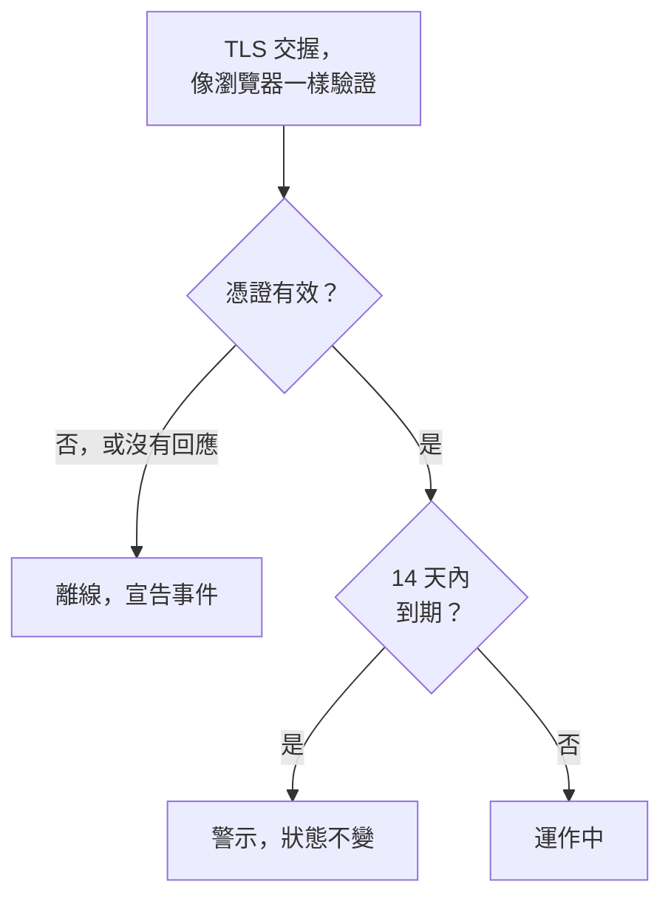

# SSL 憑證監控

SSL 憑證監測器會像瀏覽器一樣檢查您的網站和服務出示的 TLS 憑證，並在憑證到期之前提醒您。當憑證不再有效時（已到期、自我簽署、為其他主機名稱簽發，或來自瀏覽器不信任的授權單位），它也會讓監測器離線。

:::cards
- [建立監測器](#建立-ssl-憑證監測器): 在主控台中完成六個步驟。
- [預設條件](#預設條件): 不需設定，提前 14 天發出到期警告。
- [監測條件](#監測條件): 有效性、到期和自我簽署憑證。
- [疑難排解](#疑難排解): 自我簽署憑證和內部憑證。
:::

## 運作方式

每次檢查時，探測器會與 URL 中的主機和連接埠（除非 URL 指定了其他連接埠，否則為 `443`）建立 TLS 連線，並像瀏覽器一樣驗證憑證：受信任的簽發者、相符的主機名稱，以及涵蓋今天的有效期間。即使憑證未通過驗證，探測器仍會讀取它，因此無論如何都會記錄其到期日、簽發者和指紋。連線失敗、逾時或出示無效憑證時會重試，最多重試您允許的次數。接著 OneUptime 會以監測器的條件評估結果。

失去自身網路連線的探測器不會回報任何結果，因此它無法將您的憑證標記為無效。

## 開始之前

- **可以建立監測器的角色**：Project Owner、Project Admin、Project Member、Monitor Admin 或 Monitor Member，或者擁有 Create Monitor 權限的自訂角色。
- **能夠連到該主機和連接埠的探測器。** 每個新的監測器都會選取您專案的預設探測器。私有網路中的服務需要該網路內的 [自訂探測器](/docs/probe/custom-probe)。

## 建立 SSL 憑證監測器

:::steps
### 開始建立新監測器

前往 **監測器**，點選 **建立監測器**。在 **監測器類型** 下選擇 **SSL Certificate**。

### 命名

輸入 **名稱**，例如 `example.com certificate`，然後點選 **下一步**。

### 輸入 URL

在 **網站 URL** 中輸入要檢查其憑證的網站，例如 `https://example.com`。若是其他連接埠上的服務，請帶上連接埠：`https://example.com:8443`。

### 測試

點選 **測試監測器**，在 **選擇探測器** 中選擇一個探測器，然後點選 **執行測試**。**監測器測試結果** 會顯示探測器取得的憑證及其簽發者和到期日。

### 檢視條件

**監測器條件** 從 [預設條件](#預設條件) 開始：憑證無效時為離線，14 天內到期時發出警示。如有需要可修改，然後點選 **下一步**。

### 選擇探測器並建立

保留或修改 **探測器** 和 **監測間隔**（初始為 **每 5 分鐘**；SSL 憑證監測器提供 5 分鐘或更長的間隔），然後點選 **建立監測器**。監測器頁面隨即開啟。
:::

## 設定選項

| 欄位 | 預設值 | 要填寫的內容 |
| --- | --- | --- |
| **網站 URL** | 無 | 要檢查其憑證的網站，例如 `https://example.com` 或 `https://example.com:8443`。只會使用主機和連接埠；路徑會被忽略。 |
| **請求逾時（秒）**（在 **更多欄位** 下） | `60` | 每次嘗試等待 TLS 交握的時間。最長 60 秒。 |
| **失敗時重試**（在 **更多欄位** 下） | 探測器的預設值，通常為 `3` | 失敗的嘗試要重試幾次。最多 3 次。 |

**失敗時重試** 計算的是第一次嘗試 _之後_ 的重試次數，因此 `0` 表示檢查執行一次，`2` 表示最多執行三次。留空時使用探測器的預設值：3，除非探測器的 `PROBE_MONITOR_RETRY_LIMIT` 另有規定。連線錯誤、憑證驗證失敗和逾時都會重試，兩次嘗試之間暫停一秒。

## 監測條件

條件決定憑證何時算是正常、效能下降或有問題，以及是否因此宣告事件或建立警示。每個條件會檢查一個或多個篩選器：

| 篩選器 | 條件 | 檢查內容 |
| --- | --- | --- |
| **Is Valid Certificate** | **是**、**否** | 憑證通過瀏覽器的檢查：受信任的簽發者、相符的主機名稱，以及涵蓋今天的有效期間。端點沒有回應時為 **否**。 |
| **Is Not A Valid Certificate** | **是**、**否** | 與 **Is Valid Certificate** 相反：憑證未通過這些檢查或無法檢查時為 **是**。 |
| **Is Expired Certificate** | **是**、**否** | 憑證的到期日已過。 |
| **Is Self Signed Certificate** | **是**、**否** | 憑證或其鏈中的某個憑證是自我簽署的。 |
| **Expires In Days** | **Greater Than**、**Less Than**、**Greater Than Or Equal To**、**Less Than Or Equal To** | 距憑證到期的天數。 |
| **Expires In Hours** | **Greater Than**、**Less Than**、**Greater Than Or Equal To**、**Less Than Or Equal To** | 距憑證到期的小時數。 |

**Expires In Days** 以整天計算：14 天 20 小時後到期的憑證還剩 14 天。**Expires In Hours** 以同樣的方式按整小時計算。

有兩個以上的篩選器時，**符合條件** 決定是 **全部** 篩選器都必須符合，還是 **任何** 一個符合即可。條件的 **操作** 決定它做什麼：變更監測器狀態、建立警示、宣告事件，或其中任意幾項。

### 預設條件

新的 SSL 憑證監測器以三個條件開始，因此不需任何設定就能在憑證到期之前提醒您：

1. **憑證無效** — 憑證已到期、是自我簽署的、為其他主機名稱簽發或由不受信任的授權單位簽發，或者因端點沒有回應而無法檢查。監測器會被標記為 **離線**，並建立名為「_monitor name_ certificate is not valid」的事件。事件的根本原因會說明是哪一種情況。憑證再次有效時，事件會自行解決。
2. **憑證即將到期** — 憑證有效，但將在 14 天內到期。會建立名為「_monitor name_ certificate expires soon」的 **警示**。
3. **憑證有效** — 監測器會被標記為 **運作中**。

「即將到期」的提醒是警示，而不是事件：它不會顯示在您的狀態頁上，除非您為它新增待命策略，否則不會呼叫任何人，也不會改變監測器的狀態。它使用您專案的第二個警示嚴重性，在新專案中為 **Low**。更新後的憑證被取得後，監測器會回到「憑證有效」，警示會自行解決。

條件由上而下檢查，第一個符合的條件決定接下來會發生什麼。因此「即將到期」位於「有效」之上：即將到期的憑證仍然有效，所以會同時符合兩者。

若要更早收到提醒，請修改「即將到期」條件中 **Expires In Days** 篩選器的值，例如改為 `30`。若要改為呼叫某人，請開啟該條件的 **操作**：開啟 **當篩選器相符時，宣告事件。** 或者保留警示，並在 **待命策略** 下為它新增待命策略。

:::details 為在此提醒出現之前建立的監測器新增提醒
在 OneUptime 新增此提醒之前建立的監測器沒有「即將到期」條件。若要新增它：

1. 在監測器上開啟 **設定 → 條件**，然後點選 **編輯監測條件**。
2. 點選 **新增條件準則**。將其篩選器設為 **Is Valid Certificate** / **是**，點選 **新增篩選器**，並將第二個設為 **Expires In Days** / **Less Than Or Equal To** / `14`。讓 **符合條件** 保持為 **全部**（有兩個篩選器後，它會出現在篩選器下方）。
3. 在 **操作** 下開啟 **當篩選器相符時，建立警示。** 並讓 **當篩選器相符時，變更監測器狀態。** 保持關閉，使它建立警示而不變更監測器狀態。
4. 將新條件拖到把監測器標記為上線的條件上方，然後儲存。
:::

### 條件範例

| 目標 | 篩選器 | 條件 | 值 |
| --- | --- | --- | --- |
| 提前一個月提醒 | **Expires In Days** | **Less Than Or Equal To** | `30` |
| 在最後一天呼叫某人 | **Expires In Hours** | **Less Than** | `24` |
| 只在憑證到期後才離線 | **Is Expired Certificate** | **是** | — |
| 標記自我簽署憑證 | **Is Self Signed Certificate** | **是** | — |

關於到期的條件必須位於將憑證標記為有效的條件之上：即將到期的憑證仍然有效，而第一個符合的條件會生效。

## 最佳實務

1. **給自己留出更新的時間** — 預設提醒會在到期前 14 天發出，適合自動更新的憑證。如果您更新需要更長時間（購買的憑證或變更流程），請提高到 30 天。
2. **監測每個端點** — 如果您有多個網域或子網域，請為每個建立一個監測器。每個都可能有自己的憑證。
3. **納入其他連接埠** — 在 `443` 以外的連接埠（例如 `8443`）上提供 TLS 的服務也有憑證。請在 URL 中寫上連接埠。
4. **更新後檢查** — 更新憑證後，請查看監測器的下一次結果：它顯示的到期日應該是新的。

## 疑難排解

:::details 憑證在我的瀏覽器中正常，但監測器說它無效
事件的根本原因會說明原因。常見原因是伺服器傳送憑證時沒有附上中繼憑證：瀏覽器往往會自行補齊，探測器則不會。請將伺服器設定為傳送完整的憑證鏈。另一個原因是 URL 中的主機名稱不在憑證上。
:::

:::details 我在監測一個使用自我簽署憑證的內部服務
自我簽署憑證永遠不會有效，因此預設條件會讓監測器保持離線。**Is Self Signed Certificate**、**Is Expired Certificate** 和 **Expires In Days** 對它仍然有效，因此請以它們建構條件。在 **設定 → 條件** 中：

1. 在「無效」條件中點選 **新增篩選器**，將新篩選器設為 **Is Self Signed Certificate** / **否**，並將 **符合條件** 設為 **全部**。當端點沒有回應或憑證有其他問題時，該條件仍會讓監測器離線。
2. 新增一個 **Is Expired Certificate** / **是** 的條件，將監測器標記為 **離線** 並宣告事件，然後把它拖到最上方。
3. 在「即將到期」條件中，把 **Is Valid Certificate** / **是** 換成 **Is Expired Certificate** / **否**，讓提醒也涵蓋自我簽署憑證。

在憑證有效期間內，沒有任何條件符合，監測器會顯示其預設狀態 **運作中**。
:::

:::details 監測器離線，並顯示「could not be checked because the endpoint is not reachable」
探測器無法與主機和連接埠建立 TLS 連線。請檢查 URL 中的連接埠，以及防火牆是否讓探測器通過。私有網路中的主機需要 [自訂探測器](/docs/probe/custom-probe)。
:::

## 後續步驟

:::cards
- [網站監控](/docs/monitor/website-monitor): 檢查網站本身是否回應。
- [網域監控](/docs/monitor/domain-monitor): 在網域註冊到期之前收到提醒。
- [上報規則](/docs/on-call/escalation-rules): 決定警示和事件要呼叫誰。
- [事件概觀](/docs/incidents/index): 監測器宣告事件之後會發生什麼。
:::
