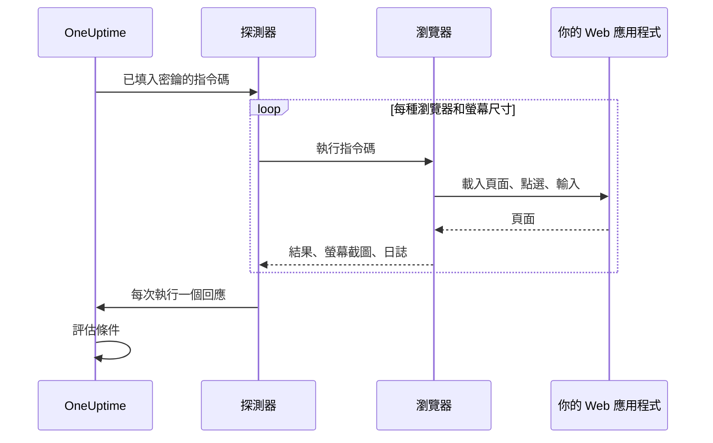

# 合成監控

合成監測器會依排程，以你撰寫的 Playwright 指令碼在真實的瀏覽器中操作你的 Web 應用程式：它會開啟頁面、填寫表單、點選走完一段使用者旅程，旅程失敗時檢查也會失敗。用它來抓出正常運作時間檢查看不到的故障：不再能用的登入、按了沒反應的結帳按鈕、永遠載入不完的儀表板。

:::cards
- [建立監測器](#建立合成監測器): 撰寫指令碼，選擇瀏覽器和螢幕尺寸。
- [撰寫指令碼](#撰寫指令碼): 從一段可以直接執行的登入旅程開始。
- [螢幕截圖](#螢幕截圖): 查看執行失敗時頁面的樣子。
- [指令碼可以使用什麼](#指令碼中可用的模組): Playwright、HTTP、加密和指標。
:::

## 運作方式

每次檢查時，探測器會針對你選擇的每種瀏覽器和螢幕尺寸，依序各執行一次你的指令碼。每次執行都會啟動一個全新的瀏覽器，沒有先前執行留下的 Cookie 或儲存空間；指令碼會操作自己的頁面、擷取螢幕截圖，然後傳回結果或擲回錯誤。探測器回報每一次執行，OneUptime 再據此評估你的條件。



| 螢幕類型 | 檢視區 |
| --- | --- |
| Mobile | 360 × 640 |
| Tablet | 1024 × 768 |
| Desktop | 1920 × 1080 |

瀏覽器是 Chromium 和 Firefox。

## 開始之前

- 一個能連到你的 Web 應用程式的 **探測器**。對於你網路內部的應用程式，請使用[自訂探測器](/docs/probe/custom-probe)。探測器的 Docker 映像檔包含 Chromium 和 Firefox；在 Docker 之外執行的探測器則需要自行安裝。
- 旅程需要的所有密碼和權杖，都應儲存為 [監控密鑰](/docs/monitor/monitor-secrets)。

## 建立合成監測器

:::steps
### 開始一個新的監測器

前往 **監測器**，點選 **建立監測器**。在 **監測器類型** 下點選 **更多監測器類型**，然後在 **Synthetic Monitoring** 下選擇 **Synthetic Monitor**，或在搜尋方塊中輸入 `playwright`。輸入 **名稱**，然後點選 **下一步**。

### 加入指令碼

在 **Playwright Code** 編輯器中撰寫指令碼。可以從[下方的範例](#撰寫指令碼)開始。

### 選擇瀏覽器和螢幕尺寸

在 **瀏覽器類型** 下勾選瀏覽器，在 **螢幕類型** 下勾選尺寸。指令碼會針對每種組合各執行一次，因此兩種瀏覽器和三種尺寸表示每次檢查執行六次。在 **更多欄位** 下，**錯誤時的重試次數** 可以把失敗的執行最多重試 5 次。

### 測試

點選 **測試監測器**，從探測器執行一次指令碼，查看每次執行的結果、日誌和螢幕截圖。

### 檢查條件

監測器一開始有兩個條件：任何一次執行失敗時變為離線並宣告一個事件，沒有執行失敗時變為上線。你可以修改它們或加入自己的條件（請參閱[條件](#條件)），然後點選 **下一步**。

### 選擇探測器並建立

選擇 **探測器** 和 **監測間隔**（合成監測器提供 5 分鐘或更長的間隔），然後點選 **建立監測器**。
:::

## 撰寫指令碼

指令碼是一個 `async` 函式的主體。`page` 是一個已經開啟、與 Playwright 相容的頁面；操作它，用 `return` 傳回結果，用 `throw`（或讓某個 Playwright 呼叫逾時）讓執行失敗。下面的範例會先登入，再檢查儀表板是否載入：

```javascript title="Synthetic monitor script"
await page.goto("https://app.example.com/login");
screenshots["login-page"] = await page.screenshot();

await page.fill("#email", "monitoring@example.com");
await page.fill("#password", "{{monitorSecrets.AppPassword}}");
await page.click("button[type=submit]");

// Fails the run if the dashboard does not appear within 10 seconds.
await page.waitForSelector(".dashboard", { timeout: 10000 });
screenshots["dashboard"] = await page.screenshot();

console.log(`Signed in on ${browserType}, ${screenSizeType}`);

return {
  data: { title: await page.title() },
};
```

| 目的 | 做法 | OneUptime 記錄的內容 |
| --- | --- | --- |
| 回報結果 | `return { data: ... }` | 這次執行的 **結果**。只保留 `data`。 |
| 讓執行失敗 | `throw new Error("...")`，或讓某個等待逾時 | 這次執行的 **指令碼錯誤**。 |
| 保留證據 | `screenshots["name"] = await page.screenshot()` | 一張螢幕截圖，即使執行失敗也會保留。 |
| 留下紀錄 | `console.log(...)` | 這次執行的日誌訊息。 |

要查看這些執行，請開啟監測器的 **概覽**：**監測器摘要** 卡片中每種瀏覽器和螢幕尺寸各有一個區塊，**顯示更多詳細資料** 會顯示每次執行的螢幕截圖。

### 使用 Playwright

我們使用 Playwright 來模擬使用者互動。`page` 值是為這次執行建立的頁面的一個安全、與 Playwright 相容的外觀層。常用的 `Page`、`Locator`、`Frame`、`ElementHandle`、`JSHandle`、`Request`、`Response`、鍵盤、滑鼠和瀏覽器內容方法都可以使用，包括導覽、定位器、點選、表單輸入、頁面求值、彈出視窗、其他頁面、檢查回應以及螢幕截圖。你可以透過 `page.context()` 存取這次執行的瀏覽器內容，例如開啟新頁面或處理彈出視窗。

合成指令碼不會在探測器的 Node.js 程序中執行。值會以複製的資料或與這次執行綁定的不透明能力形式跨越執行階段邊界，因此有些 Playwright API 的行為不同，或完全無法使用：

| 無法使用 | 替代做法 |
| --- | --- |
| 啟動或連線瀏覽器的方法、CDP 工作階段、請求路由、公開的繫結、Playwright 私有欄位，以及任何讀寫主機檔案系統路徑的選項。因此 `page.context().browser()` 無法使用。 | 使用提供給你的頁面和瀏覽器內容。 |
| 事件接聽程式（`page.on(...)`、`page.once(...)`）：呼叫它們會失敗並給出明確的錯誤。 | 對話方塊和彈出視窗使用 `page.waitForEvent(...)`，或使用以字串或規則運算式比對的回應和請求等待。 |
| 事件、請求、回應和 URL 等待方法的函式述詞。 | 字串或規則運算式比對器、定位器，或明確的輪詢。 |
| 同步的框架存取子（`page.frames()`、`page.mainFrame()`、`page.frame(...)`）。 | iframe 使用 `page.frameLocator(...)`。 |
| `page.request.*` | HTTP 請求使用全域的 `axios`。 |
| 整頁螢幕截圖和 PDF 輸出。 | 檢視區螢幕截圖，它保留下方說明的失敗證據行為。 |

`page.waitForNavigation(...)`、`page.setDefaultTimeout(...)` 和 `page.setDefaultNavigationTimeout(...)` 都有支援。`page.waitForEvent(...)` 可以等待 `dialog`、`domcontentloaded`、`load`、`popup`、`request`、`requestfailed`、`requestfinished` 和 `response`。傳給 `page.evaluate()` 等方法的求值函式會在受監控的瀏覽器頁面中執行，絕不會在探測器程序中執行。每次執行最多可以使用八個頁面。

瀏覽器權限僅限於地理位置和通知。剪貼簿、相機、麥克風、MIDI、本機字型以及其他主機裝置權限，監控指令碼都無法使用。

### 指令碼傳回的內容

指令碼傳回的資料在儲存前會序列化為 JSON：在一般物件和陣列中，`NaN` 和 `Infinity` 會變成 `null`，值為 `undefined` 的屬性和函式會被捨棄，`Date` 物件會變成 ISO 字串，與 `JSON.stringify` 的處理方式相同。類別執行個體和其他非一般物件會整個被捨棄。`BigInt` 會變成字串。含有循環參照、巢狀超過 30 層或大於 5 MB 的結果會讓執行失敗。

### 依傳回的資料發出警示

指令碼以 `data` 傳回的內容就是監測器的 **Result Value**，條件可以對它進行比較。當 `data` 是物件或陣列時，在 Result Value 篩選器上填寫 **欄位路徑（選填）** 即可比較其中一個欄位，例如 `status`、`timings.loadTime` 或 `errors[0].message`。篩選器會根據監測器執行的每種瀏覽器和螢幕尺寸的資料進行檢查，只要其中任何一個符合就算符合。路徑和條件的運作方式請參閱 [依傳回的資料發出警示](/docs/monitor/custom-code-monitor#依傳回的資料發出警示)。

## 螢幕截圖

指令碼環境中有一個事先宣告的 `screenshots` 物件。你可以在指令碼中的任何位置把螢幕截圖指派給它，這些螢幕截圖 **即使指令碼擲回錯誤** 也會被保留（包括判斷提示失敗、逾時或非預期錯誤），因此你能準確看到執行失敗時頁面的樣子。保留的螢幕截圖會顯示在 OneUptime 儀表板中對應的那次監測器執行之下。

```javascript
// Capture screenshots via the `screenshots` side-channel — they are preserved on both success and failure.

await page.goto("https://app.example.com/login");
screenshots["login-page"] = await page.screenshot();

await page.fill("#email", "user@example.com");
await page.fill("#password", "wrong");
await page.click("button[type=submit]");

// If the next assertion throws, the `login-page` screenshot above is still captured.
await page.waitForSelector(".dashboard", { timeout: 5000 });

screenshots["dashboard"] = await page.screenshot();

return {
  data: "Login succeeded",
};
```

每次執行最多保留 20 張螢幕截圖，每張最多 10 MB，總共最多 50 MB。只要把螢幕截圖放進監測器的事件或警示描述中，失敗的執行所開啟的事件或警示的頁面以及相關電子郵件中也能顯示螢幕截圖。請參閱 [顯示螢幕截圖](/docs/monitor/incident-alert-templating#合成監控)。

:::details 傳回螢幕截圖（舊方式）
為了回溯相容，你也可以把螢幕截圖作為傳回值的一部分從指令碼傳回。以這種方式傳回的螢幕截圖 **只有** 在指令碼正常結束時才會保留；如果指令碼擲回錯誤，它們就會遺失。需要失敗證據時，請優先使用上方的旁路方式。

```javascript
// Legacy pattern — screenshots only captured on successful return.
const screenshots = {};
screenshots["screenshot-name"] = await page.screenshot();

return {
  data: "Hello World",
  screenshots: screenshots,
};
```
:::

## 使用監控密鑰

在指令碼中的任何位置以 `{{monitorSecrets.NAME}}` 參照密鑰。OneUptime 會在指令碼到達探測器之前，把參照取代為密鑰的值，而且是純文字。因此，要把密鑰當作字串使用時請用引號括起來，要當作數字或布林值使用時則不加引號：

```javascript
// Used as a string: wrap it in quotes.
const password = "{{monitorSecrets.AppPassword}}";

// Used as a number or a boolean: leave it bare.
const retryLimit = {{monitorSecrets.RetryLimit}};
const verbose = {{monitorSecrets.Verbose}};
```

如何建立密鑰並選擇哪些監測器可以使用它，請參閱 [監控密鑰](/docs/monitor/monitor-secrets)。

## 自訂指標

你可以在指令碼中用 `oneuptime.captureMetric()` 函式記錄自訂指標。這些指標儲存在 OneUptime 中，可以透過 Metric Explorer 在儀表板上繪製成圖表。

```javascript
oneuptime.captureMetric(name, value, attributes);
```

| 參數 | 類型 | 說明 |
| --- | --- | --- |
| `name` | string，必填 | 指標名稱（例如 `"dashboard.load.time"`）。儲存時會自動加上 `custom.monitor.` 前置詞。 |
| `value` | number，必填 | 指標的數值。 |
| `attributes` | object，選填 | 用來補充內容的鍵值組。 |

### 範例

```javascript
await page.goto("https://app.example.com");

const startTime = Date.now();
await page.waitForSelector("#dashboard-loaded");
const loadTime = Date.now() - startTime;

// Capture page load time, tagged with this run's browser and screen size
oneuptime.captureMetric("dashboard.load.time", loadTime, {
  page: "dashboard",
  browser: browserType,
  screen: screenSizeType,
});

screenshots["dashboard"] = await page.screenshot();

return {
  data: { loadTime },
};
```

記錄之後，這些指標會以 `custom.monitor.dashboard.load.time` 這類名稱出現在 Metric Explorer 中，也會出現在監測器 **指標** 頁面的 **自訂指標** 下。OneUptime 會為每個資料點加上監測器和探測器；若要依瀏覽器或螢幕尺寸篩選，請像範例那樣把它們當作屬性傳入。

一次執行最多可記錄 100 個指標，而且只能是數值；OneUptime 對每次檢查的所有執行合計最多保留 100 個。與自訂程式碼監測器一樣，有些屬性名稱是[保留的](/docs/monitor/custom-code-monitor#保留的屬性鍵)，指令碼設定它們時會被捨棄。

## 條件

| 篩選器類型 | 檢查內容 |
| --- | --- |
| **錯誤** | 某次執行擲回的錯誤（如果有）。 |
| **Result Value** | 某次執行傳回的 `data`。 |
| **執行時間（毫秒）** | 某次執行花費的時間。 |
| **瀏覽器類型** | 某次執行使用的瀏覽器：**Equal To** 或 **Not Equal To**。 |
| **Screen Size** | 某次執行使用的螢幕尺寸：**Equal To** 或 **Not Equal To**。 |

每個篩選器都會針對每一次執行進行檢查，只要有一次執行符合就算符合。篩選器是分別檢查的，而不是逐次執行地檢查：**錯誤** Is Not Empty 加上 **瀏覽器類型** Equal To `Firefox`，會在任何一次執行失敗、且其中一次執行使用了 Firefox 時符合，而不只是在 Firefox 那次執行失敗時符合。若要單獨留意某一種瀏覽器，請為它另外建立一個監測器。

在事件和警示範本中，每次執行都在 `{{syntheticResponses}}` 中：請參閱 [事件與警示範本](/docs/monitor/incident-alert-templating#合成監控)。

## 指令碼中可用的模組

| 名稱 | 說明 |
| --- | --- |
| `page` | 用來與瀏覽器互動的安全、與 Playwright 相容的外觀層。你可以透過 `page.context()` 存取這次執行的瀏覽器內容來建立頁面或處理彈出視窗，但啟動/連線瀏覽器、CDP、路由、繫結、私有欄位和主機路徑選項都無法使用。 |
| `screenshots` | 一個事先宣告的物件，你把螢幕截圖指派給它（例如 `screenshots['login-page'] = await page.screenshot()`）。指派到這裡的螢幕截圖即使指令碼之後擲回錯誤也會保留。 |
| `browserType` | 這次執行使用的瀏覽器：`Chromium` 或 `Firefox`。 |
| `screenSizeType` | 這次執行使用的螢幕尺寸：`Mobile`、`Tablet` 或 `Desktop`。 |
| `axios` | 以 Promise 為基礎的 HTTP 用戶端，支援以函式方式呼叫 Axios，以及 `request`、`get`、`head`、`options`、`post`、`put`、`patch`、`delete` 和 `create`。請求本文最多 1 MB，回應最多 5 MB；最多跟隨 5 次重新導向，最長 30 秒後逾時。自訂傳輸、配接器、通訊端、代理程式和 Proxy 覆寫都無法使用。 |
| `crypto` | 在瀏覽器 Worker 中實作的 SHA-256 雜湊、HMAC-SHA-256、`randomBytes`、`randomInt` 和 `randomUUID`。 |
| `console` | `console.log`、`info`、`warn` 和 `error`。訊息會與每次執行一起保留。 |
| `oneuptime.captureMetric` | 記錄自訂指標。請參閱[自訂指標](#自訂指標)。 |
| `http` | 一個具緩衝、僅限用戶端的相容外觀層，支援 `request`、`get` 和 `Agent`。 |
| `https` | 僅限用戶端的 `http` 外觀層的 HTTPS 版本。 |
| `Buffer`、`setTimeout`、`setInterval` | 以及它們對應的 `clear` 函式。 |

指令碼在瀏覽器 Worker 中執行，而不是在 Node.js 中，而且無法開啟自己的網路連線：`fetch`、`XMLHttpRequest` 和 `WebSocket` 都會被封鎖。HTTP 請求請使用 `axios`。

## 限制

| 限制 | 預設值 | 探測器設定 |
| --- | --- | --- |
| 指令碼逾時 | 60 秒。逾時的 Worker 及其所有瀏覽器子程序都會被終止。 | `PROBE_SYNTHETIC_MONITOR_SCRIPT_TIMEOUT_IN_MS` |
| 一次執行整個程序樹的記憶體 | 1.5 GiB | `PROBE_SYNTHETIC_MONITOR_MAX_PROCESS_TREE_RSS_BYTES` |
| 可寫入的瀏覽器儲存空間 | 256 MiB | `PROBE_SYNTHETIC_MONITOR_MAX_DISK_BYTES` |
| 一個探測器上同時進行的執行 | 4 | `PROBE_SYNTHETIC_MONITOR_MAX_CONCURRENCY` |
| 每次執行的頁面數 | 8 | — |

超出記憶體或儲存空間上限會終止該次執行，並移除其暫存設定檔。探測器設定適用於自行託管的探測器；Helm Chart 會為每個探測器設定相同的值（例如 `syntheticMonitorScriptTimeoutInMs`）。

瀏覽器隨附在探測器的 Docker 映像檔中，因此更新映像檔後，自行託管的探測器就會取得較新的瀏覽器。

## 疑難排解

:::details 執行失敗了，但我看不出原因
在每個有風險的步驟之前，把螢幕截圖指派給 `screenshots` 物件。即使執行失敗它們也會保留，並顯示頁面在那一刻的樣子。
:::

:::details `page.on(...)` 擲回錯誤
事件接聽程式無法跨越隔離邊界。對話方塊和彈出視窗請使用 `page.waitForEvent(...)`，或使用以字串或規則運算式比對的回應或請求等待。
:::

:::details 執行逾時
以 `page.waitForSelector(...)` 等待特定元素，並設定比指令碼本身上限更短的 `timeout`，讓執行在緩慢的那一步失敗，並給出清楚的錯誤。
:::

:::details 自行託管的探測器表示找不到瀏覽器執行檔
探測器是在它的 Docker 映像檔之外執行，而且沒有安裝 Chromium 或 Firefox。請執行探測器的映像檔，或在那台機器上安裝瀏覽器。
:::

## 後續步驟

:::cards
- [自訂程式碼監控](/docs/monitor/custom-code-monitor): 不用瀏覽器，以指令碼檢查 API。
- [顯示螢幕截圖](/docs/monitor/incident-alert-templating#合成監控): 把失敗執行的螢幕截圖放進事件。
- [監控密鑰](/docs/monitor/monitor-secrets): 不把認證資訊寫進指令碼。
:::
