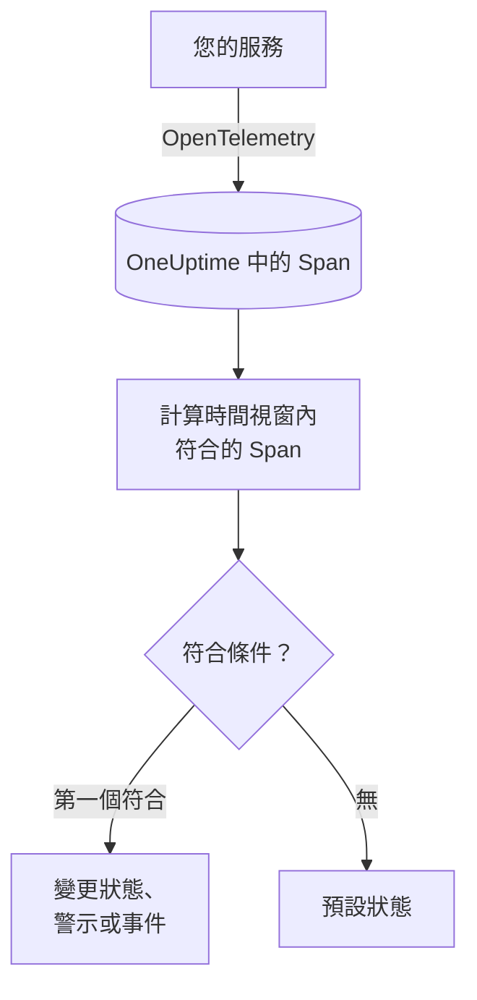

# 追蹤監控

追蹤監測器會在一個時間視窗內，計算您的服務傳送到 OneUptime、且符合您篩選器（Span 名稱、狀態、服務、屬性）的 Span。當計數符合您的條件時，它會變更監測器的狀態、建立警示或宣告事件。可以用它針對某個端點的失敗請求、錯誤 Span 激增，或已經停止傳送追蹤的服務發出警示。

:::cards
- [建立監測器](#建立追蹤監測器): 選擇要計算的 Span 以及何時發出警示。
- [Span 狀態碼](#span-狀態碼): OK、ERROR 和 UNSET 的意義，以及該依哪個篩選。
- [如何評估](#如何評估): 時間視窗、計數與一分鐘的週期。
- [條件](#條件): 閾值、異常偵測與預設值。
:::

## 運作方式

OneUptime 每分鐘計算一次符合監測器篩選器、且在其時間視窗內開始的 Span。它會把這個計數由上而下與監測器的條件比較，第一個符合的條件決定接下來發生什麼。如果沒有任何條件符合，監測器會回到預設狀態。

## 開始之前

- 您的服務透過 OpenTelemetry 將追蹤傳送到 OneUptime。請參閱 [OpenTelemetry](/docs/telemetry/open-telemetry)。
- 在追蹤瀏覽器中查到您要監看的 Span 的確切名稱：Span 名稱由您的檢測決定，例如 `POST /api/checkout` 或 `GET`。

## 建立追蹤監測器

:::steps
### 開始建立新監測器

前往 **監測器**，點選 **建立監測器**。

### 選擇 Traces

在 **監測器類型** 下點選 **更多監測器類型**，然後在 **遙測** 下選擇 **追蹤**，或在搜尋方塊中輸入 `traces`。輸入 **名稱**，然後點選 **下一步**。

### 選擇要計算的 Span

在 **追蹤監測器設定** 中設定 **Span 名稱**、**監測 (time) 內的追蹤** 和 **依 Span 狀態篩選**。留空的篩選器會符合所有 Span。篩選器下方的 **Span 預覽** 會顯示它們目前符合的 Span。

### 縮小範圍（選用）

開啟 **更多欄位**，依遙測服務、基礎架構實體或屬性篩選。

### 設定條件

**監測器條件** 卡片一開始有兩個條件：沒有任何 Span 符合時離線並建立事件；至少有一個符合時上線。請把它們改成您想發出警示的情況（請參閱 [條件](#條件)）。

### 建立監測器

點選 **建立監測器**。監測器會在其 **概覽** 頁面開啟，第一次評估會在一分鐘內執行。
:::

> [!TIP]
> 若要在 AI 功能回答不佳（失敗、拒絕、被截斷、空白、被標記或緩慢的回答）時收到通知，請改為在 **遙測** 下選擇 **AI / LLM**。該監測器會替您讀取追蹤中的 AI 呼叫，不需要撰寫任何 Span 篩選器。請參閱 [AI / LLM 可觀測性](/docs/telemetry/ai-llm-observability#ai-回答不佳時收到通知)。

## 查詢內容

| 欄位 | 符合什麼 | 預設值 |
| --- | --- | --- |
| **Span 名稱** | 名稱包含此文字的 Span，不區分大小寫。 | 空：所有 Span |
| **監測 (time) 內的追蹤** | 在最近 5 秒到最近 24 小時內開始的 Span。 | **過去 1 分鐘** |
| **依 Span 狀態篩選** | 具有所選任一狀態的 Span：**未設定**、**確定** 或 **錯誤**。 | 空：所有狀態 |
| **依遙測服務篩選**（在 **更多欄位** 中） | 來自所選任一服務的 Span。 | 空：所有服務 |
| **Filter by Infrastructure Entity**（在 **更多欄位** 中） | 來自所選任一主機、Pod、容器及其他實體的 Span。 | 空：所有實體 |
| **依屬性篩選**（在 **更多欄位** 中） | 屬性符合所有條件的 Span。每個條件都有自己的運算子，例如「等於」或「包含」。 | 空：無條件 |

Span 必須符合您設定的所有篩選器才會被計數。

### Span 狀態碼

- **OK** — 作業已由應用程式程式碼或追蹤管道明確標記為成功
- **ERROR** — 作業遇到錯誤
- **UNSET** — 未設定錯誤狀態。這是 OpenTelemetry 的預設狀態

UNSET 並不表示缺少資料。OpenTelemetry 檢測會在作業失敗時將狀態設為 ERROR，並讓成功的 span 維持 UNSET，因此在健康的服務上，大多數 span 都是 UNSET。OneUptime 會以綠色將它們顯示為「Unset (no error)」。記錄例外並不會改變 span 的狀態，因此 UNSET 的 span 仍可能帶有例外；這些例外會與該 span 一併列出。若要針對失敗發出警示，請依 ERROR 篩選。若要計算所有未失敗的 span，請同時選擇 OK 與 UNSET。

如果您希望成功的請求顯示為 OK，請在 **追蹤 > 設定 > 管道** 下新增一個追蹤管道，其篩選條件為 **狀態 = 未設定**，並包含一個 **狀態重新對應器**，用來將 `http.response.status_code` 的值（例如 `200`）對應為「確定 (1)」。

## 如何評估

- **每分鐘。** 追蹤監測器不是由探測器檢查，因此沒有可設定的間隔，也沒有 **探測器與間隔** 頁面。
- **每次評估一個數字。** 監測器會計算符合所有篩選器、且在評估前的 **監測 (time) 內的追蹤** 內開始的 Span。設為 **過去 5 分鐘** 時，每次評估會回看五分鐘，因此相鄰評估的視窗會重疊。
- **沒有 Span 就是計數 0。** 停止傳送追蹤的服務計數為 0，而預設的離線條件正是在找這種情況。
- **OneUptime 本身的停機不算沉默。** 只要時間視窗中包含 OneUptime 本身沒有接收資料的時間（正在重新啟動、升級或追趕積壓），檢查就會等待：狀態不會改變，也不會開啟或解決任何事件或警示。請參閱 [OneUptime 未接收資料時](/docs/monitor/when-oneuptime-is-not-receiving)。
- **條件由上而下。** 第一個符合的條件決定結果，因此請把最嚴重的放在最前面。

每次狀態變更及其原因，都會記錄在監測器的 **狀態時間軸** 上。

## 條件

追蹤監測器的條件只有一個 **篩選器類型**：**Span Count**，也就是視窗內符合的 Span 數量。選擇一個 **篩選條件**，如果是閾值條件，再填寫 **值**。

| 篩選條件 | 當 Span 數量…時符合 |
| --- | --- |
| **Greater Than** | 高於該值 |
| **Greater Than Or Equal To** | 等於或高於該值 |
| **Less Than** | 低於該值 |
| **Less Than Or Equal To** | 等於或低於該值 |
| **Equal To** | 正好等於該值 |
| **Anomalously High** | 高於每週這個時段的預期範圍 |
| **Anomalously Low** | 低於該範圍 |
| **Anomalous** | 往任一方向超出該範圍 |

異常條件沒有 **值**。請選擇 **敏感度**（Low、預設的 Medium 或 High）以及 14 天（預設）、28 天、60 天或 90 天的 **基準視窗**。OneUptime 會把計數換算成每分鐘的速率，並與該視窗內每週的同一時段比較。基準只涵蓋監測器的服務與 Span 狀態，不包含其 Span 名稱與屬性篩選器。在每週這個時段累積足夠的歷史之前，條件仍在學習，不會觸發。

新的追蹤監測器從以下條件開始：

| 條件 | 篩選器 | 效果 |
| --- | --- | --- |
| Check if … is offline | **Span Count** **Equal To** `0` | 將監測器標記為離線並宣告事件，事件會自動解決 |
| Check if … is online | **Span Count** **Greater Than** `0` | 將監測器標記為上線 |

## 實例：結帳請求失敗

五分鐘內，結帳服務記錄了 1,200 個名為 `POST /api/checkout` 的 Span：1,150 個 UNSET、20 個 OK、30 個 ERROR。同一個監測器依 **依 Span 狀態篩選** 的不同，計算出的數字差異很大：

| 依 Span 狀態篩選 | Span Count | 衡量的內容 |
| --- | --- | --- |
| **錯誤** | 30 | 失敗的請求 |
| **確定** | 20 | 只有被您的程式碼標記為成功的請求 |
| **未設定** 和 **確定** | 1,170 | 所有未失敗的請求 |
| 空 | 1,200 | 所有請求 |

若要在五分鐘內超過 10 個結帳請求失敗時收到呼叫：

- **Span 名稱**：`POST /api/checkout`
- **監測 (time) 內的追蹤**：**過去 5 分鐘**
- **依 Span 狀態篩選**：**錯誤**
- 條件 1：**Span Count** **Greater Than** `10`：將監測器標記為離線並宣告事件
- 條件 2：**Span Count** **Less Than Or Equal To** `10`：將監測器標記為上線

有 30 個失敗請求時，條件 1 符合並宣告事件。當五分鐘內失敗數不超過 10 個時，條件 2 符合，監測器恢復上線，事件會自行解決。

## 疑難排解

:::details 監測器沒有計算到我的端點的任何 Span
**Span 名稱** 會與 Span 的名稱比較，而檢測通常依路由（`POST /api/checkout`）或只依方法（`GET`）命名伺服器端 Span。請在追蹤瀏覽器中找到確切的名稱。接著開啟監測器的 **條件** 頁面（在 **設定** 下），點選 **Edit Monitoring Criteria**：**Span 預覽** 會顯示篩選器目前符合的內容。
:::

:::details 依確定篩選時，成功的請求沒有被計算
大多數檢測會把成功的 Span 保留為 UNSET，而不是 OK（請參閱 [Span 狀態碼](#span-狀態碼)）。請同時選擇 **未設定** 和 **確定**，或新增那裡介紹的追蹤管道。
:::

:::details 某個 Span 有例外，但沒有被計為錯誤
記錄例外並不會改變 Span 的狀態。請依 **錯誤** 篩選，或使用 [例外狀況監測器](/docs/monitor/exceptions-monitor) 針對例外本身發出警示。
:::

:::details 異常條件從不觸發
它仍在學習：它所比較的每週時段在 **基準視窗** 內還沒有足夠的歷史。
:::

## 後續步驟

:::cards
- [例外狀況監控](/docs/monitor/exceptions-monitor): 針對您的服務記錄的例外發出警示。
- [日誌監控](/docs/monitor/logs-monitor): 針對日誌量與日誌內容發出警示。
- [搜尋語法](/docs/telemetry/search-syntax): 在追蹤瀏覽器中尋找 Span 名稱與狀態。
- [事件與警示範本](/docs/monitor/incident-alert-templating): 撰寫實用的警示標題與描述。
:::
