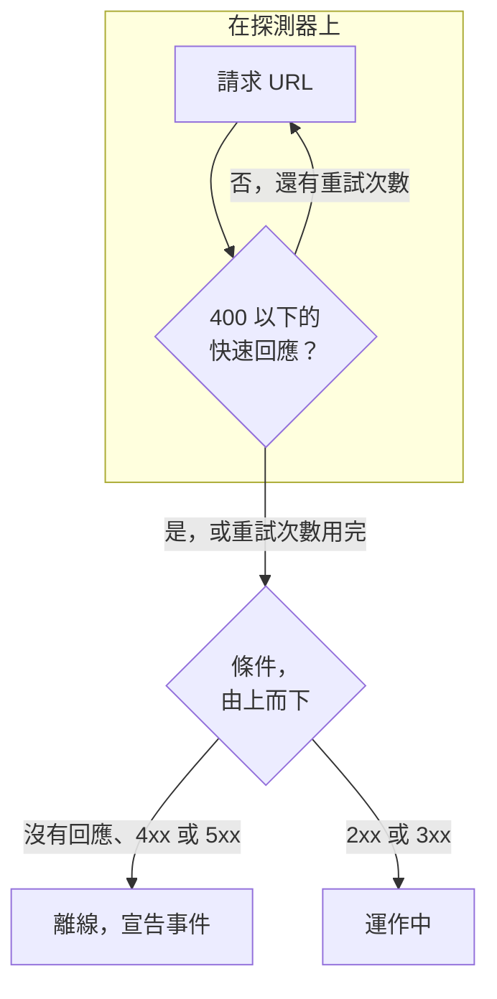

# 網站監控

網站監測器會檢查網頁是否回應。每次檢查時，探測器都會請求頁面的 URL；當頁面沒有回應或回傳錯誤時，監測器會變為離線並宣告事件。若要使用方法、標頭或內文呼叫端點，請改用 [API 監控](/docs/monitor/api-monitor)。

:::cards
- [建立監測器](#建立網站監測器): 在主控台中完成六個步驟。
- [設定選項](#設定選項): URL 預留位置、重新導向、憑證、逾時和重試。
- [監測條件](#監測條件): 開箱即用時，什麼算正常、什麼算停擺。
- [疑難排解](#疑難排解): 監測器和瀏覽器的結果不一致時。
:::

## 運作方式

每次檢查時，探測器會請求該 URL，跟隨所有重新導向，並記錄回傳的內容：狀態碼、回應時間、標頭，以及條件需要時的內文。失敗、逾時、回傳 `4xx` 或 `5xx` 狀態，或耗時超過 10 秒的請求會重試，最多重試您允許的次數。接著 OneUptime 會以監測器的條件評估結果。



當監測器的所有條件都不讀取回應內文（**回應內文** 或 **JavaScript Expression** 篩選器）時，探測器會傳送 `HEAD` 請求而不是 `GET` 請求；如果伺服器拒絕 `HEAD`，則改以 `GET` 重新傳送。您伺服器的存取記錄中可能出現其中任何一種。

失去自身網路連線的探測器不會回報任何結果，因此它無法將您的網站標記為離線。

## 開始之前

- **可以建立監測器的角色**：Project Owner、Project Admin、Project Member、Monitor Admin 或 Monitor Member，或者擁有 Create Monitor 權限的自訂角色。
- **能夠連到該網站的探測器。** 每個新的監測器都會選取您專案的預設探測器。如果網站前面有防火牆，請允許 [OneUptime Cloud 探測器 IP 位址](/docs/configuration/ip-addresses)。私有網路中的網站需要在該網路內執行、並獲准連到私有位址的 [自訂探測器](/docs/probe/custom-probe)：請參閱 [私有網路存取](/docs/self-hosted/private-network-access)。

## 建立網站監測器

:::steps
### 開始建立新監測器

前往 **監測器**，點選 **建立監測器**。在 **監測器類型** 下選擇 **網站**。

### 命名

輸入 **名稱**，例如 `Marketing site`，然後點選 **下一步**。

### 輸入 URL

在 **網站 URL** 中輸入頁面的完整位址，包括 `https://`，例如 `https://example.com`。若要變更重新導向、憑證、逾時或重試，請展開下方的 **更多欄位**（請參閱 [設定選項](#設定選項)）。

### 測試

點選 **測試監測器**，在 **選擇探測器** 中選擇一個探測器，然後點選 **執行測試**。**監測器測試結果** 會顯示探測器收到的內容。

### 檢視條件

**監測器條件** 從 [預設條件](#預設條件) 開始：網站沒有回應或回傳錯誤時為離線，回傳任何 `2xx` 或 `3xx` 狀態時為上線。如有需要可修改，然後點選 **下一步**。

### 選擇探測器並建立

保留或修改 **探測器** 和 **監測間隔**（初始為 **每 5 分鐘**），然後點選 **建立監測器**。監測器頁面隨即開啟。
:::

## 設定選項

### 網站 URL

要檢查的頁面，以包含通訊協定的完整 URL 表示：`https://example.com`、`https://example.com/pricing` 或 `http://example.com:8080/health`。您可以用 `{{monitorSecrets.NAME}}` 的形式在 URL 中放入 [監測器密鑰](/docs/monitor/monitor-secrets)，例如查詢字串中的權杖。

### 動態 URL 預留位置

當網站前面有 CDN 或快取 Proxy 時，探測器可能從快取而不是您的伺服器得到回應。若要略過快取，請在 URL 中加入預留位置；探測器每次檢查時都會把它換成新的值。

| 預留位置 | 取代為 | 範例值 |
| --- | --- | --- |
| `{{timestamp}}` | 目前的 Unix 時間（秒） | `1719500000` |
| `{{random}}` | 由 32 個十六進位字元組成的隨機唯一字串 | `3f2b8c1d9e7a4b6c8d0e1f2a3b4c5d6e` |

含預留位置的 URL：

```text
https://example.com/health?cb={{timestamp}}
```

相隔五分鐘的兩次檢查中，探測器請求的內容：

```text
https://example.com/health?cb=1719500000
https://example.com/health?cb=1719500300
```

`{{random}}` 的用法相同：`https://example.com/health?nocache={{random}}`。

### 更多欄位

這些設定收合在 URL 下方的 **更多欄位** 中。收合的標題會列出它們，並顯示您變更過哪些。

| 欄位 | 預設值 | 作用 |
| --- | --- | --- |
| **不要跟隨重新導向** | 關閉 | 判斷第一個回應，而不是跟隨重新導向。請參閱 [下文](#不要跟隨重新導向)。 |
| **允許自簽憑證** | 關閉 | 對監測器本身的主機名稱略過 TLS 憑證驗證。 |
| **使用用戶端憑證（mTLS）** | 關閉 | 出示用戶端憑證和私密金鑰。請參閱 [用戶端憑證（mTLS）](#用戶端憑證mtls)。 |
| **請求逾時（秒）** | `60` | 每次嘗試等待的時間。最長為 60 秒。 |
| **失敗時重試** | 探測器預設值，通常為 `3` | 失敗的嘗試要重試幾次。最多為 3。請參閱 [重試和逾時](#重試和逾時)。 |

#### 不要跟隨重新導向

預設情況下，探測器會跟隨重新導向（`301`、`302`、`303`、`307` 和 `308`），最多 10 次，並判斷最後到達的頁面。開啟 **不要跟隨重新導向** 即可改為判斷重新導向回應本身，例如檢查 `http://` 是否重新導向到 `https://`。[預設條件](#預設條件) 將重新導向回應視為上線。

**允許自簽憑證** 會跟隨停留在監測器本身主機名稱上的重新導向。重新導向到其他主機名稱時照常驗證。

#### 用戶端憑證（mTLS）

如果網站要求雙向 TLS，請開啟 **使用用戶端憑證（mTLS）** 並填寫：

| 欄位 | 填寫內容 |
| --- | --- |
| **用戶端憑證 (PEM)** | 要出示的 PEM 編碼用戶端憑證。 |
| **用戶端私密金鑰 (PEM)** | 與之相符的 PEM 編碼私密金鑰。 |
| **用戶端私密金鑰密碼短語** | 選填。僅當私密金鑰已加密時填寫的密碼短語。 |

這相當於 curl 的 `--cert` 和 `--key` 旗標：

```bash
curl --cert client.crt --key client.key https://example.com/health
```

若要讓金鑰不出現在監測器的設定中，請將憑證和金鑰儲存為 [監測器密鑰](/docs/monitor/monitor-secrets)，並在這些欄位中輸入 `{{monitorSecrets.NAME}}`。密鑰在伺服器上填入，它們的值永遠不會出現在主控台中。

只有當請求停留在監測器 URL 的來源（相同的通訊協定、主機和連接埠）上時，才會出示用戶端憑證。重新導向到其他來源之後，探測器會在沒有憑證的情況下繼續。

#### 重試和逾時

**失敗時重試** 計算的是第一次嘗試 _之後_ 的重試次數，因此 `0` 只執行一次檢查，`2` 最多執行三次。留空時使用探測器的預設值：3，除非探測器的 `PROBE_MONITOR_RETRY_LIMIT` 另有設定。探測器在兩次嘗試之間等待一秒，每次嘗試都有完整的 **請求逾時（秒）**。

這些失敗會重試：連線錯誤、逾時、`4xx` 和 `5xx` 回應，以及慢於 10 秒的回應。以下失敗不會重試，因為再試也無法改變結果：無效或遭封鎖的 URL、超過 10 次的重新導向，以及大於 512 KiB 的回應。

## 監測條件

條件決定網站何時算是上線、效能下降或離線，以及是否因此宣告事件或建立警示。每個條件會檢查一個或多個篩選器：

| 篩選器 | 條件 | 檢查內容 |
| --- | --- | --- |
| **Is Online** | **是**、**否** | 網站是否有回應，無論狀態碼為何。 |
| **回應狀態碼** | **Equal To**、**Not Equal To**、**Greater Than**、**Less Than**、**Greater Than Or Equal To**、**Less Than Or Equal To** | HTTP 狀態碼。 |
| **回應時間（毫秒）** | **Greater Than**、**Less Than**、**Greater Than Or Equal To**、**Less Than Or Equal To** | 請求所花的時間，包括重新導向。 |
| **回應內文** | **包含**、**Not Contains** | 回應內文中的文字。比對時區分大小寫。 |
| **Response Header** | **包含**、**Not Contains** | 回應中是否有此名稱的標頭。以小寫輸入名稱，例如 `x-cache`。 |
| **Response Header Value** | **包含**、**Not Contains** | 某個標頭的值是否剛好是此值，以小寫比較，例如 `no-store`。 |
| **JavaScript Expression** | **Evaluates To True** | 針對回應的運算式。請參閱 [JavaScript 運算式](/docs/monitor/javascript-expression)。 |
| **Is Request Timeout** | **是**、**否** | 請求是否在每次嘗試中都逾時。 |

**新增條件準則** 會新增一個已依其篩選器命名的條件，例如 _Response Time (in ms) is above 3000_。在您輸入自己的名稱之前，名稱會隨篩選器變化。描述是選填的：若要新增描述，請開啟條件的 **設定**。

有兩個以上的篩選器時，**符合條件** 決定是 **全部** 篩選器都必須符合，還是 **任何** 一個符合即可。條件的 **操作** 決定它做什麼：變更監測器狀態、建立警示、宣告事件，或其中任意幾項。

### 預設條件

新的網站監測器以兩個條件開始，因此不需任何變更即可運作：

- **離線** — 網站沒有回應，或回傳 `400` 以上（或低於 `200`）的狀態碼。監測器會被標記為 **離線** 並建立事件。網站恢復後，事件會自行解決。
- **上線** — 網站回傳任何 `2xx` 或 `3xx` 狀態碼，例如 `200`、`204` 或 `301`。監測器會被標記為 **運作中**。

在條件清單中，它們以監測器命名：_Check if (name) is offline_ 和 _Check if (name) is online_。

因此，回傳 `204 No Content` 的頁面，或者在開啟 **不要跟隨重新導向** 時監測的重新導向，都算是正常。如果對您來說只有一個狀態碼代表健康，請在監測器的 **設定 → 條件** 頁面上修改這兩個條件：例如上線條件中使用 **回應狀態碼** / **Equal To** / `200`，離線條件中使用 **Not Equal To** / `200`，取代各自原有的兩個狀態碼篩選器。

條件由上而下檢查，第一個符合的條件決定接下來會發生什麼。

沒有任何條件符合時，監測器會回到它的預設狀態：**運作中**，除非您在條件下方的 **更多欄位** 中選擇了其他狀態。收合的 **更多欄位** 標題會顯示是哪個狀態。

在 OneUptime 變更這些預設值之前建立的監測器會保留建立時的條件，只把 `200` 視為上線。透過 API 或 Terraform 建立的監測器使用您傳送的條件。

### 在一段時間內評估

**在一段時間內評估此條件** 是篩選器下方的核取方塊，適用於 **Is Online**、**回應狀態碼** 和 **回應時間（毫秒）**。開啟它即可判斷過去一段時間內的檢查，而不只是最近一次：在 **評估** 中選擇彙總方式，在 **過去(以分鐘計)** 中選擇 2 到 60 分鐘的時間範圍。

| 彙總 | 符合的時機 |
| --- | --- |
| **平均**、**總和**、**Maximum Value**、**Minimum Value** | 該數值在整個時間範圍內滿足條件。僅限數值篩選器。 |
| **All Values** | 時間範圍內的每次檢查都滿足條件。 |
| **Any Value** | 時間範圍內至少有一次檢查滿足條件。 |

**All Values** 只有在時間範圍真正被資料涵蓋後才會符合。剛建立的監測器，或檢查已不再被記錄的監測器，沒有足夠的歷史資料來說明過去 N 分鐘的情況，因此條件會等待，而不是根據手上僅有的一個讀數符合。**Any Value** 用於「只要有一次檢查超過臨界值就立刻告訴我」，而且仍會立即觸發。

**如果沒有資料** 決定在時間範圍無法支撐條件時會發生什麼：

| 選項 | 會發生什麼 | 適用於 |
| --- | --- | --- |
| **Ignore**（預設） | 條件不符合。 | 一般的臨界值警示。 |
| **觸發器** | 缺少的資料本身被視為問題。 | 沉默本身就是故障的檢查。 |
| **Treat As Zero** | 將時間範圍視為單一個零來比較。 | 沒有事件確實代表零的計數器。 |

### 條件範例

| 目標 | 篩選器 | 條件 | 值 |
| --- | --- | --- | --- |
| 網站變慢時標記為效能下降 | **回應時間（毫秒）** | **Greater Than** | `3000` |
| 抓出以 `200` 回傳的錯誤頁面 | **回應內文** | **Not Contains** | `Welcome` |
| 檢查 CDN 標頭是否存在 | **Response Header** | **包含** | `x-cache` |
| 只接受 `200` 為健康 | **回應狀態碼** | **Equal To** | `200` |

## 疑難排解

:::details 監測器顯示離線，但網站在我的瀏覽器中可以開啟
探測器得到的回應與您的瀏覽器不同。事件的根本原因，以及監測器上的 **監測日誌**，會顯示探測器看到的內容。常見原因：

- 防火牆或機器人過濾器封鎖了探測器。請允許 [OneUptime Cloud 探測器 IP 位址](/docs/configuration/ip-addresses)。
- 網站只能在您的網路中連線。請在該網路內使用 [自訂探測器](/docs/probe/custom-probe)。
- 憑證是自簽的，或來自私人憑證授權單位。開啟 **允許自簽憑證**，或以 [SSL 憑證監控](/docs/monitor/ssl-certificate-monitor) 單獨監測憑證。
:::

:::details 檢查失敗並顯示 "Remote response exceeded the allowed size."
探測器最多讀取回應的 512 KiB，而此頁面更大。讓監測器指向較小的頁面（例如健康檢查端點），或者移除 **回應內文** 和 **JavaScript Expression** 篩選器，讓探測器只需要標頭。
:::

:::details 檢查失敗並顯示 "Monitor target exceeded 10 redirects."
該 URL 的重新導向超過 10 次，通常是迴圈。以 `curl -IL` 開啟該 URL 查看重新導向鏈，並讓監測器指向重新導向鏈應該結束的頁面。
:::

:::details 檢查失敗並顯示一則關於私有網路位址的訊息
該 URL 解析到私有位址，而執行檢查的探測器不允許連到私有位址。在自行託管的探測器上，以 `PROBE_ALLOW_PRIVATE_NETWORK_MONITORS` 開啟此功能：請參閱 [私有網路存取](/docs/self-hosted/private-network-access)。
:::

## 後續步驟

:::cards
- [API 監控](/docs/monitor/api-monitor): 使用方法、標頭和內文呼叫端點。
- [SSL 憑證監控](/docs/monitor/ssl-certificate-monitor): 在網站憑證到期之前收到警告。
- [監控密鑰](/docs/monitor/monitor-secrets): 讓權杖和金鑰不出現在監測器設定中。
- [事件](/docs/incidents/index): 監測器宣告事件之後會發生什麼。
:::
