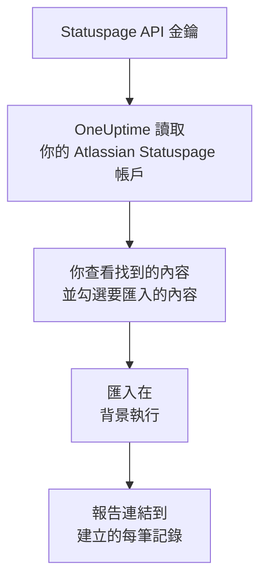

# 從 Atlassian Statuspage 移轉

**從其他工具匯入** 只需幾分鐘就能把你的 Atlassian Statuspage 頁面移轉到 OneUptime。使用一個 Statuspage API 金鑰，OneUptime 會讀取你的頁面、它們的元件和群組以及電子郵件訂閱者，顯示找到的內容，並建立你勾選的內容。Statuspage 中的任何內容都不會變更。

:::cards
- [匯入你的帳戶](#匯入你的-atlassian-statuspage-帳戶): 建立金鑰，讀取你的帳戶，並勾選要匯入的內容。
- [會匯入什麼](#會匯入什麼): 每個 Statuspage 頁面、元件和訂閱者在 OneUptime 中會變成什麼。
- [完成移轉](#完成移轉): 匯入完成後要做的事。
:::

## 運作方式

- **金鑰只使用一次。** OneUptime 讀取你的帳戶期間，金鑰會加密保存；讀取一結束，無論成功與否，金鑰都會立即刪除。它不會再次顯示，也不會寫入任何記錄檔。
- **OneUptime 只讀取。** 它只呼叫 Atlassian Statuspage 自己的 API：`api.statuspage.io`。它每秒傳送一個請求，這是 Statuspage 允許單一金鑰的上限。當 Atlassian Statuspage 要求放慢速度時，它會等待後重試。
- **在你開始匯入之前，不會建立任何內容。** 預覽會為每一項顯示：它是新的、已在 OneUptime 中（並依原樣使用）、已由先前的匯入帶入，或者無法匯入的原因。
- **再次執行絕不會重複建立。** OneUptime 會依 Atlassian Statuspage ID 記住每次匯入帶入的內容。在 Atlassian Statuspage 中新增頁面或元件後再次執行，只會建立新的內容。

## 開始之前

- **一個 OneUptime 專案，以及建立所匯入內容的權限。** 專案擁有者和專案管理員可以匯入所有內容。其他角色也可以執行匯入，並匯入他們有權建立的記錄類型。其餘內容會顯示為不匯入，並附上原因。
- **一個 Statuspage API 金鑰。** 只有帳戶擁有者才能建立。匯入絕不會寫入 Statuspage，並會讀取金鑰能看到的每個頁面。
- **為你的頁面留出空間（OneUptime Cloud）。** 你的方案對狀態頁面和訂閱者的數量有上限。放不下的內容會顯示為不匯入。元件會變成免費的手動監測器。

## 匯入你的 Atlassian Statuspage 帳戶

:::steps
### 在 Statuspage 中建立 API 金鑰
在 Statuspage 中選擇左下角的頭像，然後選擇 **API info**。選擇 **Create key**，將它命名為 `OneUptime import`，然後複製。

### 開啟匯入頁面
在 OneUptime 中，前往 **專案設定** > **從其他工具匯入**，然後選擇 **Atlassian Statuspage**。

### 連線 Atlassian Statuspage
將金鑰貼到 **Atlassian Statuspage API 金鑰** 中，然後選擇 **讀取我的 Atlassian Statuspage 帳戶**。大型帳戶需要幾分鐘，讀取期間你可以離開頁面。

### 勾選要匯入的內容
預覽依類型分節列出找到的內容。所有將被建立的內容一開始都已勾選，但訂閱者除外。每一項下方，OneUptime 會說明哪些內容不會原樣匯入。當勾選的狀態頁面顯示了你未勾選的監測器時，它會提示，**一併勾選** 可以把它們勾選起來。要匯入訂閱者，請勾選他們，然後在下方確認他們同意接收你的更新，而且你可以搬移他們。不會寄電子郵件給任何人。

### 開始匯入
選擇 **開始匯入**。匯入在背景執行：你可以離開頁面，報告會在那裡等你。
:::

報告會統計已建立和未匯入的數量，並列出每一項及其對應記錄的連結，失敗的排在最前面。先前的匯入列在同一頁面的 **先前的匯入** 下。

## 會匯入什麼

| 在 Atlassian Statuspage 中 | 在 OneUptime 中 | 方式 |
| --- | --- | --- |
| Components | 手動監測器 | 每個元件都會變成狀態頁面顯示的手動監測器。沒有任何東西檢查它：你像在 Statuspage 中一樣，在 OneUptime 中設定它的狀態。元件群組會變成頁面上的群組。 |
| Pages | 狀態頁面 | 每個頁面會連同名稱和說明、群組中的元件，以及它特別顯示的元件的可用率和歷史一起匯入。只有部分人可以查看的頁面會以私人方式匯入。 |
| Email subscribers | 狀態頁面訂閱者 | 在你確認可以搬移後，已確認的電子郵件訂閱者會被匯入，並訂閱相同的元件。不會寄電子郵件給任何人，他們從 OneUptime 收到的每則更新都附有取消訂閱的連結。 |

元件以正常運作狀態匯入。預覽會列出目前在 Statuspage 中未顯示為正常運作的每個元件，方便你在匯入後設定它的狀態。

## 不會匯入什麼

- **事件、排定維護及其歷史。** OneUptime 中的事件是會呼叫人員的即時記錄，因此過去的事件留在 Statuspage 中。
- **透過簡訊、Webhook、Slack 或 Microsoft Teams 訂閱的訂閱者。** 預覽會統計數量。只會匯入電子郵件訂閱者。
- **事件範本和系統指標。** 請在 OneUptime 中新增你仍然需要的內容。
- **狀態頁面自己的網域和品牌。** 在 OneUptime 中，於 **自訂網域** 下新增網域，於 **品牌** 下新增標誌。

## 限制

一次匯入最多建立 2,000 筆記錄：最多 1,000 個監測器和 50 個狀態頁面。訂閱者不計入其中：一次匯入最多帶入 5,000 位訂閱者。超出限制的內容會顯示為不匯入。再次執行匯入即可帶入其餘部分。

在 OneUptime Cloud 上，方案沒有空間容納的狀態頁面和訂閱者會顯示為不匯入，並註明所需條件。

預覽保留一天。只有讀取帳戶的人才能勾選內容並開始匯入。專案擁有者和專案管理員可以看到每次匯入的進度和報告。

## 完成移轉

:::steps
### 檢查你的狀態頁面
在 **狀態頁面** 下開啟每個頁面，並與 Statuspage 中的頁面比對。每個元件都是一個手動監測器：情況變化時，請在 OneUptime 中變更其狀態。

### 將狀態頁面的位址指向 OneUptime
在 **狀態頁面** 下開啟頁面，在 **自訂網域** 中新增你的網域，然後修改它的 DNS 記錄。這樣訪客和訂閱者就會連到新頁面。

### 在 Atlassian Statuspage 中關閉你的頁面
當你的網域指向 OneUptime 後，請在 Statuspage 中關閉該頁面，以免其訂閱者收到重複通知。
:::

## 疑難排解

:::details Atlassian Statuspage 不接受 API 金鑰
請檢查你是否複製了完整的金鑰，以及它是否由帳戶擁有者在 **API info** 中建立。一個金鑰屬於一個 Statuspage 組織，只能讀取該組織的頁面。然後選擇 **再試一次**。
:::

:::details 無法匯入訂閱者
請勾選訂閱者下方的核取方塊，確認他們同意接收你的更新，而且你可以搬移他們：**開始匯入** 會等待這項確認。從未在 Statuspage 中確認訂閱的訂閱者會留在那裡。
:::

:::details 有些項目無法勾選
每一項都會說明原因：專案中已有的名稱、先前的匯入已帶入的內容，或者你無權建立、或你的方案不包含的記錄。
:::

## 後續步驟

:::cards
- [狀態頁概觀](/docs/status-pages/index): 狀態頁面顯示什麼，以及誰可以查看。
- [訂閱者與公告](/docs/status-pages/subscribers): 訂閱者如何得知事件。
- [手動監控](/docs/monitor/manual-monitor): 由你自己設定狀態的監測器。
:::
