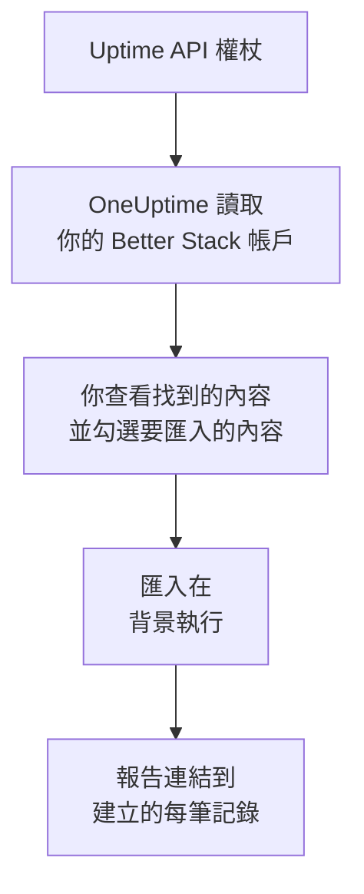

# 從 Better Stack 移轉

**從其他工具匯入** 只需幾分鐘就能把你的 Better Stack Uptime 監測器、心跳和狀態頁面移轉到 OneUptime。使用一個 Better Stack Uptime API 權杖，OneUptime 會讀取你的監測器、心跳、狀態頁面及其電子郵件訂閱者，顯示找到的內容，並建立你勾選的內容。Better Stack 中的任何內容都不會變更。

:::cards
- [匯入你的帳戶](#匯入你的-better-stack-帳戶): 建立權杖，讀取你的帳戶，並勾選要匯入的內容。
- [會匯入什麼](#會匯入什麼): 每個 Better Stack 監測器、心跳和狀態頁面在 OneUptime 中會變成什麼。
- [完成移轉](#完成移轉): 匯入完成後要做的事。
:::

## 運作方式

- **金鑰只使用一次。** OneUptime 讀取你的帳戶期間，金鑰會加密保存；讀取一結束，無論成功與否，金鑰都會立即刪除。它不會再次顯示，也不會寫入任何記錄檔。
- **OneUptime 只讀取。** 它只呼叫 Better Stack 自己的 API：`incidents.betterstack.com`。當 Better Stack 要求放慢速度時，它會等待後重試。
- **在你開始匯入之前，不會建立任何內容。** 預覽會為每一項顯示：它是新的、已在 OneUptime 中（並依原樣使用）、已由先前的匯入帶入，或者無法匯入的原因。
- **再次執行絕不會重複建立。** OneUptime 會依 Better Stack ID 記住每次匯入帶入的內容。在 Better Stack 中新增監測器或心跳後再次執行，只會建立新的內容。

## 開始之前

- **一個 OneUptime 專案，以及建立所匯入內容的權限。** 專案擁有者和專案管理員可以匯入所有內容。其他角色也可以執行匯入，並匯入他們有權建立的記錄類型。其餘內容會顯示為不匯入，並附上原因。
- **一個 Better Stack Uptime API 權杖。** 請使用團隊層級的 Uptime 權杖：它會讀取該團隊的監測器、心跳和狀態頁面。匯入絕不會寫入 Better Stack。
- **付款方式（OneUptime Cloud）。** 執行檢查的監測器即使在 Free 方案中也會依用量計費，因此請在匯入前於 **專案設定** > **帳單** 中新增付款方式。沒有付款方式時，這些監測器會顯示為不匯入。

## 匯入你的 Better Stack 帳戶

:::steps
### 在 Better Stack 中建立 API 權杖
在 Better Stack 中，依序進入 **API tokens** > **Team-based tokens**，然後選擇你的團隊。在 **Uptime API tokens** 下建立一個名為 `OneUptime import` 的權杖並複製。

### 開啟匯入頁面
在 OneUptime 中，前往 **專案設定** > **從其他工具匯入**，然後選擇 **Better Stack**。

### 連線 Better Stack
將權杖貼到 **Better Stack API 金鑰** 中，然後選擇 **讀取我的 Better Stack 帳戶**。大型帳戶需要幾分鐘，讀取期間你可以離開頁面。

### 勾選要匯入的內容
預覽依類型分節列出找到的內容。所有將被建立的內容一開始都已勾選，但已暫停的監測器（勾選後會以暫停狀態匯入）和訂閱者除外。每一項下方，OneUptime 會說明哪些內容不會原樣匯入。當勾選的狀態頁面顯示了你未勾選的監測器時，它會提示，**一併勾選** 可以把它們勾選起來。要匯入訂閱者，請勾選他們，然後在下方確認他們同意接收你的更新，而且你可以搬移他們。不會寄電子郵件給任何人。

### 開始匯入
選擇 **開始匯入**。匯入在背景執行：你可以離開頁面，報告會在那裡等你。
:::

報告會統計已建立和未匯入的數量，並列出每一項及其對應記錄的連結，失敗的排在最前面。先前的匯入列在同一頁面的 **先前的匯入** 下。

## 會匯入什麼

| 在 Better Stack 中 | 在 OneUptime 中 | 方式 |
| --- | --- | --- |
| Monitors and heartbeats | 監測器 | 每個監測器都會變成同類型的監測器，位址、間隔和逾時都相同。每個心跳都會變成傳入請求監測器。 |
| Status pages | 狀態頁面 | 每個頁面會以其區段作為群組，連同它顯示的監測器和心跳一起匯入。你手動追蹤的項目會變成手動監測器。設有密碼或 IP 允許清單的頁面會以私人方式匯入。 |
| Email subscribers | 狀態頁面訂閱者 | 在你確認可以搬移後，已確認的電子郵件訂閱者會被匯入，並訂閱相同的資源。不會寄電子郵件給任何人，他們從 OneUptime 收到的每則更新都附有取消訂閱的連結。 |

- **status、expected status code、keyword 和 keyword absence 監測器** 會變成網站監測器；如果它們傳送其他方法、標頭或 JSON 本文，則變成 API 監測器。status 監測器在任何 2xx 回應時為正常，expected status code 監測器在它列出的狀態碼時為正常。
- **Ping 和 TCP 監測器** 會變成 Ping 和連接埠監測器。**SMTP、POP 和 IMAP 監測器** 會變成對應連接埠的連接埠監測器：OneUptime 只檢查連接埠是否回應，不檢查郵件通訊。
- **DNS 監測器** 會變成針對其查詢名稱的 DNS 監測器，並詢問同一台伺服器。
- **心跳** 會變成傳入請求監測器，在週期加寬限時間內沒有收到請求時判定為故障。每個監測器在 OneUptime 中都有新位址。
- **SSL 到期警告。** 在憑證到期前發出警告的監測器，還會獲得一個以它命名、提前同樣天數警告的 SSL 憑證監測器。

每個監測器都由專案的探測器檢查，和你自己建立的監測器一樣。OneUptime 未提供的檢查間隔會改為最接近的可用間隔，超過一分鐘的逾時會改為一分鐘。任一項有變化時，預覽都會說明。

## 不會匯入什麼

- **可用性歷史、回應時間和事件。** OneUptime 從匯入完成時開始檢查。
- **警示聯絡人和整合。** 請依 [完成移轉](#完成移轉) 中的說明，在 OneUptime 中選擇通知誰。
- **密碼，以及可能含有機密資訊的標頭。** 需要登入的監測器，或傳送 `Authorization`、Cookie 或權杖標頭的監測器，會去掉這些內容後匯入：請用 [監測器密鑰](/docs/monitor/monitor-secrets) 新增。
- **UDP 和 Playwright 監測器。** OneUptime 沒有能做同樣事情的監測器，預覽會逐一列出。
- **從未確認訂閱的訂閱者。** 他們會留在 Better Stack 中。
- **狀態頁面上除監測器、心跳和手動追蹤項目以外的內容。** 預覽會逐一列出。
- **狀態頁面自己的網域和品牌。** 在 OneUptime 中，於 **自訂網域** 下新增網域，於 **品牌** 下新增標誌。

## 限制

一次匯入最多建立 2,000 筆記錄：最多 1,000 個監測器和 50 個狀態頁面。訂閱者不計入其中：一次匯入最多帶入 5,000 位訂閱者。超出限制的內容會顯示為不匯入。再次執行匯入即可帶入其餘部分。

在 OneUptime Cloud 上，執行檢查的監測器需要付款方式，方案沒有空間容納的內容會顯示為不匯入，並註明所需條件。

預覽保留一天。只有讀取帳戶的人才能勾選內容並開始匯入。專案擁有者和專案管理員可以看到每次匯入的進度和報告。

## 完成移轉

:::steps
### 檢查你的監測器
在 **監測器** 下開啟每個監測器，檢查它的首批結果。心跳監測器有一個新位址：請讓呼叫它的工作改為指向該位址。

### 選擇通知誰
為監測器新增擁有者，或為它們建立的事件設定 **待命** > **待命策略** 中的待命策略，這樣發生故障時會通知到合適的人。

### 將狀態頁面的位址指向 OneUptime
在 **狀態頁面** 下開啟頁面，在 **自訂網域** 中新增你的網域，然後修改它的 DNS 記錄。這樣訪客和訂閱者就會連到新頁面。

### 在 Better Stack 中關閉檢查
當 OneUptime 檢查相同的內容後，請在 Better Stack 中暫停這些檢查，以免有人收到重複通知。
:::

## 疑難排解

:::details Better Stack 不接受 API 金鑰
請檢查你是否複製了完整的權杖，以及它是否是 **Uptime API tokens** 中團隊的權杖，而不是 Telemetry 權杖。然後選擇 **再試一次**。
:::

:::details 某個監測器顯示為不匯入
它會說明原因：OneUptime 沒有的監測器類型、OneUptime 無法讀取的位址，或者專案沒有空間或沒有付款方式來容納它。如果 OneUptime 已經在執行名稱、類型和位址都相同的監測器，會直接使用該監測器。
:::

:::details 有些項目無法勾選
每一項都會說明原因：專案中已有的名稱、先前的匯入已帶入的內容，或者你無權建立、或你的方案不包含的記錄。
:::

## 後續步驟

:::cards
- [傳入請求監控](/docs/monitor/incoming-request-monitor): 心跳在 OneUptime 中如何運作。
- [狀態頁概觀](/docs/status-pages/index): 狀態頁面顯示什麼，以及誰可以查看。
- [從 UptimeRobot 移轉](/docs/moving-to-oneuptime/uptimerobot): 從 UptimeRobot 移轉你的檢查。
:::
