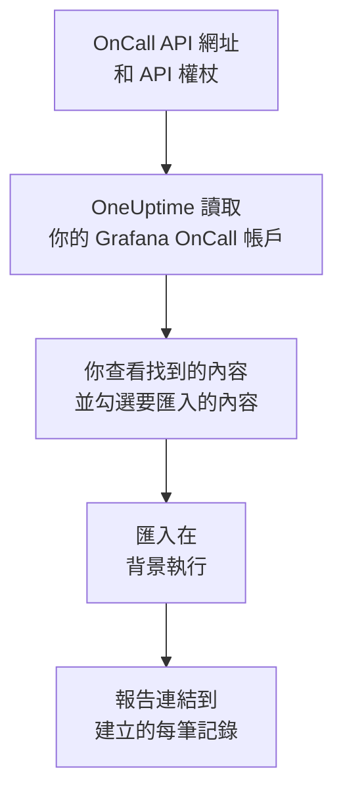

# 從 Grafana OnCall 移轉

Grafana Labs 已於 2026 年 3 月將開源版 Grafana OnCall 封存，在 Grafana Cloud 上它作為 Grafana Cloud IRM 的一部分繼續提供。無論你的 OnCall 在哪裡執行，**從其他工具匯入** 都只需幾分鐘就能把你的待命設定搬到 OneUptime。使用 OnCall API 網址和一個 API 權杖，OneUptime 會讀取你的使用者、團隊、排程和上報鏈，顯示找到的內容，並建立你勾選的內容。Grafana OnCall 中的任何內容都不會變更。

:::cards
- [匯入你的帳戶](#匯入你的-grafana-oncall-帳戶): 建立權杖、讀取你的帳戶，並勾選要匯入的內容。
- [會匯入什麼](#會匯入什麼): 每筆 Grafana OnCall 記錄在 OneUptime 中會變成什麼。
- [完成移轉](#完成移轉): 匯入完成後要做的事。
:::

## 運作方式

- **權杖只使用一次。** OneUptime 讀取你的帳戶期間，權杖會與 API 網址一起加密保存；讀取一結束，無論成功與否，權杖都會立即刪除。它不會再次顯示，也不會寫入任何記錄檔。
- **OneUptime 只讀取，而且只從你提供的網址讀取。** 它只呼叫你貼上的 OnCall API 網址，每秒最多一次，這在 Grafana OnCall 每個權杖五分鐘 300 個請求的限制之內。當 Grafana OnCall 要求放慢速度時，它會等待後再試。
- **每次請求前都會檢查網址。** OneUptime 絕不會呼叫它所執行的機器或雲端中繼資料服務，也絕不會跟隨重新導向。在 OneUptime Cloud 上，網址還必須是公開網址，並以 `https://` 開頭。自行託管的 OneUptime 也可以讀取你自己網路中的 Grafana OnCall，除非其管理員關閉了這項功能，請見 [Private Network Access](/docs/self-hosted/private-network-access)。
- **在你開始匯入之前，不會建立任何內容。** 預覽會為每一項顯示：它是新的、已在 OneUptime 中（並按原樣使用）、已由先前的匯入帶入，或者無法匯入的原因。
- **再次執行絕不會重複建立。** OneUptime 會依 Grafana OnCall ID 記住每次匯入帶入的內容。在 Grafana OnCall 中新增人員或排程後再次執行，只會建立新的內容。

## 開始之前

- **一個 OneUptime 專案，以及建立所匯入內容的權限。** 專案擁有者和專案管理員可以匯入所有內容。其他角色也可以執行匯入，並匯入他們有權建立的記錄類型。其餘內容會顯示為不匯入，並附上原因。
- **一個 Grafana OnCall API 權杖。** 請使用 OnCall API 權杖，而不是 Grafana 服務帳戶的權杖。匯入絕不會寫入 Grafana OnCall。匯入完成後請刪除該權杖。
- **你的 OnCall API 網址。** OnCall 的設定會在 API 權杖旁邊顯示它。在 Grafana Cloud 上，它類似於 `https://oncall-prod-us-central-0.grafana.net/oncall`。在你自己的安裝中，它是你的 OnCall 引擎的網址。

## 匯入你的 Grafana OnCall 帳戶

:::steps
### 在 Grafana OnCall 中建立 API 權杖
在 Grafana 中依序開啟 **OnCall** > **Settings**。在 Grafana Cloud 上，依序開啟 **IRM** > **Settings** > **Admin & API**。複製那裡顯示的 OnCall API 網址。在 **API tokens** 下建立一個名為 `OneUptime import` 的權杖並複製它。

### 開啟匯入頁面
在 OneUptime 中依序開啟 **專案設定** > **從其他工具匯入**，然後選擇 **Grafana OnCall**。

### 連線 Grafana OnCall
將網址貼到 **Grafana OnCall API 網址** 中，將權杖貼到 **Grafana OnCall API 金鑰** 中，然後選擇 **讀取我的 Grafana OnCall 帳戶**。較大的帳戶需要幾分鐘，讀取期間你可以離開頁面。

### 勾選要匯入的內容
預覽依類型分區列出找到的內容。所有將被建立的內容一開始都已勾選，但不在任何團隊、排程或上報鏈中的人員除外。每一項下面，OneUptime 會說明哪些內容不會原樣匯入。當勾選的項目用到了你未勾選的內容時，它會提示，**一併勾選** 可以把它們勾選起來。

### 開始匯入
如果要邀請人員，請在 **將新成員邀請到** 中選擇他們加入的團隊。然後選擇 **開始匯入**。匯入在背景執行：你可以離開頁面，報告會在那裡等你。
:::

報告會統計已建立、已邀請和未匯入的數量，並列出每一項及其對應記錄的連結，失敗的排在最前面。先前的匯入列在同一頁面的 **先前的匯入** 下。

## 會匯入什麼

| Grafana OnCall 中 | OneUptime 中 | 方式 |
| --- | --- | --- |
| 使用者 | 專案成員 | 依電子郵件地址比對。尚未加入專案的人會被邀請加入你選擇的團隊。 |
| 團隊 | 團隊 | 連同成員一起建立。專案中已有同名團隊時按原樣使用，其成員保持不變。 |
| 排程 | 待命排程 | 每個輪換都會成為一個層，人員、開始時間、交接和待命時段保持不變，使用排程的時區，並歸排程所屬團隊擁有。較高層上的輪換仍然優先於下面的層。 |
| 上報鏈 | 待命策略 | 通知人員、團隊或排程目前待命人的步驟會成為上報規則，等待步驟會成為下一條規則之前的等待時間。重複整條鏈的步驟成為策略的重複次數。 |

同一層上同時待命的輪換，以及讓多人同時待命的輪換，會各自成為一個 OneUptime 排程，因為 OneUptime 的排程同一時間只有一人待命。原本呼叫該排程的每個待命策略都會呼叫所有這些排程。

## 不會匯入什麼

- **警示群組及其歷史。** OneUptime 從你的設定開始，而不是從過去的警示開始。
- **整合、路由和外送 webhook。** 請改為將你的監測器和警示來源指向 OneUptime，請見 [完成移轉](#完成移轉)。
- **覆寫、一次性班次，以及已經結束的輪換。** 匯入後，在 OneUptime 中新增你仍然需要的覆寫。
- **來自行事曆連結的班次。** 班次來自 iCal 連結的排程匯入時不含層，請在 OneUptime 中新增。
- **每個人的通知規則。** 每個人在接受邀請後，在自己的 **使用者設定** 中選擇被呼叫的方式。
- **OneUptime 中沒有完全對應項目的步驟。** 通知 Slack 使用者群組或頻道、呼叫 webhook、宣告事件或解決警示的步驟不會匯入。逐一通知人員的步驟會同時呼叫所有人，只在特定時段或警示數量下才繼續的步驟總是會繼續，預覽會說明有哪些變化。

## 限制

一次匯入最多建立 2,000 筆記錄：最多 500 人、200 個團隊、200 個待命排程和 200 個待命策略。超出限制的內容會顯示為不匯入。再次執行匯入即可帶入其餘部分。

在 OneUptime Cloud 上，你的方案不包含的記錄會顯示為不匯入，並註明所需的方案。

預覽保留一天。只有讀取帳戶的人才能勾選內容並開始匯入。專案擁有者和專案管理員可以看到每次匯入的進度和報告。

## 完成移轉

:::steps
### 檢查待命排程
在 **待命** > **待命排程** 中開啟每個排程，檢查現在是誰待命、接下來是誰。

### 確保每個人都能被呼叫
被邀請的人接受邀請後，新增用來接收呼叫的電話號碼、電子郵件地址或行動應用程式。**待命** > **就緒狀態** 會顯示哪些人還聯絡不上。

### 將警示傳送到 OneUptime
將你的監測器和發出警示的工具指向 OneUptime，並呼叫自己一次進行測試。

### 在 Grafana OnCall 中關閉呼叫
當 OneUptime 能呼叫到正確的人後，請在 Grafana OnCall 中關閉通知，以免有人被重複呼叫。
:::

## 疑難排解

:::details Grafana OnCall 不接受 API 金鑰
請檢查你是否複製了完整的權杖、它是否是 OnCall API 權杖而不是 Grafana 服務帳戶的權杖，以及 API 網址是否是它旁邊顯示的那個。然後選擇 **再試一次**。
:::

:::details OneUptime 沒有呼叫該 API 網址
請依 OnCall 設定中顯示的樣子原樣貼上 OnCall API 網址。在 OneUptime Cloud 上，它必須以 `https://` 開頭，並且可以從網際網路存取。自行託管的 OneUptime 也可以存取你自己網路中的網址，除非其管理員關閉了這項功能，但絕不會存取 OneUptime 所在機器上的網址。
:::

:::details 預覽中缺少某類記錄
權杖無法讀取該類記錄，預覽頂端會說明這一點。權杖讀取的是建立它的人能看到的內容，因此請以 Grafana OnCall 管理員身分建立權杖，然後重新讀取帳戶。
:::

:::details 有些項目無法勾選
每一項都會說明原因：專案中已有的名稱、先前的匯入已帶入的內容，或者你無權建立、或你的方案不包含的記錄。
:::

## 後續步驟

:::cards
- [待命排程](/docs/on-call/schedules): 層、限制和交接。
- [上報規則](/docs/on-call/escalation-rules): 待命策略如何呼叫人員。
- [從 PagerDuty 移轉](/docs/moving-to-oneuptime/pagerduty): 從 PagerDuty 移轉團隊。
:::
