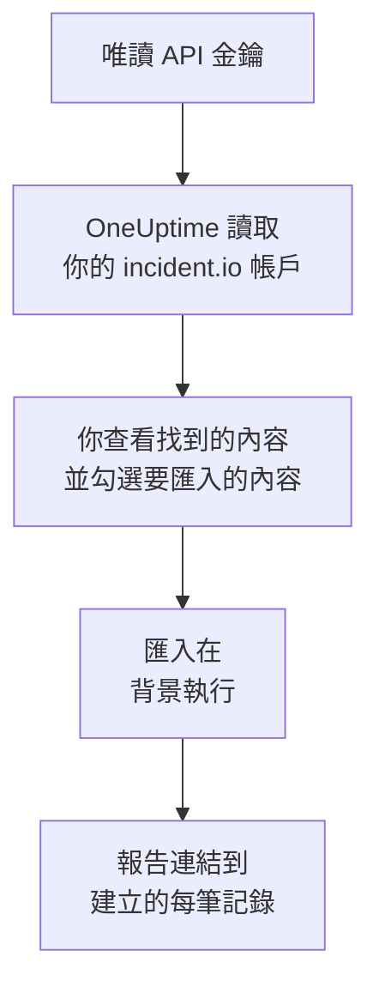

# 從 incident.io 移轉

**從其他工具匯入** 只需幾分鐘就能把你的 incident.io 設定搬到 OneUptime。使用一把唯讀的 incident.io API 金鑰，OneUptime 會讀取你的使用者、團隊、排程、上報路徑、服務和事件設定，顯示找到的內容，並建立你勾選的內容。incident.io 中的任何內容都不會變更。

:::cards
- [匯入你的帳戶](#匯入你的-incidentio-帳戶): 建立金鑰、讀取你的帳戶，並勾選要匯入的內容。
- [會匯入什麼](#會匯入什麼): 每筆 incident.io 記錄在 OneUptime 中會變成什麼。
- [完成移轉](#完成移轉): 匯入完成後要做的事。
:::

## 運作方式

- **金鑰只使用一次。** OneUptime 讀取你的帳戶期間，金鑰會加密保存；讀取一結束，無論成功與否，金鑰都會立即刪除。它不會再次顯示，也不會寫入任何記錄檔。
- **OneUptime 只讀取。** 它只呼叫 incident.io 自己的 API：`api.incident.io`。當 incident.io 要求放慢速度時，它會等待後再試。
- **在你開始匯入之前，不會建立任何內容。** 預覽會為每一項顯示：它是新的、已在 OneUptime 中（並按原樣使用）、已由先前的匯入帶入，或者無法匯入的原因。
- **再次執行絕不會重複建立。** OneUptime 會依 incident.io ID 記住每次匯入帶入的內容。在 incident.io 中新增人員或排程後再次執行，只會建立新的內容。

## 開始之前

- **一個 OneUptime 專案，以及建立所匯入內容的權限。** 專案擁有者和專案管理員可以匯入所有內容。其他角色也可以執行匯入，並匯入他們有權建立的記錄類型。其餘內容會顯示為不匯入，並附上原因。
- **一把只能檢視資料的 incident.io API 金鑰。** 匯入絕不會寫入 incident.io，因此金鑰不需要任何建立、編輯或管理權限。

## 匯入你的 incident.io 帳戶

:::steps
### 在 incident.io 中建立 API 金鑰
在 incident.io 中依序開啟 **Settings** > **API keys**，然後選擇 **Add new**。將它命名為 `OneUptime import`，只授予檢視資料的權限，不授予建立、編輯或管理權限，然後複製金鑰。

### 開啟匯入頁面
在 OneUptime 中依序開啟 **專案設定** > **從其他工具匯入**，然後選擇 **incident.io**。

### 連線 incident.io
將金鑰貼到 **incident.io API 金鑰** 中，然後選擇 **讀取我的 incident.io 帳戶**。較大的帳戶需要幾分鐘，讀取期間你可以離開頁面。

### 勾選要匯入的內容
預覽依類型分區列出找到的內容。所有將被建立的內容一開始都已勾選，但不在任何團隊、排程或上報路徑中的人員除外。每一項下面，OneUptime 會說明哪些內容不會原樣匯入。當勾選的項目用到了你未勾選的內容時，它會提示，**一併勾選** 可以把它們勾選起來。

### 開始匯入
如果要邀請人員，請在 **將新成員邀請到** 中選擇他們加入的團隊。然後選擇 **開始匯入**。匯入在背景執行：你可以離開頁面，報告會在那裡等你。
:::

報告會統計已建立、已邀請和未匯入的數量，並列出每一項及其對應記錄的連結，失敗的排在最前面。先前的匯入列在同一頁面的 **先前的匯入** 下。

## 會匯入什麼

| incident.io 中 | OneUptime 中 | 方式 |
| --- | --- | --- |
| 使用者 | 專案成員 | 依電子郵件地址比對。尚未加入專案的人會被邀請加入你選擇的團隊。已停用的使用者不會匯入。 |
| 團隊 | 團隊 | 連同成員一起建立。專案中已有同名團隊時按原樣使用，其成員保持不變。 |
| 排程 | 待命排程 | 每個輪換都會成為一個層，人員、開始時間、輪次長度和工作時間保持不變，使用排程的時區。匯入的是目前生效的輪換版本。 |
| 上報路徑 | 待命策略 | 每個層級都會成為一條上報規則，在相同的等待時間後呼叫相同的排程、使用者和團隊。重複成為策略的重複次數，分支則匯入第一條路徑。 |
| 目錄服務 | 服務 | 你的目錄中屬於服務類別的目錄類型的項目，在服務目錄中建立。已封存的項目會被略過。 |
| 嚴重性 | 事件嚴重性 | 依 incident.io 中的順序建立，最嚴重的在前。專案中已有同名嚴重性時按原樣使用。 |
| 狀態 | 事件狀態 | 分類狀態對應 OneUptime 中事件開始時的狀態，已關閉狀態對應事件解決時的狀態。進行中和已暫停的狀態會建立在「已確認」和「已解決」之間。 |
| 事件角色 | 事件角色 | 主導角色對應 OneUptime 的事件指揮官，其他角色會被建立。OneUptime 會記錄每個事件的宣告者，因此不需要報告人角色。 |
| 自訂欄位 | 事件自訂欄位 | 單選欄位變為下拉式選單，多選欄位變為多選下拉式選單，文字和連結欄位變為文字，數字欄位變為數字，並帶上它們的選項。 |

如果某個輪換中同時有多人待命，它會依每位待命人員拆分成一個 OneUptime 排程，因為 OneUptime 的排程同一時間只有一人待命。原本呼叫該排程的每個待命策略都會呼叫所有這些排程。

## 不會匯入什麼

- **事件、警示及其歷史。** OneUptime 從你的設定開始，而不是從過去的事件開始。
- **工作流程、狀態頁、警示路由和整合。** 請改為將你的監測器和警示來源指向 OneUptime，請見 [完成移轉](#完成移轉)。
- **選項來自目錄的自訂欄位，** 以及 OneUptime 中沒有對應狀態的狀態：declined、merged、canceled 和 learning。
- **排程的覆寫，以及預定在之後進行的輪換變更。** 預覽會逐一列出預定的變更，屆時你可以在 OneUptime 中進行變更。
- **OneUptime 中沒有完全對應項目的上報步驟。** 在 Slack 或 Microsoft Teams 頻道中發文的步驟會被略過，因為在 OneUptime 中由工作區通知規則完成這項工作；轉交給另一條上報路徑的步驟同樣會被略過。呼叫下一位待命人員的步驟會以 OneUptime 中最接近的方式匯入，預覽會說明有哪些變化。

## 限制

一次匯入最多建立 2,000 筆記錄：最多 500 人、200 個團隊、200 個待命排程、200 個待命策略、500 個服務、100 個事件自訂欄位，以及事件嚴重性、事件狀態和事件角色各 25 個。超出限制的內容會顯示為不匯入。再次執行匯入即可帶入其餘部分。

在 OneUptime Cloud 上，你的方案不包含的記錄會顯示為不匯入，並註明所需的方案。

預覽保留一天。只有讀取帳戶的人才能勾選內容並開始匯入。專案擁有者和專案管理員可以看到每次匯入的進度和報告。

## 完成移轉

:::steps
### 檢查待命排程
在 **待命** > **待命排程** 中開啟每個排程，檢查現在是誰待命、接下來是誰。

### 確保每個人都能被呼叫
被邀請的人接受邀請後，新增用來接收呼叫的電話號碼、電子郵件地址或行動應用程式。**待命** > **就緒狀態** 會顯示哪些人還聯絡不上。

### 將警示傳送到 OneUptime
將你的監測器和發出警示的工具指向 OneUptime，並呼叫自己一次進行測試。

### 在 incident.io 中關閉呼叫
當 OneUptime 能呼叫到正確的人後，請在 incident.io 中關閉通知，以免有人被重複呼叫。
:::

## 疑難排解

:::details incident.io 不接受 API 金鑰
請檢查你是否複製了完整的金鑰，以及它是否已在 **Settings** > **API keys** 中被刪除。然後選擇 **再試一次**。
:::

:::details 預覽中缺少某類記錄
金鑰無法讀取該類記錄，預覽頂端會說明這一點。請為金鑰授予檢視該類資料的權限，然後重新讀取帳戶。
:::

:::details 有些項目無法勾選
每一項都會說明原因：已停用的使用者、專案中已有的名稱、先前的匯入已帶入的內容，或者你無權建立、或你的方案不包含的記錄。
:::

## 後續步驟

:::cards
- [待命排程](/docs/on-call/schedules): 層、限制和交接。
- [事件狀態和嚴重性](/docs/incidents/states-and-severities): 事件經歷的狀態和嚴重性。
- [從 Opsgenie 移轉](/docs/moving-to-oneuptime/opsgenie): 從 Opsgenie 移轉團隊。
:::
